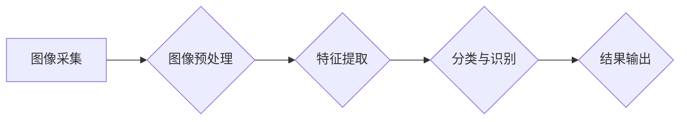

> 机器视觉、计算机视觉、图像识别、目标检测、深度学习、卷积神经网络、图像处理

## 1. 背景介绍

机器视觉，也称为计算机视觉，是人工智能领域的一个重要分支，旨在赋予计算机“看”的能力，使其能够理解和解释图像和视频信息。它融合了计算机科学、数学、统计学和心理学等多学科知识，旨在使计算机能够像人类一样感知、理解和交互于视觉世界。

随着计算机硬件性能的不断提升和深度学习算法的快速发展，机器视觉技术取得了长足的进步，在各个领域得到了广泛应用，例如：

* **图像识别:** 自动识别图像中的物体、场景和文本，例如人脸识别、物体检测、场景分类等。
* **目标跟踪:**  跟踪图像或视频中特定目标的运动轨迹，例如自动驾驶中的车辆跟踪、视频监控中的人员跟踪等。
* **三维重建:** 从图像或视频序列中重建三维场景模型，例如自动驾驶中的环境感知、虚拟现实中的场景构建等。
* **图像分割:** 将图像划分为不同的区域，例如医学图像中的肿瘤分割、卫星图像中的土地利用分类等。
* **视频分析:** 分析视频序列中的事件和行为，例如监控视频中的异常行为检测、体育比赛中的动作识别等。

## 2. 核心概念与联系

机器视觉的核心概念包括：

* **图像处理:** 对图像进行预处理、增强、滤波等操作，以提高图像质量和提取特征。
* **特征提取:** 从图像中提取关键特征，例如颜色、纹理、形状等，用于识别和分类。
* **分类与识别:** 根据提取的特征，将图像或物体进行分类和识别，例如识别图像中的物体类别、人脸识别等。
* **深度学习:** 利用深度神经网络进行图像识别、目标检测、图像分割等任务，取得了显著的成果。

**核心概念架构图:**



## 3. 核心算法原理 & 具体操作步骤

### 3.1  算法原理概述

卷积神经网络 (CNN) 是机器视觉领域最常用的算法之一，它能够自动学习图像特征，并进行图像识别、目标检测等任务。CNN 的核心思想是利用卷积操作和池化操作来提取图像特征，并通过多层神经网络进行特征学习和分类。

### 3.2  算法步骤详解

1. **输入图像:** 将图像输入到 CNN 的第一层卷积层。
2. **卷积操作:** 卷积层使用多个卷积核对图像进行卷积运算，提取图像局部特征。
3. **激活函数:** 将卷积层的输出通过激活函数进行非线性变换，提高网络的表达能力。
4. **池化操作:** 池化层对卷积层的输出进行下采样，减少特征图的大小，提高网络的鲁棒性。
5. **全连接层:** 将池化层的输出连接到全连接层，进行分类或回归。
6. **输出结果:** 全连接层的输出经过 softmax 函数进行归一化，得到各个类别的概率分布，最终输出识别结果。

### 3.3  算法优缺点

**优点:**

* 自动学习图像特征，无需人工特征工程。
* 能够处理高维图像数据。
* 具有较高的识别精度。

**缺点:**

* 训练数据量大，训练时间长。
* 参数量大，计算量大。
* 对数据噪声敏感。

### 3.4  算法应用领域

CNN 广泛应用于图像识别、目标检测、图像分割、视频分析等领域，例如：

* **人脸识别:** 用于身份验证、人脸搜索等应用。
* **物体检测:** 用于自动驾驶、安防监控等应用。
* **医学图像分析:** 用于肿瘤检测、疾病诊断等应用。

## 4. 数学模型和公式 & 详细讲解 & 举例说明

### 4.1  数学模型构建

CNN 的数学模型主要包括卷积操作、池化操作和激活函数。

**卷积操作:**

$$
y_{i,j} = \sum_{m=0}^{M-1} \sum_{n=0}^{N-1} x_{i+m,j+n} * w_{m,n} + b
$$

其中：

* $y_{i,j}$ 是卷积核输出的像素值。
* $x_{i+m,j+n}$ 是输入图像的像素值。
* $w_{m,n}$ 是卷积核的权重值。
* $b$ 是偏置项。

**池化操作:**

常用的池化操作是最大池化，其原理是将输入图像划分为若干个区域，每个区域选取最大值作为输出。

**激活函数:**

常用的激活函数包括 sigmoid 函数、ReLU 函数等。

### 4.2  公式推导过程

卷积操作的公式推导过程可以参考相关机器学习教材。

### 4.3  案例分析与讲解

以人脸识别为例，CNN 可以学习到人脸的特征，例如眼睛、鼻子、嘴巴等，并将其用于识别不同的人脸。

## 5. 项目实践：代码实例和详细解释说明

### 5.1  开发环境搭建

使用 Python 语言和 TensorFlow 或 PyTorch 深度学习框架进行开发。

### 5.2  源代码详细实现

```python
# 使用 TensorFlow 框架实现一个简单的 CNN 模型

import tensorflow as tf

# 定义模型结构
model = tf.keras.models.Sequential([
    tf.keras.layers.Conv2D(32, (3, 3), activation='relu', input_shape=(28, 28, 1)),
    tf.keras.layers.MaxPooling2D((2, 2)),
    tf.keras.layers.Conv2D(64, (3, 3), activation='relu'),
    tf.keras.layers.MaxPooling2D((2, 2)),
    tf.keras.layers.Flatten(),
    tf.keras.layers.Dense(10, activation='softmax')
])

# 编译模型
model.compile(optimizer='adam',
              loss='sparse_categorical_crossentropy',
              metrics=['accuracy'])

# 训练模型
model.fit(x_train, y_train, epochs=10)

# 评估模型
loss, accuracy = model.evaluate(x_test, y_test)
print('Test loss:', loss)
print('Test accuracy:', accuracy)
```

### 5.3  代码解读与分析

* 使用 TensorFlow 框架构建一个简单的 CNN 模型。
* 模型包含两层卷积层、两层最大池化层、一层 Flatten 层和一层全连接层。
* 使用 Adam 优化器、交叉熵损失函数和准确率作为评估指标。
* 训练模型并评估模型性能。

### 5.4  运行结果展示

训练完成后，可以查看模型的训练和测试准确率，以及损失函数的变化趋势。

## 6. 实际应用场景

### 6.1  自动驾驶

* **环境感知:** 利用机器视觉识别道路、车辆、行人等物体，构建周围环境模型。
* **目标跟踪:** 跟踪车辆、行人等目标的运动轨迹，避免碰撞。
* **交通信号识别:**识别交通信号灯的颜色和状态，控制车辆行驶。

### 6.2  医疗诊断

* **肿瘤检测:** 从医学图像中识别肿瘤区域，辅助医生诊断。
* **疾病诊断:** 分析患者的影像数据，辅助医生诊断疾病。
* **手术辅助:** 提供手术过程中实时图像信息，辅助医生进行手术操作。

### 6.3  安防监控

* **人脸识别:** 用于身份验证、人员管理等应用。
* **异常行为检测:** 分析监控视频，识别异常行为，例如入侵、斗殴等。
* **车辆识别:** 用于车辆管理、停车收费等应用。

### 6.4  未来应用展望

机器视觉技术将继续发展，在更多领域得到应用，例如：

* **智能家居:** 利用机器视觉实现智能家居控制，例如语音控制、图像识别控制等。
* **工业自动化:** 利用机器视觉实现工业自动化生产，例如缺陷检测、质量控制等。
* **虚拟现实:** 利用机器视觉构建更加逼真的虚拟现实场景。

## 7. 工具和资源推荐

### 7.1  学习资源推荐

* **书籍:**
    * 《深度学习》
    * 《计算机视觉：算法与应用》
* **在线课程:**
    * Coursera: 深度学习
    * Udacity: 计算机视觉
* **博客:**
    * TensorFlow Blog
    * PyTorch Blog

### 7.2  开发工具推荐

* **TensorFlow:** 开源深度学习框架。
* **PyTorch:** 开源深度学习框架。
* **OpenCV:** 开源计算机视觉库。

### 7.3  相关论文推荐

* **AlexNet:** ImageNet Classification with Deep Convolutional Neural Networks
* **VGGNet:** Very Deep Convolutional Networks for Large-Scale Image Recognition
* **ResNet:** Deep Residual Learning for Image Recognition

## 8. 总结：未来发展趋势与挑战

### 8.1  研究成果总结

机器视觉技术取得了长足的进步，在图像识别、目标检测、图像分割等领域取得了显著的成果。

### 8.2  未来发展趋势

* **更深更广的网络结构:** 研究更深、更广的网络结构，提高模型的表达能力和识别精度。
* **迁移学习:** 利用预训练模型进行迁移学习，减少训练数据量和训练时间。
* **实时性:** 研究更高效的算法和硬件架构，提高机器视觉系统的实时性。
* **解释性:** 研究更具解释性的机器视觉模型，提高模型的可解释性和可信度。

### 8.3  面临的挑战

* **数据标注:** 高质量的标注数据是机器视觉模型训练的基础，数据标注成本高，效率低。
* **计算资源:** 训练大型机器视觉模型需要大量的计算资源，成本高昂。
* **模型鲁棒性:** 机器视觉模型对数据噪声和环境变化敏感，需要提高模型的鲁棒性。

### 8.4  研究展望

未来，机器视觉技术将继续发展，在更多领域得到应用，为人类社会带来更多便利和福祉。


## 9. 附录：常见问题与解答

**Q1: 什么是机器视觉？**

**A1:** 机器视觉是指赋予计算机“看”的能力，使其能够理解和解释图像和视频信息。

**Q2: 机器视觉有哪些应用场景？**

**A2:** 机器视觉应用场景广泛，例如：图像识别、目标检测、三维重建、图像分割、视频分析等。

**Q3: 机器视觉算法有哪些？**

**A3:** 常用的机器视觉算法包括卷积神经网络 (CNN)、支持向量机 (SVM)、随机森林等。

**Q4: 如何学习机器视觉？**

**A4:** 可以学习相关书籍、在线课程、博客等资源，并进行实践项目。

**Q5: 机器视觉技术面临哪些挑战？**

**A5:** 机器视觉技术面临的数据标注成本高、计算资源需求大、模型鲁棒性差等挑战。


作者：禅与计算机程序设计艺术 / Zen and the Art of Computer Programming 
<end_of_turn>