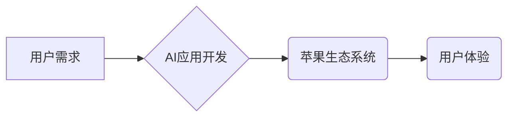

>  * 人工智能
>  * 苹果
>  * 应用开发
>  * 用户体验
>  * 伦理问题
>  * 未来趋势

## 1. 背景介绍

近年来，人工智能（AI）技术飞速发展，已渗透到生活的方方面面。苹果公司作为科技巨头，也积极布局AI领域，并将其融入到其产品和服务中。从Siri语音助手到Face ID人脸识别，苹果一直在探索AI技术的应用，为用户提供更便捷、更智能的体验。

然而，随着AI技术的普及，也引发了一些新的问题和挑战。例如，如何确保AI应用的安全性、可靠性和公平性？如何保护用户隐私？如何避免AI技术被滥用？这些问题都需要我们认真思考和探讨。

## 2. 核心概念与联系

### 2.1  人工智能（AI）

人工智能是指模拟人类智能行为的计算机系统。它涵盖了多种技术，例如机器学习、深度学习、自然语言处理等。

### 2.2  苹果生态系统

苹果拥有庞大的用户群体和完善的生态系统，包括iOS、macOS、watchOS等操作系统，以及App Store应用商店。

### 2.3  AI应用开发

苹果为开发者提供了丰富的工具和框架，例如Core ML、Create ML等，方便开发者将AI技术集成到应用中。

**Mermaid 流程图**



## 3. 核心算法原理 & 具体操作步骤

### 3.1  算法原理概述

机器学习是AI领域的核心技术之一，它通过算法训练模型，使模型能够从数据中学习规律，并做出预测或决策。

### 3.2  算法步骤详解

1. **数据收集和预处理:** 收集相关数据，并进行清洗、转换、特征提取等预处理工作。
2. **模型选择:** 根据任务需求选择合适的机器学习算法，例如线性回归、逻辑回归、决策树、支持向量机等。
3. **模型训练:** 使用训练数据训练模型，调整模型参数，使模型能够准确地预测或决策。
4. **模型评估:** 使用测试数据评估模型的性能，例如准确率、召回率、F1-score等。
5. **模型部署:** 将训练好的模型部署到实际应用场景中，用于预测或决策。

### 3.3  算法优缺点

**优点:**

* 自动学习，无需人工编程。
* 能够处理复杂的数据关系。
* 性能不断提升。

**缺点:**

* 需要大量的数据进行训练。
* 训练过程耗时和耗能。
* 模型解释性较差。

### 3.4  算法应用领域

机器学习算法广泛应用于各个领域，例如：

* **图像识别:** 人脸识别、物体检测、图像分类等。
* **自然语言处理:** 语音识别、机器翻译、文本摘要等。
* **推荐系统:** 商品推荐、内容推荐等。
* **金融领域:** 风险评估、欺诈检测等。

## 4. 数学模型和公式 & 详细讲解 & 举例说明

### 4.1  数学模型构建

机器学习模型通常是一个复杂的数学函数，它将输入数据映射到输出结果。例如，线性回归模型的数学表达式为：

$$y = w_0 + w_1x_1 + w_2x_2 + ... + w_nx_n$$

其中：

* $y$ 是输出结果。
* $w_0, w_1, w_2, ..., w_n$ 是模型参数。
* $x_1, x_2, ..., x_n$ 是输入特征。

### 4.2  公式推导过程

模型参数的学习过程通常使用梯度下降算法。梯度下降算法的目标是找到使模型预测误差最小的参数值。

梯度下降算法的公式为：

$$w_i = w_i - \alpha \frac{\partial Loss}{\partial w_i}$$

其中：

* $w_i$ 是模型参数。
* $\alpha$ 是学习率。
* $\frac{\partial Loss}{\partial w_i}$ 是损失函数对参数 $w_i$ 的梯度。

### 4.3  案例分析与讲解

例如，假设我们有一个线性回归模型，用于预测房价。输入特征包括房屋面积、房间数量等，输出结果是房价。

我们可以使用梯度下降算法训练模型，使模型能够准确地预测房价。

## 5. 项目实践：代码实例和详细解释说明

### 5.1  开发环境搭建

* 操作系统：macOS
* 开发工具：Xcode
* 编程语言：Swift

### 5.2  源代码详细实现

```swift
import CoreML

// 定义模型输入和输出类型
struct Input {
    var area: Double
    var rooms: Int
}

struct Output {
    var price: Double
}

// 加载模型
let model = try HousePriceModel(configuration: MLModelConfiguration())

// 创建输入数据
let input = Input(area: 100, rooms: 2)

// 预测房价
let output = try model.prediction(input: input)

// 打印预测结果
print("预测房价: \$output.price)")
```

### 5.3  代码解读与分析

* 代码首先导入CoreML框架，用于加载和使用机器学习模型。
* 然后定义模型输入和输出类型，例如输入数据包括房屋面积和房间数量，输出结果是房价。
* 使用`try HousePriceModel(configuration: MLModelConfiguration())`加载预训练的房价预测模型。
* 创建输入数据，并使用`try model.prediction(input: input)`调用模型进行预测。
* 最后打印预测结果。

### 5.4  运行结果展示

运行代码后，会输出预测的房价。例如，如果输入数据为房屋面积100平方米，房间数量2间，则预测结果可能为500万元。

## 6. 实际应用场景

### 6.1  智能家居

AI技术可以应用于智能家居，例如智能语音助手、智能照明、智能安防等，为用户提供更便捷、更舒适的生活体验。

### 6.2  医疗保健

AI技术可以应用于医疗保健领域，例如疾病诊断、药物研发、个性化治疗等，提高医疗效率和质量。

### 6.3  金融服务

AI技术可以应用于金融服务领域，例如风险评估、欺诈检测、客户服务等，提高金融服务的安全性、效率和客户体验。

### 6.4  未来应用展望

随着AI技术的不断发展，其应用场景将更加广泛，例如自动驾驶、机器人、虚拟现实等。

## 7. 工具和资源推荐

### 7.1  学习资源推荐

* **在线课程:** Coursera、edX、Udacity等平台提供丰富的AI课程。
* **书籍:** 《深度学习》、《机器学习实战》等书籍。
* **开源项目:** TensorFlow、PyTorch等开源项目。

### 7.2  开发工具推荐

* **编程语言:** Python、Swift、Java等。
* **机器学习框架:** TensorFlow、PyTorch、Scikit-learn等。
* **云平台:** AWS、Azure、GCP等云平台提供AI开发工具和服务。

### 7.3  相关论文推荐

* **《ImageNet Classification with Deep Convolutional Neural Networks》**
* **《Attention Is All You Need》**
* **《BERT: Pre-training of Deep Bidirectional Transformers for Language Understanding》**

## 8. 总结：未来发展趋势与挑战

### 8.1  研究成果总结

近年来，AI技术取得了显著的进展，例如图像识别、自然语言处理等领域取得了突破性进展。

### 8.2  未来发展趋势

* **模型规模和能力的提升:** 未来AI模型将更加强大，能够处理更复杂的任务。
* **边缘计算的普及:** AI计算将更加靠近数据源，提高效率和实时性。
* **AI伦理和安全问题的关注:** 随着AI技术的普及，伦理和安全问题将更加重要。

### 8.3  面临的挑战

* **数据获取和隐私保护:** AI模型需要大量数据进行训练，如何获取高质量数据并保护用户隐私是一个挑战。
* **模型解释性和可信度:** 许多AI模型是黑箱模型，难以解释其决策过程，这降低了模型的可信度。
* **算法偏见和公平性:** AI算法可能存在偏见，导致不公平的结果，需要进行公平性评估和改进。

### 8.4  研究展望

未来，AI研究将更加注重模型的可解释性、公平性、安全性以及与人类的协作。


## 9. 附录：常见问题与解答

### 9.1  Q1: 如何选择合适的AI算法？

**A1:** 选择合适的AI算法取决于具体的应用场景和数据特点。例如，对于分类任务，可以考虑使用决策树、支持向量机等算法；对于回归任务，可以考虑使用线性回归、逻辑回归等算法。

### 9.2  Q2: 如何评估AI模型的性能？

**A2:** AI模型的性能可以使用多种指标进行评估，例如准确率、召回率、F1-score等。

### 9.3  Q3: 如何避免AI算法的偏见？

**A3:** 避免AI算法的偏见需要从数据收集、模型训练、模型评估等各个环节进行控制。例如，可以使用多样化的训练数据，并进行公平性评估和改进。


作者：禅与计算机程序设计艺术 / Zen and the Art of Computer Programming 
<end_of_turn>