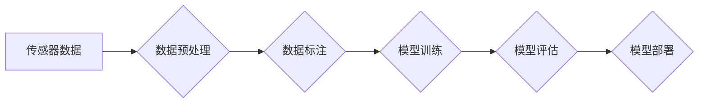

> 特斯拉，端到端模型，数据规模，深度学习，自动驾驶，计算机视觉，数据标注，训练数据，模型性能

## 1. 背景介绍

特斯拉作为全球领先的电动汽车和自动驾驶技术公司，一直致力于推动自动驾驶技术的进步。其核心技术之一是端到端模型，这种模型能够直接从传感器数据中学习驾驶策略，无需人工设计复杂的中间特征。端到端模型的训练需要海量的数据，而特斯拉拥有庞大的数据积累，为其自动驾驶系统的开发提供了坚实的基础。

## 2. 核心概念与联系

**2.1 端到端模型**

端到端模型是一种机器学习模型，它将输入数据直接映射到输出结果，中间不经过人工设计的特征提取步骤。这种模型能够学习到数据中的复杂特征，并直接生成驾驶决策。

**2.2 数据规模与模型性能**

数据规模是深度学习模型训练的关键因素之一。数据规模越大，模型能够学习到的特征越丰富，模型性能也就越好。对于自动驾驶系统来说，数据规模直接影响着模型的安全性、可靠性和泛化能力。

**2.3 特斯拉数据优势**

特斯拉拥有庞大的数据积累，包括来自其车辆的传感器数据、驾驶记录、地图数据等。这些数据涵盖了各种驾驶场景和路况，为训练端到端模型提供了丰富的训练样本。

**2.4 数据标注**

为了训练端到端模型，需要对数据进行标注，即为数据添加相应的标签，例如驾驶决策、障碍物位置等。特斯拉拥有专业的标注团队，负责对数据进行标注，确保数据的质量和准确性。

**Mermaid 流程图**



## 3. 核心算法原理 & 具体操作步骤

**3.1 算法原理概述**

特斯拉的端到端模型主要基于深度神经网络，例如卷积神经网络（CNN）和循环神经网络（RNN）。这些网络能够学习到数据中的复杂特征，并生成驾驶决策。

**3.2 算法步骤详解**

1. **数据预处理:** 将传感器数据进行预处理，例如降噪、去畸变等，以提高数据的质量。
2. **数据标注:** 对预处理后的数据进行标注，添加相应的标签，例如驾驶决策、障碍物位置等。
3. **模型训练:** 使用标注好的数据训练深度神经网络模型，通过反向传播算法不断调整模型参数，使模型能够准确地预测驾驶决策。
4. **模型评估:** 使用测试数据评估模型的性能，例如准确率、召回率等。
5. **模型部署:** 将训练好的模型部署到车辆中，用于实时驾驶决策。

**3.3 算法优缺点**

**优点:**

* 能够学习到数据中的复杂特征，提高模型性能。
* 不需要人工设计复杂的中间特征，简化了模型设计过程。
* 能够适应各种驾驶场景和路况。

**缺点:**

* 训练数据量大，需要大量的计算资源和时间。
* 模型解释性差，难以理解模型的决策过程。
* 对数据质量要求高，数据标注错误会影响模型性能。

**3.4 算法应用领域**

端到端模型在自动驾驶领域有着广泛的应用，例如：

* **路径规划:** 预测车辆行驶路径。
* **障碍物检测:** 检测道路上的障碍物，例如行人、车辆、路标等。
* **车道保持:** 保持车辆在车道内行驶。
* **自动泊车:** 自动完成车辆的泊车操作。

## 4. 数学模型和公式 & 详细讲解 & 举例说明

**4.1 数学模型构建**

端到端模型的数学模型通常是一个多层神经网络，每个神经元都接收来自前一层神经元的输入，并通过激活函数进行处理，输出到下一层神经元。

**4.2 公式推导过程**

神经网络的训练过程是通过反向传播算法来实现的。反向传播算法的核心思想是通过计算损失函数的梯度，来更新模型参数，使模型能够更好地拟合训练数据。

**损失函数:**

$$L = \frac{1}{N} \sum_{i=1}^{N} \left\| y_i - \hat{y}_i \right\|^2$$

其中：

* $L$ 是损失函数
* $N$ 是训练样本的数量
* $y_i$ 是第 $i$ 个样本的真实标签
* $\hat{y}_i$ 是第 $i$ 个样本的预测标签

**梯度下降算法:**

$$\theta = \theta - \alpha \nabla L$$

其中：

* $\theta$ 是模型参数
* $\alpha$ 是学习率
* $\nabla L$ 是损失函数的梯度

**4.3 案例分析与讲解**

假设我们训练一个端到端模型来预测车辆行驶路径。训练数据包括车辆的传感器数据和对应的行驶路径。模型的输入是传感器数据，输出是车辆行驶路径。

通过反向传播算法，我们可以计算损失函数的梯度，并更新模型参数，使模型能够更好地预测车辆行驶路径。

## 5. 项目实践：代码实例和详细解释说明

**5.1 开发环境搭建**

* 操作系统：Ubuntu 20.04
* 编程语言：Python 3.8
* 深度学习框架：TensorFlow 2.0

**5.2 源代码详细实现**

```python
import tensorflow as tf

# 定义模型结构
model = tf.keras.models.Sequential([
    tf.keras.layers.Conv2D(32, (3, 3), activation='relu', input_shape=(64, 64, 3)),
    tf.keras.layers.MaxPooling2D((2, 2)),
    tf.keras.layers.Conv2D(64, (3, 3), activation='relu'),
    tf.keras.layers.MaxPooling2D((2, 2)),
    tf.keras.layers.Flatten(),
    tf.keras.layers.Dense(10, activation='softmax')
])

# 编译模型
model.compile(optimizer='adam',
              loss='sparse_categorical_crossentropy',
              metrics=['accuracy'])

# 训练模型
model.fit(x_train, y_train, epochs=10)

# 评估模型
loss, accuracy = model.evaluate(x_test, y_test)
print('Loss:', loss)
print('Accuracy:', accuracy)
```

**5.3 代码解读与分析**

这段代码定义了一个简单的卷积神经网络模型，用于分类任务。模型包含两个卷积层、两个最大池化层、一个全连接层和一个输出层。

* `tf.keras.layers.Conv2D`：卷积层，用于提取图像特征。
* `tf.keras.layers.MaxPooling2D`：最大池化层，用于降低特征图的尺寸，提高模型的鲁棒性。
* `tf.keras.layers.Flatten`：将多维特征图展平为一维向量。
* `tf.keras.layers.Dense`：全连接层，用于分类。

**5.4 运行结果展示**

训练完成后，我们可以使用 `model.evaluate()` 函数评估模型的性能。评估结果包括损失函数值和准确率。

## 6. 实际应用场景

特斯拉的端到端模型已应用于其自动驾驶系统中，例如：

* **自动驾驶辅助功能:** 辅助驾驶员完成一些驾驶任务，例如车道保持、自动变道等。
* **自动驾驶测试:** 在封闭环境中测试自动驾驶系统的性能。
* **自动驾驶开发:** 为开发新的自动驾驶功能提供数据和模型。

**6.4 未来应用展望**

随着数据规模的不断增长和算法的不断改进，端到端模型在自动驾驶领域将发挥更重要的作用，例如：

* **完全自动驾驶:** 实现完全自动驾驶，无需驾驶员干预。
* **个性化驾驶体验:** 根据驾驶员的喜好和习惯，提供个性化的驾驶体验。
* **智能交通管理:** 与其他车辆和交通设施协同工作，提高交通效率和安全性。

## 7. 工具和资源推荐

**7.1 学习资源推荐**

* **书籍:**
    * 深度学习
    * 构建深度学习模型
* **在线课程:**
    * Coursera: 深度学习
    * Udacity: 自动驾驶工程师

**7.2 开发工具推荐**

* **TensorFlow:** 开源深度学习框架
* **PyTorch:** 开源深度学习框架
* **OpenCV:** 图像处理库

**7.3 相关论文推荐**

* End to End Learning for Self-Driving Cars
* Deep Reinforcement Learning for Autonomous Driving

## 8. 总结：未来发展趋势与挑战

**8.1 研究成果总结**

特斯拉的端到端模型在自动驾驶领域取得了显著的成果，为自动驾驶技术的进步做出了重要贡献。

**8.2 未来发展趋势**

未来，端到端模型将朝着以下方向发展：

* **模型规模更大:** 训练更大型的模型，以提高模型性能。
* **数据质量更高:** 采集更高质量的数据，以提高模型的鲁棒性和泛化能力。
* **模型解释性更强:** 开发能够解释模型决策过程的方法，提高模型的可信度。

**8.3 面临的挑战**

端到端模型的发展还面临着一些挑战：

* **数据标注成本高:** 数据标注是训练端到端模型的关键步骤，但数据标注成本很高。
* **模型安全性和可靠性:** 端到端模型的决策过程难以解释，这可能会导致安全性和可靠性问题。
* **模型泛化能力:** 端到端模型的泛化能力有限，难以适应各种驾驶场景和路况。

**8.4 研究展望**

未来，我们需要继续研究如何降低数据标注成本、提高模型的安全性和可靠性、增强模型的泛化能力，以推动端到端模型在自动驾驶领域的应用。

## 9. 附录：常见问题与解答

**9.1 Q: 端到端模型的训练数据量有多大？**

**A:** 特斯拉的端到端模型训练数据量非常庞大，具体数量未公开。

**9.2 Q: 端到端模型的训练时间有多长？**

**A:** 端到端模型的训练时间取决于模型规模、数据规模和计算资源等因素，通常需要数周甚至数月。

**9.3 Q: 端到端模型的安全性如何保证？**

**A:** 特斯拉对端到端模型的安全性进行了严格的测试和评估，并采取了多种措施来确保模型的安全性和可靠性。

**9.4 Q: 端到端模型的未来发展趋势是什么？**

**A:** 未来，端到端模型将朝着模型规模更大、数据质量更高、模型解释性更强等方向发展。


作者：禅与计算机程序设计艺术 / Zen and the Art of Computer Programming 
<end_of_turn>