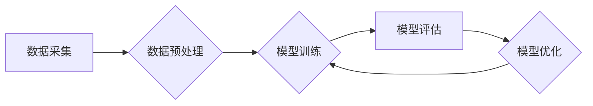

> 生成式AI, 数据驱动, 场景应用, 模型训练, 数据质量, 算法优化, 伦理问题

## 1. 背景介绍

前几部分，我们探讨了生成式AI的定义、发展历程、技术原理以及应用前景。从文本生成、图像创作到代码编写，生成式AI展现出强大的潜力，引发了广泛的关注和热议。然而，在技术飞速发展的同时，也涌现出一些质疑的声音：生成式AI是否只是一场泡沫？其应用场景是否真的像想象中那样广泛？

## 2. 核心概念与联系

生成式AI的核心在于利用深度学习算法，从海量数据中学习模式和规律，并生成新的、类似于训练数据的内容。其核心概念包括：

* **数据驱动**: 生成式AI的训练和性能完全依赖于数据的质量和数量。高质量、丰富的数据是生成式AI成功的关键。
* **模型训练**: 通过复杂的算法和大量的计算资源，将数据输入到模型中，使其学习数据中的模式和规律。
* **生成过程**: 训练好的模型能够根据输入的提示或条件，生成新的内容，例如文本、图像、音频等。

**Mermaid 流程图**



## 3. 核心算法原理 & 具体操作步骤

### 3.1  算法原理概述

生成式AI常用的算法包括：

* **变分自编码器(VAE)**: 通过编码器将数据压缩成低维表示，然后通过解码器将其还原成原始数据，从而学习数据的潜在结构。
* **生成对抗网络(GAN)**: 由两个网络组成，一个是生成器，负责生成新的数据；另一个是鉴别器，负责判断数据是否为真实数据。两者相互竞争，最终生成器能够生成逼真的伪造数据。
* **Transformer**: 基于注意力机制的网络结构，能够捕捉长距离依赖关系，在文本生成等任务中表现出色。

### 3.2  算法步骤详解

以GAN为例，其训练过程如下：

1. **初始化**: 生成器和鉴别器网络参数随机初始化。
2. **生成器训练**: 生成器根据随机噪声生成伪造数据，并将其输入到鉴别器中。
3. **鉴别器训练**: 鉴别器根据真实数据和伪造数据进行判别，并更新其参数以提高判别能力。
4. **反馈**: 鉴别器的判别结果反馈给生成器，生成器根据反馈调整其参数，生成更逼真的伪造数据。
5. **迭代**: 重复步骤2-4，直到生成器能够生成与真实数据难以区分的伪造数据。

### 3.3  算法优缺点

**优点**:

* 生成逼真的数据，能够满足各种应用场景的需求。
* 能够学习数据的复杂模式和规律，生成具有创造性的内容。

**缺点**:

* 训练过程复杂，需要大量的计算资源和时间。
* 模型容易过拟合，需要精心设计训练策略。
* 存在生成恶意内容的风险，需要加强伦理监管。

### 3.4  算法应用领域

* **文本生成**: 自动写作、机器翻译、对话系统等。
* **图像生成**: 图像合成、图像修复、艺术创作等。
* **音频生成**: 语音合成、音乐创作、音效制作等。
* **代码生成**: 代码自动补全、代码生成器等。

## 4. 数学模型和公式 & 详细讲解 & 举例说明

### 4.1  数学模型构建

GAN的数学模型主要包括两个部分：生成器G和鉴别器D。

* **生成器G**: 接收随机噪声z作为输入，输出生成的数据x。

* **鉴别器D**: 接收数据x作为输入，输出判断x是否为真实数据的概率。

### 4.2  公式推导过程

* **生成器损失函数**: 

$$
L_G(G,D) = E_{z \sim p_z(z)}[log(D(G(z)))]
$$

* **鉴别器损失函数**:

$$
L_D(D,G) = E_{x \sim p_{data}(x)}[log(D(x))] + E_{z \sim p_z(z)}[log(1 - D(G(z)))]
$$

其中：

* $p_z(z)$ 是随机噪声z的分布。
* $p_{data}(x)$ 是真实数据的分布。

### 4.3  案例分析与讲解

假设我们训练一个生成人脸图像的GAN模型。

* **训练数据**: 采集大量真实的人脸图像。
* **生成器**: 学习从随机噪声生成逼真的人脸图像。
* **鉴别器**: 学习区分真实的人脸图像和生成的人脸图像。

通过训练，生成器能够生成越来越逼真的假人脸图像，而鉴别器能够越来越准确地识别真实和假的人脸图像。

## 5. 项目实践：代码实例和详细解释说明

### 5.1  开发环境搭建

* **操作系统**: Ubuntu 20.04
* **编程语言**: Python 3.8
* **深度学习框架**: TensorFlow 2.x

### 5.2  源代码详细实现

```python
# 生成器网络结构
def generator(latent_dim, image_shape):
    # ...

# 鉴别器网络结构
def discriminator(image_shape):
    # ...

# 训练循环
for epoch in range(num_epochs):
    for batch in dataloader:
        # ...
```

### 5.3  代码解读与分析

* **生成器网络**: 负责从随机噪声生成图像。
* **鉴别器网络**: 负责判断图像是否为真实图像。
* **训练循环**: 迭代训练生成器和鉴别器网络。

### 5.4  运行结果展示

训练完成后，可以利用生成器生成新的图像，并与真实图像进行比较。

## 6. 实际应用场景

### 6.1  文本生成

* **自动写作**: 生成新闻报道、产品描述、小说等文本内容。
* **机器翻译**: 将文本从一种语言翻译成另一种语言。
* **对话系统**: 创建能够与人类进行自然对话的聊天机器人。

### 6.2  图像生成

* **图像合成**: 生成逼真的合成图像，例如将人物置入不同的场景中。
* **图像修复**: 修复损坏或模糊的图像。
* **艺术创作**: 生成具有艺术价值的图像作品。

### 6.3  音频生成

* **语音合成**: 将文本转换为语音，用于语音助手、播报系统等。
* **音乐创作**: 生成新的音乐作品，例如旋律、伴奏等。
* **音效制作**: 生成各种音效，用于游戏、电影等。

### 6.4  未来应用展望

* **个性化内容生成**: 根据用户的喜好和需求生成个性化的内容，例如新闻推荐、个性化广告等。
* **虚拟现实和增强现实**: 生成逼真的虚拟场景和增强现实内容，用于游戏、教育、医疗等领域。
* **科学研究**: 用于模拟复杂系统，加速科学发现。

## 7. 工具和资源推荐

### 7.1  学习资源推荐

* **书籍**:
    * 《深度学习》
    * 《生成对抗网络》
* **在线课程**:
    * Coursera: 深度学习
    * Udacity: 生成对抗网络

### 7.2  开发工具推荐

* **深度学习框架**: TensorFlow, PyTorch
* **图像处理库**: OpenCV
* **音频处理库**: Librosa

### 7.3  相关论文推荐

* **Generative Adversarial Networks**
* **Variational Autoencoders for Generation**
* **Attention Is All You Need**

## 8. 总结：未来发展趋势与挑战

### 8.1  研究成果总结

生成式AI技术取得了显著进展，在文本生成、图像生成、音频生成等领域展现出强大的潜力。

### 8.2  未来发展趋势

* **模型规模和性能提升**: 随着计算资源的不断发展，生成式AI模型规模将进一步扩大，性能将得到显著提升。
* **多模态生成**: 将文本、图像、音频等多种模态数据融合，实现多模态生成。
* **伦理和安全问题**: 随着生成式AI技术的应用越来越广泛，伦理和安全问题将更加突出，需要加强研究和监管。

### 8.3  面临的挑战

* **数据质量**: 生成式AI的性能依赖于数据的质量，高质量、丰富的数据仍然是关键挑战。
* **算法优化**: 现有算法仍然存在一些局限性，需要进一步优化和改进。
* **伦理和安全**: 生成式AI技术可能被用于生成恶意内容，需要加强伦理和安全监管。

### 8.4  研究展望

未来，生成式AI技术将继续发展，在更多领域发挥重要作用。我们需要加强基础研究，探索更强大的算法和模型，同时也要关注伦理和安全问题，确保生成式AI技术能够安全、负责任地应用于社会。

## 9. 附录：常见问题与解答

* **Q1**: 生成式AI的训练需要多少数据？
* **A1**: 训练生成式AI模型需要大量的训练数据，具体数量取决于模型的复杂度和应用场景。一般来说，需要至少几千到几百万个样本。
* **Q2**: 生成式AI的训练过程需要多长时间？
* **A2**: 生成式AI的训练时间取决于模型的规模、数据量和计算资源。训练一个大型的生成式AI模型可能需要几天甚至几周的时间。
* **Q3**: 生成式AI的应用场景有哪些？
* **A3**: 生成式AI的应用场景非常广泛，包括文本生成、图像生成、音频生成、代码生成等。

作者：禅与计算机程序设计艺术 / Zen and the Art of Computer Programming


<end_of_turn>