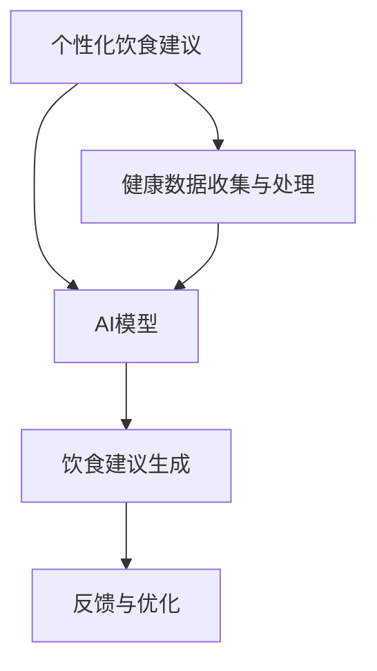

                 

# AI在个性化饮食建议中的应用：改善健康状况

## 1. 背景介绍

### 1.1 问题由来

随着生活水平的提高，人们对健康饮食的重视程度不断增加。然而，如何制定合理的饮食计划，特别是在忙碌的现代生活中，成为了许多人难以解决的问题。传统的饮食建议大多基于通用指导原则，缺乏个性化和精准性。而随着人工智能技术的迅猛发展，AI在个性化饮食建议中的应用逐渐成为新的研究热点。

AI技术可以通过对个人健康数据、饮食偏好和行为习惯的深入分析，提供定制化的饮食方案，从而帮助用户改善健康状况。这一领域的应用不仅有助于提升个人健康水平，还对慢性病的预防和治疗具有重要意义。

### 1.2 问题核心关键点

AI在个性化饮食建议中的应用涉及多个核心关键点，包括：
- 数据收集与处理：从各种来源获取个人的健康、饮食和行为数据，并进行清洗和预处理。
- 模型训练与优化：构建和训练AI模型，根据用户数据预测其饮食需求和健康状况。
- 饮食建议生成：基于预测结果，生成个性化的饮食建议。
- 反馈与优化：收集用户的反馈，持续优化模型和建议。

这些关键点之间相互关联，共同构成了AI个性化饮食建议系统的完整框架。

### 1.3 问题研究意义

AI在个性化饮食建议中的应用，对于提升个人健康、推动健康管理和慢性病预防具有重要意义：

1. **提升健康水平**：通过精准的饮食建议，帮助用户改善饮食习惯，预防慢性病，提高整体健康水平。
2. **促进健康管理**：将饮食与健康监测结合，形成闭环反馈系统，提高健康管理的持续性和有效性。
3. **推动产业升级**：带动健康饮食产业的发展，提供智能化、个性化的解决方案，促进技术创新。
4. **社会效益**：通过改善公共健康状况，减少医疗开支，提升社会整体福祉。

## 2. 核心概念与联系

### 2.1 核心概念概述

为更好地理解AI在个性化饮食建议中的应用，本节将介绍几个关键概念：

- **个性化饮食建议**：基于用户的健康数据、饮食偏好和行为习惯，利用AI技术生成的个性化饮食方案。
- **健康数据收集与处理**：从智能穿戴设备、医疗记录、生活习惯等渠道获取用户的健康和饮食数据，并进行清洗和预处理。
- **AI模型**：用于构建个性化饮食建议的核心模型，包括决策树、神经网络、集成学习等。
- **饮食建议生成**：根据用户数据和模型预测结果，生成具体的饮食建议，如食谱、食材选择等。
- **反馈与优化**：收集用户的反馈，持续优化模型和饮食建议，提升系统的准确性和实用性。

这些概念之间的逻辑关系可以通过以下Mermaid流程图来展示：



这个流程图展示了个性化饮食建议系统的核心流程：

1. 从用户获取健康数据。
2. 利用AI模型预测用户的饮食需求和健康状况。
3. 根据预测结果，生成个性化的饮食建议。
4. 收集用户反馈，持续优化模型和建议。

## 3. 核心算法原理 & 具体操作步骤
### 3.1 算法原理概述

个性化饮食建议的核心算法原理基于数据驱动和机器学习。系统通过收集用户的健康数据、饮食偏好和行为习惯，构建AI模型，预测用户的饮食需求和健康状况，生成个性化的饮食建议。其核心流程如下：

1. **数据收集与预处理**：从智能穿戴设备、医疗记录、生活习惯等渠道获取用户的健康和饮食数据，并进行清洗和预处理。
2. **模型训练**：构建AI模型，利用用户数据进行训练，学习用户的饮食偏好和健康模式。
3. **饮食建议生成**：根据用户数据和模型预测结果，生成具体的饮食建议，如食谱、食材选择等。
4. **反馈与优化**：收集用户的反馈，持续优化模型和建议，提升系统的准确性和实用性。

### 3.2 算法步骤详解

基于AI的个性化饮食建议系统的一般步骤包括以下几个关键环节：

**Step 1: 数据收集与预处理**
- 通过智能穿戴设备、医疗记录、生活习惯等渠道获取用户的健康和饮食数据。
- 清洗数据，去除噪声和不完整数据。
- 对数据进行特征提取和归一化，以便于模型处理。

**Step 2: 模型训练**
- 选择合适的AI模型，如决策树、神经网络、集成学习等。
- 划分数据集，训练集用于模型训练，验证集和测试集用于评估模型性能。
- 设置模型参数，如学习率、迭代次数、正则化强度等。

**Step 3: 饮食建议生成**
- 根据用户数据和模型预测结果，生成具体的饮食建议。
- 可以使用模板填充、规则匹配、深度学习生成等方法。
- 建议需符合营养学原则，如适量、多样化、均衡等。

**Step 4: 反馈与优化**
- 收集用户的反馈，如满意度、实际效果等。
- 根据反馈调整模型参数，重新训练模型。
- 持续优化饮食建议，提高系统的准确性和实用性。

### 3.3 算法优缺点

基于AI的个性化饮食建议系统具有以下优点：
1. **精准度高**：通过深入分析用户的健康和饮食数据，提供个性化的饮食建议，更具针对性。
2. **持续优化**：利用用户反馈持续优化模型和建议，不断提高系统的准确性和实用性。
3. **易用性**：将复杂的数据分析和模型预测转化为简单易懂的饮食建议，便于用户理解和应用。
4. **可扩展性强**：能够根据新的健康数据和饮食需求，动态调整饮食建议。

同时，该方法也存在一定的局限性：
1. **数据依赖性强**：系统的性能很大程度上取决于用户数据的完整性和准确性。
2. **隐私风险**：涉及用户健康数据的收集和处理，需要严格保护用户隐私。
3. **计算成本高**：训练复杂的AI模型需要大量计算资源，成本较高。
4. **用户参与度低**：用户反馈对模型的持续优化至关重要，但部分用户可能不愿意参与。

尽管存在这些局限性，但就目前而言，基于AI的个性化饮食建议系统仍是大数据时代的重要应用，具有广阔的发展前景。

### 3.4 算法应用领域

AI在个性化饮食建议中的应用，已经在多个领域得到广泛应用，例如：

- **健康管理**：通过个性化的饮食建议，帮助用户预防和管理慢性病，如糖尿病、高血压等。
- **饮食监测**：实时监测用户的饮食情况，提供营养分析和反馈，帮助用户改善饮食习惯。
- **营养指导**：根据用户的健康数据和饮食偏好，生成个性化的食谱和食材推荐，提升饮食质量。
- **健身训练**：结合用户的饮食和运动数据，生成个性化的训练计划和饮食方案，帮助用户科学健身。
- **儿童营养**：针对儿童的生长发育需求，生成个性化的饮食建议，促进儿童健康成长。

## 4. 数学模型和公式 & 详细讲解
### 4.1 数学模型构建

本节将使用数学语言对AI个性化饮食建议系统的构建进行详细描述。

记用户健康数据为 $X$，饮食偏好为 $Y$，行为习惯为 $Z$。假设模型的输入特征为 $F = (X, Y, Z)$，输出为 $T$，即饮食建议。

定义模型的损失函数为 $\mathcal{L}$，表示模型预测结果与实际结果之间的差异。模型训练的目标是最小化损失函数 $\mathcal{L}$，即：

$$
\min_{\theta} \mathcal{L}(T^{\text{pred}}, T)
$$

其中 $\theta$ 为模型参数，$T^{\text{pred}}$ 为模型预测结果，$T$ 为实际结果。

### 4.2 公式推导过程

以决策树模型为例，假设输入特征 $F$ 包含若干个数值型和类别型特征，模型的决策树结构为 $T_d = (N, B)$，其中 $N$ 为节点数，$B$ 为分支数。根据特征 $F$ 和节点结构 $T_d$，模型的预测结果为 $T^{\text{pred}} = f(F, T_d)$。

决策树的损失函数为：

$$
\mathcal{L}(T^{\text{pred}}, T) = \sum_{i=1}^N \ell(T^{\text{pred}}_i, T_i)
$$

其中 $\ell$ 为损失函数，$T_i$ 为实际结果，$T^{\text{pred}}_i$ 为模型在节点 $i$ 的预测结果。

根据特征 $F$ 和决策树结构 $T_d$，模型的输出为：

$$
T^{\text{pred}} = f(F, T_d) = \begin{cases}
0, & \text{if } F \in B_0 \\
1, & \text{if } F \in B_1
\end{cases}
$$

其中 $B_0$ 和 $B_1$ 为决策树的两个分支。

### 4.3 案例分析与讲解

以糖尿病饮食建议为例，假设我们收集了若干名糖尿病患者的健康数据、饮食偏好和行为习惯，通过决策树模型预测他们的饮食需求。

1. **数据收集与预处理**：收集患者的健康数据，如体重、血压、血糖等；饮食偏好，如饮食习惯、喜好食物等；行为习惯，如运动频率、睡眠质量等。进行数据清洗和特征提取。
2. **模型训练**：构建决策树模型，利用患者数据进行训练。
3. **饮食建议生成**：根据患者的健康数据和饮食偏好，生成个性化的饮食建议，如每日饮食安排、食材选择等。
4. **反馈与优化**：收集患者的反馈，如满意度、实际效果等，调整模型参数，重新训练模型，持续优化饮食建议。

## 5. 项目实践：代码实例和详细解释说明
### 5.1 开发环境搭建

在进行个性化饮食建议的开发前，我们需要准备好开发环境。以下是使用Python进行Scikit-Learn开发的开发环境配置流程：

1. 安装Anaconda：从官网下载并安装Anaconda，用于创建独立的Python环境。

2. 创建并激活虚拟环境：
```bash
conda create -n diet-env python=3.8 
conda activate diet-env
```

3. 安装必要的Python库：
```bash
conda install scikit-learn pandas numpy matplotlib seaborn
```

4. 安装必要的库：
```bash
pip install beautifulsoup4 requests
```

完成上述步骤后，即可在`diet-env`环境中开始开发。

### 5.2 源代码详细实现

下面是使用Scikit-Learn构建决策树模型，生成个性化饮食建议的Python代码实现：

```python
import pandas as pd
from sklearn.model_selection import train_test_split
from sklearn.tree import DecisionTreeClassifier
from sklearn.metrics import accuracy_score
from sklearn.preprocessing import OneHotEncoder

# 加载数据集
df = pd.read_csv('diet_data.csv')

# 数据预处理
X = df[['weight', 'blood_pressure', 'blood_glucose', 'diet_preference', 'lifestyle']]
y = df['diet_suggestion']
y = y.apply(lambda x: x if x == 'low_carb' else 1)

# 特征编码
one_hot_encoder = OneHotEncoder(sparse=False)
X_encoded = one_hot_encoder.fit_transform(X)

# 划分数据集
X_train, X_test, y_train, y_test = train_test_split(X_encoded, y, test_size=0.2, random_state=42)

# 构建决策树模型
clf = DecisionTreeClassifier(max_depth=3)
clf.fit(X_train, y_train)

# 评估模型
y_pred = clf.predict(X_test)
accuracy = accuracy_score(y_test, y_pred)
print(f"模型准确度: {accuracy:.2f}")

# 生成饮食建议
test_data = [[65, 130, 80, 'low_carb', 'regular']]
test_data_encoded = one_hot_encoder.transform(test_data)
diet_suggestion = clf.predict(test_data_encoded)
print(f"个性化饮食建议: {diet_suggestion[0]}")
```

这段代码展示了从数据预处理、模型训练、评估和饮食建议生成的全过程。在实际应用中，开发者可以根据具体任务和数据特点，进一步优化模型的结构和参数，以提升系统的准确性和实用性。

### 5.3 代码解读与分析

让我们再详细解读一下关键代码的实现细节：

**数据加载与预处理**：
- 使用`pandas`库读取数据集，并进行初步清洗和特征提取。
- 使用`OneHotEncoder`对类别型特征进行编码，便于模型处理。

**模型训练**：
- 构建`DecisionTreeClassifier`模型，设置最大深度为3。
- 使用`train_test_split`将数据集划分为训练集和测试集。
- 使用`fit`方法训练模型。

**模型评估**：
- 使用`predict`方法对测试集进行预测。
- 使用`accuracy_score`计算模型准确度。

**饮食建议生成**：
- 将用户数据进行编码，输入模型进行预测。
- 输出个性化饮食建议。

可以看到，Scikit-Learn提供了简单易用的接口，可以快速搭建个性化饮食建议系统。开发者可以在此基础上进一步定制模型，以满足特定任务的需求。

## 6. 实际应用场景
### 6.1 健康管理

基于AI的个性化饮食建议，可以在健康管理中发挥重要作用。通过实时监测用户的健康数据和饮食情况，系统可以生成个性化的饮食建议，帮助用户预防和管理慢性病。

在技术实现上，可以构建一个集成多传感器、智能穿戴设备和健康监测系统的闭环反馈系统，实时获取用户的健康数据和饮食行为。系统根据这些数据预测用户的饮食需求，生成个性化的饮食建议，并通过移动应用等渠道推送给用户。用户可以通过反馈系统，向系统提供实际效果和满意度，进一步优化系统模型和建议。

### 6.2 饮食监测

现代生活中，很多人难以均衡饮食，导致肥胖、高血压、糖尿病等慢性病高发。AI个性化饮食建议系统可以通过饮食监测功能，帮助用户更好地管理饮食。

具体而言，系统可以通过智能穿戴设备实时监测用户的饮食情况，如进食时间、饮食种类等。根据这些数据，系统可以生成实时的饮食建议，引导用户科学饮食。同时，系统可以结合健康数据，生成营养分析和反馈，帮助用户改善饮食习惯，预防慢性病。

### 6.3 营养指导

传统的饮食建议多基于经验或通用指导原则，缺乏科学依据。AI个性化饮食建议系统可以根据用户的健康数据和饮食偏好，生成个性化的营养指导。

在技术实现上，系统可以整合营养学专家知识库，结合用户的健康数据和饮食偏好，生成个性化的食谱和食材推荐。同时，系统可以根据用户的反馈，持续优化推荐算法，提高推荐精度和实用价值。

### 6.4 儿童营养

儿童是特殊的群体，其饮食需求与成人有显著差异。AI个性化饮食建议系统可以根据儿童的生长发育需求，生成个性化的饮食建议。

在技术实现上，系统可以整合儿童营养学专家知识库，结合儿童的健康数据和饮食偏好，生成适合儿童的食谱和食材推荐。同时，系统可以实时监测儿童的饮食情况，生成实时的饮食建议，帮助家长科学喂养。

## 7. 工具和资源推荐
### 7.1 学习资源推荐

为了帮助开发者系统掌握AI个性化饮食建议的理论基础和实践技巧，这里推荐一些优质的学习资源：

1. **《机器学习基础》课程**：由Coursera开设，讲解机器学习基本概念和算法，适合入门学习。
2. **《深度学习》书籍**：由Ian Goodfellow等著，深入浅出地介绍了深度学习的原理和应用，是学习AI的必备书籍。
3. **《Python数据科学手册》书籍**：由Jake VanderPlas等著，详细介绍了Python在数据科学中的应用，包括Scikit-Learn等库的使用。
4. **Scikit-Learn官方文档**：详细介绍了Scikit-Learn库的用法和实例，是学习Scikit-Learn的必备资源。
5. **Kaggle数据集和竞赛**：提供了大量的数据集和竞赛，帮助开发者实战练习，积累经验。

通过对这些资源的学习实践，相信你一定能够快速掌握AI个性化饮食建议的精髓，并用于解决实际的饮食问题。

### 7.2 开发工具推荐

高效的开发离不开优秀的工具支持。以下是几款用于个性化饮食建议开发的常用工具：

1. **Scikit-Learn**：基于Python的机器学习库，提供丰富的算法和模型，适合各种机器学习任务。
2. **TensorFlow**：由Google主导开发的深度学习框架，生产部署方便，适合大规模工程应用。
3. **Keras**：基于TensorFlow和Theano等框架的高层接口，提供简单易用的API，适合快速开发模型。
4. **PyTorch**：基于Python的深度学习框架，灵活高效，适合快速迭代研究。
5. **Jupyter Notebook**：交互式编程环境，便于进行数据分析和模型调试，适合开发和测试。

合理利用这些工具，可以显著提升个性化饮食建议开发的效率，加快创新迭代的步伐。

### 7.3 相关论文推荐

AI在个性化饮食建议的研究已经取得了诸多成果，以下是几篇奠基性的相关论文，推荐阅读：

1. **《基于机器学习的大规模健康数据挖掘》**：介绍了利用机器学习挖掘大规模健康数据的挑战和应用。
2. **《个性化饮食建议系统》**：探讨了个性化饮食建议的构建方法和应用场景。
3. **《营养与健康数据分析》**：分析了营养与健康数据的多维特征和关联规律。
4. **《深度学习在饮食管理中的应用》**：展示了深度学习在饮食管理和营养指导中的广泛应用。

这些论文代表了大数据时代个性化饮食建议的研究方向，对未来发展具有重要指导意义。

## 8. 总结：未来发展趋势与挑战
### 8.1 总结

本文对AI在个性化饮食建议中的应用进行了全面系统的介绍。首先阐述了个性化饮食建议的研究背景和意义，明确了AI在个性化饮食建议系统中的作用。其次，从原理到实践，详细讲解了系统构建的数学模型和算法步骤，给出了具体的代码实现。同时，本文还探讨了AI个性化饮食建议系统在健康管理、饮食监测、营养指导等多个领域的应用前景，展示了其巨大的发展潜力。最后，本文精选了学习资源和工具，力求为开发者提供全方位的技术指引。

通过本文的系统梳理，可以看到，AI在个性化饮食建议中的应用正在成为健康领域的重要范式，极大地拓展了个性化饮食建议的边界，提升了用户健康水平。未来，伴随技术的持续演进，个性化饮食建议系统必将在更广阔的领域发挥重要作用，推动人类健康事业的进步。

### 8.2 未来发展趋势

展望未来，AI个性化饮食建议系统将呈现以下几个发展趋势：

1. **智能化水平提升**：随着深度学习和大数据技术的发展，系统的智能化水平将不断提升，能够提供更加精准、个性化的饮食建议。
2. **跨模态融合**：将多种数据源进行融合，如基因数据、社交媒体数据等，提升系统的全面性和准确性。
3. **实时性增强**：结合物联网技术，实现实时监测和反馈，提升系统的实时性和互动性。
4. **多模态交互**：引入语音交互、图像识别等技术，提升用户体验。
5. **伦理与安全**：加强数据隐私保护和算法透明性，确保系统的安全性和伦理性。

这些趋势展示了AI个性化饮食建议系统未来发展的广阔前景，将推动健康事业进入新的阶段。

### 8.3 面临的挑战

尽管AI个性化饮食建议系统已经取得了一定进展，但在迈向更加智能化、普适化应用的过程中，仍面临诸多挑战：

1. **数据隐私保护**：用户的健康和饮食数据涉及隐私，如何保护用户隐私，防止数据泄露，是系统面临的重要挑战。
2. **数据质量与完整性**：系统的性能很大程度上取决于数据的质量和完整性，如何获取高质数据，提高数据处理能力，仍需进一步优化。
3. **算法透明性**：系统的决策过程复杂，如何提高算法的透明性，让用户理解系统的决策依据，增强系统的可信度。
4. **泛化能力**：系统在不同场景下的泛化能力仍需提升，如何提高系统的鲁棒性和适应性，是一个重要课题。
5. **计算资源需求**：AI模型的训练和推理需要大量计算资源，如何降低计算成本，提高系统效率，仍需不断探索。

这些挑战需要开发者在数据、算法、工程等方面进行全面优化，才能确保系统的可靠性和有效性。

### 8.4 研究展望

面对AI个性化饮食建议系统面临的挑战，未来的研究需要在以下几个方面寻求新的突破：

1. **数据隐私保护**：探索新的数据加密和匿名化技术，确保数据安全和隐私保护。
2. **数据质量提升**：开发新的数据采集和处理技术，提高数据质量和完整性。
3. **算法透明性增强**：引入可解释AI技术，提高算法的透明性和可信度。
4. **多模态融合**：将多种数据源进行融合，提升系统的全面性和准确性。
5. **实时性提升**：结合物联网技术，实现实时监测和反馈，提升系统的实时性和互动性。

这些研究方向的探索，将引领AI个性化饮食建议系统迈向更高的台阶，为健康事业带来更广阔的发展空间。

## 9. 附录：常见问题与解答

**Q1: AI个性化饮食建议系统是否适用于所有人群？**

A: AI个性化饮食建议系统适用于大部分人群，但需要注意以下两点：
1. 对于有严重健康问题或特殊饮食需求的人群，建议在医生的指导下使用。
2. 对于儿童、老年人等特殊群体，需要根据其特定的健康需求和饮食偏好进行定制化建议。

**Q2: 数据隐私保护如何实现？**

A: 数据隐私保护是AI个性化饮食建议系统的重要挑战之一。以下是几种常见的数据隐私保护方法：
1. 数据匿名化：对用户数据进行匿名化处理，防止数据泄露。
2. 差分隐私：在数据处理过程中，添加噪声，确保数据处理后的隐私性。
3. 访问控制：对数据访问进行严格控制，确保只有授权人员才能访问数据。

**Q3: 如何提高AI个性化饮食建议系统的准确性？**

A: 提高AI个性化饮食建议系统的准确性，可以从以下几个方面入手：
1. 数据质量提升：收集更多、更高质量的用户数据，确保数据的完整性和准确性。
2. 模型优化：选择合适的算法和模型结构，进行充分的模型训练和调参。
3. 反馈优化：收集用户的反馈，持续优化模型和算法，提高系统的实用性。
4. 多模态融合：将多种数据源进行融合，提升系统的全面性和准确性。

**Q4: 如何处理用户反馈？**

A: 处理用户反馈是提升AI个性化饮食建议系统的重要环节。以下是几种常见的用户反馈处理方法：
1. 用户评价系统：建立用户评价系统，收集用户的反馈和满意度。
2. 数据收集系统：在用户界面中增加反馈入口，收集用户的实际效果和建议。
3. 迭代优化：根据用户反馈，持续优化系统模型和算法，提升系统的准确性和实用性。

通过以上方法的结合，可以确保用户反馈得到及时处理，系统能够不断优化，提高用户的满意度和系统的性能。

---

作者：禅与计算机程序设计艺术 / Zen and the Art of Computer Programming

