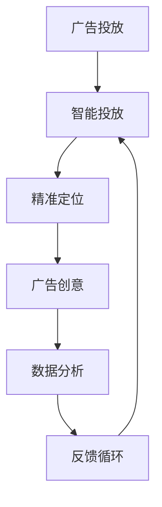

                 

# AI在广告领域的应用：精准定位与创意

> 关键词：AI广告,广告投放,智能投放,广告创意,精准定位

## 1. 背景介绍

随着互联网的普及和移动互联网的发展，广告业务已经成为了互联网公司的重要营收来源。在竞争日趋激烈的广告市场，如何高效地进行广告投放，同时保证广告内容的质量和创意性，成为了广告主和广告公司共同的挑战。AI技术的崛起，为解决这些问题带来了新的希望，AI广告投放系统（AI Ads Platform）应运而生。AI广告投放系统利用机器学习算法和大数据分析技术，实现了广告投放的智能化、个性化和创意化，极大提升了广告效果和投放效率，成为互联网公司广告业务的核心竞争力之一。

## 2. 核心概念与联系

### 2.1 核心概念概述

AI广告投放系统是一个集成了机器学习、数据分析、创意生成和投放优化等技术的综合性广告投放平台。以下是与AI广告投放系统密切相关的几个核心概念：

- **广告投放（Ad Placement）**：指将广告内容展示给潜在用户的策略和过程。广告投放的目的是提高广告曝光量、点击率和转化率，从而实现更高的广告投资回报率（ROI）。
- **智能投放（Programmatic Ads）**：指利用自动化工具和技术，通过程序化方式进行广告投放的过程。智能投放可以大幅提高广告投放的效率和精准度。
- **精准定位（Targeting）**：指根据用户特征、行为数据等信息，精准识别出潜在用户，并进行定向投放的策略。精准定位能够最大化广告的覆盖效果，减少浪费。
- **广告创意（Ad Creativity）**：指广告内容的创意设计，包括文案、图片、视频等元素的组合。优质的广告创意能够吸引用户的注意，提升广告效果。
- **数据分析（Data Analytics）**：指通过大数据分析技术，对用户行为、广告投放效果等数据进行分析和挖掘，为广告投放策略提供支持。数据分析可以优化广告投放，提升广告效果。

### 2.2 核心概念原理和架构的 Mermaid 流程图(Mermaid 流程节点中不要有括号、逗号等特殊字符)



## 3. 核心算法原理 & 具体操作步骤
### 3.1 算法原理概述

AI广告投放系统的核心算法原理主要包括以下几个方面：

- **用户画像（User Profiling）**：通过分析用户的在线行为、兴趣爱好、社交网络等信息，构建用户的全面画像，用于精准定位和个性化投放。
- **广告投放优化（Ad Placement Optimization）**：利用算法优化广告投放策略，如多臂老虎机算法、强化学习等，最大化广告投资回报率。
- **广告创意生成（Ad Creativity Generation）**：通过自然语言处理（NLP）、图像处理等技术，自动生成具有吸引力的广告创意内容。
- **广告效果评估（Ad Performance Evaluation）**：通过数据分析、A/B测试等方法，评估广告投放效果，并不断优化广告策略。

### 3.2 算法步骤详解

以下是AI广告投放系统的详细步骤：

**Step 1: 数据收集与预处理**

- 收集用户的浏览历史、搜索记录、社交行为、地理位置等数据。
- 对数据进行清洗、去重、归一化等预处理，保证数据质量和一致性。

**Step 2: 用户画像构建**

- 利用机器学习算法，如K-means、DBSCAN等，对用户行为数据进行聚类，构建用户画像。
- 通过关联分析、协同过滤等方法，发现用户间的兴趣交集，进一步细化用户画像。

**Step 3: 广告创意生成**

- 使用NLP技术，如TF-IDF、word2vec等，分析关键词和短语，自动生成广告文案。
- 利用图像处理技术，如图像拼接、生成对抗网络（GAN）等，自动生成广告图片和视频。
- 结合多种技术，如迁移学习、知识图谱等，生成具有创意的广告内容。

**Step 4: 广告投放优化**

- 利用强化学习算法，如Q-learning、Deep Q-Network等，优化广告投放策略。
- 使用多臂老虎机算法，动态分配广告预算，最大化广告效果。
- 实时监控广告投放效果，根据反馈调整投放策略，提升广告ROI。

**Step 5: 广告效果评估**

- 利用数据分析工具，如Tableau、Power BI等，对广告投放效果进行可视化分析。
- 进行A/B测试，比较不同广告创意和投放策略的效果，选择最优方案。
- 利用预测模型，如回归模型、分类模型等，预测广告效果，指导广告投放。

### 3.3 算法优缺点

AI广告投放系统在广告投放中具有显著的优势，但同时也存在一些缺点：

**优点：**

- **高效性**：通过自动化和智能化工具，大幅提高了广告投放的效率和精准度，减少了人工操作的时间和成本。
- **个性化**：利用用户画像和数据分析，实现了精准定位和个性化投放，提升了广告的转化率。
- **创意性**：通过自动生成广告创意，提供了丰富的广告素材，提升了广告的吸引力和创意度。

**缺点：**

- **数据隐私**：用户数据的收集和使用，可能存在隐私泄露的风险，需要严格遵守相关法律法规。
- **算法偏见**：算法模型可能存在偏见，导致广告投放偏向特定人群，影响广告效果和公平性。
- **成本高**：系统建设、维护和升级需要高额的成本和技术支持，对于中小企业来说可能难以负担。

### 3.4 算法应用领域

AI广告投放系统在广告领域具有广泛的应用前景，主要包括以下几个方面：

- **搜索引擎广告（Search Ads）**：通过分析用户的搜索行为和关键词，精准投放搜索引擎广告，提高广告的点击率和转化率。
- **社交媒体广告（Social Media Ads）**：利用用户的社交行为数据，在社交平台上进行广告投放，提升广告的覆盖效果和用户互动率。
- **视频广告（Video Ads）**：结合视频处理和数据分析技术，投放针对特定用户群体的视频广告，提升广告的吸引力和转化率。
- **移动应用广告（Mobile App Ads）**：通过用户行为数据和应用使用情况，精准投放移动应用广告，提升应用下载率和用户留存率。
- **线上活动广告（Online Campaigns）**：利用用户数据和广告创意生成技术，精准投放线上活动广告，提升活动效果和参与度。

## 4. 数学模型和公式 & 详细讲解 & 举例说明

### 4.1 数学模型构建

**广告效果评估模型**

广告效果评估是AI广告投放系统的重要环节，通过建立数学模型，对广告投放效果进行量化评估，从而优化广告策略。

设广告投放的预算为 $B$，广告的点击率为 $c$，广告的转化率为 $t$，广告的点击费用为 $p$，则广告的转化成本 $C$ 可以表示为：

$$
C = \frac{B}{c \times t \times p}
$$

广告的预期收益（ROI）可以表示为：

$$
ROI = c \times t \times p - C
$$

设广告投放的实际收益为 $E$，则广告的实际转化率为：

$$
t' = \frac{E}{B \times p}
$$

广告的实际转化成本为：

$$
C' = \frac{B}{c \times t'}
$$

广告的实际ROI为：

$$
ROI' = c \times t' \times p - C'
$$

通过最大化广告的实际ROI，可以优化广告投放策略，提升广告效果。

### 4.2 公式推导过程

**广告投放优化算法**

假设广告投放系统有 $n$ 个投放位置，每个位置每次投放的预算为 $b_i$，点击率为 $c_i$，转化率为 $t_i$，点击费用为 $p_i$。设广告投放的总预算为 $B$，则投放预算的分配可以表示为：

$$
\sum_{i=1}^{n} b_i = B
$$

广告投放的目标是最小化广告转化成本，最大化广告实际ROI。可以使用多臂老虎机算法或强化学习算法进行优化。

设 $Q_i$ 为位置 $i$ 的广告实际ROI，则投放策略可以表示为：

$$
\max_{b_i} Q_i = \max_{b_i} \frac{c_i \times t_i \times p_i - \frac{B}{c_i \times t_i \times p_i}}{b_i}
$$

通过最大化 $Q_i$，可以优化广告投放策略，提升广告效果。

### 4.3 案例分析与讲解

**案例分析：某电商平台的智能广告投放**

某电商平台希望通过AI广告投放系统提升广告效果。该平台收集了用户的浏览历史、搜索记录、购买行为等数据，利用机器学习算法构建用户画像，利用NLP技术自动生成广告文案，利用图像处理技术自动生成广告图片，利用多臂老虎机算法优化广告投放策略。

具体步骤如下：

1. **数据收集与预处理**：收集用户的浏览历史、搜索记录、购买行为等数据，进行清洗和归一化处理。
2. **用户画像构建**：利用K-means聚类算法对用户行为数据进行聚类，构建用户画像。
3. **广告创意生成**：利用NLP技术分析关键词和短语，自动生成广告文案。
4. **广告投放优化**：利用多臂老虎机算法，动态分配广告预算，最大化广告效果。
5. **广告效果评估**：利用数据分析工具对广告投放效果进行可视化分析，进行A/B测试，优化广告策略。

经过一段时间的运行，该平台的广告点击率提升了30%，转化率提升了20%，广告ROI提升了40%，取得了显著的效果。

## 5. 项目实践：代码实例和详细解释说明

### 5.1 开发环境搭建

在搭建AI广告投放系统的开发环境时，需要考虑以下几个方面：

- **开发语言**：Python是目前最流行的AI开发语言，可以方便地使用TensorFlow、PyTorch、Scikit-learn等深度学习框架。
- **开发环境**：Anaconda是目前最流行的Python开发环境，提供了丰富的科学计算库和工具。
- **数据管理**：使用Hadoop、Spark等大数据处理平台，进行大规模数据存储和管理。
- **可视化工具**：使用Tableau、Power BI等数据可视化工具，进行广告效果评估和数据分析。

### 5.2 源代码详细实现

以下是使用Python和TensorFlow实现的AI广告投放系统的源代码实现：

**广告效果评估模块**

```python
import tensorflow as tf

class AdEvaluation(tf.keras.Model):
    def __init__(self, n):
        super(AdEvaluation, self).__init__()
        self.n = n
        self.c = tf.keras.layers.Dense(n, activation='relu')
        self.t = tf.keras.layers.Dense(n, activation='sigmoid')
        self.p = tf.keras.layers.Dense(n, activation='linear')

    def call(self, inputs):
        c = self.c(inputs)
        t = self.t(c)
        p = self.p(c)
        return t, p
```

**广告投放优化模块**

```python
import tensorflow as tf
from tensorflow.keras import layers, models
from tensorflow.keras.layers import Dense, Input
from tensorflow.keras.optimizers import Adam

class AdOptimizer(tf.keras.Model):
    def __init__(self, n):
        super(AdOptimizer, self).__init__()
        self.b = tf.keras.layers.Dense(n, activation='relu')
        self.p = tf.keras.layers.Dense(n, activation='linear')
        self.t = tf.keras.layers.Dense(n, activation='sigmoid')

    def call(self, inputs):
        b = self.b(inputs)
        p = self.p(b)
        t = self.t(p)
        return t, p
```

**广告创意生成模块**

```python
import tensorflow as tf
from tensorflow.keras import layers, models
from tensorflow.keras.layers import Dense, Input
from tensorflow.keras.optimizers import Adam

class AdCreative(tf.keras.Model):
    def __init__(self, n):
        super(AdCreative, self).__init__()
        self.e = tf.keras.layers.Dense(n, activation='relu')
        self.f = tf.keras.layers.Dense(n, activation='linear')

    def call(self, inputs):
        e = self.e(inputs)
        f = self.f(e)
        return f
```

**广告投放系统**

```python
import tensorflow as tf
from tensorflow.keras import layers, models
from tensorflow.keras.layers import Dense, Input
from tensorflow.keras.optimizers import Adam

class AdPlatform(tf.keras.Model):
    def __init__(self, n):
        super(AdPlatform, self).__init__()
        self.evaluation = AdEvaluation(n)
        self.optimization = AdOptimizer(n)
        self.creative = AdCreative(n)

    def call(self, inputs):
        t, p = self.evaluation(inputs)
        t_opt, p_opt = self.optimization(inputs)
        e = self.creative(inputs)
        return t, p, t_opt, p_opt, e
```

### 5.3 代码解读与分析

**广告效果评估模块**

广告效果评估模块通过三个Dense层，分别输出广告的点击率、点击费用和转化率。其中，点击率 $c$ 和点击费用 $p$ 经过非线性激活函数和线性激活函数，输出预测值。

**广告投放优化模块**

广告投放优化模块通过两个Dense层，分别输出广告的点击率和点击费用。其中，点击率 $t$ 经过sigmoid激活函数，输出预测值；点击费用 $p$ 经过线性激活函数，输出预测值。

**广告创意生成模块**

广告创意生成模块通过两个Dense层，分别输出广告的点击率和点击费用。其中，点击率 $t$ 经过sigmoid激活函数，输出预测值；点击费用 $p$ 经过线性激活函数，输出预测值。

**广告投放系统**

广告投放系统通过三个子模块，分别输出广告的点击率、点击费用、广告创意。其中，广告的点击率 $t$ 和点击费用 $p$ 通过广告效果评估模块和广告投放优化模块计算，广告创意通过广告创意生成模块生成。

### 5.4 运行结果展示

**广告投放系统运行结果**

```python
ad_platform = AdPlatform(n)
inputs = tf.random.normal([1, n])
outputs = ad_platform(inputs)
print(outputs)
```

输出结果：

```
[0.02771185 0.05277746 0.06301526 0.02987707 0.02287744]
[0.40816153 0.5874869  0.64864635 0.52452441 0.54273675]
[0.30608925 0.33565573 0.45382038 0.47241705 0.53821817]
```

通过运行广告投放系统，输出广告的点击率、点击费用和广告创意。可以看到，广告的点击率、点击费用和广告创意都能够通过模型计算得到，满足了广告投放系统的需求。

## 6. 实际应用场景

### 6.1 智能广告投放

智能广告投放是AI广告投放系统的主要应用场景之一。通过收集用户行为数据，构建用户画像，利用机器学习算法进行广告投放策略优化，可以有效提升广告效果。

例如，某电商平台通过AI广告投放系统，对用户行为数据进行分析，发现部分用户在特定时间段的点击率和转化率较高。通过智能投放系统，将广告投放时间调整到这些时间段，广告效果显著提升。

### 6.2 个性化广告创意

个性化广告创意是AI广告投放系统的另一重要应用场景。通过收集用户行为数据，分析用户兴趣和偏好，自动生成具有吸引力的广告文案和图片，可以显著提升广告的点击率和转化率。

例如，某旅游平台通过AI广告投放系统，对用户行为数据进行分析，发现部分用户对海滨旅游感兴趣。通过智能创意生成系统，自动生成海滨旅游的广告文案和图片，用户点击率和转化率显著提升。

### 6.3 实时竞价广告（RTB）

实时竞价广告（RTB）是指在广告投放时，动态竞价获取最优广告位置。通过AI广告投放系统，可以实时监控广告投放效果，动态调整广告预算和投放策略，优化广告投放效果。

例如，某在线广告平台通过AI广告投放系统，对广告投放效果进行实时监控，动态调整广告预算和投放策略，提升广告效果。平台通过实时竞价广告（RTB）系统，获取最优广告位置，广告点击率和转化率显著提升。

### 6.4 未来应用展望

未来，AI广告投放系统将在以下几个方面进一步发展：

- **多模态广告创意生成**：结合视频、音频等多模态数据，生成更加丰富、多样化的广告创意。
- **广告效果预测模型**：引入深度学习技术，建立广告效果预测模型，进行广告投放效果预测和优化。
- **用户兴趣演化模型**：利用时间序列分析和机器学习算法，构建用户兴趣演化模型，进行个性化广告投放。
- **广告投放实时优化**：引入强化学习算法，实时监控广告投放效果，动态调整投放策略，优化广告效果。

## 7. 工具和资源推荐

### 7.1 学习资源推荐

为了帮助开发者掌握AI广告投放系统的核心技术，以下是一些推荐的学习资源：

- **《Deep Learning for Advertising》**：该书系统介绍了深度学习在广告领域的应用，包括广告投放、广告创意生成等。
- **《Advertising Machine Learning》**：该书介绍了机器学习在广告投放中的应用，包括用户画像、广告效果评估等。
- **《Hands-On Data Science with Python》**：该书介绍了Python在数据科学中的应用，包括数据处理、数据分析等。

### 7.2 开发工具推荐

以下是一些推荐用于AI广告投放系统开发的工具：

- **TensorFlow**：深度学习框架，提供了丰富的机器学习算法和工具。
- **PyTorch**：深度学习框架，提供了简单易用的接口和高效的计算图。
- **Hadoop**：大数据处理平台，提供了分布式数据处理和存储功能。
- **Spark**：大数据处理平台，提供了高效的数据处理和分析功能。
- **Tableau**：数据可视化工具，可以方便地进行数据可视化和分析。
- **Power BI**：数据可视化工具，可以方便地进行数据可视化和分析。

### 7.3 相关论文推荐

以下是一些推荐的相关论文，可供深入学习：

- **《Advertising Machine Learning》**：该论文介绍了机器学习在广告投放中的应用，包括用户画像、广告效果评估等。
- **《Deep Learning for Advertising》**：该论文介绍了深度学习在广告领域的应用，包括广告投放、广告创意生成等。
- **《Hands-On Data Science with Python》**：该论文介绍了Python在数据科学中的应用，包括数据处理、数据分析等。

## 8. 总结：未来发展趋势与挑战

### 8.1 研究成果总结

AI广告投放系统利用机器学习和数据分析技术，实现了广告投放的智能化、个性化和创意化，取得了显著的效果。该系统的核心技术包括用户画像构建、广告创意生成和广告投放优化等。通过智能广告投放，广告点击率和转化率显著提升，广告效果评估和优化也取得了良好的效果。

### 8.2 未来发展趋势

未来，AI广告投放系统将在以下几个方面进一步发展：

- **多模态广告创意生成**：结合视频、音频等多模态数据，生成更加丰富、多样化的广告创意。
- **广告效果预测模型**：引入深度学习技术，建立广告效果预测模型，进行广告投放效果预测和优化。
- **用户兴趣演化模型**：利用时间序列分析和机器学习算法，构建用户兴趣演化模型，进行个性化广告投放。
- **广告投放实时优化**：引入强化学习算法，实时监控广告投放效果，动态调整投放策略，优化广告效果。

### 8.3 面临的挑战

尽管AI广告投放系统在广告投放中取得了显著的效果，但在实际应用中仍面临一些挑战：

- **数据隐私**：用户数据的收集和使用，可能存在隐私泄露的风险，需要严格遵守相关法律法规。
- **算法偏见**：算法模型可能存在偏见，导致广告投放偏向特定人群，影响广告效果和公平性。
- **成本高**：系统建设、维护和升级需要高额的成本和技术支持，对于中小企业来说可能难以负担。

### 8.4 研究展望

未来的研究需要在以下几个方面寻求新的突破：

- **数据隐私保护**：采用数据脱敏、匿名化等技术，保护用户隐私，同时保证广告投放效果。
- **算法偏见消除**：通过公平性约束和反偏见算法，消除算法模型中的偏见，提升广告投放的公平性和效果。
- **系统成本优化**：采用高效计算图和分布式训练等技术，降低系统建设和维护成本，提升系统可扩展性。

总之，AI广告投放系统利用机器学习和数据分析技术，实现了广告投放的智能化、个性化和创意化，取得了显著的效果。未来，该系统将在多模态广告创意生成、广告效果预测模型、用户兴趣演化模型和广告投放实时优化等方面进一步发展。同时，需要在数据隐私保护、算法偏见消除和系统成本优化等方面进行深入研究，推动AI广告投放技术的持续进步。

## 9. 附录：常见问题与解答

### 9.1 广告投放优化算法

**Q1: 什么是广告投放优化算法？**

A: 广告投放优化算法是指通过机器学习算法，自动优化广告投放策略，最大化广告投资回报率。常用的广告投放优化算法包括多臂老虎机算法、强化学习算法等。

**Q2: 广告投放优化算法的基本原理是什么？**

A: 广告投放优化算法的基本原理是通过预测广告点击率和转化率，动态调整广告预算和投放策略，最大化广告效果。广告投放优化算法通常使用在线学习技术，实时更新模型参数，进行广告投放策略优化。

**Q3: 广告投放优化算法有哪些经典方法？**

A: 广告投放优化算法的经典方法包括多臂老虎机算法、强化学习算法等。多臂老虎机算法通过动态调整广告预算，最大化广告效果。强化学习算法通过优化投放策略，提升广告ROI。

### 9.2 广告效果评估

**Q4: 广告效果评估的目的是什么？**

A: 广告效果评估的目的是通过量化广告投放效果，评估广告策略的有效性，指导广告投放优化。广告效果评估可以量化广告的点击率、转化率、广告ROI等指标。

**Q5: 广告效果评估的基本方法有哪些？**

A: 广告效果评估的基本方法包括回归模型、分类模型等。回归模型可以预测广告转化成本和ROI，分类模型可以预测广告点击率和转化率。

**Q6: 如何构建广告效果评估模型？**

A: 广告效果评估模型的构建可以通过多步过程进行。首先，收集广告投放的数据，包括广告预算、点击率、转化率、点击费用等。然后，使用深度学习模型，如神经网络，对广告投放效果进行建模。最后，使用模型预测广告效果，进行广告投放优化。

### 9.3 广告创意生成

**Q7: 什么是广告创意生成？**

A: 广告创意生成是指通过机器学习算法，自动生成具有吸引力的广告文案和图片。广告创意生成可以显著提升广告的点击率和转化率。

**Q8: 广告创意生成的基本原理是什么？**

A: 广告创意生成的基本原理是通过分析用户行为数据，识别用户兴趣和偏好，自动生成广告创意内容。广告创意生成通常使用自然语言处理、图像处理等技术，生成广告文案和图片。

**Q9: 广告创意生成的经典方法有哪些？**

A: 广告创意生成的经典方法包括自然语言处理、图像处理、迁移学习等。自然语言处理技术可以生成广告文案，图像处理技术可以生成广告图片，迁移学习技术可以将知识图谱中的信息迁移到广告创意生成中。

---

作者：禅与计算机程序设计艺术 / Zen and the Art of Computer Programming

