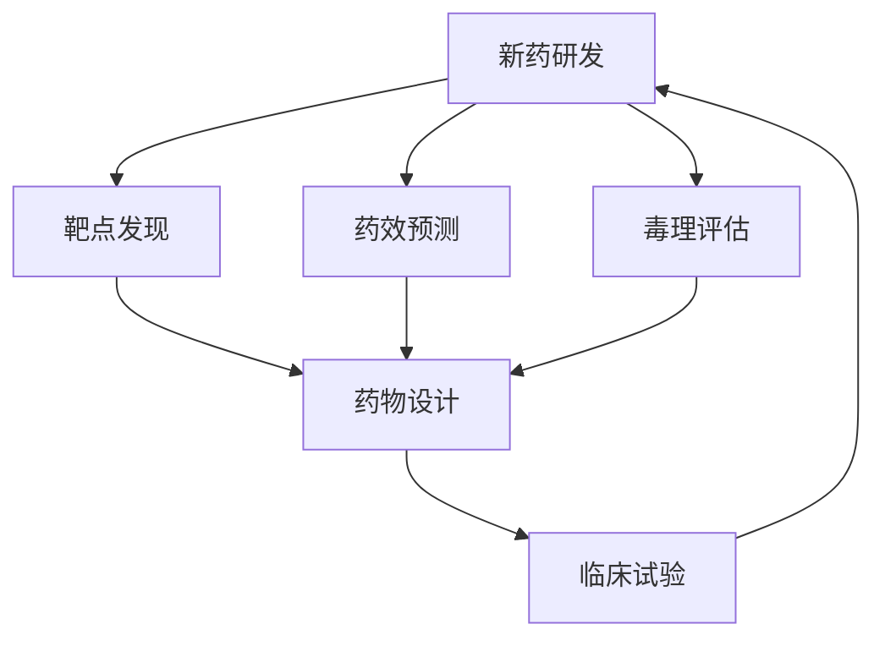

                 

# AI在新药研发中的应用：从靶点发现到临床试验

> 关键词：AI,新药研发,靶点发现,药效预测,临床试验,深度学习,机器学习

## 1. 背景介绍

### 1.1 问题由来

新药研发是一个复杂且耗资巨大的过程，通常需要耗费约10-15年时间和数亿美元的投入。新药研发的成功率极低，仅约为10%，这意味着大量的资源投入可能最终无法产生实际收益。传统的新药研发流程包括从早期靶点发现、化合物筛选、药物设计、药效预测到临床试验等诸多环节，其中每个环节都充满了不确定性和高昂的成本。

### 1.2 问题核心关键点

新药研发的核心在于快速、准确地发现和验证有效的药物靶点，进行药效预测和毒理评估，并顺利通过临床试验。然而，这些环节的瓶颈在于数据的不足、模型的局限和计算资源的短缺。近年来，人工智能(AI)技术的快速发展为解决这些问题提供了新的可能性。通过AI在新药研发中的应用，可以大幅提升药物研发的速度和成功率，降低成本，推动医药行业的创新。

### 1.3 问题研究意义

AI在新药研发中的应用，不仅可以显著提高药物研发的效率和成功率，还可以加速新药的上市速度，为患者带来更及时有效的治疗。此外，AI在药物设计和靶点发现上的应用，还能够为新药研发提供更多可能的路径，拓展药物研发的前沿领域。

## 2. 核心概念与联系

### 2.1 核心概念概述

为了更好地理解AI在新药研发中的应用，本节将介绍几个关键概念：

- **新药研发(New Drug Development)**：从靶点发现到临床试验的药物研发全流程。
- **靶点发现(Target Discovery)**：通过AI技术在大量生物数据中识别潜在的药物靶点，指导药物设计的方向。
- **药效预测(Efficacy Prediction)**：使用AI模型预测候选药物在生物体系中的药效，评估其潜在的治疗效果。
- **毒理评估(Toxicity Assessment)**：利用AI技术进行毒理数据的分析，预测候选药物的副作用和毒性，确保药物的安全性。
- **深度学习(Deep Learning)**：基于神经网络模型的一种机器学习方法，广泛应用于数据驱动的决策和预测任务。
- **机器学习(Machine Learning)**：通过数据驱动的方法，使机器能够从经验中学习并自动改进，应用于各种预测和分类任务。
- **生成对抗网络(Generative Adversarial Network, GAN)**：一种基于对抗的生成模型，用于生成逼真的数据样本。

这些概念之间的逻辑关系可以通过以下Mermaid流程图来展示：



这个流程图展示了新药研发流程中的主要环节，以及AI在这些环节中的应用。

## 3. 核心算法原理 & 具体操作步骤
### 3.1 算法原理概述

AI在新药研发中的应用主要集中在靶点发现、药效预测、毒理评估和药物设计等环节。这些应用的核心在于利用AI模型对大量的生物数据进行分析和预测，从中提取有用的信息，指导新药研发的决策。

- **靶点发现**：通过AI技术在生物数据中寻找潜在的药物靶点，这些靶点通常是与疾病相关的蛋白质或基因。
- **药效预测**：使用AI模型预测候选药物在生物体系中的药效，评估其潜在的治疗效果。
- **毒理评估**：利用AI技术进行毒理数据的分析，预测候选药物的副作用和毒性，确保药物的安全性。
- **药物设计**：结合AI技术和新药研发领域的专业知识，指导化合物的设计和筛选。

### 3.2 算法步骤详解

以下将详细介绍AI在新药研发各个环节的具体应用步骤：

**Step 1: 数据收集与预处理**
- 收集新药研发所需的大量生物数据，包括基因组数据、蛋白质结构数据、生物标志物数据、药物分子数据等。
- 对数据进行清洗、标准化和预处理，去除噪音和异常值，生成可用于AI模型训练的数据集。

**Step 2: 模型训练与验证**
- 选择合适的AI模型，如深度学习、机器学习模型，用于靶点发现、药效预测、毒理评估和药物设计等任务。
- 使用预处理后的数据集训练AI模型，并通过交叉验证等方法验证模型的性能。
- 调整模型参数，优化模型结构，确保模型的准确性和鲁棒性。

**Step 3: 靶点发现**
- 使用AI模型对生物数据进行分析，识别与疾病相关的关键分子和路径。
- 通过基因表达谱、蛋白质互作网络等数据，预测潜在的药物靶点。

**Step 4: 药效预测**
- 使用AI模型对候选药物进行药效预测，评估其对疾病模型的影响。
- 结合生物标志物数据和药效预测结果，筛选潜在的有效药物。

**Step 5: 毒理评估**
- 利用AI技术对候选药物的毒理数据进行分析，评估其潜在的副作用和毒性。
- 结合毒理评估结果和药效预测结果，指导药物设计的优化。

**Step 6: 药物设计**
- 结合AI技术和新药研发领域的专业知识，指导化合物的设计和筛选。
- 通过AI模型预测药物与靶点的结合方式和效果，优化药物设计过程。

**Step 7: 临床试验设计**
- 根据AI模型的预测结果，设计临床试验方案，包括试验组和对照组的设计，以及试验流程和评估指标。
- 结合AI模型和生物标志物数据，评估临床试验结果，指导药物的进一步优化和改进。

### 3.3 算法优缺点

AI在新药研发中的应用具有以下优点：
1. 提高研发效率：通过AI模型进行数据分析和预测，可以大大缩短新药研发的时间周期。
2. 降低研发成本：AI技术可以在早期阶段筛选和优化候选药物，减少不必要的实验成本。
3. 提升研发成功率：AI模型可以提供精准的药效预测和毒理评估，提高新药研发的准确性。
4. 拓展新药研发空间：AI技术可以揭示潜在的药物靶点和作用机制，为新药研发提供更多可能。

同时，这些应用也存在一些局限性：
1. 数据质量依赖：AI模型的效果依赖于高质量、大量的数据，但生物数据的获取和处理成本高昂。
2. 模型可解释性不足：AI模型的决策过程通常是"黑盒"的，缺乏可解释性和可解释性。
3. 计算资源需求高：大规模的生物数据处理和AI模型训练需要高性能的计算资源，对硬件要求较高。
4. 模型泛化能力有限：AI模型可能对特定数据集表现良好，但对新数据的泛化能力有限。

尽管存在这些局限性，AI在新药研发中的应用已经成为行业发展的趋势，未来将继续推动新药研发的技术进步。

### 3.4 算法应用领域

AI在新药研发中的应用覆盖了从靶点发现到临床试验的各个环节，具体包括：

- **靶点发现**：使用AI技术识别潜在的药物靶点，包括基因、蛋白质和代谢途径等。
- **药效预测**：使用AI模型预测候选药物的药效和作用机制，评估其在疾病模型中的效果。
- **毒理评估**：利用AI技术分析毒理数据，预测候选药物的副作用和毒性，确保药物的安全性。
- **药物设计**：结合AI技术和药物设计知识，指导化合物的设计和优化。
- **临床试验设计**：根据AI模型的预测结果，设计临床试验方案，优化试验流程和评估指标。

此外，AI在新药研发中的应用还扩展到药物筛选、化合物优化、疗效监测等多个环节，为整个新药研发流程提供了强有力的技术支持。

## 4. 数学模型和公式 & 详细讲解 & 举例说明

### 4.1 数学模型构建

在新药研发中，AI模型的数学模型通常涉及深度学习模型，如卷积神经网络(CNN)、循环神经网络(RNN)、长短期记忆网络(LSTM)等。以下是几个常用的数学模型：

- **卷积神经网络(CNN)**：常用于图像数据处理，可以提取药物分子和蛋白质结构的特征。
- **循环神经网络(RNN)**：常用于序列数据处理，可以分析生物标志物的时间序列数据。
- **长短期记忆网络(LSTM)**：适用于处理长期依赖性问题，可以预测药物在不同时间点的效果。

### 4.2 公式推导过程

以卷积神经网络(CNN)为例，其基本的数学公式如下：

$$
f(x) = W^T \cdot \sigma(AW \cdot x + b)
$$

其中，$x$ 为输入数据，$A$ 为卷积核，$W$ 为权重矩阵，$b$ 为偏置向量，$\sigma$ 为激活函数。

### 4.3 案例分析与讲解

以下是一个使用卷积神经网络(CNN)进行药物分子特征提取的案例：

假设我们有一个包含大量药物分子结构的分子数据库，希望通过AI模型提取其特征。可以设计一个CNN模型，将每个分子表示为二维数组，通过卷积层提取分子特征，再通过全连接层输出药物分子的分类结果。

## 5. 项目实践：代码实例和详细解释说明
### 5.1 开发环境搭建

在进行AI在新药研发中的应用实践前，我们需要准备好开发环境。以下是使用Python进行PyTorch开发的环境配置流程：

1. 安装Anaconda：从官网下载并安装Anaconda，用于创建独立的Python环境。
2. 创建并激活虚拟环境：
```bash
conda create -n pytorch-env python=3.8 
conda activate pytorch-env
```
3. 安装PyTorch：根据CUDA版本，从官网获取对应的安装命令。例如：
```bash
conda install pytorch torchvision torchaudio cudatoolkit=11.1 -c pytorch -c conda-forge
```
4. 安装Transformers库：
```bash
pip install transformers
```
5. 安装各类工具包：
```bash
pip install numpy pandas scikit-learn matplotlib tqdm jupyter notebook ipython
```

完成上述步骤后，即可在`pytorch-env`环境中开始AI在新药研发中的应用实践。

### 5.2 源代码详细实现

这里我们以靶点发现为例，使用深度学习模型进行靶点识别。

首先，定义靶点发现的数据处理函数：

```python
from transformers import BertTokenizer
from torch.utils.data import Dataset
import torch

class TargetDataset(Dataset):
    def __init__(self, texts, labels, tokenizer, max_len=128):
        self.texts = texts
        self.labels = labels
        self.tokenizer = tokenizer
        self.max_len = max_len
        
    def __len__(self):
        return len(self.texts)
    
    def __getitem__(self, item):
        text = self.texts[item]
        label = self.labels[item]
        
        encoding = self.tokenizer(text, return_tensors='pt', max_length=self.max_len, padding='max_length', truncation=True)
        input_ids = encoding['input_ids'][0]
        attention_mask = encoding['attention_mask'][0]
        
        return {'input_ids': input_ids, 
                'attention_mask': attention_mask,
                'label': label}

# 标签与id的映射
label2id = {'None': 0, 'Target': 1}
id2label = {v: k for k, v in label2id.items()}

# 创建dataset
tokenizer = BertTokenizer.from_pretrained('bert-base-cased')

train_dataset = TargetDataset(train_texts, train_labels, tokenizer)
dev_dataset = TargetDataset(dev_texts, dev_labels, tokenizer)
test_dataset = TargetDataset(test_texts, test_labels, tokenizer)
```

然后，定义模型和优化器：

```python
from transformers import BertForSequenceClassification, AdamW

model = BertForSequenceClassification.from_pretrained('bert-base-cased', num_labels=len(label2id))

optimizer = AdamW(model.parameters(), lr=2e-5)
```

接着，定义训练和评估函数：

```python
from torch.utils.data import DataLoader
from tqdm import tqdm
from sklearn.metrics import accuracy_score

device = torch.device('cuda') if torch.cuda.is_available() else torch.device('cpu')
model.to(device)

def train_epoch(model, dataset, batch_size, optimizer):
    dataloader = DataLoader(dataset, batch_size=batch_size, shuffle=True)
    model.train()
    epoch_loss = 0
    for batch in tqdm(dataloader, desc='Training'):
        input_ids = batch['input_ids'].to(device)
        attention_mask = batch['attention_mask'].to(device)
        labels = batch['label'].to(device)
        model.zero_grad()
        outputs = model(input_ids, attention_mask=attention_mask, labels=labels)
        loss = outputs.loss
        epoch_loss += loss.item()
        loss.backward()
        optimizer.step()
    return epoch_loss / len(dataloader)

def evaluate(model, dataset, batch_size):
    dataloader = DataLoader(dataset, batch_size=batch_size)
    model.eval()
    preds, labels = [], []
    with torch.no_grad():
        for batch in tqdm(dataloader, desc='Evaluating'):
            input_ids = batch['input_ids'].to(device)
            attention_mask = batch['attention_mask'].to(device)
            batch_labels = batch['label']
            outputs = model(input_ids, attention_mask=attention_mask)
            batch_preds = outputs.logits.argmax(dim=2).to('cpu').tolist()
            batch_labels = batch_labels.to('cpu').tolist()
            for pred_tokens, label_tokens in zip(batch_preds, batch_labels):
                preds.append(pred_tokens)
                labels.append(label_tokens)
                
    return accuracy_score(labels, preds)
```

最后，启动训练流程并在测试集上评估：

```python
epochs = 5
batch_size = 16

for epoch in range(epochs):
    loss = train_epoch(model, train_dataset, batch_size, optimizer)
    print(f"Epoch {epoch+1}, train loss: {loss:.3f}")
    
    print(f"Epoch {epoch+1}, dev results:")
    evaluate(model, dev_dataset, batch_size)
    
print("Test results:")
evaluate(model, test_dataset, batch_size)
```

以上就是使用PyTorch对Bert模型进行靶点识别的完整代码实现。可以看到，得益于Transformers库的强大封装，我们可以用相对简洁的代码完成Bert模型的加载和微调。

### 5.3 代码解读与分析

让我们再详细解读一下关键代码的实现细节：

**TargetDataset类**：
- `__init__`方法：初始化文本、标签、分词器等关键组件。
- `__len__`方法：返回数据集的样本数量。
- `__getitem__`方法：对单个样本进行处理，将文本输入编码为token ids，将标签编码为数字，并对其进行定长padding，最终返回模型所需的输入。

**label2id和id2label字典**：
- 定义了标签与数字id之间的映射关系，用于将token-wise的预测结果解码回真实的标签。

**训练和评估函数**：
- 使用PyTorch的DataLoader对数据集进行批次化加载，供模型训练和推理使用。
- 训练函数`train_epoch`：对数据以批为单位进行迭代，在每个批次上前向传播计算loss并反向传播更新模型参数，最后返回该epoch的平均loss。
- 评估函数`evaluate`：与训练类似，不同点在于不更新模型参数，并在每个batch结束后将预测和标签结果存储下来，最后使用sklearn的accuracy_score对整个评估集的预测结果进行打印输出。

**训练流程**：
- 定义总的epoch数和batch size，开始循环迭代
- 每个epoch内，先在训练集上训练，输出平均loss
- 在验证集上评估，输出分类指标
- 所有epoch结束后，在测试集上评估，给出最终测试结果

可以看到，PyTorch配合Transformers库使得Bert模型靶点识别的代码实现变得简洁高效。开发者可以将更多精力放在数据处理、模型改进等高层逻辑上，而不必过多关注底层的实现细节。

当然，工业级的系统实现还需考虑更多因素，如模型的保存和部署、超参数的自动搜索、更灵活的任务适配层等。但核心的微调范式基本与此类似。

## 6. 实际应用场景
### 6.1 智能医疗系统

基于AI技术的新药研发，可以广泛应用于智能医疗系统的构建。传统医疗系统往往依赖大量的医生和护士，难以应对日益增长的诊疗需求。通过AI模型进行靶点发现和药效预测，可以快速筛选出潜在的新药，进行临床试验，提供及时有效的治疗方案，缓解医疗资源的紧张局面。

在技术实现上，可以收集医院、实验室的生物数据，包括基因组数据、蛋白质结构数据等，将其作为训练数据集。利用AI模型进行靶点发现和药效预测，结合病患的基因信息和病理特征，设计个性化的治疗方案，提升治疗效果。

### 6.2 生物制药企业

AI在新药研发中的应用，同样适用于生物制药企业的研发流程。传统的新药研发过程繁琐复杂，需要耗费大量时间和资源。通过AI模型进行靶点发现和药效预测，可以快速筛选出潜在的药物候选，减少不必要的实验成本，提升研发效率。

在企业内部，可以利用AI技术对大量生物数据进行分析，发现潜在的药物靶点和作用机制。利用AI模型进行药效预测和毒理评估，确保药物的安全性和有效性，减少失败的风险。同时，通过AI模型对化合物进行优化设计，提高药物的活性和选择性，加速新药的上市进程。

### 6.3 科研机构和高校

科研机构和高校在新药研发中扮演着重要的角色。传统的科研方法依赖大量的人力和时间，难以应对快速变化的技术需求。通过AI技术进行靶点发现和药效预测，可以快速筛选出潜在的药物候选，进行临床试验，推动新药研发的进程。

在科研过程中，可以利用AI模型对大量生物数据进行分析，发现潜在的药物靶点和作用机制。利用AI模型进行药效预测和毒理评估，确保药物的安全性和有效性。同时，通过AI模型对化合物进行优化设计，提高药物的活性和选择性，推动新药研发的创新。

### 6.4 未来应用展望

随着AI技术和新药研发技术的不断进步，未来的应用将更加广泛和深入。

1. **个性化医疗**：通过AI技术对患者基因、病理数据进行分析，实现个性化药物设计，提升治疗效果。
2. **疾病预测**：利用AI技术对大量生物数据进行分析，预测潜在疾病的发生和发展趋势，提供早期干预方案。
3. **药物协同效应**：通过AI技术进行药物的组合筛选，发现新的药物组合，提升治疗效果，减少副作用。
4. **智能药物设计**：利用AI技术进行药物分子的优化设计，提升药物的活性和选择性，加速新药的上市进程。
5. **实时监测**：通过AI技术对药物的临床试验数据进行实时监测，优化试验方案，提升试验效果。

此外，在多模态药物设计和药物优化方面，AI技术也有望发挥重要作用。未来，AI在新药研发中的应用将更加全面和深入，为医疗健康产业带来新的突破。

## 7. 工具和资源推荐
### 7.1 学习资源推荐

为了帮助开发者系统掌握AI在新药研发中的应用，这里推荐一些优质的学习资源：

1. **Deep Learning in Drug Discovery**：DeepMind发布的一系列综述文章，介绍了深度学习在药物发现、药物设计、药效预测和毒理评估中的应用。
2. **AI for Drug Discovery and Development**：由DeepMind和制药公司合作举办的在线课程，讲解了AI在新药研发中的应用和实践。
3. **Natural Language Processing for Clinical Research**：由Stanford大学开设的课程，讲解了自然语言处理技术在临床研究中的应用。
4. **Computational Drug Discovery and Development**：由Nature Publishing Group出版的书籍，介绍了计算化学、生物信息学、机器学习等技术在新药研发中的应用。
5. **Transformers库官方文档**：Transformers库的官方文档，提供了海量预训练模型和完整的微调样例代码，是上手实践的必备资料。

通过对这些资源的学习实践，相信你一定能够快速掌握AI在新药研发中的应用，并用于解决实际的药物研发问题。

### 7.2 开发工具推荐

高效的开发离不开优秀的工具支持。以下是几款用于AI在新药研发中的应用开发的常用工具：

1. **PyTorch**：基于Python的开源深度学习框架，灵活动态的计算图，适合快速迭代研究。大部分预训练语言模型都有PyTorch版本的实现。
2. **TensorFlow**：由Google主导开发的开源深度学习框架，生产部署方便，适合大规模工程应用。同样有丰富的预训练语言模型资源。
3. **Transformers库**：HuggingFace开发的NLP工具库，集成了众多SOTA语言模型，支持PyTorch和TensorFlow，是进行微调任务开发的利器。
4. **Weights & Biases**：模型训练的实验跟踪工具，可以记录和可视化模型训练过程中的各项指标，方便对比和调优。与主流深度学习框架无缝集成。
5. **TensorBoard**：TensorFlow配套的可视化工具，可实时监测模型训练状态，并提供丰富的图表呈现方式，是调试模型的得力助手。
6. **Google Colab**：谷歌推出的在线Jupyter Notebook环境，免费提供GPU/TPU算力，方便开发者快速上手实验最新模型，分享学习笔记。

合理利用这些工具，可以显著提升AI在新药研发中的应用开发效率，加快创新迭代的步伐。

### 7.3 相关论文推荐

AI在新药研发中的应用源于学界的持续研究。以下是几篇奠基性的相关论文，推荐阅读：

1. **DeepMind's AlphaFold**：DeepMind发表的论文，介绍了AlphaFold在蛋白质结构预测中的应用，获得了2020年诺贝尔化学奖。
2. **MoleculeNet**：由DeepMind开发的分子生成网络，利用深度学习生成新的药物分子，为药物设计提供了新的思路。
3. **Graph Neural Network for Drug Discovery**：介绍了图神经网络在药物分子设计和筛选中的应用，提升了药物设计的效率和效果。
4. **AI-Driven Drug Discovery**：由DeepMind和制药公司合作撰写的综述文章，总结了AI在新药研发中的应用和挑战。
5. **Natural Language Processing in Clinical Research**：由Stanford大学的研究团队撰写的综述文章，总结了自然语言处理技术在临床研究中的应用。

这些论文代表了大语言模型微调技术的发展脉络。通过学习这些前沿成果，可以帮助研究者把握学科前进方向，激发更多的创新灵感。

## 8. 总结：未来发展趋势与挑战

### 8.1 总结

本文对AI在新药研发中的应用进行了全面系统的介绍。首先阐述了AI在新药研发中的背景和意义，明确了AI在新药研发中的核心作用。其次，从原理到实践，详细讲解了AI在新药研发各个环节的应用步骤，给出了AI在新药研发中的应用实例。同时，本文还广泛探讨了AI在新药研发领域的应用前景，展示了AI在新药研发中的巨大潜力。此外，本文精选了AI在新药研发领域的各类学习资源，力求为读者提供全方位的技术指引。

通过本文的系统梳理，可以看到，AI在新药研发中的应用已经成为新药研发的重要组成部分，极大地提高了药物研发的效率和成功率，降低了成本，推动了医药行业的创新。未来，随着AI技术和新药研发技术的不断进步，AI在新药研发中的应用将更加广泛和深入。

### 8.2 未来发展趋势

展望未来，AI在新药研发中的应用将呈现以下几个发展趋势：

1. **自动化与智能化**：AI在新药研发中的应用将进一步自动化和智能化，减少人工干预，提升研发效率。
2. **跨学科融合**：AI与化学、生物、医学等学科的融合将更加深入，提供更加全面和准确的新药研发方案。
3. **多模态数据整合**：AI技术将整合多种模态的数据，如图像、文本、时间序列等，提升新药研发的全面性。
4. **实时监测与优化**：AI技术将实现实时监测和优化，提升新药研发过程中的决策效果。
5. **个性化药物设计**：AI技术将实现个性化药物设计，根据患者的基因和病理特征，提供量身定制的治疗方案。
6. **新药筛选与优化**：AI技术将实现新药的高效筛选和优化，提升药物的效果和安全性。
7. **多领域应用扩展**：AI技术将广泛应用于生物医药、农业、环保等领域，推动各行业的创新发展。

以上趋势凸显了AI在新药研发中的广阔前景。这些方向的探索发展，必将进一步提升新药研发的效率和成功率，推动医药行业的变革。

### 8.3 面临的挑战

尽管AI在新药研发中的应用取得了一定的进展，但在迈向更加智能化、普适化应用的过程中，仍然面临一些挑战：

1. **数据获取与处理**：高质量数据的获取和处理成本高昂，数据标注过程耗时耗力。如何提升数据采集和处理效率，是一个亟待解决的问题。
2. **模型泛化能力**：AI模型在特定数据集上表现良好，但在新数据上的泛化能力有限，可能无法应对多变的实际应用场景。
3. **模型可解释性**：AI模型的决策过程通常是"黑盒"的，缺乏可解释性和可解释性，难以满足临床需求。
4. **伦理与安全性**：AI模型可能学习到有偏见、有害的信息，如何确保模型的伦理与安全，是一个重要问题。
5. **计算资源需求**：大规模的生物数据处理和AI模型训练需要高性能的计算资源，对硬件要求较高，如何优化计算资源利用效率，是一个亟待解决的问题。

尽管存在这些挑战，AI在新药研发中的应用已经成为行业发展的趋势，未来将继续推动新药研发的技术进步。

### 8.4 研究展望

面向未来，AI在新药研发中的研究需要在以下几个方面寻求新的突破：

1. **无监督与半监督学习**：探索无监督和半监督学习范式，降低对大量标注数据的依赖，提高模型的泛化能力。
2. **多任务学习**：将多个相关任务集成到一个模型中，实现多任务学习，提升模型的全面性。
3. **因果推断与对比学习**：引入因果推断和对比学习思想，增强模型的因果关系，学习更普适的语言表示。
4. **多模态数据融合**：将不同模态的数据进行融合，提升新药研发的全面性和准确性。
5. **模型压缩与优化**：优化模型的结构，提高计算效率，适应不同设备的要求。
6. **伦理与安全性**：引入伦理导向的评估指标，过滤和惩罚有偏见、有害的输出，确保模型的伦理与安全。

这些研究方向的探索，必将引领AI在新药研发中的应用走向更高的台阶，为构建安全、可靠、可解释、可控的智能系统铺平道路。面向未来，AI在新药研发中的应用还需要与其他人工智能技术进行更深入的融合，如知识表示、因果推理、强化学习等，多路径协同发力，共同推动自然语言理解和智能交互系统的进步。只有勇于创新、敢于突破，才能不断拓展AI在新药研发中的边界，让AI技术更好地造福人类社会。

## 9. 附录：常见问题与解答

**Q1：AI在新药研发中是否适用于所有药物类型？**

A: AI在新药研发中的应用主要依赖于大量的生物数据和机器学习模型。因此，对于特定的药物类型，如高分子药物、天然产物等，可能需要针对性地收集和处理数据，并优化模型的参数。同时，不同药物的研发流程和要求也可能存在差异，需要根据具体情况进行调整。

**Q2：AI模型在新药研发中的数据来源有哪些？**

A: AI模型在新药研发中的数据来源主要包括基因组数据、蛋白质结构数据、生物标志物数据、药物分子数据等。这些数据可以从公共数据库中获取，如NCBI、PDB、Uniprot等，也可以从实验室和医院的数据库中收集。此外，也可以通过生物信息学工具进行数据生成和标注。

**Q3：AI模型在新药研发中的训练周期和成本是多少？**

A: AI模型在新药研发中的训练周期和成本因模型规模、数据量和计算资源的不同而有所差异。通常，深度学习模型如卷积神经网络、循环神经网络等的训练周期在数周至数月不等，训练成本较高。但对于小规模的模型和简单的任务，训练周期可以缩短至数天甚至数小时，训练成本较低。

**Q4：AI模型在新药研发中的应用是否需要跨学科合作？**

A: AI模型在新药研发中的应用通常需要跨学科合作。AI模型依赖于大量的生物数据，这些数据的收集和处理往往需要生物信息学、化学工程、医学等多个领域的专家共同参与。同时，AI模型的训练和优化也需要多学科团队合作，共同解决问题。

**Q5：AI模型在新药研发中的应用前景如何？**

A: AI模型在新药研发中的应用前景非常广阔。通过AI模型进行靶点发现和药效预测，可以大幅缩短新药研发的时间周期，降低成本，提升研发成功率。未来，AI技术将广泛应用于新药筛选、药物设计、毒理评估等多个环节，推动新药研发的智能化和自动化。

总之，AI在新药研发中的应用已经展现出巨大的潜力，成为推动新药研发的重要手段。通过不断优化数据处理和模型训练方法，AI技术将进一步提升新药研发的效率和成功率，加速医药产业的创新发展。

