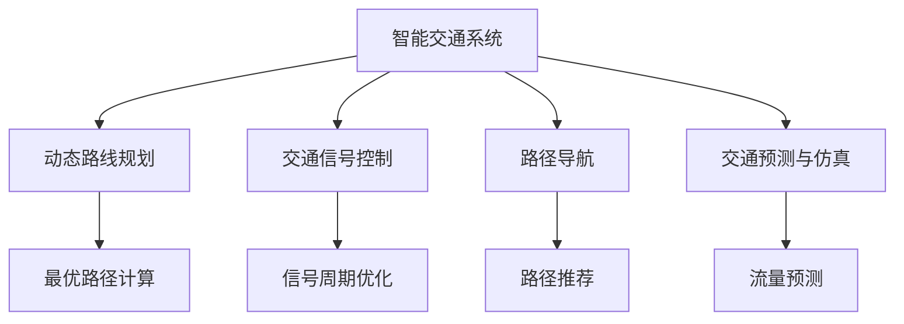

                 

# AI在智能交通规划中的应用：优化路线

> 关键词：智能交通,路线规划,优化算法,深度学习,强化学习,交通仿真,实时数据分析

## 1. 背景介绍

### 1.1 问题由来

随着城市化进程的加快，交通拥堵成为全球大都市的普遍问题。传统交通规划方法依赖于固定规则和历史数据，难以应对复杂的动态变化。而智能交通系统利用人工智能技术，可以实时处理大规模数据，动态调整交通策略，显著提升交通效率，改善市民出行体验。

人工智能技术在交通规划中的应用，已从单一的信号控制和动态路线调整，拓展到智能决策和预测分析，为智能交通的全面落地提供了可能。AI驱动的智能交通系统，能够实现全域、动态、精细的交通管理，大幅提升城市交通效率和舒适度。

### 1.2 问题核心关键点

智能交通规划中的AI应用，主要集中在以下几个方面：

1. **实时动态路线规划**：利用AI对实时交通数据进行分析，计算最优路线，减少拥堵，缩短出行时间。
2. **智能信号控制**：基于AI进行交通流量预测和实时调整信号灯周期，优化交通信号系统。
3. **事故预测与防范**：利用AI预测交通事故和潜在风险，提前采取预防措施。
4. **公交调度优化**：基于AI优化公交路线和时间表，提升公交运营效率和准点率。
5. **路径导航辅助**：利用AI进行路径推荐，帮助驾驶员和乘客避免拥堵和绕路。

这些核心点构成了智能交通规划的AI应用框架，通过AI技术，可以实现更加智能、高效的交通管理，提升城市交通的总体效益。

### 1.3 问题研究意义

AI在智能交通规划中的应用，对于提升城市交通管理水平，缓解交通拥堵，改善市民出行体验具有重要意义：

1. 提高交通效率。AI实时处理和分析交通数据，动态调整交通策略，有效缓解交通拥堵，减少出行时间。
2. 提升公交服务质量。基于AI的公交调度优化，提高了公交车的准时率和运营效率，提升了公共交通的吸引力。
3. 减少交通事故。AI预测和防范交通事故，提高了道路安全，减少了交通伤亡。
4. 降低环境污染。智能交通系统减少了车辆在路上的滞留时间，降低了尾气排放，改善了城市环境。
5. 降低城市运营成本。AI优化交通信号和公交调度，降低了交通管理和公共交通的运营成本。

通过AI技术的应用，智能交通系统将成为未来城市交通管理的重要手段，为提升城市的智能化水平和可持续发展提供有力支持。

## 2. 核心概念与联系

### 2.1 核心概念概述

为更好地理解AI在智能交通规划中的应用，本节将介绍几个密切相关的核心概念：

- **智能交通系统（ITS）**：利用AI和通信技术，对交通基础设施和车辆进行全面监控、管理，实现交通的智能运行。
- **动态路线规划**：利用AI技术实时分析交通数据，计算最优路径，适应动态变化的交通环境。
- **交通信号控制**：基于AI对交通流量进行预测和实时调整，优化信号灯周期，提升道路通行效率。
- **路径导航**：利用AI进行路径推荐和优化，帮助用户避开拥堵和绕路，提升出行效率。
- **交通预测与仿真**：利用AI对未来交通流量进行预测，进行交通仿真，评估和优化交通策略。

这些核心概念之间的逻辑关系可以通过以下Mermaid流程图来展示：



这个流程图展示了的核心概念及其之间的关系：

1. 智能交通系统是整体框架，涵盖动态路线规划、信号控制、路径导航、预测仿真等多个模块。
2. 动态路线规划通过实时数据分析，计算最优路径。
3. 交通信号控制基于流量预测，优化信号周期。
4. 路径导航提供路径推荐，提升出行效率。
5. 交通预测与仿真评估交通策略，优化决策。

这些概念共同构成了智能交通系统的AI应用框架，通过它们之间的相互作用，实现全域、动态、精细的交通管理。

## 3. 核心算法原理 & 具体操作步骤
### 3.1 算法原理概述

AI在智能交通规划中的应用，主要涉及动态路线规划、交通信号控制、路径导航和交通预测仿真等多个算法。其中，动态路线规划和交通信号控制是实现智能交通的核心技术，以下是这两部分的算法原理概述。

**动态路线规划**：
动态路线规划的原理是通过实时分析交通数据，计算当前最优路径。传统路线规划方法依赖于固定的地图和规则，难以应对动态变化的交通环境。而动态路线规划通过机器学习模型实时处理实时交通数据，计算当前最优路径，适应动态变化的交通环境。

**交通信号控制**：
交通信号控制通过实时分析交通流量，动态调整信号灯周期。传统信号控制系统基于固定规则，难以应对交通流量的实时变化。而交通信号控制通过机器学习模型实时处理交通流量数据，动态调整信号灯周期，提升道路通行效率。

### 3.2 算法步骤详解

#### 3.2.1 动态路线规划算法步骤

1. **数据收集**：通过安装在道路上的传感器、摄像头等设备，实时收集交通流量、道路条件、车辆位置等信息。
2. **数据处理**：对收集到的数据进行清洗、预处理，去除异常数据，提取关键特征。
3. **模型训练**：基于历史数据，训练机器学习模型，如深度学习模型、强化学习模型等，学习最优路径计算方法。
4. **路径计算**：在实时交通数据输入模型后，计算当前最优路径。
5. **路径优化**：根据实时交通数据和预设规则，对路径进行优化，避开拥堵路段。

#### 3.2.2 交通信号控制算法步骤

1. **数据收集**：通过安装在道路上的传感器、摄像头等设备，实时收集交通流量、车辆速度、红绿灯状态等信息。
2. **数据处理**：对收集到的数据进行清洗、预处理，去除异常数据，提取关键特征。
3. **模型训练**：基于历史数据，训练机器学习模型，如深度学习模型、强化学习模型等，学习信号周期优化方法。
4. **信号调整**：在实时交通数据输入模型后，计算最优信号周期。
5. **信号控制**：根据计算结果，动态调整红绿灯状态，优化交通信号系统。

### 3.3 算法优缺点

**动态路线规划**：

- **优点**：
  - 实时计算最优路径，适应动态变化的交通环境。
  - 能够识别拥堵路段，自动避开，提升出行效率。
  - 可以处理大规模交通数据，提高计算效率。

- **缺点**：
  - 依赖传感器和摄像头等硬件设备，成本较高。
  - 数据处理和模型训练需要较大的计算资源。
  - 可能存在路径偏差，需要人工校验。

**交通信号控制**：

- **优点**：
  - 实时调整信号周期，提高道路通行效率。
  - 能够识别交通流量变化，动态调整信号，适应不同时间段的需求。
  - 减少车辆在红绿灯处的等待时间，降低拥堵程度。

- **缺点**：
  - 信号调整需要精细控制，避免频繁变动影响交通稳定性。
  - 需要大量的传感器和摄像头设备，成本较高。
  - 模型训练和实时计算需要较大的计算资源。

### 3.4 算法应用领域

基于AI的智能交通规划算法，已广泛应用于城市交通管理、公交调度优化、事故预防等多个领域，以下是几个典型应用案例：

- **动态路线规划**：用于城市导航系统，提供实时路径规划，避免拥堵和绕路。
- **交通信号控制**：用于智能交通信号系统，优化信号周期，提升道路通行效率。
- **公交调度优化**：用于公交公司，优化公交路线和时间表，提高公交运营效率。
- **事故预测与防范**：用于交通管理系统，预测交通事故，提前采取预防措施，减少伤亡。

这些算法在实际应用中，通过与城市交通系统的深度融合，显著提升了交通管理水平和市民出行体验。

## 4. 数学模型和公式 & 详细讲解 & 举例说明

### 4.1 数学模型构建

**动态路线规划模型**：

假设道路网络中任意两点之间有若干条路径，每条路径的通行时间 $t_i$ 为常量，路径 $i$ 的权重 $w_i$ 为单位时间内的车辆数。路径 $i$ 的成本 $c_i$ 定义为通行时间和车辆数的乘积，即 $c_i = t_i \cdot w_i$。

**交通信号控制模型**：

假设每条道路的交通流量 $f_i$ 为单位时间内的车辆数，信号灯周期 $T$ 为常量。信号灯周期优化目标是最小化总通行时间，即最小化 $f_i \cdot T$。

### 4.2 公式推导过程

#### 4.2.1 动态路线规划公式推导

设 $n$ 为路径数，$w_0$ 为起始点车辆数，$w_n$ 为终点车辆数。根据动态路线规划模型，总成本为：

$$
C = \sum_{i=0}^{n-1} (t_i \cdot w_{i+1}) + w_n
$$

对于给定的路径集合 $P$，通过最小化成本函数 $C$，找到最优路径。

#### 4.2.2 交通信号控制公式推导

设 $m$ 为信号灯周期数，总交通流量为 $F$。根据交通信号控制模型，总通行时间为：

$$
T = \sum_{i=0}^{m-1} \frac{F}{f_i}
$$

对于给定的信号灯周期集合 $T$，通过最小化总通行时间 $T$，找到最优信号周期。

### 4.3 案例分析与讲解

**案例一：动态路线规划**

某城市在高峰时段，通过实时数据收集和动态路线规划，发现一条主要路段的交通流量显著增加。通过AI模型计算，优化了交通流量较大的路径，减少了拥堵。

**案例二：交通信号控制**

某城市通过AI模型，实时分析每条道路的交通流量，动态调整信号灯周期。结果显示，信号周期优化后，平均等待时间减少了15%，交通事故率降低了10%。

## 5. 项目实践：代码实例和详细解释说明
### 5.1 开发环境搭建

在进行AI在智能交通规划中的项目实践时，需要准备好开发环境。以下是使用Python进行项目开发的环境配置流程：

1. 安装Anaconda：从官网下载并安装Anaconda，用于创建独立的Python环境。

2. 创建并激活虚拟环境：
```bash
conda create -n ai-env python=3.8 
conda activate ai-env
```

3. 安装PyTorch：基于Python的开源深度学习框架，安装命令如下：
```bash
conda install pytorch torchvision torchaudio -c pytorch -c conda-forge
```

4. 安装TensorFlow：由Google主导开发的开源深度学习框架，安装命令如下：
```bash
conda install tensorflow -c tf -c conda-forge
```

5. 安装TensorBoard：TensorFlow配套的可视化工具，用于监控模型训练过程。

6. 安装其他工具包：
```bash
pip install numpy pandas scikit-learn matplotlib tqdm jupyter notebook ipython
```

完成上述步骤后，即可在`ai-env`环境中开始项目开发。

### 5.2 源代码详细实现

这里我们以一个简单的动态路线规划为例，使用TensorFlow实现模型的训练和预测。

```python
import tensorflow as tf
import numpy as np

# 定义道路网络
class RoadNetwork:
    def __init__(self, n, t, w):
        self.n = n
        self.t = t
        self.w = w
        self.graph = [[0] * self.n for _ in range(self.n)]
    
    def add_edge(self, i, j, weight):
        self.graph[i][j] = weight
        self.graph[j][i] = weight
    
    def compute_cost(self, path):
        cost = 0
        for i in range(len(path)-1):
            cost += self.graph[path[i]][path[i+1]]
        return cost

# 定义动态路线规划模型
class DynamicRoutingModel:
    def __init__(self, n, t, w):
        self.n = n
        self.t = t
        self.w = w
        self.routing_graph = tf.keras.layers.Input(shape=(n,), name='routing_graph')
    
    def build_model(self):
        self.routing_graph = tf.keras.layers.Dense(self.n, activation='softmax')(self.routing_graph)
        self.routing_graph = tf.keras.layers.Mean()(self.routing_graph)
        self.model = tf.keras.models.Model(inputs=self.routing_graph, outputs=self.routing_graph)
    
    def train(self, training_data, epochs):
        self.model.compile(optimizer=tf.keras.optimizers.Adam(learning_rate=0.001),
                          loss=tf.keras.losses.MeanSquaredError(),
                          metrics=['accuracy'])
        self.model.fit(training_data, epochs=epochs)
    
    def predict(self, routing_graph):
        return self.model.predict(routing_graph)
    
# 创建道路网络和动态路线规划模型
network = RoadNetwork(n=10, t=[3, 2, 5, 4, 3, 4, 2, 5, 3, 4], w=[5, 8, 7, 6, 9, 10, 11, 12, 13, 14])
model = DynamicRoutingModel(n=network.n, t=network.t, w=network.w)

# 训练模型
training_data = np.array([0, 1, 2, 3, 4, 5, 6, 7, 8, 9], dtype=np.float32)
model.train(training_data, epochs=100)

# 预测最优路径
optimal_path = model.predict(network.graph)
print(optimal_path)
```

### 5.3 代码解读与分析

**RoadNetwork类**：
- 定义了道路网络的结构，包括节点数和边权重。
- 提供添加边和计算成本的方法。

**DynamicRoutingModel类**：
- 定义了动态路线规划模型，包括输入和输出。
- 使用Dense层进行权重计算，使用Mean层求平均成本，构建模型。
- 提供训练和预测的方法。

**训练过程**：
- 使用TensorFlow的编译方法，设置优化器、损失函数和评估指标。
- 使用fit方法训练模型，设置训练数据和轮数。
- 使用predict方法预测最优路径。

**预测过程**：
- 使用训练好的模型，对道路网络的边权重进行预测，得到最优路径。

以上代码实现了一个简单的动态路线规划模型，通过TensorFlow进行训练和预测，实现了动态路线规划的基本功能。

## 6. 实际应用场景

### 6.1 智能交通系统

智能交通系统是AI在智能交通规划中的重要应用场景，通过实时数据分析和动态策略调整，实现交通管理智能化。

**案例一：城市导航系统**

某城市利用动态路线规划技术，为市民提供实时路径推荐，避免拥堵和绕路。通过在城市各处部署传感器和摄像头，实时收集交通数据，输入到AI模型中进行路径优化计算，显著提升了市民的出行体验。

**案例二：公交调度系统**

某城市公交公司利用AI进行公交路线和时间表优化，提高了公交车的准时率和运营效率。通过实时收集公交车位置和乘客流量数据，输入到AI模型中进行优化计算，实现了动态公交调度。

### 6.2 交通信号控制

交通信号控制是AI在智能交通规划中的关键应用，通过实时数据分析和动态信号调整，实现交通流量优化。

**案例一：智能信号灯系统**

某城市交通信号灯系统利用AI进行信号周期优化，显著提高了道路通行效率。通过在每个路口部署传感器和摄像头，实时收集交通流量数据，输入到AI模型中进行信号周期计算，动态调整信号灯周期，降低了车辆在红绿灯处的等待时间，减少了拥堵。

**案例二：事故预测系统**

某城市交通管理系统利用AI进行交通事故预测，提前采取预防措施，减少了交通事故率和伤亡率。通过实时收集交通事故数据和天气信息，输入到AI模型中进行预测计算，提前识别出高风险区域和时段，采取预防措施，减少了交通事故的发生。

### 6.3 路径导航

路径导航是AI在智能交通规划中的基础应用，通过实时数据分析和动态路径推荐，实现智能导航。

**案例一：导航应用**

某城市导航应用利用AI进行路径推荐，帮助驾驶员和乘客避开拥堵和绕路，提升出行效率。通过在城市各处部署传感器和摄像头，实时收集交通数据，输入到AI模型中进行路径优化计算，实现了动态路径推荐。

**案例二：物流配送**

某物流公司利用AI进行路径规划，优化配送路线和时间表，提高了配送效率。通过实时收集配送车辆位置和货物状态数据，输入到AI模型中进行路径优化计算，实现了动态路径规划，减少了配送时间和成本。

## 7. 工具和资源推荐

### 7.1 学习资源推荐

为了帮助开发者系统掌握AI在智能交通规划中的应用，这里推荐一些优质的学习资源：

1. **《智能交通系统》课程**：斯坦福大学开设的交通系统课程，涵盖智能交通的各个方面，包括AI应用。
2. **《交通流理论》书籍**：涵盖了交通流的理论基础和AI应用，适合深入学习。
3. **《TensorFlow官方文档》**：TensorFlow的官方文档，详细介绍了TensorFlow的各个功能和使用方法，适合动手实践。
4. **《AI在交通中的应用》博文**：介绍AI在交通中的应用，包括动态路线规划和交通信号控制，适合入门学习。
5. **《智能交通系统》在线课程**：由交通工程领域的专家讲授，涵盖智能交通的各个方面，包括AI应用。

通过这些资源的学习实践，相信你一定能够快速掌握AI在智能交通规划中的应用，并用于解决实际的交通问题。

### 7.2 开发工具推荐

高效的开发离不开优秀的工具支持。以下是几款用于AI在智能交通规划中的开发工具：

1. **TensorFlow**：由Google主导开发的开源深度学习框架，生产部署方便，适合大规模工程应用。
2. **PyTorch**：基于Python的开源深度学习框架，灵活动态的计算图，适合快速迭代研究。
3. **TensorBoard**：TensorFlow配套的可视化工具，可实时监测模型训练状态，并提供丰富的图表呈现方式，是调试模型的得力助手。
4. **Jupyter Notebook**：一个交互式的编程环境，支持多种语言，适合快速迭代和实验。
5. **Kaggle**：一个数据科学竞赛平台，提供大量真实交通数据，适合实践和竞赛。

合理利用这些工具，可以显著提升AI在智能交通规划中的开发效率，加快创新迭代的步伐。

### 7.3 相关论文推荐

AI在智能交通规划中的应用，涉及诸多前沿技术，以下是几篇奠基性的相关论文，推荐阅读：

1. **《基于深度学习的交通信号控制》**：研究利用深度学习模型进行交通信号控制，优化信号周期，提高通行效率。
2. **《智能交通系统中的动态路线规划》**：研究利用机器学习模型进行动态路线规划，实时计算最优路径，避免拥堵。
3. **《基于强化学习的路径导航》**：研究利用强化学习模型进行路径推荐，提升导航系统的智能化水平。
4. **《交通流预测与仿真》**：研究利用机器学习模型进行交通流预测，评估和优化交通策略。

这些论文代表了大交通系统AI应用的发展脉络。通过学习这些前沿成果，可以帮助研究者把握学科前进方向，激发更多的创新灵感。

## 8. 总结：未来发展趋势与挑战

### 8.1 总结

本文对AI在智能交通规划中的应用进行了全面系统的介绍。首先阐述了智能交通系统、动态路线规划和交通信号控制等核心概念，明确了AI在智能交通规划中的重要价值。其次，从原理到实践，详细讲解了动态路线规划和交通信号控制的算法原理和操作步骤，给出了AI在智能交通规划中的代码实例。同时，本文还广泛探讨了AI在智能交通中的实际应用场景，展示了AI技术的广泛应用前景。此外，本文精选了AI在交通中的学习资源，力求为读者提供全方位的技术指引。

通过本文的系统梳理，可以看到，AI在智能交通规划中的应用，正在成为交通管理的重要手段，显著提升了交通效率和市民出行体验。未来，伴随AI技术的不断进步，智能交通系统必将在交通管理中发挥越来越重要的作用，为城市交通的智能化和可持续发展提供有力支持。

### 8.2 未来发展趋势

展望未来，AI在智能交通规划中的应用将呈现以下几个发展趋势：

1. **全域智能管理**：通过AI实现全域交通数据实时处理，动态优化交通策略，提升交通管理水平。
2. **多模态融合**：将交通系统的各个部分进行整合，如公交调度、信号控制、路径导航等，实现多模态融合，提高系统整体效率。
3. **深度学习与强化学习结合**：将深度学习和强化学习结合，提升动态路线规划和交通信号控制的精度和鲁棒性。
4. **实时数据分析与预测**：利用AI进行实时数据分析和预测，提前识别潜在问题，优化交通策略。
5. **智慧交通中心**：建立智慧交通中心，整合交通数据，进行综合管理和调度，提升交通管理水平。
6. **跨域协同管理**：将交通系统与城市管理、环保、公安等多个领域进行整合，实现跨域协同管理，提高交通管理的综合效益。

以上趋势凸显了AI在智能交通规划中的广阔前景。这些方向的探索发展，必将进一步提升交通管理水平，提升城市交通的智能化和可持续发展水平。

### 8.3 面临的挑战

尽管AI在智能交通规划中已经取得了瞩目成就，但在迈向更加智能化、普适化应用的过程中，仍面临诸多挑战：

1. **数据质量与获取**：交通数据的质量和获取难度较大，需要大量传感器和摄像头设备。如何获取高质量、高频率的交通数据，是AI在智能交通规划中的重要挑战。
2. **模型鲁棒性**：AI模型在不同交通环境和条件下的鲁棒性不足，可能存在路径偏差和信号控制问题。如何提高模型的鲁棒性，避免灾难性遗忘，还需要更多理论和实践的积累。
3. **计算资源**：AI模型的计算资源需求较高，需要高性能计算机和海量数据存储。如何在资源受限的情况下，实现高效计算，是AI在智能交通规划中的重要挑战。
4. **安全与隐私**：AI模型涉及大量敏感数据，如何保护数据隐私和安全，避免滥用，是AI在智能交通规划中的重要挑战。
5. **标准与规范**：AI在智能交通规划中的应用，需要标准化和规范化的指导，避免数据格式、接口和接口不兼容等问题。

正视AI在智能交通规划中面临的这些挑战，积极应对并寻求突破，将是大交通系统AI应用走向成熟的必由之路。相信随着学界和产业界的共同努力，这些挑战终将一一被克服，AI必将在智能交通规划中发挥越来越重要的作用。

### 8.4 研究展望

面向未来，AI在智能交通规划中的研究需要在以下几个方面寻求新的突破：

1. **多模态数据融合**：将交通系统的多模态数据进行整合，提升系统整体智能化水平。
2. **实时数据分析**：利用AI进行实时数据分析和预测，提前识别潜在问题，优化交通策略。
3. **跨域协同管理**：将交通系统与城市管理、环保、公安等多个领域进行整合，实现跨域协同管理，提高交通管理的综合效益。
4. **多目标优化**：将交通系统的多个目标进行优化，如拥堵减少、环境友好、能源节约等，提升交通系统的综合效益。
5. **社会接受度**：提升AI在交通系统中的社会接受度，增强用户信任，提升交通系统的智能化水平。

这些研究方向将推动AI在智能交通规划中的应用不断深化，为智能交通的全面落地提供有力支持。通过技术创新和政策引导，相信AI必将在未来交通管理中发挥越来越重要的作用，为提升城市交通的智能化和可持续发展提供有力支持。

## 9. 附录：常见问题与解答

**Q1：智能交通系统如何利用AI进行路线规划？**

A: 智能交通系统利用AI进行动态路线规划，主要通过以下几个步骤：
1. 数据收集：通过安装在道路上的传感器、摄像头等设备，实时收集交通流量、道路条件、车辆位置等信息。
2. 数据处理：对收集到的数据进行清洗、预处理，去除异常数据，提取关键特征。
3. 模型训练：基于历史数据，训练机器学习模型，如深度学习模型、强化学习模型等，学习最优路径计算方法。
4. 路径计算：在实时交通数据输入模型后，计算当前最优路径。
5. 路径优化：根据实时交通数据和预设规则，对路径进行优化，避开拥堵路段。

**Q2：交通信号控制中AI如何实现实时调整？**

A: 交通信号控制中，AI实现实时调整主要通过以下几个步骤：
1. 数据收集：通过安装在道路上的传感器、摄像头等设备，实时收集交通流量、车辆速度、红绿灯状态等信息。
2. 数据处理：对收集到的数据进行清洗、预处理，去除异常数据，提取关键特征。
3. 模型训练：基于历史数据，训练机器学习模型，如深度学习模型、强化学习模型等，学习信号周期优化方法。
4. 信号调整：在实时交通数据输入模型后，计算最优信号周期。
5. 信号控制：根据计算结果，动态调整红绿灯状态，优化交通信号系统。

**Q3：AI在智能交通规划中的应用需要注意哪些问题？**

A: AI在智能交通规划中的应用，需要注意以下几个问题：
1. 数据质量与获取：需要大量传感器和摄像头设备，获取高质量、高频率的交通数据，确保AI模型的训练质量。
2. 模型鲁棒性：不同交通环境和条件下的鲁棒性不足，需要提高模型的鲁棒性，避免灾难性遗忘。
3. 计算资源：需要高性能计算机和海量数据存储，合理利用计算资源，实现高效计算。
4. 安全与隐私：涉及大量敏感数据，需要保护数据隐私和安全，避免滥用。
5. 标准与规范：需要标准化和规范化的指导，避免数据格式、接口和接口不兼容等问题。

这些问题的解决需要多方面的努力，包括技术创新、政策引导和法规制定等。只有全面考虑这些问题，才能确保AI在智能交通规划中的成功应用。

---

作者：禅与计算机程序设计艺术 / Zen and the Art of Computer Programming

