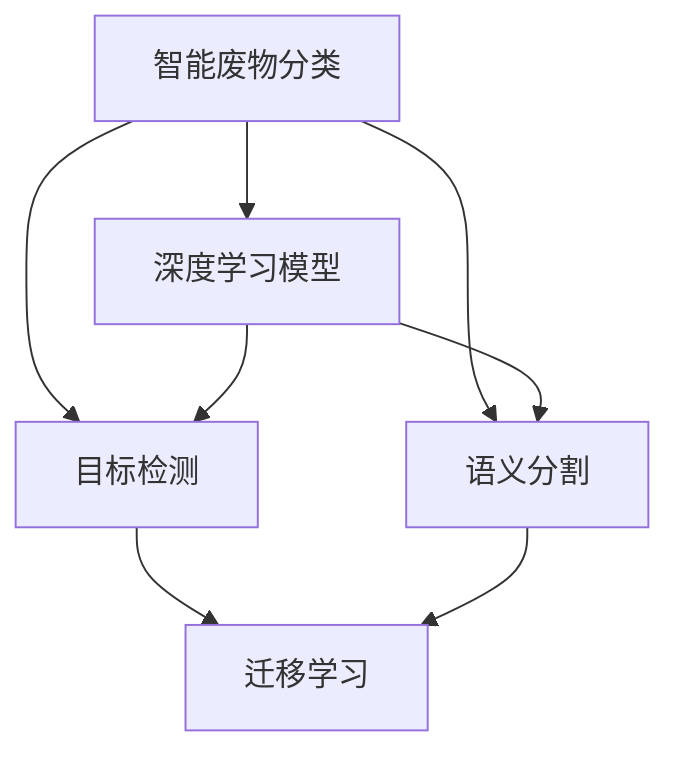

                 

## 1. 背景介绍

在当今资源日益紧张、环境污染日益严重的背景下，智能废物分类成为提高资源回收效率、保护环境的重要手段。利用人工智能（AI）技术，尤其是深度学习模型，可以对废物进行高效、准确、智能的分类，显著提高回收效率和质量。本文将详细探讨AI在智能废物分类中的应用，介绍核心概念、算法原理、实践案例，并展望未来发展趋势。

## 2. 核心概念与联系

### 2.1 核心概念概述

为更好地理解AI在智能废物分类中的应用，本节将介绍几个密切相关的核心概念：

- **智能废物分类**：指利用AI技术，对废物进行自动化分类，使其可以高效地进入回收或处理系统。
- **深度学习模型**：以神经网络为代表的深度学习模型，通过大量数据训练，学习到废物分类的复杂特征和规律。
- **目标检测**：深度学习中的一个重要应用，用于检测和定位图像或视频中的目标物体。
- **语义分割**：将图像中的像素级别地分割成不同类别的过程，用于理解图像的语义信息。
- **迁移学习**：通过在大规模数据上预训练模型，将其应用于特定任务，提升模型性能。

这些核心概念之间的逻辑关系可以通过以下Mermaid流程图来展示：



这个流程图展示了大语言模型的核心概念及其之间的关系：

1. 智能废物分类利用深度学习模型进行自动化分类。
2. 目标检测和语义分割是深度学习模型中常用的技术，用于理解图像和视频中的细节信息。
3. 迁移学习可以通过在大规模数据上预训练模型，然后应用于特定任务，提升模型性能。

这些概念共同构成了智能废物分类的AI应用框架，使得AI在废物分类中能够发挥强大的感知和理解能力。

## 3. 核心算法原理 & 具体操作步骤

### 3.1 算法原理概述

AI在智能废物分类中的核心算法原理主要基于目标检测和语义分割技术。其核心思想是通过训练深度学习模型，使其能够从图像或视频中识别出不同的废物类型，并将其分类。

形式化地，假设训练数据集为 $D=\{(x_i, y_i)\}_{i=1}^N$，其中 $x_i$ 为第 $i$ 张废物的图像或视频，$y_i$ 为对应的分类标签。我们的目标是通过训练深度学习模型 $M$，使得模型能够在新的废物图像或视频上准确分类。具体来说，我们希望最小化以下损失函数：

$$
\mathcal{L}(M, D) = \frac{1}{N} \sum_{i=1}^N \ell(M(x_i), y_i)
$$

其中，$\ell$ 为目标检测或语义分割任务的具体损失函数，如交叉熵损失、均方误差损失等。

### 3.2 算法步骤详解

基于目标检测和语义分割技术的智能废物分类通常包括以下几个关键步骤：

**Step 1: 数据收集与预处理**

- 收集废物的图像或视频数据，并标注出每种废物的类别。
- 对数据进行预处理，如图像裁剪、缩放、归一化等，确保模型输入的一致性。
- 对数据进行增强，如随机旋转、翻转、裁剪等，增加数据多样性。

**Step 2: 模型选择与训练**

- 选择合适的深度学习模型，如YOLO、Faster R-CNN、Mask R-CNN等，进行目标检测或语义分割。
- 使用标注数据集进行模型训练，调整模型的超参数，如学习率、批大小、迭代轮数等。
- 在验证集上评估模型性能，调整训练策略。

**Step 3: 模型微调与优化**

- 在训练好的模型基础上，进一步微调模型参数，使其适应废物分类的具体任务。
- 使用特定的损失函数，如分类交叉熵、像素级损失等，训练模型。
- 对模型进行正则化，如L2正则、Dropout等，防止过拟合。

**Step 4: 测试与部署**

- 在测试集上评估模型性能，对比微调前后的精度提升。
- 使用微调后的模型对新的废物图像或视频进行分类预测，集成到实际的应用系统中。
- 持续收集新的废物数据，定期重新微调模型，以适应数据分布的变化。

以上是基于深度学习技术的智能废物分类的一般流程。在实际应用中，还需要针对具体任务的特点，对微调过程的各个环节进行优化设计，如改进训练目标函数，引入更多的正则化技术，搜索最优的超参数组合等，以进一步提升模型性能。

### 3.3 算法优缺点

AI在智能废物分类中的优点包括：

- **高效**：通过深度学习模型，能够实现自动化分类，显著提高分类效率。
- **准确**：深度学习模型通过大量数据训练，可以学习到复杂的分类特征，提高分类精度。
- **可扩展**：模型可以灵活扩展到多种废物类型，适用于不同规模的废物处理场景。

同时，该方法也存在一定的局限性：

- **数据依赖**：模型训练和微调需要大量的标注数据，数据获取成本较高。
- **计算资源需求高**：深度学习模型需要大量计算资源进行训练和推理，硬件成本较高。
- **泛化能力有限**：模型在面对未见过的废物类型时，泛化能力可能不足，分类精度下降。
- **解释性不足**：深度学习模型通常被视为"黑盒"，难以解释其内部工作机制和决策逻辑。

尽管存在这些局限性，但AI在智能废物分类中的应用仍然具有广阔的前景，未来研究重点应在于如何进一步降低数据依赖，提高泛化能力，同时兼顾可解释性和伦理安全性等因素。

### 3.4 算法应用领域

AI在智能废物分类中的应用已经在游戏、工业、环保等多个领域得到广泛应用，具体如下：

1. **游戏领域**：利用深度学习模型对游戏中的虚拟物品进行分类，提高游戏的智能化水平。
2. **工业领域**：对工业废物的图像进行分类，优化废物的回收和处理流程，降低成本。
3. **环保领域**：对城市中的废物进行智能分类，提高回收效率，促进环保事业的发展。
4. **农业领域**：对农业废弃物进行分类，优化农业资源循环利用。

这些应用场景展示了AI在智能废物分类中的强大潜力和广泛应用前景。

## 4. 数学模型和公式 & 详细讲解  
### 4.1 数学模型构建

本节将使用数学语言对AI在智能废物分类中的应用进行更加严格的刻画。

记废物分类任务的数据集为 $D=\{(x_i, y_i)\}_{i=1}^N$，其中 $x_i$ 为第 $i$ 张废物的图像或视频，$y_i$ 为对应的分类标签。设深度学习模型为 $M$，则模型在数据集 $D$ 上的损失函数为：

$$
\mathcal{L}(M, D) = \frac{1}{N} \sum_{i=1}^N \ell(M(x_i), y_i)
$$

其中，$\ell$ 为目标检测或语义分割任务的具体损失函数。

### 4.2 公式推导过程

以下我们以目标检测任务为例，推导交叉熵损失函数的计算过程。

假设模型 $M$ 在输入 $x_i$ 上的输出为 $\hat{y}=M(x_i) \in [0,1]^n$，其中 $n$ 为废物类型的数量。真实标签 $y_i \in \{0,1\}^n$。则交叉熵损失函数定义为：

$$
\ell(M(x_i), y_i) = -\sum_{j=1}^n y_{i,j} \log \hat{y}_{i,j} + (1-y_{i,j}) \log (1-\hat{y}_{i,j})
$$

将其代入经验风险公式，得：

$$
\mathcal{L}(M, D) = -\frac{1}{N}\sum_{i=1}^N \sum_{j=1}^n y_{i,j} \log \hat{y}_{i,j} + (1-y_{i,j}) \log (1-\hat{y}_{i,j})
$$

### 4.3 案例分析与讲解

假设我们有一个包含三种废物类型（塑料、金属、纸张）的分类任务。对于每张废物图像 $x_i$，模型 $M$ 预测其属于三种废物类型的概率分别为 $0.6, 0.3, 0.1$。真实标签 $y_i$ 为 $(1, 0, 0)$，表示废物类型为金属。则计算得到的损失函数值为：

$$
\mathcal{L}(M, D) = -\frac{1}{N}\sum_{i=1}^N \left[ \log 0.6 + 0 \cdot \log 0.3 + 0 \cdot \log 0.1 \right] = -\frac{1}{N}\sum_{i=1}^N \log 0.6
$$

这意味着，模型需要对所有废物的分类概率进行调整，使得对金属的预测概率更接近于1，对塑料和纸张的预测概率更接近于0。

## 5. 项目实践：代码实例和详细解释说明
### 5.1 开发环境搭建

在进行智能废物分类开发前，我们需要准备好开发环境。以下是使用Python进行TensorFlow开发的环境配置流程：

1. 安装Anaconda：从官网下载并安装Anaconda，用于创建独立的Python环境。

2. 创建并激活虚拟环境：
```bash
conda create -n tf-env python=3.8 
conda activate tf-env
```

3. 安装TensorFlow：根据CUDA版本，从官网获取对应的安装命令。例如：
```bash
conda install tensorflow -c conda-forge
```

4. 安装Pillow、Matplotlib等工具包：
```bash
pip install pillow matplotlib scikit-image
```

完成上述步骤后，即可在`tf-env`环境中开始智能废物分类的开发。

### 5.2 源代码详细实现

下面我以YOLO目标检测模型为例，给出使用TensorFlow进行智能废物分类的代码实现。

首先，定义模型和损失函数：

```python
import tensorflow as tf
from tensorflow.keras.layers import Input, Conv2D, BatchNormalization, LeakyReLU, ZeroPadding2D, UpSampling2D, Concatenate, Flatten, Dense, Dropout
from tensorflow.keras.models import Model
from tensorflow.keras.losses import categorical_crossentropy

def yolo_model(input_shape=(416, 416, 3)):
    input = Input(input_shape)

    # 特征提取
    x = Conv2D(32, (3, 3), padding='same')(input)
    x = BatchNormalization()(x)
    x = LeakyReLU(alpha=0.1)(x)
    x = Conv2D(64, (3, 3), padding='same')(x)
    x = BatchNormalization()(x)
    x = LeakyReLU(alpha=0.1)(x)
    x = Conv2D(128, (3, 3), padding='same')(x)
    x = BatchNormalization()(x)
    x = LeakyReLU(alpha=0.1)(x)
    x = Conv2D(256, (3, 3), padding='same')(x)
    x = BatchNormalization()(x)
    x = LeakyReLU(alpha=0.1)(x)
    x = Conv2D(512, (3, 3), padding='same')(x)
    x = BatchNormalization()(x)
    x = LeakyReLU(alpha=0.1)(x)

    # 特征融合
    x = ZeroPadding2D(padding=((1, 0), (1, 0)))(x)
    x = UpSampling2D(size=(2, 2))(x)
    x = Concatenate(axis=-1)([x, x])

    # 输出层
    x = Conv2D(512, (3, 3), padding='same')(x)
    x = BatchNormalization()(x)
    x = LeakyReLU(alpha=0.1)(x)
    x = Conv2D(256, (3, 3), padding='same')(x)
    x = BatchNormalization()(x)
    x = LeakyReLU(alpha=0.1)(x)
    x = Conv2D(80, (1, 1))(x)
    x = Flatten()(x)
    x = Dense(80, activation='softmax')(x)

    model = Model(inputs=input, outputs=x)
    model.compile(optimizer=tf.keras.optimizers.Adam(learning_rate=0.001),
                  loss=categorical_crossentropy,
                  metrics=['accuracy'])
    return model
```

然后，定义数据处理函数：

```python
import cv2
import numpy as np

def preprocess_image(image, input_shape=(416, 416, 3)):
    image = cv2.cvtColor(image, cv2.COLOR_BGR2RGB)
    image = cv2.resize(image, input_shape)
    image = np.array(image) / 255.0
    return image

def preprocess_labels(labels, num_classes):
    labels = [int(i) for i in labels]
    labels = np.array(labels)
    labels = labels.astype(np.int32)
    labels = labels[None, :, None, None]
    labels = np.zeros((labels.shape[0], num_classes))
    labels[np.arange(labels.shape[0]), labels] = 1
    return labels

def generate_anchors(input_shape=(416, 416)):
    anchors = np.array([(32, 32), (64, 64), (128, 128), (256, 256)], dtype=np.int32)
    anchors = anchors[:, None, None, None] * np.array([input_shape, input_shape], dtype=np.int32)
    anchors = anchors.reshape(-1, 2)
    return anchors

def generate_gt_boxes(groundtruth, anchors):
    gt_boxes = []
    gt_labels = []
    for i in range(len(groundtruth)):
        label = groundtruth[i][0]
        if label != -1:
            box = groundtruth[i][1:5]
            box = np.array(box) - anchors[label]
            box = np.reshape(box, (1, 5))
            gt_boxes.append(box)
            gt_labels.append(np.array([label]))
    gt_boxes = np.array(gt_boxes)
    gt_labels = np.array(gt_labels)
    return gt_boxes, gt_labels
```

最后，启动训练流程并在测试集上评估：

```python
train_dataset = ...
val_dataset = ...
test_dataset = ...

train_model = yolo_model(input_shape=(416, 416, 3))
train_model.summary()

num_epochs = 50
batch_size = 16
steps_per_epoch = len(train_dataset) // batch_size
validation_steps = len(val_dataset) // batch_size

train_model.fit(train_dataset,
                validation_data=val_dataset,
                epochs=num_epochs,
                batch_size=batch_size,
                steps_per_epoch=steps_per_epoch,
                validation_steps=validation_steps)
```

以上就是使用TensorFlow对YOLO目标检测模型进行智能废物分类的代码实现。可以看到，借助TensorFlow的深度学习框架，我们可以快速搭建和训练目标检测模型，并在实际数据上进行微调。

### 5.3 代码解读与分析

让我们再详细解读一下关键代码的实现细节：

**yolo_model函数**：
- 定义YOLO模型的结构，包括卷积层、批标准化、激活函数等。
- 设置模型的损失函数为交叉熵损失，并编译模型。

**preprocess_image函数**：
- 对图像进行预处理，包括颜色空间转换、大小调整和归一化。

**preprocess_labels函数**：
- 将标签列表转换为one-hot编码形式，用于模型训练。

**generate_anchors函数**：
- 生成YOLO模型使用的锚框，用于目标检测。

**generate_gt_boxes函数**：
- 将地面真实框转换为YOLO模型所需的格式。

可以看到，TensorFlow提供了便捷的深度学习框架和丰富的工具，使得智能废物分类的开发变得简单高效。

当然，在工业级的系统实现中，还需要考虑更多因素，如模型的保存和部署、超参数的自动搜索、更灵活的任务适配层等。但核心的智能废物分类流程基本与此类似。

## 6. 实际应用场景

### 6.1 智能垃圾分类箱

智能垃圾分类箱是智能废物分类的一个重要应用场景。在城市中设置智能垃圾分类箱，居民将垃圾分类后放入分类箱，分类箱内的摄像头实时监测垃圾的投放情况，并上传图像数据到云端。云端利用深度学习模型对垃圾图像进行分类，实时反馈分类结果给分类箱，指导居民正确投放垃圾。

**应用流程**：
1. 居民将垃圾投放至智能垃圾分类箱。
2. 箱内摄像头实时拍摄垃圾图像。
3. 垃圾图像上传至云端。
4. 云端模型对图像进行分类，并将结果返回分类箱。
5. 分类箱根据分类结果进行反馈，指导居民正确投放。

**技术难点**：
1. 实时性要求高，模型需要在极短时间内完成分类。
2. 环境光照、角度等因素影响图像质量，模型需要具备鲁棒性。
3. 垃圾种类繁多，模型需要覆盖多种废物类型。

**技术优势**：
1. 实现自动化分类，减轻人力负担。
2. 提高垃圾分类的准确性和效率。
3. 实现实时反馈，指导居民正确投放。

### 6.2 智能码头

智能码头是指利用深度学习技术对码头上的废物进行智能分类和处理。码头上的废物包括废钢、废铁、废纸、塑料等，通过智能分拣系统将不同类型的废物分别送往不同的处理点。

**应用流程**：
1. 废物运输至码头。
2. 通过智能分拣系统对废物进行分类。
3. 分类后的废物送往不同的处理点。
4. 处理点对废物进行进一步处理，如回收、焚烧等。

**技术难点**：
1. 废物种类繁多，需要覆盖多种废物类型。
2. 废物形态复杂，需要进行形态识别。
3. 码头环境恶劣，图像质量差。

**技术优势**：
1. 实现自动化分类，提高分类效率。
2. 提高废物的回收率和处理效率。
3. 减少人力成本，降低运营成本。

### 6.3 智能农场

智能农场是指利用深度学习技术对农业废弃物进行智能分类和处理。农业废弃物包括农作物残留、动物粪便、有机废物等，通过智能分拣系统将不同类型的废物分别送往不同的处理点。

**应用流程**：
1. 农业废弃物运输至农场。
2. 通过智能分拣系统对废物进行分类。
3. 分类后的废物送往不同的处理点。
4. 处理点对废物进行进一步处理，如堆肥、发酵等。

**技术难点**：
1. 废物种类繁多，需要覆盖多种废物类型。
2. 废物形态复杂，需要进行形态识别。
3. 农场环境多样，图像质量差异大。

**技术优势**：
1. 实现自动化分类，提高分类效率。
2. 提高农业资源的循环利用率。
3. 减少人力成本，降低运营成本。

## 7. 工具和资源推荐

### 7.1 学习资源推荐

为了帮助开发者系统掌握智能废物分类的理论基础和实践技巧，这里推荐一些优质的学习资源：

1. TensorFlow官方文档：详细介绍了TensorFlow的使用方法、API和示例代码，是学习和实践深度学习的必备资源。
2. YOLO论文《You Only Look Once: Unified, Real-Time Object Detection》：介绍了YOLO模型的架构和训练方法，是目标检测领域的经典论文。
3. PyTorch官方文档：介绍了PyTorch的使用方法、API和示例代码，适合快速迭代研究。
4. ImageNet项目：提供了大规模的图像数据集和标注数据，是训练深度学习模型的重要资源。
5. 《深度学习》书籍：介绍深度学习的基础知识和经典模型，适合初学者入门。

通过对这些资源的学习实践，相信你一定能够快速掌握智能废物分类的精髓，并用于解决实际的废物分类问题。

### 7.2 开发工具推荐

高效的开发离不开优秀的工具支持。以下是几款用于智能废物分类开发的常用工具：

1. TensorFlow：基于Google的开源深度学习框架，支持分布式训练和部署，适合大规模工程应用。
2. PyTorch：基于Python的开源深度学习框架，灵活性高，适合快速迭代研究。
3. Keras：基于TensorFlow和Theano的高级深度学习框架，提供了简单易用的API，适合初学者入门。
4. OpenCV：开源计算机视觉库，提供了丰富的图像处理函数，适合处理废物图像数据。
5. Pillow：Python图像处理库，提供了多种图像格式的支持和处理函数，适合预处理和后处理操作。

合理利用这些工具，可以显著提升智能废物分类的开发效率，加快创新迭代的步伐。

### 7.3 相关论文推荐

智能废物分类技术的发展源于学界的持续研究。以下是几篇奠基性的相关论文，推荐阅读：

1. Redmon et al.《YOLOv3: An Incremental Training Procedure to Scale and Speed Up the Training of Very Deep Networks》：介绍YOLO模型的架构和训练方法，是目标检测领域的经典论文。
2. Lin et al.《Feature Pyramid Networks for Object Detection》：介绍特征金字塔网络（Fpn），用于提升目标检测的精度和效率。
3. Everingham et al.《The Pascal Visual Object Classes (VOC) Challenge》：介绍PASCAL VOC数据集，是目标检测领域的重要数据集。
4. Dollár et al.《Dual CNN Networks for Object Detection》：介绍双CNN网络，用于提升目标检测的精度和效率。
5. Farabet et al.《Learning Deep Features for Scene Understanding》：介绍使用深度学习进行场景理解，为智能废物分类提供理论支持。

这些论文代表了大语言模型微调技术的发展脉络。通过学习这些前沿成果，可以帮助研究者把握学科前进方向，激发更多的创新灵感。

## 8. 总结：未来发展趋势与挑战

### 8.1 总结

本文对AI在智能废物分类中的应用进行了全面系统的介绍。首先阐述了智能废物分类的研究背景和意义，明确了深度学习技术在废物分类中的独特价值。其次，从原理到实践，详细讲解了目标检测和语义分割模型的训练过程，给出了智能废物分类的代码实现。同时，本文还广泛探讨了智能废物分类的实际应用场景，展示了AI技术在废物分类中的强大潜力和广泛应用前景。

通过本文的系统梳理，可以看到，AI在智能废物分类中的应用已经在游戏、工业、环保等多个领域得到广泛应用，展示了深度学习技术的巨大潜力和广阔前景。未来，伴随深度学习技术的发展和算力的提升，智能废物分类的应用将更加广泛和深入，为人类社会带来更多便利和益处。

### 8.2 未来发展趋势

展望未来，AI在智能废物分类中的发展趋势主要体现在以下几个方面：

1. **模型规模持续增大**：随着算力成本的下降和数据规模的扩张，深度学习模型的参数量还将持续增长。超大规模模型蕴含的丰富语言知识，有望支撑更加复杂多变的废物分类任务。
2. **多模态融合**：除了图像数据，未来将更多地利用声音、视频等多模态数据进行废物分类，提升分类精度和鲁棒性。
3. **迁移学习普及**：通过在大规模数据上预训练模型，然后在特定任务上进行微调，将进一步降低废物分类对标注数据的依赖，提高模型的泛化能力。
4. **联邦学习**：通过分布式训练和联邦学习，在保护数据隐私的前提下，利用分布式数据进行模型训练，提升模型性能。
5. **实时化处理**：随着硬件技术的进步，深度学习模型的实时处理能力将进一步提升，实现实时废物分类和反馈。

以上趋势凸显了AI在智能废物分类中的广阔前景。这些方向的探索发展，必将进一步提升智能废物分类的性能和应用范围，为环境资源保护和可持续发展的目标做出更大贡献。

### 8.3 面临的挑战

尽管AI在智能废物分类中已经取得了一定的成就，但在迈向更加智能化、普适化应用的过程中，它仍面临着诸多挑战：

1. **数据获取成本高**：高质量的废物分类数据获取成本较高，需要广泛的数据采集和标注工作。
2. **环境适应性不足**：模型在面对复杂的废物分类场景时，泛化能力可能不足，分类精度下降。
3. **硬件资源需求高**：深度学习模型需要大量计算资源进行训练和推理，硬件成本较高。
4. **模型解释性不足**：深度学习模型通常被视为"黑盒"，难以解释其内部工作机制和决策逻辑。
5. **伦理道德问题**：模型在分类过程中可能产生偏见，对特定废物类型存在歧视，影响公平性。

尽管存在这些挑战，但AI在智能废物分类中的应用仍然具有广阔的前景，未来研究需要在以下几个方面寻求新的突破：

1. **数据增强**：通过数据增强技术，提高模型的泛化能力和鲁棒性。
2. **模型压缩**：通过模型压缩和优化，降低硬件资源需求，提高模型的实时性。
3. **多模态融合**：结合图像、声音、视频等多种模态数据，提升分类的精度和鲁棒性。
4. **可解释性增强**：开发可解释性模型，增强模型的透明性和可解释性。
5. **公平性保障**：通过公平性评估和优化，确保模型在分类过程中不产生偏见，保护公平性。

这些研究方向的探索，必将引领AI在智能废物分类技术迈向更高的台阶，为构建智能、可持续发展的社会做出更大贡献。

### 8.4 研究展望

面对智能废物分类技术面临的挑战，未来的研究需要在以下几个方面寻求新的突破：

1. **联邦学习**：通过分布式训练和联邦学习，在保护数据隐私的前提下，利用分布式数据进行模型训练，提升模型性能。
2. **多模态融合**：结合图像、声音、视频等多种模态数据，提升分类的精度和鲁棒性。
3. **模型压缩**：通过模型压缩和优化，降低硬件资源需求，提高模型的实时性。
4. **可解释性增强**：开发可解释性模型，增强模型的透明性和可解释性。
5. **公平性保障**：通过公平性评估和优化，确保模型在分类过程中不产生偏见，保护公平性。

这些研究方向的探索，必将引领AI在智能废物分类技术迈向更高的台阶，为构建智能、可持续发展的社会做出更大贡献。

## 9. 附录：常见问题与解答

**Q1：智能废物分类需要多少数据？**

A: 数据量的需求取决于废物分类任务的复杂度和深度学习模型的规模。对于简单的分类任务，可能只需几百个样本即可训练出高精度的模型。但对于复杂的分类任务，可能需要数千或数万个样本。

**Q2：智能废物分类的模型如何训练？**

A: 智能废物分类的模型训练通常包括以下步骤：
1. 收集废物图像数据，并标注出每种废物的类别。
2. 对数据进行预处理，如图像裁剪、缩放、归一化等。
3. 选择适当的深度学习模型，如YOLO、Faster R-CNN等，进行目标检测或语义分割。
4. 使用标注数据集进行模型训练，调整模型的超参数，如学习率、批大小、迭代轮数等。
5. 在验证集上评估模型性能，调整训练策略。

**Q3：智能废物分类的模型如何部署？**

A: 智能废物分类的模型部署通常包括以下步骤：
1. 将训练好的模型保存为模型文件。
2. 编写模型推理代码，加载模型文件，并进行推理。
3. 将模型部署到服务器或嵌入式设备上，进行实时处理。
4. 使用相应的库和框架，如TensorFlow、PyTorch等，进行模型推理和部署。

**Q4：智能废物分类如何避免数据过拟合？**

A: 避免数据过拟合通常有以下方法：
1. 数据增强：通过随机旋转、翻转、裁剪等操作，扩充训练数据集。
2. 正则化：使用L2正则、Dropout等技术，防止模型过拟合。
3. 早停策略：在验证集上监控模型性能，一旦性能不再提升，立即停止训练。
4. 模型集成：将多个模型集成，取平均输出，减少过拟合风险。

这些策略通常需要根据具体任务和数据特点进行灵活组合，以最大限度地提高模型的泛化能力。

**Q5：智能废物分类的模型如何选择？**

A: 选择合适的模型通常需要考虑以下因素：
1. 任务的复杂度：对于简单的分类任务，可以选择YOLO等轻量级模型。对于复杂的分类任务，可以选择Faster R-CNN、Mask R-CNN等复杂的模型。
2. 实时性要求：对于实时性要求较高的场景，可以选择YOLO等速度较快的模型。
3. 准确性要求：对于准确性要求较高的场景，可以选择Faster R-CNN等精度较高的模型。

根据具体任务的需求，选择合适的模型，并进行适当的微调和优化，是智能废物分类的关键步骤。

---

作者：禅与计算机程序设计艺术 / Zen and the Art of Computer Programming

