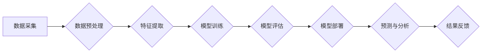

>  人工智能、生物制药、药物研发、机器学习、深度学习、自然语言处理、计算机视觉

## 1. 背景介绍

生物制药行业一直以来都面临着研发周期长、成本高昂、成功率低等挑战。传统药物研发流程依赖于大量的实验和临床试验，耗时耗力，且难以预测药物的疗效和安全性。近年来，人工智能（AI）技术飞速发展，为生物制药行业带来了革命性的变革。AI算法能够高效地分析海量生物数据，识别药物靶点、预测药物活性、加速临床试验等，极大地提高了药物研发效率和成功率。

## 2. 核心概念与联系

**2.1 核心概念**

* **人工智能 (AI):**  模拟人类智能的计算机系统，能够学习、推理、决策等。
* **机器学习 (ML):**  一种AI子领域，通过算法从数据中学习，不断改进预测或分类能力。
* **深度学习 (DL):**  一种更高级的机器学习方法，利用多层神经网络模拟人类大脑结构，能够处理更复杂的数据。
* **自然语言处理 (NLP):**  使计算机能够理解和处理人类语言。
* **计算机视觉 (CV):**  使计算机能够“看”图像和视频，并从中提取信息。

**2.2  AI在生物制药中的应用**

AI技术在生物制药领域的应用涵盖多个环节，包括：

* **药物发现与开发:** 
    * 识别潜在药物靶点
    * 预测药物活性
    * 虚拟筛选候选药物
    * 优化药物结构
* **临床试验:**
    * 患者筛选
    * 临床试验设计
    * 临床数据分析
* **药物安全性评估:**
    * 预测药物不良反应
    * 识别药物相互作用
* **个性化医疗:**
    * 根据患者基因信息预测药物疗效
    * 优化药物剂量

**2.3  AI技术架构**



## 3. 核心算法原理 & 具体操作步骤

**3.1  算法原理概述**

在生物制药领域，常用的AI算法包括：

* **机器学习算法:** 
    * **监督学习:** 利用标记数据训练模型，例如分类和回归问题。
    * **无监督学习:**  从未标记数据中发现模式，例如聚类和降维。
    * **强化学习:**  通过奖励和惩罚机制训练模型，例如游戏和机器人控制。
* **深度学习算法:** 
    * **卷积神经网络 (CNN):**  擅长处理图像数据，例如药物分子结构识别。
    * **循环神经网络 (RNN):**  擅长处理序列数据，例如蛋白质序列分析。
    * **生成对抗网络 (GAN):**  能够生成新的数据，例如虚拟药物分子设计。

**3.2  算法步骤详解**

以药物活性预测为例，使用机器学习算法的步骤如下：

1. **数据收集:** 收集药物分子结构和活性数据。
2. **数据预处理:** 清洗、转换和格式化数据，例如特征提取和数据归一化。
3. **模型选择:** 选择合适的机器学习算法，例如支持向量机 (SVM) 或随机森林 (RF)。
4. **模型训练:** 利用训练数据训练模型，调整模型参数。
5. **模型评估:** 利用测试数据评估模型性能，例如准确率和AUC。
6. **模型部署:** 将训练好的模型部署到生产环境中，用于预测新药物的活性。

**3.3  算法优缺点**

* **优点:** 
    * 自动化数据分析，提高效率。
    * 识别复杂模式，发现潜在关联。
    * 预测药物活性，加速药物研发。
* **缺点:** 
    * 需要大量高质量数据训练。
    * 模型解释性较差，难以理解决策过程。
    * 算法本身存在局限性，难以解决所有问题。

**3.4  算法应用领域**

* **药物靶点发现:** 识别疾病相关的基因或蛋白质。
* **药物活性预测:** 预测药物对特定靶点的结合能力。
* **药物毒性预测:** 预测药物的潜在毒性作用。
* **药物组合优化:** 寻找最佳药物组合，提高疗效。
* **临床试验设计:** 优化临床试验方案，提高效率和准确性。

## 4. 数学模型和公式 & 详细讲解 & 举例说明

**4.1  数学模型构建**

在生物制药领域，常用的数学模型包括：

* **逻辑回归模型:** 用于预测二分类问题，例如药物是否有效。
* **线性回归模型:** 用于预测连续变量，例如药物浓度与疗效之间的关系。
* **支持向量机 (SVM):** 用于分类和回归问题，能够处理高维数据。
* **随机森林 (RF):**  一种集成学习方法，通过多个决策树的投票来预测结果。

**4.2  公式推导过程**

以逻辑回归模型为例，其目标函数为：

$$
L(w,b) = -\frac{1}{n} \sum_{i=1}^{n} y_i \log(p_i) + (1-y_i) \log(1-p_i)
$$

其中：

* $w$ 和 $b$ 是模型参数。
* $y_i$ 是第 $i$ 个样本的真实标签 (0 或 1)。
* $p_i$ 是模型预测第 $i$ 个样本的概率。

**4.3  案例分析与讲解**

假设我们想要预测药物是否有效，可以使用逻辑回归模型。训练数据包括药物的分子结构特征和是否有效的标签。模型训练完成后，可以输入新的药物分子结构特征，预测其是否有效。

## 5. 项目实践：代码实例和详细解释说明

**5.1  开发环境搭建**

* Python 3.x
* TensorFlow 或 PyTorch
* Scikit-learn
* Jupyter Notebook

**5.2  源代码详细实现**

```python
# 导入必要的库
import pandas as pd
from sklearn.model_selection import train_test_split
from sklearn.linear_model import LogisticRegression
from sklearn.metrics import accuracy_score

# 加载数据
data = pd.read_csv('drug_data.csv')

# 分割数据
X = data.drop('activity', axis=1)
y = data['activity']
X_train, X_test, y_train, y_test = train_test_split(X, y, test_size=0.2, random_state=42)

# 训练模型
model = LogisticRegression()
model.fit(X_train, y_train)

# 预测结果
y_pred = model.predict(X_test)

# 评估模型性能
accuracy = accuracy_score(y_test, y_pred)
print(f'模型准确率: {accuracy}')
```

**5.3  代码解读与分析**

* 首先，导入必要的库。
* 然后，加载数据并将其分割为训练集和测试集。
* 接下来，训练逻辑回归模型，并使用测试集评估模型性能。
* 最后，打印模型的准确率。

**5.4  运行结果展示**

运行代码后，会输出模型的准确率。

## 6. 实际应用场景

**6.1  药物靶点发现**

AI算法可以分析基因组数据、蛋白质结构数据等，识别与疾病相关的靶点，为药物研发提供方向。

**6.2  药物活性预测**

AI算法可以预测药物对特定靶点的结合能力，筛选出具有高活性候选药物。

**6.3  药物毒性预测**

AI算法可以预测药物的潜在毒性作用，降低药物研发风险。

**6.4  未来应用展望**

* **个性化医疗:** 根据患者基因信息预测药物疗效，优化药物剂量。
* **精准医疗:**  根据患者的疾病类型和特征，选择最有效的治疗方案。
* **新药研发加速:**  缩短药物研发周期，降低研发成本。

## 7. 工具和资源推荐

**7.1  学习资源推荐**

* **在线课程:** Coursera, edX, Udacity
* **书籍:**
    * Deep Learning by Ian Goodfellow
    * Hands-On Machine Learning with Scikit-Learn, Keras & TensorFlow by Aurélien Géron
* **博客和论坛:** Towards Data Science, Kaggle

**7.2  开发工具推荐**

* **Python:**  主流的机器学习编程语言。
* **TensorFlow:**  开源深度学习框架。
* **PyTorch:**  另一个流行的深度学习框架。
* **Scikit-learn:**  机器学习库。

**7.3  相关论文推荐**

* **Nature:**  https://www.nature.com/
* **Science:**  https://www.science.org/
* **Cell:**  https://www.cell.com/

## 8. 总结：未来发展趋势与挑战

**8.1  研究成果总结**

AI技术在生物制药领域取得了显著进展，加速了药物研发进程，提高了药物研发效率和成功率。

**8.2  未来发展趋势**

* **更强大的AI算法:**  开发更强大的AI算法，例如迁移学习和强化学习，提高药物研发效率。
* **更丰富的多模态数据:**  整合基因组数据、蛋白质结构数据、临床数据等多模态数据，提高药物研发精准度。
* **更个性化的医疗:**  利用AI技术实现个性化医疗，为患者提供更精准的治疗方案。

**8.3  面临的挑战**

* **数据质量和隐私问题:**  确保数据质量和隐私安全，避免算法偏差。
* **算法解释性和可信度:**  提高算法解释性和可信度，增强用户对AI技术的信任。
* **伦理和社会影响:**  关注AI技术的伦理和社会影响，确保其安全和可持续发展。

**8.4  研究展望**

未来，AI技术将继续推动生物制药行业的创新发展，为人类健康带来更多福祉。


## 9. 附录：常见问题与解答

**9.1  常见问题**

* **AI技术是否会取代生物制药工作者？**

AI技术可以辅助生物制药工作者，提高工作效率，但不会取代人类的工作。AI算法需要人类的指导和监督，才能发挥最佳效果。

* **AI技术在生物制药领域的应用有哪些风险？**

AI技术应用存在一些风险，例如数据偏差、算法解释性差、伦理问题等。需要加强监管和伦理规范，确保AI技术安全和可持续发展。

**9.2  解答**

* **AI技术在生物制药领域的应用前景如何？**

AI技术在生物制药领域的应用前景广阔，有望加速药物研发进程，提高药物研发效率和成功率，为人类健康带来更多福祉。

作者：禅与计算机程序设计艺术 / Zen and the Art of Computer Programming 


<end_of_turn>