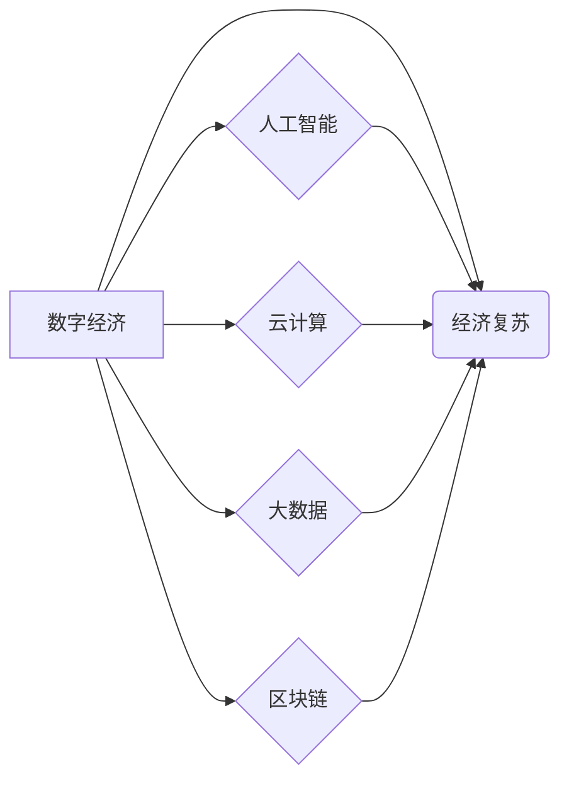

> 疫情、经济复苏、数字经济、人工智能、云计算、大数据、区块链

## 1. 背景介绍

新冠疫情的爆发对全球经济造成了前所未有的冲击。封锁措施、供应链中断和消费者信心下降导致了经济衰退。然而，疫情也加速了数字经济的发展，推动了人工智能、云计算、大数据等技术的应用。在疫情后的世界，经济复苏面临着诸多挑战，同时也蕴藏着新的机遇。

## 2. 核心概念与联系

**2.1 数字经济与经济复苏**

数字经济是指以数字技术为基础，以数据为核心要素，以网络为平台，以智能化和数字化为特征的经济形态。疫情加速了数字经济的发展，推动了线上消费、远程办公、在线教育等模式的普及。数字经济的快速发展为经济复苏提供了新的动力。

**2.2 人工智能与经济复苏**

人工智能（AI）是指模拟人类智能的计算机系统。AI技术在疫情期间发挥了重要作用，例如在疫情防控、医疗诊断、物流配送等方面。AI技术可以提高生产效率、降低成本、创造新的价值，为经济复苏提供强劲支撑。

**2.3 云计算与经济复苏**

云计算是指通过互联网提供计算资源、存储资源和软件服务的模式。云计算可以降低企业的IT成本，提高IT灵活性，为企业数字化转型提供基础设施支持。

**2.4 大数据与经济复苏**

大数据是指海量、高速、多样化的数据。大数据分析可以帮助企业洞察市场趋势、优化运营策略、提升客户体验，为经济复苏提供数据支撑。

**2.5 区块链与经济复苏**

区块链是一种分布式账本技术，可以实现数据安全、透明和不可篡改。区块链技术可以应用于供应链管理、金融服务、数字资产等领域，提高效率、降低成本，促进经济复苏。

**2.6 核心概念联系关系图**



## 3. 核心算法原理 & 具体操作步骤

**3.1 算法原理概述**

在疫情后的经济复苏过程中，人工智能算法在预测经济趋势、优化资源配置、提高生产效率等方面发挥着重要作用。例如，机器学习算法可以分析历史数据，预测未来经济增长率、消费支出等指标；深度学习算法可以识别图像和文本，帮助企业了解市场需求和消费者行为；强化学习算法可以优化生产流程，提高资源利用率。

**3.2 算法步骤详解**

**机器学习算法的具体操作步骤：**

1. **数据收集和预处理:** 收集相关经济数据，进行清洗、转换和特征工程，以便于算法训练。
2. **模型选择:** 根据具体问题选择合适的机器学习算法，例如线性回归、逻辑回归、决策树、支持向量机等。
3. **模型训练:** 使用训练数据训练模型，调整模型参数，使模型能够准确预测经济指标。
4. **模型评估:** 使用测试数据评估模型的预测精度，并进行模型调优。
5. **模型部署:** 将训练好的模型部署到生产环境中，用于实时预测经济指标。

**3.3 算法优缺点**

**机器学习算法的优缺点：**

* **优点:** 能够从数据中学习规律，预测未来趋势，具有较高的自动化程度。
* **缺点:** 需要大量的数据进行训练，对数据质量要求较高，难以解释模型的决策过程。

**3.4 算法应用领域**

机器学习算法在经济复苏领域具有广泛的应用场景，例如：

* **经济预测:** 预测经济增长率、通货膨胀率、失业率等指标。
* **风险管理:** 识别和评估经济风险，制定风险应对策略。
* **投资决策:** 分析市场趋势，辅助投资决策。
* **政策制定:** 为政府制定经济政策提供数据支持。

## 4. 数学模型和公式 & 详细讲解 & 举例说明

**4.1 数学模型构建**

经济复苏是一个复杂系统，可以用数学模型来描述其运行机制。例如，可以使用经济增长模型来预测经济增长率，可以使用失业率模型来预测失业率的变化趋势。

**4.2 公式推导过程**

经济增长模型的公式如下：

$$Y_t = Y_{t-1} + g \cdot Y_{t-1}$$

其中：

* $Y_t$ 表示t期的经济产出
* $Y_{t-1}$ 表示t-1期的经济产出
* $g$ 表示经济增长率

**4.3 案例分析与讲解**

假设一个国家的经济增长率为2%，那么根据公式，我们可以推算出：

* 如果t-1期的经济产出为1000亿元，那么t期的经济产出为1020亿元。
* 如果t-1期的经济产出为2000亿元，那么t期的经济产出为2040亿元。

**4.4 其他数学模型**

除了经济增长模型，还可以使用其他数学模型来分析经济复苏，例如：

* **IS-LM模型:** 描述了利率和国民收入之间的关系。
* **AD-AS模型:** 描述了总需求和总供给之间的关系。
* **动态随机一般均衡模型 (DSGE):** 描述了经济中各个部门之间的相互作用。

## 5. 项目实践：代码实例和详细解释说明

**5.1 开发环境搭建**

为了实现经济预测模型，我们可以使用Python语言和相关的库，例如：

* **NumPy:** 用于数值计算。
* **Pandas:** 用于数据处理和分析。
* **Scikit-learn:** 用于机器学习算法。
* **Matplotlib:** 用于数据可视化。

**5.2 源代码详细实现**

```python
import pandas as pd
from sklearn.linear_model import LinearRegression

# 加载数据
data = pd.read_csv('economic_data.csv')

# 选择特征变量和目标变量
X = data[['GDP_growth', 'inflation']]
y = data['unemployment']

# 创建线性回归模型
model = LinearRegression()

# 训练模型
model.fit(X, y)

# 预测未来失业率
future_gdp_growth = 2
future_inflation = 3
future_unemployment = model.predict([[future_gdp_growth, future_inflation]])

# 打印预测结果
print(f'未来失业率预测值为: {future_unemployment[0]}')
```

**5.3 代码解读与分析**

这段代码首先加载经济数据，然后选择特征变量和目标变量。接着，创建线性回归模型并训练模型。最后，使用训练好的模型预测未来失业率。

**5.4 运行结果展示**

运行代码后，会输出未来失业率的预测值。

## 6. 实际应用场景

**6.1 政府政策制定**

政府可以使用经济预测模型来预测经济增长率、通货膨胀率等指标，制定相应的经济政策。例如，如果预测经济增长率过低，政府可以采取财政刺激政策来提振经济。

**6.2 企业经营决策**

企业可以使用经济预测模型来预测市场需求、消费者行为等信息，制定相应的经营决策。例如，如果预测消费支出增长，企业可以增加生产和销售力度。

**6.3 投资决策**

投资者可以使用经济预测模型来分析市场趋势，做出投资决策。例如，如果预测某个行业的增长潜力大，投资者可以考虑投资该行业。

**6.4 未来应用展望**

随着人工智能技术的不断发展，经济预测模型将更加精准、高效。未来，经济预测模型将应用于更广泛的领域，例如：

* **个性化金融服务:** 为个人用户提供个性化的金融建议。
* **智能城市建设:** 优化城市资源配置，提高城市管理效率。
* **可持续发展:** 预测环境变化趋势，制定可持续发展策略。

## 7. 工具和资源推荐

**7.1 学习资源推荐**

* **Coursera:** 提供人工智能、机器学习等课程。
* **edX:** 提供经济学、数据科学等课程。
* **Kaggle:** 提供数据科学竞赛和学习资源。

**7.2 开发工具推荐**

* **Python:** 广泛应用于数据科学和人工智能领域。
* **Jupyter Notebook:** 用于交互式编程和数据可视化。
* **TensorFlow:** 深度学习框架。
* **PyTorch:** 深度学习框架。

**7.3 相关论文推荐**

* **Deep Learning for Economic Forecasting**
* **Machine Learning for Macroeconomic Forecasting**
* **Artificial Intelligence and the Future of Work**

## 8. 总结：未来发展趋势与挑战

**8.1 研究成果总结**

疫情后世界经济复苏面临着诸多挑战，但也蕴藏着新的机遇。人工智能、云计算、大数据等数字技术为经济复苏提供了新的动力。

**8.2 未来发展趋势**

未来，经济复苏将更加依赖于数字技术。人工智能将更加深入地应用于经济预测、风险管理、投资决策等领域。

**8.3 面临的挑战**

* **数据质量:** 经济预测模型依赖于高质量的数据，数据质量问题会影响模型的预测精度。
* **算法解释性:** 一些人工智能算法难以解释其决策过程，这可能会导致模型的可信度降低。
* **伦理问题:** 人工智能技术的应用可能会带来伦理问题，例如算法偏见、数据隐私等。

**8.4 研究展望**

未来研究需要关注以下几个方面：

* **提高数据质量:** 开发新的数据采集、清洗和预处理方法，提高数据质量。
* **增强算法解释性:** 研究可解释人工智能算法，提高模型的可信度。
* **解决伦理问题:** 制定人工智能伦理规范，引导人工智能技术健康发展。

## 9. 附录：常见问题与解答

**9.1 如何选择合适的经济预测模型？**

选择合适的经济预测模型需要根据具体问题和数据特点进行选择。例如，如果数据量大，可以使用深度学习模型；如果数据量小，可以使用线性回归模型。

**9.2 如何评估经济预测模型的精度？**

可以使用多种指标来评估经济预测模型的精度，例如均方误差、平均绝对误差等。

**9.3 人工智能技术会取代人类工作吗？**

人工智能技术可以提高工作效率，但不会完全取代人类工作。人类仍然需要发挥创造力、批判性思维和情感智能等方面的优势。

作者：禅与计算机程序设计艺术 / Zen and the Art of Computer Programming


<end_of_turn>