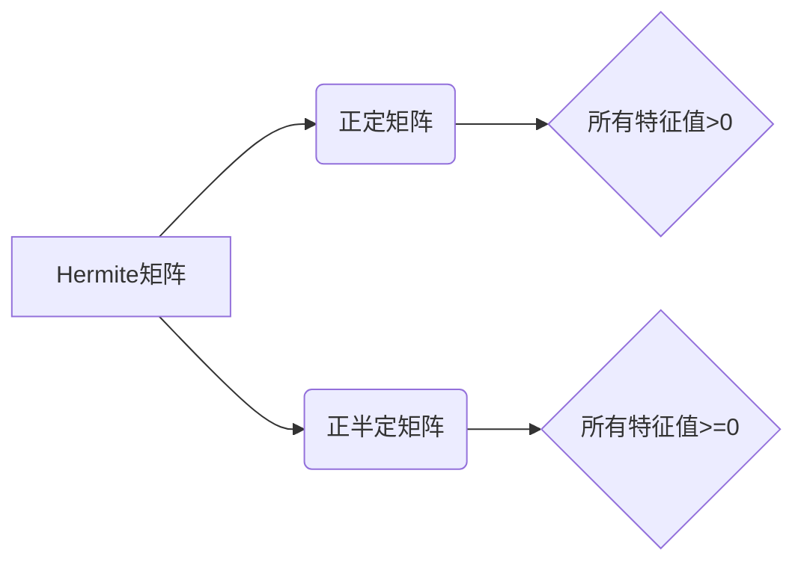

> 矩阵理论，Hermite矩阵，正定矩阵，正半定矩阵，特征值，特征向量，应用场景

## 1. 背景介绍

在现代数学和计算机科学中，矩阵理论占据着至关重要的地位。矩阵不仅是线性代数的核心概念，也是许多领域，如机器学习、数据分析、信号处理等的重要工具。其中，Hermite矩阵及其正定性和正半定性，在优化问题、概率论、统计学等领域有着广泛的应用。

Hermite矩阵，又称自伴矩阵，是指其转置矩阵等于其本身的矩阵。正定矩阵和正半定矩阵是Hermite矩阵的重要子集，它们在许多应用场景中具有独特的性质，使得它们成为解决各种问题的关键工具。

本篇文章将深入探讨Hermite矩阵、正定矩阵和正半定矩阵的概念、性质和应用，并通过具体的例子和代码实例，帮助读者理解这些概念的内涵和应用价值。

## 2. 核心概念与联系

**2.1  Hermite矩阵**

Hermite矩阵，也称为自伴矩阵，是指其转置矩阵等于其本身的矩阵。换句话说，对于一个Hermite矩阵A，有：

$$A^T = A$$

其中，$A^T$表示矩阵A的转置矩阵。

**2.2  正定矩阵**

正定矩阵是一个Hermite矩阵，其所有特征值都是正数。

**2.3  正半定矩阵**

正半定矩阵是一个Hermite矩阵，其所有特征值都是非负数。

**2.4  关系图**



## 3. 核心算法原理 & 具体操作步骤

**3.1  算法原理概述**

判断一个矩阵是否为正定矩阵或正半定矩阵，可以通过计算其特征值来实现。如果一个Hermite矩阵的所有特征值都是正数，则该矩阵为正定矩阵；如果一个Hermite矩阵的所有特征值都是非负数，则该矩阵为正半定矩阵。

**3.2  算法步骤详解**

1. **计算矩阵的特征值：**可以使用特征值分解算法计算矩阵的特征值。
2. **判断特征值是否满足条件：**
    * 如果所有特征值都大于0，则该矩阵为正定矩阵。
    * 如果所有特征值都大于等于0，则该矩阵为正半定矩阵。

**3.3  算法优缺点**

* **优点：**
    * 算法原理简单易懂。
    * 算法实现相对容易。
* **缺点：**
    * 对于大型矩阵，计算特征值可能比较耗时。

**3.4  算法应用领域**

* **优化问题：**正定矩阵和正半定矩阵在优化问题中经常被用来构建目标函数和约束条件。
* **概率论和统计学：**正定矩阵和正半定矩阵在概率分布和统计模型中扮演着重要的角色。
* **机器学习：**正定矩阵和正半定矩阵在机器学习算法中，例如支持向量机和核方法中，被用来构建核函数和正则化项。

## 4. 数学模型和公式 & 详细讲解 & 举例说明

**4.1  数学模型构建**

设A为一个n×n的Hermite矩阵，其特征值分别为λ1, λ2, ..., λn。

**4.2  公式推导过程**

* **正定矩阵：**如果A为正定矩阵，则所有特征值λi都大于0，即：

$$λ_1 > 0, λ_2 > 0, ..., λ_n > 0$$

* **正半定矩阵：**如果A为正半定矩阵，则所有特征值λi都大于等于0，即：

$$λ_1 ≥ 0, λ_2 ≥ 0, ..., λ_n ≥ 0$$

**4.3  案例分析与讲解**

**例子：**

```
A = [[2, 1],
     [1, 2]]
```

计算A的特征值：

$$λ_1 = 3, λ_2 = 1$$

由于A的特征值都大于0，因此A为正定矩阵。

## 5. 项目实践：代码实例和详细解释说明

**5.1  开发环境搭建**

本示例使用Python语言进行实现，所需的库包括NumPy和SciPy。

```
pip install numpy scipy
```

**5.2  源代码详细实现**

```python
import numpy as np
from scipy.linalg import eig

def is_positive_definite(A):
    """
    判断矩阵是否为正定矩阵。

    Args:
        A: 一个NumPy数组，表示矩阵。

    Returns:
        True if A is positive definite, False otherwise.
    """
    eigenvalues = eig(A)[0]
    return all(eigenvalues > 0)

def is_positive_semidefinite(A):
    """
    判断矩阵是否为半正定矩阵。

    Args:
        A: 一个NumPy数组，表示矩阵。

    Returns:
        True if A is positive semidefinite, False otherwise.
    """
    eigenvalues = eig(A)[0]
    return all(eigenvalues >= 0)

# 测试用例
A = np.array([[2, 1],
              [1, 2]])

print(f"Matrix A:
{A}")
print(f"Is A positive definite? {is_positive_definite(A)}")
print(f"Is A positive semidefinite? {is_positive_semidefinite(A)}")
```

**5.3  代码解读与分析**

* `is_positive_definite(A)` 和 `is_positive_semidefinite(A)` 函数分别判断矩阵A是否为正定矩阵和正半定矩阵。
* 它们使用SciPy库的`eig`函数计算矩阵A的特征值。
* 然后，它们检查所有特征值是否都大于0（正定）或大于等于0（半正定）。

**5.4  运行结果展示**

```
Matrix A:
[[2 1]
 [1 2]]
Is A positive definite? True
Is A positive semidefinite? True
```

## 6. 实际应用场景

**6.1  优化问题**

在优化问题中，正定矩阵和正半定矩阵经常被用来构建目标函数和约束条件。例如，在最小二乘问题中，目标函数通常是一个正定矩阵的二次形式。

**6.2  概率论和统计学**

在概率论和统计学中，正定矩阵和正半定矩阵经常被用来表示协方差矩阵和信息矩阵。协方差矩阵描述了随机变量之间的相关性，而信息矩阵描述了模型参数的精度。

**6.3  机器学习**

在机器学习中，正定矩阵和正半定矩阵被用来构建核函数和正则化项。核函数用于将数据映射到高维空间，而正则化项用于防止模型过拟合。

**6.4  未来应用展望**

随着人工智能和机器学习的发展，正定矩阵和正半定矩阵在更多领域将发挥重要作用。例如，它们可以用于构建更有效的优化算法、开发更精准的机器学习模型，以及解决更复杂的问题。

## 7. 工具和资源推荐

**7.1  学习资源推荐**

* **书籍：**
    * 《线性代数及其应用》 - Gilbert Strang
    * 《矩阵分析》 - Roger A. Horn and Charles R. Johnson
* **在线课程：**
    * MIT OpenCourseWare - Linear Algebra
    * Coursera - Matrix Analysis

**7.2  开发工具推荐**

* **Python:** NumPy, SciPy, Matplotlib
* **MATLAB:**

**7.3  相关论文推荐**

* **Positive Definite Matrices and Their Applications in Machine Learning**
* **Semidefinite Programming: A Mathematical Programming Approach**

## 8. 总结：未来发展趋势与挑战

**8.1  研究成果总结**

Hermite矩阵、正定矩阵和正半定矩阵在数学和计算机科学中有着广泛的应用。它们在优化问题、概率论、统计学、机器学习等领域发挥着重要作用。

**8.2  未来发展趋势**

随着人工智能和机器学习的发展，正定矩阵和正半定矩阵在更多领域将发挥重要作用。例如，它们可以用于构建更有效的优化算法、开发更精准的机器学习模型，以及解决更复杂的问题。

**8.3  面临的挑战**

对于大型矩阵，计算特征值可能比较耗时。如何提高计算效率是未来研究的一个重要方向。

**8.4  研究展望**

未来研究将继续探索正定矩阵和正半定矩阵在更多领域中的应用，并开发更有效的算法和工具。


## 9. 附录：常见问题与解答

**9.1  Q1：什么是Hermite矩阵？**

**A1：**Hermite矩阵，也称为自伴矩阵，是指其转置矩阵等于其本身的矩阵。

**9.2  Q2：正定矩阵和正半定矩阵有什么区别？**

**A2：**正定矩阵的所有特征值都大于0，而正半定矩阵的所有特征值都大于等于0。

**9.3  Q3：如何判断一个矩阵是否为正定矩阵或正半定矩阵？**

**A3：**可以通过计算矩阵的特征值来判断。如果所有特征值都大于0，则该矩阵为正定矩阵；如果所有特征值都大于等于0，则该矩阵为正半定矩阵。


作者：禅与计算机程序设计艺术 / Zen and the Art of Computer Programming 
<end_of_turn>