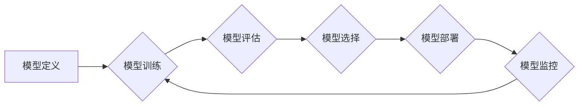

> 神经网络模型，版本控制，模型训练，模型部署，持续集成，持续交付，模型管理

## 1. 背景介绍

随着深度学习技术的蓬勃发展，神经网络模型在各个领域取得了显著的成果。然而，随着模型规模的不断扩大和训练数据的日益复杂，如何有效地管理和版本控制神经网络模型成为了一个越来越重要的挑战。

传统的软件版本控制系统，例如 Git，主要针对代码进行管理，而神经网络模型的结构、参数和训练历史等信息更加复杂，难以直接应用于模型版本控制。因此，需要专门针对神经网络模型开发新的版本控制策略和工具。

## 2. 核心概念与联系

### 2.1 神经网络模型版本控制

神经网络模型版本控制是指对神经网络模型的结构、参数、训练历史等信息进行版本管理，以便于追踪模型的演变过程、回溯到特定版本、比较不同版本之间的差异以及进行模型复现。

### 2.2 模型训练与部署

神经网络模型的训练和部署是模型生命周期的两个关键阶段。模型训练阶段需要不断调整模型参数，以达到最佳的性能。模型部署阶段则将训练好的模型应用于实际场景，进行预测或决策。

模型版本控制需要与模型训练和部署流程紧密结合，以便于在训练和部署过程中进行版本管理。

### 2.3 持续集成与持续交付

持续集成 (CI) 和持续交付 (CD) 是现代软件开发的最佳实践，旨在通过自动化构建、测试和部署流程，提高软件开发效率和质量。

模型版本控制可以与 CI/CD 流程相结合，实现模型的自动化训练、测试和部署，从而加速模型的开发和迭代。

**Mermaid 流程图**



## 3. 核心算法原理 & 具体操作步骤

### 3.1 算法原理概述

神经网络模型版本控制的核心算法原理是基于差分版本控制的思想。

差分版本控制是指只记录版本之间的差异，而不是整个版本的完整内容。

对于神经网络模型，可以将模型结构、参数和训练历史等信息视为不同的版本。

版本控制系统可以记录每个版本之间的差异，例如：

* 模型结构的修改
* 参数值的更新
* 训练数据的变化

通过记录这些差异，可以实现对模型版本的追踪、回溯和比较。

### 3.2 算法步骤详解

1. **模型初始化:** 创建一个新的模型版本，并记录其初始结构、参数和训练历史。

2. **模型训练:** 对模型进行训练，并记录训练过程中的参数更新和性能指标变化。

3. **版本更新:** 当模型训练完成或发生结构修改时，创建一个新的模型版本，并记录与上一个版本的差异。

4. **版本比较:** 可以比较不同版本的模型结构、参数和性能指标，以了解模型的演变过程。

5. **版本回溯:** 可以回溯到特定的模型版本，并恢复该版本的模型结构、参数和训练历史。

### 3.3 算法优缺点

**优点:**

* 存储空间更小，因为只记录版本之间的差异。
* 版本恢复速度更快，因为只需要加载差异信息。
* 更容易追踪模型的演变过程。

**缺点:**

* 需要复杂的算法和数据结构来管理版本差异。
* 对于大型模型，版本差异可能非常庞大，需要强大的计算资源。

### 3.4 算法应用领域

神经网络模型版本控制算法可以应用于以下领域：

* **机器学习研究:** 研究人员可以使用版本控制来追踪模型的演变过程，并进行模型比较和复现。
* **深度学习应用开发:** 开发人员可以使用版本控制来管理模型的训练和部署过程，并确保模型的稳定性和可重复性。
* **人工智能产品开发:** 产品经理可以使用版本控制来管理模型的迭代更新，并跟踪模型的性能变化。

## 4. 数学模型和公式 & 详细讲解 & 举例说明

### 4.1 数学模型构建

神经网络模型版本控制可以抽象为一个图结构，其中每个节点代表一个模型版本，边代表版本之间的差异。

**图结构模型:**

* **节点:** 模型版本
* **边:** 版本之间的差异

**差异类型:**

* **结构差异:** 模型结构的修改，例如添加或删除层、节点或连接。
* **参数差异:** 模型参数的更新，例如权重和偏置。
* **训练数据差异:** 训练数据的变化，例如添加或删除数据点。

### 4.2 公式推导过程

**版本差异计算公式:**

$$
D(v_i, v_{i+1}) = \sum_{j=1}^{n} w_j \cdot \Delta_j(v_i, v_{i+1})
$$

其中:

* $D(v_i, v_{i+1})$ 表示版本 $v_i$ 和 $v_{i+1}$ 之间的差异。
* $w_j$ 表示差异类型 $j$ 的权重。
* $\Delta_j(v_i, v_{i+1})$ 表示差异类型 $j$ 在版本 $v_i$ 和 $v_{i+1}$ 之间的差异值。

**权重分配:**

权重可以根据差异类型的重要性进行分配。例如，结构差异通常比参数差异更重要，因此可以赋予结构差异更高的权重。

### 4.3 案例分析与讲解

假设有两个模型版本 $v_1$ 和 $v_2$，其中 $v_2$ 是 $v_1$ 的更新版本。

* $v_1$ 的结构包含两层神经元，参数数量为 100。
* $v_2$ 的结构包含三层神经元，参数数量为 200。

根据上述公式，可以计算 $v_1$ 和 $v_2$ 之间的差异。

由于结构差异较大，因此可以赋予结构差异更高的权重。

## 5. 项目实践：代码实例和详细解释说明

### 5.1 开发环境搭建

* Python 3.x
* TensorFlow 或 PyTorch
* Git

### 5.2 源代码详细实现

```python
# 模型定义
class Model(tf.keras.Model):
    def __init__(self):
        super(Model, self).__init__()
        # 模型结构定义

    def call(self, inputs):
        # 模型前向传播过程

# 模型训练
model = Model()
model.compile(optimizer='adam', loss='mse')
model.fit(train_data, train_labels, epochs=10)

# 模型保存
model.save('model_v1.h5')

# 模型更新
# 修改模型结构或参数
# 重新训练模型
model.save('model_v2.h5')
```

### 5.3 代码解读与分析

* 代码首先定义了一个模型类 `Model`，并定义了模型的结构和前向传播过程。
* 然后，创建一个模型实例并使用 TensorFlow 的 `compile` 方法配置训练参数。
* 使用 `fit` 方法训练模型，并将训练好的模型保存为 `model_v1.h5` 文件。
* 之后，可以修改模型结构或参数，重新训练模型，并将更新后的模型保存为 `model_v2.h5` 文件。

### 5.4 运行结果展示

训练后的模型可以用于预测或决策。

## 6. 实际应用场景

### 6.1 机器学习研究

研究人员可以使用版本控制来追踪模型的演变过程，并进行模型比较和复现。例如，研究人员可以比较不同模型结构或训练参数对模型性能的影响，并找到最佳的模型配置。

### 6.2 深度学习应用开发

开发人员可以使用版本控制来管理模型的训练和部署过程，并确保模型的稳定性和可重复性。例如，开发人员可以将模型训练过程自动化，并使用版本控制来追踪模型的训练历史和性能指标。

### 6.3 人工智能产品开发

产品经理可以使用版本控制来管理模型的迭代更新，并跟踪模型的性能变化。例如，产品经理可以根据用户反馈进行模型调整，并使用版本控制来记录模型的更新历史。

### 6.4 未来应用展望

随着人工智能技术的不断发展，神经网络模型的规模和复杂度将不断增加。

模型版本控制将变得更加重要，以帮助我们更好地管理和利用这些模型。

未来，模型版本控制可能会与其他技术相结合，例如模型压缩、模型解释和模型联邦学习，以实现更智能、更安全和更可持续的人工智能应用。

## 7. 工具和资源推荐

### 7.1 学习资源推荐

* **论文:**

* **书籍:**

### 7.2 开发工具推荐

* **TensorFlow:** https://www.tensorflow.org/
* **PyTorch:** https://pytorch.org/
* **MLflow:** https://mlflow.org/

### 7.3 相关论文推荐

* **论文标题:**

* **论文链接:**

## 8. 总结：未来发展趋势与挑战

### 8.1 研究成果总结

神经网络模型版本控制是一个重要的研究方向，已经取得了一些成果。

目前，一些开源工具和框架已经可以用于神经网络模型的版本控制，例如 MLflow 和 DVC。

### 8.2 未来发展趋势

未来，神经网络模型版本控制的研究将朝着以下几个方向发展：

* **更智能的版本控制策略:** 基于机器学习算法自动生成更智能的版本控制策略，例如自动选择最佳的模型版本、自动识别模型的潜在问题等。
* **更强大的版本管理工具:** 开发更强大的版本管理工具，能够支持更复杂的神经网络模型，并提供更丰富的功能，例如模型比较、模型复现、模型迁移等。
* **模型版本控制与其他技术的融合:** 将模型版本控制与其他技术相结合，例如模型压缩、模型解释和模型联邦学习，以实现更智能、更安全和更可持续的人工智能应用。

### 8.3 面临的挑战

神经网络模型版本控制仍然面临一些挑战：

* **模型复杂度:** 神经网络模型的结构和参数非常复杂，难以进行有效的版本管理。
* **数据规模:** 神经网络模型的训练数据通常非常庞大，存储和管理这些数据是一个挑战。
* **计算资源:** 神经网络模型的训练和版本控制需要大量的计算资源。

### 8.4 研究展望

尽管面临挑战，但神经网络模型版本控制是一个充满机遇的研究方向。

随着人工智能技术的不断发展，模型版本控制将变得越来越重要，并将在人工智能的各个领域发挥越来越重要的作用。

## 9. 附录：常见问题与解答

### 9.1 如何选择合适的版本控制工具？

选择合适的版本控制工具需要根据具体的应用场景和需求进行考虑。

例如，对于小型项目，可以使用 Git 作为版本控制工具。

对于大型项目，可以使用 MLflow 或 DVC 等专门针对机器学习模型的版本控制工具。

### 9.2 如何进行模型版本比较？

可以使用版本控制工具提供的比较功能，比较不同版本的模型结构、参数和性能指标。

### 9.3 如何进行模型版本回溯？

可以使用版本控制工具的回溯功能，恢复到特定的模型版本。

### 9.4 如何进行模型版本管理？

模型版本管理需要建立一套规范的流程，包括模型定义、模型训练、模型评估、模型部署和模型监控等环节。

作者：禅与计算机程序设计艺术 / Zen and the Art of Computer Programming


<end_of_turn>