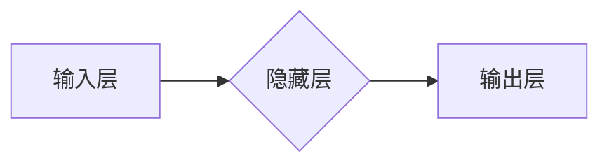

> 神经网络,深度学习,机器学习,人工智能,卷积神经网络,循环神经网络,自然语言处理,计算机视觉

## 1. 背景介绍

人工智能（AI）作为科技发展的重要方向，近年来取得了令人瞩目的进展。其中，神经网络作为AI的核心技术之一，在图像识别、自然语言处理、语音识别等领域展现出强大的应用潜力。

传统的机器学习算法依赖于人工特征工程，而神经网络则能够自动学习数据中的特征，从而实现更精准的预测和更智能的决策。随着计算能力的提升和海量数据的积累，深度学习技术，即基于多层神经网络的机器学习方法，迅速发展，并在各个领域取得了突破性进展。

## 2. 核心概念与联系

### 2.1 神经网络的基本结构

神经网络的结构灵感来源于人脑的神经元网络。它由 interconnected 的节点（神经元）组成，这些节点按照一定的层次结构排列，形成多层网络。

每个神经元接收来自其他神经元的输入信号，并对其进行处理，然后将处理后的信号传递给下一层神经元。

**神经网络的组成部分：**

* **输入层:**接收原始数据，每个节点代表一个输入特征。
* **隐藏层:**隐藏层位于输入层和输出层之间，负责对输入数据进行特征提取和转换。
* **输出层:**输出最终的预测结果，每个节点代表一个输出类别或值。

**连接权重:**每个连接都有一个权重，表示信号传递的强度。

**激活函数:**每个神经元都使用激活函数将输入信号转换为输出信号，激活函数决定了神经元的输出特性。

**图示：**



### 2.2 常见的神经网络类型

* **前馈神经网络 (Feedforward Neural Network):**信息只沿着单向传播，没有反馈机制。
* **卷积神经网络 (Convolutional Neural Network, CNN):**擅长处理图像数据，利用卷积操作提取图像特征。
* **循环神经网络 (Recurrent Neural Network, RNN):**能够处理序列数据，例如文本和语音，具有记忆机制。

## 3. 核心算法原理 & 具体操作步骤

### 3.1 算法原理概述

神经网络的训练过程本质上是通过调整连接权重来最小化预测误差的过程。

**主要训练算法：**

* **反向传播算法 (Backpropagation):**通过计算误差梯度，反向传播到各层神经元，更新连接权重。

### 3.2 算法步骤详解

1. **初始化连接权重:**随机初始化神经网络的连接权重。
2. **前向传播:**将输入数据传递到神经网络，计算各层神经元的输出值。
3. **计算损失函数:**比较预测结果与真实值之间的差异，使用损失函数衡量误差。
4. **反向传播:**计算误差梯度，反向传播到各层神经元。
5. **更新连接权重:**使用梯度下降算法更新连接权重，减小误差。
6. **重复步骤2-5:**重复上述步骤，直到误差达到预设阈值或训练次数达到上限。

### 3.3 算法优缺点

**优点:**

* 自动学习特征，无需人工特征工程。
* 能够处理复杂非线性关系。
* 具有强大的泛化能力。

**缺点:**

* 训练时间长，计算资源消耗大。
* 容易陷入局部最优解。
* 对训练数据质量要求高。

### 3.4 算法应用领域

* **图像识别:**人脸识别、物体检测、图像分类。
* **自然语言处理:**文本分类、机器翻译、情感分析。
* **语音识别:**语音转文本、语音助手。
* **推荐系统:**商品推荐、内容推荐。
* **医疗诊断:**疾病预测、影像分析。

## 4. 数学模型和公式 & 详细讲解 & 举例说明

### 4.1 数学模型构建

神经网络的数学模型可以表示为一个多层感知机 (Multilayer Perceptron, MLP)。

**输入层:**

$$
x = [x_1, x_2, ..., x_n]
$$

**隐藏层:**

$$
h = f(W_1x + b_1)
$$

**输出层:**

$$
y = f(W_2h + b_2)
$$

其中:

* $x$ 是输入向量。
* $h$ 是隐藏层输出向量。
* $y$ 是输出向量。
* $W_1$ 和 $W_2$ 是连接权重矩阵。
* $b_1$ 和 $b_2$ 是偏置向量。
* $f$ 是激活函数。

### 4.2 公式推导过程

**损失函数:**

常用的损失函数包括均方误差 (MSE) 和交叉熵 (Cross-Entropy)。

**MSE:**

$$
L = \frac{1}{N}\sum_{i=1}^{N}(y_i - \hat{y}_i)^2
$$

**交叉熵:**

$$
L = -\frac{1}{N}\sum_{i=1}^{N}y_i \log(\hat{y}_i)
$$

**梯度下降算法:**

$$
\theta = \theta - \alpha \nabla L(\theta)
$$

其中:

* $\theta$ 是连接权重和偏置的集合。
* $\alpha$ 是学习率。
* $\nabla L(\theta)$ 是损失函数对 $\theta$ 的梯度。

### 4.3 案例分析与讲解

**图像分类:**

使用 CNN 对图像进行分类。

**步骤:**

1. 将图像输入 CNN。
2. CNN 的卷积层提取图像特征。
3. 全连接层将特征映射到类别概率。
4. 使用交叉熵损失函数和梯度下降算法训练 CNN。

**结果:**

训练好的 CNN 可以对新的图像进行分类。

## 5. 项目实践：代码实例和详细解释说明

### 5.1 开发环境搭建

* Python 3.x
* TensorFlow 或 PyTorch

### 5.2 源代码详细实现

```python
import tensorflow as tf

# 定义模型
model = tf.keras.models.Sequential([
    tf.keras.layers.Conv2D(32, (3, 3), activation='relu', input_shape=(28, 28, 1)),
    tf.keras.layers.MaxPooling2D((2, 2)),
    tf.keras.layers.Conv2D(64, (3, 3), activation='relu'),
    tf.keras.layers.MaxPooling2D((2, 2)),
    tf.keras.layers.Flatten(),
    tf.keras.layers.Dense(10, activation='softmax')
])

# 编译模型
model.compile(optimizer='adam',
              loss='sparse_categorical_crossentropy',
              metrics=['accuracy'])

# 训练模型
model.fit(x_train, y_train, epochs=5)

# 评估模型
loss, accuracy = model.evaluate(x_test, y_test)
print('Test loss:', loss)
print('Test accuracy:', accuracy)
```

### 5.3 代码解读与分析

* **定义模型:** 使用 Keras API 定义一个 CNN 模型，包含卷积层、池化层和全连接层。
* **编译模型:** 使用 Adam 优化器、交叉熵损失函数和准确率指标编译模型。
* **训练模型:** 使用训练数据训练模型，设置训练轮数为 5。
* **评估模型:** 使用测试数据评估模型的性能，输出测试损失和准确率。

### 5.4 运行结果展示

训练完成后，模型可以对新的图像进行分类。

## 6. 实际应用场景

### 6.1 图像识别

* **人脸识别:** 用于解锁手机、身份验证、人脸搜索等。
* **物体检测:** 用于自动驾驶、安防监控、工业缺陷检测等。
* **图像分类:** 用于图片标签、图片检索、医学影像诊断等。

### 6.2 自然语言处理

* **机器翻译:** 将文本从一种语言翻译成另一种语言。
* **文本分类:** 将文本归类到不同的类别，例如情感分析、主题分类等。
* **聊天机器人:** 使用自然语言与用户进行对话。

### 6.3 语音识别

* **语音转文本:** 将语音转换为文本，用于语音助手、听写软件等。
* **语音识别:** 将语音识别为特定的命令或指令，用于智能家居、语音控制等。

### 6.4 未来应用展望

* **个性化推荐:** 基于用户的行为和偏好，提供个性化的商品、内容推荐。
* **医疗诊断辅助:** 辅助医生进行疾病诊断，提高诊断准确率。
* **自动驾驶:** 帮助车辆感知周围环境，实现自动驾驶功能。

## 7. 工具和资源推荐

### 7.1 学习资源推荐

* **书籍:**
    * 深度学习 (Deep Learning) - Ian Goodfellow, Yoshua Bengio, Aaron Courville
    * 神经网络与深度学习 (Neural Networks and Deep Learning) - Michael Nielsen
* **在线课程:**
    * Coursera: 深度学习 Specialization
    * Udacity: 深度学习 Nanodegree
    * fast.ai: 深度学习课程

### 7.2 开发工具推荐

* **TensorFlow:** 开源深度学习框架，支持多种硬件平台。
* **PyTorch:** 开源深度学习框架，以其灵活性和研究友好性而闻名。
* **Keras:** 高级深度学习 API，可以运行在 TensorFlow、Theano 或 CNTK 后端。

### 7.3 相关论文推荐

* **ImageNet Classification with Deep Convolutional Neural Networks** - Alex Krizhevsky, Ilya Sutskever, Geoffrey E. Hinton
* **Sequence to Sequence Learning with Neural Networks** - Ilya Sutskever, Oriol Vinyals, Quoc V. Le
* **Attention Is All You Need** - Ashish Vaswani, Noam Shazeer, Niki Parmar, Jakob Uszkoreit, Llion Jones, Aidan N. Gomez, Łukasz Kaiser, Illia Polosukhin

## 8. 总结：未来发展趋势与挑战

### 8.1 研究成果总结

近年来，神经网络在各个领域取得了突破性进展，例如图像识别、自然语言处理、语音识别等。

### 8.2 未来发展趋势

* **模型规模和复杂度提升:** 训练更大规模、更复杂的神经网络，以提高模型性能。
* **新颖的网络架构设计:** 探索新的网络架构，例如 Transformer、Graph Neural Network 等，以解决特定问题。
* **自监督和无监督学习:** 发展更有效的自监督和无监督学习方法，减少对标注数据的依赖。
* **可解释性研究:** 研究神经网络的决策过程，提高模型的可解释性和可信度。

### 8.3 面临的挑战

* **数据获取和隐私问题:** 训练高质量的神经网络需要大量数据，同时需要考虑数据隐私问题。
* **计算资源消耗:** 训练大型神经网络需要大量的计算资源，成本较高。
* **模型泛化能力:** 神经网络容易过拟合，需要提高模型的泛化能力。
* **伦理和社会影响:** 神经网络的应用可能带来伦理和社会问题，需要进行深入研究和讨论。

### 8.4 研究展望

未来，神经网络技术将继续发展，在更多领域发挥重要作用。

## 9. 附录：常见问题与解答

**Q1: 神经网络和深度学习有什么区别？**

**A1:** 深度学习是使用多层神经网络进行机器学习的一种方法，而神经网络是深度学习的基础。

**Q2: 如何选择合适的激活函数？**

**A2:** 不同的激活函数适用于不同的任务和网络结构。常用的激活函数包括 ReLU、Sigmoid 和 Tanh。

**Q3: 如何防止神经网络过拟合？**

**A3:** 可以使用正则化技术、数据增强、Dropout 等方法来防止神经网络过拟合。

**Q4: 如何评估神经