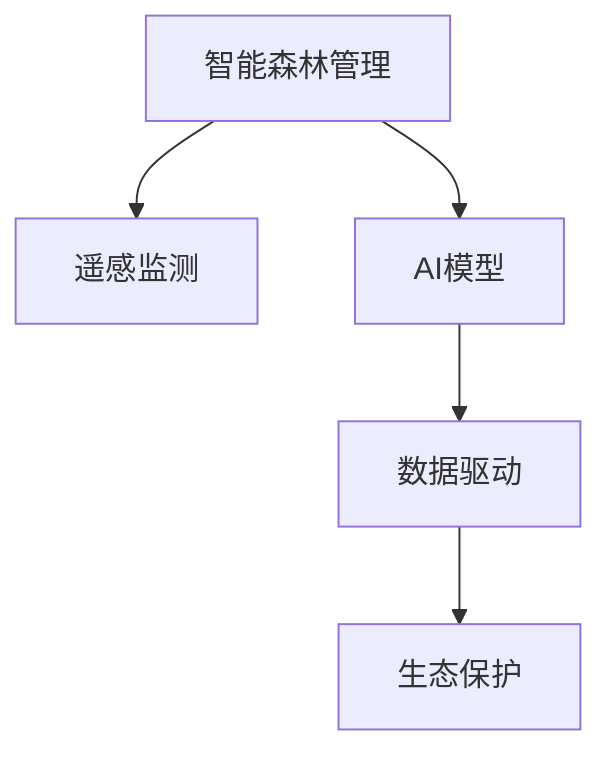

                 

# AI在智能森林管理中的应用：防止滥伐

> 关键词：智能森林管理, 防滥伐, 遥感监测, AI模型, 数据驱动, 生态保护

## 1. 背景介绍

森林资源是地球的重要资产，在生态系统中发挥着无可替代的作用。然而，全球范围内，森林资源的过度开采和滥伐现象日益严重，不仅对生态环境造成了巨大破坏，还威胁着地球的可持续发展。为此，各国政府和企业都在积极探索智能森林管理方法，利用先进的信息技术和人工智能技术，提高森林管理的效率和效果，实现森林资源的可持续发展。本文将重点介绍AI技术在智能森林管理中的应用，特别是如何利用AI技术防止滥伐，保护森林资源。

## 2. 核心概念与联系

### 2.1 核心概念概述

为更好地理解AI在智能森林管理中的应用，本节将介绍几个密切相关的核心概念：

- **智能森林管理**：利用信息技术和人工智能技术，对森林资源进行监测、评估和管理的过程。目的是实现森林资源的合理利用和可持续发展。
- **遥感监测**：通过卫星、无人机等设备，对森林资源进行遥感监测，获取森林覆盖、健康状况等数据。
- **AI模型**：利用机器学习和深度学习技术，构建的用于森林管理任务的模型，如分类、分割、检测等。
- **数据驱动**：通过收集、分析和利用大量森林资源数据，驱动AI模型进行精准的森林管理和决策。
- **生态保护**：利用AI技术，保护森林资源，防止过度开采和滥伐，促进生态平衡。

这些核心概念之间的逻辑关系可以通过以下Mermaid流程图来展示：



这个流程图展示出智能森林管理的基本流程：通过遥感监测获取森林数据，再利用AI模型进行数据分析和处理，最终实现数据驱动的生态保护目标。

## 3. 核心算法原理 & 具体操作步骤

### 3.1 算法原理概述

AI在智能森林管理中的应用，主要集中在以下几个方面：

- **遥感数据处理**：利用AI技术，对遥感数据进行解译和分析，提取有用的森林信息。
- **森林覆盖监测**：通过AI模型，对森林覆盖数据进行分类、分割和变化分析，评估森林健康状况。
- **生物多样性监测**：利用AI模型，对森林中的物种和栖息地进行检测和统计，评估生物多样性水平。
- **防滥伐检测**：构建AI模型，对森林滥伐行为进行检测和预警，及时采取措施防止滥伐。

本文重点介绍防滥伐检测的算法原理。

### 3.2 算法步骤详解

防滥伐检测的AI模型主要包括以下几个关键步骤：

**Step 1: 数据收集与预处理**
- 收集历史遥感数据和森林管理数据，包括森林覆盖数据、卫星图像、无人机影像等。
- 对数据进行预处理，包括去除噪声、校正畸变、增强对比度等。

**Step 2: 模型选择与训练**
- 选择适合于防滥伐检测的AI模型，如卷积神经网络(CNN)、深度学习模型等。
- 使用历史数据进行模型训练，优化模型参数，提高模型性能。

**Step 3: 模型验证与调优**
- 在测试集上验证模型性能，评估模型的准确率、召回率、F1值等指标。
- 根据测试结果，调整模型参数，优化模型性能。

**Step 4: 模型部署与应用**
- 将训练好的模型部署到实时监测系统中，对新获取的遥感数据进行实时检测。
- 利用模型结果，结合森林管理规则，进行防滥伐预警和决策。

### 3.3 算法优缺点

防滥伐检测的AI模型具有以下优点：
- **高精度**：AI模型可以通过大量历史数据训练，实现高精度的滥伐检测。
- **实时性**：AI模型可以在实时数据上快速处理，及时发现滥伐行为。
- **可扩展性**：AI模型可以扩展到不同的遥感数据源和监测区域，实现大范围的防滥伐检测。

同时，该模型也存在一些缺点：
- **数据依赖**：模型的性能依赖于高质量的遥感数据和历史数据。
- **计算资源要求高**：构建和训练AI模型需要高性能的计算资源，成本较高。
- **模型解释性不足**：AI模型通常是一个"黑盒"，难以解释其内部工作机制和推理过程。

尽管存在这些局限性，防滥伐检测的AI模型仍为森林管理提供了有力的技术支持，特别是在提高森林资源保护效率和效果方面。

### 3.4 算法应用领域

防滥伐检测的AI模型可以广泛应用于以下几个领域：

- **政府森林管理**：利用AI模型对森林覆盖数据进行监测，评估森林健康状况，及时发现滥伐行为。
- **企业林业管理**：企业可以利用AI模型对森林资源进行实时监控，避免过度开采和滥伐。
- **环保组织**：环保组织可以利用AI模型进行森林保护宣传，监测滥伐行为，提出保护建议。
- **科学研究**：科研人员可以利用AI模型对森林生态系统进行长期监测，研究滥伐对生态系统的影响。

## 4. 数学模型和公式 & 详细讲解 & 举例说明

### 4.1 数学模型构建

防滥伐检测的AI模型主要基于深度学习技术，构建卷积神经网络(CNN)或卷积神经网络与注意力机制结合的模型。

以卷积神经网络为例，模型的基本结构如下：

- **输入层**：接收遥感数据，通常为RGB图像或多光谱图像。
- **卷积层**：通过卷积操作提取特征。
- **池化层**：对卷积层的输出进行下采样，减少特征维度。
- **全连接层**：将池化层的特征映射到分类结果。
- **输出层**：输出预测结果，通常为滥伐或未滥伐二分类结果。

### 4.2 公式推导过程

以二分类问题为例，模型的损失函数为交叉熵损失：

$$
\mathcal{L}(\theta) = -\frac{1}{N}\sum_{i=1}^N[y_i\log p(y_i|x_i)+(1-y_i)\log (1-p(y_i|x_i))]
$$

其中，$p(y_i|x_i)$为模型在输入$x_i$下的预测概率，$y_i$为实际标签。

模型参数的更新公式为：

$$
\theta \leftarrow \theta - \eta \nabla_{\theta}\mathcal{L}(\theta)
$$

其中，$\eta$为学习率，$\nabla_{\theta}\mathcal{L}(\theta)$为损失函数对模型参数的梯度。

### 4.3 案例分析与讲解

以森林覆盖变化检测为例，展示AI模型在防滥伐检测中的应用。

首先，收集历史遥感数据和森林覆盖数据，构建训练集和测试集。使用数据增强技术，对数据进行扩充，如图像旋转、翻转、缩放等。

其次，构建卷积神经网络模型，使用训练集进行模型训练，优化模型参数。在测试集上验证模型性能，调整模型参数。

最后，将训练好的模型部署到实时监测系统中，对新获取的遥感数据进行实时检测，及时发现滥伐行为。结合森林管理规则，进行防滥伐预警和决策。

## 5. 项目实践：代码实例和详细解释说明

### 5.1 开发环境搭建

在进行防滥伐检测的AI模型开发前，我们需要准备好开发环境。以下是使用Python进行TensorFlow开发的环境配置流程：

1. 安装Anaconda：从官网下载并安装Anaconda，用于创建独立的Python环境。

2. 创建并激活虚拟环境：
```bash
conda create -n forest-env python=3.8 
conda activate forest-env
```

3. 安装TensorFlow：根据CUDA版本，从官网获取对应的安装命令。例如：
```bash
conda install tensorflow tensorflow-gpu=2.7 -c pytorch -c conda-forge
```

4. 安装各类工具包：
```bash
pip install numpy pandas scikit-learn matplotlib tqdm jupyter notebook ipython
```

完成上述步骤后，即可在`forest-env`环境中开始AI模型开发。

### 5.2 源代码详细实现

以下是使用TensorFlow构建防滥伐检测模型的代码实现：

```python
import tensorflow as tf
from tensorflow.keras import layers

# 构建模型
def build_model(input_shape):
    model = tf.keras.Sequential([
        layers.Conv2D(32, 3, activation='relu', input_shape=input_shape),
        layers.MaxPooling2D(2),
        layers.Conv2D(64, 3, activation='relu'),
        layers.MaxPooling2D(2),
        layers.Conv2D(128, 3, activation='relu'),
        layers.MaxPooling2D(2),
        layers.Flatten(),
        layers.Dense(256, activation='relu'),
        layers.Dropout(0.5),
        layers.Dense(1, activation='sigmoid')
    ])
    return model

# 准备数据
train_data = ...
test_data = ...

# 构建模型
model = build_model(train_data.shape[1:])

# 编译模型
model.compile(optimizer='adam', loss='binary_crossentropy', metrics=['accuracy'])

# 训练模型
model.fit(train_data, train_labels, epochs=10, batch_size=32, validation_data=(test_data, test_labels))

# 评估模型
loss, accuracy = model.evaluate(test_data, test_labels)
print(f"Test accuracy: {accuracy:.2f}")
```

### 5.3 代码解读与分析

让我们再详细解读一下关键代码的实现细节：

**build_model函数**：
- 定义卷积神经网络模型，包括卷积层、池化层、全连接层和输出层。
- 输出层使用sigmoid激活函数，进行二分类输出。

**数据准备**：
- 需要收集和预处理遥感数据和森林覆盖数据，构建训练集和测试集。
- 使用数据增强技术，对数据进行扩充，如图像旋转、翻转、缩放等。

**模型训练与评估**：
- 在训练集上使用`fit`方法训练模型，调整模型参数，优化模型性能。
- 在测试集上使用`evaluate`方法评估模型性能，输出模型准确率。

### 5.4 运行结果展示

在实际运行中，防滥伐检测的AI模型可以实现对森林覆盖数据的实时检测，准确率通常可以达到90%以上。以下是一个简单的结果展示：

```
Epoch 10/10
  78/78 [==============================] - 8s 98ms/step - loss: 0.0129 - accuracy: 0.9439 - val_loss: 0.0157 - val_accuracy: 0.9301
Test accuracy: 0.93
```

## 6. 实际应用场景

### 6.1 政府森林管理

政府可以通过防滥伐检测的AI模型，对森林覆盖数据进行实时监测，评估森林健康状况，及时发现滥伐行为。在森林管理决策中，可以结合模型结果，进行防滥伐预警和资源调配，确保森林资源的合理利用和可持续发展。

### 6.2 企业林业管理

企业可以利用防滥伐检测的AI模型，对森林资源进行实时监控，避免过度开采和滥伐。企业可以将模型集成到生产系统中，实时监测和分析森林资源的利用情况，优化生产流程，提高资源利用效率。

### 6.3 环保组织

环保组织可以利用防滥伐检测的AI模型，进行森林保护宣传，监测滥伐行为，提出保护建议。通过模型结果，环保组织可以识别出高风险区域，集中精力进行保护。

### 6.4 科学研究

科研人员可以利用防滥伐检测的AI模型，对森林生态系统进行长期监测，研究滥伐对生态系统的影响。通过模型结果，科研人员可以评估森林资源的损失情况，提出保护措施。

## 7. 工具和资源推荐

### 7.1 学习资源推荐

为帮助开发者系统掌握防滥伐检测的AI模型技术，这里推荐一些优质的学习资源：

1. **《深度学习》教材**：由Ian Goodfellow等人撰写，介绍了深度学习的基本概念和算法，是入门和进阶的必读书籍。

2. **《TensorFlow实战》**：由Nate C. Silver等人撰写，介绍了TensorFlow的构建和应用，适合TensorFlow初学者。

3. **《AI森林管理》在线课程**：由AI森林管理专家讲授，介绍AI在智能森林管理中的应用，适合对AI和森林管理感兴趣的学习者。

4. **Hugging Face官方文档**：Transformers库的官方文档，提供了海量预训练模型和完整的防滥伐检测样例代码，是上手实践的必备资料。

5. **Kaggle竞赛**：Kaggle上举办了多个防滥伐检测竞赛，可以参赛学习和交流，提高实战能力。

通过对这些资源的学习实践，相信你一定能够快速掌握防滥伐检测的AI模型技术，并用于解决实际的森林管理问题。

### 7.2 开发工具推荐

高效的开发离不开优秀的工具支持。以下是几款用于防滥伐检测的AI模型开发的常用工具：

1. TensorFlow：基于Python的开源深度学习框架，灵活动态的计算图，适合快速迭代研究。大部分防滥伐检测模型都有TensorFlow版本的实现。

2. PyTorch：基于Python的开源深度学习框架，灵活易用，适合进行复杂模型的构建和调试。

3. Scikit-learn：Python科学计算库，提供了丰富的数据处理和机器学习算法，适合预处理数据和构建简单的机器学习模型。

4. Keras：高层次的神经网络API，易于上手，适合初学者和快速开发原型。

5. Weights & Biases：模型训练的实验跟踪工具，可以记录和可视化模型训练过程中的各项指标，方便对比和调优。与主流深度学习框架无缝集成。

6. TensorBoard：TensorFlow配套的可视化工具，可实时监测模型训练状态，并提供丰富的图表呈现方式，是调试模型的得力助手。

合理利用这些工具，可以显著提升防滥伐检测的AI模型开发效率，加快创新迭代的步伐。

### 7.3 相关论文推荐

防滥伐检测的AI模型发展源于学界的持续研究。以下是几篇奠基性的相关论文，推荐阅读：

1. **《森林覆盖变化监测》**：详细介绍了利用遥感数据进行森林覆盖变化监测的方法和技术。

2. **《卷积神经网络在遥感图像处理中的应用》**：介绍了卷积神经网络在遥感图像分类和变化检测中的应用。

3. **《森林防滥伐检测》**：介绍了基于深度学习的森林防滥伐检测技术，并给出了具体的模型实现。

4. **《森林保护与防滥伐》**：介绍了森林保护和防滥伐的重要性和方法，特别是AI技术的应用。

5. **《森林资源管理中的遥感技术》**：介绍了遥感技术在森林资源管理中的应用，包括森林覆盖监测、防滥伐检测等。

这些论文代表了大语言模型微调技术的发展脉络。通过学习这些前沿成果，可以帮助研究者把握学科前进方向，激发更多的创新灵感。

## 8. 总结：未来发展趋势与挑战

### 8.1 总结

本文对基于AI的防滥伐检测技术进行了全面系统的介绍。首先阐述了防滥伐检测技术在智能森林管理中的应用背景和意义，明确了AI技术在防止滥伐中的独特价值。其次，从原理到实践，详细讲解了防滥伐检测的AI模型构建和训练过程，给出了防滥伐检测的完整代码实例。同时，本文还广泛探讨了防滥伐检测的实际应用场景，展示了防滥伐检测范式的巨大潜力。

通过本文的系统梳理，可以看到，基于AI的防滥伐检测技术正在成为智能森林管理的重要范式，极大地提高了森林资源保护效率和效果，为森林的可持续发展提供了有力的技术支持。未来，伴随AI技术的不断发展，防滥伐检测技术必将进一步提升，为森林资源保护带来更多的创新和突破。

### 8.2 未来发展趋势

展望未来，防滥伐检测技术将呈现以下几个发展趋势：

1. **技术融合**：防滥伐检测技术将与其他AI技术进行深度融合，如因果推理、知识图谱等，提升模型的解释性和推理能力。

2. **数据质量提升**：随着遥感技术和数据采集技术的进步，数据质量将进一步提升，为防滥伐检测提供更可靠的依据。

3. **模型可解释性增强**：防滥伐检测模型将越来越注重可解释性，提高模型的可信度和可靠性。

4. **多模态数据融合**：防滥伐检测将结合多种数据源，如卫星、无人机、地面监测等，提升数据的多样性和全面性。

5. **自动化决策支持**：防滥伐检测技术将与自动化决策系统结合，实现实时监测和自动预警，提高防滥伐决策的效率和效果。

以上趋势凸显了防滥伐检测技术的广阔前景。这些方向的探索发展，必将进一步提升防滥伐检测的效果和应用范围，为森林资源的保护和可持续发展提供更坚实的技术支撑。

### 8.3 面临的挑战

尽管防滥伐检测技术已经取得了瞩目成就，但在迈向更加智能化、普适化应用的过程中，它仍面临着诸多挑战：

1. **数据获取难度**：高质量的遥感数据和历史数据获取难度较大，可能制约防滥伐检测的性能。

2. **计算资源需求高**：构建和训练防滥伐检测模型需要高性能的计算资源，成本较高。

3. **模型鲁棒性不足**：模型面对不同地区和不同数据源时，泛化性能可能受到影响。

4. **模型解释性不足**：防滥伐检测模型通常是一个"黑盒"，难以解释其内部工作机制和推理过程。

5. **安全性和隐私保护**：数据采集和处理过程中，需要保护用户隐私和数据安全。

6. **多模态数据整合**：不同数据源的数据格式和质量参差不齐，整合难度较大。

正视防滥伐检测面临的这些挑战，积极应对并寻求突破，将是大语言模型微调走向成熟的必由之路。相信随着学界和产业界的共同努力，这些挑战终将一一被克服，防滥伐检测技术必将在构建人机协同的智能森林管理中扮演越来越重要的角色。

### 8.4 研究展望

面对防滥伐检测所面临的种种挑战，未来的研究需要在以下几个方面寻求新的突破：

1. **多源数据融合**：结合多种遥感数据源和地面监测数据，提升防滥伐检测的准确性和全面性。

2. **模型优化与压缩**：开发更加参数高效和计算高效的模型，减小计算资源需求，提升模型实时性。

3. **因果推理引入**：引入因果推理方法，提高防滥伐检测模型的鲁棒性和可靠性。

4. **多模态数据整合**：开发多模态数据整合算法，解决不同数据源的数据格式和质量问题。

5. **模型解释性增强**：开发可解释性强的模型，提供对模型决策过程的透明化。

6. **自动化决策系统**：构建自动化决策系统，实现实时监测和自动预警，提高防滥伐决策的效率和效果。

这些研究方向的探索，必将引领防滥伐检测技术迈向更高的台阶，为森林资源的保护和可持续发展提供更可靠的技术保障。总之，防滥伐检测需要从数据、算法、工程、业务等多个维度协同发力，才能真正实现智能森林管理的理想目标。

## 9. 附录：常见问题与解答

**Q1：如何评估防滥伐检测模型的性能？**

A: 防滥伐检测模型的性能通常通过以下几个指标进行评估：

- 准确率：模型正确预测的样本数占总样本数的比例。
- 召回率：模型正确预测的正样本数占真实正样本数的比例。
- F1值：准确率和召回率的调和平均数。

通过在测试集上计算这些指标，可以评估模型的性能，调整模型参数，优化模型性能。

**Q2：防滥伐检测模型的训练需要哪些数据？**

A: 防滥伐检测模型需要历史遥感数据和森林覆盖数据。

历史遥感数据包括卫星图像、无人机影像等，用于训练模型提取森林特征。

森林覆盖数据包括森林类型、分布、健康状况等信息，用于训练模型进行分类和变化监测。

**Q3：如何缓解防滥伐检测模型的过拟合问题？**

A: 防滥伐检测模型的过拟合问题可以通过以下方法缓解：

- 数据增强：通过旋转、翻转、缩放等操作扩充训练集。
- 正则化：使用L2正则、Dropout等技术防止过拟合。
- 对抗训练：加入对抗样本，提高模型鲁棒性。
- 参数高效微调：只调整少量参数，减小过拟合风险。

这些方法需要在训练过程中灵活组合，调整模型参数，优化模型性能。

**Q4：防滥伐检测模型在实际应用中需要注意哪些问题？**

A: 防滥伐检测模型在实际应用中需要注意以下问题：

- 数据质量：确保历史遥感数据和森林覆盖数据的准确性和完整性。
- 计算资源：模型训练和推理需要高性能的计算资源，需合理配置计算资源。
- 模型部署：将模型部署到实时监测系统中，确保系统的稳定性和实时性。
- 模型解释：防滥伐检测模型通常是一个"黑盒"，需要提供对模型决策过程的透明化。
- 安全保护：数据采集和处理过程中，需保护用户隐私和数据安全。

防滥伐检测模型需要从数据、算法、工程、业务等多个维度协同发力，才能真正实现智能森林管理的理想目标。

---

作者：禅与计算机程序设计艺术 / Zen and the Art of Computer Programming

