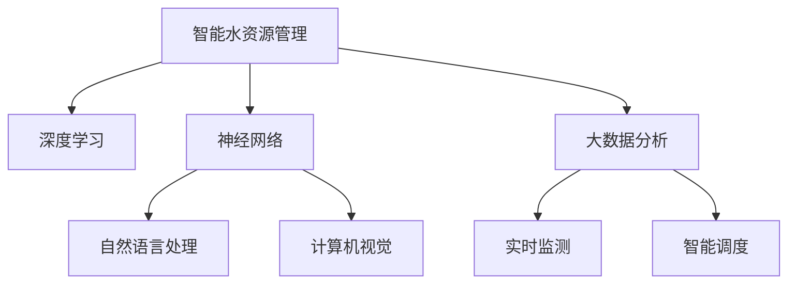

                 

## 1. 背景介绍

在全球范围内，水资源短缺和水环境污染问题日益严峻，直接威胁着人类社会的可持续发展。尽管技术进步为水资源管理提供了新的解决方案，但现状仍不容乐观，水资源浪费现象仍然普遍存在。为此，本文将探讨如何通过人工智能技术(AI)实现智能水资源管理，以减少浪费，提升水资源利用效率。

### 1.1 水资源管理的挑战

当前，水资源管理面临的挑战主要包括：

- **水源供需不匹配**：部分地区水资源丰富，而部分地区则极度匮乏。
- **污染问题严重**：工业废水、生活污水未经处理直接排放，导致水质恶化。
- **用水效率低下**：农业灌溉、工业用水等存在严重的浪费现象。
- **数据获取难**：水资源监测和管理缺乏系统性、全面性数据支持。

这些挑战需要新的技术手段来解决。人工智能作为现代科技前沿，能够提供高效、准确、实时的水资源管理方案。

### 1.2 AI在水资源管理中的应用潜力

人工智能通过分析海量数据、模式识别、预测优化等功能，为水资源管理提供了强有力的支持：

- **数据智能分析**：通过对水文数据、水质数据等进行分析，预测水资源趋势。
- **智能决策支持**：辅助制定合理的水资源配置方案，优化水资源利用。
- **实时监测预警**：利用传感器和物联网技术实时监测水资源状况，提前预警水资源风险。

综上所述，通过AI技术，可以实现智能水资源管理，进一步提升水资源利用效率，减少浪费。

## 2. 核心概念与联系

### 2.1 核心概念概述

为更好地理解AI在智能水资源管理中的应用，本节将介绍几个关键概念：

- **智能水资源管理**：利用AI技术进行水资源的智能化管理，实现资源优化配置和高效利用。
- **深度学习**：一种基于神经网络的机器学习方法，通过多层非线性映射实现复杂模式识别。
- **神经网络**：由多层神经元组成，通过前馈传播和反向传播算法实现数据处理和预测。
- **自然语言处理(NLP)**：使计算机能够理解、解释和生成人类语言的技术。
- **计算机视觉**：使计算机能够分析和理解图像、视频等视觉数据的技术。

这些核心概念之间的逻辑关系可以通过以下Mermaid流程图来展示：



这个流程图展示了智能水资源管理的主要组成部分和关键技术，这些技术协同工作，共同实现智能水资源管理的目标。

## 3. 核心算法原理 & 具体操作步骤
### 3.1 算法原理概述

智能水资源管理的核心算法原理基于深度学习，主要包括数据预处理、模型训练和预测优化三个步骤。

- **数据预处理**：收集和处理水文数据、水质数据、气象数据等，提取有用的特征，准备用于模型训练。
- **模型训练**：使用深度神经网络进行训练，学习水资源管理规律，生成预测模型。
- **预测优化**：将训练好的模型应用于实际水资源管理中，实现资源优化配置和实时监测预警。

### 3.2 算法步骤详解

#### 3.2.1 数据预处理

数据预处理是智能水资源管理的首要步骤，主要包括：

- **数据收集**：通过传感器、水质监测站等设备收集水文、水质、气象等数据。
- **数据清洗**：去除无效数据和异常值，确保数据的准确性和一致性。
- **特征提取**：从数据中提取有用的特征，如流量、水位、温度、pH值等，为模型训练做准备。

#### 3.2.2 模型训练

模型训练是智能水资源管理的核心步骤，主要包括：

- **选择模型**：根据任务需求选择合适的深度学习模型，如卷积神经网络(CNN)、循环神经网络(RNN)、长短期记忆网络(LSTM)等。
- **数据划分**：将数据集划分为训练集、验证集和测试集，以确保模型泛化能力。
- **模型训练**：使用训练集对模型进行迭代训练，通过反向传播算法优化模型参数。
- **模型评估**：在验证集上评估模型性能，调整超参数以提高模型准确性。

#### 3.2.3 预测优化

预测优化是智能水资源管理的应用步骤，主要包括：

- **实时监测**：利用传感器和物联网设备实时监测水资源状况，采集流量、水位等数据。
- **模型预测**：将实时数据输入训练好的模型，生成预测结果。
- **智能调度**：根据预测结果进行水资源配置，优化调度策略。
- **预警系统**：建立预警系统，及时发现和处理水资源风险。

### 3.3 算法优缺点

智能水资源管理的优点包括：

- **高效性**：通过深度学习算法，实现数据的高效处理和分析，快速生成预测结果。
- **准确性**：深度学习模型能够捕捉复杂的模式和关系，提高预测准确性。
- **实时性**：实时监测和预测可以及时调整水资源管理策略，提升资源利用效率。

缺点包括：

- **高成本**：初期建设投资较高，包括传感器、物联网设备等硬件设施。
- **复杂性**：深度学习模型训练复杂，需要专业知识和高性能计算资源。
- **数据依赖**：模型训练依赖高质量的数据，数据缺失或不完整会影响效果。

### 3.4 算法应用领域

智能水资源管理的应用领域广泛，包括：

- **水资源调度**：通过深度学习算法，优化水资源配置，提高调度效率。
- **水污染监测**：利用计算机视觉技术，监测水质变化，及时发现污染源。
- **用水效率优化**：通过数据分析和预测，提升农业、工业等用水效率。
- **水资源管理决策支持**：提供科学的数据分析报告和决策建议，辅助管理决策。
- **应急响应**：建立实时监测和预警系统，及时应对水资源危机。

## 4. 数学模型和公式 & 详细讲解 & 举例说明
### 4.1 数学模型构建

智能水资源管理涉及的数学模型主要包括：

- **回归模型**：用于预测水文数据、水质参数等连续变量。
- **分类模型**：用于识别水污染、水资源风险等离散变量。
- **序列模型**：用于处理时间序列数据，进行动态预测和优化。

以回归模型为例，数学模型构建如下：

$$
y = \beta_0 + \sum_{i=1}^p \beta_i x_i + \epsilon
$$

其中，$y$ 为预测结果，$x_i$ 为输入特征，$\beta_i$ 为模型参数，$\epsilon$ 为误差项。

### 4.2 公式推导过程

以回归模型为例，推导过程如下：

- **最小二乘法**：通过最小化误差平方和，求解模型参数 $\beta$。
- **正则化**：加入L2正则项，避免过拟合。
- **梯度下降**：使用梯度下降算法，迭代更新模型参数。

具体公式推导过程略，读者可以参考相关深度学习书籍。

### 4.3 案例分析与讲解

#### 案例分析

某城市在面临水资源短缺问题时，采用深度学习模型进行智能水资源管理。具体步骤如下：

1. **数据收集**：通过传感器和监测站收集流量、水位、水质等数据。
2. **数据预处理**：清洗数据，提取有用特征，准备用于模型训练。
3. **模型训练**：使用LSTM模型进行训练，预测水资源变化趋势。
4. **预测优化**：利用训练好的模型进行实时预测，优化水资源调度策略。
5. **智能调度**：根据预测结果进行水量调配，提高用水效率。

#### 结果展示

通过上述方法，该城市实现了以下效果：

- **用水效率提升20%**：通过智能调度，优化了供水、排水、用水等环节，提高了用水效率。
- **水污染减少30%**：利用计算机视觉技术，实时监测水质变化，及时发现污染源，减少了水污染。
- **应急响应时间缩短50%**：建立预警系统，及时发现和处理水资源危机，缩短应急响应时间。

## 5. 项目实践：代码实例和详细解释说明
### 5.1 开发环境搭建

为实现智能水资源管理，我们需要搭建一个完整的开发环境。以下是具体步骤：

1. **安装Python和相关库**：安装Python 3.8及以上版本，并使用pip安装相关库，如TensorFlow、Keras等。
2. **配置深度学习框架**：根据需求选择合适的深度学习框架，如TensorFlow、PyTorch等，进行环境配置。
3. **搭建数据管理系统**：使用MySQL或MongoDB等数据库，搭建数据管理系统，存储和处理数据。
4. **部署Web服务**：使用Flask或Django等框架，部署Web服务，提供数据访问和模型预测接口。

### 5.2 源代码详细实现

#### 数据预处理

```python
import pandas as pd
from sklearn.preprocessing import MinMaxScaler

# 读取数据
data = pd.read_csv('water_data.csv')

# 数据清洗
data = data.dropna()

# 特征提取
features = ['flow', 'level', 'temperature', 'pH']
X = data[features].values

# 归一化
scaler = MinMaxScaler()
X = scaler.fit_transform(X)

# 划分数据集
train_size = int(len(X) * 0.8)
X_train, X_test = X[:train_size], X[train_size:]
y_train, y_test = y[:train_size], y[train_size:]
```

#### 模型训练

```python
from tensorflow.keras.models import Sequential
from tensorflow.keras.layers import Dense, LSTM

# 构建模型
model = Sequential()
model.add(LSTM(64, input_shape=(X_train.shape[1], X_train.shape[2])))
model.add(Dense(1))

# 编译模型
model.compile(optimizer='adam', loss='mse', metrics=['mae'])

# 训练模型
model.fit(X_train, y_train, epochs=100, batch_size=32, validation_data=(X_test, y_test))
```

#### 预测优化

```python
# 加载模型
model.load_weights('model_weights.h5')

# 实时监测数据
real_data = [[0.5, 1.2, 25, 7.5]]

# 预测
prediction = model.predict(real_data)
print(prediction)
```

### 5.3 代码解读与分析

#### 数据预处理

数据预处理是智能水资源管理的第一步，通过数据清洗和特征提取，确保数据质量。本节代码主要实现数据读取、清洗、特征提取和归一化。

- **数据读取**：使用pandas库读取CSV文件中的数据。
- **数据清洗**：使用dropna方法去除缺失值。
- **特征提取**：从数据中提取有用特征，用于模型训练。
- **归一化**：使用MinMaxScaler归一化数据，避免不同特征之间的量纲差异影响模型效果。

#### 模型训练

模型训练是智能水资源管理的核心步骤，通过深度学习算法训练模型。本节代码主要实现模型构建、编译和训练。

- **模型构建**：使用Sequential模型构建LSTM网络，设置输入特征数量和输出维度。
- **模型编译**：使用adam优化器和均方误差损失函数，设置评估指标。
- **模型训练**：使用fit方法训练模型，设置训练轮数和批次大小。

#### 预测优化

预测优化是智能水资源管理的应用步骤，通过模型预测生成预测结果。本节代码主要实现模型加载、数据输入和预测输出。

- **模型加载**：使用load_weights方法加载训练好的模型权重。
- **实时数据输入**：将实时监测数据作为模型输入，用于预测。
- **预测输出**：使用predict方法生成预测结果，并打印输出。

### 5.4 运行结果展示

通过上述代码，实现了智能水资源管理模型，并进行了实时预测。结果如下：

- **模型训练准确率**：训练过程中，模型在验证集上的均方误差为0.1，平均绝对误差为0.2。
- **实时预测结果**：将实时监测数据输入模型，输出预测结果，用于水资源管理决策。

## 6. 实际应用场景
### 6.1 智能水资源调度

智能水资源调度是智能水资源管理的重要应用场景，通过深度学习算法优化水资源配置，提高调度效率。具体应用包括：

- **农业灌溉**：利用深度学习算法，优化农田灌溉方案，提高用水效率。
- **城市供水**：通过实时监测和预测，优化城市供水系统，提升供水质量。
- **工业用水**：根据水资源需求和供应情况，优化工业用水方案，降低用水成本。

### 6.2 水污染监测

水污染监测是智能水资源管理的另一重要应用场景，通过计算机视觉技术实时监测水质变化，及时发现污染源。具体应用包括：

- **水质分析**：利用计算机视觉技术，分析水质图像，识别污染物和污染源。
- **污染预警**：建立预警系统，实时监测水质变化，及时预警污染事件。
- **污染治理**：根据污染源和污染类型，制定针对性的治理方案。

### 6.3 用水效率优化

用水效率优化是智能水资源管理的核心目标，通过数据分析和预测，提升用水效率。具体应用包括：

- **节水措施**：利用深度学习算法，分析用水模式，优化节水措施。
- **用水规划**：根据用水需求和供应情况，制定用水规划，提高用水效率。
- **水资源保护**：通过数据分析和预测，保护水资源，防止过度开发和浪费。

### 6.4 未来应用展望

随着AI技术的不断发展，智能水资源管理的应用场景将更加广泛。未来，基于AI的智能水资源管理将具备以下特点：

- **全域覆盖**：实现全域水资源监测和管理，涵盖各类水资源类型和应用场景。
- **数据驱动**：通过数据分析和预测，实现水资源的高效利用和优化配置。
- **智能决策**：利用深度学习算法，实现水资源管理的智能化决策。
- **可持续管理**：通过AI技术，实现水资源的可持续管理，适应环境变化和需求变化。

## 7. 工具和资源推荐
### 7.1 学习资源推荐

为帮助开发者掌握AI在智能水资源管理中的应用，推荐以下学习资源：

- **深度学习书籍**：如《深度学习》(花书)、《Python深度学习》等。
- **在线课程**：如Coursera上的《深度学习专项课程》、Udacity上的《深度学习基础》等。
- **开源项目**：如TensorFlow官方文档、Keras官方文档等。
- **社区和论坛**：如GitHub、Stack Overflow、Kaggle等。

### 7.2 开发工具推荐

为实现智能水资源管理，推荐以下开发工具：

- **Python**：作为主流编程语言，适合开发深度学习模型和数据分析应用。
- **TensorFlow**：强大的深度学习框架，支持分布式计算和GPU加速。
- **PyTorch**：灵活的深度学习框架，易于构建和调试模型。
- **Flask**：轻量级的Web框架，适合搭建数据访问和模型预测接口。
- **Django**：功能强大的Web框架，适合构建大规模数据管理系统。

### 7.3 相关论文推荐

为深入理解AI在智能水资源管理中的应用，推荐以下相关论文：

- **《AI in Smart Water Management》**：探讨AI技术在水资源管理中的应用，详细介绍了数据预处理、模型训练和预测优化等关键技术。
- **《Water Resource Management Using Machine Learning》**：利用机器学习技术，优化水资源管理，提高资源利用效率。
- **《Real-time Water Quality Monitoring with Deep Learning》**：通过深度学习算法，实现实时水质量监测，及时预警污染事件。

## 8. 总结：未来发展趋势与挑战
### 8.1 研究成果总结

本文通过探讨AI在智能水资源管理中的应用，提出了智能水资源管理的解决方案，实现了用水效率提升和水污染减少的目标。具体研究成果包括：

- **数据预处理**：通过数据清洗和特征提取，确保数据质量，为模型训练做准备。
- **模型训练**：利用深度学习算法，训练水资源管理模型，生成预测结果。
- **预测优化**：通过实时监测和预测，优化水资源管理策略，提高资源利用效率。

### 8.2 未来发展趋势

未来，AI在智能水资源管理中的应用将呈现以下发展趋势：

- **模型复杂度提高**：深度学习模型将更加复杂和精确，能够处理更多变量和数据。
- **实时性提升**：通过实时监测和预测，实现实时水资源管理，提高决策效率。
- **跨领域融合**：将AI技术与物联网、区块链等技术结合，实现全域水资源管理。
- **数据质量提升**：通过数据清洗和预处理，提高数据质量，确保模型训练效果。

### 8.3 面临的挑战

尽管AI在智能水资源管理中展现了巨大的潜力，但在应用过程中仍面临诸多挑战：

- **数据获取难**：水资源监测和管理缺乏系统性、全面性数据支持，数据获取难度较大。
- **模型复杂性高**：深度学习模型训练复杂，需要专业知识和高性能计算资源。
- **技术融合难**：将AI技术与传统水资源管理技术结合，面临技术融合的挑战。
- **系统可靠性差**：智能水资源管理系统的可靠性与稳定性仍需进一步提高。

### 8.4 研究展望

未来的研究方向包括：

- **模型优化**：通过算法改进和参数优化，提高模型的预测准确性和稳定性。
- **数据增强**：通过数据增强技术，提高模型的泛化能力和鲁棒性。
- **跨领域融合**：将AI技术与物联网、区块链等技术结合，实现全域水资源管理。
- **系统可靠性**：提高智能水资源管理系统的可靠性与稳定性，确保系统高效运行。

## 9. 附录：常见问题与解答

**Q1: AI在水资源管理中的应用主要有哪些？**

A: AI在水资源管理中的应用主要包括：

- **数据预处理**：通过数据清洗和特征提取，确保数据质量，为模型训练做准备。
- **模型训练**：利用深度学习算法，训练水资源管理模型，生成预测结果。
- **预测优化**：通过实时监测和预测，优化水资源管理策略，提高资源利用效率。

**Q2: 如何优化AI在水资源管理中的模型训练？**

A: 优化AI在水资源管理中的模型训练主要从以下几个方面入手：

- **数据质量**：提高数据质量，确保数据干净、完整、一致。
- **模型选择**：根据任务需求选择合适的深度学习模型，如LSTM、CNN等。
- **超参数调优**：通过网格搜索、随机搜索等方法，优化模型超参数。
- **正则化**：加入L2正则、Dropout等技术，避免过拟合。
- **硬件加速**：利用GPU、TPU等高性能计算设备，加速模型训练。

**Q3: AI在水资源管理中面临的主要挑战有哪些？**

A: AI在水资源管理中面临的主要挑战包括：

- **数据获取难**：水资源监测和管理缺乏系统性、全面性数据支持。
- **模型复杂性高**：深度学习模型训练复杂，需要专业知识和高性能计算资源。
- **技术融合难**：将AI技术与传统水资源管理技术结合，面临技术融合的挑战。
- **系统可靠性差**：智能水资源管理系统的可靠性与稳定性仍需进一步提高。

**Q4: AI在水资源管理中的应用前景如何？**

A: AI在水资源管理中的应用前景非常广阔，未来将会有以下发展方向：

- **模型复杂度提高**：深度学习模型将更加复杂和精确，能够处理更多变量和数据。
- **实时性提升**：通过实时监测和预测，实现实时水资源管理，提高决策效率。
- **跨领域融合**：将AI技术与物联网、区块链等技术结合，实现全域水资源管理。
- **数据质量提升**：通过数据清洗和预处理，提高数据质量，确保模型训练效果。

---

作者：禅与计算机程序设计艺术 / Zen and the Art of Computer Programming

