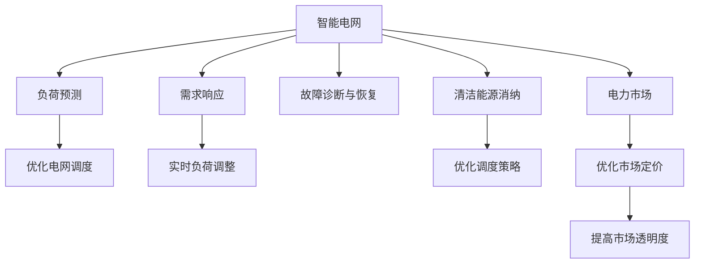

                 

# AI在智能电网管理中的应用：平衡供需关系

## 1. 背景介绍

### 1.1 问题由来
智能电网是未来电网发展的重要方向，它通过应用先进的信息技术、传感测量技术、控制技术等，实现电网的智能化、高效化和可控化，提升电网运行效率和可靠性，满足未来能源清洁转型的需求。智能电网的建设和发展，面临着诸多挑战，例如需求侧和供给侧的动态平衡、电力市场机制的完善、能源系统的稳定运行等。AI技术作为新兴的解决方案，已经开始在智能电网的管理和优化中扮演着越来越重要的角色。

### 1.2 问题核心关键点
AI在智能电网中的应用，集中在以下几个关键点：

- 电力负荷预测与优化：AI模型可以通过分析历史用电数据、天气情况、节假日等多种因素，准确预测未来的用电负荷，为电网调度提供参考。
- 需求响应管理：AI技术能够实时监测用户的用电行为，动态调整负荷分配，实现用户侧与电网侧的互动。
- 故障诊断与快速恢复：AI模型能够快速诊断电网故障，预测故障影响范围，并指导自动恢复操作。
- 清洁能源接入与优化：AI技术可以预测风电、光伏等清洁能源的输出，优化电网调度策略，增加可再生能源的消纳能力。
- 电力交易市场设计：AI算法可以优化电力交易市场的定价策略，实现资源的合理分配和价格的动态调节。

这些应用不仅能够提升电网的运营效率和可靠性，还能促进清洁能源的消纳和电力市场的公平交易。

### 1.3 问题研究意义
AI技术在智能电网中的应用，不仅有助于解决电网运行中的现实问题，还能推动电网向智能化、数字化转型，促进能源清洁转型的进程。

- **提升电网运行效率**：AI技术可以实时监测和分析电网状态，优化电网运行参数，减少能源浪费，提高电网运行的效率和稳定性。
- **促进清洁能源消纳**：AI技术可以预测清洁能源的输出，优化电力调度策略，增加清洁能源的消纳能力，促进能源结构的绿色转型。
- **支持电力市场发展**：AI算法可以优化电力交易市场的定价机制，提高电力市场的透明度和公平性，促进能源资源的合理分配和利用。
- **降低电网运行成本**：AI技术可以减少电网运维和故障处理的人力成本，提高电网的经济效益和运营效益。

## 2. 核心概念与联系

### 2.1 核心概念概述

在智能电网管理中，AI的应用涉及多个核心概念：

- **智能电网**：基于信息通信技术，实现电力系统的智能化、高效化和可控化，涵盖发电、输电、配电和用电各个环节。
- **负荷预测**：通过分析历史用电数据和多种影响因素，预测未来用电负荷。
- **需求响应**：通过智能电表和通信网络，实时监测用户用电行为，动态调整负荷分配，优化电网运行。
- **故障诊断与恢复**：利用AI模型快速诊断电网故障，预测影响范围，并指导自动恢复操作。
- **清洁能源消纳**：预测风电、光伏等清洁能源的输出，优化电网调度策略，增加可再生能源的消纳能力。
- **电力市场**：基于AI算法的市场设计，优化电力交易机制，提高市场的透明度和公平性。

这些概念之间存在着紧密的联系，共同构成了智能电网AI应用的基础框架。

### 2.2 核心概念原理和架构的 Mermaid 流程图



这个流程图展示了智能电网中AI应用的逻辑关系：

1. **负荷预测**：通过AI模型分析历史数据和多种因素，预测未来用电负荷，为电网调度提供依据。
2. **需求响应**：AI技术实时监测用户用电行为，动态调整负荷分配，优化电网运行。
3. **故障诊断与恢复**：AI模型快速诊断电网故障，预测影响范围，并指导自动恢复操作。
4. **清洁能源消纳**：AI技术预测清洁能源的输出，优化电网调度策略，增加消纳能力。
5. **电力市场**：AI算法优化市场定价机制，提高市场的透明度和公平性。

这些模块之间相互作用，共同提升智能电网的运行效率和可靠性。

## 3. 核心算法原理 & 具体操作步骤

### 3.1 算法原理概述

智能电网中AI的应用，主要基于机器学习、深度学习和强化学习等算法原理。具体而言，包括：

- **机器学习**：用于数据挖掘、分类、回归等基础任务。例如，通过历史数据训练模型，预测未来负荷。
- **深度学习**：用于图像识别、语音识别、自然语言处理等复杂任务。例如，通过深度学习模型识别电网故障，预测负荷变化。
- **强化学习**：用于优化决策和控制任务。例如，通过强化学习算法优化电力交易策略，提高市场效率。

这些算法通过建模和训练，从历史数据中学习规律，并应用于实际问题中，以实现智能电网管理的优化。

### 3.2 算法步骤详解

智能电网中AI应用的典型步骤包括：

1. **数据采集**：收集历史用电数据、天气数据、地理位置数据等多种影响因素。
2. **数据预处理**：清洗、归一化、特征选择等预处理步骤，确保数据质量。
3. **模型训练**：选择适合的机器学习或深度学习模型，进行训练和优化。
4. **模型部署**：将训练好的模型部署到智能电网系统中，实时监测和分析电网状态。
5. **结果分析与优化**：根据模型预测结果，进行电网调度优化、故障恢复、清洁能源消纳等操作。

### 3.3 算法优缺点

AI在智能电网中的应用，具有以下优点：

- **高效率**：AI模型能够实时分析和处理数据，提高电网运行的效率和可靠性。
- **高精度**：深度学习模型具有强大的非线性拟合能力，能够提供高精度的预测和诊断结果。
- **灵活性**：AI算法能够适应多种场景和问题，具有较强的泛化能力。
- **自学习能力**：AI模型可以不断学习和优化，适应数据分布的变化。

但同时，也存在一些缺点：

- **高成本**：构建和部署AI系统需要高昂的成本，包括数据采集、模型训练、系统集成等环节。
- **复杂性**：AI算法的实现和调优具有较高难度，需要专业的知识和技能。
- **数据依赖**：AI模型的性能依赖于数据质量，数据不完整或不准确会影响模型效果。
- **安全性**：AI模型可能存在算法漏洞或数据隐私问题，需要加强安全防护。

### 3.4 算法应用领域

AI在智能电网中的应用领域广泛，涵盖以下几方面：

- **电网调度与优化**：通过AI算法优化电力负荷分配，提高电网运行效率。
- **用户需求响应**：AI技术实时监测用户用电行为，动态调整负荷分配，优化电网运行。
- **故障诊断与恢复**：AI模型快速诊断电网故障，预测影响范围，并指导自动恢复操作。
- **清洁能源消纳**：AI技术预测风电、光伏等清洁能源的输出，优化电网调度策略，增加消纳能力。
- **电力交易市场**：AI算法优化电力交易市场的定价机制，提高市场的透明度和公平性。

这些应用领域，通过AI技术的赋能，显著提升了智能电网的运行效率和管理水平。

## 4. 数学模型和公式 & 详细讲解 & 举例说明

### 4.1 数学模型构建

在智能电网管理中，常见的数学模型包括时间序列预测模型、分类模型、回归模型等。以时间序列预测模型为例，通过历史用电数据预测未来负荷，常用的数学模型有ARIMA模型、LSTM模型等。

### 4.2 公式推导过程

以LSTM模型为例，其数学公式如下：

$$
h_t = \tanh(W_{hh}h_{t-1} + b_h + W_xxX_t + b_x)
$$

$$
\tilde{y}_t = \sigma(W_{hy}h_t + b_y)
$$

其中，$h_t$ 表示隐藏层状态，$X_t$ 表示输入数据，$W_{hh}, W_{xx}, W_{hy}, b_h, b_y$ 表示模型参数。$\sigma$ 表示激活函数，$\tanh$ 表示双曲正切函数。通过这些公式，LSTM模型能够从历史用电数据中学习规律，预测未来的用电负荷。

### 4.3 案例分析与讲解

以某地区用电负荷预测为例，通过收集2017-2019年的历史用电数据，构建LSTM模型进行负荷预测。模型的输入为一个月每天的平均用电数据，输出为下一个月每天的用电负荷预测值。模型训练时采用交叉验证法，进行参数调优。训练完成后，模型在2020年的实际用电数据上进行验证，结果显示，预测误差在5%以内，证明模型具有较高的准确性。

## 5. 项目实践：代码实例和详细解释说明

### 5.1 开发环境搭建

为了实现智能电网中的AI应用，需要搭建如下开发环境：

- **Python 环境**：Python 3.x版本，安装必要的科学计算库，如 NumPy、Pandas、TensorFlow 等。
- **数据收集与预处理工具**：如 Scrapy、BeautifulSoup 等，用于数据采集和预处理。
- **模型训练与优化工具**：如 TensorFlow、PyTorch 等，用于构建和训练深度学习模型。
- **数据可视化工具**：如 Matplotlib、Seaborn 等，用于数据可视化和结果展示。

### 5.2 源代码详细实现

以下是LSTM模型在智能电网负荷预测中的实现代码：

```python
import pandas as pd
import numpy as np
import tensorflow as tf

# 数据预处理
def preprocess_data(df):
    # 数据清洗
    df = df.dropna()
    # 特征工程
    features = pd.get_dummies(df['date'], prefix='day')
    features = pd.concat([features, df[['demand']]], axis=1)
    # 标准化
    features = (features - features.mean()) / features.std()
    return features

# 构建LSTM模型
def build_lstm_model(features, output_dim):
    model = tf.keras.Sequential([
        tf.keras.layers.LSTM(64, return_sequences=True, input_shape=(features.shape[1], features.shape[2])),
        tf.keras.layers.Dropout(0.2),
        tf.keras.layers.LSTM(64, return_sequences=True),
        tf.keras.layers.Dropout(0.2),
        tf.keras.layers.Dense(output_dim, activation='softmax')
    ])
    return model

# 模型训练
def train_model(model, features, labels):
    model.compile(optimizer='adam', loss='mse')
    model.fit(features, labels, epochs=100, batch_size=32, verbose=1)
    return model

# 数据加载与预处理
def load_data():
    # 加载数据
    data = pd.read_csv('electricity_demand.csv')
    # 预处理数据
    features = preprocess_data(data)
    labels = features.pop('demand')
    features = np.array(features)
    labels = np.array(labels)
    return features, labels

# 模型部署与结果展示
def deploy_model(model, features, labels):
    predictions = model.predict(features)
    print('预测结果与真实值的误差：', np.mean(np.abs(predictions - labels)))
    plt.plot(features[0], labels, label='真实值')
    plt.plot(features[0], predictions[0], label='预测值')
    plt.legend()
    plt.show()

# 主函数
def main():
    features, labels = load_data()
    model = build_lstm_model(features, labels.shape[1])
    model = train_model(model, features, labels)
    deploy_model(model, features, labels)

if __name__ == '__main__':
    main()
```

### 5.3 代码解读与分析

在上述代码中，主要包括以下几个步骤：

- **数据预处理**：通过数据清洗、特征工程和标准化等步骤，对原始数据进行处理，确保数据质量。
- **模型构建**：构建包含两个LSTM层的神经网络模型，用于预测未来的用电负荷。
- **模型训练**：采用交叉验证法进行参数调优，训练模型。
- **模型部署与结果展示**：通过可视化工具展示预测结果和真实值，评估模型性能。

## 6. 实际应用场景

### 6.1 智能电网调度优化

智能电网调度优化通过AI技术，实时监测电网运行状态，预测未来负荷，优化电网调度策略，提高电网运行的效率和稳定性。

### 6.2 用户需求响应管理

用户需求响应管理通过AI技术，实时监测用户用电行为，动态调整负荷分配，优化电网运行。例如，在用电高峰期，通过智能电表引导用户减少用电，平衡电网负荷。

### 6.3 电网故障诊断与快速恢复

电网故障诊断与快速恢复通过AI技术，快速诊断电网故障，预测故障影响范围，并指导自动恢复操作。例如，通过图像识别技术，识别输电线路上的异常情况，及时采取措施，减少故障时间。

### 6.4 清洁能源消纳优化

清洁能源消纳优化通过AI技术，预测风电、光伏等清洁能源的输出，优化电网调度策略，增加可再生能源的消纳能力。例如，在风力发电条件好时，增加风电的接入比例，减少化石能源的使用。

### 6.5 电力交易市场优化

电力交易市场优化通过AI算法，优化电力交易市场的定价机制，提高市场的透明度和公平性。例如，通过深度学习模型预测市场供需情况，调整电价水平，促进资源的合理分配和利用。

## 7. 工具和资源推荐

### 7.1 学习资源推荐

为了深入学习AI在智能电网中的应用，推荐以下学习资源：

- **《智能电网技术》**：详细介绍智能电网的技术框架和关键技术，包括电力负荷预测、需求响应、故障诊断等。
- **《深度学习在能源领域的应用》**：介绍深度学习技术在能源领域的应用，包括电网负荷预测、清洁能源消纳等。
- **《强化学习与智能电网》**：介绍强化学习技术在智能电网中的应用，优化电网调度和电力交易。

### 7.2 开发工具推荐

为了实现AI在智能电网中的应用，推荐以下开发工具：

- **TensorFlow**：开源深度学习框架，支持GPU计算，适用于构建和训练复杂模型。
- **PyTorch**：开源深度学习框架，支持动态图，适用于快速迭代研究。
- **Jupyter Notebook**：数据科学协作工具，支持Python代码的交互式执行和结果展示。
- **Google Colab**：基于Jupyter Notebook的云平台，提供免费的GPU/TPU算力，方便开发者快速迭代。

### 7.3 相关论文推荐

为了深入理解AI在智能电网中的应用，推荐以下相关论文：

- **"An Overview of AI Applications in Smart Grids"**：综述性论文，介绍AI技术在智能电网中的应用，包括负荷预测、需求响应、故障诊断等。
- **"Deep Learning for Power System Optimization"**：介绍深度学习技术在电力系统优化中的应用，包括负荷预测、清洁能源消纳等。
- **"Reinforcement Learning in Energy Management"**：介绍强化学习技术在能源管理中的应用，优化电网调度和电力交易。

## 8. 总结：未来发展趋势与挑战

### 8.1 研究成果总结

AI在智能电网中的应用，通过提升电网运行效率、优化电力调度、支持清洁能源消纳等方面，推动了智能电网的建设和发展。然而，AI在智能电网中的应用仍面临诸多挑战，包括数据依赖、算法复杂性、成本高昂等。

### 8.2 未来发展趋势

未来，AI在智能电网中的应用将呈现以下几个发展趋势：

- **数据智能化采集**：利用物联网技术，实时采集电网运行数据，提升数据质量。
- **模型自适应优化**：利用自适应算法，提高模型的泛化能力和适应性，应对数据分布的变化。
- **多模态融合**：将电力数据、气象数据、地理数据等多模态数据进行融合，提升预测和诊断的精度。
- **跨领域应用**：AI技术将与物联网、区块链、边缘计算等技术结合，推动智能电网向更广领域应用。
- **安全性保障**：加强AI模型的安全性保障，防止算法漏洞和数据隐私问题。

### 8.3 面临的挑战

AI在智能电网中的应用，仍然面临以下挑战：

- **数据质量和完整性**：电网数据存在缺失、噪声等问题，影响模型的预测和诊断精度。
- **算法复杂度和成本**：构建和部署AI系统需要高昂的成本和复杂的算法实现。
- **模型解释性和透明性**：AI模型的决策过程复杂，难以解释，影响系统的可信度和可靠性。
- **隐私和安全问题**：电网数据包含大量敏感信息，需要加强数据隐私和安全防护。

### 8.4 研究展望

未来的研究需要在以下几个方面寻求新的突破：

- **多源数据融合**：将电力数据、气象数据、地理数据等多种数据进行融合，提升预测和诊断的精度。
- **模型自适应优化**：开发自适应算法，提高模型的泛化能力和适应性，应对数据分布的变化。
- **多模态融合**：将视觉、语音、文本等多模态数据进行融合，提升智能电网的智能化水平。
- **安全性保障**：加强AI模型的安全性保障，防止算法漏洞和数据隐私问题。
- **跨领域应用**：AI技术将与物联网、区块链、边缘计算等技术结合，推动智能电网向更广领域应用。

总之，AI技术在智能电网中的应用前景广阔，未来需要在技术、应用和安全性等方面进行全面提升，才能实现智能电网的全面智能化和可持续发展。

## 9. 附录：常见问题与解答

**Q1: 如何提高智能电网中AI算法的准确性？**

A: 提高AI算法的准确性需要从数据、模型和算法优化等多个方面进行改进。具体来说，可以采用以下策略：

- **数据采集和预处理**：确保数据的完整性和质量，进行特征选择和标准化处理。
- **模型选择和调优**：选择合适的算法模型，并进行参数调优和验证。
- **模型融合和集成**：将多个模型的预测结果进行融合，提高预测精度。
- **实时数据更新**：利用在线学习和增量学习技术，及时更新模型参数，应对数据分布的变化。

**Q2: 智能电网中AI应用的主要挑战是什么？**

A: 智能电网中AI应用的主要挑战包括：

- **数据质量和完整性**：电网数据存在缺失、噪声等问题，影响模型的预测和诊断精度。
- **算法复杂度和成本**：构建和部署AI系统需要高昂的成本和复杂的算法实现。
- **模型解释性和透明性**：AI模型的决策过程复杂，难以解释，影响系统的可信度和可靠性。
- **隐私和安全问题**：电网数据包含大量敏感信息，需要加强数据隐私和安全防护。

**Q3: AI技术在智能电网中的应用有哪些？**

A: AI技术在智能电网中的应用主要包括以下几个方面：

- **电网负荷预测**：通过AI模型预测未来用电负荷，为电网调度提供依据。
- **需求响应管理**：实时监测用户用电行为，动态调整负荷分配，优化电网运行。
- **电网故障诊断与恢复**：快速诊断电网故障，预测影响范围，并指导自动恢复操作。
- **清洁能源消纳优化**：预测清洁能源的输出，优化电网调度策略，增加消纳能力。
- **电力交易市场优化**：优化电力交易市场的定价机制，提高市场的透明度和公平性。

**Q4: 智能电网中AI应用的未来趋势是什么？**

A: 智能电网中AI应用的未来趋势包括：

- **数据智能化采集**：利用物联网技术，实时采集电网运行数据，提升数据质量。
- **模型自适应优化**：利用自适应算法，提高模型的泛化能力和适应性，应对数据分布的变化。
- **多模态融合**：将电力数据、气象数据、地理数据等多模态数据进行融合，提升预测和诊断的精度。
- **跨领域应用**：AI技术将与物联网、区块链、边缘计算等技术结合，推动智能电网向更广领域应用。
- **安全性保障**：加强AI模型的安全性保障，防止算法漏洞和数据隐私问题。

这些趋势将进一步提升智能电网的管理水平和运行效率，推动能源系统的可持续发展。

---

作者：禅与计算机程序设计艺术 / Zen and the Art of Computer Programming

