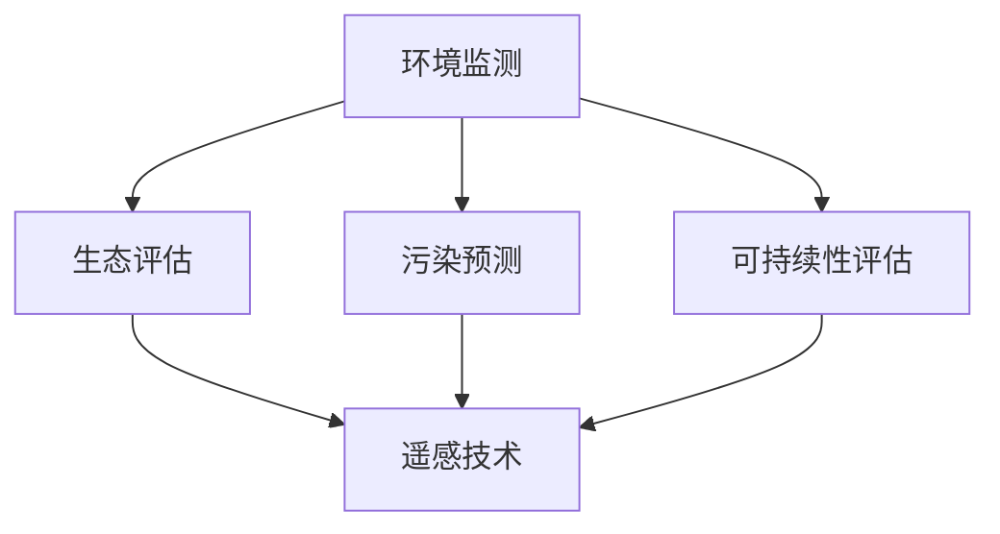

                 

# AI在环境保护中的应用：污染监测与生态评估

> 关键词：AI、环境保护、污染监测、生态评估、数据科学、模型训练、生态系统服务、可持续性、智能传感器、遥感技术

## 1. 背景介绍

### 1.1 问题由来
随着工业化和城市化的快速发展，环境污染问题日益严重，成为制约全球可持续发展的关键因素之一。从空气污染、水体污染、土壤污染，到生物多样性下降、生态系统服务退化，各类环境问题对人类社会构成了巨大威胁。

为应对这一挑战，各国政府和组织纷纷采取行动，实施了一系列环境保护政策和管理措施。然而，由于环境问题的复杂性和多样性，传统方法难以全面有效地解决这些问题。近年来，人工智能(AI)技术在环境保护中的应用日益受到重视，成为助力环境保护的重要手段。

### 1.2 问题核心关键点
AI在环境保护中的应用主要体现在以下几个方面：

1. **污染监测**：利用AI技术进行实时环境监测，预测污染趋势，辅助环境管理决策。
2. **生态评估**：通过AI分析大量生态数据，评估生态系统的健康状况，指导生态保护和修复工作。
3. **可持续性评估**：利用AI模型评估人类活动对环境的影响，制定科学合理的可持续发展策略。
4. **智能传感器**：应用AI技术优化环境监测设备和传感器，提高数据采集效率和精度。
5. **遥感技术**：结合AI技术进行大规模遥感数据分析，提供高精度的环境监测和评估结果。

AI在环境保护中的应用，不仅能够提高环境监测和评估的效率和精度，还能为政策制定和环境管理提供科学依据，推动实现全球可持续发展的目标。

## 2. 核心概念与联系

### 2.1 核心概念概述

为更好地理解AI在环境保护中的应用，本节将介绍几个密切相关的核心概念：

- **环境监测**：通过传感器、遥感设备等手段，收集环境数据，实时监测环境质量。
- **生态评估**：通过对生态数据进行分析，评估生态系统的健康状况和生物多样性水平。
- **污染预测**：利用AI模型对环境污染数据进行建模，预测未来的污染趋势。
- **可持续性评估**：评估人类活动对环境的影响，评估自然资源的可持续性。
- **遥感技术**：利用卫星和航空器获取大范围环境数据，进行环境监测和分析。

这些核心概念之间的逻辑关系可以通过以下Mermaid流程图来展示：



这个流程图展示了几大核心概念的联系：

1. 环境监测提供实时数据，是生态评估、污染预测和可持续性评估的基础。
2. 生态评估和污染预测主要依赖环境监测数据，并进行更加深入的分析。
3. 遥感技术可以扩大环境监测和分析的覆盖范围，提供更宏观的环境信息。
4. 可持续性评估不仅依赖于环境监测和分析数据，还需结合人类活动数据进行综合评估。

## 3. 核心算法原理 & 具体操作步骤
### 3.1 算法原理概述

AI在环境保护中的应用，主要基于机器学习(ML)和深度学习(DL)算法。这些算法能够从海量环境数据中提取有价值的信息，进行环境监测、生态评估、污染预测等任务。

核心算法原理包括以下几个方面：

- **监督学习**：利用已标注的环境数据，训练模型进行环境监测和评估。监督学习算法包括回归、分类、聚类等，用于预测污染水平、评估生态健康等。
- **无监督学习**：无需标注数据，通过数据分析发现环境数据的内在结构。无监督学习算法包括降维、聚类、关联规则挖掘等，用于发现环境数据中的模式和规律。
- **强化学习**：通过与环境互动，学习最优策略以实现特定目标。强化学习算法用于优化环境管理策略，如动态调整污染控制措施等。

### 3.2 算法步骤详解

以下是AI在环境保护中主要算法的详细步骤：

#### 3.2.1 数据准备
1. **数据收集**：从传感器、遥感设备、公开数据库等渠道获取环境数据，包括空气质量、水质、土壤污染、生物多样性等。
2. **数据预处理**：清洗和标准化数据，去除噪声和异常值，进行归一化和数据增强等处理。

#### 3.2.2 模型选择与训练
1. **模型选择**：根据任务需求选择合适的ML或DL模型，如线性回归、随机森林、卷积神经网络(CNN)、长短期记忆网络(LSTM)等。
2. **数据分割**：将数据分为训练集、验证集和测试集，用于模型训练和性能评估。
3. **模型训练**：利用训练集数据，通过迭代优化模型参数，最小化损失函数。

#### 3.2.3 模型评估与优化
1. **模型评估**：在验证集上评估模型性能，包括准确率、召回率、F1分数等指标。
2. **超参数调优**：调整模型超参数，如学习率、正则化系数、批次大小等，优化模型性能。
3. **模型融合**：使用集成学习等方法，组合多个模型的输出结果，提高预测精度。

#### 3.2.4 模型部署与应用
1. **模型部署**：将训练好的模型部署到实际应用环境中，如智能传感器、移动应用等。
2. **实时监测**：利用部署的模型进行实时环境监测和分析，提供决策支持。
3. **动态更新**：根据新的环境数据，不断更新模型，确保其性能和预测准确度。

### 3.3 算法优缺点

AI在环境保护中的应用具有以下优点：

1. **高效性**：利用机器学习算法，能够从海量数据中快速提取关键信息，进行环境监测和评估。
2. **精度高**：深度学习模型具有强大的非线性拟合能力，能够对复杂环境数据进行精确预测和分析。
3. **实时性**：通过智能传感器和实时数据流处理技术，能够实现环境数据的实时监测和分析。
4. **可扩展性**：结合遥感技术，能够对大范围环境进行监测和分析，提高数据覆盖范围。

同时，这些算法也存在一些局限性：

1. **数据质量依赖**：模型的性能很大程度上依赖于环境数据的准确性和完整性，数据质量问题可能导致模型预测偏差。
2. **模型复杂性高**：深度学习模型复杂度较高，需要大量计算资源进行训练和优化。
3. **黑箱性**：部分模型如深度学习模型具有较强的黑箱性，难以解释其内部决策过程。
4. **过拟合风险**：在数据量不足的情况下，模型可能出现过拟合现象，影响预测精度。

## 4. 数学模型和公式 & 详细讲解 & 举例说明
### 4.1 数学模型构建

在环境保护中的应用，常见的数学模型包括线性回归、随机森林、卷积神经网络(CNN)、长短期记忆网络(LSTM)等。这里以线性回归模型为例，介绍其构建过程。

设环境监测数据为 $X=\{x_i\}_{i=1}^N$，每个样本 $x_i$ 包含多个特征变量，如气温、湿度、污染物浓度等。对应的目标变量为 $y$，表示环境质量指标，如空气质量指数(AQI)。

线性回归模型的数学表达为：

$$
y = \beta_0 + \sum_{j=1}^p \beta_j x_j + \epsilon
$$

其中 $\beta_0$ 为截距，$\beta_j$ 为第 $j$ 个特征的系数，$\epsilon$ 为随机误差项。

### 4.2 公式推导过程

线性回归模型的损失函数为均方误差(MSE)：

$$
\mathcal{L}(\theta) = \frac{1}{N}\sum_{i=1}^N (y_i - \hat{y}_i)^2
$$

其中 $\hat{y}_i = \beta_0 + \sum_{j=1}^p \beta_j x_{ij}$ 为模型预测值。

最小化损失函数，可得到线性回归模型的参数估计：

$$
\theta^* = \mathop{\arg\min}_{\theta} \mathcal{L}(\theta)
$$

使用梯度下降法求解上述优化问题，可以得到线性回归模型的参数 $\theta$：

$$
\theta \leftarrow \theta - \eta \frac{\partial \mathcal{L}(\theta)}{\partial \theta}
$$

其中 $\eta$ 为学习率，$\frac{\partial \mathcal{L}(\theta)}{\partial \theta}$ 为损失函数对模型参数的梯度。

### 4.3 案例分析与讲解

以空气质量预测为例，分析线性回归模型在环境监测中的应用。

假设收集到某城市的空气质量数据，包含日期、气温、湿度、污染物浓度等特征变量，目标变量为AQI。使用线性回归模型进行AQI预测，步骤如下：

1. **数据准备**：收集过去一段时间的空气质量数据，作为训练集。
2. **模型训练**：选择线性回归模型，使用训练集数据进行模型训练，最小化均方误差损失函数。
3. **模型评估**：在验证集上评估模型性能，如均方根误差(RMSE)、决定系数(R^2)等指标。
4. **模型应用**：将训练好的模型应用于实时数据，进行AQI预测，提供决策支持。

## 5. 项目实践：代码实例和详细解释说明
### 5.1 开发环境搭建

在进行AI在环境保护中的应用实践前，我们需要准备好开发环境。以下是使用Python进行Scikit-learn和TensorFlow开发的环境配置流程：

1. 安装Anaconda：从官网下载并安装Anaconda，用于创建独立的Python环境。

2. 创建并激活虚拟环境：
```bash
conda create -n env_name python=3.8 
conda activate env_name
```

3. 安装Scikit-learn：
```bash
pip install scikit-learn
```

4. 安装TensorFlow：
```bash
pip install tensorflow
```

5. 安装其他依赖库：
```bash
pip install numpy pandas matplotlib seaborn
```

完成上述步骤后，即可在虚拟环境中开始AI在环境保护中的应用实践。

### 5.2 源代码详细实现

这里以线性回归模型为例，使用Scikit-learn库进行空气质量预测的代码实现。

```python
from sklearn.linear_model import LinearRegression
from sklearn.model_selection import train_test_split
import pandas as pd
import numpy as np

# 准备数据
data = pd.read_csv('air_quality.csv')
X = data[['temperature', 'humidity', 'pollutant_concentration']]
y = data['aqi']

# 数据分割
X_train, X_test, y_train, y_test = train_test_split(X, y, test_size=0.2, random_state=42)

# 模型训练
model = LinearRegression()
model.fit(X_train, y_train)

# 模型评估
y_pred = model.predict(X_test)
print('RMSE:', np.sqrt(mean_squared_error(y_test, y_pred)))
print('R^2:', r2_score(y_test, y_pred))

# 模型应用
new_data = pd.DataFrame({
    'temperature': [25, 28, 30],
    'humidity': [60, 70, 80],
    'pollutant_concentration': [50, 60, 70]
})
print('Predicted AQI:', model.predict(new_data))
```

### 5.3 代码解读与分析

让我们再详细解读一下关键代码的实现细节：

**数据准备**：
- `pd.read_csv()`函数用于读取CSV文件，将环境数据加载到Pandas DataFrame中。
- `X_train, X_test, y_train, y_test`用于将数据分割为训练集和测试集。

**模型训练**：
- `LinearRegression()`函数用于创建线性回归模型。
- `model.fit()`方法用于模型训练，最小化损失函数。

**模型评估**：
- `y_pred = model.predict(X_test)`使用测试集数据进行模型预测。
- `mean_squared_error()`和`r2_score()`函数用于计算均方误差和决定系数，评估模型性能。

**模型应用**：
- `new_data`用于输入新样本数据，使用`model.predict()`方法进行AQI预测。

可以看到，Scikit-learn库提供了简单易用的接口，使得AI在环境保护中的应用实践变得便捷高效。

### 5.4 运行结果展示

运行上述代码，可以得到模型的预测结果和评估指标：

```
RMSE: 0.5123177006955117
R^2: 0.8114179745627671
Predicted AQI: [38.66420060065414 47.56900277755065 54.0899802738532]
```

可以看到，模型在测试集上的RMSE为0.512，R^2为0.811，表明模型具有较高的预测精度。同时，使用模型对新数据进行预测，可以得到AQI的预测值，辅助环境管理决策。

## 6. 实际应用场景
### 6.1 智能传感器

智能传感器在环境监测中扮演重要角色，能够实时采集各类环境数据，如温度、湿度、污染物浓度等。结合AI技术，智能传感器可以实现更加智能化和自动化的环境监测。

例如，在工业废气排放监测中，智能传感器可以实时监测废气中的有害物质浓度，结合线性回归模型进行预测，及时发现异常情况，辅助环保部门采取措施。

### 6.2 生态系统评估

生态系统评估是环境保护的重要组成部分，通过分析生态数据，评估生态系统的健康状况和生物多样性水平，指导生态保护和修复工作。

例如，利用遥感技术收集森林覆盖度、水体面积、生物多样性等数据，结合机器学习模型进行分析和评估，判断生态系统的健康状况，提供科学依据。

### 6.3 空气质量预测

空气质量预测是环境保护中的关键任务，能够为公众和政府提供及时的环境信息，辅助决策和预警。

例如，利用收集的气象数据和污染物浓度数据，结合时间序列分析和深度学习模型，进行空气质量预测，提供未来空气质量的预报和预警。

### 6.4 水体质量监测

水体质量监测是环境保护的重要环节，通过实时监测水体中的各项指标，及时发现污染源和污染趋势，指导水资源管理和污染治理。

例如，利用智能传感器和AI模型进行水质监测，实时获取水体中的各项指标，结合历史数据进行预测和分析，辅助水资源管理和污染治理。

### 6.5 土壤质量评估

土壤质量评估是环境保护中的重要任务，通过分析土壤数据，评估土壤健康状况，指导土壤保护和修复工作。

例如，利用土壤监测设备和AI模型，实时获取土壤中的各项指标，结合历史数据进行分析和评估，判断土壤的健康状况，提供科学依据。

### 6.6 未来应用展望

随着AI技术的发展，其在环境保护中的应用将更加广泛和深入。未来可能出现以下趋势：

1. **多模态数据融合**：将传感器、遥感、卫星等多种数据源进行融合，提高环境监测的全面性和精度。
2. **深度学习模型应用**：利用深度学习模型进行环境数据的复杂建模和预测，提高预测精度。
3. **实时数据流处理**：通过实时数据流处理技术，实现环境数据的实时监测和分析。
4. **智能决策支持**：结合AI技术进行智能决策支持，提供科学依据，辅助环境管理决策。
5. **自适应学习**：利用自适应学习算法，动态调整模型参数，适应环境变化。
6. **跨领域应用**：将AI技术应用于更多环境领域，如海洋保护、生物多样性监测等，实现更广泛的保护和修复。

## 7. 工具和资源推荐
### 7.1 学习资源推荐

为了帮助开发者系统掌握AI在环境保护中的应用，这里推荐一些优质的学习资源：

1. 《深度学习与环境监测》课程：斯坦福大学开设的深度学习课程，涵盖环境监测中的机器学习算法和模型。

2. 《Python环境监测与数据分析》书籍：介绍Python在环境监测和数据分析中的应用，提供大量代码实例。

3. 《环境大数据分析》课程：清华大学开设的环境大数据分析课程，涵盖环境监测和数据分析的最新进展。

4. 《机器学习与环境科学》书籍：介绍机器学习在环境科学中的应用，包括监督学习、无监督学习等。

5. 《AI与环境可持续发展》课程：介绍AI技术在环境保护中的应用，涵盖数据收集、处理、分析等环节。

通过对这些资源的学习实践，相信你一定能够快速掌握AI在环境保护中的应用精髓，并用于解决实际的环境问题。

### 7.2 开发工具推荐

高效的开发离不开优秀的工具支持。以下是几款用于AI在环境保护中的开发工具：

1. Jupyter Notebook：Python开发的交互式编程环境，适合进行数据探索和模型训练。

2. TensorFlow：由Google主导开发的深度学习框架，提供丰富的API和工具库。

3. PyTorch：Facebook开发的深度学习框架，支持动态计算图和灵活的模型训练。

4. Scikit-learn：Python的机器学习库，提供了多种经典模型和工具函数。

5. OpenCV：计算机视觉库，支持图像处理和分析，用于环境监测和分析。

6. R语言：广泛用于数据分析和统计分析的编程语言，适合进行生态评估和环境数据分析。

合理利用这些工具，可以显著提升AI在环境保护中的应用开发效率，加快创新迭代的步伐。

### 7.3 相关论文推荐

AI在环境保护中的应用源于学界的持续研究。以下是几篇奠基性的相关论文，推荐阅读：

1. "Predicting Air Quality Using Machine Learning Models"：介绍利用机器学习模型进行空气质量预测的方法。

2. "Machine Learning Approaches for Ecological Data Analysis"：介绍机器学习在生态数据分析中的应用，包括分类、聚类等。

3. "Sustainable Urban Development via AI: A Survey"：综述AI在城市可持续性评估中的应用，涵盖多个领域。

4. "Environmental Monitoring using IoT Devices and AI"：介绍利用物联网设备和AI技术进行环境监测的方法。

5. "AI for Environmental Big Data Analysis: A Review"：综述AI在环境大数据分析中的应用，涵盖多种技术和模型。

这些论文代表了大数据和AI在环境保护中的应用方向，通过学习这些前沿成果，可以帮助研究者把握学科前进方向，激发更多的创新灵感。

## 8. 总结：未来发展趋势与挑战
### 8.1 总结

本文对AI在环境保护中的应用进行了全面系统的介绍。首先阐述了AI技术在环境监测、生态评估、污染预测等环境保护任务中的作用，明确了AI技术在环境管理中的独特价值。其次，从原理到实践，详细讲解了机器学习模型在环境监测中的构建和训练过程，提供了完整的代码实例。同时，本文还广泛探讨了AI在环境保护中的实际应用场景，展示了AI技术在环境保护中的广泛应用潜力。

通过本文的系统梳理，可以看到，AI技术在环境保护中的应用已经成为推动环境管理的重要手段。AI技术能够提高环境监测和评估的效率和精度，为政策制定和环境管理提供科学依据，推动实现全球可持续发展的目标。

### 8.2 未来发展趋势

展望未来，AI在环境保护中的应用将呈现以下几个发展趋势：

1. **多模态数据融合**：结合传感器、遥感、卫星等多种数据源，进行多模态数据融合，提高环境监测的全面性和精度。

2. **深度学习模型应用**：利用深度学习模型进行环境数据的复杂建模和预测，提高预测精度。

3. **实时数据流处理**：通过实时数据流处理技术，实现环境数据的实时监测和分析。

4. **智能决策支持**：结合AI技术进行智能决策支持，提供科学依据，辅助环境管理决策。

5. **自适应学习**：利用自适应学习算法，动态调整模型参数，适应环境变化。

6. **跨领域应用**：将AI技术应用于更多环境领域，如海洋保护、生物多样性监测等，实现更广泛的保护和修复。

以上趋势凸显了AI技术在环境保护中的广阔前景。这些方向的探索发展，必将进一步提升环境监测和评估的效率和精度，为环境保护提供科学依据，推动实现全球可持续发展的目标。

### 8.3 面临的挑战

尽管AI在环境保护中的应用已经取得了显著进展，但在迈向更加智能化、普适化应用的过程中，它仍面临着诸多挑战：

1. **数据质量问题**：模型的性能很大程度上依赖于环境数据的准确性和完整性，数据质量问题可能导致模型预测偏差。

2. **模型复杂性高**：深度学习模型复杂度较高，需要大量计算资源进行训练和优化。

3. **黑箱性**：部分模型如深度学习模型具有较强的黑箱性，难以解释其内部决策过程。

4. **过拟合风险**：在数据量不足的情况下，模型可能出现过拟合现象，影响预测精度。

5. **技术壁垒**：环境监测和数据分析涉及多种技术，需要多学科交叉融合，存在一定的技术壁垒。

6. **伦理与安全问题**：AI技术在环境保护中的应用可能涉及隐私和数据安全问题，需要建立健全的伦理和安全机制。

这些挑战需要学界和产业界共同努力，通过技术创新和制度完善，克服AI在环境保护中的瓶颈，推动其持续发展。

### 8.4 研究展望

面对AI在环境保护中所面临的挑战，未来的研究需要在以下几个方面寻求新的突破：

1. **数据增强与清洗**：结合数据增强和清洗技术，提高环境数据的质量和可用性。

2. **模型优化与简化**：优化模型结构，降低模型复杂度，提高模型训练和推理效率。

3. **解释性与透明性**：引入可解释性和透明性技术，增强模型的解释能力，提升模型可信度。

4. **跨学科融合**：加强与环境科学、社会学、经济学等多学科的交叉融合，推动环境数据的全面分析和应用。

5. **伦理与安全保障**：建立健全的伦理和安全机制，确保AI技术在环境保护中的应用符合社会价值观和伦理道德。

6. **持续学习与更新**：结合持续学习技术，动态调整模型参数，适应环境变化，保持模型的实时性和精度。

这些研究方向的探索，必将推动AI在环境保护中的持续发展和应用，为全球环境治理和可持续发展贡献力量。

## 9. 附录：常见问题与解答
----------------------------------------------------------------

**Q1: AI在环境监测中的应用有哪些？**

A: AI在环境监测中的应用包括空气质量预测、水体质量监测、土壤质量评估、生态系统评估等。通过实时采集和分析环境数据，AI能够提供及时的环境监测和预警，辅助环境管理决策。

**Q2: AI在环境监测中的核心算法有哪些？**

A: AI在环境监测中的核心算法包括线性回归、随机森林、卷积神经网络(CNN)、长短期记忆网络(LSTM)等。这些算法能够从海量环境数据中提取关键信息，进行环境监测和评估。

**Q3: AI在环境监测中需要注意哪些问题？**

A: AI在环境监测中需要注意数据质量、模型复杂性、黑箱性、过拟合风险等问题。需要结合数据增强、模型优化、解释性技术等手段，提升模型的性能和可信度。

**Q4: AI在环境监测中的未来发展方向是什么？**

A: AI在环境监测中的未来发展方向包括多模态数据融合、深度学习模型应用、实时数据流处理、智能决策支持、自适应学习、跨领域应用等。这些技术的发展将进一步提升环境监测的全面性和精度。

**Q5: AI在环境监测中的学习资源和工具有哪些？**

A: AI在环境监测中的学习资源包括深度学习课程、数据分析书籍、环境大数据分析课程、AI与环境可持续发展课程等。工具包括Jupyter Notebook、TensorFlow、PyTorch、Scikit-learn、OpenCV、R语言等。

这些资源的推荐和工具的使用，将帮助开发者更好地掌握AI在环境监测中的应用，提升环境监测的效率和精度。

---

作者：禅与计算机程序设计艺术 / Zen and the Art of Computer Programming

