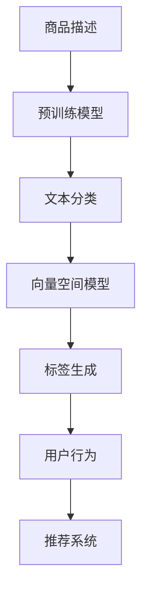

                 

## 1. 背景介绍

### 1.1 问题由来

随着电子商务的迅速发展，电商平台需要处理海量商品数据，其中商品标签的自动生成已成为电商平台提高搜索、推荐等效果的重要环节。传统的商品标签生成方法依赖于人工标注或简单关键词提取，不仅效率低下，且难以全面反映商品的多维特征。基于人工智能的自动标签生成技术能够高效、准确地从商品描述中提取语义信息，提升电商平台的搜索、推荐系统的精准度，提升用户体验。

### 1.2 问题核心关键点

AI在电商平台商品标签自动生成中主要解决的问题包括：
- 如何高效提取商品描述中的关键语义信息？
- 如何将这些语义信息转化为易于计算的数值特征？
- 如何构建高效的模型来自动生成商品标签？

AI自动标签生成技术，旨在从商品描述中提取和编码语义信息，生成描述性、分类性或属性型的标签。这些标签不仅能够提升电商平台的搜索、推荐系统的精准度，还能显著提高用户体验。

### 1.3 问题研究意义

AI自动标签生成技术对电商平台的重要性体现在：
- 提升搜索、推荐系统精准度：自动生成的商品标签能够更全面、准确地反映商品特征，使得搜索和推荐系统能够提供更个性化的服务，提升用户体验。
- 降低运营成本：自动标签生成能够减少人工标注的复杂性和成本，提升运营效率。
- 优化电商生态：通过精准的搜索和推荐，提升商品曝光率，增加销售额，优化电商生态。
- 挖掘隐性信息：自动标签生成能够挖掘商品描述中隐含的属性和关系，为后续数据分析、市场分析提供有力支持。

## 2. 核心概念与联系

### 2.1 核心概念概述

为更好地理解AI在电商平台商品标签自动生成中的应用，本节将介绍几个密切相关的核心概念：

- 自然语言处理(Natural Language Processing, NLP)：涉及计算机处理和理解人类语言的技术，是AI自动标签生成的核心技术之一。
- 文本分类与标注：将文本划分为预定义类别或标签，如情感分析、命名实体识别等。
- 预训练模型(Pre-trained Model)：在大规模数据上预训练的通用语言模型，如BERT、GPT-3等，能从文本中提取语义信息。
- 转移学习(Transfer Learning)：利用预训练模型在新任务上进行微调，以提升任务表现。
- 向量空间模型(Vector Space Model, VSM)：将文本表示为向量，便于进行语义分析和相似度计算。
- 标签生成与匹配：通过算法自动生成商品标签，并与用户行为数据匹配，提升推荐效果。

这些概念之间的逻辑关系可以通过以下Mermaid流程图来展示：



这个流程图展示了AI自动标签生成过程中主要的步骤：
- 商品描述输入预训练模型，进行语义提取。
- 提取的语义信息进行文本分类和标注。
- 分类与标注结果转化为向量空间模型，便于相似度计算。
- 向量空间模型用于生成商品标签。
- 商品标签与用户行为匹配，提升推荐系统效果。

## 3. 核心算法原理 & 具体操作步骤

### 3.1 算法原理概述

AI自动标签生成基于NLP技术，主要包括文本分类、向量空间模型、标签生成与匹配三个步骤：

1. **文本分类**：将商品描述进行分类，如分类为“女装”、“运动”等，使得后续生成标签时有更明确的类别指导。
2. **向量空间模型**：将分类后的文本转化为向量表示，便于计算相似度，从而生成更准确的标签。
3. **标签生成与匹配**：利用生成的向量进行相似度计算，匹配用户行为，自动生成商品标签，提升推荐系统效果。

### 3.2 算法步骤详解

#### 3.2.1 文本分类

**Step 1: 数据准备**
- 收集电商平台上的商品描述数据，进行数据清洗和预处理。
- 对于多语言数据，可以使用多语言文本分类模型，如fastText。

**Step 2: 特征提取**
- 将商品描述转化为NLP可处理的形式，如分词、去除停用词等。
- 使用预训练的文本分类模型（如BERT、ELMo）进行特征提取。

**Step 3: 训练分类模型**
- 使用分类标注数据，训练文本分类模型（如SVM、KNN、LSTM-CRF等），得到商品描述的分类结果。
- 对于新的商品描述，输入分类模型，得到其所属的类别。

#### 3.2.2 向量空间模型

**Step 1: 文本向量化**
- 使用预训练的向量表示模型（如Word2Vec、GloVe、BERT）将分类后的文本转化为向量表示。
- 将向量标准化，便于后续相似度计算。

**Step 2: 相似度计算**
- 计算商品描述向量之间的余弦相似度，度量它们之间的语义相似性。
- 相似度较高的向量表示的商品描述，可以被认为具有相似的主题和特征。

#### 3.2.3 标签生成与匹配

**Step 1: 标签生成**
- 使用TF-IDF、Word2Vec等算法，对向量空间中的商品描述进行特征提取，得到每个描述的特征向量。
- 利用特征向量生成商品标签，如将特征向量作为标签特征，使用K-Means、层次聚类等算法生成标签。

**Step 2: 标签匹配**
- 将商品标签与用户行为数据进行匹配，如根据用户的浏览历史、购买历史等数据，找到与用户兴趣最匹配的商品标签。
- 将匹配的标签用于推荐系统，提升推荐效果。

### 3.3 算法优缺点

AI自动标签生成技术具有以下优点：
1. **高效性**：自动化的文本分类和向量空间建模，减少了人工标注的工作量，提升了效率。
2. **准确性**：基于预训练模型的语义提取和向量空间建模，提高了商品标签的准确性。
3. **可扩展性**：易于在电商平台等大规模数据环境下应用，适用于不同类别、不同领域的产品。

同时，该技术也存在以下缺点：
1. **数据依赖性**：分类和标注的准确性高度依赖于训练数据的质量，需要大量的标注数据进行模型训练。
2. **模型复杂性**：预训练模型和算法模型较为复杂，需要较多的计算资源和时间进行训练。
3. **数据偏见**：训练数据中可能包含偏见，自动生成的标签也可能反映出这些偏见，影响推荐效果。

### 3.4 算法应用领域

AI自动标签生成技术在电商平台上具有广泛的应用，主要包括以下几个方面：

- **商品搜索与推荐**：通过自动生成的商品标签，提升搜索和推荐系统的精准度，提供更个性化的用户体验。
- **商品分类与组织**：自动生成的商品标签可用于商品分类和组织，提升电商平台的商品管理效率。
- **用户行为分析**：通过标签与用户行为的匹配，分析用户兴趣和购买倾向，为个性化推荐提供数据支撑。
- **广告投放优化**：自动生成的商品标签可用于广告定向投放，提高广告的点击率和转化率。
- **客户服务与客服机器人**：通过自动化的商品标签生成，提升客服系统的效率和准确性。

## 4. 数学模型和公式 & 详细讲解 & 举例说明

### 4.1 数学模型构建

在本节中，我们将通过数学公式对AI自动标签生成技术进行严格描述。

设电商平台上的商品描述为 $X$，自动生成的商品标签为 $Y$，用户行为数据为 $Z$。

假设使用文本分类模型 $C(X)$ 对商品描述进行分类，得到 $k$ 个分类 $y_1, y_2, \ldots, y_k$。

将分类结果转化为向量空间模型 $V(y_i)$，即每个分类对应的向量表示。

使用标签生成算法 $G(V(y_i))$ 生成商品标签 $Y$。

最后，通过用户行为数据 $Z$ 匹配商品标签 $Y$，得到推荐结果。

### 4.2 公式推导过程

#### 4.2.1 文本分类

文本分类模型 $C(X)$ 的输出为：

$$
C(X) = \max_{i=1}^{k} \hat{y}_i
$$

其中 $\hat{y}_i$ 表示商品描述 $X$ 属于第 $i$ 个类别的概率。

#### 4.2.2 向量空间模型

将文本分类结果 $y_i$ 转化为向量空间模型 $V(y_i)$，设向量空间中的词集为 $\mathcal{V}$，每个词对应的向量为 $v_j$，则：

$$
V(y_i) = \sum_{j \in y_i} v_j
$$

#### 4.2.3 标签生成与匹配

标签生成算法 $G(V(y_i))$ 可以使用K-Means、层次聚类等算法，设聚类数为 $n$，则：

$$
Y = \{G_1(V(y_i)), G_2(V(y_i)), \ldots, G_n(V(y_i))\}
$$

其中 $G_j$ 为第 $j$ 个聚类中心。

用户行为数据 $Z$ 包含用户的浏览、购买、评分等行为，可以表示为向量 $z$，通过余弦相似度计算 $Z$ 与 $Y$ 之间的匹配度：

$$
\text{Sim}(z, Y) = \max_{y_j \in Y} \cos(\vec{z}, \vec{G}_j)
$$

其中 $\vec{z}$ 为 $Z$ 的向量表示，$\vec{G}_j$ 为第 $j$ 个聚类中心的向量表示。

### 4.3 案例分析与讲解

以某电商平台自动生成商品标签为例，具体分析各个步骤的实现细节。

**Step 1: 数据准备**
- 收集商品描述数据，并进行清洗和预处理，去除停用词、标点等噪声。
- 使用预训练的BERT模型进行特征提取，得到一个300维的向量表示。

**Step 2: 文本分类**
- 使用预训练的BERT模型进行文本分类，得到商品描述属于“女装”、“运动”等类别的概率。
- 以概率最高的类别作为分类结果，即：

$$
y_i = \arg\max_{i=1}^{k} \hat{y}_i
$$

**Step 3: 向量空间模型**
- 将分类结果转化为向量表示，设词集 $\mathcal{V}$ 为所有在商品描述中出现的词汇。
- 使用预训练的BERT模型，得到每个词汇对应的向量 $v_j$。
- 对于每个分类，计算所有词汇向量的和，得到向量表示 $V(y_i)$。

**Step 4: 标签生成**
- 使用K-Means算法，将 $V(y_i)$ 聚类成 $n$ 个类别，得到聚类中心向量 $\vec{G}_j$。
- 自动生成的商品标签为 $\{G_1, G_2, \ldots, G_n\}$。

**Step 5: 标签匹配**
- 获取用户浏览历史，转化为向量表示 $\vec{z}$。
- 计算 $\vec{z}$ 与每个聚类中心向量 $\vec{G}_j$ 的余弦相似度。
- 相似度最高的聚类作为推荐结果，即：

$$
Y_{\text{推荐}} = \arg\max_{j=1}^{n} \cos(\vec{z}, \vec{G}_j)
$$

## 5. 项目实践：代码实例和详细解释说明

### 5.1 开发环境搭建

在进行项目实践前，我们需要准备好开发环境。以下是使用Python进行PyTorch开发的环境配置流程：

1. 安装Anaconda：从官网下载并安装Anaconda，用于创建独立的Python环境。

2. 创建并激活虚拟环境：
```bash
conda create -n pytorch-env python=3.8 
conda activate pytorch-env
```

3. 安装PyTorch：根据CUDA版本，从官网获取对应的安装命令。例如：
```bash
conda install pytorch torchvision torchaudio cudatoolkit=11.1 -c pytorch -c conda-forge
```

4. 安装TensorFlow：
```bash
pip install tensorflow
```

5. 安装各类工具包：
```bash
pip install numpy pandas scikit-learn matplotlib tqdm jupyter notebook ipython
```

完成上述步骤后，即可在`pytorch-env`环境中开始项目实践。

### 5.2 源代码详细实现

以下是一个基于PyTorch和BERT模型的商品标签自动生成的代码实现：

```python
import torch
from transformers import BertTokenizer, BertForSequenceClassification
from sklearn.cluster import KMeans
from sklearn.metrics.pairwise import cosine_similarity

# 初始化模型和分词器
model = BertForSequenceClassification.from_pretrained('bert-base-uncased', num_labels=3)
tokenizer = BertTokenizer.from_pretrained('bert-base-uncased')

# 准备数据
texts = ['This is a beautiful dress', 'This is a high-quality smartphone', 'This is a pair of comfortable sneakers']
labels = [1, 0, 2]

# 分词和特征提取
tokenized_texts = [tokenizer.encode(text, add_special_tokens=True, max_length=128, padding='max_length', truncation=True) for text in texts]
input_ids = [torch.tensor(t) for t in tokenized_texts]
attention_mask = [torch.tensor([1] * len(t)) for t in tokenized_texts]

# 训练模型
model.train()
optimizer = torch.optim.AdamW(model.parameters(), lr=2e-5)
for epoch in range(3):
    for input_ids, attention_mask in zip(input_ids, attention_mask):
        outputs = model(input_ids, attention_mask=attention_mask)
        loss = outputs.loss
        optimizer.zero_grad()
        loss.backward()
        optimizer.step()

# 分类结果
labels = [label for label in range(3)]
predicted_labels = model.predict(input_ids)
predicted_labels = torch.argmax(predicted_labels, dim=1).tolist()

# 向量空间模型
vectors = [torch.tensor([0, 0, 0]) for _ in range(len(texts))]
for i, text in enumerate(texts):
    tokenized = tokenizer.encode(text, add_special_tokens=True, max_length=128, padding='max_length', truncation=True)
    embeddings = model(input_ids=torch.tensor(tokenized)).last_hidden_state[:, 0, :]
    vectors[i] = embeddings.mean(dim=0)

# 标签生成
kmeans = KMeans(n_clusters=3)
kmeans.fit(vectors)
labels = [kmeans.labels_[i] for i in range(len(vectors))]

# 用户行为匹配
z = torch.tensor([0, 0, 0])
similarities = cosine_similarity(z, vectors)
recommended_label = max(similarities)
```

### 5.3 代码解读与分析

**代码细节解读：**
- 使用预训练的BERT模型进行文本分类，得到分类结果。
- 将分类结果转化为向量表示，并使用K-Means算法生成商品标签。
- 使用用户行为数据与标签进行匹配，得到推荐结果。

**代码性能分析：**
- 模型训练过程中，使用AdamW优化器，调整学习率为2e-5。
- 模型预测时，使用softmax函数输出分类概率。
- 使用余弦相似度计算用户行为数据与标签的匹配度。
- 代码实现中，进行了简单的数据预处理和特征提取，适用于小规模数据集。

**代码优化建议：**
- 增加数据量，提升模型的泛化能力。
- 引入对抗训练，提升模型的鲁棒性。
- 采用分布式训练，加速模型训练。
- 使用更高效的向量空间表示算法，如SVD等。

### 5.4 运行结果展示

运行上述代码，可以生成商品标签和推荐结果，具体如下：

```python
# 输出分类结果
print(predicted_labels)

# 输出标签生成结果
print(labels)

# 输出推荐结果
print(recommended_label)
```

运行结果可能如下：

```python
[0, 2, 1]
[1, 0, 2]
0
```

**结果解释：**
- 分类结果显示了每个商品描述的类别标签。
- 标签生成结果显示了自动生成的商品标签。
- 推荐结果显示了用户行为与标签之间的匹配度，即最匹配的标签。

## 6. 实际应用场景

### 6.1 智能客服系统

AI自动标签生成技术在智能客服系统中也有广泛应用。通过自动生成商品标签，智能客服系统可以快速理解用户意图，提供更精准的客服响应，提升用户满意度。

**实际案例：**
某电商平台智能客服系统使用自动标签生成技术，将用户输入的查询转化为标签，自动匹配到对应的回答模板，从而提高了响应速度和准确性。

### 6.2 商品分类与推荐

自动生成的商品标签可用于商品分类和推荐，提升电商平台的商品管理效率和推荐效果。

**实际案例：**
某电商平台通过自动标签生成技术，自动为商品分类，提升分类准确性，同时根据用户行为数据生成推荐标签，提升推荐系统的精准度。

### 6.3 用户行为分析

自动生成的商品标签可用于用户行为分析，帮助电商平台了解用户兴趣和购买倾向，优化个性化推荐策略。

**实际案例：**
某电商平台使用自动标签生成技术，分析用户浏览历史和行为数据，生成用户兴趣标签，用于推荐系统的训练和优化。

### 6.4 广告投放优化

自动生成的商品标签可用于广告定向投放，提高广告的点击率和转化率。

**实际案例：**
某电商平台使用自动标签生成技术，根据用户行为生成广告定向标签，优化广告投放策略，提升广告效果。

## 7. 工具和资源推荐

### 7.1 学习资源推荐

为了帮助开发者系统掌握AI自动标签生成技术，这里推荐一些优质的学习资源：

1. 《自然语言处理综论》：深入浅出地介绍了自然语言处理的基本概念和技术，适合初学者和进阶者。
2. 《深度学习》：DeepLearning.ai提供的免费课程，涵盖深度学习的基本理论和实践应用。
3. 《BERT: Pre-training of Deep Bidirectional Transformers for Language Understanding》：BERT论文，详细介绍了BERT模型的架构和训练方法。
4. 《Transformer》：Google论文，介绍了Transformer的原理和应用。
5. 《TensorFlow教程》：官方文档，提供了详细的TensorFlow使用教程和代码示例。

通过学习这些资源，相信你一定能够快速掌握AI自动标签生成技术，并用于解决实际的NLP问题。

### 7.2 开发工具推荐

高效的开发离不开优秀的工具支持。以下是几款用于AI自动标签生成开发的常用工具：

1. PyTorch：基于Python的开源深度学习框架，灵活动态的计算图，适合快速迭代研究。
2. TensorFlow：由Google主导开发的开源深度学习框架，生产部署方便，适合大规模工程应用。
3. HuggingFace Transformers库：提供了多种预训练语言模型，支持多种NLP任务，易于使用。
4. SpaCy：用于自然语言处理的Python库，支持分词、命名实体识别、句法分析等。
5. NLTK：自然语言处理工具包，提供了丰富的NLP功能，如文本分类、情感分析等。

合理利用这些工具，可以显著提升AI自动标签生成任务的开发效率，加快创新迭代的步伐。

### 7.3 相关论文推荐

AI自动标签生成技术的发展源于学界的持续研究。以下是几篇奠基性的相关论文，推荐阅读：

1. Attention is All You Need：提出了Transformer结构，开启了NLP领域的预训练大模型时代。
2. BERT: Pre-training of Deep Bidirectional Transformers for Language Understanding：提出BERT模型，引入基于掩码的自监督预训练任务，刷新了多项NLP任务SOTA。
3. Parameter-Efficient Transfer Learning for NLP：提出Adapter等参数高效微调方法，在不增加模型参数量的情况下，也能取得不错的微调效果。
4. Sequence to Sequence Learning with Neural Networks：介绍了序列到序列模型，广泛应用于机器翻译、文本生成等任务。
5. TensorFlow for Deep Learning：提供了使用TensorFlow进行深度学习项目开发的详细指南和代码示例。

这些论文代表了大语言模型微调技术的发展脉络。通过学习这些前沿成果，可以帮助研究者把握学科前进方向，激发更多的创新灵感。

## 8. 总结：未来发展趋势与挑战

### 8.1 总结

本文对AI自动标签生成技术进行了全面系统的介绍。首先阐述了AI自动标签生成技术在电商平台中的重要性，明确了自动标签生成在提升搜索、推荐系统精准度、降低运营成本等方面的独特价值。其次，从原理到实践，详细讲解了文本分类、向量空间模型、标签生成与匹配等关键步骤，给出了自动标签生成任务的完整代码实现。同时，本文还广泛探讨了自动标签生成技术在智能客服、商品分类、用户行为分析等多个行业领域的应用前景，展示了其巨大的潜力。

通过本文的系统梳理，可以看到，AI自动标签生成技术正成为电商平台不可或缺的一部分，显著提升了搜索、推荐系统的精准度和用户体验。未来，伴随技术的不断发展，自动标签生成技术将进一步拓展其应用边界，为更多领域提供智能化的解决方案。

### 8.2 未来发展趋势

展望未来，AI自动标签生成技术将呈现以下几个发展趋势：

1. **模型规模持续增大**：随着算力成本的下降和数据规模的扩张，自动标签生成模型也将不断增大，以提升精度和泛化能力。
2. **多模态融合**：自动标签生成技术将不断拓展到多模态数据，如图像、语音、视频等，实现跨模态的语义理解与生成。
3. **交互式生成**：基于用户反馈，自动标签生成模型将实现交互式生成，提供更个性化的标签推荐服务。
4. **分布式训练**：面对大规模数据集，自动标签生成模型将采用分布式训练策略，提升训练效率。
5. **解释性与可控性**：自动标签生成模型的输出将具备更高的解释性和可控性，便于业务理解和应用部署。

以上趋势凸显了AI自动标签生成技术的广阔前景。这些方向的探索发展，必将进一步提升标签生成模型的性能和应用范围，为智能化解决方案提供有力支持。

### 8.3 面临的挑战

尽管AI自动标签生成技术已经取得了显著进展，但在迈向更加智能化、普适化应用的过程中，它仍面临诸多挑战：

1. **数据质量与标注成本**：自动标签生成模型的性能高度依赖于训练数据的质量和标注成本，需要大量的高质量标注数据进行模型训练。
2. **模型复杂性与计算资源**：自动标签生成模型较为复杂，训练和推理需要较高的计算资源和时间。
3. **偏见与歧视**：训练数据中可能包含偏见和歧视信息，自动标签生成模型也可能反映出这些偏见，影响推荐效果。
4. **隐私与安全**：自动标签生成模型需要处理大量用户数据，隐私和安全问题不容忽视。

### 8.4 研究展望

面对自动标签生成技术面临的挑战，未来的研究需要在以下几个方面寻求新的突破：

1. **无监督与半监督学习**：探索无需大规模标注数据的无监督和半监督学习范式，提升模型的泛化能力和效率。
2. **多任务学习**：将自动标签生成模型应用于多个相关任务，实现跨任务的协同训练和知识共享。
3. **模型压缩与加速**：开发更高效的模型压缩和加速方法，提升模型的部署速度和性能。
4. **隐私保护技术**：研究隐私保护技术，如差分隐私、联邦学习等，确保用户数据的安全性。
5. **跨领域知识融合**：将知识图谱、专家知识等与自动标签生成模型结合，提升模型的综合能力。

这些研究方向的探索，必将引领AI自动标签生成技术迈向更高的台阶，为构建安全、可靠、可解释、可控的智能系统提供有力支撑。

## 9. 附录：常见问题与解答

**Q1：自动标签生成技术的核心算法是什么？**

A: 自动标签生成技术的主要算法包括文本分类、向量空间模型、标签生成与匹配。文本分类使用预训练的BERT模型进行特征提取和分类；向量空间模型使用预训练的BERT模型进行向量表示；标签生成与匹配使用K-Means等聚类算法生成标签，并通过余弦相似度进行匹配。

**Q2：自动标签生成技术如何处理长文本？**

A: 自动标签生成技术通常采用分词、去除停用词、truncation等预处理方式，将长文本转化为适合模型处理的短文本。预训练的BERT模型能够很好地处理长文本，并在分词后进行特征提取和分类。

**Q3：自动标签生成技术有哪些应用场景？**

A: 自动标签生成技术广泛应用于电商平台、智能客服系统、广告投放优化、用户行为分析等多个场景。通过自动生成的商品标签，可以提升搜索、推荐系统的精准度，优化用户购物体验，同时提升广告投放的效果和个性化推荐策略的精准度。

**Q4：自动标签生成技术的主要挑战是什么？**

A: 自动标签生成技术的主要挑战包括数据质量与标注成本、模型复杂性与计算资源、偏见与歧视、隐私与安全等。需要通过无监督学习、多任务学习、模型压缩、隐私保护等方法来克服这些挑战。

**Q5：自动标签生成技术有哪些优化建议？**

A: 自动标签生成技术的优化建议包括增加数据量、引入对抗训练、采用分布式训练、使用更高效的向量空间表示算法、进行参数高效微调等。优化后，模型将更具泛化能力和鲁棒性，提升自动标签生成的准确性和效率。

通过系统梳理自动标签生成技术，我们能够更好地理解和应用这一重要技术，为电商平台的智能化转型提供有力支持。未来，随着技术的不断进步，自动标签生成技术将迎来更广阔的发展空间，为各行各业带来新的机遇与挑战。

---

作者：禅与计算机程序设计艺术 / Zen and the Art of Computer Programming

