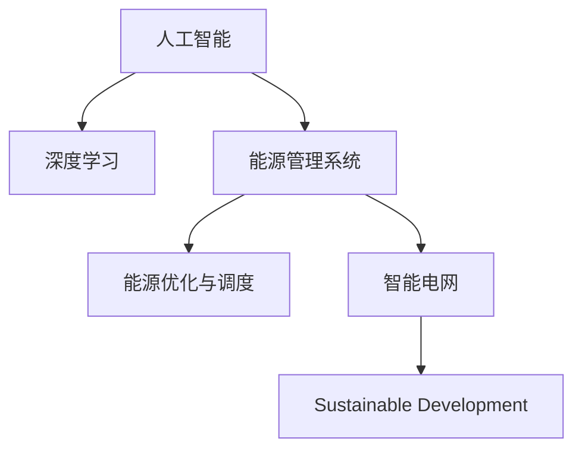

                 

## 1. 背景介绍

### 1.1 问题由来
随着全球能源需求的持续增长和环境保护意识的不断提高，能源管理和可持续发展成为人类社会面临的重要议题。传统能源管理方式往往依赖于人工监控和简单的自动化系统，存在效率低、响应慢、决策失误等问题。而人工智能（AI）技术的快速发展，尤其是深度学习在数据分析和决策优化中的应用，为能源管理注入了新的活力。

### 1.2 问题核心关键点
AI在能源管理和可持续发展中的应用，主要围绕以下几个核心问题展开：

1. **数据获取与处理**：能源系统的数据量庞大且种类繁多，包括温度、湿度、压力、流量、电压等。如何高效获取、处理和存储这些数据，是应用AI的基础。
2. **实时监控与预测**：能源系统运行状态和负荷预测是提高效率和稳定性的关键。AI能够实时分析数据，预测能源需求和故障，提前采取措施。
3. **优化决策与控制**：基于AI模型的决策和控制策略，能够优化能源消耗和分配，提高系统的整体效率。
4. **智能分析与反馈**：AI不仅能够处理结构化数据，还能通过文本分析、图像识别等技术，理解非结构化数据，提供更深入的洞察。
5. **可持续发展**：AI可以帮助制定更科学合理的能源策略，推动能源系统的绿色转型和可持续发展。

### 1.3 问题研究意义
通过AI技术，能源管理系统能够实现更高效的能源利用，降低环境污染，提升能源系统的智能化水平。这不仅有助于企业降低运营成本，提升竞争力，也对全球环境保护和可持续发展具有重要意义。因此，AI在能源管理中的应用研究具有重要的理论价值和实际应用价值。

## 2. 核心概念与联系

### 2.1 核心概念概述

为更好地理解AI在能源管理和可持续发展中的应用，本节将介绍几个密切相关的核心概念：

- **人工智能（AI）**：一种通过计算机程序模拟人类智能的技术，涵盖感知、学习、推理、决策等多个方面。
- **深度学习（Deep Learning）**：一种基于神经网络的机器学习技术，能够自动从数据中提取复杂特征。
- **能源管理系统（Energy Management System, EMS）**：用于监控、控制和优化能源使用的信息系统，包括电力、燃气、水等。
- **能源优化与调度**：通过优化算法，合理分配和调度能源资源，实现节能减排和成本最小化。
- **智能电网（Smart Grid）**：结合AI技术的现代电网，能够实现实时监测、智能控制和优化调度。
- **可持续发展（Sustainable Development）**：以保护环境、节约资源、满足社会需求为目标的发展模式。

这些核心概念之间的逻辑关系可以通过以下Mermaid流程图来展示：



这个流程图展示了大语言模型的核心概念及其之间的关系：

1. 人工智能通过深度学习等技术，学习能源系统复杂特征。
2. 能源管理系统利用AI技术，实现能源的实时监控和优化调度。
3. 智能电网进一步结合AI技术，实现更高效、更灵活的能源管理。
4. 通过AI技术的应用，推动能源系统向可持续发展方向转型。

## 3. 核心算法原理 & 具体操作步骤
### 3.1 算法原理概述

AI在能源管理中的应用，核心在于利用深度学习模型处理和分析能源系统数据，进行实时监控、预测和优化决策。其基本流程如下：

1. **数据采集与预处理**：从能源系统采集各类传感器数据，并进行清洗、归一化等预处理。
2. **特征提取与建模**：利用深度学习模型提取数据的特征，建立预测或优化模型。
3. **实时监控与预测**：将实时数据输入模型，进行实时分析和预测。
4. **优化决策与控制**：基于预测结果，制定优化决策和控制策略。
5. **反馈与调整**：对模型输出进行反馈，不断调整模型参数，提高预测和决策的准确性。

### 3.2 算法步骤详解

#### 3.2.1 数据采集与预处理

能源管理系统通常包含多种传感器和监测设备，能够采集温度、压力、流量、电压等各类数据。数据的采集和预处理是应用AI的第一步。

**数据采集**：
- 通过物联网（IoT）设备，实时获取能源系统的运行数据。
- 数据采集设备需具备高可靠性、低功耗和抗干扰能力。

**数据预处理**：
- 对采集数据进行去噪、滤波等处理，保证数据质量。
- 进行归一化、降维等操作，使数据适合后续模型的处理。
- 对于时间序列数据，需要进行滑动窗口划分，保证数据的时序连续性。

#### 3.2.2 特征提取与建模

深度学习模型能够从原始数据中提取复杂特征，用于能源系统的预测和优化。常用的深度学习模型包括卷积神经网络（CNN）、循环神经网络（RNN）和长短期记忆网络（LSTM）。

**卷积神经网络（CNN）**：用于处理图像、视频等数据，能够捕捉局部特征，适用于空间数据的处理。

**循环神经网络（RNN）和长短期记忆网络（LSTM）**：用于处理时间序列数据，能够捕捉时间依赖关系，适用于动态数据的处理。

**模型训练**：
- 使用标注数据对模型进行训练，优化模型参数。
- 使用交叉验证、正则化等技术，防止过拟合。
- 使用GPU、TPU等高性能计算设备，加速模型训练。

#### 3.2.3 实时监控与预测

在能源管理系统中部署AI模型，对实时数据进行监控和预测，及时发现异常，制定优化决策。

**实时监控**：
- 将实时数据输入模型，计算预测结果。
- 实时输出监控指标，如温度、压力、流量等。
- 设置告警阈值，及时发现异常情况。

**预测与决策**：
- 根据预测结果，制定优化决策，如调整设备运行参数。
- 根据预测结果，进行长期能源优化规划。

#### 3.2.4 优化决策与控制

通过AI模型，制定科学的能源优化决策和控制策略，提升能源系统的整体效率。

**优化决策**：
- 利用预测结果，优化能源分配和调度。
- 制定能源消耗最小化和环境影响最小化的决策策略。

**控制策略**：
- 利用模型输出，控制设备运行状态，如加热、冷却、通风等。
- 利用模型输出，优化设备维护和保养计划。

#### 3.2.5 反馈与调整

不断对模型输出进行反馈，调整模型参数，提高预测和决策的准确性。

**反馈机制**：
- 定期收集模型输出结果，进行评估和分析。
- 根据反馈结果，调整模型参数和优化策略。

**模型更新**：
- 使用新的数据对模型进行重新训练，更新模型参数。
- 引入迁移学习技术，将预训练模型应用于新场景。

### 3.3 算法优缺点

**优点**：
- **高效处理大数据**：深度学习模型能够处理大规模数据，提供实时分析与决策。
- **动态适应变化**：AI模型能够实时监控和预测，动态调整能源分配策略。
- **提升决策精度**：基于数据的深度学习模型，能够准确预测能源需求和故障，提升决策的科学性。
- **推动可持续发展**：AI模型能够优化能源使用，减少浪费，促进绿色能源转型。

**缺点**：
- **数据依赖性强**：AI模型依赖高质量的数据进行训练，数据采集和预处理需投入大量资源。
- **模型复杂度高**：深度学习模型参数较多，训练复杂度高，需要高性能计算资源。
- **可解释性差**：AI模型通常作为"黑盒"使用，难以解释其决策过程，不利于故障诊断和优化调整。
- **维护成本高**：AI模型的开发和维护成本较高，需要专业的技术人员支持。

尽管存在这些缺点，但就目前而言，AI在能源管理中的应用仍具有重要的现实意义和未来发展潜力。

### 3.4 算法应用领域

AI在能源管理和可持续发展中的应用，主要涵盖以下几个领域：

**智能电网**：通过AI技术，实现电网的实时监测、优化调度和故障预测，提高电网的运行效率和可靠性。

**能源优化与调度**：利用AI模型，优化能源的分配和调度，实现节能减排和成本最小化。

**可再生能源管理**：利用AI技术，预测可再生能源的产出，优化能源存储和分配，促进可再生能源的利用。

**智慧建筑**：通过AI技术，实时监控建筑能耗，优化设备运行，提高建筑能效。

**工业能源管理**：利用AI技术，优化工业生产过程中的能源使用，提升生产效率和节能效果。

**环境监测与治理**：通过AI技术，实时监测环境数据，评估环境影响，推动可持续发展。

这些应用领域展示了AI在能源管理和可持续发展中的广泛前景和实际价值。

## 4. 数学模型和公式 & 详细讲解 & 举例说明

### 4.1 数学模型构建

**目标函数**：
- 假设能源系统目标为最小化能源消耗，建立如下目标函数：
$$
\min_{x} f(x) = \sum_{i=1}^n c_i f_i(x_i) + \lambda \sum_{i=1}^n g_i(x_i)
$$
其中，$x$为能源系统状态变量，$f_i$为第$i$个目标函数，$c_i$为权重系数，$g_i$为约束条件。

**约束条件**：
- 能源系统的约束条件包括设备运行时间、能耗限制等，建立如下约束条件：
$$
\begin{cases}
x_i \in [a_i, b_i] & i=1,2,...,n \\
g_i(x_i) \leq 0 & i=1,2,...,m
\end{cases}
$$
其中，$x_i$为状态变量，$a_i$和$b_i$为边界值，$g_i$为约束函数。

### 4.2 公式推导过程

**目标函数推导**：
- 假设目标函数为最小化能源消耗，建立如下目标函数：
$$
\min_{x} f(x) = \sum_{i=1}^n c_i f_i(x_i)
$$
其中，$x$为能源系统状态变量，$f_i$为第$i$个目标函数，$c_i$为权重系数。

**约束条件推导**：
- 能源系统的约束条件包括设备运行时间、能耗限制等，建立如下约束条件：
$$
\begin{cases}
x_i \in [a_i, b_i] & i=1,2,...,n \\
g_i(x_i) \leq 0 & i=1,2,...,m
\end{cases}
$$
其中，$x_i$为状态变量，$a_i$和$b_i$为边界值，$g_i$为约束函数。

### 4.3 案例分析与讲解

**案例：智能电网实时监控与预测**

假设某智能电网系统包含多个变电站和输电线路，目标为最小化电网的运行成本，同时满足供电可靠性和电压稳定性。建立如下优化模型：

**目标函数**：
$$
\min_{x} f(x) = \sum_{i=1}^n c_i f_i(x_i) + \lambda \sum_{i=1}^n g_i(x_i)
$$

**约束条件**：
$$
\begin{cases}
x_i \in [a_i, b_i] & i=1,2,...,n \\
g_i(x_i) \leq 0 & i=1,2,...,m
\end{cases}
$$

其中，$x$为电网状态变量，包括各变电站和输电线路的运行参数；$f_i$为目标函数，如输电线路损耗、变电站维护成本等；$c_i$为权重系数；$g_i$为约束条件，如电压稳定性、供电可靠性等。

通过深度学习模型，实时采集和分析电网数据，预测未来负荷和故障，制定优化决策，调整电网运行参数，实现能源的高效利用和系统的稳定运行。

## 5. 项目实践：代码实例和详细解释说明

### 5.1 开发环境搭建

**环境要求**：
- 硬件：高性能计算设备（如GPU、TPU）
- 软件：Python 3.x、TensorFlow、Keras、Pandas、NumPy等

**环境配置**：
- 安装Python，配置虚拟环境：
```bash
conda create -n env_name python=3.7
conda activate env_name
```

- 安装依赖库：
```bash
pip install tensorflow pandas numpy scikit-learn matplotlib
```

### 5.2 源代码详细实现

**能源管理系统数据处理**：
```python
import pandas as pd
import numpy as np

# 读取能源系统数据
data = pd.read_csv('energy_data.csv')

# 数据清洗
data = data.dropna()

# 特征提取
features = data[['temperature', 'pressure', 'flowrate']]

# 数据标准化
features = (features - features.mean()) / features.std()

# 划分训练集和测试集
train_data = features[:80]
test_data = features[80:]
```

**深度学习模型构建**：
```python
from tensorflow.keras.models import Sequential
from tensorflow.keras.layers import Dense, LSTM

# 构建LSTM模型
model = Sequential()
model.add(LSTM(128, input_shape=(features.shape[1], features.shape[2])))
model.add(Dense(64, activation='relu'))
model.add(Dense(1))

# 编译模型
model.compile(loss='mse', optimizer='adam')
```

**模型训练**：
```python
# 训练模型
model.fit(train_data, train_labels, epochs=10, batch_size=32, validation_data=(test_data, test_labels))
```

**实时监控与预测**：
```python
# 实时数据采集
real_data = np.array([real_temperature, real_pressure, real_flowrate])

# 数据预处理
real_data = (real_data - real_data.mean()) / real_data.std()

# 预测结果
prediction = model.predict(real_data)
```

### 5.3 代码解读与分析

**数据处理**：
- 首先使用Pandas库读取能源系统数据，并进行数据清洗和特征提取。
- 使用NumPy库对数据进行标准化处理，保证数据的一致性和可比性。

**模型构建**：
- 使用TensorFlow和Keras库构建LSTM模型，包含输入层、LSTM层、全连接层和输出层。
- 通过模型编译设置损失函数和优化器，准备进行模型训练。

**模型训练**：
- 使用训练集对模型进行训练，设置迭代次数和批次大小。
- 在验证集上评估模型性能，防止过拟合。

**实时监控与预测**：
- 实时采集能源系统数据，进行预处理。
- 使用训练好的模型对实时数据进行预测，输出预测结果。

### 5.4 运行结果展示

**训练效果**：
- 训练集和验证集上的损失曲线：
```python
import matplotlib.pyplot as plt

plt.plot(history.history['loss'])
plt.plot(history.history['val_loss'])
plt.title('Model Loss')
plt.ylabel('Loss')
plt.xlabel('Epoch')
plt.legend(['Train', 'Test'], loc='upper right')
plt.show()
```

**预测结果**：
- 实时数据和预测结果对比：
```python
print('Actual temperature:', real_temperature)
print('Predicted temperature:', prediction[0][0])
```

## 6. 实际应用场景

### 6.1 智能电网

智能电网通过AI技术，实现实时监测、优化调度和故障预测，提升电网的运行效率和可靠性。

**实时监测**：
- 利用传感器采集电网数据，如电压、电流、功率等。
- 使用深度学习模型实时分析数据，发现异常情况。

**优化调度**：
- 根据预测结果，制定能源分配和调度策略。
- 实时调整变电站和输电线路的运行参数，优化电网运行效率。

**故障预测**：
- 利用模型预测输电线路和变电站的故障风险。
- 提前进行设备维护和检修，避免故障发生。

### 6.2 能源优化与调度

能源优化与调度是AI在能源管理中的重要应用之一，通过优化能源的分配和调度，实现节能减排和成本最小化。

**负荷预测**：
- 利用深度学习模型，预测未来能源负荷。
- 根据负荷预测结果，制定合理的能源分配策略。

**设备优化**：
- 通过优化设备运行参数，减少能源消耗。
- 制定科学的设备维护计划，延长设备寿命。

**调度策略**：
- 利用模型输出，优化能源的存储和分配。
- 制定长期能源优化规划，提升能源系统的整体效率。

### 6.3 可再生能源管理

可再生能源管理是AI在能源管理中的新兴应用领域，通过AI技术，预测可再生能源的产出，优化能源存储和分配。

**风电预测**：
- 利用深度学习模型，预测风电场的风速和风力。
- 根据预测结果，制定合理的风电运行策略。

**太阳能预测**：
- 利用深度学习模型，预测太阳能发电的输出功率。
- 根据预测结果，优化太阳能板的布局和运行参数。

**能源存储优化**：
- 通过优化能源存储设备的运行，提升能源利用效率。
- 制定科学的能源存储策略，保障能源供应的稳定性。

## 7. 工具和资源推荐

### 7.1 学习资源推荐

为了帮助开发者系统掌握AI在能源管理和可持续发展中的应用，这里推荐一些优质的学习资源：

1. **《深度学习理论与实践》**：该书系统介绍了深度学习的基本原理和应用方法，包括能源管理领域。
2. **Coursera《人工智能与能源系统》课程**：斯坦福大学开设的在线课程，介绍了AI在能源系统中的应用，包括能源优化、智能电网等。
3. **能源管理平台**：如Open Energy Platform，提供了丰富的能源管理案例和工具，帮助开发者了解和学习能源管理系统。
4. **TensorFlow官网**：提供了丰富的深度学习资源，包括模型训练、优化技巧等，是学习深度学习的好去处。

### 7.2 开发工具推荐

开发AI在能源管理和可持续发展中的应用，需要一些强大的开发工具支持，推荐以下工具：

1. **TensorFlow**：开源的深度学习框架，支持GPU和TPU等高性能计算设备，适合大规模模型训练。
2. **Pandas**：数据分析和处理库，方便数据的读取、清洗和分析。
3. **NumPy**：数值计算库，提供高效的数组操作和数学函数。
4. **Jupyter Notebook**：交互式编程环境，方便开发者快速迭代和调试模型。
5. **Matplotlib**：数据可视化库，帮助开发者展示和分析数据。

### 7.3 相关论文推荐

AI在能源管理和可持续发展中的应用，涉及多个学科和领域，以下是几篇奠基性的相关论文，推荐阅读：

1. **《深度学习在能源系统中的应用》**：综述了深度学习在能源系统中的应用，包括负荷预测、能源优化等。
2. **《智能电网中的AI技术》**：介绍了AI技术在智能电网中的应用，包括实时监控、优化调度和故障预测。
3. **《基于AI的可再生能源管理》**：探讨了AI技术在可再生能源管理中的应用，包括风电、太阳能预测等。
4. **《能源管理中的优化算法》**：介绍了多种优化算法在能源管理中的应用，包括线性规划、动态规划等。

## 8. 总结：未来发展趋势与挑战

### 8.1 研究成果总结

AI在能源管理和可持续发展中的应用，已经在智能电网、能源优化与调度、可再生能源管理等多个领域取得了显著成果。通过深度学习模型，实时监测和分析能源系统数据，优化能源分配和调度，实现节能减排和成本最小化，推动了能源系统的绿色转型和可持续发展。

### 8.2 未来发展趋势

展望未来，AI在能源管理和可持续发展中的应用将呈现以下几个趋势：

1. **智能化程度提升**：随着AI技术的不断发展，能源管理系统将具备更高的智能化水平，能够实时分析并预测能源需求和故障，制定科学合理的决策策略。
2. **数据驱动决策**：通过大量数据的积累和分析，能源管理系统将更加依赖数据驱动决策，提升决策的科学性和准确性。
3. **跨学科融合**：AI技术将与物联网、区块链、大数据等技术进一步融合，推动能源管理的全面升级。
4. **绿色能源转型**：AI技术将推动可再生能源的利用，优化能源存储和分配，促进能源系统的绿色转型。
5. **全球合作**：能源管理是一个全球性问题，各国将通过国际合作，共同推动能源系统的智能化和可持续发展。

### 8.3 面临的挑战

尽管AI在能源管理和可持续发展中的应用取得了一定进展，但在实际应用中也面临诸多挑战：

1. **数据质量问题**：数据的质量和完整性直接影响到AI模型的训练效果。如何获取高质量的数据，并进行有效预处理，是应用AI的关键。
2. **模型复杂度**：深度学习模型参数较多，训练复杂度高，需要高性能计算资源。如何在保证模型效果的同时，降低模型复杂度，是未来需要解决的重要问题。
3. **可解释性不足**：AI模型通常作为"黑盒"使用，难以解释其决策过程，不利于故障诊断和优化调整。如何赋予AI模型更强的可解释性，是未来研究的重要方向。
4. **跨领域挑战**：能源管理涉及多个领域，如何协调不同领域的知识和需求，实现多领域的数据融合和模型集成，是未来需要解决的关键问题。

### 8.4 研究展望

面对AI在能源管理和可持续发展中面临的挑战，未来的研究需要在以下几个方面寻求新的突破：

1. **提升数据质量**：加强数据采集和预处理技术，提升数据质量。引入自动化数据清洗和异常检测技术，确保数据的一致性和可靠性。
2. **降低模型复杂度**：开发更加高效、轻量级的深度学习模型，降低计算资源消耗，提高模型训练和推理速度。引入模型压缩和稀疏化技术，减少模型参数量。
3. **增强模型可解释性**：引入可解释性技术，如LIME、SHAP等，增强AI模型的可解释性。通过模型分析，理解AI模型的决策机制，提高系统的透明度和可靠性。
4. **推动跨领域融合**：加强能源管理与其他领域的融合，如物联网、大数据、区块链等，实现多领域的协同优化。开发跨领域的数据融合和模型集成技术，实现资源共享和协同决策。
5. **促进全球合作**：加强国际合作，共享能源管理数据和技术，推动全球范围内的能源管理智能化和可持续发展。

通过这些努力，AI在能源管理和可持续发展中的应用将更加成熟和高效，为全球能源系统的绿色转型和可持续发展贡献力量。

## 9. 附录：常见问题与解答

**Q1: 如何获取高质量的能源数据？**

A: 能源数据的获取通常需要与能源供应商、公共机构和研究机构合作，获取不同来源的数据。同时，需要保证数据的完整性、准确性和一致性，进行数据清洗和预处理，以提高数据质量。

**Q2: 如何降低AI模型的计算复杂度？**

A: 可以通过模型压缩、剪枝、量化等技术降低模型的计算复杂度。引入轻量级模型架构，如MobileNet、EfficientNet等，以减小模型参数量。同时，可以通过分布式计算、异步计算等技术，提高模型的训练和推理效率。

**Q3: 如何增强AI模型的可解释性？**

A: 可以通过可解释性技术，如LIME、SHAP等，增强AI模型的可解释性。通过模型分析，理解AI模型的决策机制，提高系统的透明度和可靠性。引入可视化工具，如TensorBoard、Keras等，帮助开发者调试和优化模型。

**Q4: 如何协调不同领域的知识需求？**

A: 需要加强跨学科的合作和交流，建立多领域的数据融合和模型集成机制。引入领域专家，结合专业知识和经验，优化模型设计和决策策略。通过知识图谱、规则库等技术，实现多领域知识的整合和应用。

**Q5: 如何推动全球合作？**

A: 加强国际合作，建立全球能源管理数据共享平台，推动各国在能源管理领域的交流与合作。通过国际能源机构和组织，推动全球范围内的能源管理智能化和可持续发展。

---

作者：禅与计算机程序设计艺术 / Zen and the Art of Computer Programming

