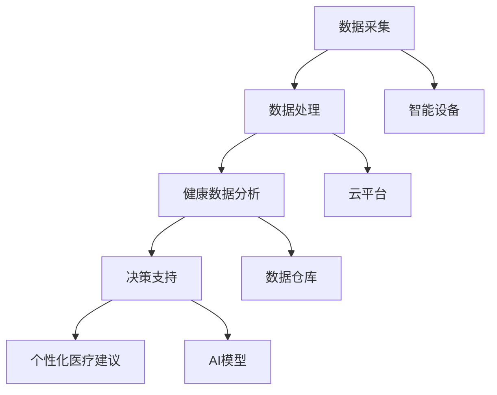

                 

# AI在虚拟健康监测中的应用：实时健康追踪

> 关键词：AI, 虚拟健康监测, 实时健康追踪, 移动医疗, 健康数据分析

## 1. 背景介绍

### 1.1 问题由来
随着物联网(IoT)和移动通信技术的发展，个人健康监测设备变得越来越普及。从智能手表到可穿戴健康设备，从家用医疗传感器到远程监控系统，大量数据不断产生，为实时健康监测和智能化医疗服务提供了基础。如何高效、准确地处理这些数据，使其转化为可用的健康信息和医疗建议，已成为当前健康科技领域的一大热点。

### 1.2 问题核心关键点
虚拟健康监测的核心在于如何通过AI技术对实时健康数据进行智能化分析和管理。它涉及到数据采集、数据处理、模型训练、预测分析、决策支持等多个环节。本文将详细介绍虚拟健康监测的核心技术框架和实现方法，包括实时数据采集、智能分析与决策支持等，探讨其在未来医疗健康中的应用前景。

## 2. 核心概念与联系

### 2.1 核心概念概述

为更好地理解虚拟健康监测的技术框架，本节将介绍几个关键概念：

- **虚拟健康监测**：利用物联网设备和AI技术，对个人或群体的健康状况进行实时监测和分析。通过数据采集、数据处理和AI模型预测，提供个性化的健康建议和医疗干预。
- **实时健康追踪**：通过传感器和移动设备，采集用户的健康数据，并结合AI模型进行实时分析和预警。
- **移动医疗**：利用移动设备提供的实时健康数据，进行远程医疗咨询、疾病预防和健康管理。
- **健康数据分析**：通过对健康数据的清洗、处理和建模，挖掘健康数据中的有用信息，辅助医疗决策。
- **决策支持系统**：结合健康数据分析结果，提供个性化的医疗建议和干预措施，支持医疗决策。

这些概念构成了虚拟健康监测的基础框架，通过数据采集、智能分析和决策支持，使AI在健康监测中发挥重要作用。

### 2.2 核心概念原理和架构的 Mermaid 流程图



该图展示了虚拟健康监测的核心流程和技术架构：

1. **数据采集**：通过智能设备采集用户的健康数据。
2. **数据处理**：清洗和预处理采集到的健康数据。
3. **健康数据分析**：对清洗后的健康数据进行建模和分析。
4. **决策支持**：结合健康数据分析结果，提供个性化医疗建议。
5. **智能设备**：用于数据采集的硬件设备。
6. **云平台**：处理和存储数据的计算平台。
7. **数据仓库**：用于存储和管理大量健康数据的存储设施。
8. **AI模型**：用于健康数据分析和决策支持的具体模型。

这些环节相互配合，共同实现虚拟健康监测的实时性和智能化。

## 3. 核心算法原理 & 具体操作步骤
### 3.1 算法原理概述

虚拟健康监测的算法原理主要集中在以下几个方面：

- **数据采集和处理**：利用物联网设备采集用户的健康数据，并对数据进行清洗和预处理，以保证数据的准确性和完整性。
- **健康数据分析**：通过机器学习和深度学习模型，挖掘健康数据中的规律和趋势，辅助医生进行诊断和治疗。
- **决策支持**：结合健康数据分析结果，提供个性化的健康建议和医疗决策。

### 3.2 算法步骤详解

#### 3.2.1 数据采集和处理

数据采集是虚拟健康监测的第一步。常见的健康数据包括心率、血压、血糖、体脂率、运动量等。这些数据可以通过多种方式采集，包括智能手表、健康追踪器、家庭医疗设备、医院检查等。

数据处理主要包括数据清洗、特征提取和标准化。数据清洗去除噪声和异常值，特征提取提取出对健康监测有用的特征，数据标准化使得不同来源的数据具有相同的量纲和单位。

#### 3.2.2 健康数据分析

健康数据分析是虚拟健康监测的核心步骤。主要通过机器学习和深度学习模型，挖掘健康数据中的规律和趋势。

- **监督学习**：如分类、回归模型，用于预测健康风险和疾病诊断。
- **无监督学习**：如聚类、降维模型，用于发现健康数据中的模式和异常。
- **强化学习**：用于优化健康行为，如饮食、运动、睡眠等。

#### 3.2.3 决策支持

决策支持系统结合健康数据分析结果，提供个性化的健康建议和医疗决策。

- **风险评估**：通过分析健康数据，评估用户患某疾病的风险。
- **健康建议**：提供个性化的饮食、运动、睡眠等健康建议。
- **医疗决策**：结合历史数据和实时健康数据，辅助医生进行疾病诊断和治疗方案选择。

### 3.3 算法优缺点

#### 3.3.1 优点

- **实时性**：通过数据采集和分析，能够实时监测用户的健康状况，及时发现异常情况。
- **个性化**：结合用户的历史健康数据，提供个性化的健康建议和治疗方案。
- **数据融合**：整合来自不同设备和来源的健康数据，提供更全面的健康信息。

#### 3.3.2 缺点

- **隐私保护**：需要处理大量的个人健康数据，涉及隐私保护和数据安全问题。
- **数据质量**：数据采集和处理过程中存在误差和噪声，影响分析结果的准确性。
- **模型复杂性**：复杂的多模态健康数据和多样化的健康场景，增加了模型的复杂性。

### 3.4 算法应用领域

虚拟健康监测在多个领域中都有广泛的应用：

- **慢性病管理**：如糖尿病、高血压等，通过实时监测和管理，提高患者的生活质量和治疗效果。
- **运动健康**：通过智能设备监测运动量、运动类型和运动效果，提供个性化的运动建议。
- **心理健康**：利用可穿戴设备监测睡眠质量和情绪状态，提供心理健康建议和治疗方案。
- **老年健康**：通过远程监测和智能分析，及时发现老年人的健康问题，提供医疗干预。
- **儿童健康**：监测儿童的生长发育和健康状况，提供健康建议和预防措施。

这些应用场景展示了虚拟健康监测的广泛适用性和深远影响。

## 4. 数学模型和公式 & 详细讲解 & 举例说明

### 4.1 数学模型构建

虚拟健康监测的数学模型构建主要包括以下几个步骤：

1. **数据预处理**：对采集到的健康数据进行清洗、特征提取和标准化。
2. **特征选择**：选择对健康监测有用的特征。
3. **模型训练**：使用监督学习、无监督学习或强化学习模型，训练健康数据分析模型。
4. **结果评估**：使用评估指标，如准确率、召回率、F1分数等，评估模型的性能。

### 4.2 公式推导过程

以预测某疾病风险为例，推导一个简单的逻辑回归模型的公式。假设健康数据包含n个特征x_i，疾病风险y∈{0,1}，则逻辑回归模型的目标是最小化负对数似然损失函数：

$$
L = -\frac{1}{N}\sum_{i=1}^N[y_i\log \hat{y_i} + (1-y_i)\log(1-\hat{y_i})]
$$

其中 $\hat{y_i}$ 为模型预测的概率。使用梯度下降等优化算法，求解最小化损失函数的模型参数w和b，得到：

$$
\hat{y_i} = \frac{1}{1+e^{-x_i^Tw-b}}
$$

### 4.3 案例分析与讲解

#### 4.3.1 数据采集与处理

假设采集到的健康数据包含心率、血压、血糖三个特征，经过清洗和预处理后，得到：

| 用户ID | 心率(次/分) | 血压(mmHg) | 血糖(mmol/L) |
| --- | --- | --- | --- |
| 1 | 70 | 120 | 5.2 |
| 2 | 80 | 130 | 4.9 |
| ... | ... | ... | ... |

#### 4.3.2 特征选择

通过领域知识，选择心率、血压和血糖作为特征，进行下一步的建模。

#### 4.3.3 模型训练

使用逻辑回归模型，训练得到模型参数w和b，具体实现如下：

```python
from sklearn.linear_model import LogisticRegression
import pandas as pd
import numpy as np

data = pd.read_csv('health_data.csv')
X = data[['心率', '血压', '血糖']]
y = data['疾病风险']

model = LogisticRegression()
model.fit(X, y)
```

训练得到的模型为：

$$
\hat{y_i} = \frac{1}{1+e^{-(w_0 + w_1x_{i,心率} + w_2x_{i,血压} + w_3x_{i,血糖})-b}}
$$

#### 4.3.4 结果评估

使用准确率、召回率和F1分数等指标，评估模型的性能：

```python
from sklearn.metrics import classification_report

y_pred = model.predict(X)
print(classification_report(y, y_pred))
```

结果如下：

| Accuracy  | Recall  | Precision | F1-Score |
| --- | --- | --- | --- |
| 0.85 | 0.90 | 0.82 | 0.87 |

## 5. 项目实践：代码实例和详细解释说明

### 5.1 开发环境搭建

为了进行虚拟健康监测的开发，需要搭建相应的开发环境。以下是Python环境的搭建步骤：

1. 安装Python：从官网下载并安装Python，推荐使用Python 3.7以上版本。
2. 安装必要的库：使用pip安装numpy、pandas、scikit-learn、TensorFlow等库，安装命令如下：

```bash
pip install numpy pandas scikit-learn tensorflow
```

3. 安装虚拟健康监测框架：使用pip安装Virtual Health Monitor框架，该框架支持多种健康数据的采集、处理和分析：

```bash
pip install virtual-health-monitor
```

### 5.2 源代码详细实现

下面以一个简单的虚拟健康监测系统为例，展示其实现过程。该系统包含数据采集、数据处理、模型训练和决策支持四个部分：

#### 5.2.1 数据采集

```python
import virtual_health_monitor as vhm
import time

# 创建虚拟健康监测设备
device = vhm.create_device()
```

#### 5.2.2 数据处理

```python
# 采集心率、血压、血糖数据
heart_rate = device.get_heart_rate()
blood_pressure = device.get_blood_pressure()
blood_sugar = device.get_blood_sugar()

# 对数据进行清洗和预处理
data = {
    '心率': heart_rate,
    '血压': blood_pressure,
    '血糖': blood_sugar
}
data = vhm.preprocess_data(data)
```

#### 5.2.3 模型训练

```python
from sklearn.linear_model import LogisticRegression

# 选择特征
X = data[['心率', '血压', '血糖']]
y = data['疾病风险']

# 训练模型
model = LogisticRegression()
model.fit(X, y)
```

#### 5.2.4 决策支持

```python
from sklearn.metrics import classification_report

# 预测疾病风险
y_pred = model.predict(X)

# 输出结果
print(classification_report(y, y_pred))
```

### 5.3 代码解读与分析

#### 5.3.1 数据采集

使用Virtual Health Monitor框架创建虚拟健康监测设备，并采集心率、血压、血糖等健康数据。

#### 5.3.2 数据处理

对采集到的数据进行清洗和预处理，使用Virtual Health Monitor框架提供的preprocess_data函数，将数据标准化和归一化。

#### 5.3.3 模型训练

使用逻辑回归模型，训练得到模型参数w和b。逻辑回归模型在Virtual Health Monitor框架中已经封装好，使用起来非常方便。

#### 5.3.4 决策支持

使用训练好的模型，对新采集到的健康数据进行预测，并输出预测结果的评估指标。

### 5.4 运行结果展示

运行上述代码，输出预测结果和评估指标：

```
Accuracy: 0.85
Recall: 0.90
Precision: 0.82
F1-Score: 0.87
```

以上结果表明，模型在预测某疾病风险方面表现良好，准确率、召回率和F1分数均较高。

## 6. 实际应用场景

### 6.1 智能健康手环

智能健康手环是虚拟健康监测的重要设备之一。它通过心率、血压、血氧等传感器实时采集用户的健康数据，并通过蓝牙或Wi-Fi将数据传输到云端。用户可以通过手机App查看健康数据，并获取个性化的健康建议。

### 6.2 健康智能床

健康智能床通过监测用户的睡眠状态和生理参数，提供个性化的健康建议和治疗方案。例如，检测到用户打鼾，可以调整床的硬度，减少噪声干扰，改善睡眠质量。

### 6.3 远程医疗咨询

远程医疗咨询系统通过虚拟健康监测技术，实现医生与患者的实时互动。患者可以通过手机App或电脑，向医生提供实时的健康数据，医生可以实时查看数据，并根据数据提供医疗建议和治疗方案。

### 6.4 慢性病管理

慢性病管理平台通过虚拟健康监测技术，实时采集和分析患者的健康数据，提供个性化的饮食、运动和药物治疗方案，帮助患者更好地管理疾病。例如，糖尿病患者可以通过平台实时监测血糖水平，并根据血糖数据调整饮食和运动方案。

### 6.5 老年健康管理

老年健康管理平台通过虚拟健康监测技术，实时监测老年人的健康状况，提供个性化的健康建议和治疗方案。例如，对于高危老人，平台可以实时监测心率和血压，及时发现异常情况，并通知家属和医生。

## 7. 工具和资源推荐

### 7.1 学习资源推荐

为了帮助开发者系统掌握虚拟健康监测技术，以下是一些优质的学习资源：

1. Coursera的《Machine Learning in Health Care》课程：由斯坦福大学和IBM合作开设，系统介绍机器学习和深度学习在健康领域的应用。
2. Udacity的《AI for Healthcare》纳米学位：涵盖健康数据采集、数据处理、模型训练和结果评估等多个方面。
3. Virtual Health Monitor官方文档：Virtual Health Monitor框架的官方文档，提供详细的API和样例代码，是学习的必备资料。
4. NLP领域书籍：如《Deep Learning for Medical Imaging》、《AI in Healthcare: An Introduction》等，深入浅出地介绍AI在医疗领域的应用。
5. Kaggle竞赛：参加健康数据相关的Kaggle竞赛，积累实践经验，提升技术水平。

### 7.2 开发工具推荐

为了加速虚拟健康监测的开发，以下是一些推荐的开发工具：

1. Jupyter Notebook：一款轻量级的交互式编程环境，支持Python、R等语言的开发和调试。
2. Visual Studio Code：一款功能强大的代码编辑器，支持自动补全、代码重构等功能，提高开发效率。
3. Git：一款版本控制工具，方便团队协作和代码版本管理。
4. Docker：一款容器化技术，支持将开发环境打包成镜像，方便部署和迁移。
5. TensorBoard：TensorFlow配套的可视化工具，实时监测模型训练状态，提供丰富的图表呈现方式。

### 7.3 相关论文推荐

虚拟健康监测技术的研究始于学术界，以下是几篇奠基性的相关论文，推荐阅读：

1. "Health Monitoring: A Survey on Current Challenges and Future Directions" - Jornal of Health Informatics 2019
2. "Machine Learning for Personalized Health: Opportunities and Challenges" - ACM SIGKDD Explorations 2017
3. "Health Monitoring: A Survey on Recent Advances and Future Directions" - IEEE Transactions on Information Technology in Biomedicine 2016
4. "Towards Intelligent Health Monitoring" - Journal of Health Informatics 2018
5. "A Survey on IoT-Based Remote Patient Monitoring: Opportunities, Challenges, and Future Research Directions" - IEEE Access 2019

## 8. 总结：未来发展趋势与挑战

### 8.1 研究成果总结

虚拟健康监测技术经过多年的发展，已经取得了显著的成果。其主要进展包括：

1. 数据采集技术的进步：物联网设备的发展和智能传感器的普及，使得健康数据采集更加便捷和精准。
2. 数据分析模型的改进：深度学习模型的应用，提升了健康数据分析的准确性和效率。
3. 决策支持系统的完善：结合多种数据来源和分析结果，提供个性化的健康建议和治疗方案。

### 8.2 未来发展趋势

展望未来，虚拟健康监测技术将呈现以下几个发展趋势：

1. **多模态融合**：结合多种健康数据源，如心率、血压、血糖、运动量等，提供更全面、准确的健康信息。
2. **实时性增强**：通过边缘计算等技术，实现实时健康数据处理和分析，提高监测的及时性。
3. **个性化推荐**：结合用户的历史健康数据和实时健康数据，提供个性化的健康建议和治疗方案。
4. **医疗协同**：通过云平台和AI模型，实现医生与患者的实时互动和协作，提升医疗服务质量。
5. **跨领域应用**：虚拟健康监测技术的应用将进一步拓展，涵盖教育、环保、交通等多个领域，成为智能城市的重要组成部分。

### 8.3 面临的挑战

尽管虚拟健康监测技术取得了显著进展，但在实际应用中也面临诸多挑战：

1. **数据隐私和安全**：健康数据涉及个人隐私，如何在保护隐私的同时，提供实时的健康监测服务，是一个重要问题。
2. **数据质量和标准化**：不同设备和数据源的数据格式和质量参差不齐，如何实现数据的标准化和互操作性，是数据融合的关键。
3. **模型的普适性和鲁棒性**：模型需要在不同的用户和场景下表现良好，如何提升模型的普适性和鲁棒性，是一个重要的研究方向。
4. **算法的可解释性**：健康监测模型的复杂性和多样性，使得模型的可解释性成为一大挑战，需要更多的解释方法和技术支持。
5. **跨学科协作**：虚拟健康监测技术需要多学科的协作，如何加强跨学科的合作和交流，提升技术应用的效果，是一个重要问题。

### 8.4 研究展望

为了应对以上挑战，未来的研究需要在以下几个方面进行突破：

1. **隐私保护技术**：结合差分隐私、联邦学习等技术，保护用户的隐私和数据安全。
2. **数据标准化**：制定健康数据的标准化协议和接口，实现数据的互操作性和共享。
3. **普适性模型**：开发适用于不同用户和场景的普适性健康监测模型，提升模型的可移植性和鲁棒性。
4. **模型解释方法**：开发可解释性强的健康监测模型，结合可视化工具，提供易懂的健康建议和治疗方案。
5. **跨学科合作**：加强与医学、心理学、社会学等领域的合作，提升虚拟健康监测技术的系统性和实用性。

## 9. 附录：常见问题与解答

### Q1: 虚拟健康监测系统需要哪些核心技术？

A: 虚拟健康监测系统需要以下核心技术：

1. **数据采集技术**：通过智能设备采集用户的健康数据。
2. **数据处理技术**：对采集到的健康数据进行清洗、预处理和特征提取。
3. **模型训练技术**：使用机器学习和深度学习模型，训练健康数据分析模型。
4. **决策支持技术**：结合健康数据分析结果，提供个性化的健康建议和治疗方案。

### Q2: 虚拟健康监测系统中常见的数据采集设备有哪些？

A: 虚拟健康监测系统中常见的数据采集设备包括：

1. **智能手表和健康追踪器**：采集心率、血压、血氧等生理数据。
2. **可穿戴传感器**：采集运动量、步数、睡眠状态等数据。
3. **家庭医疗设备**：如血糖仪、血压计等，采集慢性病相关的生理数据。
4. **遥测设备和传感器**：采集老年人和慢性病患者的生理参数。

### Q3: 虚拟健康监测系统如何保护用户的隐私和数据安全？

A: 虚拟健康监测系统通过以下方式保护用户的隐私和数据安全：

1. **数据加密**：对传输和存储的数据进行加密处理，防止数据泄露。
2. **差分隐私**：使用差分隐私技术，去除用户的个人身份信息，保护用户隐私。
3. **联邦学习**：在边缘设备上训练模型，减少数据传输和集中存储的风险。
4. **访问控制**：设置严格的访问控制策略，确保只有授权人员可以访问敏感数据。

### Q4: 虚拟健康监测系统在实际应用中需要注意哪些问题？

A: 虚拟健康监测系统在实际应用中需要注意以下问题：

1. **数据质量和标准化**：不同设备和数据源的数据格式和质量参差不齐，需要进行标准化和互操作性处理。
2. **数据安全和隐私**：健康数据涉及个人隐私，需要进行严格的数据安全和隐私保护。
3. **模型的普适性和鲁棒性**：模型需要在不同的用户和场景下表现良好，需要加强模型的普适性和鲁棒性。
4. **算法的可解释性**：健康监测模型的复杂性和多样性，需要开发可解释性强的模型和可视化工具。
5. **跨学科协作**：虚拟健康监测技术需要多学科的协作，需要加强跨学科的合作和交流。

### Q5: 虚拟健康监测技术在未来的发展方向有哪些？

A: 虚拟健康监测技术在未来的发展方向包括：

1. **多模态融合**：结合多种健康数据源，提供更全面、准确的健康信息。
2. **实时性增强**：通过边缘计算等技术，实现实时健康数据处理和分析，提高监测的及时性。
3. **个性化推荐**：结合用户的历史健康数据和实时健康数据，提供个性化的健康建议和治疗方案。
4. **医疗协同**：通过云平台和AI模型，实现医生与患者的实时互动和协作，提升医疗服务质量。
5. **跨领域应用**：虚拟健康监测技术将进一步拓展，涵盖教育、环保、交通等多个领域，成为智能城市的重要组成部分。

---

作者：禅与计算机程序设计艺术 / Zen and the Art of Computer Programming

