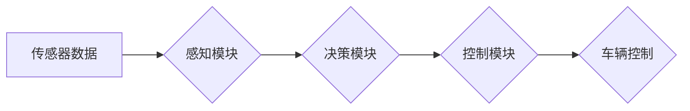

> 自动驾驶, 端到端学习, 深度学习, 计算机视觉, 路况感知, 全天候适应性, 鲁棒性

## 1. 背景介绍

自动驾驶技术作为未来交通运输的重要发展方向，近年来取得了显著进展。从早期基于规则的控制系统到如今的深度学习驱动的端到端系统，自动驾驶技术不断朝着更智能、更安全的方向发展。然而，实现真正意义上的“自动驾驶”仍然面临着诸多挑战，其中全天候全路况适应性是其中最为关键的难题之一。

传统的自动驾驶系统通常依赖于传感器数据和预先定义的规则，在复杂、多变的环境中容易出现故障或无法正常工作。例如，在恶劣天气条件下（如雨雪、雾霾等），传感器数据会受到严重影响，导致车辆感知环境的能力下降；在复杂路况下（如拥堵路段、交叉路口等），车辆需要做出更复杂的决策，传统的规则系统难以应对。

端到端自动驾驶系统通过深度学习算法将传感器数据直接映射到控制指令，具有更强的学习能力和适应性。然而，即使是端到端系统也难以在所有路况下表现出色。例如，在极端天气条件下，现有模型的鲁棒性仍然不足，容易出现错误决策。

## 2. 核心概念与联系

端到端自动驾驶系统的核心概念是将感知、决策和控制三个模块融合在一起，形成一个完整的闭环系统。

**2.1. 感知模块**

感知模块负责从传感器数据中获取车辆周围环境的信息，包括道路边界、行人、车辆、交通信号灯等。常用的传感器包括摄像头、雷达、激光雷达等。

**2.2. 决策模块**

决策模块根据感知模块获取的环境信息，制定车辆的运动策略，例如转向、加速、减速等。深度学习算法，如强化学习和图神经网络，被广泛应用于决策模块。

**2.3. 控制模块**

控制模块将决策模块的指令转化为车辆的实际控制信号，例如油门、刹车、方向盘等。

**2.4. Mermaid 流程图**

## 3. 核心算法原理 & 具体操作步骤

### 3.1  算法原理概述

端到端自动驾驶系统通常采用深度学习算法，例如卷积神经网络（CNN）和循环神经网络（RNN），来实现感知、决策和控制模块的功能。

CNN擅长处理图像数据，可以从摄像头图像中提取道路边界、行人、车辆等信息。RNN擅长处理序列数据，可以从传感器数据中预测车辆未来的运动轨迹。

### 3.2  算法步骤详解

1. **数据采集和预处理:** 收集大量真实道路场景的传感器数据，并进行预处理，例如图像增强、数据标注等。
2. **模型训练:** 使用深度学习算法训练模型，将传感器数据映射到控制指令。训练过程通常采用监督学习方法，使用标注好的数据进行训练。
3. **模型评估:** 使用测试数据评估模型的性能，例如准确率、召回率、平均位移误差等。
4. **模型部署:** 将训练好的模型部署到车辆上，实现自动驾驶功能。

### 3.3  算法优缺点

**优点:**

* **学习能力强:** 深度学习算法可以从大量数据中学习复杂的特征，具有较强的泛化能力。
* **适应性强:** 端到端系统可以根据实际路况进行调整，具有较强的适应性。

**缺点:**

* **数据依赖性强:** 深度学习算法需要大量的数据进行训练，数据质量直接影响模型性能。
* **解释性差:** 深度学习模型的决策过程较为复杂，难以解释模型的决策逻辑。

### 3.4  算法应用领域

端到端自动驾驶算法广泛应用于自动驾驶汽车、无人机、机器人等领域。

## 4. 数学模型和公式 & 详细讲解 & 举例说明

### 4.1  数学模型构建

端到端自动驾驶系统可以抽象为一个状态空间模型，其中状态变量表示车辆的当前状态，例如位置、速度、方向等。控制变量表示车辆的控制指令，例如油门、刹车、方向盘等。

状态转移方程描述了车辆状态随时间的变化，控制输入会影响状态转移。

### 4.2  公式推导过程

状态转移方程的推导过程通常基于车辆动力学模型，考虑车辆的质量、惯性、摩擦力等因素。

例如，车辆的纵向运动方程可以表示为：

$$
F_x = m a_x
$$

其中：

* $F_x$ 为车辆的纵向力
* $m$ 为车辆的质量
* $a_x$ 为车辆的纵向加速度

### 4.3  案例分析与讲解

通过状态转移方程，可以预测车辆在不同控制输入下的运动轨迹。例如，如果车辆处于静止状态，施加一定的油门力，车辆会加速运动。

## 5. 项目实践：代码实例和详细解释说明

### 5.1  开发环境搭建

自动驾驶项目通常需要搭建一个完整的开发环境，包括操作系统、编程语言、深度学习框架等。

例如，可以使用Ubuntu操作系统，Python编程语言，TensorFlow深度学习框架。

### 5.2  源代码详细实现

端到端自动驾驶系统的源代码实现较为复杂，涉及多个模块的开发和集成。

例如，感知模块的代码需要处理摄像头图像数据，提取道路边界、行人、车辆等信息。决策模块的代码需要根据感知模块获取的环境信息，制定车辆的运动策略。

### 5.3  代码解读与分析

代码解读需要分析代码的逻辑结构、算法实现、数据流等方面。

例如，可以分析感知模块的代码，了解如何使用CNN算法提取图像特征，以及如何将特征信息转化为车辆周围环境的表示。

### 5.4  运行结果展示

运行结果展示需要使用测试数据评估模型的性能，例如准确率、召回率、平均位移误差等。

## 6. 实际应用场景

端到端自动驾驶系统在实际应用场景中面临着诸多挑战，例如：

* **安全可靠性:** 自动驾驶系统需要能够在所有路况下安全可靠地行驶，避免发生事故。
* **法律法规:** 自动驾驶技术的法律法规尚未完善，需要制定相应的法律法规来规范自动驾驶系统的应用。
* **社会接受度:** 部分人对自动驾驶技术存在担忧，需要提高公众对自动驾驶技术的了解和接受度。

### 6.4  未来应用展望

未来，端到端自动驾驶系统有望应用于更广泛的场景，例如：

* **城市交通:** 自动驾驶公交车、出租车等，可以缓解城市交通拥堵问题。
* **物流运输:** 自动驾驶卡车、货车等，可以提高物流效率，降低运输成本。
* **个人出行:** 自动驾驶汽车，可以为人们提供更安全、更便捷的出行方式。

## 7. 工具和资源推荐

### 7.1  学习资源推荐

* **书籍:**
    * 《深度学习》
    * 《自动驾驶汽车》
* **在线课程:**
    * Coursera: 深度学习
    * Udacity: 自动驾驶工程师

### 7.2  开发工具推荐

* **编程语言:** Python
* **深度学习框架:** TensorFlow, PyTorch
* **仿真平台:** CARLA, Gazebo

### 7.3  相关论文推荐

* **论文:**
    * End to End Learning for Self-Driving Cars
    * Deep Reinforcement Learning for End-to-End Autonomous Driving

## 8. 总结：未来发展趋势与挑战

### 8.1  研究成果总结

端到端自动驾驶技术取得了显著进展，但仍然面临着诸多挑战。

### 8.2  未来发展趋势

未来，端到端自动驾驶技术将朝着以下方向发展：

* **更强的鲁棒性:** 提高模型在恶劣天气、复杂路况下的鲁棒性。
* **更强的安全性:** 确保自动驾驶系统在所有情况下都能安全可靠地行驶。
* **更强的解释性:** 提高模型的解释性，使人类能够更好地理解模型的决策逻辑。

### 8.3  面临的挑战

端到端自动驾驶技术面临着以下挑战：

* **数据获取和标注:** 收集和标注高质量的自动驾驶数据是一个巨大的挑战。
* **模型复杂度:** 端到端自动驾驶模型非常复杂，训练和部署成本很高。
* **法律法规:** 自动驾驶技术的法律法规尚未完善，需要制定相应的法律法规来规范自动驾驶系统的应用。

### 8.4  研究展望

未来，需要进一步研究以下问题：

* 如何提高模型的鲁棒性和安全性？
* 如何降低模型的复杂度和训练成本？
* 如何制定完善的法律法规来规范自动驾驶系统的应用？

## 9. 附录：常见问题与解答

**常见问题:**

* **端到端自动驾驶系统与传统自动驾驶系统的区别是什么？**
* **端到端自动驾驶系统有哪些优势和劣势？**
* **端到端自动驾驶系统如何实现全天候全路况适应性？**

**解答:**

* **端到端自动驾驶系统与传统自动驾驶系统的区别:** 端到端自动驾驶系统将感知、决策和控制三个模块融合在一起，形成一个完整的闭环系统，而传统自动驾驶系统通常依赖于传感器数据和预先定义的规则。
* **端到端自动驾驶系统的优势和劣势:** 端到端自动驾驶系统的优势在于学习能力强、适应性强，而劣势在于数据依赖性强、解释性差。
* **端到端自动驾驶系统如何实现全天候全路况适应性:** 通过训练模型使用更丰富的、更全面的数据，例如不同天气条件下的数据、不同路况下的数据，以及不同场景下的数据。

作者：禅与计算机程序设计艺术 / Zen and the Art of Computer Programming

<end_of_turn>