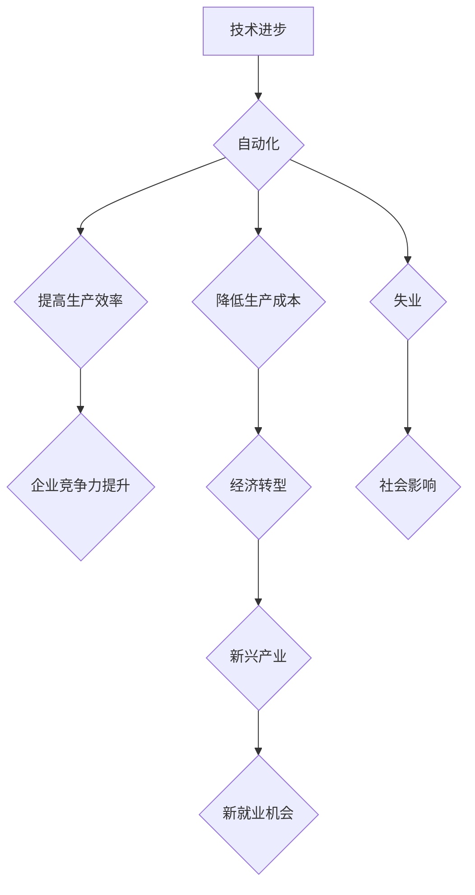

> 纺织工业、自动化、失业、技术进步、社会影响、经济转型、人工智能、未来趋势

## 1. 背景介绍

自人类文明诞生以来，技术进步一直是推动社会发展的重要力量。每一次技术革命都伴随着生产方式的变革，而这种变革往往会对社会结构、就业市场产生深远影响。纺织业作为人类文明早期重要的产业，其发展历程也深刻地反映了技术进步与社会变革之间的复杂关系。

从手工纺织到机械化生产，再到现代的自动化工厂，纺织业经历了多次技术革新，每一次革新都伴随着大量纺织工人的失业。这种现象并非偶然，而是技术进步所带来的必然结果。

## 2. 核心概念与联系

**2.1 技术进步与自动化**

技术进步的核心在于提高生产效率和降低生产成本。自动化技术正是实现这一目标的重要手段。通过机器代替人工完成重复性、高强度的工作，自动化可以显著提高生产效率，降低生产成本，从而提升企业竞争力。

**2.2 失业与社会影响**

自动化带来的失业问题是社会发展过程中需要认真对待的挑战。失业不仅会造成个人经济困难，还会引发社会动荡和不稳定。因此，政府和企业需要共同努力，制定有效的政策和措施，应对自动化带来的失业挑战。

**2.3 经济转型与新兴产业**

技术进步和自动化不仅会带来失业问题，也会催生新的产业和就业机会。例如，人工智能、大数据、云计算等新兴产业的兴起，为社会创造了大量新的就业机会。

**2.4 人工智能与未来发展**

人工智能技术的发展将进一步加速自动化进程，对未来就业市场产生更深远的影响。人工智能可以完成更复杂、更智能化的工作，这将导致更多传统行业的岗位被取代。

**Mermaid 流程图**



## 3. 核心算法原理 & 具体操作步骤

**3.1 算法原理概述**

自动化生产的核心算法原理是基于机器学习和深度学习技术。通过训练大量的样本数据，机器学习算法可以学习到生产过程中的规律和模式，从而实现对生产过程的自动化控制。

**3.2 算法步骤详解**

1. **数据采集:** 收集生产过程中的各种数据，例如机器状态、生产参数、产品质量等。
2. **数据预处理:** 对采集到的数据进行清洗、转换和特征提取，以便于算法训练。
3. **模型训练:** 使用机器学习算法对预处理后的数据进行训练，学习到生产过程的规律和模式。
4. **模型评估:** 对训练好的模型进行评估，验证其准确性和泛化能力。
5. **模型部署:** 将训练好的模型部署到生产环境中，实现对生产过程的自动化控制。

**3.3 算法优缺点**

**优点:**

* 提高生产效率和降低生产成本。
* 减少人工操作，提高生产质量和稳定性。
* 能够处理复杂、多变的生产环境。

**缺点:**

* 需要大量的样本数据进行训练。
* 模型训练过程复杂，需要专业的技术人员。
* 模型的准确性和泛化能力受限于训练数据。

**3.4 算法应用领域**

机器学习算法在纺织业的应用领域非常广泛，例如：

* **纺纱生产自动化:** 利用机器学习算法控制纺纱机的运行参数，提高纺纱质量和生产效率。
* **织布生产自动化:** 利用机器学习算法控制织布机的运行参数，提高织布质量和生产效率。
* **染色整理自动化:** 利用机器学习算法控制染色和整理过程的参数，提高染色质量和生产效率。
* **质量检测自动化:** 利用机器学习算法对纺织品进行质量检测，提高检测效率和准确性。

## 4. 数学模型和公式 & 详细讲解 & 举例说明

**4.1 数学模型构建**

在纺织生产自动化中，我们可以使用数学模型来描述生产过程中的各种关系。例如，我们可以使用线性回归模型来预测纺纱线的产量，使用神经网络模型来控制织布机的运行参数。

**4.2 公式推导过程**

例如，我们可以使用以下公式来预测纺纱线的产量：

$$
y = mx + c
$$

其中：

* $y$ 是纺纱线的产量
* $x$ 是纺纱机的运行时间
* $m$ 是产量增长率
* $c$ 是初始产量

**4.3 案例分析与讲解**

假设我们收集了以下数据：

| 运行时间 (小时) | 产量 (公斤) |
|---|---|
| 1 | 10 |
| 2 | 20 |
| 3 | 30 |
| 4 | 40 |

我们可以使用线性回归模型来拟合这些数据，得到以下模型：

$$
y = 10x + 0
$$

这个模型表明，每增加一个小时的运行时间，纺纱线的产量就会增加10公斤。

## 5. 项目实践：代码实例和详细解释说明

**5.1 开发环境搭建**

为了实现纺织生产自动化的项目，我们需要搭建一个合适的开发环境。

* **操作系统:** Linux 或 Windows
* **编程语言:** Python
* **机器学习库:** TensorFlow 或 PyTorch
* **数据处理库:** Pandas 或 NumPy

**5.2 源代码详细实现**

```python
import pandas as pd
from sklearn.linear_model import LinearRegression

# 1. 数据加载
data = pd.read_csv("纺纱数据.csv")

# 2. 特征选择和数据预处理
X = data["运行时间"]
y = data["产量"]

# 3. 模型训练
model = LinearRegression()
model.fit(X.values.reshape(-1, 1), y)

# 4. 模型评估
# ...

# 5. 模型预测
new_time = 5
predicted_output = model.predict([[new_time]])
print(f"预测产量: {predicted_output[0]}")
```

**5.3 代码解读与分析**

这段代码实现了纺纱线产量预测的简单示例。

* 第一步加载数据，并选择运行时间作为输入特征，产量作为输出目标。
* 第二步使用线性回归模型训练模型，并使用训练数据评估模型性能。
* 第三步使用训练好的模型预测新的运行时间下的产量。

**5.4 运行结果展示**

运行代码后，会输出预测的产量值。

## 6. 实际应用场景

**6.1 纺织厂自动化生产线**

纺织厂可以利用自动化技术构建生产线，实现纺纱、织布、染色、整理等工序的自动化控制。

**6.2 智能纺织品质量检测系统**

利用机器学习算法可以开发智能纺织品质量检测系统，自动识别和分类纺织品缺陷，提高检测效率和准确性。

**6.3 个性化定制纺织品生产**

利用3D打印技术和人工智能技术，可以实现个性化定制纺织品的生产，满足消费者多样化的需求。

**6.4 未来应用展望**

随着人工智能、物联网、云计算等技术的不断发展，纺织业的自动化程度将进一步提高，未来将出现更多创新应用场景。例如：

* **智能纺织工厂:** 利用人工智能技术实现工厂的智能化管理，提高生产效率和降低运营成本。
* **可穿戴纺织品:** 利用智能传感器和纺织材料，开发可穿戴纺织品，实现健康监测、运动追踪等功能。
* **可持续纺织生产:** 利用人工智能技术优化生产流程，减少资源消耗和环境污染。

## 7. 工具和资源推荐

**7.1 学习资源推荐**

* **在线课程:** Coursera、edX、Udacity 等平台提供机器学习和深度学习相关的在线课程。
* **书籍:** 《深度学习》、《机器学习实战》等书籍可以帮助读者深入了解机器学习和深度学习的原理和应用。
* **开源项目:** TensorFlow、PyTorch 等开源项目可以帮助读者实践机器学习和深度学习的应用。

**7.2 开发工具推荐**

* **编程语言:** Python 是机器学习和深度学习领域最常用的编程语言。
* **机器学习库:** TensorFlow、PyTorch、Scikit-learn 等机器学习库提供了丰富的算法和工具。
* **数据处理库:** Pandas、NumPy 等数据处理库可以帮助读者处理和分析数据。

**7.3 相关论文推荐**

* **机器学习经典论文:** 《Support Vector Machines》
* **深度学习经典论文:** 《ImageNet Classification with Deep Convolutional Neural Networks》

## 8. 总结：未来发展趋势与挑战

**8.1 研究成果总结**

纺织业自动化技术的不断发展，为提高生产效率、降低生产成本、提升产品质量提供了新的途径。机器学习和深度学习算法在纺织生产自动化中的应用取得了显著成果，为纺织业的转型升级提供了技术支撑。

**8.2 未来发展趋势**

未来，纺织业自动化将朝着更加智能化、个性化、可持续化的方向发展。人工智能、物联网、云计算等技术的融合将进一步推动纺织业的数字化转型。

**8.3 面临的挑战**

纺织业自动化也面临着一些挑战，例如：

* **技术复杂性:** 纺织生产过程复杂，自动化控制难度较大。
* **数据安全:** 纺织生产过程中涉及大量敏感数据，需要加强数据安全保护。
* **人才短缺:** 纺织业自动化需要大量专业人才，人才短缺问题需要得到解决。

**8.4 研究展望**

未来，需要进一步加强对纺织业自动化技术的研发和应用，探索更先进的算法和技术方案，解决纺织业自动化面临的挑战，推动纺织业的持续发展。

## 9. 附录：常见问题与解答

**9.1 如何选择合适的自动化技术？**

选择合适的自动化技术需要根据具体的生产需求和条件进行综合考虑。例如，对于需要高精度控制的生产过程，可以选择机器人自动化；对于需要灵活适应变化的生产过程，可以选择柔性自动化。

**9.2 自动化生产会带来哪些社会影响？**

自动化生产会带来一些社会影响，例如失业问题、技能结构变化等。需要政府和企业共同努力，制定有效的政策和措施，应对自动化带来的社会影响。

**9.3 如何保障自动化生产的安全性和可靠性？**

保障自动化生产的安全性和可靠性需要从多个方面入手，例如：

* **设计安全可靠的自动化系统**
* **建立完善的监控和报警机制**
* **定期进行安全检查和维护**


作者：禅与计算机程序设计艺术 / Zen and the Art of Computer Programming 
<end_of_turn>