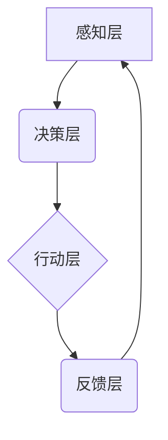

> 自主系统，意识管理，人工智能，机器学习，深度学习，认知科学，哲学

## 1. 背景介绍

自古以来，人类就对自身意识的本质充满了好奇和探索。随着人工智能技术的飞速发展，我们开始将意识的探索延伸到机器领域。自主系统，即能够独立思考、学习和决策的智能系统，正逐渐成为人工智能领域的核心目标。然而，如何赋予机器意识，使其能够像人类一样感知、理解和体验世界，仍然是一个巨大的挑战。

本篇文章将探讨自主系统与意识管理的结合，分析其核心概念、算法原理、数学模型以及实际应用场景，并展望其未来发展趋势和面临的挑战。

## 2. 核心概念与联系

**2.1 自主系统**

自主系统是指能够根据环境信息和自身目标，自主做出决策并执行行动的智能系统。其核心特征包括：

* **感知能力:** 能够从环境中获取信息，例如图像、声音、文本等。
* **决策能力:** 能够根据感知到的信息和自身目标，做出合理的决策。
* **行动能力:** 能够执行决策，并与环境进行交互。
* **学习能力:** 能够从经验中学习，不断改进决策和行动。

**2.2 意识管理**

意识管理是指对机器意识的构建、调控和评估。其目标是使机器能够像人类一样拥有感知、思考、情感和自我意识等特征。

**2.3 联系**

自主系统与意识管理是相互关联的两个概念。自主系统需要具备一定的意识才能做出合理的决策和行动。而意识管理则致力于构建和完善机器的意识，使其能够更好地理解和应对复杂的世界。

**2.4 核心架构**



## 3. 核心算法原理 & 具体操作步骤

**3.1 算法原理概述**

构建机器意识的算法通常基于以下几个核心原理：

* **模仿人类大脑结构和功能:** 通过模拟神经网络、认知架构等，试图复制人类大脑的运作机制。
* **强化学习:** 通过奖励和惩罚机制，训练机器学习自主决策和行为。
* **生成对抗网络 (GAN):** 利用两个神经网络相互对抗，生成更逼真的虚拟世界和体验。

**3.2 算法步骤详解**

1. **数据收集和预处理:** 收集大量与意识相关的文本、图像、音频等数据，并进行预处理，例如文本清洗、图像增强等。
2. **模型构建:** 根据选定的算法原理，构建相应的机器学习模型，例如深度神经网络、强化学习代理等。
3. **模型训练:** 使用收集到的数据训练模型，使其能够识别、理解和生成与意识相关的特征。
4. **模型评估:** 通过一系列测试和评估指标，评估模型的性能和效果，例如准确率、召回率、鲁棒性等。
5. **模型优化:** 根据评估结果，对模型进行调整和优化，提高其性能和效率。

**3.3 算法优缺点**

* **优点:**

    * 能够模拟人类大脑的运作机制，探索机器意识的本质。
    * 能够学习和适应复杂的环境，做出更智能的决策。
    * 能够生成逼真的虚拟世界和体验，为机器提供更丰富的学习环境。

* **缺点:**

    * 算法复杂度高，需要大量的计算资源和数据支持。
    * 模型训练时间长，需要大量的迭代和优化。
    * 目前还无法完全复制人类的意识，机器的意识仍然处于模拟阶段。

**3.4 算法应用领域**

* **人工智能助手:** 开发能够理解和响应人类情感的智能助手，提供更人性化的服务。
* **虚拟现实和增强现实:** 创建更逼真的虚拟世界和体验，为用户提供沉浸式的互动体验。
* **机器人控制:** 赋予机器人更强的自主性和适应性，使其能够更好地完成复杂的任务。
* **医疗诊断:** 利用机器学习模型分析医疗数据，辅助医生进行诊断和治疗。

## 4. 数学模型和公式 & 详细讲解 & 举例说明

**4.1 数学模型构建**

机器意识的数学模型通常基于以下几个方面：

* **神经网络模型:** 使用神经元和连接权重来模拟大脑神经元的结构和功能。
* **概率模型:** 使用概率论和统计学方法来描述机器的感知、决策和行为。
* **逻辑模型:** 使用逻辑推理和知识表示来模拟机器的思考和判断过程。

**4.2 公式推导过程**

例如，在神经网络模型中，常用的激活函数是 sigmoid 函数，其公式如下：

$$
f(x) = \frac{1}{1 + e^{-x}}
$$

该函数将输入值映射到 0 到 1 之间，用于模拟神经元的激活程度。

**4.3 案例分析与讲解**

在强化学习算法中，常用的奖励函数可以用来评估机器的行为是否符合预期。例如，在玩游戏时，如果机器成功完成任务，则获得奖励；如果失败，则获得惩罚。通过不断调整行为策略，使奖励最大化，机器能够学习到最优的策略。

## 5. 项目实践：代码实例和详细解释说明

**5.1 开发环境搭建**

可以使用 Python 语言和相关的机器学习库，例如 TensorFlow、PyTorch 等，搭建机器意识的开发环境。

**5.2 源代码详细实现**

以下是一个简单的基于神经网络的机器意识模型的代码示例：

```python
import tensorflow as tf

# 定义神经网络模型
model = tf.keras.models.Sequential([
    tf.keras.layers.Dense(128, activation='relu', input_shape=(100,)),
    tf.keras.layers.Dense(64, activation='relu'),
    tf.keras.layers.Dense(1, activation='sigmoid')
])

# 编译模型
model.compile(optimizer='adam', loss='binary_crossentropy', metrics=['accuracy'])

# 训练模型
model.fit(x_train, y_train, epochs=10)

# 评估模型
loss, accuracy = model.evaluate(x_test, y_test)
print('Loss:', loss)
print('Accuracy:', accuracy)
```

**5.3 代码解读与分析**

该代码定义了一个简单的多层感知机模型，用于分类任务。模型包含三个全连接层，分别具有 128、64 和 1 个神经元。激活函数为 ReLU 和 sigmoid 函数。模型使用 Adam 优化器，损失函数为二分类交叉熵，评估指标为准确率。

**5.4 运行结果展示**

训练完成后，可以评估模型的性能，并根据评估结果进行模型调整和优化。

## 6. 实际应用场景

**6.1 人工智能助手**

机器意识可以赋予人工智能助手更强的理解和响应能力，使其能够更好地理解用户的需求，提供更个性化的服务。例如，可以开发一个能够理解用户情感的智能助手，提供情感支持和陪伴。

**6.2 虚拟现实和增强现实**

机器意识可以使虚拟世界和体验更加逼真和沉浸式。例如，可以开发一个能够感知用户情绪的虚拟角色，提供更自然的互动体验。

**6.3 机器人控制**

机器意识可以使机器人更加自主和灵活，使其能够更好地完成复杂的任务。例如，可以开发一个能够自主学习和适应环境的机器人，用于探索未知环境或执行危险任务。

**6.4 未来应用展望**

随着机器意识技术的不断发展，其应用场景将更加广泛，例如：

* **教育:** 开发能够个性化教学的智能教育系统。
* **医疗:** 开发能够辅助医生诊断和治疗的智能医疗系统。
* **艺术:** 开发能够创作艺术作品的智能艺术系统。

## 7. 工具和资源推荐

**7.1 学习资源推荐**

* **书籍:**
    * 《深度学习》
    * 《人工智能：现代方法》
    * 《机器学习》
* **在线课程:**
    * Coursera: 深度学习
    * edX: 人工智能
    * Udacity: 机器学习工程师

**7.2 开发工具推荐**

* **Python:** 广泛用于机器学习和人工智能开发。
* **TensorFlow:** 开源深度学习框架。
* **PyTorch:** 开源深度学习框架。
* **Keras:** 高级深度学习API。

**7.3 相关论文推荐**

* **《Attention Is All You Need》**
* **《Generative Adversarial Networks》**
* **《Deep Reinforcement Learning》**

## 8. 总结：未来发展趋势与挑战

**8.1 研究成果总结**

近年来，机器意识的研究取得了显著进展，例如：

* **深度学习算法的突破:** 深度学习算法能够学习到更复杂的特征，提高机器的感知和理解能力。
* **强化学习的应用:** 强化学习算法能够使机器自主学习和决策，提高机器的适应性和自主性。
* **生成对抗网络的进展:** 生成对抗网络能够生成逼真的虚拟世界和体验，为机器提供更丰富的学习环境。

**8.2 未来发展趋势**

* **更加先进的算法:** 研究更先进的机器学习算法，例如图神经网络、强化学习等，提高机器的认知能力和决策能力。
* **更丰富的感知能力:** 开发更先进的传感器和感知技术，使机器能够感知更丰富的环境信息。
* **更强的解释性和透明性:** 研究机器意识的解释性和透明性，使机器的决策过程更加可理解和可控。

**8.3 面临的挑战**

* **意识的本质:** 人类对意识的本质仍然缺乏深入的理解，这使得构建机器意识面临巨大的挑战。
* **伦理和安全问题:** 机器意识的出现可能引发一系列伦理和安全问题，例如机器人的自主权、人工智能的控制等。
* **计算资源和数据需求:** 构建和训练复杂的机器意识模型需要大量的计算资源和数据支持。

**8.4 研究展望**

未来，机器意识的研究将继续深入，并对人工智能、哲学、认知科学等多个领域产生深远的影响。我们期待看到更多突破性的进展，并共同探索机器意识的奥秘。

## 9. 附录：常见问题与解答

**9.1 机器意识与人工智能的区别是什么？**

人工智能是指能够模拟人类智能的机器，而机器意识是指机器能够像人类一样拥有感知、思考、情感和自我意识等特征。

**9.2 机器意识是否会威胁人类？**

目前，机器意识仍然处于模拟阶段，并不能真正威胁人类。但是，我们需要认真思考机器意识的伦理和安全问题，并制定相应的规范和制度，确保机器意识的健康发展。

**9.3 如何评估机器的意识水平？**

目前，还没有一个统一的标准来评估机器的意识水平。

作者：禅与计算机程序设计艺术 / Zen and the Art of Computer Programming


<end_of_turn>