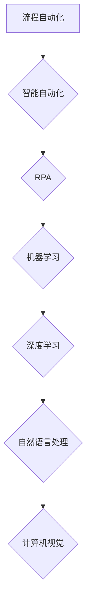

> 自动化、机器学习、深度学习、自然语言处理、计算机视觉、流程自动化、Robotic Process Automation (RPA)

## 1. 背景介绍

自动化一直是科技发展的重要驱动力，它旨在通过程序、算法和技术手段，使任务和流程能够自动执行，从而提高效率、降低成本和减少人为错误。随着人工智能（AI）技术的快速发展，自动化领域迎来了前所未有的机遇和挑战。

近年来，机器学习（ML）和深度学习（DL）等人工智能技术取得了突破性进展，为自动化带来了新的可能性。这些技术赋予机器学习能力，使其能够从数据中学习模式，并根据学习到的知识自动执行任务。例如，自然语言处理（NLP）技术使机器能够理解和生成人类语言，而计算机视觉（CV）技术使机器能够“看到”和理解图像和视频。

## 2. 核心概念与联系

自动化可以从多个角度进行理解，其核心概念包括：

* **流程自动化:** 通过软件工具和技术，自动执行重复性、规则性任务，例如数据录入、报表生成、邮件发送等。
* **智能自动化:** 利用人工智能技术，使自动化系统能够学习和适应不断变化的环境，并执行更复杂的任务，例如决策、预测和优化。
* **Robotic Process Automation (RPA):** 使用软件机器人模拟人类操作，自动执行桌面应用程序和系统任务，例如数据提取、表单填写、文件处理等。

**核心概念与联系流程图:**



## 3. 核心算法原理 & 具体操作步骤

### 3.1  算法原理概述

自动化系统通常基于各种算法进行运作，例如：

* **规则引擎:** 根据预先定义的规则，自动执行任务。
* **机器学习算法:** 从数据中学习模式，并根据学习到的知识自动执行任务。常见的机器学习算法包括决策树、支持向量机、神经网络等。
* **深度学习算法:** 一种更高级的机器学习算法，利用多层神经网络，能够处理更复杂的数据和任务。

### 3.2  算法步骤详解

以机器学习算法为例，其基本步骤包括：

1. **数据收集和预处理:** 收集相关数据，并进行清洗、转换和特征工程等预处理操作。
2. **模型选择:** 根据任务需求选择合适的机器学习算法模型。
3. **模型训练:** 使用训练数据训练模型，使其能够学习数据中的模式。
4. **模型评估:** 使用测试数据评估模型的性能，并进行调参优化。
5. **模型部署:** 将训练好的模型部署到生产环境中，用于自动执行任务。

### 3.3  算法优缺点

不同的自动化算法具有不同的优缺点，需要根据具体任务需求进行选择。例如，规则引擎简单易用，但难以处理复杂场景；机器学习算法能够学习复杂模式，但需要大量数据进行训练。

### 3.4  算法应用领域

自动化算法广泛应用于各个领域，例如：

* **制造业:** 自动化生产线、质量检测、预测性维护等。
* **金融业:** 风险管理、欺诈检测、客户服务自动化等。
* **医疗保健:** 疾病诊断、药物研发、患者管理等。
* **零售业:** 库存管理、个性化推荐、客户服务自动化等。

## 4. 数学模型和公式 & 详细讲解 & 举例说明

### 4.1  数学模型构建

机器学习算法通常基于数学模型进行构建，例如线性回归模型、逻辑回归模型、神经网络模型等。这些模型通过数学公式来描述数据之间的关系，并利用这些关系进行预测或分类。

### 4.2  公式推导过程

例如，线性回归模型的目标是找到一条直线，能够最佳地拟合数据点。其数学公式如下：

$$y = mx + c$$

其中，$y$ 是预测值，$x$ 是输入特征，$m$ 是斜率，$c$ 是截距。

通过最小化预测值与实际值的误差，可以求解出最佳的 $m$ 和 $c$ 值。

### 4.3  案例分析与讲解

假设我们想要预测房屋价格，输入特征包括房屋面积、房间数量、地理位置等。我们可以使用线性回归模型来构建预测模型。

通过训练数据，我们可以得到最佳的 $m$ 和 $c$ 值，例如：

$$y = 0.5x + 100$$

其中，$y$ 是预测的房屋价格，$x$ 是房屋面积。

如果一个房屋面积为 100 平方米，则其预测价格为：

$$y = 0.5 * 100 + 100 = 150$$

## 5. 项目实践：代码实例和详细解释说明

### 5.1  开发环境搭建

为了实现自动化项目，需要搭建相应的开发环境。常见的开发环境包括：

* **Python 环境:** Python 是机器学习和深度学习领域最常用的编程语言，需要安装 Python 解释器和相关库，例如 NumPy、Pandas、Scikit-learn 等。
* **云计算平台:** 云计算平台，例如 AWS、Azure、GCP 等，提供各种机器学习服务和工具，可以简化开发流程。

### 5.2  源代码详细实现

以下是一个简单的 Python 代码示例，演示如何使用 Scikit-learn 库实现线性回归模型：

```python
import numpy as np
from sklearn.linear_model import LinearRegression
from sklearn.model_selection import train_test_split

# 生成示例数据
X = np.array([[1], [2], [3], [4], [5]])
y = np.array([2, 4, 5, 4, 5])

# 将数据分成训练集和测试集
X_train, X_test, y_train, y_test = train_test_split(X, y, test_size=0.2)

# 创建线性回归模型
model = LinearRegression()

# 训练模型
model.fit(X_train, y_train)

# 预测测试集数据
y_pred = model.predict(X_test)

# 打印预测结果
print(y_pred)
```

### 5.3  代码解读与分析

这段代码首先生成示例数据，然后将数据分成训练集和测试集。接着，创建线性回归模型并使用训练集训练模型。最后，使用训练好的模型预测测试集数据，并打印预测结果。

### 5.4  运行结果展示

运行这段代码后，会输出测试集数据的预测结果。

## 6. 实际应用场景

### 6.1  流程自动化

* **企业级流程自动化:** 利用 RPA 技术，自动执行企业内部的重复性任务，例如数据录入、报表生成、邮件发送等，提高效率和准确性。
* **IT运维自动化:** 自动化服务器管理、网络监控、系统更新等任务，降低运维成本和风险。

### 6.2  智能自动化

* **客户服务自动化:** 利用 NLP 技术，构建智能客服系统，自动回答客户常见问题，提高客户服务效率。
* **风险管理自动化:** 利用机器学习算法，分析数据，识别潜在风险，并自动采取措施进行风险控制。

### 6.3  其他应用场景

* **医疗诊断辅助:** 利用机器学习算法，分析患者数据，辅助医生进行疾病诊断。
* **金融交易自动化:** 利用机器学习算法，进行股票交易、风险管理等自动化操作。

### 6.4  未来应用展望

随着人工智能技术的不断发展，自动化将应用于更多领域，例如：

* **个性化教育:** 利用 AI 技术，提供个性化的学习方案，提高学习效率。
* **自动驾驶:** 利用机器学习算法，实现自动驾驶汽车。
* **智能家居:** 利用 AI 技术，实现智能家居设备的自动化控制。

## 7. 工具和资源推荐

### 7.1  学习资源推荐

* **在线课程:** Coursera、edX、Udacity 等平台提供丰富的机器学习和深度学习课程。
* **书籍:** 《深度学习》、《机器学习实战》等书籍是学习人工智能的经典教材。
* **开源项目:** TensorFlow、PyTorch 等开源项目提供了丰富的机器学习工具和代码示例。

### 7.2  开发工具推荐

* **Python:** Python 是机器学习和深度学习领域最常用的编程语言。
* **Jupyter Notebook:** Jupyter Notebook 是一个交互式编程环境，方便进行机器学习实验和代码调试。
* **云计算平台:** AWS、Azure、GCP 等云计算平台提供各种机器学习服务和工具。

### 7.3  相关论文推荐

* **《ImageNet Classification with Deep Convolutional Neural Networks》:** 这篇论文介绍了 AlexNet 模型，标志着深度学习在计算机视觉领域的突破。
* **《Attention Is All You Need》:** 这篇论文介绍了 Transformer 模型，在自然语言处理领域取得了突破性进展。

## 8. 总结：未来发展趋势与挑战

### 8.1  研究成果总结

近年来，自动化领域取得了显著进展，人工智能技术为自动化带来了新的机遇和挑战。机器学习和深度学习算法的不断发展，使得自动化系统能够处理更复杂的任务，并实现更智能化的决策。

### 8.2  未来发展趋势

未来，自动化将朝着以下方向发展：

* **更智能化:** 自动化系统将更加智能化，能够自主学习和适应不断变化的环境。
* **更广泛的应用:** 自动化将应用于更多领域，例如医疗保健、教育、金融等。
* **更安全可靠:** 自动化系统将更加安全可靠，能够有效应对各种风险和挑战。

### 8.3  面临的挑战

自动化发展也面临一些挑战，例如：

* **数据安全:** 自动化系统依赖于大量数据，数据安全问题需要得到重视。
* **算法偏见:** 机器学习算法可能存在偏见，需要进行算法公平性评估和改进。
* **伦理问题:** 自动化技术的发展引发了一些伦理问题，例如工作岗位替代、算法透明度等，需要进行深入探讨和解决。

### 8.4  研究展望

未来，自动化领域的研究将集中在以下几个方面：

* **更强大的机器学习算法:** 开发更强大的机器学习算法，能够处理更复杂的数据和任务。
* **更安全的自动化系统:** 研究更安全的自动化系统，能够有效应对各种风险和挑战。
* **自动化与伦理的融合:** 研究自动化技术与伦理的融合，确保自动化技术的发展符合人类利益。

## 9. 附录：常见问题与解答

### 9.1  常见问题

* **自动化会取代人类工作吗？**

自动化技术可能会改变一些工作岗位，但同时也创造新的工作机会。重要的是，我们需要适应自动化带来的变化，不断学习和提升自己的技能。

* **如何学习自动化技术？**

可以通过在线课程、书籍、开源项目等方式学习自动化技术。

* **自动化技术有哪些应用场景？**

自动化技术应用非常广泛，例如流程自动化、智能自动化、机器人自动化等。

### 9.2  解答

* **自动化会带来哪些社会影响？**

自动化技术的发展会带来一些社会影响，例如工作岗位变化、经济结构调整等。我们需要积极应对这些挑战，并利用自动化技术创造更多价值。

* **自动化技术的发展趋势是什么？**

未来，自动化技术将更加智能化、广泛化、安全可靠化。

* **如何确保自动化技术安全可靠？**

需要加强自动化系统的安全测试和评估，并制定相应的安全规范和标准。

作者：禅与计算机程序设计艺术 / Zen and the Art of Computer Programming


<end_of_turn>