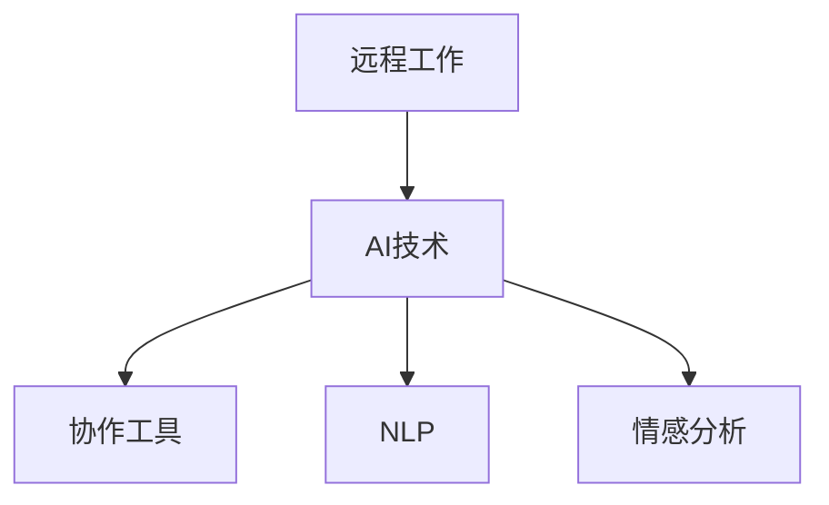

                 

# AI在远程工作中的应用：增强团队协作

在疫情持续影响下，远程工作成为各行各业的重要选择。传统面对面沟通方式被数字化替代，线上协作工具成为支持团队高效合作的关键。AI技术在远程工作中的深度应用，为团队协作注入了新的活力，极大提升了工作效率和团队满意度。本文将系统探讨AI技术在远程工作中的应用场景、原理、操作流程及未来展望，为构建智能化的远程工作平台提供参考。

## 1. 背景介绍

### 1.1 问题由来
随着全球化发展和互联网技术的进步，远程工作模式越来越流行。然而，在远程工作环境中，由于缺乏面对面交流，团队协作面临诸多挑战，如沟通效率低下、信息不对称、协作流程复杂等。AI技术通过提供智能化的协作工具和平台，帮助远程团队克服这些难题，提升整体工作效率和团队协作质量。

### 1.2 问题核心关键点
AI在远程工作中的应用主要体现在以下几个方面：
1. **智能沟通工具**：如聊天机器人、语音助手等，自动解答常见问题，提升沟通效率。
2. **协作分析工具**：如项目跟踪系统、时间管理工具等，实时监控项目进展，优化团队资源配置。
3. **智能文档处理**：如自然语言处理(NLP)技术，自动生成报告、摘要等，减轻人工负担。
4. **情感分析**：通过分析团队成员的情感状态，优化团队氛围，提升协作满意度。

### 1.3 问题研究意义
AI在远程工作中的应用，不仅提升了远程团队的工作效率，还增强了团队的协作精神和凝聚力。通过AI技术的辅助，远程团队能够更加高效地完成任务，同时减少因缺乏面对面交流带来的误解和冲突。这对于促进全球协作、推动远程工作的普及和深入具有重要意义。

## 2. 核心概念与联系

### 2.1 核心概念概述

为更好地理解AI在远程工作中的应用，本文将介绍几个核心概念：

- **远程工作(Remote Work)**：一种员工不固定办公地点，主要通过互联网和相关工具与公司进行协作的工作模式。
- **AI（人工智能）**：通过模拟人类智能行为，实现机器自主决策、感知、学习等功能的计算机技术。
- **协作工具**：用于远程团队沟通、任务管理、文档处理等协作功能的软件和平台。
- **自然语言处理(NLP)**：研究如何让计算机理解、处理和生成人类语言的技术。
- **情感分析**：通过机器学习算法，识别和分析文本、语音中的情感信息，辅助团队管理。

这些核心概念之间的逻辑关系可以通过以下Mermaid流程图来展示：



这个流程图展示了一组概念的联系：
- 远程工作依托于AI技术，借助协作工具进行高效沟通和任务管理。
- 协作工具中广泛应用了NLP技术，如聊天机器人、智能助手等。
- 情感分析作为AI应用的一部分，用于提升远程团队的协作氛围。

## 3. 核心算法原理 & 具体操作步骤
### 3.1 算法原理概述

AI在远程工作中的应用，主要通过以下算法原理实现：

- **智能沟通算法**：利用自然语言处理(NLP)技术，实现自动问答、文本理解等功能。
- **协作管理算法**：通过机器学习算法，优化资源配置、任务分配等协作流程。
- **文档处理算法**：基于文本摘要、自动生成报告等技术，减轻人工负担。
- **情感分析算法**：通过情感识别技术，实时监控团队情绪，提升协作质量。

这些算法原理在实际应用中，通过深度学习、强化学习、迁移学习等多种技术手段进行实现。

### 3.2 算法步骤详解

AI在远程工作中的应用，主要包括以下几个关键步骤：

**Step 1: 数据收集与预处理**
- 收集远程团队的沟通记录、任务数据、文档资料等，用于训练和测试AI模型。
- 对数据进行清洗、标注，并划分训练集和测试集。

**Step 2: 模型训练**
- 选择适合的AI模型架构，如Transformer、BERT等，进行参数初始化。
- 利用标注数据进行模型训练，优化模型参数。
- 在测试集上评估模型性能，选择最优模型。

**Step 3: 模型部署**
- 将训练好的AI模型部署到远程工作协作平台。
- 集成API接口，使得其他应用系统能够调用AI功能。
- 进行用户界面设计，提供友好的交互体验。

**Step 4: 持续优化**
- 实时监控模型性能，根据用户反馈进行参数调整和优化。
- 定期更新模型，适应新的数据分布和任务需求。
- 引入更多用户数据，进一步提升模型效果。

### 3.3 算法优缺点

AI在远程工作中的应用，具有以下优点：
1. **高效协作**：通过自动化处理一些常见任务，减轻人工负担，提升协作效率。
2. **实时监控**：利用AI技术实时监控项目进展和团队情绪，优化团队资源配置。
3. **智能决策**：基于数据分析和机器学习，辅助团队做出更合理的决策。

同时，这些技术也存在一些局限性：
1. **依赖数据质量**：模型性能很大程度上取决于数据质量，数据收集和标注需要耗费较多时间和人力。
2. **模型复杂性**：AI模型的构建和维护需要较高技术水平，开发和部署成本较高。
3. **隐私和安全性**：远程协作涉及大量敏感数据，数据隐私和安全保护成为重要挑战。
4. **人机交互**：AI系统难以完全替代人工，仍需要人工介入和监督。

### 3.4 算法应用领域

AI在远程工作中的应用，涵盖了多个领域，包括但不限于：

- **智能聊天机器人**：如Slack的Bot功能，自动解答常见问题，提升团队沟通效率。
- **协作项目管理**：如Trello、Asana等，利用AI优化任务分配和进度监控。
- **智能文档生成**：如Google Docs的智能建议功能，辅助文档编写和格式调整。
- **情感监控系统**：如Hootsuite的情感分析工具，实时监控团队情绪，提升协作氛围。

## 4. 数学模型和公式 & 详细讲解 & 举例说明
### 4.1 数学模型构建

AI在远程工作中的应用，涉及多个数学模型。以下以智能聊天机器人的文本理解为例，介绍其数学模型构建：

- **输入**：远程团队沟通的文本数据。
- **输出**：理解文本含义并自动生成回答。
- **模型**：基于Transformer的Seq2Seq模型。

### 4.2 公式推导过程

假设输入序列为$X$，输出序列为$Y$，则Seq2Seq模型的目标是最小化损失函数：

$$
\mathcal{L} = -\frac{1}{N}\sum_{i=1}^N \sum_{j=1}^m \log P(y_j|x_i,y_{<j})
$$

其中$P(y_j|x_i,y_{<j})$为在已知部分输出$y_{<j}$的情况下，生成下一个输出$y_j$的概率。

通过反向传播算法，可以计算梯度并进行参数更新，优化模型参数。

### 4.3 案例分析与讲解

以智能聊天机器人为例，分析其实际应用中的数学模型和公式：

**数据准备**：收集远程团队的历史聊天记录，标注出问题和回答，构建数据集。

**模型构建**：使用Transformer模型，添加编码器和解码器，并引入注意力机制。

**训练过程**：利用标注数据训练模型，优化模型参数。

**测试评估**：在测试集上评估模型性能，选择最优模型进行部署。

## 5. 项目实践：代码实例和详细解释说明
### 5.1 开发环境搭建

要进行AI在远程工作中的应用项目实践，首先需要搭建开发环境。以下是使用Python进行开发的环境配置流程：

1. 安装Python：从官网下载并安装Python，推荐使用3.8及以上版本。
2. 创建虚拟环境：
   ```bash
   python -m venv myenv
   source myenv/bin/activate
   ```
3. 安装相关库：
   ```bash
   pip install torch torchvision transformers sklearn
   ```

### 5.2 源代码详细实现

以下是一个基于Transformer的智能聊天机器人的Python代码实现，包括模型加载、数据预处理、模型训练和测试等功能：

```python
import torch
from transformers import BertTokenizer, BertForMaskedLM

# 加载数据集和分词器
tokenizer = BertTokenizer.from_pretrained('bert-base-uncased')
train_data = ...
train_labels = ...

# 加载预训练模型
model = BertForMaskedLM.from_pretrained('bert-base-uncased')

# 数据预处理
input_ids = tokenizer(train_data, padding=True, truncation=True, return_tensors='pt')['input_ids']
attention_mask = tokenizer(train_data, padding=True, truncation=True, return_tensors='pt')['attention_mask']

# 训练模型
optimizer = torch.optim.Adam(model.parameters(), lr=2e-5)
for epoch in range(epochs):
    model.train()
    optimizer.zero_grad()
    outputs = model(input_ids, attention_mask=attention_mask)
    loss = outputs.loss
    loss.backward()
    optimizer.step()
    print(f'Epoch {epoch+1}, loss: {loss.item()}')

# 测试模型
test_data = ...
test_labels = ...
model.eval()
with torch.no_grad():
    input_ids = tokenizer(test_data, padding=True, truncation=True, return_tensors='pt')['input_ids']
    attention_mask = tokenizer(test_data, padding=True, truncation=True, return_tensors='pt')['attention_mask']
    outputs = model(input_ids, attention_mask=attention_mask)
    print(f'Test loss: {outputs.loss.item()}')
```

### 5.3 代码解读与分析

让我们再详细解读一下关键代码的实现细节：

**数据预处理**：
- `tokenizer`用于将输入文本转换为模型可接受的形式，并添加必要的padding和truncation。

**模型训练**：
- `BertForMaskedLM`模型用于自动问答任务。
- 使用Adam优化器进行参数更新，并循环迭代训练多个epoch。

**模型测试**：
- 在测试集上评估模型性能，输出测试集的损失。

## 6. 实际应用场景

### 6.1 智能聊天机器人

智能聊天机器人在远程工作中的应用最为广泛。通过与远程团队成员实时互动，聊天机器人能够自动解答常见问题，提升沟通效率。以下是一个实际应用案例：

**场景**：远程团队协作过程中，成员经常需要查阅公司政策、工作流程等信息。传统的解决方法是人工搜索文档，效率低下。

**方案**：部署基于BERT的智能聊天机器人，自动回答常见问题，减轻人工负担。

**效果**：通过智能聊天机器人，远程团队能够实时获取所需信息，沟通效率显著提升。

### 6.2 协作项目管理

项目管理是远程工作的另一个重要环节。AI技术可以通过自动化工具优化项目流程，提高协作效率。以下是一个实际应用案例：

**场景**：远程团队需要进行复杂项目开发，每个成员的任务分工不明确，项目进度难以监控。

**方案**：使用AI驱动的项目管理工具，如Asana，自动优化任务分配和进度监控。

**效果**：AI技术能够自动分析项目进展，优化资源配置，确保项目按时完成。

### 6.3 智能文档生成

在远程工作环境中，文档编写和生成是常见任务。AI技术可以通过自动化生成工具，减轻人工负担。以下是一个实际应用案例：

**场景**：远程团队需要编写技术文档、客户报告等复杂文档，耗时耗力。

**方案**：使用AI驱动的文档生成工具，如GPT-3，自动生成文档框架和内容。

**效果**：AI技术能够快速生成高质量文档，减轻人工负担，提升文档生成效率。

### 6.4 未来应用展望

未来，AI在远程工作中的应用将更加广泛和深入。以下是对未来发展趋势的展望：

1. **多模态协作工具**：结合文本、图像、视频等多种信息，构建更加全面的协作工具。
2. **情感智能分析**：利用情感分析技术，实时监控团队情绪，优化协作氛围。
3. **个性化协作推荐**：通过AI技术，提供个性化的协作推荐，提升团队效率。
4. **实时数据分析**：利用大数据和AI技术，实时分析团队协作数据，优化协作流程。
5. **智能决策支持**：基于数据分析和机器学习，辅助团队做出更合理的决策。

## 7. 工具和资源推荐
### 7.1 学习资源推荐

为了帮助开发者系统掌握AI在远程工作中的应用，这里推荐一些优质的学习资源：

1. **TensorFlow官方文档**：详细介绍了TensorFlow在AI中的应用，包括自然语言处理、图像处理等领域。
2. **PyTorch官方文档**：介绍了PyTorch在深度学习中的应用，包括模型的构建和训练等。
3. **自然语言处理课程**：如斯坦福大学CS224N课程，系统讲解了NLP技术的应用和实现。
4. **情感分析论文**：如《Sentiment Analysis Using Word Embeddings》，深入介绍了情感分析的技术细节和应用。
5. **协作工具教程**：如Asana、Trello等项目管理工具的官方文档和用户手册。

通过对这些资源的学习实践，相信你一定能够快速掌握AI在远程工作中的应用，并用于解决实际的远程协作问题。

### 7.2 开发工具推荐

高效的开发离不开优秀的工具支持。以下是几款用于AI在远程工作中的应用开发的常用工具：

1. **Python**：简洁易用的编程语言，适合快速迭代研究。
2. **TensorFlow**：由Google主导开发的深度学习框架，生产部署方便。
3. **PyTorch**：灵活动态的深度学习框架，适合快速实验和研究。
4. **Transformers库**：HuggingFace开发的NLP工具库，集成了多个SOTA语言模型。
5. **Jupyter Notebook**：交互式的开发环境，支持实时调试和展示。

合理利用这些工具，可以显著提升AI在远程工作中的应用开发效率，加快创新迭代的步伐。

### 7.3 相关论文推荐

AI在远程工作中的应用源于学界的持续研究。以下是几篇奠基性的相关论文，推荐阅读：

1. **Attention is All You Need**：提出了Transformer结构，开启了NLP领域的预训练大模型时代。
2. **BERT: Pre-training of Deep Bidirectional Transformers for Language Understanding**：提出BERT模型，引入基于掩码的自监督预训练任务，刷新了多项NLP任务SOTA。
3. **Google BERT in Industrial Use Cases**：介绍了BERT模型在实际应用中的表现和优化策略。
4. **DeepSparse: Adaptive Scaling for Deep Learning**：提出了深度稀疏性优化技术，提升了模型推理速度和内存占用。
5. **Adversarial Examples in the Physical World**：探讨了AI模型的鲁棒性和安全性问题，对远程工作中的数据隐私和安全有重要参考价值。

这些论文代表了大语言模型微调技术的发展脉络。通过学习这些前沿成果，可以帮助研究者把握学科前进方向，激发更多的创新灵感。

## 8. 总结：未来发展趋势与挑战
### 8.1 总结

本文对AI在远程工作中的应用进行了全面系统的介绍。首先阐述了AI技术在远程工作中的研究背景和意义，明确了AI技术在提升远程团队协作效率、优化项目管理、减轻人工负担等方面的独特价值。其次，从原理到实践，详细讲解了AI在远程工作中的数学模型和核心算法，给出了完整的项目实践代码实现。同时，本文还广泛探讨了AI技术在多个行业领域的应用前景，展示了AI技术在远程工作中的广泛应用潜力。

通过本文的系统梳理，可以看到，AI技术在远程工作中的应用，为团队协作注入了新的活力，显著提升了工作效率和团队满意度。未来，随着AI技术的不断演进，AI在远程工作中的应用前景将更加广阔，成为推动远程工作模式普及和深入的重要驱动力。

### 8.2 未来发展趋势

展望未来，AI在远程工作中的应用将呈现以下几个发展趋势：

1. **智能协作平台**：结合AI技术，构建更加智能化的远程协作平台，提升团队沟通效率和协作质量。
2. **多模态融合**：结合文本、图像、视频等多种信息，构建更加全面的协作工具。
3. **实时数据分析**：利用大数据和AI技术，实时分析团队协作数据，优化协作流程。
4. **情感智能分析**：利用情感分析技术，实时监控团队情绪，优化协作氛围。
5. **个性化协作推荐**：通过AI技术，提供个性化的协作推荐，提升团队效率。
6. **智能决策支持**：基于数据分析和机器学习，辅助团队做出更合理的决策。

这些趋势凸显了AI在远程工作中的应用前景。这些方向的探索发展，必将进一步提升AI在远程工作中的应用效果，为构建智能化的远程工作平台提供更多的可能性。

### 8.3 面临的挑战

尽管AI在远程工作中的应用已经取得了显著成效，但在迈向更加智能化、普适化应用的过程中，仍面临诸多挑战：

1. **数据质量问题**：AI模型的性能很大程度上取决于数据质量，数据收集和标注需要耗费较多时间和人力。
2. **模型复杂性**：AI模型的构建和维护需要较高技术水平，开发和部署成本较高。
3. **隐私和安全性**：远程协作涉及大量敏感数据，数据隐私和安全保护成为重要挑战。
4. **人机交互**：AI系统难以完全替代人工，仍需要人工介入和监督。
5. **跨模态融合**：将文本、图像、视频等多种信息进行融合，实现全面协同协作，仍面临技术挑战。

这些挑战需要在技术、管理和伦理等多个维度进行综合应对，才能使AI在远程工作中的应用更加成熟和可靠。

### 8.4 研究展望

面对AI在远程工作中的应用面临的挑战，未来的研究需要在以下几个方面寻求新的突破：

1. **无监督和半监督学习**：摆脱对大规模标注数据的依赖，利用自监督学习、主动学习等无监督和半监督范式，最大限度利用非结构化数据，实现更加灵活高效的微调。
2. **参数高效和计算高效的微调方法**：开发更加参数高效的微调方法，在固定大部分预训练参数的同时，只更新极少量的任务相关参数。同时优化微调模型的计算图，减少前向传播和反向传播的资源消耗，实现更加轻量级、实时性的部署。
3. **情感分析与认知计算结合**：将情感分析与认知计算结合，增强模型的情感理解和决策能力，提升协作质量。
4. **跨模态协同建模**：将文本、图像、视频等多种信息进行融合，实现全面协同协作，提升团队协作效果。
5. **安全性和伦理导向**：在模型训练目标中引入伦理导向的评估指标，过滤和惩罚有偏见、有害的输出倾向，确保AI系统符合伦理要求。

这些研究方向的探索，必将引领AI在远程工作中的应用走向更高的台阶，为构建安全、可靠、可解释、可控的智能系统铺平道路。面向未来，AI在远程工作中的应用还需要与其他AI技术进行更深入的融合，如知识表示、因果推理、强化学习等，多路径协同发力，共同推动远程工作模式的进步。只有勇于创新、敢于突破，才能不断拓展AI在远程工作中的应用边界，让智能技术更好地造福人类社会。

## 9. 附录：常见问题与解答

**Q1：AI在远程工作中的应用是否适用于所有团队？**

A: AI在远程工作中的应用，并非适用于所有团队。AI的应用效果很大程度上取决于团队的协作模式和数据量。对于高度协作且数据量充足的团队，AI技术能够显著提升工作效率和协作质量。但对于数据量不足或协作需求较少的团队，AI技术的应用效果可能不明显。

**Q2：如何选择合适的AI模型？**

A: 选择合适的AI模型需要考虑以下几个因素：
1. 任务的复杂度：对于简单任务，如自动问答，可以使用轻量级的预训练模型。对于复杂任务，如情感分析，需要使用大模型进行微调。
2. 数据规模：数据量较大的任务，可以选择大模型进行微调。数据量较小的任务，可以使用小模型或参数高效微调方法。
3. 应用场景：不同的应用场景对AI模型的性能和特性有不同的要求，需要根据具体场景进行选择。

**Q3：AI在远程工作中的应用是否会替代人工？**

A: AI技术虽然能够自动处理一些常见任务，减轻人工负担，但在团队协作中，AI仍然需要人工的监督和介入。AI系统无法完全替代人工，尤其是在复杂决策和高风险任务中，仍需要人工参与。

**Q4：AI在远程工作中的应用是否存在隐私和安全问题？**

A: AI在远程工作中的应用，涉及大量敏感数据，数据隐私和安全保护是一个重要问题。需要采取措施，如数据加密、访问控制等，确保数据的安全性。同时，需要对AI系统的决策过程进行监控和审计，确保其符合伦理要求。

**Q5：如何评估AI在远程工作中的应用效果？**

A: 评估AI在远程工作中的应用效果，可以从以下几个方面进行：
1. 沟通效率：通过统计聊天机器人的回答准确率和响应时间，评估沟通效率。
2. 协作效果：通过监控协作工具的使用率和团队反馈，评估协作效果。
3. 工作效率：通过分析自动化工具的应用效果和任务完成时间，评估工作效率。

这些评估指标可以帮助团队更好地了解AI技术的应用效果，并进行优化和改进。

---

作者：禅与计算机程序设计艺术 / Zen and the Art of Computer Programming

