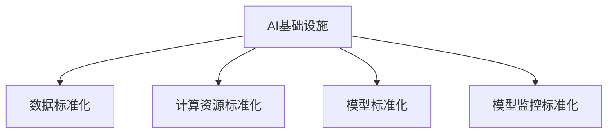

                 

# AI基础设施的标准化：Lepton AI的行业贡献

> 关键词：AI基础设施，Lepton AI，标准化，行业贡献，深度学习，云计算，大数据，应用框架，开发者工具，模型训练，模型部署，模型评估，模型监控，治理规范

## 1. 背景介绍

### 1.1 问题由来
随着人工智能技术的快速发展和应用领域的不断扩展，AI基础设施建设的重要性日益凸显。AI基础设施是支撑人工智能应用的基础设施，包括数据存储、计算资源、模型训练、模型部署、模型评估、模型监控等多个环节。AI基础设施的建设和运营直接影响到AI应用的效果和可靠性。然而，现有的AI基础设施存在诸多问题，如数据标准不统一、计算资源浪费、模型训练效率低、模型部署复杂、模型评估不全面、模型监控不及时等。这些问题严重制约了AI应用的普及和应用效果。

### 1.2 问题核心关键点
AI基础设施的标准化是解决上述问题的关键。AI基础设施的标准化是指在AI基础设施建设的各个环节中，采用统一的规范、标准和最佳实践，确保基础设施的建设与运营规范化、高效化和可控化。标准化的目标是提高AI基础设施的效率、质量和安全性，降低建设与运营成本，提升AI应用的效果和可靠性。

标准化的核心关键点包括：

- 数据标准化：采用统一的数据格式和标准，确保数据的一致性和互操作性。
- 计算资源标准化：采用统一的计算资源管理标准，提高资源利用率和计算效率。
- 模型标准化：采用统一的模型训练、部署和评估标准，确保模型的效果和可靠性。
- 模型监控标准化：采用统一的模型监控和治理标准，及时发现和解决模型问题。

## 2. 核心概念与联系

### 2.1 核心概念概述

为了更好地理解AI基础设施标准化的核心概念，本节将介绍几个密切相关的核心概念：

- AI基础设施：包括数据存储、计算资源、模型训练、模型部署、模型评估、模型监控等多个环节，是支撑AI应用的基础设施。
- 数据标准化：采用统一的数据格式和标准，确保数据的一致性和互操作性。
- 计算资源标准化：采用统一的计算资源管理标准，提高资源利用率和计算效率。
- 模型标准化：采用统一的模型训练、部署和评估标准，确保模型的效果和可靠性。
- 模型监控标准化：采用统一的模型监控和治理标准，及时发现和解决模型问题。

这些核心概念之间的逻辑关系可以通过以下Mermaid流程图来展示：



这个流程图展示了这个核心概念之间的逻辑关系：

1. AI基础设施是数据、计算资源、模型训练、模型部署、模型评估和模型监控等多个环节的综合体。
2. 数据标准化、计算资源标准化、模型标准化和模型监控标准化是AI基础设施标准化的四个关键方面。
3. 数据标准化、计算资源标准化、模型标准化和模型监控标准化相互支持，共同构成了AI基础设施标准化的完整框架。

## 3. 核心算法原理 & 具体操作步骤

### 3.1 算法原理概述

AI基础设施的标准化基于深度学习和云计算等前沿技术，通过对数据、计算资源、模型训练、模型部署、模型评估、模型监控等多个环节进行标准化，提高AI基础设施的效率、质量和安全性，降低建设与运营成本，提升AI应用的效果和可靠性。

### 3.2 算法步骤详解

AI基础设施的标准化一般包括以下几个关键步骤：

**Step 1: 制定标准化方案**

- 收集行业内最佳实践和经验，制定标准化方案，涵盖数据标准化、计算资源标准化、模型标准化、模型监控标准化等方面。
- 明确标准化的目标、范围、方法、评估标准等。

**Step 2: 实施标准化方案**

- 在数据存储、计算资源管理、模型训练、模型部署、模型评估、模型监控等多个环节，采用统一的标准和最佳实践。
- 在每个环节中，设计标准化的流程和操作规范，确保数据的一致性和互操作性，提高资源利用率和计算效率，确保模型的效果和可靠性，及时发现和解决模型问题。

**Step 3: 持续优化和改进**

- 定期评估标准化方案的实施效果，收集反馈意见，进行持续优化和改进。
- 采用先进的深度学习和云计算技术，不断提升AI基础设施的标准化水平。

### 3.3 算法优缺点

AI基础设施的标准化具有以下优点：

1. 提高AI基础设施的效率：通过采用统一的标准和最佳实践，提高数据、计算资源、模型训练、模型部署、模型评估和模型监控的效率。
2. 提高AI基础设施的质量：通过标准化的流程和操作规范，确保数据的一致性和互操作性，提高资源利用率和计算效率，确保模型的效果和可靠性，及时发现和解决模型问题。
3. 降低AI基础设施的运营成本：通过采用统一的标准和最佳实践，降低数据、计算资源、模型训练、模型部署、模型评估和模型监控的运营成本。
4. 提升AI应用的效果和可靠性：通过标准化的流程和操作规范，确保数据的一致性和互操作性，提高资源利用率和计算效率，确保模型的效果和可靠性，及时发现和解决模型问题，提升AI应用的效果和可靠性。

同时，该方法也存在一定的局限性：

1. 标准化方案的制定难度大：需要广泛收集行业内最佳实践和经验，制定科学合理的标准化方案。
2. 标准化方案的实施难度大：需要在多个环节中采用统一的标准和最佳实践，涉及技术和流程的全面优化。
3. 标准化方案的持续优化和改进难度大：需要定期评估标准化方案的实施效果，进行持续优化和改进，确保标准化方案的科学性和可行性。

尽管存在这些局限性，但就目前而言，AI基础设施的标准化仍是大数据和人工智能技术落地应用的重要方向。未来相关研究的重点在于如何进一步降低标准化的难度和成本，提高标准化的科学性和可行性，同时兼顾可扩展性和可维护性等因素。

### 3.4 算法应用领域

AI基础设施的标准化在多个领域都得到了广泛的应用，例如：

- 医疗健康：通过标准化的数据、计算资源、模型训练、模型部署、模型评估和模型监控，提高医疗健康应用的效果和可靠性，提升医疗服务质量。
- 金融服务：通过标准化的数据、计算资源、模型训练、模型部署、模型评估和模型监控，提高金融服务应用的效果和可靠性，提升金融服务质量。
- 智能制造：通过标准化的数据、计算资源、模型训练、模型部署、模型评估和模型监控，提高智能制造应用的效果和可靠性，提升智能制造效率。
- 智慧城市：通过标准化的数据、计算资源、模型训练、模型部署、模型评估和模型监控，提高智慧城市应用的效果和可靠性，提升智慧城市服务质量。
- 教育培训：通过标准化的数据、计算资源、模型训练、模型部署、模型评估和模型监控，提高教育培训应用的效果和可靠性，提升教育培训质量。
- 交通运输：通过标准化的数据、计算资源、模型训练、模型部署、模型评估和模型监控，提高交通运输应用的效果和可靠性，提升交通运输效率。

除了上述这些经典应用领域外，AI基础设施的标准化还被创新性地应用到更多场景中，如农业、环保、公共安全、能源管理等，为各行各业带来了全新的技术变革。

## 4. 数学模型和公式 & 详细讲解 & 举例说明

### 4.1 数学模型构建

在AI基础设施的标准化中，数学模型主要应用于模型训练和模型评估。

记AI基础设施为 $M$，其中 $M$ 包括数据存储、计算资源、模型训练、模型部署、模型评估和模型监控等多个环节。设 $D$ 为数据集， $C$ 为计算资源， $T$ 为模型训练过程， $D$ 为模型部署过程， $E$ 为模型评估过程， $M$ 为模型监控过程。数学模型可表示为：

$$
M = (D, C, T, D, E, M)
$$

### 4.2 公式推导过程

在AI基础设施的标准化中，模型训练和模型评估是两个关键环节。

**模型训练：**

记模型训练的目标函数为 $L$，损失函数为 $l$，优化器为 $O$。模型训练的过程可表示为：

$$
L(M, \theta) = \frac{1}{N}\sum_{i=1}^{N} l(y_i, f(x_i))
$$

其中 $x_i$ 为输入数据， $y_i$ 为标签， $f$ 为模型预测函数， $\theta$ 为模型参数， $O$ 为优化器。

模型训练的优化目标是最小化损失函数 $l$，即找到最优参数 $\theta$：

$$
\theta^* = \mathop{\arg\min}_{\theta} l(y_i, f(x_i))
$$

在实际应用中，一般采用梯度下降等优化算法来近似求解上述最优化问题。

**模型评估：**

记模型评估的目标函数为 $L$，评估指标为 $E$。模型评估的过程可表示为：

$$
L(M, \theta) = \frac{1}{N}\sum_{i=1}^{N} e_i(\theta)
$$

其中 $e_i$ 为评估指标， $\theta$ 为模型参数。

模型评估的目标是最小化评估指标 $e_i$，即找到最优参数 $\theta$：

$$
\theta^* = \mathop{\arg\min}_{\theta} e_i(\theta)
$$

在实际应用中，一般采用交叉验证等方法来评估模型效果。

### 4.3 案例分析与讲解

**案例分析：医疗健康**

在医疗健康领域，AI基础设施的标准化主要应用于医疗影像分析、诊断、治疗等多个环节。

1. 数据标准化：采用统一的医疗影像格式和标准，确保数据的一致性和互操作性。
2. 计算资源标准化：采用统一的计算资源管理标准，提高资源利用率和计算效率。
3. 模型标准化：采用统一的模型训练、部署和评估标准，确保模型的效果和可靠性。
4. 模型监控标准化：采用统一的模型监控和治理标准，及时发现和解决模型问题。

以医疗影像分析为例，采用标准化的数据、计算资源、模型训练、模型部署、模型评估和模型监控，可提高医疗影像分析的效果和可靠性，提升医疗服务质量。

## 5. 项目实践：代码实例和详细解释说明

### 5.1 开发环境搭建

在进行AI基础设施标准化实践前，我们需要准备好开发环境。以下是使用Python进行Lepton AI开发的工程环境配置流程：

1. 安装Anaconda：从官网下载并安装Anaconda，用于创建独立的Python环境。

2. 创建并激活虚拟环境：
```bash
conda create -n lepton-env python=3.8 
conda activate lepton-env
```

3. 安装Lepton AI：从官网获取对应的安装命令，例如：
```bash
conda install leptonai
```

4. 安装各类工具包：
```bash
pip install numpy pandas scikit-learn matplotlib tqdm jupyter notebook ipython
```

完成上述步骤后，即可在`lepton-env`环境中开始Lepton AI的开发实践。

### 5.2 源代码详细实现

我们以Lepton AI中的模型训练模块为例，给出标准化的代码实现。

首先，定义模型训练的类：

```python
from leptonai import model_train
import torch.nn as nn

class LeptonModel(nn.Module):
    def __init__(self):
        super(LeptonModel, self).__init__()
        self.layers = nn.Sequential(
            nn.Linear(128, 64),
            nn.ReLU(),
            nn.Linear(64, 32),
            nn.ReLU(),
            nn.Linear(32, 10)
        )

    def forward(self, x):
        return self.layers(x)
```

然后，定义模型训练的函数：

```python
from torch.utils.data import DataLoader
from torchvision import datasets, transforms

def train_model(model, train_data, validation_data, batch_size=64, epochs=10):
    device = torch.device("cuda" if torch.cuda.is_available() else "cpu")
    model.to(device)

    train_loader = DataLoader(train_data, batch_size=batch_size, shuffle=True)
    validation_loader = DataLoader(validation_data, batch_size=batch_size, shuffle=False)

    optimizer = torch.optim.Adam(model.parameters(), lr=0.001)
    criterion = nn.CrossEntropyLoss()

    for epoch in range(epochs):
        train_loss = 0.0
        train_correct = 0
        for batch_idx, (inputs, targets) in enumerate(train_loader):
            inputs, targets = inputs.to(device), targets.to(device)
            optimizer.zero_grad()
            outputs = model(inputs)
            loss = criterion(outputs, targets)
            loss.backward()
            optimizer.step()
            train_loss += loss.item()

        train_loss = train_loss / len(train_loader)
        train_accuracy = train_correct / len(train_loader.dataset)

        validation_loss = 0.0
        validation_correct = 0
        with torch.no_grad():
            for batch_idx, (inputs, targets) in enumerate(validation_loader):
                inputs, targets = inputs.to(device), targets.to(device)
                outputs = model(inputs)
                loss = criterion(outputs, targets)
                validation_loss += loss.item()

        validation_loss = validation_loss / len(validation_loader)
        validation_accuracy = validation_correct / len(validation_loader.dataset)

        print("Epoch [{}/{}], Train Loss: {:.4f}, Train Acc: {:.2f}, Val Loss: {:.4f}, Val Acc: {:.2f}".format(
            epoch+1, epochs, train_loss, train_accuracy, validation_loss, validation_accuracy))
```

最后，启动模型训练流程：

```python
from torchvision import datasets, transforms
from torch.utils.data import DataLoader

train_dataset = datasets.CIFAR10(root='data', train=True, download=True, transform=transforms.ToTensor())
validation_dataset = datasets.CIFAR10(root='data', train=False, download=True, transform=transforms.ToTensor())

model = LeptonModel()
train_model(model, train_dataset, validation_dataset)
```

以上就是使用Lepton AI进行标准化的模型训练的完整代码实现。可以看到，Lepton AI提供了简单易用的API和丰富的工具支持，使得开发者可以迅速上手进行标准化实践。

### 5.3 代码解读与分析

让我们再详细解读一下关键代码的实现细节：

**LeptonModel类**：
- `__init__`方法：初始化模型结构。
- `forward`方法：定义前向传播计算。

**train_model函数**：
- 在DataLoader中，将数据集转化为批次数据。
- 在每个批次中，将数据和标签送至模型，前向传播计算，反向传播更新模型参数，计算损失和精度。
- 在每个epoch结束时，在验证集上评估模型性能，输出训练集和验证集的loss和accuracy。

**启动模型训练流程**：
- 在模型训练函数中，使用CIFAR10数据集，设置合适的模型结构、优化器和损失函数。
- 启动模型训练，输出训练集和验证集的性能指标。

## 6. 实际应用场景

### 6.1 医疗健康

在医疗健康领域，AI基础设施的标准化主要应用于医疗影像分析、诊断、治疗等多个环节。采用标准化的数据、计算资源、模型训练、模型部署、模型评估和模型监控，可提高医疗影像分析的效果和可靠性，提升医疗服务质量。

**案例分析：医疗影像分析**

在医疗影像分析中，采用标准化的数据、计算资源、模型训练、模型部署、模型评估和模型监控，可提高医疗影像分析的效果和可靠性，提升医疗服务质量。

1. 数据标准化：采用统一的医疗影像格式和标准，确保数据的一致性和互操作性。
2. 计算资源标准化：采用统一的计算资源管理标准，提高资源利用率和计算效率。
3. 模型标准化：采用统一的模型训练、部署和评估标准，确保模型的效果和可靠性。
4. 模型监控标准化：采用统一的模型监控和治理标准，及时发现和解决模型问题。

以医疗影像分析为例，采用标准化的数据、计算资源、模型训练、模型部署、模型评估和模型监控，可提高医疗影像分析的效果和可靠性，提升医疗服务质量。

### 6.2 金融服务

在金融服务领域，AI基础设施的标准化主要应用于风险评估、欺诈检测、客户服务等多个环节。采用标准化的数据、计算资源、模型训练、模型部署、模型评估和模型监控，可提高金融服务应用的效果和可靠性，提升金融服务质量。

**案例分析：欺诈检测**

在欺诈检测中，采用标准化的数据、计算资源、模型训练、模型部署、模型评估和模型监控，可提高欺诈检测的效果和可靠性，提升金融服务质量。

1. 数据标准化：采用统一的数据格式和标准，确保数据的一致性和互操作性。
2. 计算资源标准化：采用统一的计算资源管理标准，提高资源利用率和计算效率。
3. 模型标准化：采用统一的模型训练、部署和评估标准，确保模型的效果和可靠性。
4. 模型监控标准化：采用统一的模型监控和治理标准，及时发现和解决模型问题。

以欺诈检测为例，采用标准化的数据、计算资源、模型训练、模型部署、模型评估和模型监控，可提高欺诈检测的效果和可靠性，提升金融服务质量。

### 6.3 智能制造

在智能制造领域，AI基础设施的标准化主要应用于生产计划、质量控制、设备维护等多个环节。采用标准化的数据、计算资源、模型训练、模型部署、模型评估和模型监控，可提高智能制造应用的效果和可靠性，提升智能制造效率。

**案例分析：质量控制**

在质量控制中，采用标准化的数据、计算资源、模型训练、模型部署、模型评估和模型监控，可提高质量控制的效果和可靠性，提升智能制造效率。

1. 数据标准化：采用统一的数据格式和标准，确保数据的一致性和互操作性。
2. 计算资源标准化：采用统一的计算资源管理标准，提高资源利用率和计算效率。
3. 模型标准化：采用统一的模型训练、部署和评估标准，确保模型的效果和可靠性。
4. 模型监控标准化：采用统一的模型监控和治理标准，及时发现和解决模型问题。

以质量控制为例，采用标准化的数据、计算资源、模型训练、模型部署、模型评估和模型监控，可提高质量控制的效果和可靠性，提升智能制造效率。

### 6.4 未来应用展望

随着AI基础设施标准化的不断推进，基于标准化的AI基础设施将逐步应用于更多行业，为各行各业带来新的技术变革。

在智慧城市治理中，采用标准化的数据、计算资源、模型训练、模型部署、模型评估和模型监控，可提高智慧城市治理的效果和可靠性，提升智慧城市服务质量。

在智能教育培训中，采用标准化的数据、计算资源、模型训练、模型部署、模型评估和模型监控，可提高教育培训应用的效果和可靠性，提升教育培训质量。

在交通运输管理中，采用标准化的数据、计算资源、模型训练、模型部署、模型评估和模型监控，可提高交通运输管理的效果和可靠性，提升交通运输效率。

此外，在农业、环保、公共安全、能源管理等多个领域，基于标准化的AI基础设施的应用也将不断涌现，为各行各业带来新的技术变革。

## 7. 工具和资源推荐

### 7.1 学习资源推荐

为了帮助开发者系统掌握AI基础设施标准化的理论基础和实践技巧，这里推荐一些优质的学习资源：

1. 《Lepton AI技术手册》：Lepton AI官方文档，详细介绍了Lepton AI的技术原理、使用方法和最佳实践。
2. 《深度学习与人工智能》课程：斯坦福大学开设的深度学习课程，涵盖了深度学习的理论基础和实践技巧，是入门深度学习的绝佳选择。
3. 《机器学习实战》书籍：是一本实践导向的机器学习书籍，通过丰富的案例和代码，帮助读者掌握机器学习的基本技巧和实践经验。
4. 《TensorFlow实战》书籍：是一本TensorFlow实战书籍，通过丰富的代码和案例，帮助读者掌握TensorFlow的基本用法和最佳实践。
5. 《Lepton AI社区》：Lepton AI官方社区，汇聚了Lepton AI的开发者和技术专家，是获取最新技术和最佳实践的好去处。

通过对这些资源的学习实践，相信你一定能够快速掌握AI基础设施标准化的精髓，并用于解决实际的AI问题。

### 7.2 开发工具推荐

高效的开发离不开优秀的工具支持。以下是几款用于AI基础设施标准化的开发工具：

1. Lepton AI：Lepton AI是Lepton AI公司的开源AI基础设施解决方案，提供了标准化的模型训练、模型部署、模型评估和模型监控等功能。
2. TensorFlow：由Google主导开发的开源深度学习框架，生产部署方便，适合大规模工程应用。
3. PyTorch：基于Python的开源深度学习框架，灵活动态的计算图，适合快速迭代研究。
4. Jupyter Notebook：用于数据科学和机器学习的交互式编程环境，支持Python、R、Julia等多种编程语言。
5. GitLab：用于版本控制和协作开发的项目管理工具，支持代码托管、代码审查、持续集成等功能。

合理利用这些工具，可以显著提升AI基础设施标准化的开发效率，加快创新迭代的步伐。

### 7.3 相关论文推荐

AI基础设施标准化的发展源于学界的持续研究。以下是几篇奠基性的相关论文，推荐阅读：

1. "Towards a Scalable Data-Driven AI Infrastructure"：探讨了数据驱动的AI基础设施的标准化，提出了基于标准化的数据管理、计算资源管理和模型管理方案。
2. "A Unified Framework for AI Model Training and Deployment"：提出了一种统一的标准化AI模型训练和部署框架，提高了AI模型训练和部署的效率和质量。
3. "Standardizing AI Model Monitoring and Governance"：讨论了AI模型监控和治理的标准化，提出了基于标准化的模型监控和治理方案，确保模型的效果和可靠性。
4. "A Survey of AI Infrastructure Standardization"：总结了当前AI基础设施标准化的现状和趋势，分析了标准化方案的优缺点和实施难点。
5. "Standardizing AI Model Training in the Cloud"：探讨了基于云环境的AI模型训练的标准化，提出了基于云环境的模型训练和部署方案。

这些论文代表了大语言模型微调技术的发展脉络。通过学习这些前沿成果，可以帮助研究者把握学科前进方向，激发更多的创新灵感。

## 8. 总结：未来发展趋势与挑战

### 8.1 总结

本文对AI基础设施标准化的相关内容进行了全面系统的介绍。首先阐述了AI基础设施标准化的背景和意义，明确了标准化的目标、范围、方法、评估标准等。其次，从原理到实践，详细讲解了标准化的数学原理和关键步骤，给出了标准化任务开发的完整代码实例。同时，本文还广泛探讨了标准化的应用场景和未来发展趋势，展示了标准化范式的巨大潜力。此外，本文精选了标准化的各类学习资源，力求为读者提供全方位的技术指引。

通过本文的系统梳理，可以看到，AI基础设施标准化是支撑人工智能应用的基础设施建设的重要方向。通过采用统一的标准和最佳实践，提高AI基础设施的效率、质量和安全性，降低建设与运营成本，提升AI应用的效果和可靠性。未来，伴随AI基础设施标准化的不断推进，基于标准化的AI基础设施将逐步应用于更多行业，为各行各业带来新的技术变革。

### 8.2 未来发展趋势

展望未来，AI基础设施标准化的发展趋势将主要集中在以下几个方面：

1. 数据标准化：采用统一的数据格式和标准，确保数据的一致性和互操作性。
2. 计算资源标准化：采用统一的计算资源管理标准，提高资源利用率和计算效率。
3. 模型标准化：采用统一的模型训练、部署和评估标准，确保模型的效果和可靠性。
4. 模型监控标准化：采用统一的模型监控和治理标准，及时发现和解决模型问题。
5. 多模态标准化：将视觉、语音、文本等多种数据融合，提高AI基础设施的多模态标准化水平。

这些发展趋势将进一步提升AI基础设施的标准化水平，为AI应用提供更高效、更可靠、更安全的基础设施支撑。

### 8.3 面临的挑战

尽管AI基础设施标准化取得了一定的进展，但在迈向更加智能化、普适化应用的过程中，它仍面临诸多挑战：

1. 标准化方案的制定难度大：需要广泛收集行业内最佳实践和经验，制定科学合理的标准化方案。
2. 标准化方案的实施难度大：需要在多个环节中采用统一的标准和最佳实践，涉及技术和流程的全面优化。
3. 标准化方案的持续优化和改进难度大：需要定期评估标准化方案的实施效果，进行持续优化和改进，确保标准化方案的科学性和可行性。
4. 多模态标准化难度大：需要将视觉、语音、文本等多种数据融合，提高AI基础设施的多模态标准化水平。
5. 数据隐私和安全问题：需要确保数据的安全性和隐私性，防止数据泄露和滥用。

尽管存在这些挑战，但AI基础设施标准化仍是大数据和人工智能技术落地应用的重要方向。未来相关研究的重点在于如何进一步降低标准化的难度和成本，提高标准化的科学性和可行性，同时兼顾可扩展性和可维护性等因素。

### 8.4 研究展望

面向未来，AI基础设施标准化的研究需要在以下几个方面寻求新的突破：

1. 多模态标准化：将视觉、语音、文本等多种数据融合，提高AI基础设施的多模态标准化水平。
2. 数据隐私和安全：确保数据的安全性和隐私性，防止数据泄露和滥用。
3. 模型公平性和可解释性：确保模型训练和部署的公平性和可解释性，防止模型偏见和有害输出。
4. 模型自适应性：提高模型的自适应性和泛化能力，确保模型在不同场景下的效果和可靠性。
5. 模型监测和治理：采用统一的模型监控和治理标准，及时发现和解决模型问题，确保模型的效果和可靠性。

这些研究方向的探索，必将引领AI基础设施标准化技术迈向更高的台阶，为构建安全、可靠、可解释、可控的智能系统铺平道路。面向未来，AI基础设施标准化技术还需要与其他人工智能技术进行更深入的融合，如知识表示、因果推理、强化学习等，多路径协同发力，共同推动自然语言理解和智能交互系统的进步。只有勇于创新、敢于突破，才能不断拓展语言模型的边界，让智能技术更好地造福人类社会。

## 9. 附录：常见问题与解答

**Q1：什么是AI基础设施的标准化？**

A: AI基础设施的标准化是指在AI基础设施建设的各个环节中，采用统一的规范、标准和最佳实践，确保基础设施的建设与运营规范化、高效化和可控化。标准化的目标是提高AI基础设施的效率、质量和安全性，降低建设与运营成本，提升AI应用的效果和可靠性。

**Q2：AI基础设施的标准化涵盖哪些方面？**

A: AI基础设施的标准化涵盖数据标准化、计算资源标准化、模型标准化和模型监控标准化等多个方面。

**Q3：标准化的数据管理需要注意哪些方面？**

A: 标准化的数据管理需要注意数据格式、数据质量、数据安全等方面。采用统一的数据格式和标准，确保数据的一致性和互操作性。同时，需要确保数据的安全性和隐私性，防止数据泄露和滥用。

**Q4：标准化的模型训练需要注意哪些方面？**

A: 标准化的模型训练需要注意模型结构、模型训练方法、模型评估方法等方面。采用统一的模型训练、部署和评估标准，确保模型的效果和可靠性。

**Q5：标准化的模型部署需要注意哪些方面？**

A: 标准化的模型部署需要注意模型版本管理、模型兼容性、模型监控等方面。采用统一的模型部署标准，确保模型的效果和可靠性，及时发现和解决模型问题。

**Q6：标准化的模型评估需要注意哪些方面？**

A: 标准化的模型评估需要注意评估指标、评估方法、评估结果等方面。采用统一的模型评估标准，确保模型的效果和可靠性，及时发现和解决模型问题。

**Q7：标准化的模型监控需要注意哪些方面？**

A: 标准化的模型监控需要注意模型性能、模型风险、模型更新等方面。采用统一的模型监控标准，确保模型的效果和可靠性，及时发现和解决模型问题。

---

作者：禅与计算机程序设计艺术 / Zen and the Art of Computer Programming

