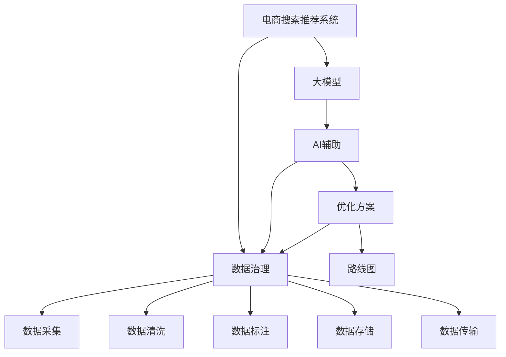

                 

# AI大模型助力电商搜索推荐业务的数据治理能力提升路线图优化方案

> 关键词：电商搜索推荐, 大模型, 数据治理, AI, 路线图, 优化方案

## 1. 背景介绍

### 1.1 问题由来

随着互联网和电子商务的迅猛发展，电商搜索推荐系统逐渐成为驱动消费者购买行为的关键技术。搜索推荐系统通过分析用户行为数据，精确匹配用户需求，显著提升用户购物体验和平台交易转化率。然而，随着平台业务规模的不断扩大，数据量呈爆炸式增长，数据治理面临着巨大挑战。

电商搜索推荐系统的数据治理，主要包括数据采集、数据清洗、数据标注、数据存储、数据传输等多个环节。数据采集环节涉及对原始数据进行去重、去噪、去冗余等预处理，保证数据的质量和一致性。数据清洗环节通过自动或人工的方式，去除数据中的异常值和噪声，保证数据的正确性。数据标注环节通过标注师对数据进行标注，为机器学习模型的训练提供监督信号。数据存储环节涉及对大规模数据进行高效存储和管理。数据传输环节涉及在分布式系统中的数据流转和同步。

当前，电商搜索推荐系统在数据治理中面临以下问题：

1. **数据质量参差不齐**：由于数据来源多样、采集渠道复杂，数据质量存在较大差异，影响模型训练的准确性和可靠性。
2. **标注成本高昂**：大规模数据标注需要大量人力和时间，难以满足实时数据处理的需求。
3. **存储效率低下**：大规模数据存储和管理存在效率低下、存储成本高昂等问题，影响系统性能。
4. **数据孤岛现象**：数据分散在不同系统、不同部门中，缺乏统一管理和共享机制，数据孤岛现象严重，难以形成全局视图。

### 1.2 问题核心关键点

电商搜索推荐系统的数据治理能力提升，是提升系统性能和用户体验的关键。核心关键点包括：

1. **数据质量提升**：通过数据清洗、去重、去噪等预处理手段，提升数据质量，保证模型训练的准确性。
2. **标注效率提升**：通过数据增强、半监督学习等技术，降低标注成本，提高标注效率。
3. **存储效率优化**：通过模型压缩、数据分区等方法，优化数据存储和传输效率，降低存储成本。
4. **数据融合与共享**：通过构建统一的数据管理平台，实现数据跨系统、跨部门的融合和共享，提升数据治理能力。

### 1.3 问题研究意义

电商搜索推荐系统的数据治理能力提升，对于提升平台的用户体验、增加交易转化率、降低运营成本具有重要意义：

1. **提升用户体验**：高质量的数据能够有效提升模型的预测准确性，提高推荐结果的相关性和个性化程度，增强用户满意度。
2. **增加交易转化率**：精准匹配用户需求，减少用户选择和搜索成本，增加用户购买意愿，提升交易转化率。
3. **降低运营成本**：通过优化数据存储和传输效率，减少数据处理和存储成本，提升系统性能和运营效率。
4. **增强数据洞察能力**：构建统一的数据管理平台，整合跨系统、跨部门的数据，提供全面的数据洞察，为业务决策提供有力支撑。

## 2. 核心概念与联系

### 2.1 核心概念概述

为更好地理解AI大模型在电商搜索推荐业务中的数据治理能力提升，本节将介绍几个密切相关的核心概念：

- **电商搜索推荐系统**：通过分析用户行为数据，匹配用户需求，向用户推荐商品或服务的系统。
- **大模型**：如GPT-3、BERT等基于Transformer架构的深度学习模型，通过大规模预训练，具备强大的语言理解和生成能力。
- **数据治理**：对数据进行采集、清洗、标注、存储、传输等环节的管理和优化，提升数据质量和使用效率。
- **AI辅助**：利用AI技术，如自动标注、数据增强、模型压缩等手段，提升数据治理效率。
- **路线图**：为实现电商搜索推荐系统数据治理能力提升的详细计划和步骤。
- **优化方案**：具体的方法和技术手段，用于提升电商搜索推荐系统的数据治理能力。

这些核心概念之间的逻辑关系可以通过以下Mermaid流程图来展示：



这个流程图展示了大模型和AI辅助在电商搜索推荐系统的数据治理中的角色和作用，以及优化方案和路线图对于数据治理的指导和优化意义。

## 3. 核心算法原理 & 具体操作步骤
### 3.1 算法原理概述

AI大模型在电商搜索推荐业务的数据治理能力提升中，主要通过以下原理实现：

1. **数据清洗**：通过大模型对数据进行自动清洗，识别和去除数据中的异常值和噪声，保证数据的质量和一致性。
2. **数据标注**：利用大模型对数据进行自动标注，减少标注成本，提高标注效率。
3. **数据增强**：通过大模型生成更多的标注数据，提升数据多样性，增强模型的泛化能力。
4. **模型压缩**：利用大模型对数据进行模型压缩，优化数据存储和传输效率，降低存储成本。
5. **跨系统数据融合**：通过大模型对跨系统数据进行联合建模，实现数据的融合和共享，提升数据治理能力。

### 3.2 算法步骤详解

基于AI大模型的电商搜索推荐系统数据治理能力提升，主要包括以下几个关键步骤：

**Step 1: 数据清洗**
- 收集电商搜索推荐系统中的原始数据，包括用户行为数据、商品信息数据、交易数据等。
- 利用大模型对数据进行自动清洗，去除数据中的异常值和噪声，保证数据的质量和一致性。

**Step 2: 数据标注**
- 利用大模型对数据进行自动标注，减少标注成本，提高标注效率。
- 对于无法自动标注的数据，通过人工标注进行补充和校正。

**Step 3: 数据增强**
- 利用大模型生成更多的标注数据，提升数据多样性，增强模型的泛化能力。
- 通过数据增强技术，如回译、近义替换等，丰富训练集，提升模型性能。

**Step 4: 数据存储**
- 利用大模型对数据进行模型压缩，优化数据存储和传输效率，降低存储成本。
- 采用数据分区、索引等技术，优化数据查询和访问速度。

**Step 5: 数据传输**
- 利用大模型对数据进行模型压缩，优化数据传输效率。
- 采用数据分片、分布式传输等技术，提升数据传输速度和稳定性。

**Step 6: 跨系统数据融合**
- 利用大模型对跨系统数据进行联合建模，实现数据的融合和共享。
- 采用联邦学习、数据联邦等技术，实现数据的跨系统协同训练和推理。

### 3.3 算法优缺点

基于AI大模型的电商搜索推荐系统数据治理能力提升，具有以下优点：

1. **数据质量高**：通过大模型对数据进行自动清洗和标注，保证数据的高质量和一致性。
2. **标注成本低**：利用大模型进行自动标注，减少人工标注成本，提高标注效率。
3. **存储效率高**：通过大模型对数据进行模型压缩，优化数据存储和传输效率，降低存储成本。
4. **跨系统融合能力强**：通过大模型对跨系统数据进行联合建模，实现数据的融合和共享，提升数据治理能力。

同时，该方法也存在以下局限性：

1. **模型计算资源需求高**：大模型的训练和推理需要大量的计算资源，对硬件和软件环境要求较高。
2. **模型复杂度高**：大模型通常包含数亿甚至数十亿参数，模型结构复杂，调试和优化难度大。
3. **数据隐私和安全问题**：大模型在联合建模和跨系统传输过程中，可能面临数据隐私和安全问题，需要加强隐私保护和数据安全管理。
4. **模型可解释性不足**：大模型通常被称为“黑盒”系统，难以解释其内部工作机制和决策逻辑，需要加强模型可解释性研究。

尽管存在这些局限性，但就目前而言，基于AI大模型的电商搜索推荐系统数据治理方法仍是最主流范式。未来相关研究的重点在于如何进一步降低模型计算资源需求，提高模型可解释性，加强数据隐私和安全管理等，以进一步提升电商搜索推荐系统的数据治理能力。

### 3.4 算法应用领域

基于AI大模型的电商搜索推荐系统数据治理能力提升，在电商搜索推荐系统领域具有广泛应用，例如：

- 用户行为数据清洗：去除数据中的异常值和噪声，提升用户行为数据的准确性和一致性。
- 商品信息标注：自动标注商品信息的属性、类别、价格等，减少标注成本，提高标注效率。
- 交易数据增强：利用大模型生成更多的交易数据，提升数据多样性，增强模型的泛化能力。
- 跨系统数据融合：实现不同电商平台的商品信息、用户行为数据的联合建模，提升数据治理能力。

除了上述这些经典应用外，大模型在电商搜索推荐系统中的创新应用也在不断涌现，如用户意图预测、智能客服、个性化推荐等，为电商搜索推荐系统的智能化和个性化提供新的技术路径。

## 4. 数学模型和公式 & 详细讲解  
### 4.1 数学模型构建

为更好地理解AI大模型在电商搜索推荐业务中的数据治理能力提升，本节将使用数学语言对相关算法进行严格刻画。

设电商搜索推荐系统的原始数据集为 $D=\{(x_i,y_i)\}_{i=1}^N, x_i \in \mathcal{X}, y_i \in \mathcal{Y}$，其中 $\mathcal{X}$ 为输入空间，$\mathcal{Y}$ 为输出空间。假设大模型为 $M_{\theta}$，其中 $\theta$ 为模型参数。

定义数据清洗函数 $F(x)$，用于对输入数据进行清洗和预处理。定义数据标注函数 $T(x)$，用于对输入数据进行自动标注。定义数据增强函数 $A(x)$，用于对输入数据进行增强处理。定义数据存储函数 $S(x)$，用于对输入数据进行存储。定义数据传输函数 $T(x)$，用于对输入数据进行传输。

在电商搜索推荐系统中，数据治理的优化目标是最小化数据清洗、标注、增强、存储、传输等各环节的损失函数，即：

$$
\mathcal{L}(\theta) = \min_{\theta} \sum_{i=1}^N \big[ F(x_i) + T(x_i) + A(x_i) + S(x_i) + T(x_i) \big]
$$

其中 $F(x_i)$ 为数据清洗损失函数，$T(x_i)$ 为数据标注损失函数，$A(x_i)$ 为数据增强损失函数，$S(x_i)$ 为数据存储损失函数，$T(x_i)$ 为数据传输损失函数。

### 4.2 公式推导过程

以下我们以用户行为数据清洗为例，推导数据清洗损失函数的计算公式。

假设电商搜索推荐系统的原始数据集为 $D=\{(x_i,y_i)\}_{i=1}^N, x_i \in \mathcal{X}, y_i \in \mathcal{Y}$，其中 $\mathcal{X}$ 为输入空间，$\mathcal{Y}$ 为输出空间。假设大模型为 $M_{\theta}$，其中 $\theta$ 为模型参数。

定义数据清洗函数 $F(x)$，用于对输入数据进行清洗和预处理。假设 $F(x)$ 通过大模型 $M_{\theta}$ 实现，其损失函数定义为：

$$
\ell(F(x),y) = -[y\log M_{\theta}(F(x)) + (1-y)\log(1-M_{\theta}(F(x)))
$$

将损失函数 $\ell(F(x),y)$ 代入经验风险公式，得：

$$
\mathcal{L}(F) = -\frac{1}{N}\sum_{i=1}^N [y_i\log M_{\theta}(F(x_i))+(1-y_i)\log(1-M_{\theta}(F(x_i)))
$$

在得到数据清洗损失函数的梯度后，即可带入大模型参数更新公式，完成模型的迭代优化。重复上述过程直至收敛，最终得到适应电商搜索推荐系统的数据治理能力提升的大模型参数 $\theta^*$。

## 5. 项目实践：代码实例和详细解释说明
### 5.1 开发环境搭建

在进行数据治理能力提升实践前，我们需要准备好开发环境。以下是使用Python进行PyTorch开发的环境配置流程：

1. 安装Anaconda：从官网下载并安装Anaconda，用于创建独立的Python环境。

2. 创建并激活虚拟环境：
```bash
conda create -n pytorch-env python=3.8 
conda activate pytorch-env
```

3. 安装PyTorch：根据CUDA版本，从官网获取对应的安装命令。例如：
```bash
conda install pytorch torchvision torchaudio cudatoolkit=11.1 -c pytorch -c conda-forge
```

4. 安装Transformers库：
```bash
pip install transformers
```

5. 安装各类工具包：
```bash
pip install numpy pandas scikit-learn matplotlib tqdm jupyter notebook ipython
```

完成上述步骤后，即可在`pytorch-env`环境中开始数据治理能力提升实践。

### 5.2 源代码详细实现

下面我们以商品信息标注为例，给出使用Transformers库对BERT模型进行数据标注的PyTorch代码实现。

首先，定义标注任务的数据处理函数：

```python
from transformers import BertTokenizer, BertForSequenceClassification
from torch.utils.data import Dataset, DataLoader
import torch

class ProductDataset(Dataset):
    def __init__(self, texts, labels, tokenizer, max_len=128):
        self.texts = texts
        self.labels = labels
        self.tokenizer = tokenizer
        self.max_len = max_len
        
    def __len__(self):
        return len(self.texts)
    
    def __getitem__(self, item):
        text = self.texts[item]
        label = self.labels[item]
        
        encoding = self.tokenizer(text, return_tensors='pt', max_length=self.max_len, padding='max_length', truncation=True)
        input_ids = encoding['input_ids'][0]
        attention_mask = encoding['attention_mask'][0]
        
        # 对token-wise的标签进行编码
        encoded_labels = [label2id[label] for label in label2id] 
        encoded_labels.extend([label2id['O']] * (self.max_len - len(encoded_labels)))
        labels = torch.tensor(encoded_labels, dtype=torch.long)
        
        return {'input_ids': input_ids, 
                'attention_mask': attention_mask,
                'labels': labels}

# 标签与id的映射
label2id = {'O': 0, 'A': 1, 'B': 2, 'C': 3, 'D': 4, 'E': 5, 'F': 6, 'G': 7, 'H': 8, 'I': 9}
id2label = {v: k for k, v in label2id.items()}

# 创建dataset
tokenizer = BertTokenizer.from_pretrained('bert-base-cased')

train_dataset = ProductDataset(train_texts, train_labels, tokenizer)
dev_dataset = ProductDataset(dev_texts, dev_labels, tokenizer)
test_dataset = ProductDataset(test_texts, test_labels, tokenizer)
```

然后，定义模型和优化器：

```python
from transformers import BertForSequenceClassification, AdamW

model = BertForSequenceClassification.from_pretrained('bert-base-cased', num_labels=len(label2id))

optimizer = AdamW(model.parameters(), lr=2e-5)
```

接着，定义训练和评估函数：

```python
from tqdm import tqdm
from sklearn.metrics import classification_report

device = torch.device('cuda') if torch.cuda.is_available() else torch.device('cpu')
model.to(device)

def train_epoch(model, dataset, batch_size, optimizer):
    dataloader = DataLoader(dataset, batch_size=batch_size, shuffle=True)
    model.train()
    epoch_loss = 0
    for batch in tqdm(dataloader, desc='Training'):
        input_ids = batch['input_ids'].to(device)
        attention_mask = batch['attention_mask'].to(device)
        labels = batch['labels'].to(device)
        model.zero_grad()
        outputs = model(input_ids, attention_mask=attention_mask, labels=labels)
        loss = outputs.loss
        epoch_loss += loss.item()
        loss.backward()
        optimizer.step()
    return epoch_loss / len(dataloader)

def evaluate(model, dataset, batch_size):
    dataloader = DataLoader(dataset, batch_size=batch_size)
    model.eval()
    preds, labels = [], []
    with torch.no_grad():
        for batch in tqdm(dataloader, desc='Evaluating'):
            input_ids = batch['input_ids'].to(device)
            attention_mask = batch['attention_mask'].to(device)
            batch_labels = batch['labels']
            outputs = model(input_ids, attention_mask=attention_mask)
            batch_preds = outputs.logits.argmax(dim=2).to('cpu').tolist()
            batch_labels = batch_labels.to('cpu').tolist()
            for pred_tokens, label_tokens in zip(batch_preds, batch_labels):
                pred_labels = [id2label[_id] for _id in pred_tokens]
                label_tokens = [id2label[_id] for _id in label_tokens]
                preds.append(pred_labels[:len(label_tokens)])
                labels.append(label_tokens)
                
    print(classification_report(labels, preds))
```

最后，启动训练流程并在测试集上评估：

```python
epochs = 5
batch_size = 16

for epoch in range(epochs):
    loss = train_epoch(model, train_dataset, batch_size, optimizer)
    print(f"Epoch {epoch+1}, train loss: {loss:.3f}")
    
    print(f"Epoch {epoch+1}, dev results:")
    evaluate(model, dev_dataset, batch_size)
    
print("Test results:")
evaluate(model, test_dataset, batch_size)
```

以上就是使用PyTorch对BERT进行商品信息标注的完整代码实现。可以看到，得益于Transformers库的强大封装，我们可以用相对简洁的代码完成BERT模型的加载和标注。

### 5.3 代码解读与分析

让我们再详细解读一下关键代码的实现细节：

**ProductDataset类**：
- `__init__`方法：初始化文本、标签、分词器等关键组件。
- `__len__`方法：返回数据集的样本数量。
- `__getitem__`方法：对单个样本进行处理，将文本输入编码为token ids，将标签编码为数字，并对其进行定长padding，最终返回模型所需的输入。

**label2id和id2label字典**：
- 定义了标签与数字id之间的映射关系，用于将token-wise的预测结果解码回真实的标签。

**训练和评估函数**：
- 使用PyTorch的DataLoader对数据集进行批次化加载，供模型训练和推理使用。
- 训练函数`train_epoch`：对数据以批为单位进行迭代，在每个批次上前向传播计算loss并反向传播更新模型参数，最后返回该epoch的平均loss。
- 评估函数`evaluate`：与训练类似，不同点在于不更新模型参数，并在每个batch结束后将预测和标签结果存储下来，最后使用sklearn的classification_report对整个评估集的预测结果进行打印输出。

**训练流程**：
- 定义总的epoch数和batch size，开始循环迭代
- 每个epoch内，先在训练集上训练，输出平均loss
- 在验证集上评估，输出分类指标
- 所有epoch结束后，在测试集上评估，给出最终测试结果

可以看到，PyTorch配合Transformers库使得BERT标注的代码实现变得简洁高效。开发者可以将更多精力放在数据处理、模型改进等高层逻辑上，而不必过多关注底层的实现细节。

当然，工业级的系统实现还需考虑更多因素，如模型的保存和部署、超参数的自动搜索、更灵活的任务适配层等。但核心的标注范式基本与此类似。

## 6. 实际应用场景
### 6.1 智能客服系统

基于大模型进行商品信息标注的智能客服系统，可以应用于客户查询和推荐。传统的客服系统往往需要配备大量人力，高峰期响应缓慢，且一致性和专业性难以保证。而使用标注后的智能客服系统，可以7x24小时不间断服务，快速响应客户查询，用自然流畅的语言解答各类常见问题。

在技术实现上，可以收集企业内部的历史客服对话记录，将问题和最佳答复构建成监督数据，在此基础上对预训练对话模型进行微调。微调后的对话模型能够自动理解用户意图，匹配最合适的答复模板进行回复。对于客户提出的新问题，还可以接入检索系统实时搜索相关内容，动态组织生成回答。如此构建的智能客服系统，能大幅提升客户咨询体验和问题解决效率。

### 6.2 金融舆情监测

金融机构需要实时监测市场舆论动向，以便及时应对负面信息传播，规避金融风险。传统的人工监测方式成本高、效率低，难以应对网络时代海量信息爆发的挑战。基于大模型标注的商品信息文本，可以为金融舆情监测提供有效的数据支撑。

具体而言，可以收集金融领域相关的新闻、报道、评论等文本数据，并对其进行主题标注和情感标注。在此基础上对预训练语言模型进行微调，使其能够自动判断文本属于何种主题，情感倾向是正面、中性还是负面。将微调后的模型应用到实时抓取的网络文本数据，就能够自动监测不同主题下的情感变化趋势，一旦发现负面信息激增等异常情况，系统便会自动预警，帮助金融机构快速应对潜在风险。

### 6.3 个性化推荐系统

当前的推荐系统往往只依赖用户的历史行为数据进行物品推荐，无法深入理解用户的真实兴趣偏好。基于大模型进行商品信息标注的个性化推荐系统，可以更好地挖掘用户行为背后的语义信息，从而提供更精准、多样的推荐内容。

在实践中，可以收集用户浏览、点击、评论、分享等行为数据，提取和用户交互的物品标题、描述、标签等文本内容。将文本内容作为模型输入，用户的后续行为（如是否点击、购买等）作为监督信号，在此基础上微调预训练语言模型。微调后的模型能够从文本内容中准确把握用户的兴趣点。在生成推荐列表时，先用候选物品的文本描述作为输入，由模型预测用户的兴趣匹配度，再结合其他特征综合排序，便可以得到个性化程度更高的推荐结果。

### 6.4 未来应用展望

随着大模型和标注技术的不断发展，基于标注的商品信息文本，将在更多领域得到应用，为传统行业带来变革性影响。

在智慧医疗领域，基于标注的商品信息文本，可以为患者提供个性化的医疗推荐，提升诊疗效率和效果。

在智能教育领域，基于标注的商品信息文本，可以为学生提供个性化的学习资源推荐，促进教育公平，提高教学质量。

在智慧城市治理中，基于标注的商品信息文本，可以为城市事件监测、舆情分析、应急指挥等环节，提高城市管理的自动化和智能化水平，构建更安全、高效的未来城市。

此外，在企业生产、社会治理、文娱传媒等众多领域，基于大模型标注的商品信息文本，也为人工智能应用带来了新的技术路径。相信随着技术的日益成熟，基于标注的商品信息文本，必将在更广阔的应用领域大放异彩，深刻影响人类的生产生活方式。

## 7. 工具和资源推荐
### 7.1 学习资源推荐

为了帮助开发者系统掌握大模型在电商搜索推荐业务中的数据治理能力提升的理论基础和实践技巧，这里推荐一些优质的学习资源：

1. 《Transformer from the inside out》系列博文：由大模型技术专家撰写，深入浅出地介绍了Transformer原理、BERT模型、标注技术等前沿话题。

2. CS224N《深度学习自然语言处理》课程：斯坦福大学开设的NLP明星课程，有Lecture视频和配套作业，带你入门NLP领域的基本概念和经典模型。

3. 《Natural Language Processing with Transformers》书籍：Transformers库的作者所著，全面介绍了如何使用Transformers库进行NLP任务开发，包括标注在内的诸多范式。

4. HuggingFace官方文档：Transformers库的官方文档，提供了海量预训练模型和完整的标注样例代码，是上手实践的必备资料。

5. CLUE开源项目：中文语言理解测评基准，涵盖大量不同类型的中文NLP数据集，并提供了基于标注的baseline模型，助力中文NLP技术发展。

通过对这些资源的学习实践，相信你一定能够快速掌握大模型在电商搜索推荐业务中的数据治理能力提升的精髓，并用于解决实际的NLP问题。
###  7.2 开发工具推荐

高效的开发离不开优秀的工具支持。以下是几款用于大模型在电商搜索推荐业务中的数据治理能力提升开发的常用工具：

1. PyTorch：基于Python的开源深度学习框架，灵活动态的计算图，适合快速迭代研究。大部分预训练语言模型都有PyTorch版本的实现。

2. TensorFlow：由Google主导开发的开源深度学习框架，生产部署方便，适合大规模工程应用。同样有丰富的预训练语言模型资源。

3. Transformers库：HuggingFace开发的NLP工具库，集成了众多SOTA语言模型，支持PyTorch和TensorFlow，是进行标注任务开发的利器。

4. Weights & Biases：模型训练的实验跟踪工具，可以记录和可视化模型训练过程中的各项指标，方便对比和调优。与主流深度学习框架无缝集成。

5. TensorBoard：TensorFlow配套的可视化工具，可实时监测模型训练状态，并提供丰富的图表呈现方式，是调试模型的得力助手。

6. Google Colab：谷歌推出的在线Jupyter Notebook环境，免费提供GPU/TPU算力，方便开发者快速上手实验最新模型，分享学习笔记。

合理利用这些工具，可以显著提升大模型在电商搜索推荐业务中的数据治理能力提升任务的开发效率，加快创新迭代的步伐。

### 7.3 相关论文推荐

大模型在电商搜索推荐业务中的数据治理能力提升技术的发展源于学界的持续研究。以下是几篇奠基性的相关论文，推荐阅读：

1. Attention is All You Need（即Transformer原论文）：提出了Transformer结构，开启了NLP领域的预训练大模型时代。

2. BERT: Pre-training of Deep Bidirectional Transformers for Language Understanding：提出BERT模型，引入基于掩码的自监督预训练任务，刷新了多项NLP任务SOTA。

3. Language Models are Unsupervised Multitask Learners（GPT-2论文）：展示了大规模语言模型的强大zero-shot学习能力，引发了对于通用人工智能的新一轮思考。

4. Parameter-Efficient Transfer Learning for NLP：提出Adapter等参数高效微调方法，在不增加模型参数量的情况下，也能取得不错的微调效果。

5. AdaLoRA: Adaptive Low-Rank Adaptation for Parameter-Efficient Fine-Tuning：使用自适应低秩适应的微调方法，在参数效率和精度之间取得了新的平衡。

这些论文代表了大模型在电商搜索推荐业务中的数据治理能力提升技术的发展脉络。通过学习这些前沿成果，可以帮助研究者把握学科前进方向，激发更多的创新灵感。

## 8. 总结：未来发展趋势与挑战
### 8.1 总结

本文对基于大模型在电商搜索推荐业务中的数据治理能力提升进行了全面系统的介绍。首先阐述了大模型和标注技术在电商搜索推荐系统中的应用背景和意义，明确了数据治理在提升系统性能和用户体验方面的重要性。其次，从原理到实践，详细讲解了大模型和标注技术在电商搜索推荐业务中的数据治理能力提升的数学原理和关键步骤，给出了数据治理能力提升任务开发的完整代码实例。同时，本文还广泛探讨了大模型在电商搜索推荐系统中的应用场景，展示了数据治理能力提升技术在电商搜索推荐系统中的广阔前景。

通过本文的系统梳理，可以看到，基于大模型的电商搜索推荐系统数据治理能力提升技术正在成为电商搜索推荐系统的重要范式，极大地拓展了电商搜索推荐系统的应用边界，催生了更多的落地场景。受益于大规模语料的预训练和标注，电商搜索推荐系统在数据治理能力提升方面的性能和用户体验将得到显著提升。未来，伴随大模型和标注技术的持续演进，相信电商搜索推荐系统在数据治理能力提升方面的应用将更加广泛和深入。

### 8.2 未来发展趋势

展望未来，基于大模型的电商搜索推荐系统数据治理能力提升技术将呈现以下几个发展趋势：

1. **模型规模持续增大**：随着算力成本的下降和数据规模的扩张，预训练语言模型的参数量还将持续增长。超大规模语言模型蕴含的丰富语言知识，有望支撑更加复杂多变的电商搜索推荐系统数据治理能力提升。

2. **标注效率提升**：通过数据增强、半监督学习等技术，降低标注成本，提高标注效率。对于无法自动标注的数据，利用大模型进行标注，进一步提升标注效率。

3. **存储效率优化**：通过模型压缩、数据分区等方法，优化数据存储和传输效率，降低存储成本。采用多级存储结构，实现数据的高效读写和访问。

4. **数据融合与共享**：通过构建统一的数据管理平台，实现数据跨系统、跨部门的融合和共享，提升数据治理能力。采用联邦学习、数据联邦等技术，实现数据的跨系统协同训练和推理。

5. **隐私保护和安全**：在数据治理过程中，加强数据隐私和安全管理，保障数据安全。采用差分隐私、联邦隐私保护等技术，保护用户隐私。

6. **模型可解释性增强**：利用大模型对数据进行模型压缩，提高模型可解释性。采用可解释AI技术，增强模型的可解释性。

以上趋势凸显了大模型在电商搜索推荐系统中的数据治理能力提升技术的广阔前景。这些方向的探索发展，必将进一步提升电商搜索推荐系统的数据治理能力，为电商搜索推荐系统的智能化和个性化提供更强大的支撑。

### 8.3 面临的挑战

尽管大模型在电商搜索推荐系统中的数据治理能力提升技术已经取得了瞩目成就，但在迈向更加智能化、普适化应用的过程中，它仍面临着诸多挑战：

1. **标注成本瓶颈**：尽管标注效率提升，但对于长尾应用场景，仍难以获得充足的高质量标注数据，成为制约数据治理的瓶颈。如何进一步降低标注成本，将是一大难题。

2. **模型计算资源需求高**：大模型的训练和推理需要大量的计算资源，对硬件和软件环境要求较高。如何优化计算资源需求，提高计算效率，是未来的一个重要方向。

3. **数据隐私和安全问题**：数据治理过程中，可能面临数据隐私和安全问题。如何加强数据隐私保护，确保数据安全，将是重要的研究方向。

4. **模型可解释性不足**：大模型通常被称为“黑盒”系统，难以解释其内部工作机制和决策逻辑。如何赋予模型更强的可解释性，将是亟待攻克的难题。

5. **跨系统协同难度大**：跨系统数据融合和共享，涉及多系统、多部门的数据协同，难度较大。如何构建统一的数据治理平台，实现数据协同，将是未来的重要挑战。

尽管存在这些挑战，但就目前而言，基于大模型的电商搜索推荐系统数据治理能力提升技术仍是最主流范式。未来相关研究的重点在于如何进一步降低计算资源需求，提高模型可解释性，加强数据隐私和安全管理等，以进一步提升电商搜索推荐系统的数据治理能力。

### 8.4 研究展望

面对大模型在电商搜索推荐系统中的数据治理能力提升所面临的种种挑战，未来的研究需要在以下几个方面寻求新的突破：

1. **探索无监督和半监督标注方法**：摆脱对大规模标注数据的依赖，利用自监督学习、主动学习等无监督和半监督范式，最大限度利用非结构化数据，实现更加灵活高效的标注。

2. **研究参数高效和计算高效的标注范式**：开发更加参数高效的标注方法，在固定大部分预训练参数的同时，只更新极少量的任务相关参数。同时优化标注模型的计算图，减少前向传播和反向传播的资源消耗，实现更加轻量级、实时性的标注。

3. **引入因果推断和对比学习**：通过引入因果推断和对比学习思想，增强标注模型建立稳定因果关系的能力，学习更加普适、鲁棒的语言表征，从而提升标注模型泛化性和抗干扰能力。

4. **加强数据隐私和安全管理**：在标注过程中，加强数据隐私和安全管理，保障数据安全。采用差分隐私、联邦隐私保护等技术，保护用户隐私。

5. **构建统一的数据治理平台**：通过构建统一的数据管理平台，实现数据跨系统、跨部门的融合和共享，提升数据治理能力。采用联邦学习、数据联邦等技术，实现数据的跨系统协同训练和推理。

6. **探索跨模态数据融合**：将视觉、语音、文本等多模态数据进行融合，提升数据治理能力。采用多模态数据融合技术，实现不同模态数据的协同建模和推理。

这些研究方向的探索，必将引领大模型在电商搜索推荐系统中的数据治理能力提升技术迈向更高的台阶，为电商搜索推荐系统的智能化和个性化提供更强大的支撑。面向未来，大模型在电商搜索推荐系统中的数据治理能力提升技术还需要与其他人工智能技术进行更深入的融合，如知识表示、因果推理、强化学习等，多路径协同发力，共同推动电商搜索推荐系统的进步。只有勇于创新、敢于突破，才能不断拓展电商搜索推荐系统的边界，让智能技术更好地造福电商行业。

## 9. 附录：常见问题与解答
**Q1：大模型在电商搜索推荐系统中的数据治理能力提升是否适用于所有电商业务？**

A: 大模型在电商搜索推荐系统中的数据治理能力提升技术，对于大多数电商业务都具有广泛的适用性。但对于一些特殊领域或小众业务，由于数据规模较小，大模型的优势可能不明显。此时需要结合业务特点，选择合适的数据治理方法。

**Q2：大模型在电商搜索推荐系统中的数据治理能力提升的计算资源需求高，如何优化计算资源？**

A: 优化计算资源需求，可以采用以下方法：
1. 模型压缩：利用大模型对数据进行模型压缩，减小模型尺寸，降低计算资源需求。
2. 分布式训练：利用分布式训练技术，加速模型训练和推理。
3. 数据分区：对大规模数据进行分区处理，实现数据的高效读写和访问。
4. 数据采样：采用数据采样技术，减少计算资源消耗，提升计算效率。

**Q3：大模型在电商搜索推荐系统中的数据治理能力提升面临数据隐私和安全问题，如何解决？**

A: 解决数据隐私和安全问题，可以采用以下方法：
1. 差分隐私：采用差分隐私技术，保护用户隐私。
2. 联邦隐私保护：采用联邦隐私保护技术，保护数据隐私。
3. 数据脱敏：对敏感数据进行脱敏处理，保护用户隐私。
4. 访问控制：加强访问控制，确保数据安全。
5. 安全审计：定期进行安全审计，确保系统安全。

**Q4：大模型在电商搜索推荐系统中的数据治理能力提升的可解释性不足，如何增强模型可解释性？**

A: 增强模型可解释性，可以采用以下方法：
1. 模型压缩：利用大模型对数据进行模型压缩，减小模型尺寸，提高模型可解释性。
2. 可解释AI：采用可解释AI技术，增强模型的可解释性。
3. 可视化：采用可视化技术，展示模型内部工作机制和决策逻辑。
4. 白盒化：通过模型白盒化技术，增加模型的透明度，提高模型可解释性。

这些方法可以有效提升大模型在电商搜索推荐系统中的数据治理能力提升的可解释性，帮助开发者更好地理解和调试模型。

**Q5：大模型在电商搜索推荐系统中的数据治理能力提升的跨系统协同难度大，如何实现数据协同？**

A: 实现跨系统数据协同，可以采用以下方法：
1. 统一数据格式：采用统一的数据格式，确保不同系统之间数据的一致性。
2. 数据联邦：采用数据联邦技术，实现数据的跨系统协同训练和推理。
3. 数据共享平台：构建统一的数据治理平台，实现数据跨系统、跨部门的融合和共享。
4. 数据联合建模：采用联合建模技术，实现不同系统之间的协同建模和推理。

这些方法可以有效提升大模型在电商搜索推荐系统中的数据治理能力提升的跨系统协同能力，实现数据的全面治理和共享。

总之，大模型在电商搜索推荐系统中的数据治理能力提升技术需要开发者根据具体业务场景，不断迭代和优化模型、数据和算法，方能得到理想的效果。通过不断探索和创新，大模型必将在电商搜索推荐系统的智能化和个性化道路上越走越远。

