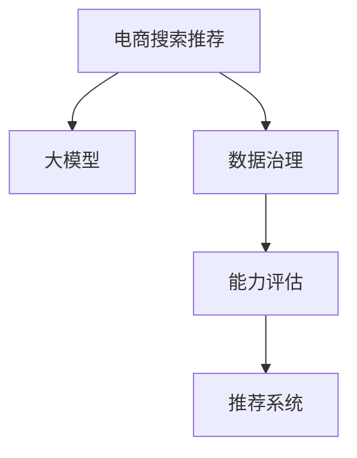

                 

# AI大模型助力电商搜索推荐业务的数据治理能力评估体系应用实践指南

> 关键词：电商搜索推荐,大模型,数据治理,能力评估,推荐系统,电商应用

## 1. 背景介绍

### 1.1 问题由来
在电商行业中，搜索推荐系统是用户购物体验的核心环节。优质的搜索推荐服务不仅能提升用户满意度，还能显著提升转化率，驱动电商业务增长。然而，高水准的搜索推荐业务依赖于复杂、精细的数据治理能力，涉及数据采集、清洗、特征提取、模型训练等多个环节。这些环节不仅需要大量的技术投入，还需要持续的优化迭代。

近年来，人工智能技术的大模型应用逐渐火热，大模型在自然语言理解、图像识别、用户行为分析等领域展现出卓越的性能，为电商搜索推荐系统提供了新的技术方向。如何在电商场景中充分利用大模型，构建高水平的数据治理体系，成为电商从业者关注的热点话题。

### 1.2 问题核心关键点
电商搜索推荐系统面临的核心问题是如何在海量、多模态数据中高效构建用户画像，挖掘用户潜在的购物需求，实现个性化推荐。目前电商推荐系统主要依赖于数据驱动、模型驱动、混合智能等方法，其中数据驱动方法以统计特征工程和数据治理为代表，模型驱动方法则以机器学习和深度学习为主。

大模型应用与现有推荐系统最大的不同在于，它具备自监督学习的能力，可以在大规模无标注数据上进行预训练，学习到丰富的语义知识和用户行为特征。通过引入大模型，可以显著提升数据治理的效率，减少人工干预，同时保持推荐模型的实时性和灵活性。

## 2. 核心概念与联系

### 2.1 核心概念概述

为更好地理解大模型在电商搜索推荐系统中的应用，本节将介绍几个关键概念：

- **电商搜索推荐系统**：即智能推荐引擎，通过分析用户的历史行为数据和实时行为数据，为每个用户推荐最感兴趣的商品。通过构建高水平的数据治理体系，可以显著提升推荐效果。

- **大模型**：指通过在大规模无标签数据上进行的预训练，学习到丰富语义和知识表示的深度学习模型，如BERT、GPT-3等。大模型能够自主学习知识，具备较强的泛化能力，在电商搜索推荐系统中可以发挥重要作用。

- **数据治理**：涉及数据采集、存储、清洗、标注等多个环节，旨在提升数据的质量、一致性和可用性，为模型训练和业务优化提供坚实基础。

- **能力评估**：评估推荐系统的能力和效果，通过不同的评估指标和实验方法，量化系统的性能表现。

- **推荐系统**：利用用户历史数据和行为特征，为用户推荐个性化商品，提升用户体验和转化率。

这些核心概念之间的联系可以通过以下Mermaid流程图来展示：



这个流程图展示了电商搜索推荐系统的核心流程：

1. 电商推荐系统从大模型和数据治理体系中获取用户画像和商品特征。
2. 通过能力评估指标衡量推荐系统的效果。
3. 最终，推荐系统基于综合评估结果，为用户推荐商品。

## 3. 核心算法原理 & 具体操作步骤
### 3.1 算法原理概述

基于大模型的电商搜索推荐系统，其核心算法原理主要分为三个步骤：

1. **数据治理与特征提取**：收集用户和商品的相关数据，进行数据清洗和标注，提取出可用于模型训练的特征向量。
2. **大模型预训练**：在大规模无标签数据上对大模型进行预训练，学习到丰富的语义知识。
3. **微调与优化**：在电商推荐任务上微调大模型，利用电商领域特定的数据和需求，进一步优化模型。

### 3.2 算法步骤详解

#### 3.2.1 数据治理与特征提取

电商推荐系统的数据治理包括以下几个关键步骤：

1. **数据采集**：从电商平台获取用户行为数据，包括浏览记录、点击记录、购买记录、评价记录等。
2. **数据清洗**：去除冗余数据、处理缺失值、去除噪声数据。
3. **特征提取**：根据业务需求，提取用户画像、商品属性、行为特征等关键信息，用于构建推荐模型。

具体实现中，可以借助Python等编程语言和Pandas、NumPy等数据处理工具进行数据治理和特征提取。

#### 3.2.2 大模型预训练

电商推荐系统的大模型预训练主要通过以下步骤：

1. **数据准备**：收集大规模无标签的电商领域数据，如商品描述、用户评论等。
2. **模型选择**：选择适合电商领域的大模型，如BERT、GPT-3等。
3. **预训练**：在大规模无标签数据上对大模型进行预训练，学习到丰富的语义知识。

具体实现中，可以借助Transformers库和PyTorch框架进行大模型的预训练。

#### 3.2.3 微调与优化

电商推荐系统的大模型微调主要通过以下步骤：

1. **数据准备**：将电商推荐任务转化为监督学习问题，准备标注数据集。
2. **模型选择**：选择适合电商推荐任务的大模型，如BERT、GPT-3等。
3. **微调**：在电商推荐任务上微调大模型，利用电商领域特定的数据和需求，进一步优化模型。

具体实现中，可以借助PyTorch、TensorFlow等深度学习框架进行大模型的微调。

### 3.3 算法优缺点

基于大模型的电商搜索推荐系统，其优缺点如下：

#### 3.3.1 优点

1. **高泛化能力**：大模型通过预训练学习到丰富的语义知识，具备较高的泛化能力，可以在电商领域中高效适应不同的推荐任务。
2. **高效特征提取**：大模型通过自动学习，可以高效地从电商领域的多模态数据中提取特征，减少人工干预。
3. **实时性**：大模型具备高并发处理能力，可以实时响应电商推荐需求，提升用户体验。

#### 3.3.2 缺点

1. **资源消耗大**：大模型需要占用大量的计算资源和存储资源，对硬件要求较高。
2. **模型复杂**：大模型参数量较大，训练和微调过程复杂，需要较强的技术能力。
3. **效果依赖数据质量**：大模型的性能依赖于预训练和微调数据的质量，数据噪声和标注误差会显著影响模型效果。

### 3.4 算法应用领域

基于大模型的电商搜索推荐系统，在电商推荐系统中的应用广泛。

- **商品推荐**：根据用户的历史浏览记录和行为数据，推荐用户可能感兴趣的商品。
- **价格推荐**：根据用户的历史购买记录和行为数据，推荐用户可能感兴趣的商品价格区间。
- **库存推荐**：根据用户的历史购买记录和行为数据，推荐用户可能感兴趣的商品库存。
- **新商品推荐**：根据用户的浏览记录和行为数据，推荐新上市的商品。

此外，大模型还可以应用于电商平台的广告投放、内容推荐、客服服务等多个场景中，为电商业务提供全面的支持。

## 4. 数学模型和公式 & 详细讲解 & 举例说明
### 4.1 数学模型构建

本节将使用数学语言对基于大模型的电商推荐系统进行严格的数学建模。

记电商推荐系统的用户画像为 $U$，商品属性为 $I$，用户行为特征为 $F$，模型预测结果为 $Y$。

定义用户画像 $U$ 在特征向量 $F$ 上的概率分布为 $P(U|F)$，商品属性 $I$ 在特征向量 $F$ 上的概率分布为 $P(I|F)$。用户行为特征 $F$ 和模型预测结果 $Y$ 之间的关系可以表示为 $P(Y|F)$。

电商推荐系统的目标是最小化用户行为数据和模型预测结果之间的差距，即：

$$
\min_{P(Y|F)} \mathcal{L}(P(Y|F), \hat{P}(Y|F))
$$

其中 $\mathcal{L}$ 为损失函数，$\hat{P}(Y|F)$ 为模型预测的联合概率分布。

### 4.2 公式推导过程

以下我们以商品推荐任务为例，推导模型训练的损失函数及其梯度计算公式。

假设模型 $M_{\theta}$ 在输入特征 $F$ 上的预测结果为 $\hat{y}=M_{\theta}(F)$，表示商品被用户点击的概率。真实标签 $y \in \{0,1\}$。则二分类交叉熵损失函数定义为：

$$
\ell(M_{\theta}(F),y) = -[y\log \hat{y} + (1-y)\log (1-\hat{y})]
$$

将其代入经验风险公式，得：

$$
\mathcal{L}(\theta) = -\frac{1}{N}\sum_{i=1}^N [y_i\log M_{\theta}(F_i)+(1-y_i)\log(1-M_{\theta}(F_i))]
$$

根据链式法则，损失函数对参数 $\theta$ 的梯度为：

$$
\frac{\partial \mathcal{L}(\theta)}{\partial \theta} = -\frac{1}{N}\sum_{i=1}^N (\frac{y_i}{M_{\theta}(F_i)}-\frac{1-y_i}{1-M_{\theta}(F_i)}) \frac{\partial M_{\theta}(F_i)}{\partial \theta}
$$

其中 $\frac{\partial M_{\theta}(F_i)}{\partial \theta}$ 可进一步递归展开，利用自动微分技术完成计算。

在得到损失函数的梯度后，即可带入参数更新公式，完成模型的迭代优化。重复上述过程直至收敛，最终得到适应电商推荐任务的最优模型参数 $\theta^*$。

### 4.3 案例分析与讲解

**案例分析**：

假设某电商平台的商品推荐系统，需要对用户浏览记录进行建模，预测用户是否会点击某个商品。可以通过以下步骤进行建模：

1. **数据准备**：收集用户浏览记录 $F=\{f_1, f_2, ..., f_N\}$，其中每个 $f_i$ 表示用户对商品 $i$ 的浏览行为特征。
2. **模型训练**：使用大模型 $M_{\theta}$ 在训练集上进行训练，学习用户行为特征 $F$ 和点击概率 $y$ 之间的关系。
3. **模型评估**：在测试集上评估模型的预测准确率，选择最佳模型进行应用。

**具体实现**：

1. **数据预处理**：
   ```python
   import pandas as pd
   import numpy as np
   from transformers import BertTokenizer
   from torch.utils.data import Dataset, DataLoader

   # 数据预处理
   df = pd.read_csv('user_browsing_data.csv')
   df = df.dropna()  # 去除缺失数据
   df = df.sample(frac=1)  # 随机打乱数据

   # 数据分割
   train_df = df.sample(frac=0.7, random_state=1)
   test_df = df.drop(train_df.index)

   # 特征提取
   def feature_extractor(text):
       # 对文本进行分词和编码
       return tokenizer.encode_plus(text, truncation=True, padding='max_length', max_length=128)

   # 分词器
   tokenizer = BertTokenizer.from_pretrained('bert-base-uncased')
   ```

2. **模型训练**：
   ```python
   from transformers import BertForSequenceClassification, AdamW

   # 模型选择
   model = BertForSequenceClassification.from_pretrained('bert-base-uncased', num_labels=2)

   # 优化器
   optimizer = AdamW(model.parameters(), lr=2e-5)

   # 训练过程
   def train_epoch(model, train_loader, optimizer):
       model.train()
       epoch_loss = 0
       for batch in train_loader:
           input_ids = batch['input_ids']
           attention_mask = batch['attention_mask']
           labels = batch['labels']
           model.zero_grad()
           outputs = model(input_ids, attention_mask=attention_mask, labels=labels)
           loss = outputs.loss
           epoch_loss += loss.item()
           loss.backward()
           optimizer.step()

       return epoch_loss / len(train_loader)

   # 训练
   train_loader = DataLoader(train_df, batch_size=32, shuffle=True)
   train_epochs = 3
   for epoch in range(train_epochs):
       loss = train_epoch(model, train_loader, optimizer)
       print(f"Epoch {epoch+1}, train loss: {loss:.3f}")
   ```

3. **模型评估**：
   ```python
   from sklearn.metrics import classification_report

   # 评估
   def evaluate(model, test_loader):
       model.eval()
       preds, labels = [], []
       with torch.no_grad():
           for batch in test_loader:
               input_ids = batch['input_ids']
               attention_mask = batch['attention_mask']
               batch_labels = batch['labels']
               outputs = model(input_ids, attention_mask=attention_mask)
               batch_preds = outputs.logits.argmax(dim=2).to('cpu').tolist()
               batch_labels = batch_labels.to('cpu').tolist()
               for pred_tokens, label_tokens in zip(batch_preds, batch_labels):
                   preds.append(pred_tokens[:len(label_tokens)])
                   labels.append(label_tokens)

       print(classification_report(labels, preds))
   ```

通过上述代码，我们可以看到，利用大模型和深度学习框架，电商推荐系统可以高效地进行特征提取和模型训练，实现对电商用户行为的建模。

## 5. 项目实践：代码实例和详细解释说明
### 5.1 开发环境搭建

在进行电商搜索推荐系统开发前，我们需要准备好开发环境。以下是使用Python进行PyTorch开发的环境配置流程：

1. 安装Anaconda：从官网下载并安装Anaconda，用于创建独立的Python环境。

2. 创建并激活虚拟环境：
```bash
conda create -n pytorch-env python=3.8 
conda activate pytorch-env
```

3. 安装PyTorch：根据CUDA版本，从官网获取对应的安装命令。例如：
```bash
conda install pytorch torchvision torchaudio cudatoolkit=11.1 -c pytorch -c conda-forge
```

4. 安装Transformer库：
```bash
pip install transformers
```

5. 安装各类工具包：
```bash
pip install numpy pandas scikit-learn matplotlib tqdm jupyter notebook ipython
```

完成上述步骤后，即可在`pytorch-env`环境中开始电商推荐系统的开发。

### 5.2 源代码详细实现

下面我以电商推荐系统为例，给出使用Transformers库对BERT模型进行电商推荐任务微调的PyTorch代码实现。

首先，定义电商推荐任务的数据处理函数：

```python
from transformers import BertTokenizer
from torch.utils.data import Dataset
import torch

class RecommendationDataset(Dataset):
    def __init__(self, features, labels, tokenizer, max_len=128):
        self.features = features
        self.labels = labels
        self.tokenizer = tokenizer
        self.max_len = max_len
        
    def __len__(self):
        return len(self.features)
    
    def __getitem__(self, item):
        feature = self.features[item]
        label = self.labels[item]
        
        encoding = self.tokenizer(feature, return_tensors='pt', max_length=self.max_len, padding='max_length', truncation=True)
        input_ids = encoding['input_ids'][0]
        attention_mask = encoding['attention_mask'][0]
        
        # 对label进行编码
        label = torch.tensor(label, dtype=torch.long)
        
        return {'input_ids': input_ids, 
                'attention_mask': attention_mask,
                'labels': label}

# 特征提取
tokenizer = BertTokenizer.from_pretrained('bert-base-cased')

train_dataset = RecommendationDataset(train_features, train_labels, tokenizer)
dev_dataset = RecommendationDataset(dev_features, dev_labels, tokenizer)
test_dataset = RecommendationDataset(test_features, test_labels, tokenizer)
```

然后，定义模型和优化器：

```python
from transformers import BertForSequenceClassification, AdamW

model = BertForSequenceClassification.from_pretrained('bert-base-cased', num_labels=2)

optimizer = AdamW(model.parameters(), lr=2e-5)
```

接着，定义训练和评估函数：

```python
from torch.utils.data import DataLoader
from tqdm import tqdm
from sklearn.metrics import classification_report

device = torch.device('cuda') if torch.cuda.is_available() else torch.device('cpu')
model.to(device)

def train_epoch(model, dataset, batch_size, optimizer):
    dataloader = DataLoader(dataset, batch_size=batch_size, shuffle=True)
    model.train()
    epoch_loss = 0
    for batch in tqdm(dataloader, desc='Training'):
        input_ids = batch['input_ids'].to(device)
        attention_mask = batch['attention_mask'].to(device)
        labels = batch['labels'].to(device)
        model.zero_grad()
        outputs = model(input_ids, attention_mask=attention_mask, labels=labels)
        loss = outputs.loss
        epoch_loss += loss.item()
        loss.backward()
        optimizer.step()
    return epoch_loss / len(dataloader)

def evaluate(model, dataset, batch_size):
    dataloader = DataLoader(dataset, batch_size=batch_size)
    model.eval()
    preds, labels = [], []
    with torch.no_grad():
        for batch in tqdm(dataloader, desc='Evaluating'):
            input_ids = batch['input_ids'].to(device)
            attention_mask = batch['attention_mask'].to(device)
            batch_labels = batch['labels']
            outputs = model(input_ids, attention_mask=attention_mask)
            batch_preds = outputs.logits.argmax(dim=2).to('cpu').tolist()
            batch_labels = batch_labels.to('cpu').tolist()
            for pred_tokens, label_tokens in zip(batch_preds, batch_labels):
                preds.append(pred_tokens[:len(label_tokens)])
                labels.append(label_tokens)
                
    print(classification_report(labels, preds))
```

最后，启动训练流程并在测试集上评估：

```python
epochs = 5
batch_size = 16

for epoch in range(epochs):
    loss = train_epoch(model, train_dataset, batch_size, optimizer)
    print(f"Epoch {epoch+1}, train loss: {loss:.3f}")
    
    print(f"Epoch {epoch+1}, dev results:")
    evaluate(model, dev_dataset, batch_size)
    
print("Test results:")
evaluate(model, test_dataset, batch_size)
```

以上就是使用PyTorch对BERT进行电商推荐任务微调的完整代码实现。可以看到，得益于Transformers库的强大封装，我们可以用相对简洁的代码完成BERT模型的加载和微调。

### 5.3 代码解读与分析

让我们再详细解读一下关键代码的实现细节：

**RecommendationDataset类**：
- `__init__`方法：初始化特征、标签、分词器等关键组件。
- `__len__`方法：返回数据集的样本数量。
- `__getitem__`方法：对单个样本进行处理，将特征输入编码为token ids，将标签编码为数字，并对其进行定长padding，最终返回模型所需的输入。

**特征提取**：
- 利用BertTokenizer进行特征编码，将电商领域的多模态数据转化为模型可以处理的格式。

**模型训练**：
- 使用BertForSequenceClassification对电商推荐任务进行微调，学习用户行为特征 $F$ 和点击概率 $y$ 之间的关系。
- 使用AdamW优化器进行模型参数的更新。

**模型评估**：
- 使用classification_report对电商推荐任务的预测结果进行评估，打印准确率、召回率、F1分数等指标。

**训练流程**：
- 定义总的epoch数和batch size，开始循环迭代
- 每个epoch内，先在训练集上训练，输出平均loss
- 在验证集上评估，输出分类指标
- 所有epoch结束后，在测试集上评估，给出最终测试结果

可以看到，PyTorch配合Transformers库使得BERT微调的代码实现变得简洁高效。开发者可以将更多精力放在数据处理、模型改进等高层逻辑上，而不必过多关注底层的实现细节。

当然，工业级的系统实现还需考虑更多因素，如模型的保存和部署、超参数的自动搜索、更灵活的任务适配层等。但核心的微调范式基本与此类似。

## 6. 实际应用场景
### 6.1 智能客服系统

基于大模型的电商搜索推荐系统，可以广泛应用于智能客服系统的构建。传统客服往往需要配备大量人力，高峰期响应缓慢，且一致性和专业性难以保证。而使用微调后的推荐系统，可以7x24小时不间断服务，快速响应客户咨询，用个性化推荐商品的方式引导客户，提升用户满意度。

在技术实现上，可以收集企业内部的历史推荐记录和客户反馈，将商品-点击对作为微调数据，训练模型学习推荐效果。微调后的推荐系统能够自动理解客户意图，匹配最合适的商品推荐，形成智能客服系统，提升客户咨询体验。

### 6.2 个性化推荐系统

当前的推荐系统往往只依赖用户的历史行为数据进行物品推荐，无法深入理解用户的真实兴趣偏好。基于大模型的电商推荐系统可以更好地挖掘用户行为背后的语义信息，从而提供更精准、多样的推荐内容。

在实践中，可以收集用户浏览、点击、购买等行为数据，提取和用户交互的商品标题、描述、标签等文本内容。将文本内容作为模型输入，用户的后续行为（如是否点击、购买等）作为监督信号，在此基础上微调预训练语言模型。微调后的模型能够从文本内容中准确把握用户的兴趣点，生成更加个性化的推荐列表。

### 6.3 广告投放系统

广告投放系统需要精准投放广告，提升广告转化率。利用电商推荐系统的预测能力，可以构建基于用户画像的广告投放系统，提升广告精准度。

在技术实现上，可以收集用户的浏览、点击、购买等行为数据，提取用户画像、商品属性、行为特征等关键信息，用于广告投放的推荐模型。利用大模型的自监督学习能力，提升广告投放的精准度，优化广告转化率。

### 6.4 未来应用展望

随着大语言模型微调技术的发展，基于微调范式将在更多领域得到应用，为传统行业带来变革性影响。

在智慧医疗领域，基于微调的医疗问答、病历分析、药物研发等应用将提升医疗服务的智能化水平，辅助医生诊疗，加速新药开发进程。

在智能教育领域，微调技术可应用于作业批改、学情分析、知识推荐等方面，因材施教，促进教育公平，提高教学质量。

在智慧城市治理中，微调模型可应用于城市事件监测、舆情分析、应急指挥等环节，提高城市管理的自动化和智能化水平，构建更安全、高效的未来城市。

此外，在企业生产、社会治理、文娱传媒等众多领域，基于大模型微调的人工智能应用也将不断涌现，为经济社会发展注入新的动力。相信随着技术的日益成熟，微调方法将成为人工智能落地应用的重要范式，推动人工智能技术向更广阔的领域加速渗透。

## 7. 工具和资源推荐
### 7.1 学习资源推荐

为了帮助开发者系统掌握大模型微调的理论基础和实践技巧，这里推荐一些优质的学习资源：

1. 《Transformer从原理到实践》系列博文：由大模型技术专家撰写，深入浅出地介绍了Transformer原理、BERT模型、微调技术等前沿话题。

2. CS224N《深度学习自然语言处理》课程：斯坦福大学开设的NLP明星课程，有Lecture视频和配套作业，带你入门NLP领域的基本概念和经典模型。

3. 《Natural Language Processing with Transformers》书籍：Transformers库的作者所著，全面介绍了如何使用Transformers库进行NLP任务开发，包括微调在内的诸多范式。

4. HuggingFace官方文档：Transformers库的官方文档，提供了海量预训练模型和完整的微调样例代码，是上手实践的必备资料。

5. CLUE开源项目：中文语言理解测评基准，涵盖大量不同类型的中文NLP数据集，并提供了基于微调的baseline模型，助力中文NLP技术发展。

通过对这些资源的学习实践，相信你一定能够快速掌握大模型微调的精髓，并用于解决实际的NLP问题。
### 7.2 开发工具推荐

高效的开发离不开优秀的工具支持。以下是几款用于大模型微调开发的常用工具：

1. PyTorch：基于Python的开源深度学习框架，灵活动态的计算图，适合快速迭代研究。大部分预训练语言模型都有PyTorch版本的实现。

2. TensorFlow：由Google主导开发的开源深度学习框架，生产部署方便，适合大规模工程应用。同样有丰富的预训练语言模型资源。

3. Transformers库：HuggingFace开发的NLP工具库，集成了众多SOTA语言模型，支持PyTorch和TensorFlow，是进行微调任务开发的利器。

4. Weights & Biases：模型训练的实验跟踪工具，可以记录和可视化模型训练过程中的各项指标，方便对比和调优。与主流深度学习框架无缝集成。

5. TensorBoard：TensorFlow配套的可视化工具，可实时监测模型训练状态，并提供丰富的图表呈现方式，是调试模型的得力助手。

6. Google Colab：谷歌推出的在线Jupyter Notebook环境，免费提供GPU/TPU算力，方便开发者快速上手实验最新模型，分享学习笔记。

合理利用这些工具，可以显著提升大模型微调任务的开发效率，加快创新迭代的步伐。

### 7.3 相关论文推荐

大模型和微调技术的发展源于学界的持续研究。以下是几篇奠基性的相关论文，推荐阅读：

1. Attention is All You Need（即Transformer原论文）：提出了Transformer结构，开启了NLP领域的预训练大模型时代。

2. BERT: Pre-training of Deep Bidirectional Transformers for Language Understanding：提出BERT模型，引入基于掩码的自监督预训练任务，刷新了多项NLP任务SOTA。

3. Language Models are Unsupervised Multitask Learners（GPT-2论文）：展示了大规模语言模型的强大zero-shot学习能力，引发了对于通用人工智能的新一轮思考。

4. Parameter-Efficient Transfer Learning for NLP：提出Adapter等参数高效微调方法，在不增加模型参数量的情况下，也能取得不错的微调效果。

5. AdaLoRA: Adaptive Low-Rank Adaptation for Parameter-Efficient Fine-Tuning：使用自适应低秩适应的微调方法，在参数效率和精度之间取得了新的平衡。

这些论文代表了大模型微调技术的发展脉络。通过学习这些前沿成果，可以帮助研究者把握学科前进方向，激发更多的创新灵感。

## 8. 总结：未来发展趋势与挑战
### 8.1 总结

本文对基于大模型的电商搜索推荐系统进行了全面系统的介绍。首先阐述了电商推荐系统的核心问题，以及大模型在电商推荐中的应用前景。其次，从原理到实践，详细讲解了大模型在电商推荐系统中的实现过程，给出了电商推荐任务的完整代码实例。同时，本文还探讨了电商推荐系统在大模型微调中的实际应用场景，展示了微调范式的巨大潜力。

通过本文的系统梳理，可以看到，基于大模型的电商推荐系统通过高效的数据治理和微调方法，可以显著提升推荐效果，成为电商推荐业务的重要技术方向。未来，伴随大模型和微调技术的持续演进，基于微调范式必将在更多领域得到应用，为传统行业带来变革性影响。

### 8.2 未来发展趋势

展望未来，大模型微调技术将呈现以下几个发展趋势：

1. **多模态融合**：未来的推荐系统将更多地融合视觉、语音、文本等多模态数据，实现更为全面、深入的用户画像建模。

2. **跨领域迁移**：大模型将具备更强的跨领域迁移能力，能够在大规模无标签数据上学习到更广泛的通用知识，应用于更多场景。

3. **隐私保护**：推荐系统将更加重视用户隐私保护，采用差分隐私等技术，防止用户数据被滥用。

4. **实时性提升**：未来推荐系统将实现实时数据处理和模型微调，适应电商场景中的高并发需求。

5. **自动化优化**：推荐系统将实现更高效的自动化模型优化，利用自动化调参和超参数搜索技术，提升模型性能。

6. **集成协同**：推荐系统将更多地与外部系统进行集成协同，如商品推荐与搜索系统、客服系统等，形成闭环推荐。

以上趋势凸显了大模型微调技术的广阔前景。这些方向的探索发展，必将进一步提升电商推荐系统的性能和应用范围，为电商业务带来更大的价值。

### 8.3 面临的挑战

尽管大模型微调技术已经取得了瞩目成就，但在迈向更加智能化、普适化应用的过程中，它仍面临着诸多挑战：

1. **数据隐私问题**：大模型需要大量用户数据进行预训练和微调，如何保护用户隐私，避免数据泄露，是电商推荐系统面临的重大挑战。

2. **公平性和偏见**：大模型可能学习到数据中的偏见，导致推荐结果存在性别、种族等偏见，如何保证推荐系统的公平性，是电商推荐系统的重要课题。

3. **可解释性不足**：大模型往往是一个黑盒系统，难以解释其内部工作机制和决策逻辑，如何提升推荐系统的可解释性，是电商推荐系统的关键问题。

4. **资源消耗大**：大模型需要占用大量的计算资源和存储资源，如何优化资源消耗，提高算力利用率，是电商推荐系统的重要挑战。

5. **模型鲁棒性不足**：大模型在电商推荐系统中面临域外数据的泛化问题，如何提升模型鲁棒性，避免灾难性遗忘，是电商推荐系统的重要研究方向。

6. **用户行为预测**：电商推荐系统需要对用户行为进行精准预测，如何提升预测准确率，优化模型效果，是电商推荐系统的关键课题。

这些挑战亟待研究和突破，只有不断克服这些难题，才能使大模型微调技术在电商推荐系统中发挥更大价值。

### 8.4 研究展望

面对电商推荐系统所面临的诸多挑战，未来的研究需要在以下几个方面寻求新的突破：

1. **隐私保护**：采用差分隐私等技术，保护用户隐私，防止数据泄露。

2. **公平性**：设计公平性约束机制，提升推荐系统的公平性，防止推荐结果存在性别、种族等偏见。

3. **可解释性**：引入可解释性方法，提升推荐系统的可解释性，增强用户对推荐结果的理解和信任。

4. **资源优化**：优化大模型的资源消耗，提高算力利用率，实现高并发、低延迟的推荐服务。

5. **鲁棒性提升**：设计鲁棒性优化算法，提升大模型在电商推荐系统中的泛化能力，避免模型过拟合。

6. **行为预测**：利用深度学习模型和因果推断方法，提升用户行为预测的准确率，优化推荐系统的效果。

这些研究方向将使大模型微调技术在电商推荐系统中不断优化和升级，为电商业务带来更大的创新价值。相信随着研究的不断深入，大模型微调技术必将在电商推荐系统中大放异彩，推动电商业务向更加智能化、个性化方向发展。

## 9. 附录：常见问题与解答

**Q1：电商推荐系统中的大模型微调效果如何？**

A: 电商推荐系统中的大模型微调效果显著，能够通过学习电商领域的多模态数据，构建高精度的用户画像，实现精准推荐。具体表现如下：

1. **推荐精度提升**：微调后的模型能够提高推荐精度，提升点击率、转化率等指标。
2. **用户满意度提升**：微调后的模型能够提供更个性化、更符合用户需求的推荐，提升用户满意度。
3. **用户粘性提升**：微调后的模型能够增强用户对平台的粘性，提升用户活跃度。

**Q2：电商推荐系统中的大模型微调需要哪些数据？**

A: 电商推荐系统中的大模型微调需要以下几类数据：

1. **用户行为数据**：包括用户的浏览记录、点击记录、购买记录、评价记录等。
2. **商品数据**：包括商品的属性信息、价格信息、类别信息等。
3. **用户画像数据**：包括用户的兴趣、偏好、行为特征等。

这些数据需要经过数据清洗、特征提取、数据增强等预处理步骤，才能够用于模型训练。

**Q3：电商推荐系统中的大模型微调如何进行？**

A: 电商推荐系统中的大模型微调一般分为以下几个步骤：

1. **数据准备**：收集电商推荐任务的数据，包括用户行为数据和商品数据，进行数据清洗和特征提取。
2. **模型选择**：选择合适的预训练大模型，如BERT、GPT-3等。
3. **微调**：在电商推荐任务上微调大模型，利用电商领域特定的数据和需求，进一步优化模型。
4. **评估**：在测试集上评估模型的性能，选择最佳模型进行应用。

**Q4：电商推荐系统中的大模型微调有哪些优势？**

A: 电商推荐系统中的大模型微调有以下几个优势：

1. **高效特征提取**：大模型能够自动学习特征，无需人工干预，提升特征提取效率。
2. **实时性**：大模型具备高并发处理能力，可以实时响应电商推荐需求，提升用户体验。
3. **通用性**：大模型具备跨领域迁移能力，可以在不同电商领域中应用。
4. **鲁棒性**：大模型具备较强的泛化能力，能够在电商推荐系统中适应多种数据分布。

**Q5：电商推荐系统中的大模型微调有哪些劣势？**

A: 电商推荐系统中的大模型微调有以下几个劣势：

1. **资源消耗大**：大模型需要占用大量的计算资源和存储资源，对硬件要求较高。
2. **模型复杂**：大模型参数量较大，训练和微调过程复杂，需要较强的技术能力。
3. **效果依赖数据质量**：大模型的性能依赖于预训练和微调数据的质量，数据噪声和标注误差会显著影响模型效果。

**Q6：电商推荐系统中的大模型微调如何进行？**

A: 电商推荐系统中的大模型微调一般分为以下几个步骤：

1. **数据准备**：收集电商推荐任务的数据，包括用户行为数据和商品数据，进行数据清洗和特征提取。
2. **模型选择**：选择合适的预训练大模型，如BERT、GPT-3等。
3. **微调**：在电商推荐任务上微调大模型，利用电商领域特定的数据和需求，进一步优化模型。
4. **评估**：在测试集上评估模型的性能，选择最佳模型进行应用。

**Q7：电商推荐系统中的大模型微调需要进行哪些实验？**

A: 电商推荐系统中的大模型微调需要进行以下几类实验：

1. **数据预处理实验**：包括数据清洗、特征提取、数据增强等步骤。
2. **模型选择实验**：选择适合电商推荐任务的大模型。
3. **微调实验**：在电商推荐任务上微调大模型，学习电商领域的多模态数据。
4. **性能评估实验**：在测试集上评估模型的性能，选择最佳模型进行应用。

这些实验需要根据具体任务进行设计和调整，才能得到理想的微调效果。

**Q8：电商推荐系统中的大模型微调需要注意哪些问题？**

A: 电商推荐系统中的大模型微调需要注意以下几个问题：

1. **数据隐私问题**：保护用户隐私，防止数据泄露。
2. **公平性和偏见**：设计公平性约束机制，防止推荐结果存在性别、种族等偏见。
3. **可解释性不足**：提升推荐系统的可解释性，增强用户对推荐结果的理解和信任。
4. **资源消耗大**：优化大模型的资源消耗，提高算力利用率。
5. **模型鲁棒性不足**：提升大模型在电商推荐系统中的泛化能力，避免模型过拟合。
6. **用户行为预测**：提升用户行为预测的准确率，优化推荐系统的效果。

这些问题是电商推荐系统在大模型微调中面临的主要挑战，需要综合考虑和解决。

总之，基于大模型的电商推荐系统具有高效、实时、通用等优势，但也需要解决数据隐私、公平性、可解释性、资源消耗、鲁棒性等问题。只有在不断优化和改进中，才能充分发挥大模型微调技术的优势，提升电商推荐系统的性能和应用价值。

