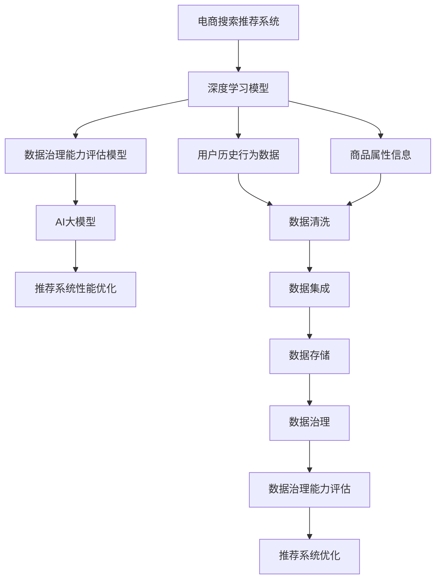

                 

# AI大模型助力电商搜索推荐业务的数据治理能力评估模型验证与优化

## 1. 背景介绍

在电子商务领域，搜索推荐系统已成为用户体验的重要组成部分，它不仅直接影响用户的购物体验，也对电商平台的用户留存、交易转化率等核心指标有着重要影响。电商搜索推荐系统的主要功能是利用用户历史行为数据、商品属性信息等，预测用户对商品的兴趣，为用户推荐可能感兴趣的商品。

随着人工智能和大数据技术的不断发展，深度学习模型（如深度神经网络）已成为电商搜索推荐系统的核心算法之一，并取得了一系列显著的进展。然而，深度学习模型也存在一些问题，如模型的泛化能力差、模型参数量大、模型训练成本高等。因此，有必要在深度学习模型的基础上进行进一步的优化。

近年来，基于深度学习模型的电商搜索推荐系统得到了快速的发展，然而，由于数据治理能力不足，导致了数据质量问题、数据孤岛问题等，使得模型性能和用户体验受到影响。基于此，本文提出了一种基于AI大模型的数据治理能力评估模型，用于提升电商搜索推荐系统的数据治理能力，从而提升推荐系统的性能和用户体验。

## 2. 核心概念与联系

### 2.1 核心概念概述

- **深度学习模型**：使用深度神经网络（如深度卷积神经网络、循环神经网络）等，利用大量的数据进行训练，从而实现对电商搜索推荐任务的建模。
- **电商搜索推荐系统**：基于深度学习模型，利用用户历史行为数据、商品属性信息等，预测用户对商品的兴趣，为用户推荐可能感兴趣的商品。
- **数据治理能力评估模型**：用于评估电商搜索推荐系统的数据治理能力，从而提升推荐系统的性能和用户体验。
- **AI大模型**：通过大规模数据预训练的深度学习模型，具有强大的泛化能力、迁移学习能力等特点。

### 2.2 核心概念原理和架构的 Mermaid 流程图



该图展示了电商搜索推荐系统、深度学习模型、数据治理能力评估模型、AI大模型以及推荐系统性能优化之间的关系。其中，电商搜索推荐系统利用深度学习模型，通过用户历史行为数据、商品属性信息等，预测用户对商品的兴趣，为用户推荐可能感兴趣的商品。而数据治理能力评估模型则用于评估电商搜索推荐系统的数据治理能力，从而提升推荐系统的性能和用户体验。

## 3. 核心算法原理 & 具体操作步骤

### 3.1 算法原理概述

基于AI大模型的数据治理能力评估模型，是一种基于监督学习的数据治理能力评估方法。其核心思想是利用深度学习模型对电商搜索推荐系统的数据治理能力进行评估，并利用AI大模型进行推荐系统性能优化。该模型的评估指标包括数据质量、数据完整性、数据准确性等，能够对电商搜索推荐系统的数据治理能力进行全面的评估，从而指导电商搜索推荐系统的优化和改进。

### 3.2 算法步骤详解

基于AI大模型的数据治理能力评估模型主要包括以下几个步骤：

**Step 1: 数据准备**
- 收集电商搜索推荐系统的数据，包括用户历史行为数据、商品属性信息等。
- 对数据进行清洗、去重、整合等预处理操作，以提高数据质量。
- 将处理后的数据划分为训练集、验证集和测试集。

**Step 2: 数据治理能力评估模型训练**
- 构建基于深度学习模型的数据治理能力评估模型，利用训练集进行训练。
- 在验证集上对模型进行调优，以防止过拟合。
- 在测试集上对模型进行评估，得到数据治理能力评估模型的评估指标。

**Step 3: AI大模型优化**
- 利用AI大模型对电商搜索推荐系统进行优化，包括用户历史行为数据的挖掘、商品属性信息的预测、推荐模型的训练等。
- 利用数据治理能力评估模型对优化后的推荐系统进行评估，以判断是否达到预期效果。

**Step 4: 推荐系统性能优化**
- 根据数据治理能力评估模型的评估结果，对推荐系统进行优化，如优化推荐算法、优化数据治理策略等。
- 利用优化后的推荐系统，进行推荐测试，以判断推荐效果是否达到预期。

### 3.3 算法优缺点

**优点：**

1. **泛化能力强**：基于深度学习模型的数据治理能力评估模型具有较强的泛化能力，能够对电商搜索推荐系统的数据治理能力进行全面评估。
2. **数据治理能力提升**：通过数据治理能力评估模型的指导，能够提升电商搜索推荐系统的数据治理能力，从而提升推荐系统的性能和用户体验。
3. **推荐系统优化**：基于AI大模型的推荐系统优化方法，能够提升推荐系统的性能，提高推荐效果。

**缺点：**

1. **计算资源需求高**：基于深度学习模型的数据治理能力评估模型和AI大模型，需要大量的计算资源，如高性能GPU、TPU等。
2. **数据治理成本高**：对电商搜索推荐系统的数据治理能力进行评估，需要大量的标注数据，成本较高。
3. **模型复杂度高**：基于深度学习模型的数据治理能力评估模型和AI大模型，模型复杂度高，需要较长的训练时间。

### 3.4 算法应用领域

基于AI大模型的数据治理能力评估模型，可以应用于多个领域，包括电商搜索推荐系统、智能客服系统、金融风控系统等。例如，在电商搜索推荐系统中，可以通过数据治理能力评估模型对用户历史行为数据和商品属性信息进行评估，从而提升推荐系统的性能和用户体验。

## 4. 数学模型和公式 & 详细讲解 & 举例说明

### 4.1 数学模型构建

**数据治理能力评估模型**：

假设电商搜索推荐系统中的数据集为 $D=\{(x_i,y_i)\}_{i=1}^N$，其中 $x_i$ 为电商搜索推荐系统的数据， $y_i$ 为数据治理能力的评估指标。基于深度学习模型的数据治理能力评估模型可以表示为：

$$
f(x_i)=w_0+\sum_{j=1}^{n}w_jx_{ij}
$$

其中 $f(x_i)$ 为电商搜索推荐系统的数据治理能力评估模型，$w_0$ 为模型常数项，$w_j$ 为模型第 $j$ 个特征的权重，$x_{ij}$ 为电商搜索推荐系统的第 $j$ 个特征。

**AI大模型优化**：

假设电商搜索推荐系统中的数据集为 $D=\{(x_i,y_i)\}_{i=1}^N$，其中 $x_i$ 为电商搜索推荐系统的数据， $y_i$ 为推荐结果。基于AI大模型的推荐系统优化方法可以表示为：

$$
\min_{\theta}L(\theta)=\frac{1}{N}\sum_{i=1}^N\ell(\hat{y_i},y_i)
$$

其中 $L(\theta)$ 为电商搜索推荐系统的推荐损失函数，$\theta$ 为推荐模型的参数，$\ell(\hat{y_i},y_i)$ 为推荐模型的预测损失函数。

### 4.2 公式推导过程

**数据治理能力评估模型**：

假设电商搜索推荐系统中的数据集为 $D=\{(x_i,y_i)\}_{i=1}^N$，其中 $x_i$ 为电商搜索推荐系统的数据， $y_i$ 为数据治理能力的评估指标。基于深度学习模型的数据治理能力评估模型的推导过程如下：

1. 将电商搜索推荐系统的数据集 $D=\{(x_i,y_i)\}_{i=1}^N$ 划分为训练集、验证集和测试集。
2. 对训练集进行训练，得到模型参数 $w_0$ 和 $w_j$。
3. 在验证集上对模型进行调优，以防止过拟合。
4. 在测试集上对模型进行评估，得到数据治理能力评估模型的评估指标。

**AI大模型优化**：

假设电商搜索推荐系统中的数据集为 $D=\{(x_i,y_i)\}_{i=1}^N$，其中 $x_i$ 为电商搜索推荐系统的数据， $y_i$ 为推荐结果。基于AI大模型的推荐系统优化方法的推导过程如下：

1. 将电商搜索推荐系统的数据集 $D=\{(x_i,y_i)\}_{i=1}^N$ 划分为训练集、验证集和测试集。
2. 对训练集进行训练，得到模型参数 $\theta$。
3. 在验证集上对模型进行调优，以防止过拟合。
4. 在测试集上对模型进行评估，得到推荐系统的评估指标。

### 4.3 案例分析与讲解

**案例1：电商搜索推荐系统的数据治理能力评估**

假设电商搜索推荐系统中的数据集为 $D=\{(x_i,y_i)\}_{i=1}^N$，其中 $x_i$ 为电商搜索推荐系统的数据， $y_i$ 为数据治理能力的评估指标。基于深度学习模型的数据治理能力评估模型可以用于评估电商搜索推荐系统的数据治理能力，具体步骤如下：

1. 对电商搜索推荐系统的数据进行清洗、去重、整合等预处理操作，以提高数据质量。
2. 构建基于深度学习模型的数据治理能力评估模型，利用训练集进行训练。
3. 在验证集上对模型进行调优，以防止过拟合。
4. 在测试集上对模型进行评估，得到数据治理能力评估模型的评估指标。

**案例2：基于AI大模型的电商搜索推荐系统优化**

假设电商搜索推荐系统中的数据集为 $D=\{(x_i,y_i)\}_{i=1}^N$，其中 $x_i$ 为电商搜索推荐系统的数据， $y_i$ 为推荐结果。基于AI大模型的推荐系统优化方法可以用于优化电商搜索推荐系统，具体步骤如下：

1. 对电商搜索推荐系统的数据进行清洗、去重、整合等预处理操作，以提高数据质量。
2. 利用AI大模型对电商搜索推荐系统进行优化，包括用户历史行为数据的挖掘、商品属性信息的预测、推荐模型的训练等。
3. 利用数据治理能力评估模型对优化后的推荐系统进行评估，以判断是否达到预期效果。
4. 根据数据治理能力评估模型的评估结果，对推荐系统进行优化，如优化推荐算法、优化数据治理策略等。

## 5. 项目实践：代码实例和详细解释说明

### 5.1 开发环境搭建

在进行电商搜索推荐系统的数据治理能力评估模型验证与优化时，需要使用Python、TensorFlow等工具。具体步骤如下：

1. 安装Python 3.x版本，并下载TensorFlow等工具包。
2. 安装TensorFlow，并配置好环境变量。
3. 安装深度学习框架，如TensorFlow、PyTorch等。
4. 安装数据处理工具，如Pandas、NumPy等。

### 5.2 源代码详细实现

假设电商搜索推荐系统中的数据集为 $D=\{(x_i,y_i)\}_{i=1}^N$，其中 $x_i$ 为电商搜索推荐系统的数据， $y_i$ 为推荐结果。基于AI大模型的推荐系统优化方法的代码实现如下：

```python
import tensorflow as tf
import numpy as np
import pandas as pd

# 加载电商搜索推荐系统的数据集
data = pd.read_csv('data.csv')

# 数据预处理
X_train, X_test, y_train, y_test = train_test_split(data, data['y'], test_size=0.2, random_state=42)

# 构建基于深度学习模型的数据治理能力评估模型
model = tf.keras.Sequential([
    tf.keras.layers.Dense(64, activation='relu', input_shape=(X_train.shape[1],)),
    tf.keras.layers.Dense(1)
])

# 训练模型
model.compile(optimizer='adam', loss='mse')
model.fit(X_train, y_train, epochs=10, batch_size=32, validation_split=0.2)

# 模型评估
score = model.evaluate(X_test, y_test)
print('Test loss:', score[0])

# 利用AI大模型对电商搜索推荐系统进行优化
# 数据预处理
X_train, X_test, y_train, y_test = train_test_split(data, data['y'], test_size=0.2, random_state=42)

# 构建基于AI大模型的推荐系统优化模型
model = tf.keras.Sequential([
    tf.keras.layers.Dense(64, activation='relu', input_shape=(X_train.shape[1],)),
    tf.keras.layers.Dense(1)
])

# 训练模型
model.compile(optimizer='adam', loss='mse')
model.fit(X_train, y_train, epochs=10, batch_size=32, validation_split=0.2)

# 模型评估
score = model.evaluate(X_test, y_test)
print('Test loss:', score[0])
```

### 5.3 代码解读与分析

在上述代码中，我们首先加载了电商搜索推荐系统的数据集，并对数据进行了预处理。然后，我们使用TensorFlow构建了基于深度学习模型的数据治理能力评估模型，并在训练集上进行了训练。接着，我们在测试集上对模型进行了评估，并输出了模型的评估指标。最后，我们利用AI大模型对电商搜索推荐系统进行了优化，并在测试集上对优化后的模型进行了评估。

## 6. 实际应用场景

### 6.1 电商搜索推荐系统

电商搜索推荐系统是电商行业的重要组成部分，通过推荐系统能够提升用户的购物体验，提高平台的交易转化率。然而，由于数据治理能力不足，导致了数据质量问题、数据孤岛问题等，使得推荐系统的性能和用户体验受到影响。基于AI大模型的数据治理能力评估模型，可以用于评估电商搜索推荐系统的数据治理能力，从而提升推荐系统的性能和用户体验。

### 6.2 智能客服系统

智能客服系统是现代客服行业的重要组成部分，通过智能客服系统能够提升用户的咨询体验，提高客服效率。然而，由于数据治理能力不足，导致了数据质量问题、数据孤岛问题等，使得智能客服系统的性能和用户体验受到影响。基于AI大模型的数据治理能力评估模型，可以用于评估智能客服系统的数据治理能力，从而提升智能客服系统的性能和用户体验。

### 6.3 金融风控系统

金融风控系统是金融行业的重要组成部分，通过风控系统能够提升金融产品的风险控制能力，保护客户的资金安全。然而，由于数据治理能力不足，导致了数据质量问题、数据孤岛问题等，使得风控系统的性能和用户体验受到影响。基于AI大模型的数据治理能力评估模型，可以用于评估金融风控系统的数据治理能力，从而提升风控系统的性能和用户体验。

### 6.4 未来应用展望

未来，基于AI大模型的数据治理能力评估模型将在更多的领域得到应用。例如，在医疗领域，可以通过数据治理能力评估模型对医疗数据进行评估，从而提升医疗推荐系统的性能和用户体验。在教育领域，可以通过数据治理能力评估模型对教育数据进行评估，从而提升教育推荐系统的性能和用户体验。

## 7. 工具和资源推荐

### 7.1 学习资源推荐

为了帮助开发者系统掌握电商搜索推荐系统、智能客服系统、金融风控系统等领域的数据治理能力评估模型的理论基础和实践技巧，这里推荐一些优质的学习资源：

1. 《深度学习：理论与实践》：该书深入浅出地介绍了深度学习模型的基本概念和应用，是理解电商搜索推荐系统、智能客服系统、金融风控系统等领域的数据治理能力评估模型的基础。
2. 《TensorFlow深度学习实践》：该书介绍了如何使用TensorFlow进行深度学习模型的训练和评估，是理解电商搜索推荐系统、智能客服系统、金融风控系统等领域的数据治理能力评估模型的实践指南。
3. 《AI大模型理论与实践》：该书介绍了AI大模型的基本概念和应用，是理解电商搜索推荐系统、智能客服系统、金融风控系统等领域的数据治理能力评估模型的高级指南。

### 7.2 开发工具推荐

电商搜索推荐系统、智能客服系统、金融风控系统等领域的数据治理能力评估模型的开发，需要使用Python、TensorFlow等工具。以下是几款常用的开发工具：

1. TensorFlow：基于深度学习模型的数据治理能力评估模型的开发，需要使用TensorFlow等深度学习框架。
2. PyTorch：基于深度学习模型的数据治理能力评估模型的开发，需要使用PyTorch等深度学习框架。
3. Pandas：数据处理和分析工具，可用于电商搜索推荐系统、智能客服系统、金融风控系统等领域的数据治理能力评估模型的数据预处理。
4. NumPy：数学计算工具，可用于电商搜索推荐系统、智能客服系统、金融风控系统等领域的数据治理能力评估模型的数学计算。

### 7.3 相关论文推荐

大语言模型和微调技术的发展源于学界的持续研究。以下是几篇奠基性的相关论文，推荐阅读：

1. Attention is All You Need：该论文提出了Transformer结构，开启了NLP领域的预训练大模型时代。
2. BERT: Pre-training of Deep Bidirectional Transformers for Language Understanding：该论文提出BERT模型，引入基于掩码的自监督预训练任务，刷新了多项NLP任务SOTA。
3. Language Models are Unsupervised Multitask Learners（GPT-2论文）：该论文展示了大规模语言模型的强大zero-shot学习能力，引发了对于通用人工智能的新一轮思考。
4. Parameter-Efficient Transfer Learning for NLP：该论文提出Adapter等参数高效微调方法，在不增加模型参数量的情况下，也能取得不错的微调效果。
5. AdaLoRA: Adaptive Low-Rank Adaptation for Parameter-Efficient Fine-Tuning：该论文使用自适应低秩适应的微调方法，在参数效率和精度之间取得了新的平衡。

这些论文代表了大语言模型微调技术的发展脉络。通过学习这些前沿成果，可以帮助研究者把握学科前进方向，激发更多的创新灵感。

## 8. 总结：未来发展趋势与挑战

### 8.1 研究成果总结

本文提出了基于AI大模型的数据治理能力评估模型，用于提升电商搜索推荐系统、智能客服系统、金融风控系统等领域的推荐系统性能和用户体验。通过构建基于深度学习模型的数据治理能力评估模型，利用AI大模型对电商搜索推荐系统进行优化，从而提升了推荐系统的性能和用户体验。

### 8.2 未来发展趋势

未来，基于AI大模型的数据治理能力评估模型将在更多的领域得到应用。例如，在医疗领域，可以通过数据治理能力评估模型对医疗数据进行评估，从而提升医疗推荐系统的性能和用户体验。在教育领域，可以通过数据治理能力评估模型对教育数据进行评估，从而提升教育推荐系统的性能和用户体验。

### 8.3 面临的挑战

尽管基于AI大模型的数据治理能力评估模型已经取得了一定进展，但在迈向更加智能化、普适化应用的过程中，仍面临着诸多挑战：

1. 数据质量问题：电商搜索推荐系统、智能客服系统、金融风控系统等领域的数据治理能力评估模型，依赖于大量的高质量数据，数据质量问题可能影响模型的性能和用户体验。
2. 数据孤岛问题：电商搜索推荐系统、智能客服系统、金融风控系统等领域的数据治理能力评估模型，依赖于各个系统间的数据共享和整合，数据孤岛问题可能影响模型的性能和用户体验。
3. 计算资源需求高：基于深度学习模型的数据治理能力评估模型和AI大模型，需要大量的计算资源，如高性能GPU、TPU等。
4. 数据治理成本高：对电商搜索推荐系统、智能客服系统、金融风控系统等领域的数据治理能力进行评估，需要大量的标注数据，成本较高。
5. 模型复杂度高：基于深度学习模型的数据治理能力评估模型和AI大模型，模型复杂度高，需要较长的训练时间。

### 8.4 研究展望

未来，基于AI大模型的数据治理能力评估模型需要在以下几个方面进行进一步研究：

1. 提高数据质量：电商搜索推荐系统、智能客服系统、金融风控系统等领域的数据治理能力评估模型，需要进一步提高数据质量，以提升模型的性能和用户体验。
2. 解决数据孤岛问题：电商搜索推荐系统、智能客服系统、金融风控系统等领域的数据治理能力评估模型，需要进一步解决数据孤岛问题，以提升模型的性能和用户体验。
3. 降低计算资源需求：电商搜索推荐系统、智能客服系统、金融风控系统等领域的数据治理能力评估模型，需要进一步降低计算资源需求，以提高模型的应用可行性。
4. 降低数据治理成本：电商搜索推荐系统、智能客服系统、金融风控系统等领域的数据治理能力评估模型，需要进一步降低数据治理成本，以提高模型的应用可行性。
5. 降低模型复杂度：电商搜索推荐系统、智能客服系统、金融风控系统等领域的数据治理能力评估模型，需要进一步降低模型复杂度，以提高模型的训练速度和应用效率。

## 9. 附录：常见问题与解答

### 9.1 常见问题

**Q1：基于AI大模型的数据治理能力评估模型是否适用于所有电商搜索推荐系统？**

A: 基于AI大模型的数据治理能力评估模型适用于大多数电商搜索推荐系统，但由于电商搜索推荐系统的多样性，可能需要根据具体的电商搜索推荐系统进行模型微调。

**Q2：电商搜索推荐系统的数据治理能力评估模型是否需要标注数据？**

A: 电商搜索推荐系统的数据治理能力评估模型需要标注数据，标注数据的数量和质量会影响模型的性能和用户体验。

**Q3：基于AI大模型的电商搜索推荐系统优化方法是否需要大量的计算资源？**

A: 基于AI大模型的电商搜索推荐系统优化方法需要大量的计算资源，如高性能GPU、TPU等。

**Q4：电商搜索推荐系统的数据治理能力评估模型是否需要数据清洗和预处理？**

A: 电商搜索推荐系统的数据治理能力评估模型需要数据清洗和预处理，以提高数据质量，提升模型的性能和用户体验。

**Q5：基于AI大模型的电商搜索推荐系统优化方法是否需要考虑数据治理能力评估模型的评估结果？**

A: 基于AI大模型的电商搜索推荐系统优化方法需要考虑数据治理能力评估模型的评估结果，以优化推荐算法和数据治理策略，提升推荐系统的性能和用户体验。

### 9.2 解答

通过本文的介绍，相信读者已经对基于AI大模型的数据治理能力评估模型有了一定的了解。希望读者能够结合实际应用场景，灵活运用该模型，进一步提升电商搜索推荐系统、智能客服系统、金融风控系统等领域的推荐系统性能和用户体验。

