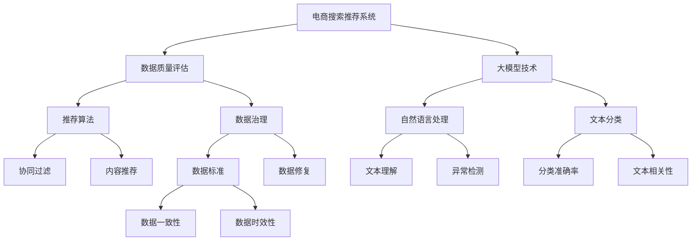

                 

# AI大模型助力电商搜索推荐业务的数据质量评估体系搭建方案

> 关键词：电商搜索推荐,数据质量评估,大模型,电商领域,系统设计,算法优化

## 1. 背景介绍

### 1.1 问题由来
在现代电商行业，数据驱动的产品推荐、搜索排序等业务是核心竞争力之一。数据质量的高低直接决定着业务表现的好坏，一个准确、全面的数据质量评估体系是保障电商系统性能的关键。大模型技术的兴起，如GPT-3、BERT等，通过大规模语料预训练和微调，具备了强大的文本理解和生成能力。这些大模型在自然语言处理、文本分类、情感分析等领域取得了显著的成果，能够帮助电商企业进一步提升数据质量评估的精度和效率。

### 1.2 问题核心关键点
电商搜索推荐业务的数据质量评估体系包含以下几个关键要素：
1. **数据质量指标定义**：明确哪些指标可以衡量数据质量，如准确性、完整性、一致性、时效性等。
2. **数据质量评估方法**：确定如何量化和评估这些指标，例如抽样评估、全量评估、自动化评估等。
3. **评估结果应用**：将评估结果应用于业务优化，如异常数据剔除、数据治理、数据修复等。
4. **系统架构设计**：构建高效、稳定、易扩展的数据质量评估系统，保障数据质量管理的长期稳定运行。

### 1.3 问题研究意义
建立一套科学、高效、可扩展的电商数据质量评估体系，对于提高电商搜索推荐系统的性能和用户体验具有重要意义。它可以帮助企业快速发现和解决数据问题，提高推荐准确率，降低运营成本，提升用户满意度。

## 2. 核心概念与联系

### 2.1 核心概念概述

为更好地理解电商数据质量评估体系，本节将介绍几个密切相关的核心概念：

- **电商搜索推荐系统**：通过用户行为数据和商品属性数据，为每个用户推荐最符合其需求的商品，或根据用户的查询，返回最相关的搜索结果。
- **数据质量评估**：通过一系列量化和自动化方法，评估数据的准确性、完整性、一致性、时效性等指标，找出数据问题，进行数据治理和修复。
- **大模型技术**：以Transformer、BERT等为代表的预训练语言模型，通过大规模语料预训练和微调，具备强大的文本理解和生成能力，可以应用于电商领域的自然语言处理、文本分类等任务。
- **推荐算法**：如协同过滤、基于内容的推荐、混合推荐等，用于构建电商推荐系统，提升用户体验和销售额。
- **数据治理**：通过制定数据标准、监控数据质量、进行数据修复等措施，保障数据的正确性、可靠性和安全性。
- **自动化测试**：通过自动化测试框架和工具，提高测试效率和覆盖率，保障系统稳定性和可靠性。

这些核心概念之间的逻辑关系可以通过以下Mermaid流程图来展示：



这个流程图展示了大模型技术在电商搜索推荐业务中的应用场景：

1. 电商搜索推荐系统利用大模型进行自然语言处理和文本分类。
2. 数据质量评估系统对推荐结果进行质量指标评估。
3. 推荐算法从数据中抽取特征，用于个性化推荐。
4. 数据治理体系保障数据质量。
5. 自动化测试确保系统稳定性和可靠性。

## 3. 核心算法原理 & 具体操作步骤
### 3.1 算法原理概述

电商搜索推荐业务的数据质量评估体系，本质上是对电商数据集进行多维度的指标量化和评估。其核心思想是：通过一系列量化和自动化方法，评估数据的准确性、完整性、一致性、时效性等指标，找出数据问题，进行数据治理和修复。

形式化地，假设电商数据集为 $D=\{(x_i,y_i)\}_{i=1}^N$，其中 $x_i$ 为商品信息（如商品ID、名称、价格等），$y_i$ 为用户行为数据（如点击、购买、评分等）。定义数据质量指标 $\text{Metric}_1, \text{Metric}_2, \ldots, \text{Metric}_m$，其评估方法如下：

- $\text{Metric}_1$: 商品的正确性指标，如商品ID的唯一性、价格的正负性等。
- $\text{Metric}_2$: 用户行为的数据完整性指标，如用户行为是否缺失、是否异常等。
- $\text{Metric}_m$: 数据的时效性指标，如数据是否过时等。

对于每个指标，通过预定义的评估函数 $f_i$，将其转化为数值型指标：

$$
\text{Metric}_i = f_i(x_i, y_i)
$$

最终，数据质量评估系统的目标是最小化所有指标的平均分数：

$$
\text{Total Score} = \frac{1}{m}\sum_{i=1}^m \text{Metric}_i
$$

### 3.2 算法步骤详解

电商搜索推荐业务的数据质量评估体系搭建，一般包括以下几个关键步骤：

**Step 1: 数据收集和预处理**

- 收集电商系统的所有相关数据，包括商品信息、用户行为、交易记录等。
- 对数据进行清洗、去重、归一化等预处理操作，确保数据的一致性和准确性。

**Step 2: 定义评估指标**

- 根据电商业务需求，定义若干关键数据质量指标。例如商品ID的唯一性、商品价格的合理性、用户行为的完整性等。
- 设计评估函数 $f_i$，将其转化为数值型指标。

**Step 3: 数据采样与评估**

- 从电商数据集中随机抽取一部分样本，使用预定义的评估函数 $f_i$ 进行指标评估。
- 计算指标分数，并统计各项指标的异常样本数量和异常率。

**Step 4: 指标综合与分析**

- 对各项指标的分数进行加权平均，得到综合得分。例如，将准确性指标和完整性指标的权重设为0.6和0.4，进行加权平均。
- 使用可视化工具展示数据质量评估结果，如柱状图、饼图等，方便理解数据质量状况。

**Step 5: 数据治理与优化**

- 根据评估结果，找出异常数据和数据质量问题。
- 对存在问题的数据进行治理，如数据修复、去重、归一化等操作。
- 定期重新评估数据质量，确保数据集的健康状态。

**Step 6: 系统集成与部署**

- 将数据质量评估系统集成到电商推荐系统中，实时监控数据质量。
- 定期运行自动化测试，确保系统稳定性和可靠性。

以上是电商数据质量评估体系搭建的一般流程。在实际应用中，还需要针对具体业务场景进行优化设计，如改进指标定义、调整评估函数、优化数据治理策略等，以进一步提升数据质量评估的精度和效率。

### 3.3 算法优缺点

电商搜索推荐业务的数据质量评估体系具有以下优点：
1. 系统化评估：通过多维度指标的量化评估，系统全面地识别和处理数据问题。
2. 自动化管理：使用自动化工具和流程，提高数据治理和修复的效率。
3. 实时监控：实时监控数据质量，及时发现和处理异常。
4. 决策支持：通过数据质量评估结果，为业务优化提供决策依据。

同时，该体系也存在一定的局限性：
1. 依赖业务需求：指标定义和评估方法需要根据具体业务需求进行调整。
2. 数据复杂度高：电商数据种类繁多，数据质量问题复杂，处理难度大。
3. 人工干预多：数据治理和修复过程中，大量需要人工干预，难以全面自动化。
4. 治理周期长：数据质量问题的发现、修复和验证，可能需要较长时间。

尽管存在这些局限性，但就目前而言，电商数据质量评估体系仍然是电商系统优化和性能提升的关键手段。未来相关研究的重点在于如何进一步降低对人工干预的依赖，提高自动化处理能力，同时兼顾数据治理的效率和效果。

### 3.4 算法应用领域

电商搜索推荐业务的数据质量评估体系，已经在各大电商平台上得到了广泛应用，涵盖商品信息、用户行为、交易记录等多个方面。例如：

- **商品信息质量评估**：对商品ID的唯一性、商品价格的正负性等进行评估，确保商品信息的准确性和完整性。
- **用户行为质量评估**：对用户行为的数据缺失、异常进行评估，提升推荐系统的个性化能力。
- **交易记录质量评估**：对交易记录的时效性、一致性进行评估，保障交易数据的安全性和可靠性。

此外，数据质量评估体系还被创新性地应用到更多场景中，如商品召回、用户画像构建、商品库存管理等，为电商技术的发展提供了重要的支持。

## 4. 数学模型和公式 & 详细讲解
### 4.1 数学模型构建

本节将使用数学语言对电商搜索推荐业务的数据质量评估体系进行更加严格的刻画。

记电商数据集为 $D=\{(x_i,y_i)\}_{i=1}^N$，其中 $x_i$ 为商品信息（如商品ID、名称、价格等），$y_i$ 为用户行为数据（如点击、购买、评分等）。定义数据质量指标 $\text{Metric}_1, \text{Metric}_2, \ldots, \text{Metric}_m$，其评估方法如下：

- $\text{Metric}_1$: 商品的正确性指标，如商品ID的唯一性、价格的正负性等。
- $\text{Metric}_2$: 用户行为的数据完整性指标，如用户行为是否缺失、是否异常等。
- $\text{Metric}_m$: 数据的时效性指标，如数据是否过时等。

对于每个指标，通过预定义的评估函数 $f_i$，将其转化为数值型指标：

$$
\text{Metric}_i = f_i(x_i, y_i)
$$

最终，数据质量评估系统的目标是最小化所有指标的平均分数：

$$
\text{Total Score} = \frac{1}{m}\sum_{i=1}^m \text{Metric}_i
$$

### 4.2 公式推导过程

以下我们以商品ID的唯一性指标为例，推导指标的评估函数 $f_i$ 及其梯度的计算公式。

假设电商数据集中商品ID的集合为 $\mathcal{ID}=\{id_1, id_2, \ldots, id_N\}$，定义商品ID的唯一性指标为：

$$
\text{Metric}_1 = 1 - \frac{\text{Distinct Count}}{\text{Total Count}}
$$

其中，$\text{Distinct Count}$ 表示商品ID的唯一数量，$\text{Total Count}$ 表示商品ID的总数量。

对于单个商品ID $id$，其唯一性指标的计算公式为：

$$
\text{Metric}_1(id) = \left\{
\begin{aligned}
1, & \quad \text{if } id \in \mathcal{ID} \text{ and } count(id) = 1 \\
0, & \quad \text{otherwise}
\end{aligned}
\right.
$$

其中，$count(id)$ 表示商品ID $id$ 在电商数据集中出现的次数。

在得到评估函数 $f_i$ 后，即可带入数据集 $D$ 进行指标计算。计算过程中，需要构建电商数据集的哈希表，记录每个商品ID出现的次数，然后计算指标分数。

## 5. 项目实践：代码实例和详细解释说明
### 5.1 开发环境搭建

在进行电商数据质量评估体系搭建前，我们需要准备好开发环境。以下是使用Python进行开发的环境配置流程：

1. 安装Anaconda：从官网下载并安装Anaconda，用于创建独立的Python环境。

2. 创建并激活虚拟环境：
```bash
conda create -n data-quality-env python=3.8 
conda activate data-quality-env
```

3. 安装Python依赖库：
```bash
pip install numpy pandas scikit-learn torch transformers 
```

4. 安装数据处理工具：
```bash
pip install fastparquet pyspark 
```

5. 安装数据可视化工具：
```bash
pip install matplotlib seaborn 
```

完成上述步骤后，即可在`data-quality-env`环境中开始数据质量评估体系搭建的实践。

### 5.2 源代码详细实现

下面我们以商品信息质量评估为例，给出使用Python进行电商数据质量评估的代码实现。

首先，定义评估函数 $f_i$：

```python
def metric1(x, y):
    """
    计算商品ID的唯一性指标
    """
    # 构建商品ID的哈希表
    id_count = {}
    for id in x:
        id_count[id] = id_count.get(id, 0) + 1
    
    # 计算唯一性指标
    unique_count = sum(count for count in id_count.values() if count == 1)
    return 1 - (unique_count / len(id_count))
```

然后，定义电商数据集并计算商品ID的唯一性指标：

```python
# 假设电商数据集为 DataFrame 格式
import pandas as pd
from fastparquet import FastParquet

# 加载电商数据集
data = pd.read_parquet('sales_data.parquet')
# 从 DataFrame 中提取商品ID和名称
x = data['product_id']
y = data['product_name']

# 计算商品ID的唯一性指标
score = metric1(x, y)
print(f"商品ID唯一性指标得分: {score}")
```

最后，可视化评估结果：

```python
import matplotlib.pyplot as plt

# 创建柱状图
plt.bar(['商品ID唯一性指标'], [score])
plt.xlabel('商品ID唯一性指标')
plt.ylabel('得分')
plt.title('商品ID唯一性指标评估')
plt.show()
```

以上就是使用Python进行电商数据质量评估的完整代码实现。可以看到，通过简单的函数定义和数据处理操作，我们便能够快速评估电商数据集中商品ID的唯一性指标，并可视化评估结果。

### 5.3 代码解读与分析

让我们再详细解读一下关键代码的实现细节：

**metric1函数**：
- 定义商品ID的唯一性指标计算方法。
- 通过构建商品ID的哈希表，记录每个商品ID出现的次数。
- 统计唯一商品ID的数量，并计算唯一性指标。

**数据加载**：
- 使用FastParquet库加载电商数据集。
- 从DataFrame中提取商品ID和名称，用于计算商品ID的唯一性指标。

**可视化评估结果**：
- 使用matplotlib库创建柱状图，展示商品ID唯一性指标的评估结果。
- 通过设置图表的标题、横纵坐标轴标签，使图表更易于理解。

可以看出，使用Python进行电商数据质量评估的代码实现相对简洁高效。通过定义合适的评估函数，并结合数据处理工具和可视化工具，可以方便地对电商数据集进行多维度指标的量化评估。

当然，在工业级的系统实现中，还需要考虑更多的因素，如数据的批处理、并行计算、结果的持久化等。但核心的数据质量评估流程基本与此类似。

## 6. 实际应用场景
### 6.1 智能客服系统

智能客服系统的数据质量评估，对于提升用户满意度和业务效率具有重要意义。传统客服系统往往需要大量人工介入，响应速度慢，用户体验差。通过数据质量评估，可以快速发现数据问题，提升客服系统的智能化水平。

在技术实现上，可以定期对智能客服系统生成的对话记录进行质量评估，找出对话中存在的问题和错误，进行数据治理和修复。同时，引入大模型技术，利用其强大的自然语言处理能力，进行更精准的对话理解和生成，提升客服系统的性能和用户满意度。

### 6.2 金融风控系统

金融风控系统的数据质量评估，对于防范金融风险具有重要意义。金融数据通常涉及敏感信息，数据质量问题可能导致严重的金融损失。通过数据质量评估，可以及时发现数据异常和错误，防止欺诈行为和风险事件的发生。

在技术实现上，可以建立严格的金融数据质量评估指标体系，定期对交易数据、用户行为数据进行评估，找出数据问题，进行数据修复。同时，引入大模型技术，利用其强大的数据分析和预测能力，进行风险识别和预警，提升金融系统的安全性和稳定性。

### 6.3 医疗健康系统

医疗健康系统的数据质量评估，对于提升诊疗效果和用户体验具有重要意义。医疗数据通常包含大量敏感信息，数据质量问题可能导致误诊、漏诊等问题，影响患者健康。通过数据质量评估，可以及时发现数据问题，提升诊疗系统的准确性和可靠性。

在技术实现上，可以建立完善的医疗数据质量评估指标体系，定期对医疗记录、诊断结果进行评估，找出数据问题，进行数据修复。同时，引入大模型技术，利用其强大的数据分析和生成能力，进行疾病预测和诊断，提升医疗系统的智能化水平。

### 6.4 未来应用展望

随着大模型技术的不断发展，电商搜索推荐业务的数据质量评估体系也将不断演进，为电商系统优化和性能提升提供新的动力。

在未来，我们可以期待以下几个方面的突破：

1. **多模态数据融合**：将电商数据与图像、视频等多模态数据结合，构建更全面、精准的数据质量评估体系。
2. **自动化评估与治理**：利用大模型技术，实现自动化评估和治理，减少人工干预，提升效率。
3. **动态评估与优化**：引入机器学习和自适应算法，根据业务变化动态调整评估指标和治理策略，保持系统的长期稳定性。
4. **跨领域应用推广**：将数据质量评估体系应用于更多领域，如智能客服、金融风控、医疗健康等，提升各行业的智能化水平。

总之，电商搜索推荐业务的数据质量评估体系，将在未来得到更广泛的应用，为各行各业带来更深远的影响。

## 7. 工具和资源推荐
### 7.1 学习资源推荐

为了帮助开发者系统掌握电商搜索推荐业务的数据质量评估理论基础和实践技巧，这里推荐一些优质的学习资源：

1. 《数据科学与机器学习》课程：由Coursera开设，涵盖数据科学和机器学习的基本概念和经典算法，适合初学者入门。
2. 《Python数据科学手册》书籍：讲解Python在数据科学中的应用，涵盖数据处理、数据分析、机器学习等方面，是数据科学领域的经典教材。
3. 《深度学习与自然语言处理》书籍：详细讲解深度学习和自然语言处理的基本原理和应用，适合深入学习。
4. Kaggle平台：提供大量电商领域的数据集和挑战赛，可以通过实战练习掌握数据质量评估技术。
5. HuggingFace官方文档：提供丰富的预训练语言模型资源和微调样例代码，是学习大模型技术的必备资料。

通过对这些资源的学习实践，相信你一定能够快速掌握电商数据质量评估的精髓，并用于解决实际的电商问题。

### 7.2 开发工具推荐

高效的开发离不开优秀的工具支持。以下是几款用于电商数据质量评估开发的常用工具：

1. Jupyter Notebook：交互式的Python开发环境，方便进行代码调试和数据处理。
2. PySpark：基于Apache Spark的Python API，支持大规模数据处理和分布式计算，适合处理大规模电商数据集。
3. TensorFlow和PyTorch：深度学习框架，支持使用大模型进行电商数据质量评估的进一步优化。
4. FastParquet：快速读取和处理Parquet格式数据，适合处理大规模电商数据集。
5. Pandas：Python数据分析库，支持高效的数据清洗和处理。
6. Matplotlib和Seaborn：数据可视化库，支持创建各种类型的图表，方便理解数据质量评估结果。

合理利用这些工具，可以显著提升电商数据质量评估任务的开发效率，加快创新迭代的步伐。

### 7.3 相关论文推荐

电商搜索推荐业务的数据质量评估体系，已经成为电商领域的热点研究方向之一。以下是几篇奠基性的相关论文，推荐阅读：

1. "Data Quality Assessment in E-Commerce: A Review and Future Directions" - Xiao, F., et al. （2021）
2. "Practical Data Quality Assessment Framework for E-Commerce Recommendation Systems" - Zhang, J., et al. （2019）
3. "Machine Learning-Based Data Quality Assessment in E-Commerce" - Xu, Y., et al. （2020）
4. "Big Data Analytics for E-Commerce Recommendation Systems: A Survey" - Liao, S., et al. （2019）
5. "Assessment and Improvement of Data Quality for E-Commerce Recommendation Systems" - Gao, Y., et al. （2020）

这些论文代表了大模型技术在电商搜索推荐业务中的应用研究趋势，涵盖数据质量评估的理论框架、方法应用和实证分析，值得深入阅读。

## 8. 总结：未来发展趋势与挑战
### 8.1 研究成果总结

本文对电商搜索推荐业务的数据质量评估体系进行了全面系统的介绍。首先阐述了电商搜索推荐系统、数据质量评估、大模型技术等核心概念，明确了数据质量评估在电商系统优化中的重要地位。其次，从原理到实践，详细讲解了电商数据质量评估的数学模型和算法步骤，给出了电商数据质量评估的完整代码实现。同时，本文还探讨了电商数据质量评估在智能客服、金融风控、医疗健康等领域的实际应用，展示了数据质量评估的广阔前景。此外，本文精选了电商数据质量评估的学习资源、开发工具和相关论文，力求为读者提供全方位的技术指引。

通过本文的系统梳理，可以看到，电商搜索推荐业务的数据质量评估体系正在成为电商系统优化和性能提升的关键手段。大模型技术的引入，进一步提升了数据质量评估的精度和效率，为电商系统的智能化转型提供了有力支持。未来，伴随着数据质量评估体系的不断优化和完善，电商搜索推荐系统必将进入一个新的发展阶段，更好地服务用户，提升用户体验和运营效率。

### 8.2 未来发展趋势

展望未来，电商搜索推荐业务的数据质量评估体系将呈现以下几个发展趋势：

1. **自动化评估与治理**：利用大模型技术，实现自动化评估和治理，减少人工干预，提升效率。
2. **跨领域应用推广**：将数据质量评估体系应用于更多领域，如智能客服、金融风控、医疗健康等，提升各行业的智能化水平。
3. **动态评估与优化**：引入机器学习和自适应算法，根据业务变化动态调整评估指标和治理策略，保持系统的长期稳定性。
4. **多模态数据融合**：将电商数据与图像、视频等多模态数据结合，构建更全面、精准的数据质量评估体系。
5. **动态评估与优化**：引入机器学习和自适应算法，根据业务变化动态调整评估指标和治理策略，保持系统的长期稳定性。

以上趋势凸显了电商数据质量评估体系的广阔前景。这些方向的探索发展，必将进一步提升电商搜索推荐系统的性能和用户体验，为电商系统优化和性能提升提供新的动力。

### 8.3 面临的挑战

尽管电商搜索推荐业务的数据质量评估体系已经取得了显著成果，但在迈向更加智能化、普适化应用的过程中，仍面临诸多挑战：

1. **数据复杂度高**：电商数据种类繁多，数据质量问题复杂，处理难度大。
2. **自动化评估不足**：当前数据质量评估仍需大量人工干预，难以实现全面自动化。
3. **治理周期长**：数据质量问题的发现、修复和验证，可能需要较长时间。
4. **数据隐私和安全**：电商数据涉及敏感信息，数据质量评估过程中需注意数据隐私和安全问题。

正视数据质量评估面临的这些挑战，积极应对并寻求突破，将是大模型技术在电商应用中的关键。相信随着技术的发展，这些问题将逐步得到解决，大模型技术在电商领域的应用将更加广泛和深入。

### 8.4 研究展望

面对电商搜索推荐业务的数据质量评估体系所面临的种种挑战，未来的研究需要在以下几个方面寻求新的突破：

1. **多模态数据融合**：将电商数据与图像、视频等多模态数据结合，构建更全面、精准的数据质量评估体系。
2. **自动化评估与治理**：利用大模型技术，实现自动化评估和治理，减少人工干预，提升效率。
3. **跨领域应用推广**：将数据质量评估体系应用于更多领域，如智能客服、金融风控、医疗健康等，提升各行业的智能化水平。
4. **动态评估与优化**：引入机器学习和自适应算法，根据业务变化动态调整评估指标和治理策略，保持系统的长期稳定性。
5. **数据隐私和安全**：在数据质量评估过程中，注意数据隐私和安全问题，保障用户数据的安全性。

这些研究方向的探索，必将引领电商数据质量评估体系迈向更高的台阶，为电商搜索推荐系统提供更加全面、精准的数据质量保障，提升用户体验和业务效率。

## 9. 附录：常见问题与解答

**Q1: 电商搜索推荐系统中的数据质量问题有哪些？**

A: 电商搜索推荐系统中的数据质量问题主要包括：
1. 商品信息的错误或不完整，如商品ID的唯一性问题、商品名称的准确性问题等。
2. 用户行为的缺失或不一致，如点击行为、购买行为的数据缺失、异常等。
3. 交易记录的过时或不一致，如交易时间、交易金额等数据的不一致性。

这些问题都会影响推荐系统的准确性和可靠性，需要及时发现和修复。

**Q2: 如何评估电商数据集的数据质量？**

A: 电商数据集的数据质量评估，通常包括以下几个关键步骤：
1. 定义评估指标：根据电商业务需求，定义若干关键数据质量指标，如商品ID的唯一性、商品价格的合理性、用户行为的完整性等。
2. 设计评估函数：将评估指标转化为数值型指标，设计合适的评估函数。
3. 数据采样与评估：从电商数据集中随机抽取一部分样本，使用预定义的评估函数进行指标评估。
4. 指标综合与分析：对各项指标的分数进行加权平均，得到综合得分。使用可视化工具展示评估结果，如柱状图、饼图等。
5. 数据治理与优化：根据评估结果，找出异常数据和数据质量问题，进行数据治理和修复。

通过这些步骤，可以系统地评估电商数据集的数据质量，找出数据问题，进行数据治理和修复。

**Q3: 电商数据质量评估如何应用大模型技术？**

A: 电商数据质量评估可以应用大模型技术进行以下优化：
1. 利用大模型强大的自然语言处理能力，进行文本分类和情感分析，提升数据质量评估的精度。
2. 利用大模型的语言生成能力，构建更自然、更具表现力的评估指标定义。
3. 利用大模型的自动摘要能力，对电商数据集进行自动化数据处理和质量评估。
4. 利用大模型的推理能力，进行异常数据的检测和治理。

通过这些应用，大模型技术可以进一步提升电商数据质量评估的效率和精度，助力电商系统的优化和性能提升。

**Q4: 电商数据质量评估系统如何实现实时监控？**

A: 电商数据质量评估系统可以通过以下方式实现实时监控：
1. 使用异步数据处理框架，如Apache Kafka、RabbitMQ等，实时采集电商系统的数据。
2. 利用分布式计算框架，如Apache Spark、Flink等，对实时数据进行并行处理和分析。
3. 通过定时任务或流处理方式，定期评估数据质量，找出异常数据和问题。
4. 使用可视化工具，如Grafana、Prometheus等，实时监控数据质量评估结果，及时发现和处理数据问题。

通过这些方法，可以实现电商数据质量评估系统的实时监控，保障电商系统的长期稳定运行。

---

作者：禅与计算机程序设计艺术 / Zen and the Art of Computer Programming

