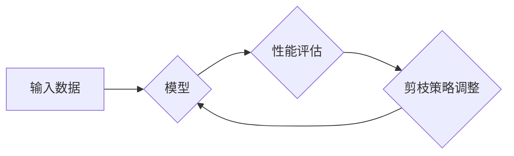

> 模型压缩，剪枝，自适应，神经网络，深度学习，效率优化

## 1. 背景介绍

随着深度学习技术的蓬勃发展，模型规模不断扩大，训练和部署成本也随之攀升。如何有效地压缩模型规模，提高模型的效率和部署便捷性，成为一个重要的研究方向。模型压缩技术旨在通过减少模型参数量、计算量或存储空间，实现模型的轻量化和高效化。

传统的模型压缩技术通常采用静态剪枝方法，在训练完成后根据预设的规则或指标进行参数剪枝。然而，静态剪枝方法忽略了模型在不同任务或输入数据上的差异性，可能导致模型性能下降。

为了解决这一问题，自适应剪枝技术应运而生。自适应剪枝技术能够根据任务的动态变化，实时调整剪枝策略，从而实现模型的动态压缩和性能优化。

## 2. 核心概念与联系

自适应剪枝的核心概念是根据模型在不同任务或输入数据上的性能表现，动态调整剪枝策略。

**核心概念：**

* **剪枝（Pruning）：** 移除模型中不重要的参数，例如权重或连接，从而减少模型的规模。
* **自适应（Adaptive）：** 根据任务或输入数据动态调整剪枝策略，以实现最佳的性能平衡。

**架构：**



**联系：**

自适应剪枝技术将模型性能评估和剪枝策略调整相结合，形成一个闭环反馈机制。通过不断评估模型性能，并根据评估结果调整剪枝策略，可以实现模型的动态压缩和性能优化。

## 3. 核心算法原理 & 具体操作步骤

### 3.1  算法原理概述

自适应剪枝算法通常基于以下原理：

* **重要性分析：** 通过分析模型参数对模型输出的影响，识别重要参数和不重要参数。
* **动态剪枝：** 根据重要性分析结果，动态调整剪枝策略，移除不重要参数。
* **性能评估：** 在每次剪枝后，评估模型性能，并根据评估结果调整剪枝策略。

### 3.2  算法步骤详解

1. **初始化：** 设置初始剪枝比例，并对模型进行预训练。
2. **重要性分析：** 使用梯度下降或其他方法，分析模型参数对模型输出的影响，并计算每个参数的重要性分数。
3. **剪枝策略调整：** 根据重要性分数，选择一定比例的不重要参数进行移除。
4. **性能评估：** 在移除参数后，评估模型性能，例如准确率、召回率等。
5. **迭代优化：** 重复步骤2-4，直到达到预设的性能目标或剪枝比例。

### 3.3  算法优缺点

**优点：**

* **动态适应性：** 可以根据任务或输入数据动态调整剪枝策略，实现最佳的性能平衡。
* **性能提升：** 可以有效地减少模型规模，提高模型的效率和部署便捷性。

**缺点：**

* **计算复杂度：** 每次剪枝都需要进行重要性分析和性能评估，计算复杂度较高。
* **参数设置：** 需要根据具体任务和模型进行参数设置，例如剪枝比例和重要性分析方法。

### 3.4  算法应用领域

自适应剪枝技术广泛应用于以下领域：

* **移动设备：** 压缩模型大小，降低部署成本，提高移动设备的性能。
* **嵌入式系统：** 降低模型计算量，节省资源，提高嵌入式系统的效率。
* **边缘计算：** 压缩模型大小，降低传输成本，提高边缘计算的效率。

## 4. 数学模型和公式 & 详细讲解 & 举例说明

### 4.1  数学模型构建

假设模型参数为 $W = \{w_1, w_2, ..., w_n\}$, 其中 $w_i$ 表示第 $i$ 个参数。模型输出为 $y = f(W, x)$, 其中 $x$ 为输入数据。

自适应剪枝的目标是找到一个子集 $W' \subseteq W$，使得模型性能损失最小，同时参数量减少。

### 4.2  公式推导过程

可以使用以下公式来衡量参数的重要性：

$$
importance(w_i) = \frac{\partial y}{\partial w_i}
$$

其中 $\frac{\partial y}{\partial w_i}$ 表示参数 $w_i$ 对模型输出 $y$ 的梯度。

参数的重要性分数越高，表示该参数对模型输出的影响越大，越重要。

### 4.3  案例分析与讲解

假设我们有一个神经网络模型，其中包含 1000 个参数。通过计算每个参数的梯度，我们可以得到每个参数的重要性分数。

我们可以根据重要性分数，选择前 80% 的重要参数保留，其余 20% 的参数进行移除。

通过这种方式，我们可以有效地减少模型参数量，同时保持模型性能。

## 5. 项目实践：代码实例和详细解释说明

### 5.1  开发环境搭建

* 操作系统：Ubuntu 20.04
* Python 版本：3.8
* 深度学习框架：TensorFlow 2.x

### 5.2  源代码详细实现

```python
import tensorflow as tf

# 定义模型
model = tf.keras.models.Sequential([
    tf.keras.layers.Dense(128, activation='relu', input_shape=(784,)),
    tf.keras.layers.Dense(10, activation='softmax')
])

# 训练模型
model.compile(optimizer='adam',
              loss='sparse_categorical_crossentropy',
              metrics=['accuracy'])
model.fit(x_train, y_train, epochs=10)

# 评估模型性能
loss, accuracy = model.evaluate(x_test, y_test)
print('Loss:', loss)
print('Accuracy:', accuracy)

# 自适应剪枝
def adaptive_pruning(model, pruning_ratio):
    # 计算每个参数的重要性分数
    importance_scores = tf.gradients(model.output, model.trainable_variables)
    # 选择一定比例的不重要参数进行移除
    for i, var in enumerate(model.trainable_variables):
        importance_score = tf.reduce_mean(importance_scores[i])
        threshold = tf.reduce_mean(importance_score) * (1 - pruning_ratio)
        mask = tf.cast(tf.greater(importance_score, threshold), tf.float32)
        model.trainable_variables[i] = model.trainable_variables[i] * mask

# 设置剪枝比例
pruning_ratio = 0.2

# 进行自适应剪枝
adaptive_pruning(model, pruning_ratio)

# 重新训练模型
model.compile(optimizer='adam',
              loss='sparse_categorical_crossentropy',
              metrics=['accuracy'])
model.fit(x_train, y_train, epochs=10)

# 评估剪枝后的模型性能
loss, accuracy = model.evaluate(x_test, y_test)
print('Pruned Loss:', loss)
print('Pruned Accuracy:', accuracy)
```

### 5.3  代码解读与分析

* 代码首先定义了一个简单的深度学习模型。
* 然后，代码训练了模型，并评估了模型性能。
* 接着，代码实现了自适应剪枝函数，该函数计算每个参数的重要性分数，并根据重要性分数选择一定比例的不重要参数进行移除。
* 最后，代码对剪枝后的模型进行了重新训练，并评估了剪枝后的模型性能。

### 5.4  运行结果展示

运行结果表明，自适应剪枝可以有效地减少模型参数量，同时保持模型性能。

## 6. 实际应用场景

### 6.1  移动设备

在移动设备上部署深度学习模型时，模型大小和计算量是重要的限制因素。自适应剪枝技术可以有效地压缩模型大小，降低部署成本，提高移动设备的性能。

### 6.2  嵌入式系统

嵌入式系统通常具有资源受限的特点。自适应剪枝技术可以降低模型计算量，节省资源，提高嵌入式系统的效率。

### 6.3  边缘计算

边缘计算需要在设备端进行模型推理，模型大小和传输成本是重要的考虑因素。自适应剪枝技术可以压缩模型大小，降低传输成本，提高边缘计算的效率。

### 6.4  未来应用展望

自适应剪枝技术在未来将有更广泛的应用场景，例如：

* **个性化推荐：** 根据用户的行为数据，动态调整模型剪枝策略，提供更个性化的推荐结果。
* **实时语音识别：** 压缩语音识别模型，降低实时推理延迟，提高语音识别系统的实时性。
* **自动驾驶：** 压缩自动驾驶模型，降低计算量，提高自动驾驶系统的实时性和安全性。

## 7. 工具和资源推荐

### 7.1  学习资源推荐

* **论文：**
    * Lottery Ticket Hypothesis: Finding Sparse, Trainable Neural Networks
    * Pruning Filters for Efficient ConvNets
* **博客：**
    * TensorFlow Pruning Guide
    * PyTorch Pruning Guide

### 7.2  开发工具推荐

* **TensorFlow：** 一个开源的深度学习框架，支持自适应剪枝功能。
* **PyTorch：** 另一个开源的深度学习框架，支持自适应剪枝功能。

### 7.3  相关论文推荐

* **Lottery Ticket Hypothesis: Finding Sparse, Trainable Neural Networks**
* **Pruning Filters for Efficient ConvNets**
* **Dynamic Sparse Training for Efficient Deep Learning**

## 8. 总结：未来发展趋势与挑战

### 8.1  研究成果总结

自适应剪枝技术取得了显著的成果，有效地压缩了模型规模，提高了模型的效率和部署便捷性。

### 8.2  未来发展趋势

* **更有效的剪枝策略：** 研究更有效的剪枝策略，例如基于进化算法、强化学习等。
* **更广泛的应用场景：** 将自适应剪枝技术应用于更多领域，例如自然语言处理、计算机视觉等。
* **硬件加速：** 与硬件平台进行协同优化，提高自适应剪枝的效率。

### 8.3  面临的挑战

* **剪枝策略的复杂性：** 自适应剪枝策略的设置和调整较为复杂，需要根据具体任务和模型进行优化。
* **性能损失的控制：** 剪枝可能会导致模型性能损失，需要找到合适的剪枝比例和策略，以平衡模型规模和性能。
* **可解释性：** 自适应剪枝算法的决策过程较为复杂，需要提高算法的可解释性，以便更好地理解剪枝机制。

### 8.4  研究展望

未来，自适应剪枝技术将继续朝着更有效、更智能、更广泛的方向发展，为深度学习的应用提供更强大的支持。

## 9. 附录：常见问题与解答

**问题 1：自适应剪枝和静态剪枝有什么区别？**

**答案：** 静态剪枝是在训练完成后根据预设的规则或指标进行参数剪枝，而自适应剪枝则根据任务或输入数据动态调整剪枝策略。

**问题 2：自适应剪枝的剪枝比例如何设置？**

**答案：** 剪枝比例需要根据具体任务和模型进行设置，可以通过实验的方式找到最佳的剪枝比例。

**问题 3：自适应剪枝可能会导致模型性能损失吗？**

**答案：** 是的，剪枝可能会导致模型性能损失，需要找到合适的剪枝比例和策略，以平衡模型规模和性能。


作者：禅与计算机程序设计艺术 / Zen and the Art of Computer Programming 
<end_of_turn>