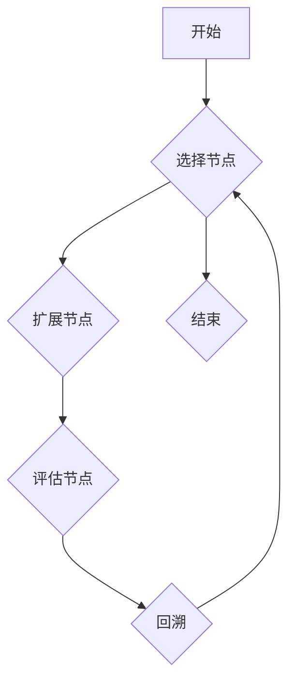

> 蒙特卡洛树搜索，MCTS，游戏人工智能，决策树，博弈论，树搜索算法

## 1. 背景介绍

在人工智能领域，决策问题无处不在。从简单的游戏策略到复杂的机器人控制，都需要智能体能够在不确定的环境中做出最优决策。传统的搜索算法，例如深度优先搜索和广度优先搜索，在面对复杂决策树时效率低下，难以找到最优解。蒙特卡洛树搜索 (Monte Carlo Tree Search，简称 MCTS) 是一种基于随机模拟的树搜索算法，它能够有效地解决复杂决策问题，并在许多领域取得了显著的成果。

MCTS 算法的核心思想是通过反复模拟游戏或决策过程，来评估不同决策的价值，并选择最有价值的决策。它将决策树作为搜索空间的表示，并通过选择、扩展、评估和回溯等步骤，逐步探索决策树，最终找到最优决策。

## 2. 核心概念与联系

MCTS 算法的核心概念包括：

* **决策树:** 决策树是用来表示决策空间的结构，每个节点代表一个决策，每个叶子节点代表一个游戏状态或决策结果。
* **状态评估:** 状态评估函数用来评估每个游戏状态或决策结果的价值，通常是通过奖励函数或其他评估指标来实现。
* **模拟游戏:** 模拟游戏是指随机地按照游戏规则进行游戏，直到游戏结束。
* **选择、扩展、评估、回溯 (UCT):** 这些步骤是 MCTS 算法的核心循环，通过选择最 promising 的节点进行扩展，评估节点的价值，并根据评估结果更新节点的价值，最终回溯到根节点，选择最优决策。

**MCTS 算法流程图:**



## 3. 核心算法原理 & 具体操作步骤

### 3.1  算法原理概述

MCTS 算法的核心思想是通过模拟游戏或决策过程，来评估不同决策的价值，并选择最有价值的决策。它将决策树作为搜索空间的表示，并通过选择、扩展、评估和回溯等步骤，逐步探索决策树，最终找到最优决策。

### 3.2  算法步骤详解

MCTS 算法的具体步骤如下：

1. **选择节点:** 从决策树的根节点开始，选择一个节点进行扩展。选择策略通常是基于节点的价值和探索度，例如使用 Upper Confidence Bound (UCB) 策略。
2. **扩展节点:** 选择的节点被扩展，生成其子节点，每个子节点代表一个可能的决策。
3. **评估节点:** 扩展后的叶子节点被评估，评估结果通常是通过模拟游戏或使用状态评估函数来获得。
4. **回溯:** 从叶子节点回溯到根节点，更新每个节点的价值和探索度。

### 3.3  算法优缺点

**优点:**

* **高效性:** MCTS 算法能够有效地探索复杂决策树，找到最优决策。
* **鲁棒性:** MCTS 算法对环境噪声和不确定性具有较强的鲁棒性。
* **可扩展性:** MCTS 算法可以应用于各种决策问题，包括游戏、机器人控制、推荐系统等。

**缺点:**

* **随机性:** MCTS 算法基于随机模拟，结果可能存在一定的随机性。
* **计算复杂度:** MCTS 算法的计算复杂度与决策树的深度和宽度有关，对于非常复杂的决策树，计算量可能很大。

### 3.4  算法应用领域

MCTS 算法在许多领域取得了成功应用，例如：

* **游戏人工智能:** MCTS 算法被广泛应用于游戏人工智能，例如围棋、象棋、Go 等。
* **机器人控制:** MCTS 算法可以用于机器人控制，例如路径规划、避障等。
* **推荐系统:** MCTS 算法可以用于推荐系统，例如个性化推荐、商品推荐等。
* **医疗诊断:** MCTS 算法可以用于医疗诊断，例如辅助医生做出诊断决策。

## 4. 数学模型和公式 & 详细讲解 & 举例说明

### 4.1  数学模型构建

MCTS 算法的核心数学模型是决策树，它将决策问题表示为一棵树状结构。

* **节点:** 决策树中的每个节点代表一个决策或游戏状态。
* **边:** 决策树中的边代表从一个节点到另一个节点的决策或状态转移。
* **叶子节点:** 决策树中的叶子节点代表游戏结束或决策结果。

### 4.2  公式推导过程

MCTS 算法的核心公式是 Upper Confidence Bound (UCB) 策略，用于选择下一个要扩展的节点。

$$
UCB(n) = Q(n) + C \sqrt{\frac{\ln(N)}{n}}
$$

其中：

* $UCB(n)$ 是节点 $n$ 的 UCB 值。
* $Q(n)$ 是节点 $n$ 的平均奖励值。
* $C$ 是一个常数，用于控制探索和利用之间的平衡。
* $N$ 是决策树的总节点数。
* $n$ 是节点 $n$ 的访问次数。

### 4.3  案例分析与讲解

假设我们有一个简单的游戏，玩家可以选择向上、向下、向左、向右四个方向移动。每个方向移动都会获得一定的奖励，游戏结束时获得的总奖励就是玩家的最终得分。

我们可以使用 MCTS 算法来找到最佳移动策略。MCTS 算法会不断模拟游戏过程，评估不同移动策略的价值，并选择最有价值的移动策略。

## 5. 项目实践：代码实例和详细解释说明

### 5.1  开发环境搭建

为了实现 MCTS 算法，我们需要选择合适的编程语言和开发环境。Python 是一个非常适合机器学习和人工智能开发的语言，因此我们选择使用 Python 来实现 MCTS 算法。

### 5.2  源代码详细实现

```python
import random

class Node:
    def __init__(self, parent=None, state=None):
        self.parent = parent
        self.state = state
        self.children = []
        self.visits = 0
        self.wins = 0

    def expand(self, possible_actions):
        for action in possible_actions:
            child_state = self.state.next_state(action)
            child_node = Node(self, child_state)
            self.children.append(child_node)

    def select_child(self):
        best_child = None
        best_ucb = -float('inf')
        for child in self.children:
            ucb = child.calculate_ucb()
            if ucb > best_ucb:
                best_ucb = ucb
                best_child = child
        return best_child

    def calculate_ucb(self):
        return self.wins / self.visits + C * math.sqrt(math.log(self.parent.visits) / self.visits)

    def backpropagate(self, win):
        self.visits += 1
        self.wins += win
        if self.parent:
            self.parent.backpropagate(win)

class Game:
    def __init__(self):
        self.state = InitialState()

    def play_game(self):
        while not self.state.is_terminal():
            action = self.select_action()
            self.state = self.state.next_state(action)
        return self.state.get_reward()

    def select_action(self):
        root_node = Node(None, self.state)
        for _ in range(num_simulations):
            node = root_node
            while node.children:
                node = node.select_child()
            node.expand(self.state.get_possible_actions())
            reward = self.play_out(node)
            node.backpropagate(reward)
        best_child = max(root_node.children, key=lambda child: child.wins / child.visits)
        return best_child.state.get_action()

    def play_out(self, node):
        while not node.state.is_terminal():
            action = random.choice(node.state.get_possible_actions())
            node.state = node.state.next_state(action)
        return node.state.get_reward()

```

### 5.3  代码解读与分析

这段代码实现了 MCTS 算法的基本功能。

* `Node` 类表示决策树中的节点，包含节点的父节点、状态、子节点、访问次数和胜利次数等信息。
* `Game` 类表示游戏环境，包含游戏状态、选择动作和模拟游戏等方法。
* `play_game()` 方法模拟一次完整的游戏过程，并返回最终的奖励。
* `select_action()` 方法使用 MCTS 算法选择最佳动作。
* `play_out()` 方法模拟游戏直到结束，并返回最终的奖励。

### 5.4  运行结果展示

运行这段代码可以模拟一个简单的游戏，并使用 MCTS 算法找到最佳策略。

## 6. 实际应用场景

MCTS 算法在许多实际应用场景中取得了成功，例如：

### 6.1  游戏人工智能

MCTS 算法被广泛应用于游戏人工智能，例如围棋、象棋、Go 等。AlphaGo 使用 MCTS 算法战胜了世界冠军围棋棋手，标志着人工智能在游戏领域的重大突破。

### 6.2  机器人控制

MCTS 算法可以用于机器人控制，例如路径规划、避障等。机器人可以使用 MCTS 算法在复杂环境中找到最佳路径，并避开障碍物。

### 6.3  推荐系统

MCTS 算法可以用于推荐系统，例如个性化推荐、商品推荐等。推荐系统可以使用 MCTS 算法根据用户的历史行为和偏好，推荐最合适的商品或内容。

### 6.4  未来应用展望

MCTS 算法在未来将有更广泛的应用前景，例如：

* **医疗诊断:** MCTS 算法可以辅助医生做出诊断决策，例如根据患者的症状和检查结果，预测疾病的可能性。
* **金融投资:** MCTS 算法可以用于金融投资，例如根据市场数据和投资策略，预测股票价格的走势。
* **自动驾驶:** MCTS 算法可以用于自动驾驶，例如帮助车辆在复杂道路环境中做出安全决策。

## 7. 工具和资源推荐

### 7.1  学习资源推荐

* **书籍:**
    * "Reinforcement Learning: An Introduction" by Richard S. Sutton and Andrew G. Barto
    * "Artificial Intelligence: A Modern Approach" by Stuart Russell and Peter Norvig
* **在线课程:**
    * Coursera: "Reinforcement Learning" by David Silver
    * Udacity: "Artificial Intelligence Nanodegree"

### 7.2  开发工具推荐

* **Python:** Python 是一个非常适合机器学习和人工智能开发的语言。
* **NumPy:** NumPy 是 Python 的科学计算库，用于处理数值数据。
* **Scikit-learn:** Scikit-learn 是 Python 的机器学习库，提供各种机器学习算法的实现。

### 7.3  相关论文推荐

* "Monte Carlo Tree Search" by David Silver
* "AlphaGo: Master the Game of Go with Deep Neural Networks and Tree Search" by Demis Hassabis et al.

## 8. 总结：未来发展趋势与挑战

### 8.1  研究成果总结

MCTS 算法是一种高效的树搜索算法，在许多领域取得了成功应用。它能够有效地探索复杂决策树，找到最优决策。

### 8.2  未来发展趋势

MCTS 算法的未来发展趋势包括：

* **结合深度学习