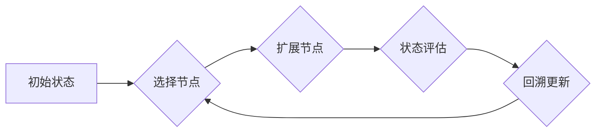

> 蒙特卡罗树搜索 (MCTS), 游戏人工智能,决策树, 决策优化, 概率计算, 算法原理, 代码实现

## 1. 背景介绍

在人工智能领域，决策问题无处不在。从游戏 AI 的策略选择到机器人控制的路径规划，都需要高效、智能的决策机制。蒙特卡罗树搜索 (Monte Carlo Tree Search, MCTS) 作为一种强大的决策算法，在解决复杂决策问题方面展现出非凡的潜力。

MCTS 算法的核心思想是通过模拟多个随机的游戏路径，并根据路径的结果来评估不同决策的价值，从而选择最优的行动。它结合了蒙特卡罗方法的随机性与决策树的结构化，在有限计算资源下，能够有效地探索决策空间，找到近似最优的策略。

## 2. 核心概念与联系

MCTS 算法的核心概念包括：

* **决策树:** MCTS 将决策问题抽象为一棵决策树，树的根节点代表当前状态，每个分支代表一个可能的行动，叶子节点代表游戏结束的状态。
* **状态评估:** 评估叶子节点的价值，通常通过奖励函数或游戏结果来实现。
* **树搜索:** 从根节点开始，通过选择具有最高价值的节点进行向下扩展，直到到达叶子节点。
* **回溯更新:** 从叶子节点回溯到根节点，根据路径上的状态评估值更新节点的价值，并引导后续搜索。

**MCTS 算法流程图:**



## 3. 核心算法原理 & 具体操作步骤

### 3.1  算法原理概述

MCTS 算法的核心思想是通过模拟多个随机的游戏路径，并根据路径的结果来评估不同决策的价值。它通过以下步骤实现：

1. **选择节点:** 从当前状态开始，选择具有最高价值的节点进行扩展。
2. **扩展节点:** 在选中的节点下扩展新的节点，代表可能的行动。
3. **状态评估:** 评估扩展节点的状态，通常通过奖励函数或游戏结果来实现。
4. **回溯更新:** 从扩展节点回溯到根节点，根据路径上的状态评估值更新节点的价值，并引导后续搜索。

### 3.2  算法步骤详解

1. **初始化:** 建立决策树，根节点代表初始状态。
2. **选择:** 从根节点开始，选择具有最高价值的节点进行扩展。选择策略通常采用贪婪策略，选择价值最高的节点，或者采用其他启发式策略，例如UCT (Upper Confidence Bound 1)。
3. **扩展:** 在选中的节点下扩展新的节点，代表可能的行动。
4. **模拟:** 从扩展节点开始，随机模拟游戏路径，直到到达叶子节点。
5. **评估:** 评估叶子节点的状态，获得奖励值。
6. **回溯更新:** 从叶子节点回溯到根节点，根据路径上的奖励值更新节点的价值。
7. **重复:** 重复步骤2-6，直到达到预设的搜索次数或时间限制。
8. **选择行动:** 选择具有最高价值的根节点对应的行动。

### 3.3  算法优缺点

**优点:**

* **高效:** MCTS 算法能够在有限计算资源下有效地探索决策空间。
* **灵活:** MCTS 算法可以应用于各种决策问题，包括游戏、机器人控制、推荐系统等。
* **可解释性:** MCTS 算法的决策过程相对透明，可以分析决策树来理解算法的决策逻辑。

**缺点:**

* **随机性:** MCTS 算法的决策结果受到随机模拟的影响，可能存在一定的波动性。
* **探索-利用权衡:** MCTS 算法需要平衡探索新节点和利用已知信息，找到合适的权衡策略至关重要。
* **状态空间复杂度:** 当状态空间非常庞大时，MCTS 算法的效率可能会下降。

### 3.4  算法应用领域

MCTS 算法在以下领域具有广泛的应用:

* **游戏 AI:** 许多流行的游戏，例如围棋、Go、象棋等，都采用了 MCTS 算法来实现 AI 对手的智能决策。
* **机器人控制:** MCTS 算法可以用于机器人路径规划、任务分配等决策问题。
* **推荐系统:** MCTS 算法可以用于个性化推荐，根据用户的历史行为和偏好推荐合适的商品或内容。
* **金融建模:** MCTS 算法可以用于金融风险管理、投资决策等领域。

## 4. 数学模型和公式 & 详细讲解 & 举例说明

### 4.1  数学模型构建

MCTS 算法的核心数学模型是决策树，每个节点代表一个状态，每个分支代表一个可能的行动。节点的价值通常用一个实数表示，代表该节点对应的策略的价值。

### 4.2  公式推导过程

MCTS 算法的核心公式是节点价值的更新公式：

$$
V(s) = \frac{N(s) \cdot Q(s)}{N(s)}
$$

其中：

* $V(s)$ 是节点 $s$ 的价值。
* $N(s)$ 是节点 $s$ 的访问次数。
* $Q(s)$ 是节点 $s$ 的累计奖励。

### 4.3  案例分析与讲解

假设我们有一个简单的游戏，玩家可以选择向上、向下、向左、向右四个方向移动。每个方向移动的奖励值分别为 1、-1、0、0。

我们可以使用 MCTS 算法来学习最优的移动策略。

在 MCTS 算法的执行过程中，我们会不断地模拟游戏路径，并根据路径上的奖励值更新节点的价值。最终，我们能够找到具有最高价值的根节点对应的行动，即最优的移动策略。

## 5. 项目实践：代码实例和详细解释说明

### 5.1  开发环境搭建

为了实现 MCTS 算法，我们需要选择合适的编程语言和开发环境。Python 是一个非常适合机器学习和人工智能开发的语言，因此我们选择使用 Python 来实现 MCTS 算法。

### 5.2  源代码详细实现

```python
import random

class Node:
    def __init__(self, state, parent=None):
        self.state = state
        self.parent = parent
        self.children = []
        self.visits = 0
        self.wins = 0

    def expand(self, actions):
        for action in actions:
            child_state = self.state.next_state(action)
            child = Node(child_state, self)
            self.children.append(child)

    def select(self):
        best_child = None
        best_value = float('-inf')
        for child in self.children:
            value = child.visits * 1.0 / (child.visits + 1)
            if value > best_value:
                best_value = value
                best_child = child
        return best_child

    def backpropagate(self, win):
        self.visits += 1
        self.wins += win
        if self.parent:
            self.parent.backpropagate(win)

def mcts(root_node, iterations):
    for _ in range(iterations):
        node = root_node
        while node.children:
            node = node.select()
        node.expand(node.state.get_actions())
        win = node.state.simulate()
        node.backpropagate(win)
    return root_node.children[0]

```

### 5.3  代码解读与分析

* **Node 类:** 定义了决策树中的节点结构，包含状态信息、父节点信息、子节点列表、访问次数、胜利次数等属性。
* **expand() 方法:** 在节点下扩展新的子节点，代表可能的行动。
* **select() 方法:** 选择具有最高价值的子节点进行扩展。
* **backpropagate() 方法:** 从叶子节点回溯到根节点，更新节点的访问次数和胜利次数。
* **mcts() 函数:** 执行 MCTS 算法，传入根节点和迭代次数，返回具有最高价值的叶子节点。

### 5.4  运行结果展示

运行上述代码，可以模拟 MCTS 算法在简单游戏中的决策过程，并观察算法的决策结果。

## 6. 实际应用场景

MCTS 算法在实际应用场景中展现出强大的潜力，例如：

* **围棋 AI:** AlphaGo 使用 MCTS 算法取得了人类围棋冠军的胜利，证明了 MCTS 算法在复杂决策问题中的有效性。
* **机器人控制:** MCTS 算法可以用于机器人路径规划、任务分配等决策问题，帮助机器人更好地完成任务。
* **推荐系统:** MCTS 算法可以用于个性化推荐，根据用户的历史行为和偏好推荐合适的商品或内容。

### 6.4  未来应用展望

MCTS 算法在未来将有更广泛的应用前景，例如：

* **医疗诊断:** MCTS 算法可以用于辅助医生进行医疗诊断，分析患者的症状和病史，提供更精准的诊断建议。
* **金融风险管理:** MCTS 算法可以用于金融风险管理，评估投资风险，制定更合理的投资策略。
* **自动驾驶:** MCTS 算法可以用于自动驾驶系统的决策控制，帮助车辆更好地感知周围环境，做出更安全的决策。

## 7. 工具和资源推荐

### 7.1  学习资源推荐

* **书籍:**
    * "Reinforcement Learning: An Introduction" by Sutton and Barto
    * "Artificial Intelligence: A Modern Approach" by Russell and Norvig
* **在线课程:**
    * Coursera: Reinforcement Learning Specialization
    * Udacity: Artificial Intelligence Nanodegree

### 7.2  开发工具推荐

* **Python:** 
    * NumPy
    * Scikit-learn
    * TensorFlow
    * PyTorch

### 7.3  相关论文推荐

* "Monte Carlo Tree Search" by Kocsis and Szepesvári
* "AlphaGo: Mastering the Game of Go with Deep Neural Networks and Tree Search" by Silver et al.

## 8. 总结：未来发展趋势与挑战

### 8.1  研究成果总结

MCTS 算法在人工智能领域取得了显著的成果，在游戏 AI、机器人控制、推荐系统等领域展现出强大的应用潜力。

### 8.2  未来发展趋势

MCTS 算法的未来发展趋势包括:

* **结合深度学习:** 将 MCTS 算法与深度学习技术结合，提高算法的学习能力和决策精度。
* **并行化搜索:** 利用多核处理器和GPU加速 MCTS 算法的搜索过程，提高算法的效率。
* **迁移学习:** 研究 MCTS 算法的迁移学习方法，使算法能够在不同领域和任务中进行迁移。

### 8.3  面临的挑战

MCTS 算法也面临一些挑战，例如:

* **状态空间复杂度:** 当状态空间非常庞大时，MCTS 算法的效率可能会下降。
* **探索-利用权衡:** MCTS 算法需要平衡探索新节点和利用已知信息，找到合适的权衡策略至关重要。
* **数据依赖性:** MCTS 算法的性能依赖于训练数据的质量和数量。

### 8.4  研究展望

未来，MCTS 算法的研究将继续深入，探索更有效的算法架构、更强大的学习能力和更广泛的应用场景。


## 9. 附录：常见问题与解答

**Q1: MCTS 算法的复杂度如何？**

A1: MCTS 算法的复杂度取决于状态空间的大小和搜索的深度。一般来说，MCTS 算法的复杂度是指数级的，随着状态空间的增加，复杂度会急剧上升。

**Q2: MCTS 算法的随机性如何影响决策结果