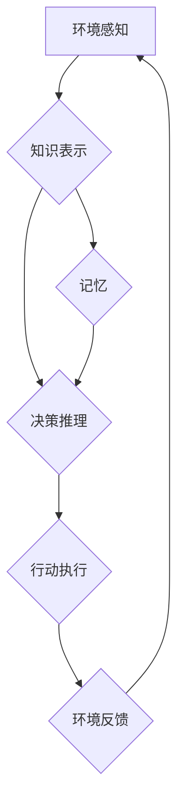

> AI Agent, 规划, 记忆, 强化学习, 知识表示, 决策推理, 认知架构

## 1. 背景介绍

在人工智能领域，AI Agent（智能代理）作为实现智能行为的核心单元，一直备受关注。AI Agent需要具备感知环境、做出决策、执行行动的能力，并能够在不断变化的环境中学习和适应。然而，传统的AI Agent往往局限于狭窄的任务场景，缺乏灵活性和泛化能力。

规划和记忆是AI Agent实现智能行为的关键能力。规划是指AI Agent根据目标和环境信息，制定一系列行动步骤以实现目标。记忆是指AI Agent存储和检索过去经验，用于指导当前决策和规划。

然而，传统的规划和记忆机制往往存在以下问题：

* **规划过程过于依赖环境信息：** 当环境信息不完整或不准确时，规划过程可能会陷入困境。
* **记忆容量有限：** 传统的记忆机制难以存储和检索大量复杂的信息。
* **缺乏知识表示和推理能力：** 传统的规划和记忆机制缺乏对知识的表示和推理能力，难以处理复杂的任务场景。

## 2. 核心概念与联系

为了解决上述问题，近年来，研究者们开始探索将规划和记忆整合到AI Agent中，构建更智能、更灵活的AI Agent。

**核心概念：**

* **规划：** AI Agent根据目标和环境信息，制定一系列行动步骤以实现目标。
* **记忆：** AI Agent存储和检索过去经验，用于指导当前决策和规划。
* **知识表示：** 将知识以结构化的形式表示，以便AI Agent能够理解和推理。
* **决策推理：** 基于知识表示和环境信息，AI Agent做出决策。

**架构：**



**联系：**

规划和记忆是AI Agent实现智能行为的关键能力，它们相互关联，共同作用于AI Agent的行为决策过程。

* 记忆提供规划所需的知识和经验，帮助AI Agent做出更明智的决策。
* 规划利用记忆中的知识和经验，制定更有效的行动策略。

## 3. 核心算法原理 & 具体操作步骤

### 3.1  算法原理概述

**强化学习 (Reinforcement Learning, RL)** 是一种机器学习方法，通过奖励和惩罚机制，训练AI Agent学习最优的行为策略。

**核心思想：**

* AI Agent与环境交互，执行行动并获得奖励或惩罚。
* AI Agent根据奖励和惩罚信息，更新行为策略，以最大化长期奖励。

**算法步骤：**

1. **初始化：** 初始化AI Agent的行为策略和价值函数。
2. **环境感知：** AI Agent感知环境状态。
3. **决策选择：** 根据当前状态和行为策略，AI Agent选择行动。
4. **行动执行：** AI Agent执行选择的行动。
5. **环境反馈：** 环境反馈给AI Agent奖励或惩罚信息。
6. **价值更新：** AI Agent更新价值函数，根据奖励和惩罚信息调整行为策略。
7. **重复步骤2-6：** 直到AI Agent学习到最优行为策略。

### 3.2  算法步骤详解

**价值函数：**

价值函数评估AI Agent在特定状态下执行特定行动的长期奖励。

**策略函数：**

策略函数决定AI Agent在特定状态下执行的行动。

**学习算法：**

常用的强化学习算法包括Q-learning、SARSA、Deep Q-Network等。

### 3.3  算法优缺点

**优点：**

* 可以学习复杂的行为策略。
* 不需要明确的奖励函数，可以从环境反馈中学习。
* 可以应用于各种任务场景。

**缺点：**

* 训练过程可能很慢，需要大量的样本数据。
* 容易陷入局部最优解。
* 需要设计合理的奖励函数，否则可能会导致AI Agent学习到不期望的行为。

### 3.4  算法应用领域

强化学习广泛应用于以下领域：

* **游戏 AI：** 训练AI Agent玩游戏，例如AlphaGo、AlphaStar等。
* **机器人控制：** 训练机器人执行复杂的任务，例如导航、抓取等。
* **推荐系统：** 训练推荐系统，根据用户的历史行为推荐感兴趣的内容。
* **医疗诊断：** 训练AI系统辅助医生诊断疾病。

## 4. 数学模型和公式 & 详细讲解 & 举例说明

### 4.1  数学模型构建

**状态空间：**

状态空间表示AI Agent可能处于的所有状态。

**动作空间：**

动作空间表示AI Agent可以执行的所有动作。

**奖励函数：**

奖励函数评估AI Agent在特定状态下执行特定行动的奖励。

**价值函数：**

价值函数评估AI Agent在特定状态下执行特定行动的长期奖励。

**策略函数：**

策略函数决定AI Agent在特定状态下执行的行动。

### 4.2  公式推导过程

**Q-learning 公式：**

$$Q(s,a) = Q(s,a) + \alpha [r + \gamma \max_{a'} Q(s',a') - Q(s,a)]$$

其中：

* $Q(s,a)$ 表示在状态 $s$ 下执行动作 $a$ 的价值。
* $\alpha$ 表示学习率。
* $r$ 表示在状态 $s$ 下执行动作 $a$ 后获得的奖励。
* $\gamma$ 表示折扣因子。
* $s'$ 表示执行动作 $a$ 后进入的状态。
* $a'$ 表示在状态 $s'$ 下执行的动作。

### 4.3  案例分析与讲解

**举例说明：**

假设AI Agent在一个迷宫中寻找出口，每个状态表示AI Agent当前的位置，每个动作表示AI Agent可以向左、右、上、下移动。

* **状态空间：** 迷宫中的所有位置。
* **动作空间：** 向左、右、上、下四个方向。
* **奖励函数：** 当AI Agent到达出口时，奖励为100，否则奖励为0。
* **价值函数：** 评估AI Agent在每个状态下执行每个动作的长期奖励。
* **策略函数：** 根据价值函数，决定AI Agent在每个状态下执行的动作。

通过Q-learning算法，AI Agent可以学习到最优的路径，从起点到达出口。

## 5. 项目实践：代码实例和详细解释说明

### 5.1  开发环境搭建

* Python 3.x
* TensorFlow 或 PyTorch
* OpenAI Gym

### 5.2  源代码详细实现

```python
import gym
import numpy as np

# 定义Q-learning算法
class QLearningAgent:
    def __init__(self, state_size, action_size, learning_rate=0.1, discount_factor=0.9, epsilon=0.1):
        self.state_size = state_size
        self.action_size = action_size
        self.learning_rate = learning_rate
        self.discount_factor = discount_factor
        self.epsilon = epsilon
        self.q_table = np.zeros((state_size, action_size))

    def choose_action(self, state):
        if np.random.uniform(0, 1) < self.epsilon:
            return np.random.randint(self.action_size)
        else:
            return np.argmax(self.q_table[state])

    def update_q_table(self, state, action, reward, next_state):
        self.q_table[state, action] = (1 - self.learning_rate) * self.q_table[state, action] + self.learning_rate * (reward + self.discount_factor * np.max(self.q_table[next_state]))

# 创建环境
env = gym.make('CartPole-v1')

# 初始化AI Agent
agent = QLearningAgent(env.observation_space.shape[0], env.action_space.n)

# 训练AI Agent
for episode in range(1000):
    state = env.reset()
    done = False
    total_reward = 0
    while not done:
        action = agent.choose_action(state)
        next_state, reward, done, _ = env.step(action)
        agent.update_q_table(state, action, reward, next_state)
        state = next_state
        total_reward += reward
    print(f'Episode {episode+1}, Total Reward: {total_reward}')

# 测试AI Agent
state = env.reset()
while True:
    action = agent.choose_action(state)
    next_state, reward, done, _ = env.step(action)
    env.render()
    state = next_state
    if done:
        break
env.close()
```

### 5.3  代码解读与分析

* **Q-learning算法实现：** 代码实现了Q-learning算法的核心逻辑，包括选择动作、更新Q表等步骤。
* **环境搭建：** 使用OpenAI Gym创建CartPole环境，这是一个经典的强化学习环境。
* **AI Agent初始化：** 初始化AI Agent，设置学习率、折扣因子、探索率等参数。
* **训练过程：** 训练AI Agent，通过与环境交互，更新Q表，学习最优的行为策略。
* **测试过程：** 测试训练好的AI Agent，观察其在环境中的表现。

### 5.4  运行结果展示

运行代码后，AI Agent将学习到控制杆的策略，使杆子保持平衡尽可能长时间。

## 6. 实际应用场景

### 6.1  机器人控制

强化学习可以用于训练机器人执行复杂的任务，例如导航、抓取、组装等。

### 6.2  游戏 AI

强化学习可以用于训练游戏 AI，例如AlphaGo、AlphaStar等，这些AI系统已经超越了人类水平。

### 6.3  推荐系统

强化学习可以用于训练推荐系统，根据用户的历史行为推荐感兴趣的内容。

### 6.4  未来应用展望

强化学习在未来将有更广泛的应用，例如自动驾驶、医疗诊断、金融交易等。

## 7. 工具和资源推荐

### 7.1  学习资源推荐

* **书籍：**
    * Reinforcement Learning: An Introduction by Richard S. Sutton and Andrew G. Barto
    * Deep Reinforcement Learning Hands-On by Maxim Lapan
* **在线课程：**
    * Deep Reinforcement Learning Specialization by DeepLearning.AI
    * Reinforcement Learning by David Silver (University of DeepMind)

### 7.2  开发工具推荐

* **TensorFlow:** 开源深度学习框架，支持强化学习算法的实现。
* **PyTorch:** 开源深度学习框架，支持强化学习算法的实现。
* **OpenAI Gym:** 强化学习环境库，提供各种标准的强化学习环境。

### 7.3  相关论文推荐

* **Deep Q-Network (DQN):** Mnih et al., 2015
* **Proximal Policy Optimization (PPO):** Schulman et al., 2017
* **Trust Region Policy Optimization (TRPO):** Schulman et al., 2015

## 8. 总结：未来发展趋势与挑战

### 8.1  研究成果总结

近年来，强化学习取得了显著的进展，在游戏 AI、机器人控制、推荐系统等领域取得了突破性成果。

### 8.2  未来发展趋势

* **更强大的算法：** 研究更强大的强化学习算法，例如基于模型的强化学习、多智能体强化学习等。
* **更复杂的应用场景：** 将强化学习应用于更复杂的应用场景，例如自动驾驶、医疗诊断等。
* **更安全的AI Agent：** 研究更安全的强化学习算法，确保AI Agent的行为可控和可解释。

### 8.3  面临的挑战

* **样本效率：** 强化学习算法通常需要大量的