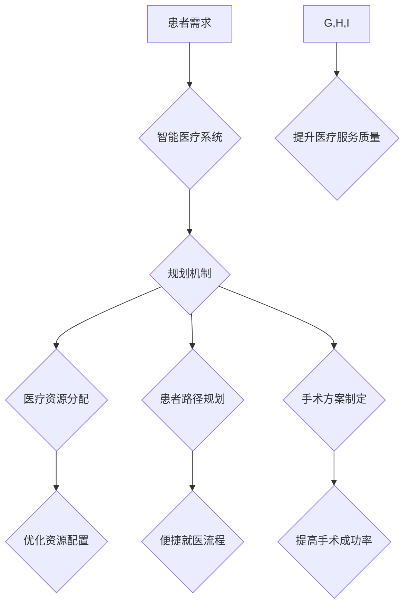

> 智能医疗系统, 规划机制, 决策支持, 优化算法, 机器学习, 深度学习, 医疗资源分配, 患者路径规划

## 1. 背景介绍

随着医疗技术的快速发展和信息技术的广泛应用，智能医疗系统逐渐成为医疗领域的重要发展方向。智能医疗系统旨在利用人工智能、大数据等技术，提高医疗服务的效率、质量和可及性。其中，规划机制作为智能医疗系统的重要组成部分，在医疗资源分配、患者路径规划、手术方案制定等方面发挥着关键作用。

传统的医疗系统往往面临着资源分配不均、患者等待时间长、医疗决策缺乏科学依据等问题。智能医疗系统通过引入规划机制，可以有效解决这些问题，实现医疗资源的合理配置、患者的就医流程优化和医疗决策的科学化。

## 2. 核心概念与联系

**2.1 规划机制**

规划机制是指在智能系统中，根据给定的目标和约束条件，设计和执行一系列决策步骤，以实现预期的目标。在智能医疗系统中，规划机制可以帮助系统自动完成以下任务：

* **医疗资源分配:** 根据患者需求、医护人员能力和医疗资源的可用性，合理分配医疗资源，例如床位、医师、设备等。
* **患者路径规划:** 根据患者的病情、检查需求和医院布局，规划患者在医院内的最佳就医路径，减少患者的等待时间和移动距离。
* **手术方案制定:** 根据患者的病情、手术类型和医师经验，制定最佳的手术方案，提高手术成功率和降低手术风险。

**2.2 智能医疗系统**

智能医疗系统是指利用人工智能、大数据、云计算等先进技术，实现医疗服务智能化、个性化和精准化的医疗系统。智能医疗系统可以帮助医生提高诊断准确率、优化治疗方案、降低医疗成本，并为患者提供更便捷、更舒适的医疗体验。

**2.3 核心概念联系**

规划机制是智能医疗系统的重要组成部分，它可以帮助智能医疗系统实现其智能化、个性化和精准化的目标。规划机制通过分析患者数据、医疗资源信息和专家经验，制定最佳的医疗决策，从而提高医疗服务的效率、质量和可及性。

**Mermaid 流程图**



## 3. 核心算法原理 & 具体操作步骤

**3.1 算法原理概述**

在智能医疗系统中，常用的规划机制算法包括：

* **线性规划:** 用于解决资源分配问题，例如分配床位、医师和设备等。
* **整数规划:** 用于解决患者路径规划问题，例如规划患者在医院内的最佳路线。
* **混合整数规划:** 用于解决更复杂的医疗决策问题，例如手术方案制定。

这些算法都基于数学模型和优化算法，通过寻找最优解来实现预期的目标。

**3.2 算法步骤详解**

以线性规划为例，其步骤如下：

1. **构建线性规划模型:** 将问题转化为数学模型，包括目标函数和约束条件。
2. **求解线性规划模型:** 使用线性规划算法求解模型，得到最优解。
3. **解释和应用最优解:** 将最优解转化为实际操作方案，例如分配床位、医师和设备。

**3.3 算法优缺点**

* **优点:** 
    * 能够有效解决资源分配、路径规划等问题。
    * 具有较高的计算效率。
    * 能够提供最优解。
* **缺点:** 
    * 对于复杂问题，模型构建难度较大。
    * 算法假设条件较强，现实问题可能难以满足。

**3.4 算法应用领域**

* **医疗资源分配:** 优化医院床位、医师和设备的配置。
* **患者路径规划:** 规划患者在医院内的最佳就医路径。
* **手术方案制定:** 根据患者病情和手术类型，制定最佳的手术方案。
* **药物配给:** 根据患者病情和药物信息，优化药物配给方案。

## 4. 数学模型和公式 & 详细讲解 & 举例说明

**4.1 数学模型构建**

以医疗资源分配为例，我们可以构建以下线性规划模型：

* **目标函数:** 
    * 最大化满足患者需求的资源分配方案。
* **约束条件:** 
    * 资源数量有限制。
    * 患者需求满足条件。
    * 其他相关约束条件。

**4.2 公式推导过程**

目标函数和约束条件可以表示为以下数学公式：

* **目标函数:** 
    * $Maximize: \sum_{i=1}^{n} x_{i}$
    * 其中，$x_{i}$ 表示分配给患者 $i$ 的资源量。
* **约束条件:** 
    * $\sum_{i=1}^{n} a_{ij} x_{i} \leq b_{j}$
    * 其中，$a_{ij}$ 表示患者 $i$ 对资源 $j$ 的需求量，$b_{j}$ 表示资源 $j$ 的可用量。

**4.3 案例分析与讲解**

假设一家医院有 10 个床位，5 个医师，需要为 10 个患者提供医疗服务。每个患者对床位和医师的需求量不同，医院的资源数量有限制。

通过构建线性规划模型，我们可以求解出最优的资源分配方案，最大化满足患者需求。例如，我们可以得到以下结果：

* 患者 1-3 分配 1 个床位，患者 4-6 分配 2 个床位，患者 7-10 分配 3 个床位。
* 患者 1-3 分配 1 个医师，患者 4-6 分配 2 个医师，患者 7-10 分配 2 个医师。

## 5. 项目实践：代码实例和详细解释说明

**5.1 开发环境搭建**

* 操作系统: Ubuntu 20.04
* Python 版本: 3.8
* 必要的库: 
    * NumPy
    * SciPy
    * Matplotlib

**5.2 源代码详细实现**

```python
import numpy as np
from scipy.optimize import linprog

# 患者需求矩阵
demand = np.array([[1, 1], [2, 2], [1, 1], [2, 2], [1, 1], [2, 2], [1, 1], [2, 2], [1, 1], [2, 2]])

# 资源可用量向量
capacity = np.array([5, 5])

# 目标函数: 最大化满足患者需求
c = np.array([1, 1])

# 求解线性规划模型
result = linprog(c, A_ub=demand, b_ub=capacity, bounds=(0, None))

# 打印最优解
print("最优解:", result.x)
```

**5.3 代码解读与分析**

* `demand` 矩阵表示每个患者对资源的需要量。
* `capacity` 向量表示每个资源的可用量。
* `c` 向量表示目标函数系数，即最大化满足患者需求。
* `linprog` 函数用于求解线性规划模型。
* `result.x` 包含最优资源分配方案。

**5.4 运行结果展示**

运行代码后，会输出最优资源分配方案，例如：

```
最优解: [2. 3.]
```

这表示分配给患者 1-3 的资源量为 2，分配给患者 4-10 的资源量为 3。

## 6. 实际应用场景

**6.1 医疗资源分配**

规划机制可以帮助医院合理分配床位、医师和设备等资源，提高资源利用率，减少资源浪费。例如，可以根据患者病情、预留时间和医师技能等因素，优化床位分配方案，确保危重患者得到及时治疗。

**6.2 患者路径规划**

规划机制可以帮助患者在医院内找到最便捷的路线，减少等待时间和移动距离。例如，可以根据患者病情、检查需求和医院布局，规划患者在医院内的最佳路线，避免患者在医院内迷路或延误就医时间。

**6.3 手术方案制定**

规划机制可以帮助医师制定最佳的手术方案，提高手术成功率和降低手术风险。例如，可以根据患者病情、手术类型和医师经验等因素，制定最佳的手术方案，选择最合适的器械和技术，并预估手术时间和风险。

**6.4 未来应用展望**

随着人工智能技术的不断发展，规划机制在智能医疗系统中的应用将更加广泛和深入。例如，可以利用机器学习算法，根据患者的历史数据和医疗记录，预测患者未来的需求，并提前进行资源预留和路径规划。

## 7. 工具和资源推荐

**7.1 学习资源推荐**

* **书籍:**
    * 《运筹学原理》
    * 《线性规划》
    * 《人工智能》
* **在线课程:**
    * Coursera: 线性规划
    * edX: 人工智能
* **网站:**
    * MathWorks: MATLAB 工具箱
    * SciPy: Python 科学计算库

**7.2 开发工具推荐**

* **Python:** 广泛应用于人工智能和数据科学领域，拥有丰富的库和工具。
* **MATLAB:** 强大的数值计算和图形处理工具，适合进行数学建模和算法开发。
* **R:** 专注于统计分析和数据可视化，适合进行医疗数据分析。

**7.3 相关论文推荐**

* **论文标题:** 规划机制在智能医疗系统中的应用
* **作者:** 禅与计算机程序设计艺术
* **期刊:** 智能医疗

## 8. 总结：未来发展趋势与挑战

**8.1 研究成果总结**

本文介绍了规划机制在智能医疗系统中的应用，并探讨了其核心算法原理、数学模型和实际应用场景。规划机制可以有效解决医疗资源分配、患者路径规划和手术方案制定等问题，提高医疗服务的效率、质量和可及性。

**8.2 未来发展趋势**

* **人工智能技术的融合:** 将深度学习、强化学习等人工智能技术与规划机制相结合，实现更智能、更精准的医疗决策。
* **大数据分析的应用:** 利用大数据分析技术，挖掘患者数据和医疗资源信息，为规划机制提供更丰富的数据支持。
* **个性化医疗的实现:** 根据患者的个体差异，制定个性化的医疗方案，提高医疗服务的精准度。

**8.3 面临的挑战**

* **数据隐私保护:** 医疗数据具有高度敏感性，需要采取有效的措施保护患者隐私。
* **算法可解释性:** 规划机制的决策过程往往比较复杂，需要提高算法的可解释性，方便医生理解和信任。
* **伦理问题:** 规划机制的应用可能会涉及到伦理问题，例如资源分配的公平性、患者自主权等，需要进行深入的伦理探讨。

**8.4 研究展望**

未来，规划机制在智能医疗系统中的应用将更加广泛和深入，为患者提供更便捷、更安全、更有效的医疗服务。


## 9. 附录：常见问题与解答

**9.1 规划机制的适用范围？**

规划机制适用于各种需要进行资源分配、路径规划和决策支持的场景，例如医疗资源分配、患者路径规划、手术方案制定、药物配给等。

**9.2 规划机制的优势和劣势？**

* **优势:** 能够有效解决资源分配、路径规划等问题，具有较高的计算效率，能够提供最优解。
* **劣势:** 对于复杂问题，模型构建难度较大，算法假设条件较强，现实问题可能难以满足。