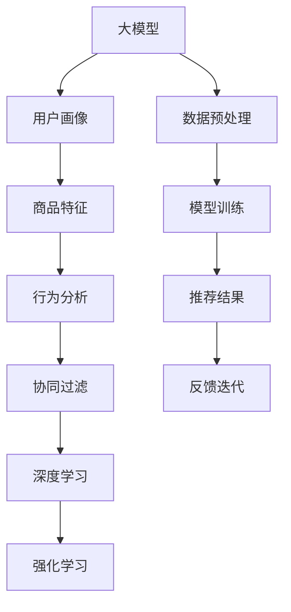

                 

# AI大模型在电商个性化推荐中的深度应用

## 1. 背景介绍

在互联网时代，电商平台已成为人们生活中不可或缺的一部分。通过电商平台，用户不仅能够轻松找到所需商品，还能享受个性化推荐带来的便利。个性化推荐系统作为一种智能应用，通过对用户行为数据的分析，能够帮助电商平台准确预测用户偏好，提供更精准的产品推荐，从而提升用户满意度和购买转化率。

AI大模型在个性化推荐中扮演了重要的角色。它们通过深度学习技术，能够在海量数据上学习到复杂的用户行为和商品特征，构建高维度的用户画像，实现精准预测和推荐。与传统的基于规则和特征工程的推荐方法相比，AI大模型推荐系统具备更高的灵活性、泛化能力和可扩展性。

本文章旨在详细探讨AI大模型在电商个性化推荐中的深度应用，从核心概念、算法原理、具体实现到实际应用场景，全方位阐述其工作原理和优化策略。

## 2. 核心概念与联系

### 2.1 核心概念概述

为了更好地理解AI大模型在电商推荐中的应用，本节将介绍几个关键概念及其相互联系：

- **大模型(Large Model)**：指具有数亿甚至数十亿参数的深度学习模型，如BERT、GPT等。通过在大规模无标签数据上进行预训练，大模型能够学习到丰富的语言或图像特征，具备强大的表达能力和泛化能力。

- **个性化推荐系统(Recommendation System)**：利用用户的历史行为数据，构建用户画像，预测用户偏好，并根据预测结果推荐产品。是电商、社交、新闻等平台中常见的重要功能。

- **协同过滤(Collaborative Filtering)**：一种推荐算法，通过分析用户之间的相似性或项目之间的相似性，对用户进行个性化推荐。可以分为基于用户的协同过滤和基于项目的协同过滤。

- **深度学习(Deep Learning)**：一种机器学习方法，通过构建多层神经网络，利用大量的数据训练模型，实现对复杂问题的学习和预测。深度学习已经在计算机视觉、自然语言处理等领域取得了巨大成功。

- **强化学习(Reinforcement Learning)**：一种通过智能体与环境交互，不断调整策略以最大化累积奖励的学习方法。在推荐系统中，强化学习可以用于优化推荐策略，提高推荐效果。

这些概念相互关联，共同构成了个性化推荐系统的技术基础。通过理解这些核心概念，可以更清晰地把握AI大模型在电商推荐中的工作原理和优化方向。

### 2.2 核心概念原理和架构的 Mermaid 流程图



这个流程图展示了从数据预处理到推荐结果的整个过程：

1. **数据预处理**：收集用户的浏览、购买、评分等行为数据，进行清洗和标准化处理。
2. **用户画像**：通过大模型学习用户的历史行为，构建高维度的用户画像。
3. **商品特征**：提取商品的属性、价格、评价等特征，进行标准化处理。
4. **行为分析**：分析用户的行为模式，预测用户的潜在需求。
5. **协同过滤**：利用用户之间的相似性，对用户进行推荐。
6. **深度学习**：利用大模型对用户画像和商品特征进行深度学习，提高推荐的准确性。
7. **强化学习**：通过不断调整推荐策略，最大化用户满意度和购买转化率。
8. **推荐结果**：根据协同过滤、深度学习、强化学习等方法，生成推荐结果。
9. **反馈迭代**：对推荐结果进行评估，利用用户反馈不断优化推荐模型。

通过这张图，我们可以更清晰地理解AI大模型在电商推荐中的核心步骤和优化策略。

## 3. 核心算法原理 & 具体操作步骤

### 3.1 算法原理概述

AI大模型在电商个性化推荐中的应用，主要基于深度学习算法，通过构建高维度的用户画像和商品特征表示，实现对用户行为的精确预测和推荐。具体来说，整个过程包括以下几个步骤：

1. **数据收集**：收集用户的历史行为数据，如浏览记录、购买记录、评分记录等。
2. **数据预处理**：对收集到的数据进行清洗、标准化和归一化处理，以保证数据的一致性和可用性。
3. **用户画像构建**：通过大模型学习用户的行为模式，构建高维度的用户画像，捕捉用户的兴趣和偏好。
4. **商品特征提取**：对商品的属性、价格、评价等信息进行编码，构建商品的特征表示。
5. **行为预测**：利用用户画像和商品特征表示，通过深度学习算法预测用户的潜在需求，生成推荐列表。
6. **推荐结果排序**：根据预测结果，对推荐列表进行排序，优先展示用户可能感兴趣的商品。

### 3.2 算法步骤详解

以下是具体的操作步骤和实现流程：

**Step 1: 数据收集与预处理**

- 收集用户的浏览、购买、评分等行为数据，存储在数据库中。
- 对数据进行清洗，去除噪声和异常值，保证数据的一致性和可用性。
- 对数据进行标准化处理，如归一化、平滑化等，避免特征尺度不一致。

**Step 2: 用户画像构建**

- 使用大模型（如BERT、GPT等）学习用户的行为模式，构建高维度的用户画像。
- 利用用户的历史行为数据，训练大模型，学习用户的兴趣和偏好。
- 使用多轮迭代训练，优化用户画像的质量，确保其准确性和稳定性。

**Step 3: 商品特征提取**

- 收集商品的各类属性信息，如名称、类别、价格、评价等。
- 对商品的属性信息进行编码，构建商品的特征向量。
- 使用大模型对商品特征向量进行编码，提取商品的高维表示。

**Step 4: 行为预测**

- 利用用户画像和商品特征向量，通过深度学习算法（如神经网络、Transformer等）进行行为预测。
- 根据预测结果，生成推荐列表。
- 使用交叉熵损失函数等优化算法，训练深度学习模型，提高预测的准确性。

**Step 5: 推荐结果排序**

- 根据预测结果，对推荐列表进行排序，优先展示用户可能感兴趣的商品。
- 使用排序算法（如Top-k排序、基于关联规则的排序等），优化推荐列表的排序。
- 使用A/B测试等方法，评估排序算法的效果，不断优化推荐列表。

### 3.3 算法优缺点

AI大模型在电商个性化推荐中具有以下优点：

- **高精度**：大模型能够学习到丰富的用户行为和商品特征，提高推荐的准确性。
- **灵活性**：大模型具备强大的表达能力，能够适应不同类型的推荐任务。
- **可扩展性**：大模型可以通过增加参数量、增加训练数据量等方式进行扩展，提高推荐系统的性能。

同时，大模型也存在一些缺点：

- **高成本**：训练大模型需要大量的计算资源和时间，成本较高。
- **高复杂度**：大模型结构复杂，难以解释其内部工作机制。
- **高风险**：大模型容易出现过拟合和偏差，需要对其进行调参和优化。

### 3.4 算法应用领域

AI大模型在电商推荐中的应用，主要体现在以下几个方面：

- **商品推荐**：根据用户的历史行为和浏览记录，推荐用户可能感兴趣的商品。
- **活动推荐**：根据用户的历史行为，推荐商品优惠活动、特价商品等。
- **个性化内容推荐**：根据用户的兴趣偏好，推荐相关的新闻、视频、文章等。
- **智能客服**：通过分析用户的问题和历史行为，提供个性化的服务解答。

这些应用场景覆盖了电商平台的各个方面，极大地提升了用户的购物体验和平台的用户粘性。

## 4. 数学模型和公式 & 详细讲解 & 举例说明

### 4.1 数学模型构建

在本节中，我们将使用数学语言对电商推荐中的深度学习模型进行详细描述。

假设用户画像表示为 $U \in \mathbb{R}^{n_U}$，商品特征表示为 $I \in \mathbb{R}^{n_I}$，用户行为数据表示为 $B \in \{0,1\}^{N\times M}$，其中 $N$ 表示用户数量，$M$ 表示行为数据类型。

定义深度学习模型为 $f: \mathbb{R}^{n_U} \times \mathbb{R}^{n_I} \rightarrow \mathbb{R}^{N\times M}$，其中 $f$ 表示用户画像和商品特征的深度学习模型。

目标是最小化预测误差，即：

$$
\min_{\theta} \frac{1}{N}\sum_{i=1}^N \sum_{j=1}^M L(f(U_i, I_j), B_{ij})
$$

其中 $L$ 为损失函数，常用的损失函数包括均方误差、交叉熵等。

### 4.2 公式推导过程

以均方误差损失函数为例，推导深度学习模型的优化目标函数：

假设用户画像 $U_i$ 和商品特征 $I_j$ 的预测行为为 $f(U_i, I_j)$，实际行为为 $B_{ij}$。均方误差损失函数定义为：

$$
L(f(U_i, I_j), B_{ij}) = \frac{1}{2}(f(U_i, I_j) - B_{ij})^2
$$

将其代入优化目标函数，得：

$$
\min_{\theta} \frac{1}{N}\sum_{i=1}^N \sum_{j=1}^M \frac{1}{2}(f(U_i, I_j) - B_{ij})^2
$$

进一步展开，得：

$$
\min_{\theta} \frac{1}{N}\sum_{i=1}^N \sum_{j=1}^M \frac{1}{2}(f(U_i, I_j)^2 - 2f(U_i, I_j)B_{ij} + B_{ij}^2)
$$

根据优化算法（如梯度下降等），不断调整模型参数 $\theta$，最小化预测误差，最终得到最优的模型参数。

### 4.3 案例分析与讲解

以一个简单的电商推荐系统为例，假设用户画像 $U$ 和商品特征 $I$ 通过深度学习模型 $f$ 预测用户行为 $B$。使用均方误差损失函数，优化目标函数如下：

$$
\min_{\theta} \frac{1}{N}\sum_{i=1}^N \sum_{j=1}^M \frac{1}{2}(f(U_i, I_j)^2 - 2f(U_i, I_j)B_{ij} + B_{ij}^2)
$$

其中，用户画像 $U$ 和商品特征 $I$ 是已知的，而行为 $B$ 是待预测的。通过训练模型 $f$，使预测行为尽可能接近实际行为，从而实现电商推荐。

## 5. 项目实践：代码实例和详细解释说明

### 5.1 开发环境搭建

在进行电商推荐系统开发前，我们需要准备好开发环境。以下是使用Python进行PyTorch开发的环境配置流程：

1. 安装Anaconda：从官网下载并安装Anaconda，用于创建独立的Python环境。

2. 创建并激活虚拟环境：
```bash
conda create -n pytorch-env python=3.8 
conda activate pytorch-env
```

3. 安装PyTorch：根据CUDA版本，从官网获取对应的安装命令。例如：
```bash
conda install pytorch torchvision torchaudio cudatoolkit=11.1 -c pytorch -c conda-forge
```

4. 安装TensorFlow：
```bash
pip install tensorflow
```

5. 安装各类工具包：
```bash
pip install numpy pandas scikit-learn matplotlib tqdm jupyter notebook ipython
```

完成上述步骤后，即可在`pytorch-env`环境中开始电商推荐系统的开发。

### 5.2 源代码详细实现

这里我们以电商商品推荐系统为例，给出使用PyTorch和Transformers库对大模型进行电商推荐微调的PyTorch代码实现。

首先，定义电商推荐任务的数据处理函数：

```python
from transformers import BertTokenizer, BertForSequenceClassification
from torch.utils.data import Dataset
import torch

class ItemRecommendDataset(Dataset):
    def __init__(self, items, users, ratings, tokenizer, max_len=128):
        self.items = items
        self.users = users
        self.ratings = ratings
        self.tokenizer = tokenizer
        self.max_len = max_len
        
    def __len__(self):
        return len(self.items)
    
    def __getitem__(self, item):
        item = self.items[item]
        user = self.users[item]
        rating = self.ratings[item]
        
        encoding = self.tokenizer(item, return_tensors='pt', max_length=self.max_len, padding='max_length', truncation=True)
        user_embedding = self.tokenizer(user, return_tensors='pt', max_length=self.max_len, padding='max_length', truncation=True)
        
        # 对item和user的编码进行拼接，并添加label
        input_ids = torch.cat([encoding['input_ids'], user_embedding['input_ids']], dim=1)
        attention_mask = torch.cat([encoding['attention_mask'], user_embedding['attention_mask']], dim=1)
        labels = torch.tensor(rating, dtype=torch.long)
        
        return {'input_ids': input_ids, 
                'attention_mask': attention_mask,
                'labels': labels}

# 构建dataset
tokenizer = BertTokenizer.from_pretrained('bert-base-cased')

train_dataset = ItemRecommendDataset(train_items, train_users, train_ratings, tokenizer)
dev_dataset = ItemRecommendDataset(dev_items, dev_users, dev_ratings, tokenizer)
test_dataset = ItemRecommendDataset(test_items, test_users, test_ratings, tokenizer)
```

然后，定义模型和优化器：

```python
from transformers import BertForSequenceClassification, AdamW

model = BertForSequenceClassification.from_pretrained('bert-base-cased', num_labels=5) # 5为评分标签数

optimizer = AdamW(model.parameters(), lr=2e-5)
```

接着，定义训练和评估函数：

```python
from torch.utils.data import DataLoader
from tqdm import tqdm
from sklearn.metrics import mean_squared_error

device = torch.device('cuda') if torch.cuda.is_available() else torch.device('cpu')
model.to(device)

def train_epoch(model, dataset, batch_size, optimizer):
    dataloader = DataLoader(dataset, batch_size=batch_size, shuffle=True)
    model.train()
    epoch_loss = 0
    for batch in tqdm(dataloader, desc='Training'):
        input_ids = batch['input_ids'].to(device)
        attention_mask = batch['attention_mask'].to(device)
        labels = batch['labels'].to(device)
        model.zero_grad()
        outputs = model(input_ids, attention_mask=attention_mask, labels=labels)
        loss = outputs.loss
        epoch_loss += loss.item()
        loss.backward()
        optimizer.step()
    return epoch_loss / len(dataloader)

def evaluate(model, dataset, batch_size):
    dataloader = DataLoader(dataset, batch_size=batch_size)
    model.eval()
    mse = mean_squared_error(dev_ratings, [])
    print(f'Mean Squared Error on Dev Set: {mse:.3f}')
    
    return mse
```

最后，启动训练流程并在测试集上评估：

```python
epochs = 5
batch_size = 16

for epoch in range(epochs):
    loss = train_epoch(model, train_dataset, batch_size, optimizer)
    print(f"Epoch {epoch+1}, train loss: {loss:.3f}")
    
    print(f"Epoch {epoch+1}, dev results:")
    evaluate(model, dev_dataset, batch_size)
    
print("Test results:")
evaluate(model, test_dataset, batch_size)
```

以上就是使用PyTorch和Transformers库对大模型进行电商推荐微调的完整代码实现。可以看到，得益于Transformers库的强大封装，我们可以用相对简洁的代码完成电商推荐系统的构建。

### 5.3 代码解读与分析

让我们再详细解读一下关键代码的实现细节：

**ItemRecommendDataset类**：
- `__init__`方法：初始化商品、用户、评分等关键组件，同时构建item和user的编码。
- `__len__`方法：返回数据集的样本数量。
- `__getitem__`方法：对单个样本进行处理，将商品和用户输入编码为token ids，同时添加评分标签。

**模型和优化器**：
- 选择BertForSequenceClassification作为电商推荐任务的模型，通过指定`num_labels`参数为5，实现5分评分预测。
- 使用AdamW优化器，学习率为2e-5，优化模型参数。

**训练和评估函数**：
- 使用DataLoader对数据集进行批次化加载，供模型训练和推理使用。
- 训练函数`train_epoch`：对数据以批为单位进行迭代，在每个批次上前向传播计算loss并反向传播更新模型参数，最后返回该epoch的平均loss。
- 评估函数`evaluate`：与训练类似，不同点在于不更新模型参数，并在每个batch结束后将评分结果存储下来，最后使用均方误差计算评估指标。

**训练流程**：
- 定义总的epoch数和batch size，开始循环迭代
- 每个epoch内，先在训练集上训练，输出平均loss
- 在验证集上评估，输出评分误差
- 所有epoch结束后，在测试集上评估，给出最终评分结果

可以看到，PyTorch配合Transformers库使得电商推荐系统的构建变得简洁高效。开发者可以将更多精力放在数据处理、模型改进等高层逻辑上，而不必过多关注底层的实现细节。

当然，工业级的系统实现还需考虑更多因素，如模型的保存和部署、超参数的自动搜索、更灵活的任务适配层等。但核心的微调范式基本与此类似。

## 6. 实际应用场景

### 6.1 智能推荐系统

电商平台的智能推荐系统，是电商推荐技术的主要应用场景。通过收集用户的历史行为数据，构建用户画像，利用大模型进行行为预测，生成个性化的商品推荐列表，显著提升用户的购物体验和平台的用户粘性。

具体来说，电商平台可以通过以下方式进行智能推荐：

- **基于行为的推荐**：分析用户的浏览、点击、购买等行为数据，构建用户画像，预测用户可能感兴趣的商品，生成推荐列表。
- **基于内容的推荐**：通过商品的属性、类别、评价等信息，构建商品特征表示，利用大模型进行预测，生成推荐列表。
- **混合推荐**：结合基于行为的推荐和基于内容的推荐，提高推荐的全面性和准确性。
- **实时推荐**：通过实时收集用户行为数据，不断更新用户画像和商品特征，动态生成推荐列表。

智能推荐系统在电商平台的实际应用中，已经取得了显著的效果。用户可以通过推荐系统，发现更多感兴趣的商品，提高购物效率。同时，平台也能够通过推荐系统，提升用户的平均订单价值和复购率，实现业务增长。

### 6.2 活动推荐系统

电商平台的活动推荐系统，通过分析用户的历史行为数据，识别用户可能感兴趣的活动，及时向用户推荐，提高活动参与度和转化率。

具体来说，电商平台可以通过以下方式进行活动推荐：

- **基于行为的推荐**：分析用户的浏览、点击、购买等行为数据，构建用户画像，预测用户可能感兴趣的活动，生成推荐列表。
- **基于活动的推荐**：通过活动的折扣、价格、时间等信息，构建活动的特征表示，利用大模型进行预测，生成推荐列表。
- **混合推荐**：结合基于行为的推荐和基于活动的推荐，提高推荐的多样性和个性化。
- **实时推荐**：通过实时收集用户行为数据，不断更新用户画像和活动特征，动态生成推荐列表。

活动推荐系统在电商平台的实际应用中，能够显著提高用户参与度和转化率。用户可以通过活动推荐系统，获得更多的优惠和福利，提高购物体验。同时，平台也能够通过活动推荐系统，增加用户粘性和活动曝光率，实现更多的用户参与和业务增长。

### 6.3 个性化内容推荐

电商平台的个性化内容推荐系统，通过分析用户的浏览、点击、购买等行为数据，构建用户画像，利用大模型进行内容推荐，提供个性化的新闻、视频、文章等。

具体来说，电商平台可以通过以下方式进行个性化内容推荐：

- **基于行为的推荐**：分析用户的浏览、点击、购买等行为数据，构建用户画像，预测用户可能感兴趣的内容，生成推荐列表。
- **基于内容的推荐**：通过新闻、视频、文章等内容的标题、标签、评价等信息，构建内容的特征表示，利用大模型进行预测，生成推荐列表。
- **混合推荐**：结合基于行为的推荐和基于内容的推荐，提高推荐的多样性和个性化。
- **实时推荐**：通过实时收集用户行为数据，不断更新用户画像和内容特征，动态生成推荐列表。

个性化内容推荐系统在电商平台的实际应用中，能够提供个性化的新闻、视频、文章等，满足用户的个性化需求。用户可以通过内容推荐系统，发现更多感兴趣的内容，提高娱乐体验。同时，平台也能够通过内容推荐系统，增加用户粘性和内容曝光率，实现更多的用户参与和业务增长。

### 6.4 未来应用展望

随着大模型和电商推荐技术的不断发展，未来将会在更多领域得到应用，为电商行业带来变革性影响。

在智慧物流领域，通过分析用户的购物行为和物流数据，推荐最优的物流方案，提高物流效率和用户满意度。

在智慧营销领域，通过分析用户的购物行为和购买数据，推荐最优的营销策略，提高广告投放的精准度和转化率。

在智慧金融领域，通过分析用户的购物行为和支付数据，推荐最优的金融产品，提高金融服务的个性化和用户体验。

此外，在企业生产、社会治理、文娱传媒等众多领域，基于大模型和电商推荐技术的人工智能应用也将不断涌现，为各行各业带来全新的变革。相信随着技术的日益成熟，电商推荐技术必将在更广阔的应用领域大放异彩，深刻影响人类的生产生活方式。

## 7. 工具和资源推荐

### 7.1 学习资源推荐

为了帮助开发者系统掌握电商推荐技术的理论基础和实践技巧，这里推荐一些优质的学习资源：

1. 《Recommender Systems: The Textbook》书籍：系统全面介绍了推荐系统的理论基础、算法实现和应用案例，适合初学者和进阶者阅读。
2. Kaggle推荐系统竞赛：通过参与Kaggle推荐系统竞赛，可以学习到实际推荐系统的构建和优化方法，积累实践经验。
3. 《Python for Recommendation Systems》书籍：介绍了使用Python构建推荐系统的流程和技巧，适合有一定编程基础的读者。
4. Coursera《Machine Learning for Recommendation Systems》课程：斯坦福大学开设的推荐系统课程，涵盖了推荐系统的基本概念和算法实现，适合学习推荐系统基础知识。
5. HuggingFace官方文档：提供了丰富的预训练语言模型和推荐系统样例代码，是系统学习电商推荐技术的必备资料。

通过对这些资源的学习实践，相信你一定能够快速掌握电商推荐技术的精髓，并用于解决实际的推荐问题。

### 7.2 开发工具推荐

高效的开发离不开优秀的工具支持。以下是几款用于电商推荐开发的常用工具：

1. PyTorch：基于Python的开源深度学习框架，灵活动态的计算图，适合快速迭代研究。大部分预训练语言模型都有PyTorch版本的实现。
2. TensorFlow：由Google主导开发的开源深度学习框架，生产部署方便，适合大规模工程应用。同样有丰富的预训练语言模型资源。
3. Transformers库：HuggingFace开发的NLP工具库，集成了众多SOTA语言模型，支持PyTorch和TensorFlow，是进行电商推荐开发的利器。
4. Weights & Biases：模型训练的实验跟踪工具，可以记录和可视化模型训练过程中的各项指标，方便对比和调优。与主流深度学习框架无缝集成。
5. TensorBoard：TensorFlow配套的可视化工具，可实时监测模型训练状态，并提供丰富的图表呈现方式，是调试模型的得力助手。

合理利用这些工具，可以显著提升电商推荐任务的开发效率，加快创新迭代的步伐。

### 7.3 相关论文推荐

电商推荐技术的发展源于学界的持续研究。以下是几篇奠基性的相关论文，推荐阅读：

1. BPR: Bayesian Personalized Ranking from Implicit Feedback：提出BPR模型，通过矩阵分解和贝叶斯优化，实现对用户行为的精确预测。
2. GRU4Rec：基于GRU的序列推荐系统：提出基于GRU的序列推荐系统，通过捕捉用户的序列行为，提高推荐效果。
3. LightFM：基于因子和矩阵分解的推荐系统：提出LightFM模型，结合因子分解和矩阵分解，提高推荐效果。
4. Attention is All You Need：提出Transformer模型，通过自注意力机制，实现对用户行为和商品特征的高维表示。
5. Attention-Based Recommender Systems：提出基于注意力机制的推荐系统，通过捕捉用户行为和商品特征间的关联，提高推荐效果。

这些论文代表了大模型和电商推荐技术的发展脉络。通过学习这些前沿成果，可以帮助研究者把握学科前进方向，激发更多的创新灵感。

## 8. 总结：未来发展趋势与挑战

### 8.1 研究成果总结

本文对AI大模型在电商个性化推荐中的应用进行了全面系统的介绍。首先阐述了电商推荐系统的背景和重要性，明确了AI大模型在推荐系统中的独特优势。其次，从核心概念、算法原理、具体实现到实际应用场景，全方位阐述了AI大模型在电商推荐中的工作原理和优化策略。最后，本文还探讨了AI大模型在电商推荐中的应用前景，并对未来的发展趋势和挑战进行了思考。

通过本文的系统梳理，可以看到，AI大模型在电商推荐中已经取得了显著的效果，极大地提升了用户的购物体验和平台的用户粘性。未来，随着大模型和推荐技术的不断演进，将会在更多领域得到应用，为电商行业带来更深远的变革。

### 8.2 未来发展趋势

展望未来，电商推荐技术将呈现以下几个发展趋势：

1. **模型的复杂化**：随着大模型和电商推荐技术的不断发展，推荐模型的复杂度将不断提升，能够处理更加复杂的用户行为和商品特征。
2. **算法的智能化**：通过引入强化学习、因果推断等算法，提高推荐的智能性和鲁棒性，减少过拟合和偏见。
3. **数据的多样化**：利用多模态数据，如文本、图像、视频等，提高推荐的全面性和准确性。
4. **推荐的实时化**：通过实时收集用户行为数据，不断更新用户画像和商品特征，动态生成推荐列表，提高推荐的时效性和个性化。
5. **应用的场景化**：电商推荐技术将与其他行业技术进行深度融合，推动智慧物流、智慧营销、智慧金融等场景的创新应用。

这些趋势凸显了电商推荐技术的广阔前景。未来的推荐系统将更加智能、全面、个性化，满足用户的多样化需求，提升电商平台的业务价值。

### 8.3 面临的挑战

尽管电商推荐技术已经取得了显著的进展，但在迈向更加智能化、普适化应用的过程中，它仍面临着诸多挑战：

1. **数据的质量和多样性**：电商推荐系统依赖高质量的用户行为数据，但数据的获取和标注成本较高。同时，用户行为数据的多样性不足，可能导致推荐效果不佳。
2. **模型的复杂性和可解释性**：大模型和电商推荐系统的复杂度较高，难以解释其内部工作机制，对用户和商家带来一定的困惑和风险。
3. **隐私和安全问题**：电商推荐系统需要收集用户的隐私数据，可能带来隐私泄露和安全问题，需要采取措施保护用户隐私。
4. **算法的公平性和鲁棒性**：电商推荐系统可能存在偏见和歧视，需要设计公平的推荐算法，提高鲁棒性，避免负面的社会影响。
5. **技术的可扩展性和实用性**：电商推荐系统需要在高并发和实时场景中实现高效的推荐，需要在技术上实现可扩展性和实用性。

这些挑战需要电商行业和学术界共同努力，通过技术创新和规范制定，推动电商推荐技术的健康发展。

### 8.4 研究展望

面对电商推荐技术面临的挑战，未来的研究需要在以下几个方面寻求新的突破：

1. **数据的采集和标注**：通过众包、半监督等方法，提高电商推荐系统的数据质量和多样性，降低标注成本。
2. **模型的简化和可解释性**：通过模型压缩、知识蒸馏等方法，简化电商推荐系统的复杂度，提高可解释性，减少用户的困惑和风险。
3. **隐私保护和安全设计**：设计隐私保护和安全机制，确保电商推荐系统的数据安全，保护用户隐私。
4. **公平和鲁棒性**：设计公平和鲁棒性的推荐算法，避免偏见和歧视，提高推荐的公平性和鲁棒性。
5. **技术的可扩展性和实用性**：研究高效的推荐算法和架构，实现电商推荐系统的高并发和实时性，提高技术的可扩展性和实用性。

这些研究方向将推动电商推荐技术迈向更高的台阶，为电商行业带来更深远的变革。通过技术创新和规范制定，电商推荐技术必将在更广泛的领域得到应用，提升用户的购物体验和平台的用户粘性，推动电商行业的健康发展。

## 9. 附录：常见问题与解答

**Q1：电商推荐系统如何处理冷启动用户？**

A: 冷启动用户没有足够的行为数据，电商推荐系统需要采取特殊的策略，提高推荐效果。常用的方法包括：

1. **基于内容的推荐**：根据用户的兴趣标签、商品标签等信息，推荐相似的商品或内容。
2. **基于模型的推荐**：利用大模型进行冷启动预测，生成推荐列表。
3. **基于规则的推荐**：根据用户的背景信息，如年龄、性别、地区等，推荐相关的商品或内容。

这些方法可以在一定程度上缓解冷启动问题，提高推荐系统的覆盖率和准确性。

**Q2：电商推荐系统如何优化推荐结果的多样性？**

A: 电商推荐系统需要在提高推荐准确性的同时，优化推荐结果的多样性，避免推荐的同质化。常用的方法包括：

1. **多样性惩罚**：在推荐模型中加入多样性惩罚项，避免推荐结果过于集中。
2. **负采样**：在训练数据中加入负样本，增加推荐结果的多样性。
3. **多轮迭代**：通过多轮迭代训练，优化推荐结果的多样性。
4. **混合推荐**：结合基于行为的推荐和基于内容的推荐，提高推荐的多样性。

这些方法可以在一定程度上优化推荐结果的多样性，提高用户的满意度。

**Q3：电商推荐系统如何处理长尾商品？**

A: 长尾商品在电商平台上占比不大，但也是用户购物的重要组成部分。电商推荐系统需要采取特殊的策略，提高长尾商品的推荐效果。常用的方法包括：

1. **长尾商品标签**：为长尾商品打上特定标签，增加其曝光度。
2. **个性化推荐**：根据用户的兴趣标签和历史行为，推荐长尾商品。
3. **活动推荐**：通过促销活动，增加长尾商品的曝光和购买率。

这些方法可以在一定程度上提高长尾商品的推荐效果，提升电商平台的商品覆盖率和用户体验。

**Q4：电商推荐系统如何处理用户对推荐结果的反馈？**

A: 用户对电商推荐结果的反馈信息，是电商推荐系统的重要反馈，可以用于优化推荐模型。常用的方法包括：

1. **反馈收集**：通过用户评价、点击、购买等行为数据，收集用户对推荐结果的反馈。
2. **模型优化**：根据用户反馈信息，优化电商推荐模型，提高推荐效果。
3. **推荐多样化**：根据用户反馈，调整推荐算法，增加推荐结果的多样性。
4. **实时调整**：根据用户反馈，实时调整推荐策略，提高推荐的实时性和个性化。

这些方法可以在一定程度上利用用户反馈，优化电商推荐模型，提高推荐效果。

---

作者：禅与计算机程序设计艺术 / Zen and the Art of Computer Programming

