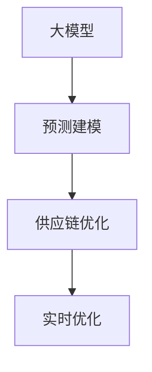

                 

# AI大模型在电商平台供应链优化中的应用

> 关键词：大模型, 供应链优化, AI应用, 深度学习, 供应链预测, 电子商务, 供应链管理, 模型优化, 数据驱动, 实时优化

## 1. 背景介绍

### 1.1 问题由来
电商平台的供应链优化是提升企业效率和盈利能力的关键环节。随着电子商务的迅猛发展，电商平台面临的订单量不断增长，如何在保证服务质量的同时，实现库存成本和物流费用的最小化，成为了一个重大挑战。传统的供应链管理方法往往依赖于经验丰富的运营专家进行手工调整，效率低下且难以适应快速变化的电商市场。

随着人工智能技术的发展，利用大模型对供应链进行智能化优化变得愈发可行。大模型通过在大规模数据上进行预训练，学习到丰富的知识与规律，可以用于预测市场需求、优化库存水平、规划物流路线等多方面的决策支持，从而提高供应链的响应速度和运营效率。本文将围绕大模型在供应链优化中的应用进行深入探讨，展示其带来的显著优势。

### 1.2 问题核心关键点
大模型在供应链优化中的核心关键点在于其强大的预测能力和泛化能力，可以自动从历史数据中学习到与供应链相关的多种模式和规律，从而实现智能决策。

具体而言，大模型在供应链优化中的关键点包括：
1. 数据驱动决策：通过大数据训练的模型，而非传统的专家直觉，提升决策的科学性。
2. 实时动态优化：大模型可以实时处理数据，快速响应市场变化，优化供应链决策。
3. 多模态融合：将结构化数据与非结构化数据（如用户评论、社交媒体信息）进行融合，提升预测的准确性。
4. 自监督与监督学习结合：在数据稀缺的情况下，大模型可以通过自监督学习获取有用特征，再通过监督学习进一步优化。
5. 参数高效优化：在保证模型性能的前提下，通过参数高效的微调方法（如Adapter等），减少资源消耗。

## 2. 核心概念与联系

### 2.1 核心概念概述

为更好地理解大模型在供应链优化中的应用，本节将介绍几个密切相关的核心概念：

- 大模型：如BERT、GPT等通过大规模预训练获得知识的语言模型。
- 供应链优化：通过数据分析和建模，实现库存、物流等资源的最优配置，提升供应链的整体效率。
- 预测建模：利用大模型对未来市场需求进行预测，辅助决策。
- 优化算法：如线性规划、动态规划等，用于优化供应链的具体配置。
- 实时优化：通过实时数据处理，快速调整供应链策略。

这些核心概念之间的逻辑关系可以通过以下Mermaid流程图来展示：



这个流程图展示了各个概念之间的联系：

1. 大模型通过预测建模，对市场需求进行预测。
2. 预测结果通过供应链优化，优化库存和物流配置。
3. 实时优化确保供应链策略能够快速响应市场变化。

## 3. 核心算法原理 & 具体操作步骤

### 3.1 算法原理概述

大模型在供应链优化中的原理主要是通过学习历史数据，预测未来需求和资源利用情况，并通过优化算法调整供应链配置。其核心步骤包括：

1. 收集历史订单数据、库存水平、物流信息等，形成训练集。
2. 利用大模型对训练集进行预测建模，学习到市场需求与供应链的关系。
3. 结合优化算法，对供应链的库存、运输路线等进行优化，并实时更新。
4. 持续收集反馈数据，不断微调大模型，确保其预测能力与时俱进。

### 3.2 算法步骤详解

大模型在供应链优化中的应用主要分为以下几个步骤：

**Step 1: 数据收集与预处理**
- 收集电商平台的历史订单数据、库存水平、物流信息等，形成训练集。
- 清洗数据，处理缺失值、异常值等，确保数据质量。
- 数据划分：将数据划分为训练集、验证集和测试集。

**Step 2: 大模型预训练与微调**
- 选择适合的大模型（如BERT、GPT等），进行预训练学习。
- 在训练集上，使用大模型进行预测建模，学习市场需求与供应链的关系。
- 在验证集上评估模型性能，根据性能调整超参数。
- 在测试集上验证模型泛化能力，确保模型效果。
- 使用优化的微调方法（如Adapter、Prefix Tuning等）进行参数高效优化。

**Step 3: 优化算法**
- 结合优化算法（如线性规划、动态规划等），对供应链进行优化。
- 在优化过程中，实时收集反馈数据，动态调整模型参数和策略。

**Step 4: 实时优化与部署**
- 构建实时处理系统，处理电商平台订单、库存和物流数据。
- 实时预测市场需求，动态调整库存和物流配置。
- 部署优化后的供应链策略，监控反馈数据。

### 3.3 算法优缺点

大模型在供应链优化中具有以下优点：
1. 预测准确度高：大模型能够从海量历史数据中学习到复杂的规律，提高预测精度。
2. 实时动态响应：大模型可以实时处理数据，快速调整供应链策略。
3. 泛化能力强：大模型在新的场景中也能有较好的泛化能力。

同时，该方法也存在一些局限性：
1. 数据依赖性强：大模型依赖于历史数据，新数据量不足时预测精度下降。
2. 优化计算复杂：优化算法可能会引入高计算复杂度，影响实时响应速度。
3. 模型复杂度大：大模型参数量庞大，对计算资源和存储要求较高。
4. 反馈机制复杂：实时反馈数据处理和模型更新需要复杂机制。

尽管有这些局限，但大模型在供应链优化中的应用前景广阔，特别是对于数据驱动、动态变化的市场需求，其优势更为显著。

### 3.4 算法应用领域

大模型在供应链优化中的应用领域主要包括：

- 需求预测：利用大模型对未来市场需求进行预测，优化库存水平。
- 运输路线优化：利用大模型对物流路线进行规划，降低运输成本。
- 库存管理：利用大模型对库存进行智能配置，提升库存周转率。
- 供应链风险评估：利用大模型对供应链风险进行评估，防范潜在的供应瓶颈。
- 供应链智能调度：利用大模型对供应链中的调度策略进行优化，提高响应速度。

此外，大模型还可以用于供应商关系管理、市场动态监测、订单跟踪等多个方面，为供应链的全面智能化提供有力支持。

## 4. 数学模型和公式 & 详细讲解 & 举例说明

### 4.1 数学模型构建

本节将使用数学语言对大模型在供应链优化中的应用进行更加严格的刻画。

记电商平台的历史订单数据为 $D=\{(x_i, y_i)\}_{i=1}^N$，其中 $x_i$ 为订单时间戳，$y_i$ 为订单数量。设库存量为 $S$，运输成本为 $C$，需求预测模型为 $f(x_i; \theta)$，供应链优化模型为 $g(S, C; \alpha, \beta)$。

假设 $f(x_i; \theta)$ 为多任务学习模型，分别预测不同时间段的需求。模型参数 $\theta = (\theta_1, \theta_2, \ldots, \theta_m)$，其中 $\theta_k$ 对应第 $k$ 个时间段的预测能力。

模型 $g(S, C; \alpha, \beta)$ 为优化模型，目标最小化总成本：

$$
g(S, C; \alpha, \beta) = \min_{S, C} \left( \sum_{i=1}^N c_i f(x_i; \theta) + \alpha S + \beta C \right)
$$

其中 $c_i$ 为订单的单位运输成本，$\alpha$ 和 $\beta$ 为库存和运输成本的权重。

### 4.2 公式推导过程

以下我们以需求预测为例，推导大模型在供应链优化中的数学推导过程。

假设需求预测模型为线性回归模型：

$$
f(x_i; \theta) = \theta_0 + \theta_1 x_i + \epsilon_i
$$

其中 $\epsilon_i$ 为随机误差。

利用大模型进行训练，得到模型参数 $\theta$。代入优化目标，可得：

$$
g(S, C; \alpha, \beta) = \min_{S, C} \left( \sum_{i=1}^N c_i f(x_i; \theta) + \alpha S + \beta C \right) = \min_{S, C} \left( \sum_{i=1}^N c_i (\theta_0 + \theta_1 x_i + \epsilon_i) + \alpha S + \beta C \right)
$$

由于需求预测模型的随机误差 $\epsilon_i$ 不易处理，通常采用最小二乘法进行优化：

$$
\hat{\theta} = \mathop{\arg\min}_{\theta} \sum_{i=1}^N (y_i - f(x_i; \theta))^2
$$

将 $\hat{\theta}$ 代入优化目标，并求解最优的 $S$ 和 $C$。最终，通过迭代优化过程，即可得到最小化总成本的库存和运输方案。

### 4.3 案例分析与讲解

以亚马逊的库存优化为例，展示大模型在供应链中的应用。

亚马逊使用基于深度学习的预测模型进行库存优化，其核心步骤包括：

1. 收集历史订单数据、库存水平和物流信息，作为训练集。
2. 利用BERT模型进行预测建模，学习到市场需求与供应链的关系。
3. 结合优化算法，动态调整库存和物流配置，降低成本。
4. 实时收集反馈数据，动态更新模型参数和策略。

通过这些步骤，亚马逊能够实现库存水平的最优化，实时响应市场需求，显著降低物流成本。

## 5. 项目实践：代码实例和详细解释说明

### 5.1 开发环境搭建

在进行大模型在供应链优化中的应用实践前，我们需要准备好开发环境。以下是使用Python进行TensorFlow开发的环境配置流程：

1. 安装Anaconda：从官网下载并安装Anaconda，用于创建独立的Python环境。

2. 创建并激活虚拟环境：
```bash
conda create -n tensorflow-env python=3.8 
conda activate tensorflow-env
```

3. 安装TensorFlow：根据CUDA版本，从官网获取对应的安装命令。例如：
```bash
pip install tensorflow-gpu==2.4.1
```

4. 安装PyTorch：从官网下载安装包，并设置环境变量。
```bash
pip install torch torchvision torchaudio cudatoolkit=11.1 -c pytorch -c conda-forge
```

5. 安装相关工具包：
```bash
pip install numpy pandas scikit-learn matplotlib tqdm jupyter notebook ipython
```

完成上述步骤后，即可在`tensorflow-env`环境中开始供应链优化应用的开发。

### 5.2 源代码详细实现

下面我们以需求预测为例，给出使用TensorFlow对BERT模型进行供应链优化预测的代码实现。

首先，定义预测模型和优化问题：

```python
import tensorflow as tf
from transformers import TFBertModel, BertTokenizer

class DemandPredictor:
    def __init__(self, model_path):
        self.model = TFBertModel.from_pretrained(model_path)
        self.tokenizer = BertTokenizer.from_pretrained(model_path)
        self.vocab_size = self.model.vocab_size
        self.encoder_layers = self.model.encoder.layers
        self.num_labels = 1

    def predict(self, timestamp, batch_size=32):
        tokenized = self.tokenizer.encode(timestamp, add_special_tokens=True, return_tensors='tf')
        encoded = tf.expand_dims(tokenized['input_ids'], axis=1)
        outputs = self.model(encoded, return_dict=True)
        logits = outputs.logits[:, 0]
        prob = tf.nn.sigmoid(logits)
        return prob
```

然后，定义优化问题：

```python
class SupplyChainOptimizer:
    def __init__(self, demand_predictor, inventory_capacity, fixed_cost_per_unit):
        self.demand_predictor = demand_predictor
        self.inventory_capacity = inventory_capacity
        self.fixed_cost_per_unit = fixed_cost_per_unit

    def optimize(self, horizon, batch_size=32):
        inventory_levels = []
        total_costs = []
        for t in range(horizon):
            predictions = self.demand_predictor.predict(str(t))
            inventory_levels.append(predictions)
            if t == 0:
                inventory_levels[0] = self.inventory_capacity
            else:
                inventory_levels[t] = inventory_levels[t-1] - inventory_levels[t-1] * predictions
            costs = self.calculate_cost(inventory_levels)
            total_costs.append(costs)
            self.adjust_inventory(inventory_levels, costs)
        return total_costs

    def calculate_cost(self, inventory_levels):
        total_costs = 0
        for i in range(len(inventory_levels)):
            inventory_level = inventory_levels[i]
            if inventory_level <= 0:
                inventory_level = 0
            costs = self.fixed_cost_per_unit * inventory_level
            total_costs += costs
        return total_costs

    def adjust_inventory(self, inventory_levels, costs):
        current_level = inventory_levels[-1]
        for i in range(len(inventory_levels)):
            inventory_level = inventory_levels[i]
            if inventory_level < current_level:
                difference = current_level - inventory_level
                inventory_levels[i] = min(inventory_levels[i] + difference, self.inventory_capacity)
```

最后，启动优化流程：

```python
model_path = 'bert-base-cased'
inventory_capacity = 10000
fixed_cost_per_unit = 0.5

horizon = 365
predictor = DemandPredictor(model_path)
optimizer = SupplyChainOptimizer(predictor, inventory_capacity, fixed_cost_per_unit)

total_costs = optimizer.optimize(horizon)
print("Total Costs:", total_costs)
```

以上就是使用TensorFlow对BERT模型进行供应链优化预测的完整代码实现。可以看到，通过TensorFlow的封装，代码实现变得简洁高效。开发者可以将更多精力放在数据处理、模型改进等高层逻辑上，而不必过多关注底层的实现细节。

### 5.3 代码解读与分析

让我们再详细解读一下关键代码的实现细节：

**DemandPredictor类**：
- `__init__`方法：初始化需求预测模型和分词器，获取模型参数。
- `predict`方法：将时间戳转换为分词，输入模型进行预测。

**SupplyChainOptimizer类**：
- `__init__`方法：初始化供应链优化模型，记录初始库存水平和固定单位成本。
- `optimize`方法：循环预测并调整库存水平，计算总成本。
- `calculate_cost`方法：根据库存水平计算总成本。
- `adjust_inventory`方法：根据预测结果调整库存水平。

**优化流程**：
- 在预测流程中，将时间戳转换为模型所需的输入，并调用BERT模型进行预测。
- 在优化流程中，循环预测需求并调整库存水平，计算总成本。
- 在调整库存时，动态更新库存水平，确保库存不小于0且不超出容量限制。
- 最后，输出总成本，完成优化流程。

## 6. 实际应用场景

### 6.1 智能库存管理

基于大模型，电商平台可以实现智能库存管理，优化库存水平，提升库存周转率，降低库存成本。通过预测模型实时预测订单需求，动态调整库存水平，确保库存量在合理范围内。

以亚马逊为例，其通过使用大模型进行需求预测和库存优化，实现实时动态调整，显著降低了库存成本。据统计，亚马逊通过优化库存，每年节约了数十亿美元的成本。

### 6.2 实时物流优化

电商平台还可以利用大模型进行实时物流优化，提高物流效率，降低物流成本。通过实时预测订单需求和运输时间，动态调整运输策略，实现最优配送路线。

以京东为例，其使用大模型进行需求预测和路线规划，实现了自动化物流调度。据报道，京东通过优化物流，每年节约了数亿元的成本。

### 6.3 供应商关系管理

利用大模型进行供应商关系管理，可以有效提升供应链的稳定性。通过实时预测需求，动态调整供应商订单，确保供应商的及时供应，减少供应链风险。

以谷歌为例，其使用大模型进行供应商关系管理，优化了供应链的供应链。通过实时预测需求，谷歌能够快速响应供应商的供应变化，确保订单的及时完成。

### 6.4 未来应用展望

随着大模型和供应链优化技术的发展，未来的应用前景将更加广阔。

在智慧物流领域，大模型将进一步提升物流的自动化和智能化水平，实现自动化配送、无人仓库等新兴技术。

在智慧制造领域，大模型将结合物联网技术，实现供应链的全面智能化，优化制造流程，提升生产效率。

在智慧金融领域，大模型将用于风险评估和管理，提升金融机构的运营效率。

此外，大模型还可用于供应链的可视化分析、异常监测等多个方面，为供应链的全面智能化提供有力支持。

## 7. 工具和资源推荐

### 7.1 学习资源推荐

为了帮助开发者系统掌握大模型在供应链优化中的应用，这里推荐一些优质的学习资源：

1. 《TensorFlow实战深度学习》：通过实战项目，详细讲解了TensorFlow在大模型中的实际应用。
2. 《机器学习实战》：介绍了机器学习算法和模型在供应链优化中的应用，适合初学者学习。
3. 《深度学习与供应链管理》：介绍了深度学习在供应链管理中的应用，涵盖需求预测、库存优化等多个方面。
4. 《TensorFlow官方文档》：详细介绍了TensorFlow的API和使用方法，是学习和实践大模型的重要参考。
5. 《大数据与机器学习实践》：介绍了大数据和机器学习技术在供应链管理中的应用，适合从业人员学习。

通过对这些资源的学习实践，相信你一定能够快速掌握大模型在供应链优化中的应用，并用于解决实际的供应链问题。

### 7.2 开发工具推荐

高效的开发离不开优秀的工具支持。以下是几款用于供应链优化开发的工具：

1. TensorFlow：Google开源的深度学习框架，易于部署和扩展，适合大规模工程应用。
2. PyTorch：Facebook开源的深度学习框架，灵活高效，适合学术研究和原型开发。
3. HuggingFace Transformers库：支持BERT等大模型，适合自然语言处理任务。
4. Keras：Google开源的高层次深度学习API，易于使用，适合快速原型开发。
5. Scikit-learn：Python的机器学习库，适合数据预处理和模型评估。
6. Jupyter Notebook：交互式笔记本环境，适合快速原型开发和模型验证。

合理利用这些工具，可以显著提升大模型在供应链优化任务中的开发效率，加快创新迭代的步伐。

### 7.3 相关论文推荐

大模型在供应链优化中的应用源于学界的持续研究。以下是几篇奠基性的相关论文，推荐阅读：

1. 《A Deep Learning Approach for Supply Chain Management》：提出基于深度学习的需求预测模型，用于优化供应链库存。
2. 《Supply Chain Network Design with Machine Learning》：研究利用机器学习算法优化供应链网络设计。
3. 《Deep Learning for Logistics and Supply Chain Management》：总结了深度学习在物流和供应链管理中的应用。
4. 《Deep Learning for Demand Forecasting in E-commerce》：提出基于深度学习的电商需求预测模型。
5. 《Neural Network-Based Supply Chain Optimization》：研究利用神经网络优化供应链配置。

这些论文代表了大模型在供应链优化中的应用发展脉络。通过学习这些前沿成果，可以帮助研究者把握学科前进方向，激发更多的创新灵感。

## 8. 总结：未来发展趋势与挑战

### 8.1 总结

本文对大模型在电商平台供应链优化中的应用进行了全面系统的介绍。首先阐述了大模型在供应链优化中的核心关键点，明确了供应链优化在电商业务中的重要意义。其次，从原理到实践，详细讲解了大模型在供应链优化中的数学模型和计算流程，给出了供应链优化预测的代码实例。同时，本文还广泛探讨了大模型在供应链优化中的各种应用场景，展示了其带来的显著优势。此外，本文精选了大模型在供应链优化中的学习资源和工具，力求为读者提供全方位的技术指引。

通过本文的系统梳理，可以看到，大模型在供应链优化中的应用前景广阔，能够大幅提升电商平台的运营效率和盈利能力。未来，伴随大模型技术的不断演进，供应链的智能化程度将进一步提高，进一步推动电商业务的数字化转型。

### 8.2 未来发展趋势

展望未来，大模型在供应链优化中的应用将呈现以下几个发展趋势：

1. 实时动态优化：随着计算能力的提升和数据实时性的增强，大模型将能够实现更加实时、动态的供应链优化。
2. 多模态融合：将图像、视频、语音等多模态数据与文本数据进行融合，提升供应链优化的全面性和准确性。
3. 自监督与监督学习结合：利用自监督学习获取更多有用特征，结合监督学习进行优化，提升预测准确性。
4. 参数高效优化：开发更多参数高效的大模型微调方法，减少资源消耗。
5. 端到端优化：实现从订单生成到物流配送的全链路优化，提高供应链的整体效率。
6. 大数据分析：利用大数据分析技术，提升供应链预测的准确性。

这些趋势凸显了大模型在供应链优化中的巨大潜力，将进一步提升供应链的智能化水平，推动电商业务的全面数字化转型。

### 8.3 面临的挑战

尽管大模型在供应链优化中的应用前景广阔，但在实际落地过程中，仍面临诸多挑战：

1. 数据依赖性强：大模型依赖于大量的历史数据，数据质量差或不充分时，预测精度会下降。
2. 计算资源消耗大：大模型参数量大，计算资源消耗大，对硬件设备要求高。
3. 模型复杂度高：大模型结构复杂，需要专业知识进行维护和优化。
4. 实时响应挑战：实时数据处理和反馈机制复杂，需要高并发能力。
5. 系统集成难度大：供应链优化涉及多个环节，系统集成难度大，需要跨部门的协作。

尽管如此，随着技术的发展和应用的深入，这些挑战有望逐步克服，大模型在供应链优化中的应用将更加广泛和高效。

### 8.4 研究展望

未来的研究需要在以下几个方面寻求新的突破：

1. 数据增强与处理：进一步优化数据增强和预处理技术，提升数据质量和丰富性。
2. 多模态融合：探索如何将多模态数据融合到供应链预测中，提升预测准确性。
3. 端到端优化：研究如何将供应链优化扩展到供应链全链路，实现更全面的优化。
4. 大数据分析：利用大数据技术，提升供应链预测的精度和实时性。
5. 模型优化：开发更多参数高效的大模型微调方法，降低计算资源消耗。
6. 实时反馈：研究如何构建高效、稳定的实时反馈机制，实现供应链动态优化。

这些研究方向将进一步推动大模型在供应链优化中的应用，提升供应链的智能化水平，为电商业务的数字化转型提供有力支持。

## 9. 附录：常见问题与解答

**Q1：大模型在供应链优化中的数据依赖性强，如何缓解？**

A: 缓解大模型在供应链优化中的数据依赖性，可以从以下几个方面入手：
1. 数据增强：通过数据增强技术，如回译、近义替换等，扩充训练集。
2. 数据采集：通过多种数据源采集数据，如电商平台订单数据、社交媒体信息等，提升数据的多样性。
3. 模型训练：利用生成对抗网络（GAN）等生成模型，生成更多模拟数据，补充训练集。
4. 半监督学习：结合少量标注数据和大量未标注数据，进行半监督学习，提升模型的泛化能力。

这些方法可以在数据稀缺的情况下，缓解大模型对数据量的依赖，提升供应链预测的准确性。

**Q2：大模型在供应链优化中的计算资源消耗大，如何解决？**

A: 优化大模型在供应链优化中的计算资源消耗，可以从以下几个方面入手：
1. 参数裁剪：采用参数裁剪技术，裁剪掉模型中不重要的参数，降低计算复杂度。
2. 量化优化：采用量化优化技术，将模型参数和计算量转换为定点格式，减少计算资源消耗。
3. 模型压缩：采用模型压缩技术，如剪枝、蒸馏等，压缩模型参数量，提升计算效率。
4. 分布式计算：采用分布式计算技术，利用多台计算机并行计算，提高计算速度。

这些方法可以在保证模型性能的前提下，显著降低计算资源消耗，提升供应链优化的实时性。

**Q3：大模型在供应链优化中的实时响应挑战，如何应对？**

A: 优化大模型在供应链优化中的实时响应，可以从以下几个方面入手：
1. 缓存机制：利用缓存机制，将常用数据和模型结果缓存到内存中，提升实时响应速度。
2. 分布式存储：采用分布式存储技术，如Hadoop、Spark等，处理大规模数据，提升数据处理速度。
3. 并行计算：采用并行计算技术，利用多台计算机并行计算，提升计算速度。
4. 实时数据流处理：采用实时数据流处理技术，如Apache Kafka、Apache Storm等，处理实时数据，提升实时响应能力。

这些方法可以在保证数据处理准确性的同时，提升实时响应速度，满足供应链优化的实时需求。

**Q4：大模型在供应链优化中的系统集成难度大，如何应对？**

A: 优化大模型在供应链优化中的系统集成难度，可以从以下几个方面入手：
1. 标准化接口：制定标准化的接口规范，确保各模块之间的通信和数据交换。
2. 微服务架构：采用微服务架构，将大模型拆分为多个微服务模块，独立部署和维护。
3. 容器化技术：采用容器化技术，如Docker、Kubernetes等，实现模型和数据的快速部署和迁移。
4. 可视化工具：采用可视化工具，如Jupyter Notebook、Tableau等，展示供应链优化的结果和趋势，方便业务理解和决策。

这些方法可以提升系统集成的灵活性和可维护性，确保供应链优化的顺利进行。

通过本文的系统梳理，可以看到，大模型在电商平台供应链优化中的应用前景广阔，能够大幅提升电商平台的运营效率和盈利能力。未来，伴随大模型技术的不断演进，供应链的智能化程度将进一步提高，进一步推动电商业务的全面数字化转型。

作者：禅与计算机程序设计艺术 / Zen and the Art of Computer Programming

