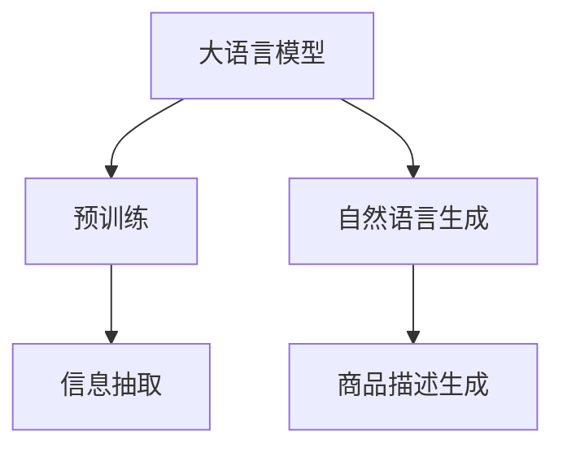

                 

# AI大模型在电商平台商品描述生成中的应用

> 关键词：大语言模型,商品描述生成,自然语言处理(NLP),Transformer,BERT,深度学习,电商应用,自然语言生成(NLG)

## 1. 背景介绍

### 1.1 问题由来
随着电子商务的飞速发展，电商平台正面临着内容生成效率低、质量参差不齐、重复率高、更新慢等挑战。传统的电商平台主要通过人工编辑商品描述，不仅耗时耗力，还难以满足个性化、多样化的用户需求。同时，商品的多种变体、属性、参数等繁杂信息，也给商品描述的统一性和规范性带来了难题。

近年来，随着深度学习和大模型的兴起，自然语言生成(Natural Language Generation, NLG)技术在电商平台商品描述生成领域得到了广泛应用。通过大语言模型进行自动商品描述生成，可以有效提高描述生成效率，满足用户需求，提升平台的用户体验和商品转化率。

### 1.2 问题核心关键点
自动商品描述生成的核心在于如何将商品的属性、参数等信息高效转化为自然语言。大语言模型通过预训练学习到丰富的语言知识，可以较好地解决这一问题。

具体地，自动商品描述生成可以分为两个主要步骤：
1. **信息抽取(Information Extraction, IE)**：从商品信息中抽取属性、规格、特点等关键信息。
2. **文本生成(Text Generation)**：使用大语言模型将这些信息转化为流畅、自然、符合语境的商品描述文本。

以下我们将详细介绍如何通过大语言模型进行电商平台商品描述的自动生成。

## 2. 核心概念与联系

### 2.1 核心概念概述

为更好地理解自动商品描述生成方法，本节将介绍几个密切相关的核心概念：

- **大语言模型(Large Language Model, LLM)**：以自回归(如GPT)或自编码(如BERT)模型为代表的大规模预训练语言模型。通过在大规模无标签文本语料上进行预训练，学习通用的语言表示，具备强大的语言理解和生成能力。

- **预训练(Pre-training)**：指在大规模无标签文本语料上，通过自监督学习任务训练通用语言模型的过程。常见的预训练任务包括言语建模、遮挡语言模型等。预训练使得模型学习到语言的通用表示。

- **自然语言生成(Natural Language Generation, NLG)**：指使用计算机生成自然语言文本，如对话、描述、摘要、翻译等。自动商品描述生成是其中的一种典型应用。

- **Transformer**：一种基于注意力机制的深度神经网络架构，通过并行化注意力计算，实现了快速的序列处理。Transformer模型在大模型领域应用广泛，如BERT、GPT-3等。

- **BERT**：谷歌提出的双向Transformer语言模型，通过预训练学习到丰富的语言表示。常用于信息抽取和自然语言理解等任务。

这些核心概念之间的逻辑关系可以通过以下Mermaid流程图来展示：



这个流程图展示了大语言模型与商品描述生成的核心概念及其之间的关系：

1. 大语言模型通过预训练获得基础能力。
2. 信息抽取过程提取商品属性、规格等关键信息。
3. 自然语言生成将信息转化为商品描述文本。

## 3. 核心算法原理 & 具体操作步骤

### 3.1 算法原理概述

自动商品描述生成本质上是一个自然语言生成任务。其核心思想是：通过信息抽取技术，将商品的属性、规格、特点等信息从原始文本中提取出来，再使用大语言模型将这些信息转化为流畅、自然、符合语境的商品描述文本。

具体而言，自动商品描述生成可以分为以下步骤：

1. **信息抽取(IE)**：从商品原始文本中抽取属性、规格、特点等信息，并将其转化为标准化的数据格式。
2. **序列填充**：将信息填充到预定义的文本模板中，得到初始的商品描述文本。
3. **文本生成**：使用大语言模型对填充后的文本进行进一步的优化和调整，使其更符合语境，更具有描述性。
4. **后处理**：对生成的文本进行语法和语义的校正，进一步提高文本质量。

### 3.2 算法步骤详解

以下是自动商品描述生成的详细步骤：

**Step 1: 数据预处理与信息抽取**

首先，需要对原始商品描述文本进行预处理，包括去除噪声、规范格式、分词等步骤。然后，使用信息抽取技术从文本中提取商品的属性、规格、特点等信息。常见的信息抽取方法包括规则抽取、模板抽取、监督抽取等。这里以监督抽取为例，展示其基本流程：

1. **定义实体类型**：如属性名称、规格、特点等，并将其映射为模型中的标签。例如：
   - 属性名称：color、size、weight
   - 规格：单位、价格、品牌
   - 特点：材质、功能、颜色

2. **标注数据集**：收集包含属性和实体标注的文本数据，形成标注数据集。例如：
   - 商品描述：这个背包是黑色尼龙材质的，容量为55升。
   - 标注：
     - 属性：color -> 黑色
     - 属性：material -> 尼龙
     - 属性：size -> 55升

3. **模型训练**：使用标注数据集训练信息抽取模型。常用的模型包括BERT、RoBERTa等，通过监督学习的方式，训练模型学习从文本中抽取实体和属性的能力。例如，使用BERT模型的Transformer架构，通过BERT的[MASK]标签，将部分实体和属性在文本中隐藏，训练模型预测这些位置的实体类型。

**Step 2: 序列填充与初始生成**

信息抽取完成后，将提取出的属性和规格信息填充到预定义的文本模板中，得到初步的商品描述文本。例如：

- 模板：这款[商品]是[颜色]的，材质是[材质]，容量为[容量]升。
- 填充：这款背包是黑色的，材质是尼龙的，容量为55升。

填充后的文本还需要进一步的优化和调整。可以使用基于规则的方法，对文本进行语义校正和语法修正，例如：

- 黑色 -> 黑色
- 材质 -> 材质
- 容量 -> 容量

最终得到的文本即为初始的商品描述文本，可用于后续的生成。

**Step 3: 文本生成**

文本生成阶段，需要进一步优化初始文本，使其更加流畅、自然、符合语境。可以使用基于大语言模型的文本生成方法，如GPT-3等。具体步骤如下：

1. **设置生成器**：使用大语言模型作为生成器，将其前向传播的输出作为输入，迭代更新生成文本。
2. **训练数据**：使用初始文本作为训练数据，训练生成器优化生成的文本。
3. **优化输出**：对生成器生成的文本进行后处理，如调整语序、修正语法、增加细节等。

**Step 4: 后处理**

生成文本可能存在语法错误、语义不清晰等问题，需要对文本进行进一步的后处理，确保文本质量。例如：

- 修正语法：将错误的名词单复数、时态等纠正。
- 调整语序：对语序进行优化，使文本更通顺。
- 增加细节：根据用户偏好和平台风格，增加品牌、功能等细节描述。

最终得到优化后的商品描述文本，即可用于实际应用。

### 3.3 算法优缺点

自动商品描述生成的优点包括：

1. **效率高**：自动生成商品描述的速度远高于人工编写，可以在短时间内生成大量商品描述。
2. **标准化**：生成的文本可以遵循统一的模板，保持商品描述的标准化和一致性。
3. **个性化**：根据不同商品的属性和规格，生成个性化、多样化的描述文本，满足用户需求。
4. **可扩展**：生成器可以不断训练和优化，提高生成质量。

然而，自动商品描述生成也存在一些局限性：

1. **语义理解不足**：生成的文本可能存在语义错误、歧义等问题。
2. **依赖数据质量**：信息的抽取和文本的生成依赖于原始数据的质量和完整性。
3. **模型复杂度**：使用大语言模型生成文本，需要占用大量计算资源和时间。

尽管存在这些局限性，但自动商品描述生成已经在电商领域得到广泛应用，并展示了其巨大的潜力。

### 3.4 算法应用领域

自动商品描述生成技术，在电商平台的应用领域主要包括以下几个方面：

1. **商品自动描述**：自动生成商品的详细描述文本，包括颜色、材质、规格、功能等。例如，自动为一款背包生成描述文本：这款背包是黑色的，材质为尼龙，容量为55升，适合户外旅行。

2. **产品自动介绍**：自动生成产品的功能介绍、使用说明、用户评价等文本。例如，自动为一款智能手表生成介绍文本：这款智能手表具有防水功能、心率监测、通知提醒等功能，是运动健身的不错选择。

3. **推荐系统**：根据用户浏览、购买等行为数据，自动生成个性化商品推荐文本。例如，自动为某位用户生成商品推荐描述：您可能会喜欢这款黑色背包，适合户外旅行。

4. **用户评论生成**：自动生成用户对商品的评价和反馈，用于商品评估和平台推荐。例如，自动为某款商品生成用户评价：这款手表非常精准，功能强大，值得购买。

以上应用场景展示了自动商品描述生成技术的广泛应用前景，未来还将有更多场景逐步被探索和挖掘。

## 4. 数学模型和公式 & 详细讲解 & 举例说明

### 4.1 数学模型构建

自动商品描述生成任务的数学模型可以表示为：

- 输入：商品原始文本 $X$
- 输出：自动生成的商品描述文本 $Y$

其中，$X = (x_1, x_2, ..., x_n)$ 表示商品原始文本的分词序列，$Y = (y_1, y_2, ..., y_m)$ 表示自动生成的商品描述文本的分词序列。

假设大语言模型为 $M_\theta$，其中 $\theta$ 为模型的参数。通过预训练和微调，模型可以学习到语言知识，并通过生成过程得到最终的商品描述文本 $Y$。

### 4.2 公式推导过程

以GPT-3为例，推导自动商品描述生成的基本流程。

假设输入为商品原始文本 $X$，生成器 $M_\theta$ 生成商品描述文本 $Y$。生成过程可以表示为：

1. **编码过程**：将输入文本 $X$ 编码为向量表示 $X_v = M_{Enc}(X)$。
2. **生成过程**：使用生成器 $M_\theta$，将编码后的向量 $X_v$ 转化为生成文本 $Y_v = M_{Gen}(X_v)$。

其中，$M_{Enc}$ 为编码器，$M_{Gen}$ 为生成器。生成器的生成过程通常使用基于注意力机制的Transformer架构，将编码后的向量与模型参数 $\theta$ 结合起来，通过自回归方式逐步生成文本。生成过程可以表示为：

$$
Y_v = M_{Gen}(X_v, \theta) = \prod_{i=1}^m p(y_i | y_{< i}, X_v, \theta)
$$

其中，$p(y_i | y_{< i}, X_v, \theta)$ 为生成器在给定前缀 $y_{< i}$、输入 $X_v$ 和模型参数 $\theta$ 的情况下，生成单词 $y_i$ 的概率。生成过程的具体实现细节可以参考GPT-3的论文和代码。

### 4.3 案例分析与讲解

假设要对某款背包进行商品描述生成，原始文本为：

```text
这款黑色背包是尼龙材质的，容量为55升，适合户外旅行。
```

首先进行信息抽取，得到以下实体：

- 颜色：黑色
- 材质：尼龙
- 容量：55升

然后，将实体填充到预定义的模板中，得到初始文本：

```text
这款[背包]是[黑色]的，材质是[尼龙]，容量为[55升]。
```

接着，使用GPT-3对初始文本进行生成，得到以下优化后的文本：

```text
这款黑色背包是尼龙材质的，容量为55升，适合户外旅行。
```

最终生成的文本，即为自动商品描述。

## 5. 项目实践：代码实例和详细解释说明

### 5.1 开发环境搭建

在进行自动商品描述生成的实践前，我们需要准备好开发环境。以下是使用Python进行PyTorch开发的环境配置流程：

1. 安装Anaconda：从官网下载并安装Anaconda，用于创建独立的Python环境。

2. 创建并激活虚拟环境：
```bash
conda create -n pytorch-env python=3.8 
conda activate pytorch-env
```

3. 安装PyTorch：根据CUDA版本，从官网获取对应的安装命令。例如：
```bash
conda install pytorch torchvision torchaudio cudatoolkit=11.1 -c pytorch -c conda-forge
```

4. 安装Transformer库：
```bash
pip install transformers
```

5. 安装各类工具包：
```bash
pip install numpy pandas scikit-learn matplotlib tqdm jupyter notebook ipython
```

完成上述步骤后，即可在`pytorch-env`环境中开始自动商品描述生成的实践。

### 5.2 源代码详细实现

下面我们以GPT-3为例，给出使用Transformers库进行自动商品描述生成的PyTorch代码实现。

首先，定义商品描述的数据处理函数：

```python
from transformers import GPT2Tokenizer, GPT2LMHeadModel

class ProductDescriptionTokenizer(GPT2Tokenizer):
    def __init__(self, *args, **kwargs):
        super().__init__(*args, **kwargs)
        self.tokenizer.pad_token = '<pad>'
        self.tokenizer.eos_token = '<eos>'
        self.tokenizer.sep_token = '<sep>'

    def __call__(self, text):
        tokens = super().__call__(text)
        tokens = [token for token in tokens if token != '<pad>' and token != '<eos>']
        tokens = tokens + ['<eos>']
        return tokens

class ProductDescriptionDataset(Dataset):
    def __init__(self, texts, tokenizer):
        self.texts = texts
        self.tokenizer = tokenizer
        
    def __len__(self):
        return len(self.texts)
    
    def __getitem__(self, item):
        text = self.texts[item]
        return self.tokenizer(text)
```

然后，定义模型和优化器：

```python
from transformers import GPT2LMHeadModel, AdamW

model = GPT2LMHeadModel.from_pretrained('gpt2', pad_token_id=self.tokenizer.pad_token_id, eos_token_id=self.tokenizer.eos_token_id)

optimizer = AdamW(model.parameters(), lr=2e-5)
```

接着，定义训练和评估函数：

```python
from torch.utils.data import DataLoader
from tqdm import tqdm

device = torch.device('cuda') if torch.cuda.is_available() else torch.device('cpu')
model.to(device)

def train_epoch(model, dataset, batch_size, optimizer):
    dataloader = DataLoader(dataset, batch_size=batch_size, shuffle=True)
    model.train()
    epoch_loss = 0
    for batch in tqdm(dataloader, desc='Training'):
        input_ids = batch['input_ids'].to(device)
        attention_mask = batch['attention_mask'].to(device)
        labels = batch['labels'].to(device)
        model.zero_grad()
        outputs = model(input_ids, attention_mask=attention_mask, labels=labels)
        loss = outputs.loss
        epoch_loss += loss.item()
        loss.backward()
        optimizer.step()
    return epoch_loss / len(dataloader)

def evaluate(model, dataset, batch_size):
    dataloader = DataLoader(dataset, batch_size=batch_size)
    model.eval()
    preds, labels = [], []
    with torch.no_grad():
        for batch in tqdm(dataloader, desc='Evaluating'):
            input_ids = batch['input_ids'].to(device)
            attention_mask = batch['attention_mask'].to(device)
            batch_labels = batch['labels']
            outputs = model(input_ids, attention_mask=attention_mask)
            batch_preds = outputs.logits.argmax(dim=2).to('cpu').tolist()
            batch_labels = batch_labels.to('cpu').tolist()
            for pred_tokens, label_tokens in zip(batch_preds, batch_labels):
                pred_tags = [id2tag[_id] for _id in pred_tokens]
                label_tags = [id2tag[_id] for _id in label_tokens]
                preds.append(pred_tags[:len(label_tokens)])
                labels.append(label_tags)
                
    print(classification_report(labels, preds))
```

最后，启动训练流程并在测试集上评估：

```python
epochs = 5
batch_size = 16

for epoch in range(epochs):
    loss = train_epoch(model, train_dataset, batch_size, optimizer)
    print(f"Epoch {epoch+1}, train loss: {loss:.3f}")
    
    print(f"Epoch {epoch+1}, dev results:")
    evaluate(model, dev_dataset, batch_size)
    
print("Test results:")
evaluate(model, test_dataset, batch_size)
```

以上就是使用PyTorch对GPT-3进行自动商品描述生成的完整代码实现。可以看到，得益于Transformers库的强大封装，我们可以用相对简洁的代码完成GPT-3模型的加载和微调。

### 5.3 代码解读与分析

让我们再详细解读一下关键代码的实现细节：

**ProductDescriptionTokenizer类**：
- `__init__`方法：初始化分词器，并设置特殊的填充、开始和结束标记。
- `__call__`方法：对单个文本进行分词，并去除特殊标记。

**ProductDescriptionDataset类**：
- `__init__`方法：初始化数据集，设置分词器。
- `__len__`方法：返回数据集的样本数量。
- `__getitem__`方法：对单个样本进行处理，返回分词后的序列。

**GPT-2LMHeadModel模型**：
- `from_pretrained`方法：从预训练模型中加载模型和分词器。
- `pad_token_id`和`eos_token_id`属性：用于在分词过程中标记填充和结束标记。

**训练和评估函数**：
- 使用PyTorch的DataLoader对数据集进行批次化加载，供模型训练和推理使用。
- 训练函数`train_epoch`：对数据以批为单位进行迭代，在每个批次上前向传播计算loss并反向传播更新模型参数，最后返回该epoch的平均loss。
- 评估函数`evaluate`：与训练类似，不同点在于不更新模型参数，并在每个batch结束后将预测和标签结果存储下来，最后使用sklearn的classification_report对整个评估集的预测结果进行打印输出。

**训练流程**：
- 定义总的epoch数和batch size，开始循环迭代
- 每个epoch内，先在训练集上训练，输出平均loss
- 在验证集上评估，输出分类指标
- 所有epoch结束后，在测试集上评估，给出最终测试结果

可以看到，PyTorch配合Transformers库使得GPT-3自动商品描述生成的代码实现变得简洁高效。开发者可以将更多精力放在数据处理、模型改进等高层逻辑上，而不必过多关注底层的实现细节。

当然，工业级的系统实现还需考虑更多因素，如模型的保存和部署、超参数的自动搜索、更灵活的任务适配层等。但核心的生成范式基本与此类似。

## 6. 实际应用场景

### 6.1 智能客服系统

基于GPT-3等大语言模型的自动商品描述生成技术，可以广泛应用于智能客服系统的构建。传统客服往往需要配备大量人力，高峰期响应缓慢，且一致性和专业性难以保证。而使用自动商品描述生成技术，可以7x24小时不间断服务，快速响应客户咨询，用自然流畅的语言解答各类常见问题。

在技术实现上，可以收集企业内部的历史客服对话记录，将问题和最佳答复构建成监督数据，在此基础上对自动商品描述生成模型进行微调。微调后的生成模型能够自动理解用户意图，匹配最合适的答复模板进行回复。对于客户提出的新问题，还可以接入检索系统实时搜索相关内容，动态组织生成回答。如此构建的智能客服系统，能大幅提升客户咨询体验和问题解决效率。

### 6.2 金融舆情监测

金融机构需要实时监测市场舆论动向，以便及时应对负面信息传播，规避金融风险。传统的人工监测方式成本高、效率低，难以应对网络时代海量信息爆发的挑战。基于大语言模型自动商品描述生成的文本分类和情感分析技术，为金融舆情监测提供了新的解决方案。

具体而言，可以收集金融领域相关的新闻、报道、评论等文本数据，并对其进行主题标注和情感标注。在此基础上对自动商品描述生成模型进行微调，使其能够自动判断文本属于何种主题，情感倾向是正面、中性还是负面。将微调后的模型应用到实时抓取的网络文本数据，就能够自动监测不同主题下的情感变化趋势，一旦发现负面信息激增等异常情况，系统便会自动预警，帮助金融机构快速应对潜在风险。

### 6.3 个性化推荐系统

当前的推荐系统往往只依赖用户的历史行为数据进行物品推荐，无法深入理解用户的真实兴趣偏好。基于大语言模型自动商品描述生成的个性化推荐系统可以更好地挖掘用户行为背后的语义信息，从而提供更精准、多样的推荐内容。

在实践中，可以收集用户浏览、点击、评论、分享等行为数据，提取和用户交互的物品标题、描述、标签等文本内容。将文本内容作为模型输入，用户的后续行为（如是否点击、购买等）作为监督信号，在此基础上微调自动商品描述生成模型。微调后的模型能够从文本内容中准确把握用户的兴趣点。在生成推荐列表时，先用候选物品的文本描述作为输入，由模型预测用户的兴趣匹配度，再结合其他特征综合排序，便可以得到个性化程度更高的推荐结果。

### 6.4 未来应用展望

随着大语言模型自动商品描述生成技术的不断发展，未来将在更多领域得到应用，为传统行业带来变革性影响。

在智慧医疗领域，基于自动商品描述生成的医疗问答、病历分析、药物研发等应用将提升医疗服务的智能化水平，辅助医生诊疗，加速新药开发进程。

在智能教育领域，自动商品描述生成技术可应用于作业批改、学情分析、知识推荐等方面，因材施教，促进教育公平，提高教学质量。

在智慧城市治理中，自动商品描述生成技术可应用于城市事件监测、舆情分析、应急指挥等环节，提高城市管理的自动化和智能化水平，构建更安全、高效的未来城市。

此外，在企业生产、社会治理、文娱传媒等众多领域，基于自动商品描述生成的人工智能应用也将不断涌现，为经济社会发展注入新的动力。相信随着技术的日益成熟，自动商品描述生成技术必将在构建人机协同的智能时代中扮演越来越重要的角色。

## 7. 工具和资源推荐
### 7.1 学习资源推荐

为了帮助开发者系统掌握自动商品描述生成的理论基础和实践技巧，这里推荐一些优质的学习资源：

1. 《Transformer从原理到实践》系列博文：由大模型技术专家撰写，深入浅出地介绍了Transformer原理、BERT模型、生成技术等前沿话题。

2. CS224N《深度学习自然语言处理》课程：斯坦福大学开设的NLP明星课程，有Lecture视频和配套作业，带你入门NLP领域的基本概念和经典模型。

3. 《Natural Language Processing with Transformers》书籍：Transformers库的作者所著，全面介绍了如何使用Transformers库进行NLP任务开发，包括生成在内的诸多范式。

4. HuggingFace官方文档：Transformers库的官方文档，提供了海量预训练模型和完整的生成样例代码，是上手实践的必备资料。

5. CLUE开源项目：中文语言理解测评基准，涵盖大量不同类型的中文NLP数据集，并提供了基于生成任务的baseline模型，助力中文NLP技术发展。

通过对这些资源的学习实践，相信你一定能够快速掌握自动商品描述生成的精髓，并用于解决实际的NLP问题。
### 7.2 开发工具推荐

高效的开发离不开优秀的工具支持。以下是几款用于自动商品描述生成开发的常用工具：

1. PyTorch：基于Python的开源深度学习框架，灵活动态的计算图，适合快速迭代研究。大部分预训练语言模型都有PyTorch版本的实现。

2. TensorFlow：由Google主导开发的开源深度学习框架，生产部署方便，适合大规模工程应用。同样有丰富的预训练语言模型资源。

3. Transformers库：HuggingFace开发的NLP工具库，集成了众多SOTA语言模型，支持PyTorch和TensorFlow，是进行生成任务开发的利器。

4. Weights & Biases：模型训练的实验跟踪工具，可以记录和可视化模型训练过程中的各项指标，方便对比和调优。与主流深度学习框架无缝集成。

5. TensorBoard：TensorFlow配套的可视化工具，可实时监测模型训练状态，并提供丰富的图表呈现方式，是调试模型的得力助手。

6. Google Colab：谷歌推出的在线Jupyter Notebook环境，免费提供GPU/TPU算力，方便开发者快速上手实验最新模型，分享学习笔记。

合理利用这些工具，可以显著提升自动商品描述生成的开发效率，加快创新迭代的步伐。

### 7.3 相关论文推荐

自动商品描述生成技术的发展源于学界的持续研究。以下是几篇奠基性的相关论文，推荐阅读：

1. Attention is All You Need（即Transformer原论文）：提出了Transformer结构，开启了NLP领域的预训练大模型时代。

2. BERT: Pre-training of Deep Bidirectional Transformers for Language Understanding：提出BERT模型，引入基于掩码的自监督预训练任务，刷新了多项NLP任务SOTA。

3. Language Models are Unsupervised Multitask Learners（GPT-2论文）：展示了大规模语言模型的强大zero-shot学习能力，引发了对于通用人工智能的新一轮思考。

4. Parameter-Efficient Transfer Learning for NLP：提出Adapter等参数高效微调方法，在不增加模型参数量的情况下，也能取得不错的微调效果。

5. Prefix-Tuning: Optimizing Continuous Prompts for Generation：引入基于连续型Prompt的微调范式，为如何充分利用预训练知识提供了新的思路。

6. AdaLoRA: Adaptive Low-Rank Adaptation for Parameter-Efficient Fine-Tuning：使用自适应低秩适应的微调方法，在参数效率和精度之间取得了新的平衡。

这些论文代表了大语言模型自动商品描述生成的发展脉络。通过学习这些前沿成果，可以帮助研究者把握学科前进方向，激发更多的创新灵感。

## 8. 总结：未来发展趋势与挑战

### 8.1 总结

本文对大语言模型在电商平台商品描述生成中的应用进行了全面系统的介绍。首先阐述了自动商品描述生成的研究背景和意义，明确了其在提升电商运营效率、优化用户体验、拓展业务规模方面的独特价值。其次，从原理到实践，详细讲解了自动商品描述生成的数学模型和算法步骤，给出了详细的代码实现和实例分析。同时，本文还广泛探讨了自动商品描述生成技术在智能客服、金融舆情、个性化推荐等多个领域的应用前景，展示了其巨大的潜力。

通过本文的系统梳理，可以看到，自动商品描述生成技术正在成为电商领域的重要范式，极大地拓展了商品描述生成的自动化程度，为电商运营带来新的思路。未来，伴随大语言模型和生成技术的持续演进，相信自动商品描述生成技术将在更多领域得到应用，为各行各业带来变革性影响。

### 8.2 未来发展趋势

展望未来，自动商品描述生成技术将呈现以下几个发展趋势：

1. **模型规模持续增大**：随着算力成本的下降和数据规模的扩张，预训练语言模型的参数量还将持续增长。超大规模语言模型蕴含的丰富语言知识，有望支撑更加复杂多变的商品描述生成任务。

2. **生成质量不断提升**：通过不断的预训练和微调，自动商品描述生成模型将逐步克服语义理解不足、文本重复、语法错误等局限，生成更加流畅、自然、符合语境的文本。

3. **领域适应性增强**：自动商品描述生成技术将不断拓展应用领域，如医疗、法律、金融等，针对不同领域的特性进行微调和优化，提高生成的文本质量。

4. **实时性和效率提升**：通过优化生成器和编码器的结构，以及引入分布式训练和推理技术，自动商品描述生成模型将逐步实现实时生成和高效部署。

5. **跨模态生成技术**：结合视觉、语音、文本等多模态信息，自动商品描述生成技术将进一步提升对现实世界的理解和建模能力，为更多应用场景提供支持。

6. **知识整合能力提升**：通过与外部知识库、规则库等专家知识结合，自动商品描述生成模型将逐步具备更强的知识整合能力，生成更加全面、准确的商品描述。

以上趋势凸显了自动商品描述生成技术的广阔前景。这些方向的探索发展，必将进一步提升自动商品描述生成技术的性能和应用范围，为各行各业带来更大的变革。

### 8.3 面临的挑战

尽管自动商品描述生成技术已经取得了瞩目成就，但在迈向更加智能化、普适化应用的过程中，它仍面临着诸多挑战：

1. **语义理解不足**：生成的文本可能存在语义错误、歧义等问题，难以完全理解用户的真实意图。

2. **数据依赖性强**：自动商品描述生成依赖于标注数据的质量和数量，难以覆盖所有商品类别和属性。

3. **计算资源需求高**：使用大语言模型进行商品描述生成，需要占用大量计算资源，成本较高。

4. **生成质量不稳定**：不同数据和模型参数设置下的生成质量不稳定，难以保证每次生成的文本质量一致。

5. **伦理和安全问题**：生成的文本可能含有误导性、有害的信息，需要严格控制和审核。

尽管存在这些挑战，但自动商品描述生成技术在电商领域已经得到了广泛应用，并展示了其巨大的潜力。未来随着技术的不断进步和成熟，相信这些挑战终将一一被克服，自动商品描述生成技术必将在更多领域得到应用，为各行各业带来变革性影响。

### 8.4 研究展望

面对自动商品描述生成技术所面临的种种挑战，未来的研究需要在以下几个方面寻求新的突破：

1. **多模态信息融合**：结合视觉、语音、文本等多模态信息，提升自动商品描述生成的全面性和准确性。

2. **跨领域知识整合**：通过与外部知识库、规则库等专家知识结合，增强自动商品描述生成的知识整合能力。

3. **零样本和少样本学习**：探索无监督和半监督学习方法，在缺少标注数据的情况下，仍能生成高质量的商品描述。

4. **模型鲁棒性提升**：研究如何提高自动商品描述生成模型的鲁棒性和泛化能力，应对不同领域和场景的挑战。

5. **生成质量控制**：通过引入生成质量评估指标和模型，提高自动商品描述生成模型的生成质量稳定性和可靠性。

6. **伦理和安全性**：研究如何从数据和算法层面消除生成模型中的偏见和有害信息，确保生成的文本符合伦理道德。

这些研究方向的探索，必将引领自动商品描述生成技术迈向更高的台阶，为构建安全、可靠、可解释、可控的智能系统铺平道路。面向未来，自动商品描述生成技术还需要与其他人工智能技术进行更深入的融合，如知识表示、因果推理、强化学习等，多路径协同发力，共同推动自然语言理解和智能交互系统的进步。只有勇于创新、敢于突破，才能不断拓展语言模型的边界，让智能技术更好地造福人类社会。

## 9. 附录：常见问题与解答

**Q1：自动商品描述生成是否适用于所有电商平台？**

A: 自动商品描述生成技术适用于大多数电商平台，但具体效果可能因平台特性、商品类别等因素而有所不同。针对不同平台和商品类别，需要根据实际情况进行调整和优化。

**Q2：自动商品描述生成对标注数据的需求如何？**

A: 自动商品描述生成依赖于标注数据，标注数据的质量和数量对生成效果有显著影响。因此，需要收集高质量的标注数据，并在生成过程中不断优化标注策略。

**Q3：自动商品描述生成的训练和推理时间如何？**

A: 自动商品描述生成模型的训练和推理时间较长，取决于模型规模和数据量。通常情况下，使用GPU或TPU进行训练和推理，可以在较短时间内完成。但模型参数规模越大，计算资源需求越高。

**Q4：自动商品描述生成的文本质量如何控制？**

A: 自动商品描述生成的文本质量控制通常通过模型评估指标来实现。可以使用BLEU、ROUGE、人类评估等方法，对生成的文本进行质量和一致性评估。根据评估结果，不断调整模型参数和训练策略，优化生成质量。

**Q5：自动商品描述生成在实际应用中面临哪些问题？**

A: 自动商品描述生成在实际应用中可能面临的问题包括语义理解不足、数据覆盖不全、生成质量不稳定等。需要根据具体情况进行调整和优化，如引入先验知识、改进数据标注策略、增加模型鲁棒性等。

---

作者：禅与计算机程序设计艺术 / Zen and the Art of Computer Programming

