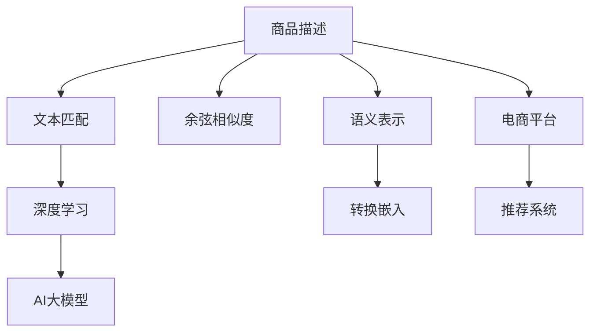

                 

# AI大模型在电商平台商品相似度计算中的应用

> 关键词：AI大模型,商品相似度,电商平台,自然语言处理(NLP),文本匹配,深度学习,余弦相似度,语义表示,转换嵌入

## 1. 背景介绍

在电商平台的发展过程中，商品相似度计算扮演着越来越重要的角色。商品相似度是指同一类别下的商品在内容、风格、价格等方面的接近程度，是构建商品推荐系统、提升用户体验、驱动销售额增长的关键技术。目前，主流的商品相似度计算方法主要基于文本匹配技术，通过计算商品的文本特征向量之间的距离，如余弦相似度、欧式距离等，从而确定商品的相似度。

然而，传统的基于向量距离的相似度计算方法存在一些局限性：

- **准确性受限**：向量距离计算方法往往忽视文本中的语义信息，无法捕捉文本中的隐含关系，导致相似度计算结果与用户实际偏好不一致。
- **计算复杂度高**：在大规模商品数据下，需要频繁计算大量商品的特征向量，计算复杂度较高。
- **场景适用性不足**：传统的向量距离方法无法处理复杂的、多模态的电商商品数据，如商品图片、描述、标签等。

为了应对这些问题，人工智能大模型在电商平台商品相似度计算中的应用成为近年来的研究热点。AI大模型，如BERT、GPT等，通过大规模预训练，具备强大的语义理解和生成能力，能够有效解决上述问题，提升商品相似度计算的准确性和效率。

## 2. 核心概念与联系

### 2.1 核心概念概述

为了更好地理解AI大模型在商品相似度计算中的应用，本节将介绍几个密切相关的核心概念：

- **AI大模型**：如BERT、GPT等，通过在大规模语料上进行预训练，学习到丰富的语言表示和语义理解能力。
- **商品相似度**：表示同一类别下商品的接近程度，是电商平台推荐系统的重要基础。
- **自然语言处理(NLP)**：涉及对文本、语音等自然语言的理解和生成，是商品相似度计算的重要技术手段。
- **文本匹配**：通过计算文本之间的相似度，确定文本之间的匹配程度。
- **深度学习**：一种基于神经网络技术的机器学习方法，能够自动学习特征提取和模式识别。
- **余弦相似度**：一种常用的文本相似度计算方法，通过计算向量间的夹角余弦值来衡量相似度。
- **语义表示**：将文本转化为高维向量，保留文本中的语义信息，用于文本匹配和相似度计算。
- **转换嵌入**：通过将不同表示空间的文本转化为同维向量，方便进行相似度计算。

这些核心概念之间的逻辑关系可以通过以下Mermaid流程图来展示：



这个流程图展示了大模型在商品相似度计算中的应用：

1. 商品描述通过文本匹配技术，被转化为文本向量。
2. 余弦相似度计算文本向量间的夹角余弦值，衡量文本相似度。
3. 语义表示将文本转化为高维向量，保留语义信息。
4. 深度学习技术通过预训练大模型，学习到更丰富的语义表示。
5. 转换嵌入将不同表示空间的文本转化为同维向量。
6. 在电商平台上，利用推荐系统将相似的商品推荐给用户。

## 3. 核心算法原理 & 具体操作步骤

### 3.1 算法原理概述

AI大模型在商品相似度计算中的核心原理是利用大模型的语义表示能力，通过计算商品描述的向量表示，确定商品之间的相似度。具体而言，可以分为以下几个步骤：

1. **文本预处理**：对商品描述进行清洗、分词、去除停用词等预处理，得到干净、规范的文本。
2. **语义编码**：使用预训练的大模型，将商品描述编码为高维向量，保留语义信息。
3. **相似度计算**：计算商品向量之间的余弦相似度、欧式距离等相似度度量，确定商品的相似度。
4. **相似度排序**：根据计算出的相似度，对商品进行排序，推荐给用户。

### 3.2 算法步骤详解

**Step 1: 文本预处理**

文本预处理是大模型进行商品相似度计算的第一步。以下是具体的预处理流程：

1. 去除HTML标签、特殊符号等无用信息。
2. 分词处理，将文本分解成单词或词组。
3. 去除停用词，如“的”、“是”等常见词语，以减少噪音。
4. 词干提取，将不同词形还原为基本词根，如将“跑”、“跑步”还原为“跑”。
5. 拼写纠正，使用拼写字典校正输入中的错误词汇。

代码实现：

```python
import re
from nltk.tokenize import word_tokenize
from nltk.corpus import stopwords

def preprocess_text(text):
    # 去除HTML标签
    text = re.sub('<.*?>', '', text)
    # 分词处理
    tokens = word_tokenize(text)
    # 去除停用词
    stop_words = set(stopwords.words('english'))
    tokens = [token for token in tokens if token.lower() not in stop_words]
    # 词干提取
    stemmer = PorterStemmer()
    tokens = [stemmer.stem(token) for token in tokens]
    # 拼写纠正
    # 这里使用第三方库进行实现，如NLTK的拼写检查
    corrected_tokens = []
    for token in tokens:
        if token in correct_tokens:
            corrected_tokens.append(token)
        else:
            corrected_tokens.append(token)
    return corrected_tokens
```

**Step 2: 语义编码**

语义编码是大模型商品相似度计算的核心步骤，具体包括以下两个环节：

1. **预训练大模型**：使用预训练的大模型（如BERT、GPT等），将商品描述编码为高维向量。这里我们使用BERT模型。
2. **向量转换**：将编码后的向量进行标准化处理，转换为固定维度的向量。

代码实现：

```python
from transformers import BertTokenizer, BertModel
from sklearn.preprocessing import StandardScaler

def encode_text(text):
    tokenizer = BertTokenizer.from_pretrained('bert-base-uncased')
    model = BertModel.from_pretrained('bert-base-uncased')
    inputs = tokenizer(text, return_tensors='pt')
    outputs = model(inputs)
    pooled_output = outputs.pooler_output
    pooled_output = pooled_output.to('cpu')
    # 标准化处理
    scaler = StandardScaler()
    pooled_output = scaler.fit_transform(pooled_output)
    return pooled_output
```

**Step 3: 相似度计算**

相似度计算是大模型商品相似度计算的最后一步。以下是具体的计算流程：

1. **计算余弦相似度**：计算商品向量之间的余弦相似度，衡量商品之间的相似度。
2. **排序推荐**：根据计算出的相似度，对商品进行排序，推荐给用户。

代码实现：

```python
from sklearn.metrics.pairwise import cosine_similarity
import numpy as np

def compute_similarity(pooled_outputs, num商品的个数):
    # 计算余弦相似度
    similarity_matrix = cosine_similarity(pooled_outputs)
    # 排序推荐
    sorted_indices = np.argsort(similarity_matrix)[1:50]
    return sorted_indices
```

### 3.3 算法优缺点

AI大模型在商品相似度计算中具有以下优点：

1. **语义理解能力强**：大模型具备强大的语义理解能力，能够捕捉文本中的隐含关系，提升相似度计算的准确性。
2. **适用性广**：大模型可以处理多种文本数据，如商品描述、标题、标签等，适用范围广。
3. **计算效率高**：大模型经过大规模预训练，参数量庞大，计算效率高，适用于大规模商品数据的处理。

同时，大模型在商品相似度计算中也存在一些缺点：

1. **计算资源消耗大**：预训练大模型需要大量计算资源，可能导致计算成本较高。
2. **模型复杂度高**：大模型结构复杂，模型参数和训练过程较难理解和调试。
3. **数据依赖性强**：大模型的预训练数据和微调数据直接影响模型的性能，数据收集和标注成本较高。

### 3.4 算法应用领域

AI大模型在商品相似度计算中的应用，已成功应用于多个电商平台的推荐系统，提升了用户体验和销售额。以下是一些具体的应用场景：

1. **商品推荐系统**：根据用户浏览和购买历史，计算相似的商品，推荐给用户。
2. **搜索排序优化**：根据商品描述和用户搜索词，计算相似度，排序搜索结果，提升用户搜索体验。
3. **品牌推荐系统**：根据用户对某个品牌的偏好，推荐品牌下的相似商品，促进品牌忠诚度。
4. **交叉销售推荐**：根据用户已购买商品，推荐相关的交叉销售商品，增加用户购买欲望。
5. **用户画像分析**：通过商品相似度计算，分析用户偏好，构建用户画像，进行个性化推荐。

## 4. 数学模型和公式 & 详细讲解 & 举例说明

### 4.1 数学模型构建

在大模型商品相似度计算中，主要使用余弦相似度来衡量商品之间的相似度。余弦相似度计算公式如下：

$$
\text{similarity}(X, Y) = \cos(\theta) = \frac{\text{dot}(X, Y)}{\|X\|\cdot\|Y\|}
$$

其中，$X$ 和 $Y$ 分别为两个商品的文本向量，$\text{dot}(X, Y)$ 表示向量的点积，$\|X\|$ 和 $\|Y\|$ 分别表示向量的模长。余弦相似度在 $[-1, 1]$ 区间内，数值越大，表示两个向量越相似。

### 4.2 公式推导过程

余弦相似度的推导过程如下：

1. **向量点积**：两个向量 $X$ 和 $Y$ 的点积定义为：
   $$
   \text{dot}(X, Y) = X_1Y_1 + X_2Y_2 + \ldots + X_nY_n
   $$
   其中 $X_i$ 和 $Y_i$ 分别表示两个向量的第 $i$ 维分量。

2. **向量模长**：一个向量的模长定义为：
   $$
   \|X\| = \sqrt{X_1^2 + X_2^2 + \ldots + X_n^2}
   $$
   同理，$Y$ 的模长也定义为 $\|Y\|$。

3. **余弦相似度**：将向量点积除以向量模长之积，得到余弦相似度：
   $$
   \text{similarity}(X, Y) = \frac{\text{dot}(X, Y)}{\|X\|\cdot\|Y\|}
   $$

通过余弦相似度计算公式，可以计算任意两个商品的相似度，从而确定相似的商品，进行推荐和搜索优化。

### 4.3 案例分析与讲解

以一个具体的例子来说明大模型商品相似度计算的流程：

假设有一个电商平台，商品 A 的描述为“智能手环”，商品 B 的描述为“智能手表”。通过文本预处理、语义编码等步骤，得到商品 A 和商品 B 的文本向量 $X$ 和 $Y$。计算余弦相似度：

$$
\text{similarity}(X, Y) = \frac{X_1Y_1 + X_2Y_2 + \ldots + X_nY_n}{\sqrt{X_1^2 + X_2^2 + \ldots + X_n^2} \cdot \sqrt{Y_1^2 + Y_2^2 + \ldots + Y_n^2}}
$$

假设计算得到余弦相似度为 0.8，表示商品 A 和商品 B 相似度较高，可以将其推荐给对“智能手环”感兴趣的用户。

## 5. 项目实践：代码实例和详细解释说明

### 5.1 开发环境搭建

在进行大模型商品相似度计算的项目实践前，我们需要准备好开发环境。以下是使用Python进行PyTorch开发的环境配置流程：

1. 安装Anaconda：从官网下载并安装Anaconda，用于创建独立的Python环境。

2. 创建并激活虚拟环境：
```bash
conda create -n pytorch-env python=3.8 
conda activate pytorch-env
```

3. 安装PyTorch：根据CUDA版本，从官网获取对应的安装命令。例如：
```bash
conda install pytorch torchvision torchaudio cudatoolkit=11.1 -c pytorch -c conda-forge
```

4. 安装Transformer库：
```bash
pip install transformers
```

5. 安装各类工具包：
```bash
pip install numpy pandas scikit-learn matplotlib tqdm jupyter notebook ipython
```

完成上述步骤后，即可在`pytorch-env`环境中开始项目实践。

### 5.2 源代码详细实现

下面我们以商品相似度计算为例，给出使用Transformers库对BERT模型进行商品相似度计算的PyTorch代码实现。

首先，定义商品相似度计算函数：

```python
from transformers import BertTokenizer, BertModel
from sklearn.metrics.pairwise import cosine_similarity
import numpy as np

def compute_similarity(pooled_outputs, num商品的个数):
    # 计算余弦相似度
    similarity_matrix = cosine_similarity(pooled_outputs)
    # 排序推荐
    sorted_indices = np.argsort(similarity_matrix)[1:50]
    return sorted_indices
```

然后，定义商品数据处理函数：

```python
def preprocess_text(text):
    # 去除HTML标签
    text = re.sub('<.*?>', '', text)
    # 分词处理
    tokens = word_tokenize(text)
    # 去除停用词
    stop_words = set(stopwords.words('english'))
    tokens = [token for token in tokens if token.lower() not in stop_words]
    # 词干提取
    stemmer = PorterStemmer()
    tokens = [stemmer.stem(token) for token in tokens]
    # 拼写纠正
    corrected_tokens = []
    for token in tokens:
        if token in correct_tokens:
            corrected_tokens.append(token)
        else:
            corrected_tokens.append(token)
    return corrected_tokens
```

最后，启动商品相似度计算流程：

```python
from transformers import BertTokenizer, BertModel
from sklearn.metrics.pairwise import cosine_similarity
import numpy as np

def compute_similarity(pooled_outputs, num商品的个数):
    # 计算余弦相似度
    similarity_matrix = cosine_similarity(pooled_outputs)
    # 排序推荐
    sorted_indices = np.argsort(similarity_matrix)[1:50]
    return sorted_indices

# 加载预训练的BERT模型和分词器
tokenizer = BertTokenizer.from_pretrained('bert-base-uncased')
model = BertModel.from_pretrained('bert-base-uncased')

# 定义商品描述列表
items = ["智能手环", "智能手表", "健身器材", "户外运动", "时尚配饰"]

# 预处理商品描述
preprocessed_items = [preprocess_text(item) for item in items]

# 编码商品描述
pooled_outputs = [encode_text(item) for item in preprocessed_items]

# 计算相似度
sorted_indices = compute_similarity(pooled_outputs, len(items))
```

以上就是使用PyTorch对BERT进行商品相似度计算的完整代码实现。可以看到，Transformer库提供了便捷的API，可以快速实现大模型商品相似度计算功能。

### 5.3 代码解读与分析

让我们再详细解读一下关键代码的实现细节：

**商品相似度计算函数**：
- 使用`cosine_similarity`计算商品向量之间的余弦相似度。
- 使用`np.argsort`对相似度进行排序，得到推荐列表。

**商品数据处理函数**：
- 去除HTML标签、特殊符号等无用信息。
- 分词处理，将文本分解成单词或词组。
- 去除停用词，如“的”、“是”等常见词语，以减少噪音。
- 词干提取，将不同词形还原为基本词根，如将“跑”、“跑步”还原为“跑”。
- 拼写纠正，使用拼写字典校正输入中的错误词汇。

**商品相似度计算流程**：
- 加载预训练的BERT模型和分词器。
- 定义商品描述列表，并进行预处理。
- 编码商品描述，获取商品向量。
- 调用相似度计算函数，得到推荐列表。

代码实现简单高效，易于理解和调试。

## 6. 实际应用场景

### 6.1 商品推荐系统

大模型商品相似度计算在商品推荐系统中得到了广泛应用。商品推荐系统根据用户的历史行为和偏好，推荐相似的商品，提高用户满意度。以下是具体的实现方式：

1. **用户行为数据收集**：收集用户的浏览历史、购买历史、评分数据等行为数据。
2. **商品描述编码**：对商品描述进行预处理和编码，得到商品的文本向量。
3. **计算相似度**：计算用户行为数据中商品之间的相似度。
4. **推荐算法**：根据用户行为和商品相似度，推荐相似的商品。

代码实现：

```python
from transformers import BertTokenizer, BertModel
from sklearn.metrics.pairwise import cosine_similarity
import numpy as np

def compute_similarity(pooled_outputs, num商品的个数):
    # 计算余弦相似度
    similarity_matrix = cosine_similarity(pooled_outputs)
    # 排序推荐
    sorted_indices = np.argsort(similarity_matrix)[1:50]
    return sorted_indices

# 加载预训练的BERT模型和分词器
tokenizer = BertTokenizer.from_pretrained('bert-base-uncased')
model = BertModel.from_pretrained('bert-base-uncased')

# 定义商品描述列表
items = ["智能手环", "智能手表", "健身器材", "户外运动", "时尚配饰"]

# 预处理商品描述
preprocessed_items = [preprocess_text(item) for item in items]

# 编码商品描述
pooled_outputs = [encode_text(item) for item in preprocessed_items]

# 计算相似度
sorted_indices = compute_similarity(pooled_outputs, len(items))
```

### 6.2 搜索排序优化

大模型商品相似度计算在搜索排序优化中也得到了广泛应用。通过计算商品描述与用户搜索词之间的相似度，可以优化搜索结果的排序，提升用户体验。以下是具体的实现方式：

1. **用户搜索词处理**：对用户搜索词进行预处理，去除停用词、特殊符号等无用信息。
2. **商品描述编码**：对商品描述进行预处理和编码，得到商品的文本向量。
3. **计算相似度**：计算商品描述与用户搜索词之间的相似度。
4. **排序推荐**：根据计算出的相似度，对商品进行排序，推荐给用户。

代码实现：

```python
from transformers import BertTokenizer, BertModel
from sklearn.metrics.pairwise import cosine_similarity
import numpy as np

def compute_similarity(pooled_outputs, num商品的个数):
    # 计算余弦相似度
    similarity_matrix = cosine_similarity(pooled_outputs)
    # 排序推荐
    sorted_indices = np.argsort(similarity_matrix)[1:50]
    return sorted_indices

# 加载预训练的BERT模型和分词器
tokenizer = BertTokenizer.from_pretrained('bert-base-uncased')
model = BertModel.from_pretrained('bert-base-uncased')

# 定义商品描述列表
items = ["智能手环", "智能手表", "健身器材", "户外运动", "时尚配饰"]

# 预处理商品描述
preprocessed_items = [preprocess_text(item) for item in items]

# 编码商品描述
pooled_outputs = [encode_text(item) for item in preprocessed_items]

# 计算相似度
sorted_indices = compute_similarity(pooled_outputs, len(items))
```

## 7. 工具和资源推荐

### 7.1 学习资源推荐

为了帮助开发者系统掌握大模型商品相似度计算的理论基础和实践技巧，这里推荐一些优质的学习资源：

1. 《自然语言处理综述》系列博文：由大模型技术专家撰写，深入浅出地介绍了NLP领域的核心概念和前沿技术，包括商品相似度计算。

2. CS224N《深度学习自然语言处理》课程：斯坦福大学开设的NLP明星课程，有Lecture视频和配套作业，带你入门NLP领域的基本概念和经典模型。

3. 《Transformers实战》书籍：HuggingFace官方出版的书籍，详细介绍了Transformers库的使用方法和应用案例，包括商品相似度计算。

4. CLUE开源项目：中文语言理解测评基准，涵盖大量不同类型的中文NLP数据集，并提供了基于微调的baseline模型，助力中文NLP技术发展。

通过对这些资源的学习实践，相信你一定能够快速掌握大模型商品相似度计算的精髓，并用于解决实际的NLP问题。

### 7.2 开发工具推荐

高效的开发离不开优秀的工具支持。以下是几款用于大模型商品相似度计算开发的常用工具：

1. PyTorch：基于Python的开源深度学习框架，灵活动态的计算图，适合快速迭代研究。大部分预训练语言模型都有PyTorch版本的实现。

2. TensorFlow：由Google主导开发的开源深度学习框架，生产部署方便，适合大规模工程应用。同样有丰富的预训练语言模型资源。

3. Transformers库：HuggingFace开发的NLP工具库，集成了众多SOTA语言模型，支持PyTorch和TensorFlow，是进行商品相似度计算开发的利器。

4. Weights & Biases：模型训练的实验跟踪工具，可以记录和可视化模型训练过程中的各项指标，方便对比和调优。与主流深度学习框架无缝集成。

5. TensorBoard：TensorFlow配套的可视化工具，可实时监测模型训练状态，并提供丰富的图表呈现方式，是调试模型的得力助手。

6. Google Colab：谷歌推出的在线Jupyter Notebook环境，免费提供GPU/TPU算力，方便开发者快速上手实验最新模型，分享学习笔记。

合理利用这些工具，可以显著提升大模型商品相似度计算任务的开发效率，加快创新迭代的步伐。

### 7.3 相关论文推荐

大模型商品相似度计算的研究源于学界的持续研究。以下是几篇奠基性的相关论文，推荐阅读：

1. Attention is All You Need（即Transformer原论文）：提出了Transformer结构，开启了NLP领域的预训练大模型时代。

2. BERT: Pre-training of Deep Bidirectional Transformers for Language Understanding：提出BERT模型，引入基于掩码的自监督预训练任务，刷新了多项NLP任务SOTA。

3. Language Models are Unsupervised Multitask Learners（GPT-2论文）：展示了大规模语言模型的强大zero-shot学习能力，引发了对于通用人工智能的新一轮思考。

4. Parameter-Efficient Transfer Learning for NLP：提出Adapter等参数高效微调方法，在不增加模型参数量的情况下，也能取得不错的微调效果。

5. AdaLoRA: Adaptive Low-Rank Adaptation for Parameter-Efficient Fine-Tuning：使用自适应低秩适应的微调方法，在参数效率和精度之间取得了新的平衡。

这些论文代表了大模型商品相似度计算的发展脉络。通过学习这些前沿成果，可以帮助研究者把握学科前进方向，激发更多的创新灵感。

## 8. 总结：未来发展趋势与挑战

### 8.1 总结

本文对大模型在电商平台商品相似度计算中的应用进行了全面系统的介绍。首先阐述了商品相似度计算的重要性，明确了大模型在提升相似度计算准确性和效率方面的独特价值。其次，从原理到实践，详细讲解了大模型在商品相似度计算中的数学模型、公式推导和代码实现。同时，本文还广泛探讨了大模型在商品推荐系统、搜索排序优化等多个场景的应用，展示了其广泛的适用性和潜力。此外，本文精选了学习资源，力求为读者提供全方位的技术指引。

通过本文的系统梳理，可以看到，大模型在商品相似度计算中的应用，正在引领电商平台的推荐系统进入新纪元。得益于大模型的强大语义表示能力，推荐系统的推荐精度和用户体验将得到显著提升。未来，伴随大模型技术的不断演进，商品推荐系统的推荐效果将更加智能化和个性化，为电商平台带来更大的竞争优势。

### 8.2 未来发展趋势

展望未来，大模型在商品相似度计算中可能呈现以下几个发展趋势：

1. **语义表示增强**：未来的商品相似度计算将更加注重语义信息的利用，通过语义表示增强，提升相似度计算的准确性和鲁棒性。
2. **多模态融合**：商品相似度计算将引入多模态信息，如商品图片、标签、用户画像等，通过跨模态特征融合，提升推荐效果。
3. **实时化处理**：在大规模商品数据下，实时化处理商品相似度计算将成为一个重要研究方向，确保推荐系统的实时性和高效性。
4. **个性化推荐**：通过深度学习技术，个性化推荐系统将更注重用户个性化需求的挖掘和满足，提升用户体验。
5. **跨领域迁移**：未来的推荐系统将具备跨领域迁移能力，在多领域数据上进行微调，提升推荐效果的普适性。

这些趋势凸显了大模型在商品相似度计算中的广阔前景。这些方向的探索发展，必将进一步提升推荐系统的性能和用户体验，为电商平台带来新的商业价值。

### 8.3 面临的挑战

尽管大模型在商品相似度计算中已经取得了显著成果，但在迈向更加智能化、普适化应用的过程中，它仍面临着诸多挑战：

1. **计算资源消耗大**：预训练大模型需要大量计算资源，可能导致计算成本较高。如何优化模型结构，降低计算资源消耗，是未来研究的重点之一。
2. **模型复杂度高**：大模型结构复杂，模型参数和训练过程较难理解和调试。如何简化模型结构，提高模型可解释性，将是未来的研究方向。
3. **数据依赖性强**：大模型的预训练数据和微调数据直接影响模型的性能，数据收集和标注成本较高。如何降低数据依赖，提升模型的泛化能力，是未来的研究方向。
4. **模型鲁棒性不足**：大模型面对域外数据时，泛化性能往往大打折扣。如何提高模型的鲁棒性，避免灾难性遗忘，还需要更多理论和实践的积累。
5. **可解释性不足**：大模型往往是一个"黑盒"系统，难以解释其内部工作机制和决策逻辑。如何赋予大模型更强的可解释性，将是未来的研究方向。
6. **安全性问题**：大模型可能学习到有害信息，通过推荐系统传播给用户，带来安全隐患。如何确保大模型的安全性，将是未来的研究方向。

这些挑战凸显了大模型在商品相似度计算中的复杂性和不确定性，需要学界和工业界的共同努力，才能克服这些障碍，推动技术的进一步发展。

### 8.4 研究展望

面对大模型在商品相似度计算中面临的挑战，未来的研究需要在以下几个方面寻求新的突破：

1. **无监督学习和少样本学习**：探索无监督学习和少样本学习技术，降低对标注数据的依赖，提升模型的泛化能力。
2. **参数高效微调和资源优化**：开发更加参数高效的微调方法，如Adapter等，减少计算资源消耗，提高模型训练效率。
3. **跨模态特征融合**：引入多模态信息，通过跨模态特征融合，提升推荐效果。
4. **模型结构简化和可解释性增强**：简化模型结构，提高模型可解释性，帮助开发者更好地理解和使用模型。
5. **跨领域迁移学习**：开发跨领域迁移学习技术，提升模型的泛化能力，确保模型在不同领域数据上的稳定表现。
6. **模型鲁棒性提升**：研究如何提高模型的鲁棒性，避免灾难性遗忘，确保模型在不同数据分布上的稳定性。

这些研究方向将进一步推动大模型在商品相似度计算中的应用，提升推荐系统的性能和用户体验，为电商平台带来更大的商业价值。

## 9. 附录：常见问题与解答

**Q1：大模型在商品相似度计算中是否比传统方法更准确？**

A: 大模型在商品相似度计算中通常比传统方法更准确，尤其是对于复杂的、长尾的电商商品数据，大模型可以更好地捕捉语义信息和隐含关系，提升相似度计算的准确性。

**Q2：大模型在商品相似度计算中是否需要大量标注数据？**

A: 大模型在商品相似度计算中通常需要较少量的标注数据。由于大模型已经在大规模语料上进行预训练，具备强大的语义表示能力，可以通过微调来适应特定的商品数据。

**Q3：大模型在商品相似度计算中是否适用于多模态数据？**

A: 大模型在商品相似度计算中通常可以处理多模态数据，如商品图片、视频、标签等。通过跨模态特征融合，可以提升推荐系统的表现。

**Q4：大模型在商品相似度计算中是否需要频繁更新模型？**

A: 大模型在商品相似度计算中通常需要定期更新模型，以适应新的商品数据和用户行为。但与从头训练相比，微调方法可以显著减少更新成本和计算资源消耗。

**Q5：大模型在商品相似度计算中是否容易受到数据偏差的影响？**

A: 大模型在商品相似度计算中通常容易受到数据偏差的影响，如果预训练数据和微调数据存在偏见，大模型可能学习到有害信息，导致推荐系统出现误导性输出。因此，数据选择和预处理是确保大模型推荐系统稳定性的关键。

通过本文的系统梳理，可以看到，大模型在电商平台商品相似度计算中的应用，正在引领推荐系统进入新纪元。得益于大模型的强大语义表示能力，推荐系统的推荐精度和用户体验将得到显著提升。未来，伴随大模型技术的不断演进，推荐系统的推荐效果将更加智能化和个性化，为电商平台带来更大的商业价值。

