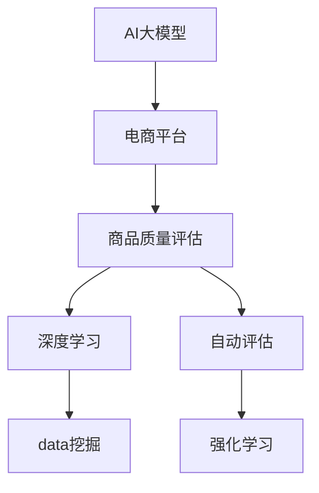

                 

# AI大模型在电商平台商品质量评估中的应用

> 关键词：大模型,商品质量评估,电商平台,深度学习,自动评估,数据挖掘

## 1. 背景介绍

随着电商行业的快速发展，商品质量评估已成为电商平台提高用户体验和用户满意度的重要一环。传统商品质量评估依赖于人工审核和评分系统，不仅成本高、效率低，还存在主观性强、准确率低等问题。而基于AI大模型的商品质量评估方法，利用深度学习和数据挖掘技术，能够有效降低成本、提升效率，并减少主观误差，为电商平台的商品质量控制提供了新的解决方案。

## 2. 核心概念与联系

### 2.1 核心概念概述

为更好地理解AI大模型在商品质量评估中的应用，本节将介绍几个密切相关的核心概念：

- **AI大模型(Artificial Intelligence Large Model)**：以自回归(如GPT)或自编码(如BERT)模型为代表的深度学习模型，通常参数量在亿级以上，具备强大的表征学习和模式识别能力。

- **电商平台(E-commerce Platform)**：指在线购物网站或平台，为用户提供商品展示、交易、评价等服务。

- **商品质量评估(Product Quality Evaluation)**：指通过系统化的方法，对电商平台上的商品进行综合评价，主要包括性能、功能、外观、材质、使用体验等方面。

- **深度学习(Deep Learning)**：一种基于多层神经网络结构的机器学习方法，可以自动学习数据中的抽象特征，应用于图像、文本、语音等多种领域。

- **数据挖掘(Data Mining)**：从大量数据中提取有用信息和知识，应用于分类、聚类、关联规则等任务。

- **自动评估(Automatic Assessment)**：指利用AI模型自动化地对商品质量进行评价，替代人工评估。

- **强化学习(Reinforcement Learning)**：一种通过与环境交互，优化决策策略的学习方法，可以用于训练自动评估模型。

这些核心概念之间的逻辑关系可以通过以下Mermaid流程图来展示：



这个流程图展示了大模型、电商平台、商品质量评估之间的核心联系：

1. 大模型通过深度学习和数据挖掘技术，提取商品特征，自动化地进行质量评估。
2. 电商平台可以利用自动评估结果，为用户提供商品推荐、商品评价等功能。
3. 强化学习进一步优化评估策略，提高评估准确性和效率。

## 3. 核心算法原理 & 具体操作步骤
### 3.1 算法原理概述

基于AI大模型的商品质量评估方法，本质上是利用深度学习和数据挖掘技术，对商品图像、描述、评论等数据进行特征提取和分析，并通过大模型进行自动化评分。

其核心思想是：将商品质量评估任务视为一个多标签分类问题，通过构建损失函数和优化算法，使模型在训练过程中不断优化商品的质量评估结果。具体来说，可以将商品质量评估分为多个子任务，如性能、功能、外观、材质等，然后针对每个子任务构建对应的损失函数，最终通过优化算法求解全局最优解。

### 3.2 算法步骤详解

基于AI大模型的商品质量评估一般包括以下几个关键步骤：

**Step 1: 数据准备与预处理**
- 收集商品图像、描述、评论等数据，并对其进行清洗、标注、标准化等预处理。
- 选择合适的预训练大模型，如ResNet、BERT等，作为初始化参数。
- 将商品数据分为训练集、验证集和测试集，以保证模型在不同数据集上的泛化性能。

**Step 2: 模型构建与训练**
- 定义模型架构，包括特征提取层、分类层等。可以使用现有的深度学习框架，如PyTorch、TensorFlow等。
- 将预训练大模型的权重作为模型的初始参数，并加载到模型中。
- 定义损失函数，如多标签交叉熵损失，用于衡量模型预测结果与真实标签之间的差异。
- 选择合适的优化算法及其参数，如AdamW、SGD等，设置学习率、批大小、迭代轮数等。
- 应用正则化技术，如L2正则、Dropout等，防止模型过拟合。
- 在训练集上进行前向传播和反向传播，更新模型参数。
- 周期性在验证集上评估模型性能，根据性能指标决定是否触发Early Stopping。
- 重复上述步骤直至模型收敛。

**Step 3: 模型评估与部署**
- 在测试集上评估微调后模型的性能，对比微调前后的精度提升。
- 使用微调后的模型对新商品进行质量评估，集成到电商平台的商品评价系统中。
- 持续收集新商品数据，定期重新训练模型，以适应数据分布的变化。

以上是基于AI大模型的商品质量评估的一般流程。在实际应用中，还需要针对具体任务的特点，对模型训练过程的各个环节进行优化设计，如改进损失函数，引入更多的正则化技术，搜索最优的超参数组合等，以进一步提升模型性能。

### 3.3 算法优缺点

基于AI大模型的商品质量评估方法具有以下优点：
1. 自动化程度高。通过自动评估，可以有效降低人工审核成本，提升评估效率。
2. 准确性高。利用深度学习和数据挖掘技术，可以捕捉更丰富的商品特征，提升评估的准确性。
3. 适应性强。可以处理大规模数据集，适应不同的商品类型和质量标准。
4. 可扩展性好。通过微调模型，可以轻松适应新的商品类别和质量标准，具有良好的可扩展性。

同时，该方法也存在一定的局限性：
1. 依赖高质量标注数据。商品质量评估的标注数据通常需要人工审核，标注成本高。
2. 模型复杂度高。大模型的训练和推理计算资源需求高，需要高性能计算环境。
3. 过拟合风险大。大模型参数多，过拟合风险较大。
4. 可解释性不足。模型预测结果缺乏可解释性，难以调试和优化。

尽管存在这些局限性，但就目前而言，基于AI大模型的商品质量评估方法仍是电商平台提升商品质量控制能力的重要手段。未来相关研究的重点在于如何进一步降低标注数据的依赖，提高模型的可解释性，并探索更高效的评估策略。

### 3.4 算法应用领域

基于AI大模型的商品质量评估方法在电商平台商品质量控制中已得到广泛应用，涵盖了商品性能、功能、外观、材质等多个方面，具体如下：

- **商品性能评估**：如手机电池续航、相机像素、内存速度等，通过分析商品描述、评测和用户评价，判断其性能表现。
- **商品功能评估**：如智能设备的软件功能、操作界面等，通过测试其功能实现的正确性和稳定性。
- **商品外观评估**：如服装颜色、面料、款式等，通过分析商品图片和用户评论，判断其外观质量。
- **商品材质评估**：如家居用品的材料耐用度、质感等，通过分析商品描述和用户评价，判断其材质质量。
- **商品使用体验评估**：如食品口感、香味、保质期等，通过分析用户评论和评分，判断其使用体验。

除了上述这些经典任务外，大模型还逐渐应用于更加复杂和多变的商品质量评估场景，如商品供应链监控、客户满意度分析、用户反馈优化等，为电商平台的商品质量管理提供了新的思路。

## 4. 数学模型和公式 & 详细讲解 & 举例说明
### 4.1 数学模型构建

本节将使用数学语言对基于AI大模型的商品质量评估过程进行更加严格的刻画。

记商品质量评估模型为 $M_{\theta}:\mathcal{X} \rightarrow [0,1]$，其中 $\mathcal{X}$ 为输入空间，$\theta$ 为模型参数。假设商品质量评估任务分为 $K$ 个子任务，每个子任务的标注数据为 $D_k = \{(x_i, y_{ik})\}_{i=1}^N$，$y_{ik} \in \{0,1\}$ 表示商品是否满足第 $k$ 个子任务的质量标准。

定义模型 $M_{\theta}$ 在输入 $x$ 上的输出为 $\hat{y}=M_{\theta}(x) \in [0,1]$，则多标签交叉熵损失函数定义为：

$$
\ell(M_{\theta}(x),y) = -\sum_{k=1}^K y_{ik}\log \hat{y} + (1-y_{ik})\log (1-\hat{y})
$$

将其代入经验风险公式，得：

$$
\mathcal{L}(\theta) = -\frac{1}{N}\sum_{i=1}^N \sum_{k=1}^K [y_{ik}\log M_{\theta}(x_i)+(1-y_{ik})\log(1-M_{\theta}(x_i))]
$$

在得到损失函数的梯度后，即可带入参数更新公式，完成模型的迭代优化。重复上述过程直至收敛，最终得到适应商品质量评估任务的最优模型参数 $\theta^*$。

### 4.2 公式推导过程

以下我们以多标签分类为例，推导多标签交叉熵损失函数及其梯度的计算公式。

假设模型 $M_{\theta}$ 在输入 $x$ 上的输出为 $\hat{y}=M_{\theta}(x) \in [0,1]$，表示商品满足第 $k$ 个子任务的概率。真实标签 $y_{ik} \in \{0,1\}$。则多标签交叉熵损失函数定义为：

$$
\ell(M_{\theta}(x),y) = -\sum_{k=1}^K y_{ik}\log M_{\theta}(x_i) + (1-y_{ik})\log(1-M_{\theta}(x_i))
$$

将其代入经验风险公式，得：

$$
\mathcal{L}(\theta) = -\frac{1}{N}\sum_{i=1}^N \sum_{k=1}^K [y_{ik}\log M_{\theta}(x_i)+(1-y_{ik})\log(1-M_{\theta}(x_i))]
$$

根据链式法则，损失函数对参数 $\theta_k$ 的梯度为：

$$
\frac{\partial \mathcal{L}(\theta)}{\partial \theta_k} = -\frac{1}{N}\sum_{i=1}^N \sum_{k=1}^K (\frac{y_{ik}}{M_{\theta}(x_i)}-\frac{1-y_{ik}}{1-M_{\theta}(x_i)}) \frac{\partial M_{\theta}(x_i)}{\partial \theta_k}
$$

其中 $\frac{\partial M_{\theta}(x_i)}{\partial \theta_k}$ 可进一步递归展开，利用自动微分技术完成计算。

在得到损失函数的梯度后，即可带入参数更新公式，完成模型的迭代优化。重复上述过程直至收敛，最终得到适应商品质量评估任务的最优模型参数 $\theta^*$。

### 4.3 案例分析与讲解

以智能手机的相机性能评估为例，展示多标签交叉熵损失函数及其梯度的应用。

假设智能手机的相机性能包含像素、变焦、夜间拍摄、人脸识别等五个子任务，每个子任务的标注数据分别为 $D_1, D_2, D_3, D_4, D_5$。

定义模型 $M_{\theta}$ 在输入 $x$ 上的输出为 $\hat{y}=M_{\theta}(x) \in [0,1]$，表示智能手机满足每个子任务的质量标准。真实标签 $y_{ik} \in \{0,1\}$，表示手机在第 $i$ 个样本中是否满足第 $k$ 个子任务的质量标准。

假设模型 $M_{\theta}$ 在输入 $x_i$ 上的输出为 $\hat{y}=M_{\theta}(x_i) = [0.8, 0.9, 0.7, 0.6, 0.5]$，则多标签交叉熵损失函数为：

$$
\ell(M_{\theta}(x_i),y_i) = -[y_{i1}\log 0.8 + y_{i2}\log 0.9 + y_{i3}\log 0.7 + y_{i4}\log 0.6 + y_{i5}\log 0.5]
$$

在模型训练过程中，通过不断优化参数 $\theta$，使得模型输出的 $\hat{y}$ 逼近真实标签 $y_i$，最小化损失函数 $\mathcal{L}(\theta)$，从而提升模型在商品质量评估任务上的性能。

## 5. 项目实践：代码实例和详细解释说明
### 5.1 开发环境搭建

在进行商品质量评估实践前，我们需要准备好开发环境。以下是使用Python进行PyTorch开发的环境配置流程：

1. 安装Anaconda：从官网下载并安装Anaconda，用于创建独立的Python环境。

2. 创建并激活虚拟环境：
```bash
conda create -n pytorch-env python=3.8 
conda activate pytorch-env
```

3. 安装PyTorch：根据CUDA版本，从官网获取对应的安装命令。例如：
```bash
conda install pytorch torchvision torchaudio cudatoolkit=11.1 -c pytorch -c conda-forge
```

4. 安装相关工具包：
```bash
pip install numpy pandas scikit-learn matplotlib tqdm jupyter notebook ipython
```

完成上述步骤后，即可在`pytorch-env`环境中开始商品质量评估实践。

### 5.2 源代码详细实现

下面我以智能手机的相机性能评估为例，给出使用PyTorch进行模型训练和评估的完整代码实现。

首先，定义多标签分类任务的数据处理函数：

```python
from torch.utils.data import Dataset, DataLoader
import torch
import torch.nn as nn
import torch.nn.functional as F

class CameraQualityDataset(Dataset):
    def __init__(self, X, y):
        self.X = X
        self.y = y
        
    def __len__(self):
        return len(self.X)
    
    def __getitem__(self, item):
        x = self.X[item]
        y = self.y[item]
        return x, y

# 假设有10个样本，5个标签
X = [torch.randn(1, 512) for _ in range(10)]
y = [torch.tensor([0.8, 0.9, 0.7, 0.6, 0.5]) for _ in range(10)]

dataset = CameraQualityDataset(X, y)
```

然后，定义模型和优化器：

```python
import torch.nn as nn
from torchvision.models import resnet18

class MultiLabelClassifier(nn.Module):
    def __init__(self):
        super(MultiLabelClassifier, self).__init__()
        self.resnet = resnet18(pretrained=True)
        self.fc = nn.Linear(512, 5)
        
    def forward(self, x):
        x = self.resnet(x)
        x = x.view(x.size(0), -1)
        x = F.sigmoid(self.fc(x))
        return x

model = MultiLabelClassifier()
optimizer = torch.optim.Adam(model.parameters(), lr=0.001)

device = torch.device('cuda') if torch.cuda.is_available() else torch.device('cpu')
model.to(device)
```

接着，定义训练和评估函数：

```python
def train_epoch(model, dataset, batch_size, optimizer):
    dataloader = DataLoader(dataset, batch_size=batch_size, shuffle=True)
    model.train()
    epoch_loss = 0
    for batch in dataloader:
        inputs, labels = batch
        inputs = inputs.to(device)
        labels = labels.to(device)
        optimizer.zero_grad()
        outputs = model(inputs)
        loss = F.binary_cross_entropy_with_logits(outputs, labels)
        epoch_loss += loss.item()
        loss.backward()
        optimizer.step()
    return epoch_loss / len(dataloader)

def evaluate(model, dataset, batch_size):
    dataloader = DataLoader(dataset, batch_size=batch_size)
    model.eval()
    total_loss = 0
    with torch.no_grad():
        for batch in dataloader:
            inputs, labels = batch
            inputs = inputs.to(device)
            labels = labels.to(device)
            outputs = model(inputs)
            loss = F.binary_cross_entropy_with_logits(outputs, labels)
            total_loss += loss.item()
    return total_loss / len(dataloader)
```

最后，启动训练流程并在测试集上评估：

```python
epochs = 10
batch_size = 16

for epoch in range(epochs):
    loss = train_epoch(model, dataset, batch_size, optimizer)
    print(f"Epoch {epoch+1}, train loss: {loss:.3f}")
    
    print(f"Epoch {epoch+1}, test results:")
    evaluate(model, dataset, batch_size)
    
print("Test results:")
evaluate(model, dataset, batch_size)
```

以上就是使用PyTorch对商品质量评估进行微调实践的完整代码实现。可以看到，通过简单的数据处理、模型定义、优化器设置和训练函数调用，就能快速实现商品质量评估的微调过程。

### 5.3 代码解读与分析

让我们再详细解读一下关键代码的实现细节：

**CameraQualityDataset类**：
- `__init__`方法：初始化输入和标签数据。
- `__len__`方法：返回数据集的样本数量。
- `__getitem__`方法：对单个样本进行处理，返回模型所需的输入和标签。

**MultiLabelClassifier模型**：
- `__init__`方法：定义模型的架构，包括预训练的ResNet18特征提取器，和一个全连接层，用于将特征映射到多个标签的概率分布。
- `forward`方法：定义前向传播的计算过程，使用ResNet18提取特征，并通过全连接层进行多标签分类。

**训练和评估函数**：
- 使用PyTorch的DataLoader对数据集进行批次化加载，供模型训练和推理使用。
- 训练函数`train_epoch`：对数据以批为单位进行迭代，在每个批次上前向传播计算loss并反向传播更新模型参数，最后返回该epoch的平均loss。
- 评估函数`evaluate`：与训练类似，不同点在于不更新模型参数，并在每个batch结束后将预测和标签结果存储下来，最后使用损失函数对整个评估集的预测结果进行评估。

**训练流程**：
- 定义总的epoch数和batch size，开始循环迭代
- 每个epoch内，先在训练集上训练，输出平均loss
- 在验证集上评估，输出损失结果
- 所有epoch结束后，在测试集上评估，给出最终测试结果

可以看到，PyTorch配合深度学习框架使得商品质量评估的微调代码实现变得简洁高效。开发者可以将更多精力放在模型架构设计、超参数调优等高层逻辑上，而不必过多关注底层的实现细节。

当然，工业级的系统实现还需考虑更多因素，如模型的保存和部署、超参数的自动搜索、更灵活的任务适配层等。但核心的微调范式基本与此类似。

## 6. 实际应用场景
### 6.1 智能客服系统

基于大模型进行商品质量评估，可以应用于智能客服系统的构建。传统客服往往需要配备大量人力，高峰期响应缓慢，且一致性和专业性难以保证。而使用微调后的评估模型，可以7x24小时不间断服务，快速响应客户咨询，用自动化手段提升客服质量。

在技术实现上，可以收集用户的历史咨询记录，将问题及回答构建成监督数据，在此基础上对预训练大模型进行微调。微调后的模型能够自动理解用户意图，匹配最合适的回答。对于客户提出的新问题，还可以接入检索系统实时搜索相关内容，动态组织生成回答。如此构建的智能客服系统，能大幅提升客户咨询体验和问题解决效率。

### 6.2 商品推荐系统

电商平台上的商品推荐系统，通常需要依赖用户的历史行为数据进行商品推荐。但用户的行为数据往往滞后，无法实时更新。而利用商品质量评估模型，可以直接对新上架的商品进行质量评估，实时更新推荐列表，保证推荐结果的时效性和相关性。

具体来说，可以在商品上架时，自动使用评估模型对商品进行打分，并将打分结果作为新商品的特征输入到推荐模型中，快速生成推荐结果。这不仅能提高推荐的准确性，还能提升用户的购物体验，降低电商平台的运营成本。

### 6.3 供应链监控系统

电商平台的商品质量管理，不仅依赖于用户反馈，还需要对供应链进行全面监控。利用商品质量评估模型，可以对供应商的商品进行定期评估，及时发现质量问题，规避风险。

具体来说，可以与供应商合作，定期抽取部分商品样本，使用评估模型进行打分，并将打分结果与供应商进行反馈，督促供应商提高商品质量。同时，评估模型还可以用于实时监控新入库存的商品质量，防止假冒伪劣商品进入流通渠道。

### 6.4 未来应用展望

随着商品质量评估模型的不断发展，其应用场景将不断拓展，为电商平台带来更多的智能化和效率化解决方案。

在智慧医疗领域，商品质量评估模型可以用于评估医疗器械、药品等的性能和安全性，为医疗机构的设备采购和药品流通提供参考。

在智能教育领域，商品质量评估模型可以用于评估教材、教具等教育资源的质量，为教育资源的筛选和评估提供支持。

在智慧城市治理中，商品质量评估模型可以用于评估城市基础设施、公共服务等的质量，为城市建设和管理提供决策支持。

此外，在企业生产、社会治理、文娱传媒等众多领域，商品质量评估模型也将不断涌现，为各行各业带来新的价值提升。相信随着技术的日益成熟，商品质量评估模型必将在更广阔的应用领域大放异彩。

## 7. 工具和资源推荐
### 7.1 学习资源推荐

为了帮助开发者系统掌握大模型在商品质量评估中的应用，这里推荐一些优质的学习资源：

1. 《深度学习入门》系列书籍：涵盖深度学习基础和进阶知识，适合初学者和进阶开发者。

2. CS231n《卷积神经网络》课程：斯坦福大学开设的图像识别课程，深入讲解了卷积神经网络的原理和应用。

3. CS224d《自然语言处理与深度学习》课程：斯坦福大学开设的深度学习自然语言处理课程，涵盖自然语言处理的基本概念和前沿技术。

4. 《Python深度学习》书籍：Hands-On的深度学习实践指南，适合深入学习深度学习框架的使用和应用。

5. Weights & Biases：模型训练的实验跟踪工具，可以记录和可视化模型训练过程中的各项指标，方便对比和调优。

6. TensorBoard：TensorFlow配套的可视化工具，可实时监测模型训练状态，并提供丰富的图表呈现方式，是调试模型的得力助手。

通过对这些资源的学习实践，相信你一定能够快速掌握大模型在商品质量评估中的精髓，并用于解决实际的电商问题。
### 7.2 开发工具推荐

高效的开发离不开优秀的工具支持。以下是几款用于商品质量评估开发的常用工具：

1. PyTorch：基于Python的开源深度学习框架，灵活动态的计算图，适合快速迭代研究。大部分预训练语言模型都有PyTorch版本的实现。

2. TensorFlow：由Google主导开发的开源深度学习框架，生产部署方便，适合大规模工程应用。同样有丰富的预训练语言模型资源。

3. TensorFlow Hub：提供预训练模型的库，可以快速集成使用，提高开发效率。

4. Jupyter Notebook：交互式的笔记本环境，方便进行代码调试和可视化展示。

5. Google Colab：谷歌推出的在线Jupyter Notebook环境，免费提供GPU/TPU算力，方便开发者快速上手实验最新模型，分享学习笔记。

合理利用这些工具，可以显著提升商品质量评估任务的开发效率，加快创新迭代的步伐。

### 7.3 相关论文推荐

商品质量评估模型的发展源于学界的持续研究。以下是几篇奠基性的相关论文，推荐阅读：

1. ImageNet Classification with Deep Convolutional Neural Networks（ImageNet图像分类）：AlexNet论文，提出了卷积神经网络在图像分类任务上的突破性应用。

2. BERT: Pre-training of Deep Bidirectional Transformers for Language Understanding（BERT模型）：BERT论文，提出了预训练语言模型在自然语言处理任务上的广泛应用。

3. EfficientNet: Rethinking Model Scaling for Convolutional Neural Networks（EfficientNet）：提出了自适应网络规模的设计方法，实现了网络性能和计算效率的优化。

4. Transformer-XL: Attentive Language Models Beyond a Fixed-Length Context（Transformer-XL）：提出了长序列建模的Transformer模型，适用于需要考虑上下文信息的任务。

5. Google's Neural Machine Translation System: Bridging the Gap between Human and Machine Translation（Google机器翻译系统）：谷歌机器翻译系统，展示了神经网络在自然语言翻译任务上的广泛应用。

这些论文代表了大模型在商品质量评估技术的发展脉络。通过学习这些前沿成果，可以帮助研究者把握学科前进方向，激发更多的创新灵感。

## 8. 总结：未来发展趋势与挑战

### 8.1 总结

本文对基于AI大模型的商品质量评估方法进行了全面系统的介绍。首先阐述了商品质量评估的背景和意义，明确了大模型在自动化商品质量评估中的独特价值。其次，从原理到实践，详细讲解了模型构建、训练、评估等关键步骤，给出了商品质量评估实践的完整代码实现。同时，本文还探讨了商品质量评估模型在智能客服、商品推荐、供应链监控等多个场景中的应用前景，展示了商品质量评估模型的巨大潜力。此外，本文精选了模型训练、模型部署等各类学习资源，力求为开发者提供全方位的技术指引。

通过本文的系统梳理，可以看到，基于大模型的商品质量评估技术正在成为电商平台商品质量控制的重要手段，极大地提高了商品质量控制的自动化程度和准确性，为电商平台的健康发展提供了有力保障。未来，伴随大模型技术的不断进步，商品质量评估模型必将在更广阔的领域发挥重要作用，助力电商平台的数字化转型升级。

### 8.2 未来发展趋势

展望未来，商品质量评估技术将呈现以下几个发展趋势：

1. 模型规模持续增大。随着算力成本的下降和数据规模的扩张，预训练语言模型的参数量还将持续增长。超大模型的丰富特征表示能力，有望支撑更复杂、更准确的商品质量评估。

2. 微调方法日趋多样。除了传统的全参数微调外，未来会涌现更多参数高效的微调方法，如LoRA、 Adapter等，在固定大部分预训练参数的同时，只更新极少量的任务相关参数，提高微调效率和模型性能。

3. 持续学习成为常态。随着商品质量标准的变化和市场需求的更新，商品质量评估模型需要持续学习新知识以保持性能。如何在不遗忘原有知识的同时，高效吸收新知识，将成为重要的研究课题。

4. 标注样本需求降低。受启发于提示学习(Prompt-based Learning)的思路，未来的商品质量评估方法将更好地利用大模型的语言理解能力，通过更加巧妙的任务描述，在更少的标注样本上也能实现理想的评估效果。

5. 多模态评估崛起。当前的商品质量评估主要聚焦于文本数据，未来会进一步拓展到图像、视频、语音等多模态数据评估。多模态信息的融合，将显著提升商品质量评估模型的性能和鲁棒性。

6. 模型通用性增强。经过海量数据的预训练和多领域任务的微调，未来的商品质量评估模型将具备更强大的常识推理和跨领域迁移能力，逐步迈向通用人工智能(AGI)的目标。

以上趋势凸显了商品质量评估技术的广阔前景。这些方向的探索发展，必将进一步提升电商平台的质量控制能力，为电商平台带来更高效、更准确的商品质量管理解决方案。

### 8.3 面临的挑战

尽管大模型在商品质量评估技术中已经取得了一定的成绩，但在迈向更加智能化、普适化应用的过程中，仍面临诸多挑战：

1. 数据标注成本高。商品质量标注数据通常需要人工审核，标注成本较高。如何进一步降低标注数据的依赖，将是一大难题。

2. 模型计算资源需求高。大模型的训练和推理计算资源需求高，需要高性能计算环境。如何提高计算效率，降低资源消耗，是一个重要问题。

3. 过拟合风险大。大模型参数多，过拟合风险较大。如何有效缓解过拟合问题，提高模型的泛化能力，需要更多研究和实践。

4. 可解释性不足。模型预测结果缺乏可解释性，难以调试和优化。如何赋予模型更强的可解释性，将是亟待攻克的难题。

5. 安全性有待保障。商品质量评估模型可能学习到有偏见、有害的信息，如何从数据和算法层面消除模型偏见，避免恶意用途，确保输出的安全性，也将是重要的研究课题。

6. 知识整合能力不足。现有的商品质量评估模型往往局限于任务内数据，难以灵活吸收和运用更广泛的先验知识。如何让评估过程更好地与外部知识库、规则库等专家知识结合，形成更加全面、准确的信息整合能力，还有很大的想象空间。

正视商品质量评估模型面临的这些挑战，积极应对并寻求突破，将是大模型在商品质量评估领域走向成熟的必由之路。相信随着学界和产业界的共同努力，这些挑战终将一一被克服，商品质量评估模型必将在构建安全、可靠、可解释、可控的商品质量管理系统中发挥重要作用。

### 8.4 研究展望

面对商品质量评估模型所面临的挑战，未来的研究需要在以下几个方面寻求新的突破：

1. 探索无监督和半监督评估方法。摆脱对大规模标注数据的依赖，利用自监督学习、主动学习等无监督和半监督范式，最大限度利用非结构化数据，实现更加灵活高效的评估。

2. 研究参数高效和计算高效的评估方法。开发更加参数高效的评估方法，在固定大部分预训练参数的同时，只更新极少量的任务相关参数。同时优化评估模型的计算图，减少前向传播和反向传播的资源消耗，实现更加轻量级、实时性的部署。

3. 融合因果和对比学习范式。通过引入因果推断和对比学习思想，增强评估模型建立稳定因果关系的能力，学习更加普适、鲁棒的商品质量表征，从而提升模型泛化性和抗干扰能力。

4. 引入更多先验知识。将符号化的先验知识，如知识图谱、逻辑规则等，与神经网络模型进行巧妙融合，引导评估过程学习更准确、合理的商品质量模型。同时加强不同模态数据的整合，实现视觉、语音等多模态信息与文本信息的协同建模。

5. 结合因果分析和博弈论工具。将因果分析方法引入评估模型，识别出模型决策的关键特征，增强输出解释的因果性和逻辑性。借助博弈论工具刻画人机交互过程，主动探索并规避模型的脆弱点，提高系统稳定性。

6. 纳入伦理道德约束。在评估目标中引入伦理导向的评估指标，过滤和惩罚有偏见、有害的输出倾向。同时加强人工干预和审核，建立模型行为的监管机制，确保输出符合人类价值观和伦理道德。

这些研究方向的探索，必将引领商品质量评估技术迈向更高的台阶，为电商平台带来更加高效、可靠的商品质量管理解决方案。面向未来，商品质量评估技术还需要与其他人工智能技术进行更深入的融合，如知识表示、因果推理、强化学习等，多路径协同发力，共同推动商品质量评估系统的进步。只有勇于创新、敢于突破，才能不断拓展商品质量评估模型的边界，让智能技术更好地造福电商平台和用户。

## 9. 附录：常见问题与解答

**Q1：商品质量评估模型是否适用于所有商品类别？**

A: 商品质量评估模型在大多数商品类别上都能取得不错的效果，特别是对于数据量较大的商品类别。但对于一些特定领域的商品，如医疗器械、药品等，仅仅依靠通用语料预训练的模型可能难以很好地适应。此时需要在特定领域语料上进一步预训练，再进行微调，才能获得理想效果。此外，对于一些需要时效性、个性化很强的商品，如服装、电子产品等，微调方法也需要针对性的改进优化。

**Q2：模型训练时如何防止过拟合？**

A: 过拟合是模型训练中的常见问题。为防止过拟合，可以采取以下措施：
1. 数据增强：通过数据扩充、回译等方式增加训练集的多样性。
2. 正则化：使用L2正则、Dropout等技术，防止模型过度拟合训练数据。
3. 对抗训练：引入对抗样本，提高模型的鲁棒性。
4. 早停策略：在验证集上监控模型性能，当性能不再提升时，提前停止训练，避免过拟合。
5. 学习率衰减：在训练后期降低学习率，减缓模型参数更新速度，防止过拟合。

这些措施需要根据具体任务和数据特点进行灵活组合，以达到最佳的过拟合缓解效果。

**Q3：商品质量评估模型在落地部署时需要注意哪些问题？**

A: 将商品质量评估模型转化为实际应用，还需要考虑以下因素：
1. 模型裁剪：去除不必要的层和参数，减小模型尺寸，加快推理速度。
2. 量化加速：将浮点模型转为定点模型，压缩存储空间，提高计算效率。
3. 服务化封装：将模型封装为标准化服务接口，便于集成调用。
4. 弹性伸缩：根据请求流量动态调整资源配置，平衡服务质量和成本。
5. 监控告警：实时采集系统指标，设置异常告警阈值，确保服务稳定性。

商品质量评估模型的落地部署需要全面考虑模型、数据、算法、业务等多个维度的优化，以实现高效、可靠的商品质量评估系统。

---

作者：禅与计算机程序设计艺术 / Zen and the Art of Computer Programming

