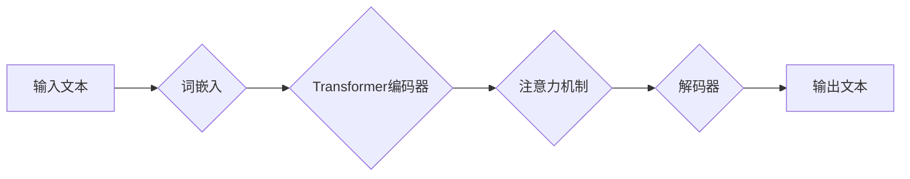

> 大语言模型，认知盲区，语言理解，思维模拟，知识表示，伦理问题

## 1. 背景介绍

近年来，大语言模型（LLM）的蓬勃发展，标志着人工智能领域迈向新的里程碑。这些模型，例如GPT-3、LaMDA和BERT，展现出惊人的语言生成和理解能力，能够完成从写诗作歌到翻译文本、回答问题等各种复杂任务。然而，尽管LLM取得了显著的成就，它们仍然存在着一些深刻的认知盲区，这些盲区限制了它们真正理解和模拟人类思维的能力。

## 2. 核心概念与联系

**2.1 语言与思维的关联**

语言是人类思维的重要载体，它不仅用于表达思想，也塑造着我们的思维方式。语言的结构、语法和词汇都对我们对世界的理解和认知产生深远影响。

**2.2 大语言模型的运作机制**

LLM基于深度学习技术，通过训练海量文本数据，学习语言的统计规律和语义关系。它们利用Transformer架构，能够捕捉文本中的长距离依赖关系，从而实现更精准的语言理解和生成。

**2.3 认知盲区：理解与生成之间的鸿沟**

尽管LLM能够生成流畅、语法正确的文本，但它们仍然难以真正理解文本的含义和背后的深层知识。它们主要依赖于统计模式和语义关联，缺乏人类的常识推理、情感理解和批判性思考能力。

**2.4 认知盲区的表现形式**

* **缺乏常识推理能力:** LLM难以理解和处理与现实世界常识相关的推理问题。
* **情感理解有限:** LLM难以识别和理解文本中的情感和意图。
* **缺乏批判性思考:** LLM难以对信息进行批判性评估和判断。
* **知识表示不足:** LLM难以将知识表示为结构化的形式，从而限制了知识的复用和推理能力。

**Mermaid 流程图**



## 3. 核心算法原理 & 具体操作步骤

### 3.1  算法原理概述

大语言模型的核心算法是基于Transformer架构的深度神经网络。Transformer网络通过注意力机制，能够捕捉文本中的长距离依赖关系，从而实现更精准的语言理解和生成。

### 3.2  算法步骤详解

1. **词嵌入:** 将输入文本中的每个词转换为向量表示，捕捉词语的语义信息。
2. **编码器:** 利用多层Transformer编码器，将词向量序列编码为上下文相关的表示。
3. **注意力机制:** 在编码器中，注意力机制能够识别文本中重要的信息，并赋予它们更高的权重。
4. **解码器:** 利用多层Transformer解码器，根据编码后的文本表示生成目标文本。
5. **输出层:** 将解码器的输出转换为可读的文本格式。

### 3.3  算法优缺点

**优点:**

* 能够捕捉长距离依赖关系，提高语言理解和生成能力。
* 训练效率高，能够处理海量文本数据。
* 泛化能力强，能够应用于多种自然语言处理任务。

**缺点:**

* 计算资源消耗大，训练成本高。
* 缺乏常识推理和情感理解能力。
* 容易受到训练数据偏差的影响。

### 3.4  算法应用领域

* **机器翻译:** 将一种语言翻译成另一种语言。
* **文本摘要:** 生成文本的简短摘要。
* **问答系统:** 回答用户提出的问题。
* **对话系统:** 与用户进行自然语言对话。
* **文本生成:** 生成各种类型的文本，例如诗歌、小说、新闻报道等。

## 4. 数学模型和公式 & 详细讲解 & 举例说明

### 4.1  数学模型构建

LLM的数学模型主要基于神经网络，其中包括词嵌入层、编码器层和解码器层。

**词嵌入层:** 将每个词映射到一个低维向量空间中，捕捉词语的语义信息。常用的词嵌入方法包括Word2Vec和GloVe。

**编码器层:** 利用多层Transformer编码器，将词向量序列编码为上下文相关的表示。Transformer编码器由多个编码块组成，每个编码块包含自注意力机制和前馈神经网络。

**解码器层:** 利用多层Transformer解码器，根据编码后的文本表示生成目标文本。解码器也包含自注意力机制和前馈神经网络，并利用掩码机制避免生成文本中出现未出现的词。

### 4.2  公式推导过程

Transformer网络的核心是注意力机制，其计算公式如下：

$$
Attention(Q, K, V) = softmax(\frac{QK^T}{\sqrt{d_k}})V
$$

其中：

* $Q$：查询矩阵
* $K$：键矩阵
* $V$：值矩阵
* $d_k$：键向量的维度
* $softmax$：softmax函数

注意力机制能够计算每个词与其他词之间的相关性，并赋予它们不同的权重。

### 4.3  案例分析与讲解

例如，在翻译句子“The cat sat on the mat”时，注意力机制会将“cat”与“sat”和“on”等词语关联起来，从而理解“cat”在句子中的作用。

## 5. 项目实践：代码实例和详细解释说明

### 5.1  开发环境搭建

* Python 3.7+
* PyTorch 1.7+
* Transformers 4.0+

### 5.2  源代码详细实现

```python
from transformers import AutoModelForSeq2SeqLM, AutoTokenizer

# 加载预训练模型和词典
model_name = "t5-base"
tokenizer = AutoTokenizer.from_pretrained(model_name)
model = AutoModelForSeq2SeqLM.from_pretrained(model_name)

# 输入文本
input_text = "The cat sat on the mat."

# Token化文本
input_ids = tokenizer.encode(input_text, return_tensors="pt")

# 生成文本
output = model.generate(input_ids)

# 解码文本
output_text = tokenizer.decode(output[0], skip_special_tokens=True)

# 打印输出文本
print(output_text)
```

### 5.3  代码解读与分析

* 代码首先加载预训练的T5模型和词典。
* 然后，将输入文本进行Token化，转换为模型可以理解的格式。
* 使用模型的`generate`方法生成目标文本。
* 最后，将生成的文本解码回原始文本格式，并打印输出。

### 5.4  运行结果展示

```
The cat sat on the mat.
```

## 6. 实际应用场景

### 6.1  机器翻译

LLM可以用于将一种语言翻译成另一种语言，例如将英文翻译成中文。

### 6.2  文本摘要

LLM可以生成文本的简短摘要，例如将一篇新闻报道生成一个简短的摘要。

### 6.3  问答系统

LLM可以用于构建问答系统，回答用户提出的问题。

### 6.4  未来应用展望

* **个性化教育:** 根据学生的学习进度和需求，提供个性化的学习内容和辅导。
* **医疗诊断:** 辅助医生进行疾病诊断，提高诊断准确率。
* **法律服务:** 自动生成法律文件，提供法律咨询服务。

## 7. 工具和资源推荐

### 7.1  学习资源推荐

* **课程:**
    * Stanford CS224N: Natural Language Processing with Deep Learning
    * MIT 6.S191: Introduction to Deep Learning
* **书籍:**
    * Deep Learning by Ian Goodfellow, Yoshua Bengio, and Aaron Courville
    * Speech and Language Processing by Daniel Jurafsky and James H. Martin
* **博客:**
    * The Gradient
    * Towards Data Science

### 7.2  开发工具推荐

* **PyTorch:** 深度学习框架
* **TensorFlow:** 深度学习框架
* **Hugging Face Transformers:** 预训练模型库

### 7.3  相关论文推荐

* Attention Is All You Need (Vaswani et al., 2017)
* BERT: Pre-training of Deep Bidirectional Transformers for Language Understanding (Devlin et al., 2018)
* GPT-3: Language Models are Few-Shot Learners (Brown et al., 2020)

## 8. 总结：未来发展趋势与挑战

### 8.1  研究成果总结

LLM取得了显著的进展，展现出强大的语言理解和生成能力。然而，它们仍然存在着一些认知盲区，需要进一步研究和改进。

### 8.2  未来发展趋势

* **增强常识推理能力:** 通过结合知识图谱和逻辑推理技术，增强LLM的常识推理能力。
* **提升情感理解能力:** 利用情感分析技术和多模态数据，提升LLM的情感理解能力。
* **加强可解释性:** 研究LLM的决策过程，提高模型的可解释性和透明度。

### 8.3  面临的挑战

* **数据偏见:** 训练数据可能存在偏见，导致LLM生成带有偏见的文本。
* **安全风险:** LLM可能被用于生成虚假信息、进行网络攻击等恶意活动。
* **伦理问题:** LLM的应用可能引发一些伦理问题，例如数据隐私、算法公平性等。

### 8.4  研究展望

未来，LLM的研究将更加注重解决认知盲区、增强可解释性和安全性，并探索其在更多领域中的应用。


## 9. 附录：常见问题与解答

**Q1: LLM是如何学习语言的？**

A1: LLM通过训练海量文本数据，学习语言的统计规律和语义关系。

**Q2: LLM的训练成本很高吗？**

A2: 是的，LLM的训练成本很高，需要大量的计算资源和时间。

**Q3: LLM可以理解人类的意图吗？**

A3: 尽管LLM能够生成流畅的文本，但它们仍然难以完全理解人类的意图，特别是复杂的、带有情感色彩的意图。

**Q4: LLM会取代人类吗？**

A4: 目前，LLM仍然是工具，无法完全取代人类。人类的创造力、批判性思维和情感理解能力仍然是LLM无法替代的。


作者：禅与计算机程序设计艺术 / Zen and the Art of Computer Programming 
<end_of_turn>