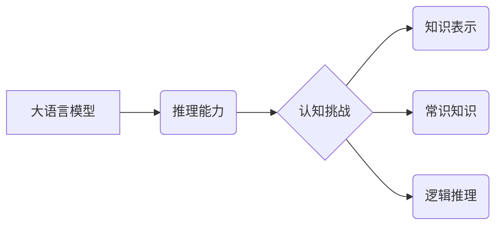

> 大语言模型、推理能力、认知挑战、知识表示、逻辑推理、常识推理

## 1. 背景介绍

近年来，大语言模型（Large Language Models，LLMs）在自然语言处理领域取得了显著进展，展现出强大的文本生成、翻译、摘要等能力。这些模型通过学习海量文本数据，掌握了语言的复杂模式和结构，能够生成流畅、连贯的文本。然而，尽管LLMs在文本处理方面表现出色，但它们在推理能力方面仍然存在着明显的局限性。

传统的AI系统通常依赖于明确的规则和逻辑程序，而LLMs则更依赖于统计学习和模式识别。这种差异导致LLMs在处理需要逻辑推理和常识知识的复杂任务时，往往表现不佳。例如，LLMs可能无法理解因果关系、推断隐含信息或解决需要逻辑推理的数学问题。

## 2. 核心概念与联系

**2.1 大语言模型 (LLMs)**

大语言模型是近年来深度学习领域取得突破性进展的产物。它们通常基于Transformer架构，通过大量的文本数据进行预训练，学习到语言的语法、语义和上下文关系。

**2.2 推理能力**

推理能力是指AI系统能够从已知信息中推导出新的知识或结论的能力。它涉及到逻辑推理、常识推理、因果推理等多种推理类型。

**2.3 认知挑战**

LLMs在推理能力方面面临着许多认知挑战，包括：

* **缺乏显式知识表示:** LLMs主要依赖于统计模式，缺乏对知识的显式表示和推理机制。
* **常识知识缺失:** LLMs在训练数据中可能缺乏足够的常识知识，导致在需要运用常识的场景下表现不佳。
* **逻辑推理能力有限:** LLMs在处理复杂的逻辑推理问题时，往往难以准确推断出结论。

**2.4 核心概念关系图**



## 3. 核心算法原理 & 具体操作步骤

**3.1 算法原理概述**

目前，针对LLMs推理能力的提升，主要有以下几种算法和方法：

* **知识图谱增强:** 将知识图谱数据融入到LLMs的训练过程中，帮助模型学习和表示知识。
* **逻辑推理模块:** 将逻辑推理模块集成到LLMs架构中，增强模型的逻辑推理能力。
* **强化学习:** 使用强化学习算法训练LLMs，使其能够在推理任务中获得奖励，从而提升推理性能。

**3.2 算法步骤详解**

以知识图谱增强为例，其具体步骤如下：

1. **知识图谱构建:** 收集和构建相关领域的知识图谱，包括实体、关系和属性。
2. **知识嵌入:** 将知识图谱中的实体和关系映射到低维向量空间，以便于LLMs理解和利用。
3. **模型训练:** 将知识嵌入信息融入到LLMs的训练数据中，并使用预训练模型进行微调，使其能够更好地理解和推理知识。

**3.3 算法优缺点**

* **优点:** 可以有效提升LLMs的知识表示能力和推理能力。
* **缺点:** 需要大量的知识图谱数据和专业知识进行构建和维护。

**3.4 算法应用领域**

* **问答系统:** 能够回答更复杂、需要推理的自然语言问题。
* **文本摘要:** 能够生成更准确、更具逻辑性的文本摘要。
* **对话系统:** 能够进行更自然、更智能的对话。

## 4. 数学模型和公式 & 详细讲解 & 举例说明

**4.1 数学模型构建**

知识图谱嵌入可以使用多种数学模型，例如TransE、TransR、RotatE等。这些模型将实体和关系映射到向量空间，并通过学习实体和关系之间的向量关系来表示知识。

**4.2 公式推导过程**

以TransE模型为例，其目标是学习实体和关系之间的向量表示，使得实体和关系的向量和满足以下公式：

$$h + r \approx t$$

其中，h表示实体A的向量表示，r表示关系R的向量表示，t表示实体B的向量表示。

**4.3 案例分析与讲解**

假设我们有一个知识图谱，其中包含实体“张三”，“李四”，“是朋友”的关系。我们可以使用TransE模型学习实体和关系的向量表示。

* 实体“张三”的向量表示为h。
* 实体“李四”的向量表示为t。
* 关系“是朋友”的向量表示为r。

通过训练TransE模型，我们可以得到h + r ≈ t，这意味着“张三”和“李四”之间的关系向量与“是朋友”的关系向量相近。

## 5. 项目实践：代码实例和详细解释说明

**5.1 开发环境搭建**

* Python 3.7+
* PyTorch 1.7+
* Transformers 4.0+

**5.2 源代码详细实现**

```python
import torch
import torch.nn as nn
from transformers import AutoModel

class TransE(nn.Module):
    def __init__(self, embedding_dim, num_entities, num_relations):
        super(TransE, self).__init__()
        self.embedding_dim = embedding_dim
        self.entity_embeddings = nn.Embedding(num_entities, embedding_dim)
        self.relation_embeddings = nn.Embedding(num_relations, embedding_dim)

    def forward(self, head, relation, tail):
        h = self.entity_embeddings(head)
        r = self.relation_embeddings(relation)
        t = self.entity_embeddings(tail)
        return torch.norm(h + r - t, dim=1)

# ... (其他代码)
```

**5.3 代码解读与分析**

* TransE模型的代码实现包含了实体嵌入层、关系嵌入层和预测层。
* 实体和关系的向量表示使用嵌入层进行学习。
* 预测层计算实体和关系的向量和与目标实体的向量之间的距离。

**5.4 运行结果展示**

通过训练TransE模型，我们可以评估其在知识图谱推理任务上的性能，例如准确率、F1-score等。

## 6. 实际应用场景

**6.1 问答系统**

LLMs结合知识图谱增强技术，可以构建更智能的问答系统，能够回答更复杂、需要推理的自然语言问题。

**6.2 文本摘要**

LLMs可以利用知识图谱信息生成更准确、更具逻辑性的文本摘要，例如新闻摘要、会议纪要等。

**6.3 对话系统**

LLMs结合逻辑推理模块，可以构建更自然、更智能的对话系统，例如聊天机器人、虚拟助手等。

**6.4 未来应用展望**

随着LLMs推理能力的不断提升，其应用场景将更加广泛，例如：

* **医疗诊断:** 利用知识图谱和逻辑推理，辅助医生进行疾病诊断。
* **法律推理:** 利用法律知识图谱和逻辑推理，辅助律师进行法律分析和诉讼。
* **金融风险评估:** 利用金融知识图谱和逻辑推理，评估金融风险。

## 7. 工具和资源推荐

**7.1 学习资源推荐**

* **书籍:**
    * 《深度学习》
    * 《自然语言处理》
* **在线课程:**
    * Coursera: 自然语言处理
    * edX: 深度学习

**7.2 开发工具推荐**

* **PyTorch:** 深度学习框架
* **Transformers:** 预训练语言模型库
* **GraphDB:** 图数据库

**7.3 相关论文推荐**

* 《TransE: Embedding entities and relations for learning and reasoning over knowledge bases》
* 《BERT: Pre-training of Deep Bidirectional Transformers for Language Understanding》
* 《GPT-3: Language Models are Few-Shot Learners》

## 8. 总结：未来发展趋势与挑战

**8.1 研究成果总结**

近年来，在LLMs推理能力方面的研究取得了显著进展，例如知识图谱增强、逻辑推理模块、强化学习等方法取得了不错的效果。

**8.2 未来发展趋势**

* **更强大的推理能力:** 研究更有效的推理算法和模型，提升LLMs在复杂推理任务上的性能。
* **更丰富的知识表示:** 开发更灵活、更强大的知识表示方法，帮助LLMs更好地理解和利用知识。
* **更强的泛化能力:** 研究更通用的推理方法，使LLMs能够应用于更广泛的领域。

**8.3 面临的挑战**

* **数据稀缺:** 训练高质量的推理模型需要大量的训练数据，而许多领域的数据仍然稀缺。
* **可解释性:** LLMs的推理过程往往难以解释，这限制了其在一些安全关键领域中的应用。
* **伦理问题:** LLMs的推理能力可能会被用于恶意目的，例如生成虚假信息、进行身份欺诈等，需要认真考虑其伦理问题。

**8.4 研究展望**

未来，LLMs推理能力的研究将继续深入，探索更有效的推理算法、更丰富的知识表示方法和更强的泛化能力。同时，需要关注LLMs的安全性、可解释性和伦理问题，确保其健康发展。

## 9. 附录：常见问题与解答

**9.1 如何评估LLMs的推理能力？**

常用的评估指标包括准确率、F1-score、BLEU等。

**9.2 如何选择合适的知识图谱？**

需要根据具体的应用场景选择合适的知识图谱，例如医疗领域需要选择医疗知识图谱，金融领域需要选择金融知识图谱。

**9.3 如何解决LLMs数据稀缺的问题？**

可以使用数据增强、迁移学习等方法来解决数据稀缺的问题。


作者：禅与计算机程序设计艺术 / Zen and the Art of Computer Programming 
<end_of_turn>