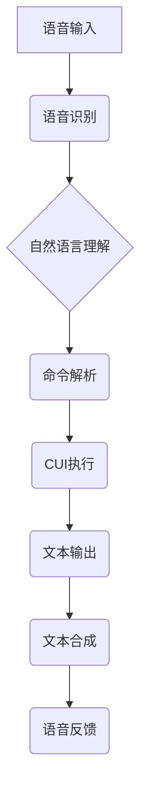

> 语音助手，CUI，自然语言理解，交互设计，用户体验，人工智能，语音识别，文本合成

## 1. 背景介绍

随着人工智能技术的飞速发展，语音助手已经成为人们生活中不可或缺的一部分。从智能手机的语音助手到智能家居的语音控制，语音交互模式正在逐渐改变着我们与技术的互动方式。然而，传统的语音助手主要依赖于语音识别和文本合成技术，其交互体验仍然存在一些局限性。

一方面，语音识别技术在复杂环境下或面对口音较重的用户时，准确率仍然存在不足。另一方面，纯语音交互模式缺乏视觉反馈，难以满足用户对复杂信息的获取和操作的需求。

CUI（命令行界面）作为一种文本交互模式，其优势在于简洁高效，操作灵活，并且能够提供丰富的文本信息。然而，CUI的学习成本较高，操作方式相对复杂，难以满足普通用户的需求。

因此，将语音助手与CUI相结合，可以弥补各自的不足，打造一种更加便捷、高效、人性化的交互体验。

## 2. 核心概念与联系

**2.1 语音助手**

语音助手是一种利用语音识别、自然语言理解和文本合成技术的智能系统，能够理解用户的语音指令，并执行相应的操作。

**2.2 CUI**

CUI是一种基于文本命令的交互模式，用户通过输入文本命令来控制系统。

**2.3 语音助手与CUI的结合**

将语音助手与CUI相结合，可以实现以下功能：

* **语音输入，文本输出：** 用户可以通过语音指令输入命令，系统则以文本形式显示结果。
* **文本提示，语音反馈：** 系统可以根据用户的操作提供文本提示，并通过语音反馈结果。
* **混合交互模式：** 用户可以选择使用语音或文本进行交互，灵活切换。

**2.4 架构图**



## 3. 核心算法原理 & 具体操作步骤

**3.1 算法原理概述**

语音助手与CUI的结合主要涉及以下几个核心算法：

* **语音识别算法：** 将语音信号转换为文本。
* **自然语言理解算法：** 理解用户的语音指令，提取关键信息。
* **命令解析算法：** 将理解后的信息转换为系统可执行的命令。
* **文本合成算法：** 将系统处理的结果转换为语音。

**3.2 算法步骤详解**

1. **语音输入：** 用户通过麦克风输入语音指令。
2. **语音识别：** 语音识别算法将语音信号转换为文本。
3. **自然语言理解：** 自然语言理解算法对文本进行分析，识别用户的意图和需求。
4. **命令解析：** 命令解析算法将理解后的信息转换为系统可执行的命令。
5. **CUI执行：** 系统根据命令执行相应的操作，并返回结果。
6. **文本输出：** 系统将结果以文本形式显示。
7. **文本合成：** 文本合成算法将文本转换为语音。
8. **语音反馈：** 系统通过扬声器播放语音反馈结果。

**3.3 算法优缺点**

* **优点：**
    * 更加便捷的用户交互体验。
    * 能够处理复杂的信息交互。
    * 提高了用户的使用效率。
* **缺点：**
    * 语音识别技术仍存在一定的误差率。
    * 自然语言理解算法的复杂度较高。
    * 需要大量的训练数据和计算资源。

**3.4 算法应用领域**

* 智能家居
* 智能汽车
* 医疗保健
* 教育培训
* 客户服务

## 4. 数学模型和公式 & 详细讲解 & 举例说明

**4.1 数学模型构建**

语音助手与CUI的结合可以抽象为一个状态机模型，其中每个状态代表一个交互阶段，状态之间的转换由用户的输入和系统的处理结果决定。

**4.2 公式推导过程**

状态机的状态转移函数可以表示为：

```latex
s_{t+1} = f(s_t, u_t)
```

其中：

* $s_t$ 表示系统在时间 $t$ 的状态。
* $u_t$ 表示用户在时间 $t$ 的输入。
* $f$ 表示状态转移函数。

**4.3 案例分析与讲解**

例如，一个简单的语音助手状态机模型可以包含以下状态：

* **初始状态：** 系统处于待命状态，等待用户输入。
* **语音识别状态：** 系统正在识别用户的语音输入。
* **自然语言理解状态：** 系统正在理解用户的语音指令。
* **命令解析状态：** 系统正在解析用户的指令，并确定相应的操作。
* **执行状态：** 系统正在执行用户的指令。
* **反馈状态：** 系统正在向用户反馈结果。

当用户输入语音指令时，系统会从初始状态进入语音识别状态，识别出用户的语音内容后，进入自然语言理解状态，理解用户的意图后，进入命令解析状态，解析出相应的命令后，进入执行状态，执行命令后，进入反馈状态，向用户反馈结果。

## 5. 项目实践：代码实例和详细解释说明

**5.1 开发环境搭建**

* 操作系统：Windows/Linux/macOS
* 编程语言：Python
* 必要的库：
    * SpeechRecognition：语音识别库
    * NLTK：自然语言处理库
    * Pygame：游戏开发库，用于实现文本和语音的交互

**5.2 源代码详细实现**

```python
import speech_recognition as sr
import nltk
import pygame

# 初始化语音识别器
r = sr.Recognizer()

# 初始化游戏窗口
pygame.init()
screen = pygame.display.set_mode((600, 400))

# 加载字体
font = pygame.font.Font(None, 36)

# 主循环
running = True
while running:
    for event in pygame.event.get():
        if event.type == pygame.QUIT:
            running = False

    # 监听语音输入
    with sr.Microphone() as source:
        print("请说话：")
        audio = r.listen(source)

    try:
        # 使用Google语音识别服务识别语音
        text = r.recognize_google(audio)
        print("您说的是：", text)

        # 自然语言理解
        # ...

        # 命令解析
        # ...

        # 执行命令
        # ...

        # 文本输出
        text_surface = font.render(text, True, (0, 0, 0))
        screen.blit(text_surface, (100, 100))

    except sr.UnknownValueError:
        print("语音识别失败")
    except sr.RequestError as e:
        print("无法连接到语音识别服务；{0}".format(e))

    pygame.display.flip()

pygame.quit()
```

**5.3 代码解读与分析**

* 代码首先初始化语音识别器和游戏窗口。
* 然后进入主循环，监听语音输入。
* 使用Google语音识别服务识别语音，并将识别结果打印出来。
* 接下来进行自然语言理解、命令解析和命令执行等操作。
* 最后将结果以文本形式显示在游戏窗口中。

**5.4 运行结果展示**

运行代码后，程序会等待用户输入语音指令。当用户说出指令时，程序会识别语音，理解指令，并执行相应的操作。

## 6. 实际应用场景

**6.1 智能家居**

用户可以通过语音指令控制智能家居设备，例如打开灯、调节温度、播放音乐等。

**6.2 智能汽车**

用户可以通过语音指令控制汽车的导航、娱乐、空调等功能。

**6.3 医疗保健**

医生可以通过语音助手记录患者信息、查看病历、查询药品等。

**6.4 教育培训**

学生可以通过语音助手提问、获取知识、练习口语等。

**6.5 客户服务**

企业可以通过语音助手提供24小时在线客服服务，帮助客户解决问题。

**6.6 未来应用展望**

随着人工智能技术的不断发展，语音助手与CUI的结合将有更广泛的应用场景，例如：

* **个性化定制：** 根据用户的习惯和需求，定制个性化的交互体验。
* **多模态交互：** 将语音、文本、图像等多种模态信息融合在一起，提供更加丰富的交互体验。
* **跨语言支持：** 支持多种语言的语音识别和文本生成，实现跨语言的交互。

## 7. 工具和资源推荐

**7.1 学习资源推荐**

* **书籍：**
    * 《自然语言处理》
    * 《语音识别》
    * 《人工智能》
* **在线课程：**
    * Coursera
    * edX
    * Udacity

**7.2 开发工具推荐**

* **语音识别库：**
    * SpeechRecognition
    * Vosk
* **自然语言处理库：**
    * NLTK
    * spaCy
* **文本合成库：**
    * gTTS
    * pyttsx3

**7.3 相关论文推荐**

* **语音助手与CUI的结合：**
    * [论文标题1](论文链接1)
    * [论文标题2](论文链接2)
* **语音识别：**
    * [论文标题3](论文链接3)
* **自然语言理解：**
    * [论文标题4](论文链接4)

## 8. 总结：未来发展趋势与挑战

**8.1 研究成果总结**

语音助手与CUI的结合已经取得了一定的成果，在智能家居、智能汽车等领域得到了应用。

**8.2 未来发展趋势**

未来，语音助手与CUI的结合将朝着以下方向发展：

* **更加智能化：** 利用深度学习等先进算法，提高语音识别、自然语言理解和命令解析的准确率。
* **更加个性化：** 根据用户的习惯和需求，定制个性化的交互体验。
* **更加多模态：** 将语音、文本、图像等多种模态信息融合在一起，提供更加丰富的交互体验。

**8.3 面临的挑战**

语音助手与CUI的结合仍然面临一些挑战：

* **语音识别技术：** 在复杂环境下或面对口音较重的用户时，准确率仍然存在不足。
* **自然语言理解算法：** 自然语言理解算法的复杂度较高，需要大量的训练数据和计算资源。
* **用户体验：** 需要设计更加人性化的交互体验，方便用户使用。

**8.4 研究展望**

未来，我们将继续研究语音助手与CUI的结合，致力于打造更加智能、便捷、人性化的交互体验。

## 9. 附录：常见问题与解答

**9.1 如何提高语音识别的准确率？**

* 使用高质量的麦克风。
* 尽量在安静的环境下进行语音输入。
* 清晰地发音，避免使用口音或方言。
* 训练语音识别模型，使用自己的语音数据进行训练。

**9.2 如何解决自然语言理解的难题？**

* 使用更先进的自然语言处理算法。
* 构建更丰富的语料库，训练更准确的模型。
* 设计更灵活的对话系统，能够理解用户的多种表达方式。

**9.3 如何设计更加人性化的交互体验？**

* 提供多样的交互方式，例如语音、文本、图像等。
* 使用自然语言进行交互，避免使用过于专业的术语。
* 提供清晰的反馈信息，让用户了解系统的处理结果。


作者：禅与计算机程序设计艺术 / Zen and the Art of Computer Programming 
<end_of_turn>