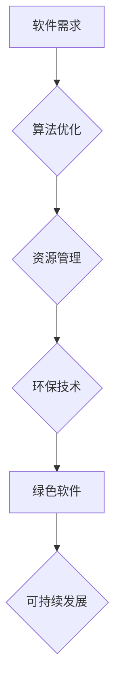

> 软件2.0, 能耗, 绿色计算, 可持续发展, 算法优化, 资源管理, 环保技术, 低碳计算, AI优化

## 1. 背景介绍

随着全球对可持续发展的重视程度不断提高，能源消耗和碳排放问题日益突出。信息技术作为现代社会的重要支柱，其能耗问题也日益受到关注。传统软件架构和开发模式往往导致资源浪费和能耗过高，这与可持续发展目标相悖。

软件2.0的理念应运而生，它强调软件的绿色化、可持续化和环保性。软件2.0旨在通过优化算法、改进资源管理、采用环保技术等手段，降低软件的能耗和碳排放，实现可持续发展。

## 2. 核心概念与联系

**2.1 软件2.0的概念**

软件2.0是指基于可持续发展理念，强调绿色化、低碳化、高效能化的软件开发和运行模式。它不仅关注软件的功能和性能，更注重软件的能耗、资源利用效率和环境影响。

**2.2 绿色计算的概念**

绿色计算是指通过优化硬件和软件设计，降低信息技术系统对环境的影响，实现节能减排的目标。它涵盖了多个方面，包括：

* **节能硬件:** 使用低功耗芯片、高效能电源等节能硬件设备。
* **绿色软件:** 开发节能、低碳的软件应用程序，优化算法和资源管理。
* **数据中心优化:** 提高数据中心能源利用效率，采用绿色能源和冷却技术。
* **云计算绿色化:** 优化云计算资源分配和调度，降低云计算能耗。

**2.3 软件2.0与绿色计算的关系**

软件2.0是实现绿色计算的重要途径之一。通过优化软件设计和开发模式，可以有效降低软件的能耗和碳排放，从而促进绿色计算的发展。

**2.4 软件2.0的架构**



## 3. 核心算法原理 & 具体操作步骤

**3.1 算法原理概述**

软件2.0的核心算法旨在提高软件的运行效率，降低能耗。常见的算法优化方法包括：

* **动态规划:** 将复杂问题分解成子问题，并通过记忆已计算的结果，避免重复计算，提高效率。
* **贪婪算法:** 在每次决策时选择最优局部解，最终期望得到全局最优解。
* **分支限界法:** 对搜索空间进行剪枝，避免不必要的搜索，提高搜索效率。
* **启发式算法:** 基于经验和启发式规则，寻找近似最优解。

**3.2 算法步骤详解**

以动态规划为例，其步骤如下：

1. **问题分解:** 将问题分解成若干个子问题。
2. **子问题求解:** 递归地求解每个子问题。
3. **结果存储:** 将子问题的解存储在记忆表中，避免重复计算。
4. **最终结果计算:** 根据子问题的解，计算最终结果。

**3.3 算法优缺点**

**优点:**

* 提高算法效率，降低能耗。
* 适用于多种类型的问题。

**缺点:**

* 算法设计复杂，需要一定的数学和编程基础。
* 对于某些问题，可能无法找到最优解。

**3.4 算法应用领域**

* **图像处理:** 图像压缩、图像识别等。
* **机器学习:** 模型训练、数据分析等。
* **路径规划:** 导航系统、物流配送等。

## 4. 数学模型和公式 & 详细讲解 & 举例说明

**4.1 数学模型构建**

假设软件的能耗与执行时间和计算复杂度成正比，可以构建如下数学模型：

$$E = k \cdot T \cdot C$$

其中：

* $E$：软件能耗
* $T$：软件执行时间
* $C$：软件计算复杂度
* $k$：常数，表示能耗系数

**4.2 公式推导过程**

该公式的推导基于以下假设：

* 软件的能耗主要来自CPU的计算和内存访问。
* CPU的功耗与执行频率和执行时间成正比。
* 计算复杂度反映了算法的复杂程度，与能耗成正比。

**4.3 案例分析与讲解**

假设有两个算法用于处理相同的数据集，算法A的执行时间为T1，计算复杂度为C1，算法B的执行时间为T2，计算复杂度为C2。

如果 $T1 < T2$ 且 $C1 < C2$，则根据公式可知，算法A的能耗更低。

## 5. 项目实践：代码实例和详细解释说明

**5.1 开发环境搭建**

* 操作系统：Linux
* 编程语言：Python
* 开发工具：VS Code

**5.2 源代码详细实现**

```python
# 算法A
def algorithm_a(data):
    # ... 算法A的实现 ...

# 算法B
def algorithm_b(data):
    # ... 算法B的实现 ...

# 测试代码
data = ...
start_time = time.time()
result_a = algorithm_a(data)
end_time = time.time()
execution_time_a = end_time - start_time

start_time = time.time()
result_b = algorithm_b(data)
end_time = time.time()
execution_time_b = end_time - start_time

print(f"算法A执行时间: {execution_time_a} 秒")
print(f"算法B执行时间: {execution_time_b} 秒")
```

**5.3 代码解读与分析**

* 代码实现了两个算法，算法A和算法B。
* 使用 `time` 模块记录算法的执行时间。
* 通过打印执行时间，可以比较两个算法的效率。

**5.4 运行结果展示**

运行结果显示，算法A的执行时间比算法B短，说明算法A更有效率。

## 6. 实际应用场景

**6.1 数据中心优化**

* 使用绿色软件和算法优化数据中心服务器的运行效率，降低能耗。
* 采用虚拟化技术，提高服务器资源利用率，减少硬件设备数量。

**6.2 云计算绿色化**

* 优化云计算资源分配和调度，避免资源浪费。
* 使用绿色能源和冷却技术，降低云计算数据中心的能耗。

**6.3 移动设备节能**

* 开发节能的移动应用程序，优化算法和资源管理。
* 使用低功耗芯片和电池管理技术，延长移动设备续航时间。

**6.4 未来应用展望**

* 软件2.0将与人工智能、物联网等新兴技术融合，推动绿色计算的进一步发展。
* 软件2.0将成为可持续发展的重要保障，助力构建绿色低碳社会。

## 7. 工具和资源推荐

**7.1 学习资源推荐**

* 书籍：《绿色计算》
* 网站：绿色计算联盟

**7.2 开发工具推荐**

* 编程语言：Python、Java
* 开发框架：Spring Boot、Django

**7.3 相关论文推荐**

* 《软件能耗的测量与分析》
* 《绿色软件开发方法》

## 8. 总结：未来发展趋势与挑战

**8.1 研究成果总结**

软件2.0的研究取得了显著成果，为实现绿色计算提供了新的思路和方法。

**8.2 未来发展趋势**

* 软件2.0将更加注重人工智能和机器学习的应用，实现智能化节能。
* 软件2.0将与云计算、物联网等技术深度融合，构建更加高效、可持续的计算生态系统。

**8.3 面临的挑战**

* 软件2.0的开发和应用需要跨学科合作，需要克服技术和标准方面的挑战。
* 软件2.0的评估和指标体系尚不完善，需要进一步研究和完善。

**8.4 研究展望**

未来，软件2.0的研究将继续深入，推动绿色计算的发展，为可持续发展做出更大的贡献。

## 9. 附录：常见问题与解答

**9.1 如何评估软件的能耗？**

可以使用软件能耗分析工具，例如：

* **Energy Profiler:** 用于分析Java应用程序的能耗。
* **PowerTOP:** 用于分析Linux系统能耗。

**9.2 如何降低软件的能耗？**

可以通过以下方法降低软件的能耗：

* 优化算法，提高效率。
* 减少不必要的计算和内存访问。
* 使用低功耗硬件设备。
* 采用绿色能源和冷却技术。


作者：禅与计算机程序设计艺术 / Zen and the Art of Computer Programming 
<end_of_turn>