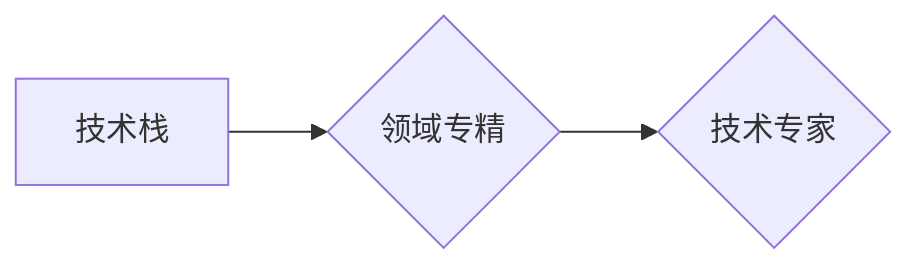

>  人工智能、深度学习、机器学习、软件架构、程序设计、技术栈、领域专精

## 1. 背景介绍

在当今科技飞速发展的时代，新兴技术层出不穷，各个领域都呈现出蓬勃发展的景象。然而，对于许多技术人员来说，面对如此多的选择，难免会感到迷茫，甚至陷入“技术跳跃”的困境。频繁地学习和掌握新的技术，看似能够提升竞争力，但实际上却可能导致知识碎片化，难以形成真正的专业优势。

本文将探讨如何避免在各个领域之间徘徊，如何找到自己的技术方向，并在这个领域深耕细作，最终成为一名真正的技术专家。

## 2. 核心概念与联系

**2.1 技术栈与领域专精**

技术栈是指一个软件开发人员或团队所掌握的各种技术工具和框架的集合。它通常包括编程语言、框架、数据库、云平台等多个方面。

领域专精是指在一个特定的技术领域内积累深厚的知识和经验，成为该领域的专家。

**2.2 核心概念关系图**



**2.3 核心概念原理**

技术栈是技术人员的工具箱，而领域专精则是将这些工具运用到特定领域中的技能。

一个广阔的技术栈可以帮助技术人员快速适应不同的项目需求，但它并不能保证技术人员在任何领域都能取得成功。只有在某个领域深耕细作，才能真正掌握该领域的知识和经验，成为一名技术专家。

## 3. 核心算法原理 & 具体操作步骤

**3.1 算法原理概述**

深度学习算法是一种基于人工神经网络的机器学习算法，它能够从海量数据中学习复杂的模式和特征。

**3.2 算法步骤详解**

1. **数据预处理:** 将原始数据进行清洗、转换和特征工程，使其适合深度学习模型的训练。
2. **模型构建:** 根据具体的任务需求，选择合适的深度学习模型架构，例如卷积神经网络（CNN）、循环神经网络（RNN）等。
3. **模型训练:** 使用训练数据训练深度学习模型，调整模型参数，使其能够准确地预测或分类数据。
4. **模型评估:** 使用测试数据评估模型的性能，例如准确率、召回率、F1-score等。
5. **模型部署:** 将训练好的模型部署到实际应用场景中，用于预测或分类新的数据。

**3.3 算法优缺点**

**优点:**

* 能够学习复杂的模式和特征。
* 在图像识别、自然语言处理等领域取得了突破性进展。

**缺点:**

* 需要大量的训练数据。
* 计算资源需求高。
* 模型解释性差。

**3.4 算法应用领域**

* 图像识别
* 自然语言处理
* 语音识别
* 机器翻译
* 医疗诊断
* 金融风险评估

## 4. 数学模型和公式 & 详细讲解 & 举例说明

**4.1 数学模型构建**

深度学习模型的核心是多层神经网络，每个神经元接收多个输入信号，并通过激活函数进行处理，输出一个信号。

**4.2 公式推导过程**

深度学习模型的训练过程是通过反向传播算法来进行的。反向传播算法的核心思想是通过计算误差，并反向传播误差梯度，来更新模型参数。

**损失函数:**

$$L = \frac{1}{N} \sum_{i=1}^{N} (y_i - \hat{y}_i)^2$$

其中：

* $L$ 是损失函数
* $N$ 是样本数量
* $y_i$ 是真实标签
* $\hat{y}_i$ 是模型预测值

**梯度下降算法:**

$$\theta = \theta - \alpha \nabla L$$

其中：

* $\theta$ 是模型参数
* $\alpha$ 是学习率
* $\nabla L$ 是损失函数的梯度

**4.3 案例分析与讲解**

假设我们有一个图像分类任务，目标是将图像分类为猫或狗。我们可以使用卷积神经网络（CNN）来构建深度学习模型。

CNN模型的结构包括多个卷积层、池化层和全连接层。卷积层用于提取图像特征，池化层用于降低特征维度，全连接层用于分类。

训练过程中，我们使用大量的猫狗图像数据，通过反向传播算法来更新模型参数，使其能够准确地分类猫和狗图像。

## 5. 项目实践：代码实例和详细解释说明

**5.1 开发环境搭建**

* Python 3.x
* TensorFlow 或 PyTorch 深度学习框架
* Jupyter Notebook 或 VS Code 开发环境

**5.2 源代码详细实现**

```python
import tensorflow as tf

# 定义模型结构
model = tf.keras.models.Sequential([
    tf.keras.layers.Conv2D(32, (3, 3), activation='relu', input_shape=(28, 28, 1)),
    tf.keras.layers.MaxPooling2D((2, 2)),
    tf.keras.layers.Conv2D(64, (3, 3), activation='relu'),
    tf.keras.layers.MaxPooling2D((2, 2)),
    tf.keras.layers.Flatten(),
    tf.keras.layers.Dense(10, activation='softmax')
])

# 编译模型
model.compile(optimizer='adam',
              loss='sparse_categorical_crossentropy',
              metrics=['accuracy'])

# 训练模型
model.fit(x_train, y_train, epochs=10)

# 评估模型
loss, accuracy = model.evaluate(x_test, y_test)
print('Test loss:', loss)
print('Test accuracy:', accuracy)
```

**5.3 代码解读与分析**

这段代码定义了一个简单的卷积神经网络模型，用于手写数字识别任务。

* `tf.keras.models.Sequential` 创建了一个顺序模型，即层级结构。
* `tf.keras.layers.Conv2D` 定义卷积层，用于提取图像特征。
* `tf.keras.layers.MaxPooling2D` 定义池化层，用于降低特征维度。
* `tf.keras.layers.Flatten` 将多维特征转换为一维向量。
* `tf.keras.layers.Dense` 定义全连接层，用于分类。
* `model.compile` 编译模型，指定优化器、损失函数和评价指标。
* `model.fit` 训练模型，使用训练数据进行训练。
* `model.evaluate` 评估模型，使用测试数据评估模型性能。

**5.4 运行结果展示**

训练完成后，模型可以用于预测新的手写数字图像。

## 6. 实际应用场景

深度学习算法在各个领域都有广泛的应用，例如：

* **图像识别:** 自动驾驶、人脸识别、物体检测
* **自然语言处理:** 机器翻译、文本摘要、情感分析
* **语音识别:** 语音助手、语音搜索
* **医疗诊断:** 疾病预测、影像分析
* **金融风险评估:** 欺诈检测、信用评分

## 7. 工具和资源推荐

**7.1 学习资源推荐**

* **书籍:**
    * 深度学习
    * 构建深度学习模型
* **在线课程:**
    * Coursera 深度学习课程
    * Udacity 深度学习工程师 Nanodegree
* **博客和网站:**
    * TensorFlow 官方博客
    * PyTorch 官方博客
    * Machine Learning Mastery

**7.2 开发工具推荐**

* **Python:** 深度学习的编程语言
* **TensorFlow:** 开源深度学习框架
* **PyTorch:** 开源深度学习框架
* **Jupyter Notebook:** 深度学习开发环境

**7.3 相关论文推荐**

* **AlexNet:** ImageNet Classification with Deep Convolutional Neural Networks
* **VGGNet:** Very Deep Convolutional Networks for Large-Scale Image Recognition
* **ResNet:** Deep Residual Learning for Image Recognition

## 8. 总结：未来发展趋势与挑战

**8.1 研究成果总结**

深度学习算法取得了显著的进展，在各个领域都取得了突破性成果。

**8.2 未来发展趋势**

* **模型效率提升:** 研究更轻量级、更高效的深度学习模型。
* **数据安全与隐私保护:** 研究如何保护数据安全和隐私，同时进行深度学习训练。
* **可解释性增强:** 研究如何提高深度学习模型的可解释性，使其更易于理解和信任。

**8.3 面临的挑战**

* **数据获取和标注:** 深度学习算法需要大量的训练数据，数据获取和标注成本高昂。
* **计算资源需求:** 深度学习模型训练需要大量的计算资源，成本高昂。
* **模型泛化能力:** 深度学习模型容易过拟合，泛化能力不足。

**8.4 研究展望**

未来，深度学习算法将继续发展，在更多领域发挥重要作用。

## 9. 附录：常见问题与解答

**9.1 如何选择合适的深度学习框架？**

TensorFlow 和 PyTorch 是两个主流的深度学习框架，选择哪个框架取决于个人喜好和项目需求。

**9.2 如何解决深度学习模型过拟合问题？**

可以使用正则化、Dropout、数据增强等技术来解决深度学习模型过拟合问题。

**9.3 如何评估深度学习模型的性能？**

可以使用准确率、召回率、F1-score、AUC等指标来评估深度学习模型的性能。


作者：禅与计算机程序设计艺术 / Zen and the Art of Computer Programming 
<end_of_turn>