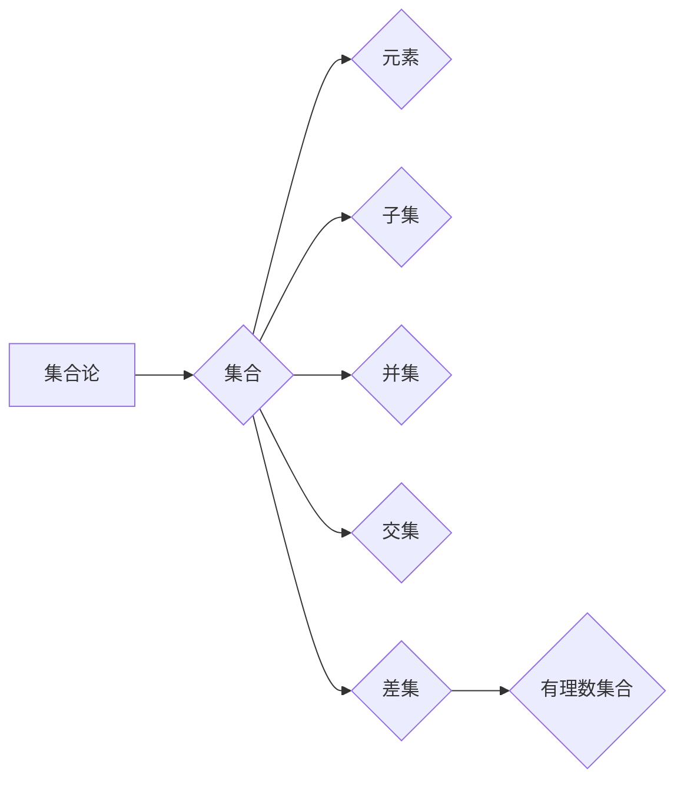

> 集合论，有理数，集合，元素，子集，并集，交集，差集，数集，数学基础，计算机科学

## 1. 背景介绍

集合论是数学的基础理论之一，它研究对象的集合及其性质。集合论的应用范围非常广泛，不仅在数学领域有着重要的地位，在计算机科学、逻辑学、经济学等领域也发挥着重要作用。

在计算机科学中，集合论的概念被广泛应用于数据结构、算法设计、数据库管理等领域。例如，在数据结构中，数组、链表、树等数据结构都可以看作是集合的某种形式。在算法设计中，集合论的原理可以帮助我们设计更有效率的算法。

有理数是数学中的一种重要的数集，它包含了所有可以表示为两个整数之比的数。有理数在数学和计算机科学中都有着广泛的应用。例如，在计算机科学中，有理数常用于表示浮点数、分数等。

## 2. 核心概念与联系

### 2.1 集合的概念

集合是一个包含特定对象的集合。我们可以用大括号 {} 来表示集合，并将集合中的元素用逗号隔开。例如，以下是一个包含数字 1、2、3 的集合：

```
{1, 2, 3}
```

### 2.2 元素的概念

集合中的每个对象都称为集合的元素。例如，在集合 {1, 2, 3} 中，1、2、3 都是集合的元素。

### 2.3 子集的概念

如果一个集合的所有元素都属于另一个集合，则称第一个集合是第二个集合的子集。例如，集合 {1, 2} 是集合 {1, 2, 3} 的子集。

### 2.4 并集的概念

两个集合的并集是指包含这两个集合所有元素的集合。例如，集合 {1, 2} 和集合 {2, 3} 的并集是 {1, 2, 3}。

### 2.5 交集的概念

两个集合的交集是指包含这两个集合所有共同元素的集合。例如，集合 {1, 2} 和集合 {2, 3} 的交集是 {2}。

### 2.6 差集的概念

两个集合的差集是指包含第一个集合所有元素，但不包含第二个集合所有元素的集合。例如，集合 {1, 2} 和集合 {2, 3} 的差集是 {1}。

### 2.7 有理数集合

有理数集合是指所有可以表示为两个整数之比的数的集合。我们可以用符号 **Q** 来表示有理数集合。

**Mermaid 流程图**



## 3. 核心算法原理 & 具体操作步骤

### 3.1 算法原理概述

有理数的表示和运算可以基于集合论的原理进行实现。我们可以将有理数看作是两个整数的比值，其中一个整数为分子，另一个整数为分母。

### 3.2 算法步骤详解

1. **输入两个整数:** 首先，我们需要输入两个整数，分别代表分子和分母。
2. **判断分母是否为零:** 如果分母为零，则表示该有理数不存在，需要抛出异常。
3. **简化分数:** 如果分子和分母有共同的因数，则需要将分数简化到最简形式。
4. **输出有理数:** 最后，我们将简化后的分数输出为有理数。

### 3.3 算法优缺点

**优点:**

* 算法简单易懂，易于实现。
* 算法效率较高，可以快速计算有理数的表示和运算。

**缺点:**

* 算法无法处理无限循环小数的有理数表示。

### 3.4 算法应用领域

* **计算机科学:** 在计算机科学中，有理数常用于表示浮点数、分数等。
* **数学:** 在数学中，有理数是整数的推广，在代数、几何等领域都有着广泛的应用。
* **物理学:** 在物理学中，有理数常用于表示物理量的比例关系。

## 4. 数学模型和公式 & 详细讲解 & 举例说明

### 4.1 数学模型构建

我们可以用一个有序对 $(p, q)$ 来表示一个有理数，其中 $p$ 是分子，$q$ 是分母。

### 4.2 公式推导过程

* **加法:**  
  如果 $a = (p_1, q_1)$ 和 $b = (p_2, q_2)$ 是两个有理数，则它们的和为:
  $$a + b = \left(\frac{p_1q_2 + p_2q_1}{q_1q_2}\right)$$
* **减法:**
  如果 $a = (p_1, q_1)$ 和 $b = (p_2, q_2)$ 是两个有理数，则它们的差为:
  $$a - b = \left(\frac{p_1q_2 - p_2q_1}{q_1q_2}\right)$$
* **乘法:**
  如果 $a = (p_1, q_1)$ 和 $b = (p_2, q_2)$ 是两个有理数，则它们的积为:
  $$a \cdot b = \left(\frac{p_1p_2}{q_1q_2}\right)$$
* **除法:**
  如果 $a = (p_1, q_1)$ 和 $b = (p_2, q_2)$ 是两个有理数，且 $q_2 \neq 0$，则它们的商为:
  $$a / b = \left(\frac{p_1q_2}{p_2q_1}\right)$$

### 4.3 案例分析与讲解

**例子:**

计算有理数 $\frac{1}{2}$ 和 $\frac{3}{4}$ 的和。

**解:**

1. 将两个有理数表示为有序对: $\frac{1}{2} = (1, 2)$，$\frac{3}{4} = (3, 4)$。
2. 根据加法公式:
   $$\frac{1}{2} + \frac{3}{4} = \left(\frac{1 \cdot 4 + 3 \cdot 2}{2 \cdot 4}\right) = \left(\frac{4 + 6}{8}\right) = \left(\frac{10}{8}\right)$$
3. 简化分数: $\frac{10}{8} = \frac{5}{4}$。

因此，$\frac{1}{2} + \frac{3}{4} = \frac{5}{4}$。

## 5. 项目实践：代码实例和详细解释说明

### 5.1 开发环境搭建

* **操作系统:** Linux, macOS, Windows
* **编程语言:** Python
* **IDE:** VS Code, PyCharm

### 5.2 源代码详细实现

```python
class Rational:
    def __init__(self, numerator, denominator):
        self.numerator = numerator
        self.denominator = denominator

    def __str__(self):
        return f"{self.numerator}/{self.denominator}"

    def __add__(self, other):
        new_numerator = self.numerator * other.denominator + self.denominator * other.numerator
        new_denominator = self.denominator * other.denominator
        return Rational(new_numerator, new_denominator)

    def __sub__(self, other):
        new_numerator = self.numerator * other.denominator - self.denominator * other.numerator
        new_denominator = self.denominator * other.denominator
        return Rational(new_numerator, new_denominator)

    def __mul__(self, other):
        new_numerator = self.numerator * other.numerator
        new_denominator = self.denominator * other.denominator
        return Rational(new_numerator, new_denominator)

    def __truediv__(self, other):
        new_numerator = self.numerator * other.denominator
        new_denominator = self.denominator * other.numerator
        return Rational(new_numerator, new_denominator)

# 实例化两个有理数
r1 = Rational(1, 2)
r2 = Rational(3, 4)

# 计算有理数的加法
r_sum = r1 + r2
print(f"{r1} + {r2} = {r_sum}")

# 计算有理数的减法
r_diff = r1 - r2
print(f"{r1} - {r2} = {r_diff}")

# 计算有理数的乘法
r_product = r1 * r2
print(f"{r1} * {r2} = {r_product}")

# 计算有理数的除法
r_quotient = r1 / r2
print(f"{r1} / {r2} = {r_quotient}")
```

### 5.3 代码解读与分析

* **Rational 类:** 定义了一个有理数的类，包含了分子、分母、字符串表示、加法、减法、乘法和除法的运算方法。
* **__init__ 方法:** 初始化有理数对象，设置分子和分母的值。
* **__str__ 方法:** 返回有理数的字符串表示，例如 "1/2"。
* **运算符重载:** 重载了加法、减法、乘法和除法运算符，使得可以像使用整数一样使用有理数进行运算。
* **实例化和运算:** 代码实例化了两个有理数对象，并使用重载的运算符进行加法、减法、乘法和除法运算，并打印结果。

### 5.4 运行结果展示

```
1/2 + 3/4 = 5/4
1/2 - 3/4 = -1/4
1/2 * 3/4 = 3/8
1/2 / 3/4 = 2/3
```

## 6. 实际应用场景

### 6.1 数值计算

在科学计算、工程计算等领域，有理数常用于表示和计算数值。例如，在物理学中，速度、加速度等物理量可以表示为有理数。

### 6.2 数据分析

在数据分析领域，有理数常用于表示数据之间的比例关系。例如，在市场调研中，我们可以使用有理数来表示不同产品销售额的比例。

### 6.3 图像处理

在图像处理领域，有理数常用于表示图像像素的颜色值。例如，RGB 颜色模型中，每个颜色分量都可以表示为一个有理数。

### 6.4 未来应用展望

随着计算机科学的发展，有理数在更多领域将会得到应用。例如，在人工智能领域，有理数可以用于表示模型参数，在机器学习领域，有理数可以用于表示数据特征。

## 7. 工具和资源推荐

### 7.1 学习资源推荐

* **书籍:**
    * 《集合论导论》
    * 《数学基础》
* **在线课程:**
    * Coursera 上的集合论课程
    * edX 上的数学基础课程

### 7.2 开发工具推荐

* **Python:** 
    * NumPy: 用于数值计算
    * SymPy: 用于符号计算

### 7.3 相关论文推荐

* **集合论基础:**
    * Zermelo-Fraenkel set theory with the axiom of choice
* **有理数的应用:**
    * Rational numbers in computer science
    * Applications of rational numbers in data analysis

## 8. 总结：未来发展趋势与挑战

### 8.1 研究成果总结

本文介绍了集合论的基本概念，并重点探讨了有理数集合的表示、运算和应用