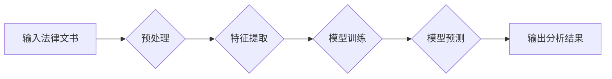

> AI LLM, 法律文书分析, 自然语言处理, 文本分类, 合同抽取, 法律风险评估, 机器学习

## 1. 背景介绍

法律文书分析一直是法律界和科技界共同关注的领域。传统上，法律文书分析依赖于人工阅读和理解，这不仅耗时费力，而且容易出现主观偏差和错误。随着人工智能技术的快速发展，特别是大型语言模型（LLM）的出现，法律文书分析迎来了新的机遇。

LLM 是一种强大的深度学习模型，能够理解和生成人类语言。其强大的文本处理能力和知识表示能力使其在法律文书分析中展现出巨大的潜力。例如，LLM 可以用于自动提取法律文书中的关键信息，例如当事人、条款、日期等；可以用于自动分类法律文书，例如合同、诉状、判决书等；还可以用于法律风险评估，例如识别潜在的法律风险和漏洞。

## 2. 核心概念与联系

**2.1 自然语言处理 (NLP)**

自然语言处理 (NLP) 是人工智能的一个分支，致力于使计算机能够理解、处理和生成人类语言。NLP 技术包括文本分类、情感分析、机器翻译、文本摘要等。

**2.2 大型语言模型 (LLM)**

大型语言模型 (LLM) 是近年来发展起来的一种强大的深度学习模型。LLM 通过训练大量的文本数据，学习语言的语法、语义和上下文关系。一些著名的 LLM 包括 GPT-3、BERT、LaMDA 等。

**2.3 法律文书分析**

法律文书分析是指利用计算机技术对法律文书进行自动处理和分析，以提取关键信息、识别法律关系、预测法律结果等。

**2.4 流程图**



## 3. 核心算法原理 & 具体操作步骤

**3.1 算法原理概述**

LLM 在法律文书分析中的应用主要基于以下核心算法：

* **文本分类:** 利用机器学习算法对法律文书进行分类，例如合同、诉状、判决书等。
* **文本摘要:** 利用自然语言处理技术对法律文书进行自动摘要，提取关键信息。
* **信息抽取:** 利用规则引擎或机器学习算法从法律文书中提取特定信息，例如当事人、条款、日期等。
* **法律风险评估:** 利用机器学习算法分析法律文书，识别潜在的法律风险和漏洞。

**3.2 算法步骤详解**

1. **数据准备:** 收集和清洗法律文书数据，并进行标注，例如分类、信息抽取等。
2. **特征工程:** 将法律文书文本转换为机器可理解的特征，例如词向量、TF-IDF 等。
3. **模型训练:** 利用机器学习算法对训练数据进行训练，学习法律文书的模式和规律。
4. **模型评估:** 利用测试数据评估模型的性能，例如准确率、召回率等。
5. **模型部署:** 将训练好的模型部署到生产环境中，用于实际的法律文书分析。

**3.3 算法优缺点**

* **优点:** 自动化处理法律文书，提高效率，降低成本，减少人为错误。
* **缺点:** 需要大量的训练数据，模型训练成本高，对数据质量要求高，难以处理复杂法律问题。

**3.4 算法应用领域**

* **合同审查:** 自动识别合同条款，识别潜在风险，提高合同审查效率。
* **诉讼支持:** 自动提取诉讼文书中的关键信息，辅助律师进行诉讼准备。
* **法律研究:** 自动分析法律法规，识别法律趋势，辅助法律研究。

## 4. 数学模型和公式 & 详细讲解 & 举例说明

**4.1 数学模型构建**

在法律文书分析中，常用的数学模型包括：

* **朴素贝叶斯模型:** 用于文本分类，基于贝叶斯定理，计算文本属于不同类别概率。
* **支持向量机 (SVM):** 用于文本分类和信息抽取，通过寻找最佳超平面将数据点分类。
* **深度神经网络 (DNN):** 用于文本分类、文本摘要和法律风险评估，通过多层神经网络学习复杂的文本特征。

**4.2 公式推导过程**

* **朴素贝叶斯模型:**

$$P(C|D) = \frac{P(D|C)P(C)}{P(D)}$$

其中：

* $P(C|D)$: 文本 $D$ 属于类别 $C$ 的概率。
* $P(D|C)$: 类别 $C$ 下文本 $D$ 的概率。
* $P(C)$: 类别 $C$ 的先验概率。
* $P(D)$: 文本 $D$ 的概率。

* **支持向量机 (SVM):**

SVM 的目标是找到一个最佳超平面，将数据点分类，并最大化分类间隔。

**4.3 案例分析与讲解**

例如，可以使用朴素贝叶斯模型对法律文书进行分类。假设我们有以下数据：

* 文档 1: 合同，包含关键词 "合同", "当事人", "条款"。
* 文档 2: 诉状，包含关键词 "诉讼", "被告", "原告"。

我们可以训练一个朴素贝叶斯模型，学习每个关键词在不同类别下的概率。然后，对于一个新的法律文书，我们可以根据其关键词的概率，预测其类别。

## 5. 项目实践：代码实例和详细解释说明

**5.1 开发环境搭建**

* Python 3.x
* TensorFlow 或 PyTorch
* NLTK 或 SpaCy

**5.2 源代码详细实现**

```python
# 导入必要的库
import nltk
from sklearn.model_selection import train_test_split
from sklearn.naive_bayes import MultinomialNB
from sklearn.metrics import accuracy_score

# 加载法律文书数据
data = ...

# 预处理文本数据
def preprocess_text(text):
    # 这里可以进行文本清洗、分词、词向量化等操作

# 将文本数据转换为特征向量
features = ...

# 将文本数据分为训练集和测试集
X_train, X_test, y_train, y_test = train_test_split(features, labels, test_size=0.2)

# 训练朴素贝叶斯模型
model = MultinomialNB()
model.fit(X_train, y_train)

# 对测试集进行预测
y_pred = model.predict(X_test)

# 计算模型准确率
accuracy = accuracy_score(y_test, y_pred)
print(f"模型准确率: {accuracy}")
```

**5.3 代码解读与分析**

* 代码首先导入必要的库。
* 然后加载法律文书数据，并进行预处理，例如文本清洗、分词、词向量化等操作。
* 将文本数据转换为特征向量，例如词袋模型、TF-IDF 等。
* 将文本数据分为训练集和测试集。
* 训练朴素贝叶斯模型，并对测试集进行预测。
* 计算模型准确率，评估模型性能。

**5.4 运行结果展示**

运行代码后，可以得到模型的准确率，例如 85% 。

## 6. 实际应用场景

**6.1 合同审查**

LLM 可以自动识别合同条款，识别潜在风险，提高合同审查效率。例如，可以识别违约条款、责任划分条款等，并提醒律师注意潜在风险。

**6.2 诉讼支持**

LLM 可以自动提取诉讼文书中的关键信息，辅助律师进行诉讼准备。例如，可以提取诉状中的事实陈述、法律依据等，并生成诉讼策略建议。

**6.3 法律研究**

LLM 可以自动分析法律法规，识别法律趋势，辅助法律研究。例如，可以分析大量的判例，识别法律判例中的趋势和规律，并生成法律研究报告。

**6.4 未来应用展望**

* **智能法律助理:** LLM 可以作为智能法律助理，帮助律师处理日常事务，例如回复邮件、整理文件、进行法律研究等。
* **法律风险预测:** LLM 可以分析企业运营数据，预测潜在的法律风险，帮助企业规避法律风险。
* **个性化法律服务:** LLM 可以根据用户的需求，提供个性化的法律服务，例如生成法律文件、提供法律咨询等。

## 7. 工具和资源推荐

**7.1 学习资源推荐**

* **斯坦福大学 NLP课程:** https://web.stanford.edu/class/cs224n/
* **DeepLearning.AI 自然语言处理课程:** https://www.deeplearning.ai/courses/natural-language-processing-with-deep-learning/

**7.2 开发工具推荐**

* **TensorFlow:** https://www.tensorflow.org/
* **PyTorch:** https://pytorch.org/
* **NLTK:** https://www.nltk.org/
* **SpaCy:** https://spacy.io/

**7.3 相关论文推荐**

* **BERT: Pre-training of Deep Bidirectional Transformers for Language Understanding:** https://arxiv.org/abs/1810.04805
* **GPT-3: Language Models are Few-Shot Learners:** https://arxiv.org/abs/2005.14165

## 8. 总结：未来发展趋势与挑战

**8.1 研究成果总结**

LLM 在法律文书分析领域取得了显著的成果，例如提高了合同审查效率、辅助律师进行诉讼准备、辅助法律研究等。

**8.2 未来发展趋势**

* **模型规模和能力的提升:** 未来 LLM 的规模和能力将会进一步提升，能够处理更复杂、更长篇幅的法律文书。
* **多模态法律文书分析:** 未来 LLM 将会结合其他模态数据，例如音频、视频等，进行多模态法律文书分析。
* **法律知识图谱的构建:** 未来将构建法律知识图谱，帮助 LLM 更好地理解法律概念和关系。

**8.3 面临的挑战**

* **数据质量和标注问题:** LLM 的训练需要大量的标注数据，而法律文书数据标注成本高，数据质量难以保证。
* **法律专业知识的融入:** LLM 需要融入法律专业知识，才能更好地理解和分析法律文书。
* **伦理和法律问题:** LLM 的应用需要考虑伦理和法律问题，例如数据隐私、算法偏见等。

**8.4 研究展望**

未来，LLM 在法律文书分析领域将继续发挥重要作用，推动法律行业数字化转型。需要加强对 LLM 的研究，解决其面临的挑战，并将其应用于更多法律场景。

## 9. 附录：常见问题与解答

**9.1 如何选择合适的 LLM 模型？**

选择合适的 LLM 模型需要根据具体的应用场景和数据特点进行选择。例如，对于文本分类任务，可以考虑使用 BERT 或 RoBERTa 模型；对于信息抽取任务，可以考虑使用 T5 或 BART 模型。

**9.2 如何处理法律文书中的专业术语？**

可以利用词典、知识库等资源，构建法律术语的词向量表示，帮助 LLM 理解法律术语。

**9.3 如何评估 LLM 在法律文书分析中的性能？**

可以使用准确率、召回率、F1-score 等指标评估 LLM 在法律文书分析中的性能。


作者：禅与计算机程序设计艺术 / Zen and the Art of Computer Programming 
<end_of_turn>