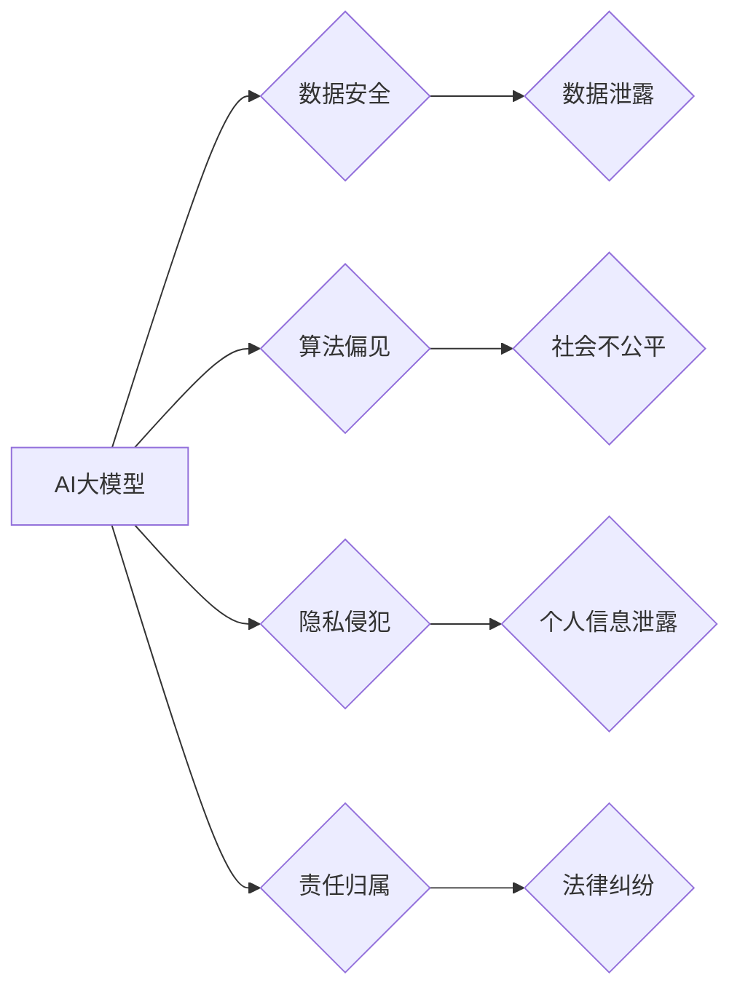

> AI大模型，监管风险，伦理问题，数据安全，法律合规，商业模式，创业策略

## 1. 背景介绍

近年来，人工智能（AI）技术取得了飞速发展，特别是大模型的涌现，为各行各业带来了前所未有的机遇。从自然语言处理到图像识别，从药物研发到金融风控，AI大模型正在深刻地改变着我们的生活和工作方式。

然而，伴随着AI大模型的快速发展，其带来的监管风险也日益凸显。这些风险涉及到伦理、安全、隐私、公平等多个方面，对AI创业者和企业提出了严峻的挑战。

## 2. 核心概念与联系

**2.1 AI大模型**

AI大模型是指在海量数据上训练的具有强大泛化能力的深度学习模型。它们通常拥有数十亿甚至数千亿的参数，能够处理复杂的任务，并生成高质量的输出。

**2.2 监管风险**

监管风险是指AI大模型在开发、部署和使用过程中可能面临的法律、法规、伦理和社会规范等方面的风险。

**2.3 核心概念联系**

AI大模型的强大能力也带来了潜在的风险，例如：

* **算法偏见:** 训练数据中的偏见可能会导致模型输出结果存在偏差，从而加剧社会不公平。
* **数据安全:** AI大模型的训练和使用需要大量数据，数据泄露或滥用可能造成严重后果。
* **隐私侵犯:** AI大模型可以识别和分析个人信息，可能导致隐私泄露和侵犯。
* **责任归属:** 当AI大模型导致负面后果时，责任归属问题难以界定。

**2.4  Mermaid 流程图**



## 3. 核心算法原理 & 具体操作步骤

**3.1 算法原理概述**

AI大模型的训练通常基于深度学习算法，例如Transformer、BERT等。这些算法通过多层神经网络结构，学习数据中的复杂模式和关系，从而实现对数据的理解和生成。

**3.2 算法步骤详解**

1. **数据预处理:** 收集和清洗训练数据，将其转换为模型可理解的格式。
2. **模型构建:** 根据任务需求选择合适的深度学习模型架构，并设置模型参数。
3. **模型训练:** 使用训练数据训练模型，通过调整模型参数，使模型输出结果与真实值尽可能接近。
4. **模型评估:** 使用测试数据评估模型的性能，并根据评估结果进行模型调优。
5. **模型部署:** 将训练好的模型部署到实际应用场景中，用于处理用户请求。

**3.3 算法优缺点**

**优点:**

* 强大的泛化能力，能够处理复杂的任务。
* 学习能力强，能够从海量数据中提取有价值的信息。
* 可持续改进，通过不断训练和更新模型，可以不断提升性能。

**缺点:**

* 训练成本高，需要大量计算资源和时间。
* 容易受到训练数据的影响，存在算法偏见和数据安全风险。
* 模型解释性差，难以理解模型的决策过程。

**3.4 算法应用领域**

* 自然语言处理：机器翻译、文本摘要、聊天机器人等。
* 图像识别：物体检测、图像分类、人脸识别等。
* 语音识别：语音转文本、语音助手等。
* 药物研发：药物发现、药物设计等。
* 金融风控：欺诈检测、风险评估等。

## 4. 数学模型和公式 & 详细讲解 & 举例说明

**4.1 数学模型构建**

AI大模型的训练过程可以看作是一个优化问题，目标是找到模型参数，使得模型输出结果与真实值之间的误差最小。

**4.2 公式推导过程**

常用的损失函数包括均方误差（MSE）、交叉熵损失（Cross-Entropy Loss）等。

**均方误差（MSE）:**

$$MSE = \frac{1}{n} \sum_{i=1}^{n} (y_i - \hat{y}_i)^2$$

其中：

* $y_i$ 是真实值
* $\hat{y}_i$ 是模型预测值
* $n$ 是样本数量

**交叉熵损失（Cross-Entropy Loss）:**

$$Cross-Entropy Loss = -\sum_{i=1}^{n} y_i \log(\hat{y}_i)$$

其中：

* $y_i$ 是真实值（one-hot编码）
* $\hat{y}_i$ 是模型预测值（概率分布）

**4.3 案例分析与讲解**

例如，在图像分类任务中，可以使用交叉熵损失函数来衡量模型预测结果与真实标签之间的差异。

## 5. 项目实践：代码实例和详细解释说明

**5.1 开发环境搭建**

使用Python语言和深度学习框架TensorFlow或PyTorch搭建开发环境。

**5.2 源代码详细实现**

```python
import tensorflow as tf

# 定义模型架构
model = tf.keras.models.Sequential([
    tf.keras.layers.Conv2D(32, (3, 3), activation='relu', input_shape=(28, 28, 1)),
    tf.keras.layers.MaxPooling2D((2, 2)),
    tf.keras.layers.Conv2D(64, (3, 3), activation='relu'),
    tf.keras.layers.MaxPooling2D((2, 2)),
    tf.keras.layers.Flatten(),
    tf.keras.layers.Dense(10, activation='softmax')
])

# 定义损失函数和优化器
model.compile(loss='sparse_categorical_crossentropy', optimizer='adam', metrics=['accuracy'])

# 训练模型
model.fit(x_train, y_train, epochs=10)

# 评估模型
loss, accuracy = model.evaluate(x_test, y_test)
print('Test loss:', loss)
print('Test accuracy:', accuracy)
```

**5.3 代码解读与分析**

这段代码定义了一个简单的卷积神经网络模型，用于手写数字识别任务。

* `tf.keras.models.Sequential` 创建了一个顺序模型，层级结构清晰。
* `tf.keras.layers.Conv2D` 定义卷积层，提取图像特征。
* `tf.keras.layers.MaxPooling2D` 定义最大池化层，降低特征维度。
* `tf.keras.layers.Flatten` 将多维特征转换为一维向量。
* `tf.keras.layers.Dense` 定义全连接层，进行分类。
* `model.compile` 配置模型训练参数，包括损失函数、优化器和评价指标。
* `model.fit` 训练模型，使用训练数据进行迭代训练。
* `model.evaluate` 评估模型，使用测试数据计算损失和准确率。

**5.4 运行结果展示**

训练完成后，模型可以用于识别新的手写数字图像。

## 6. 实际应用场景

**6.1 自然语言处理**

* **机器翻译:** 将一种语言翻译成另一种语言，例如Google Translate。
* **文本摘要:** 自动生成文本的简短摘要，例如新闻文章的摘要。
* **聊天机器人:** 与用户进行自然语言对话，例如客服机器人。

**6.2 图像识别**

* **物体检测:** 在图像中识别和定位物体，例如自动驾驶汽车中的物体检测。
* **图像分类:** 将图像分类到不同的类别，例如猫狗识别。
* **人脸识别:** 在图像中识别和验证人脸，例如手机解锁。

**6.3 语音识别**

* **语音转文本:** 将语音转换为文本，例如语音助手。
* **语音识别:** 将语音识别为特定的命令或指令，例如智能家居设备。

**6.4 其他应用场景**

* **药物研发:** 预测药物的活性，加速药物发现过程。
* **金融风控:** 检测欺诈交易，评估风险。
* **医疗诊断:** 辅助医生诊断疾病，提高诊断准确率。

**6.5 未来应用展望**

AI大模型的应用场景还在不断扩展，未来将更加广泛地应用于各个领域，例如：

* **个性化教育:** 根据学生的学习情况提供个性化的学习方案。
* **智能制造:** 自动化生产流程，提高生产效率。
* **智慧城市:** 利用AI技术提高城市管理效率和居民生活质量。

## 7. 工具和资源推荐

**7.1 学习资源推荐**

* **书籍:**
    * 深度学习
    * 人工智能：一个现代方法
* **在线课程:**
    * Coursera: 深度学习
    * Udacity: AI编程
* **开源项目:**
    * TensorFlow
    * PyTorch

**7.2 开发工具推荐**

* **深度学习框架:** TensorFlow, PyTorch
* **编程语言:** Python
* **云计算平台:** AWS, Azure, GCP

**7.3 相关论文推荐**

* Attention Is All You Need
* BERT: Pre-training of Deep Bidirectional Transformers for Language Understanding

## 8. 总结：未来发展趋势与挑战

**8.1 研究成果总结**

近年来，AI大模型取得了显著的进展，在多个领域展现出强大的应用潜力。

**8.2 未来发展趋势**

* 模型规模和能力将继续提升，模型参数数量将达到万亿级甚至更高。
* 模型训练效率将得到提高，训练时间和成本将大幅降低。
* 模型解释性和可解释性将得到加强，使模型决策更加透明和可信。
* AI大模型将更加广泛地应用于各个领域，带来更多创新和变革。

**8.3 面临的挑战**

* 监管风险：AI大模型的应用需要遵守法律法规，避免带来伦理和社会问题。
* 数据安全：AI大模型的训练和使用需要大量数据，数据泄露和滥用可能造成严重后果。
* 算法偏见：训练数据中的偏见可能会导致模型输出结果存在偏差，加剧社会不公平。
* 计算资源需求：训练大型AI模型需要大量的计算资源，成本较高。

**8.4 研究展望**

未来研究方向包括：

* 开发更安全、更可靠、更可解释的AI大模型。
* 探索新的训练方法和算法，提高模型效率和性能。
* 研究AI大模型的伦理和社会影响，制定相应的规范和政策。


## 9. 附录：常见问题与解答

**9.1 如何应对AI大模型的监管风险？**

* 遵守相关法律法规，确保AI大模型的开发和使用符合规范。
* 进行风险评估，识别潜在的风险，并采取相应的措施进行控制。
* 加强数据安全保护，防止数据泄露和滥用。
* 关注AI大模型的伦理问题，避免造成社会不公平和伤害。

**9.2 如何解决AI大模型的算法偏见问题？**

* 使用更加多样化和代表性的训练数据。
* 开发算法去偏见的方法，例如公平学习。
* 对模型输出结果进行监控和评估，及时发现和解决偏见问题。

**9.3 如何提高AI大模型的训练效率？**

* 使用更有效的训练算法和优化器。
* 利用分布式训练技术，将模型训练任务分摊到多个机器上。
* 探索新的硬件架构，例如GPU和TPU，提高计算能力。


作者：禅与计算机程序设计艺术 / Zen and the Art of Computer Programming 
<end_of_turn>