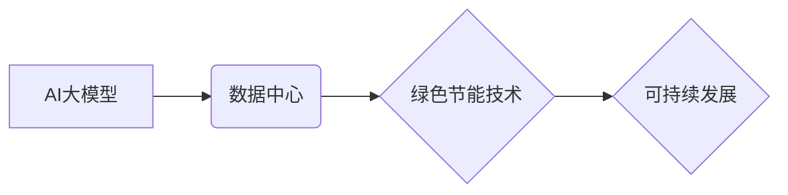

> AI大模型、数据中心、绿色节能、能源效率、可持续发展、人工智能、深度学习、云计算

## 1. 背景介绍

随着人工智能（AI）技术的飞速发展，大规模人工智能模型（AI大模型）的应用日益广泛，涵盖了自然语言处理、计算机视觉、语音识别等多个领域。这些模型的训练和部署都需要大量的计算资源和能源消耗，这给数据中心建设带来了新的挑战。

传统数据中心通常采用高性能计算集群，以满足高强度计算需求。然而，这种模式往往伴随着高能耗、高碳排放等问题，不利于可持续发展。因此，如何构建高效、节能、环保的AI大模型应用数据中心成为当前研究的热点。

## 2. 核心概念与联系

**2.1 AI大模型与数据中心**

AI大模型是指参数规模庞大、训练数据海量的人工智能模型，其强大的计算能力和学习能力使其在各种应用场景中展现出巨大的潜力。数据中心作为提供计算资源和存储空间的基础设施，是AI大模型训练和部署的必备条件。

**2.2 绿色节能与可持续发展**

绿色节能是指通过提高能源利用效率、减少能源消耗和污染排放，实现经济发展与环境保护的协调发展。可持续发展是指满足当前需求，同时不损害后代满足其自身需求的能力。

**2.3 数据中心绿色节能技术**

数据中心绿色节能技术旨在通过优化硬件、软件和管理方式，降低数据中心的能耗和碳排放。常见的绿色节能技术包括：

* **高效硬件设备:** 使用节能型服务器、存储设备和网络设备。
* **虚拟化技术:** 通过虚拟化技术，提高硬件资源利用率，减少硬件设备数量。
* **云计算技术:** 利用云计算平台的资源共享和弹性伸缩能力，优化资源配置，降低能耗。
* **热能回收技术:** 利用数据中心产生的热能进行余热利用，例如供暖或制冷。
* **智能管理系统:** 通过智能监控和控制系统，优化数据中心运行参数，降低能耗。

**2.4 核心概念关系图**



## 3. 核心算法原理 & 具体操作步骤

**3.1 算法原理概述**

数据中心绿色节能算法主要基于以下原理：

* **预测性维护:** 通过分析设备运行数据，预测设备故障，提前进行维护，避免设备故障导致的能源浪费。
* **动态资源调度:** 根据实际需求动态分配计算资源，避免资源闲置浪费。
* **智能冷却系统:** 根据数据中心温度和湿度情况，智能控制冷却系统，降低能耗。
* **能源管理优化:** 通过优化数据中心能源使用策略，降低整体能耗。

**3.2 算法步骤详解**

1. **数据采集:** 收集数据中心设备运行数据、环境数据等。
2. **数据预处理:** 对采集到的数据进行清洗、转换、格式化等处理。
3. **模型训练:** 利用机器学习算法，对数据进行训练，建立预测模型。
4. **模型预测:** 将预测模型应用于实际场景，预测设备故障、资源需求等。
5. **决策执行:** 根据预测结果，执行相应的决策，例如进行设备维护、动态调度资源等。
6. **结果评估:** 对决策结果进行评估，不断优化模型和策略。

**3.3 算法优缺点**

**优点:**

* 能效提升显著
* 降低运营成本
* 减少碳排放
* 提高数据中心可靠性

**缺点:**

* 需要大量数据进行训练
* 模型精度需要不断优化
* 系统部署和维护成本较高

**3.4 算法应用领域**

* 数据中心能源管理
* 数据中心故障预测
* 数据中心资源调度
* 数据中心环境监控

## 4. 数学模型和公式 & 详细讲解 & 举例说明

**4.1 数学模型构建**

数据中心绿色节能算法可以构建以下数学模型：

* **能耗模型:**  预测数据中心能耗，例如：

$$
E = f(T, P, V)
$$

其中：

* $E$：数据中心能耗
* $T$：数据中心温度
* $P$：数据中心功耗
* $V$：数据中心运行时间

* **资源利用率模型:** 评估数据中心资源利用率，例如：

$$
R = \frac{U}{C}
$$

其中：

* $R$：资源利用率
* $U$：实际使用资源
* $C$：总资源容量

**4.2 公式推导过程**

能耗模型和资源利用率模型的推导过程通常需要结合实际数据和经验，通过统计分析、回归分析等方法建立。

**4.3 案例分析与讲解**

假设一个数据中心，其温度为25℃，功耗为100kW，运行时间为24小时。根据能耗模型，可以计算出该数据中心的能耗为：

$$
E = f(25, 100, 24)
$$

假设该数据中心的总资源容量为1000，实际使用资源为500。根据资源利用率模型，可以计算出该数据中心的资源利用率为：

$$
R = \frac{500}{1000} = 0.5
$$

## 5. 项目实践：代码实例和详细解释说明

**5.1 开发环境搭建**

* 操作系统：Linux
* 编程语言：Python
* 库依赖：pandas, numpy, scikit-learn

**5.2 源代码详细实现**

```python
import pandas as pd
from sklearn.linear_model import LinearRegression

# 数据加载
data = pd.read_csv('energy_data.csv')

# 数据预处理
X = data[['temperature', 'power_consumption']]
y = data['energy_consumption']

# 模型训练
model = LinearRegression()
model.fit(X, y)

# 模型预测
new_data = pd.DataFrame({'temperature': [25], 'power_consumption': [100]})
predicted_energy = model.predict(new_data)

# 结果输出
print(f'预测能耗: {predicted_energy[0]}')
```

**5.3 代码解读与分析**

* 代码首先加载数据，并进行数据预处理，将特征数据和目标数据分离。
* 然后，使用线性回归模型进行模型训练，训练模型的参数。
* 最后，使用训练好的模型对新的数据进行预测，输出预测结果。

**5.4 运行结果展示**

运行代码后，将输出预测能耗的值。

## 6. 实际应用场景

**6.1 数据中心能源管理**

AI大模型可以用于预测数据中心能耗，优化能源使用策略，降低能耗成本。

**6.2 数据中心故障预测**

AI大模型可以分析设备运行数据，预测设备故障，提前进行维护，避免设备故障导致的能源浪费。

**6.3 数据中心资源调度**

AI大模型可以根据实际需求动态调度计算资源，提高资源利用率，降低能耗。

**6.4 未来应用展望**

随着AI技术的不断发展，AI大模型在数据中心绿色节能领域的应用将更加广泛，例如：

* 更精准的能耗预测
* 更智能的资源调度
* 更高效的热能回收
* 更全面的环境监控

## 7. 工具和资源推荐

**7.1 学习资源推荐**

* TensorFlow: https://www.tensorflow.org/
* PyTorch: https://pytorch.org/
* Keras: https://keras.io/

**7.2 开发工具推荐**

* Jupyter Notebook: https://jupyter.org/
* Anaconda: https://www.anaconda.com/

**7.3 相关论文推荐**

* [Towards Green AI: Reducing the Environmental Impact of Machine Learning](https://arxiv.org/abs/2107.06079)
* [Energy-Efficient Machine Learning: A Survey](https://arxiv.org/abs/2004.08882)

## 8. 总结：未来发展趋势与挑战

**8.1 研究成果总结**

AI大模型在数据中心绿色节能领域取得了显著成果，例如能耗预测、故障预测、资源调度等方面取得了突破。

**8.2 未来发展趋势**

未来，AI大模型在数据中心绿色节能领域的应用将更加广泛，例如：

* 更精准的能耗预测
* 更智能的资源调度
* 更高效的热能回收
* 更全面的环境监控

**8.3 面临的挑战**

* 数据质量和可用性
* 模型训练成本和时间
* 模型解释性和可信度
* 标准化和规范化

**8.4 研究展望**

未来研究方向包括：

* 开发更精准、更鲁棒的AI大模型
* 探索新的绿色节能算法和技术
* 建立数据中心绿色节能的标准和规范
* 推动AI大模型在数据中心绿色节能领域的应用推广

## 9. 附录：常见问题与解答

**9.1 如何选择合适的AI大模型？**

选择合适的AI大模型需要考虑以下因素：

* 数据规模和类型
* 预测精度要求
* 计算资源限制
* 模型复杂度

**9.2 如何评估AI大模型的性能？**

评估AI大模型的性能可以使用以下指标：

* 均方误差 (MSE)
* 平均绝对误差 (MAE)
* R-squared

**9.3 如何部署AI大模型到数据中心？**

部署AI大模型到数据中心需要考虑以下因素：

* 硬件资源
* 软件环境
* 安全性和可靠性


作者：禅与计算机程序设计艺术 / Zen and the Art of Computer Programming 
<end_of_turn>